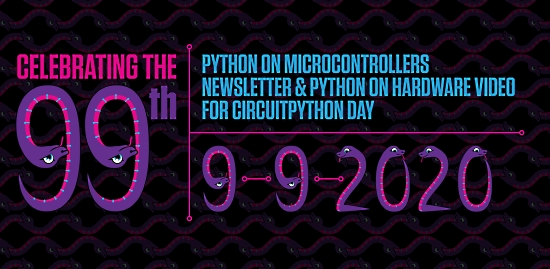
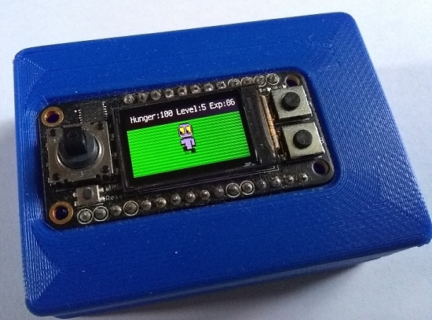
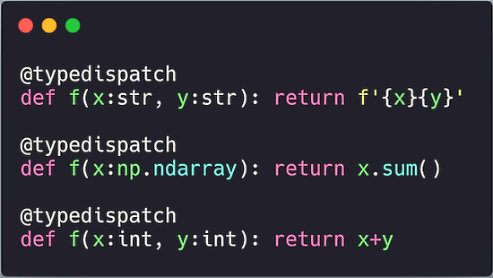
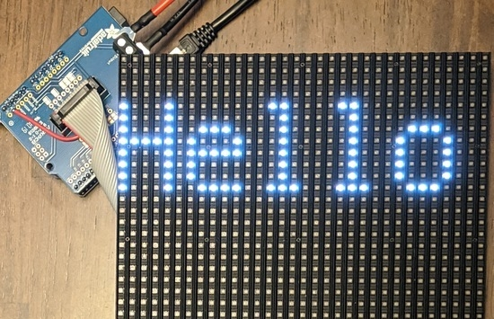

- [X] Kattni updates
- [ ] change date
- [ ] update title
- [ ] Feature story
- [ ] Update  for images
- [ ] Update ICYDNCI
- [ ] All images 550w max only
- [ ] Link "View this email in your browser."

Template last updated on 08-31-2020 by Anne - slight tweaks

View this email in your browser.

Hi everyone! It's the latest Python for Microcontrollers newsletter, brought you by the community! We're on [Discord](https://discord.gg/HYqvREz), [Twitter](https://twitter.com/search?q=circuitpython&src=typed_query&f=live), and for past newsletters - [view them all here](https://www.adafruitdaily.com/category/circuitpython/). If you're reading this on the web, [subscribe here](https://www.adafruitdaily.com/). Let's get started!

## CircuitPython Day is Tomorrow 9-9-2020

Tomorrow, September 9, 2020 (9/9/2020), is CircuitPython Day, the day in which Adafruit and the community worldwide celebrate CircuitPython. Happenings and events include a CircuitPython team livestream, collaboration with hardware and software folks, and highlighting all things Python and Python on Hardware.

This year CircuitPython Day is being dedicated to Lamba Labs Makerspace, who are helping during the Beirut disaster.

More information on CircuitPython Day is forthcoming. Ideas? Send them via email to circuitpythonday@adafruit.com and add your event to the working calendar - [GitHub](https://github.com/adafruit/circuitpython-weekly-newsletter/blob/gh-pages/circuitpythonday2020.md).

## The 99th Newsletter and Python on Hardware Video

This issue, corresponding to CircuitPython Day, is the 99th issue of both this newsletter and the accompanying Python on Hardware Video produced fron newsletter contents. 99 is just the snakiest number to have things coincide with CircuitPython Day on 9-9!

- [See the archive of all newsletters here](https://www.adafruitdaily.com/category/circuitpython/).
- [See the archive of all the Python on Hardware videos here](http://adafru.it/pohepisodes).

## A New Version of MicroPython Released

A new version of MicroPython has just been released: Version 1.13. It includes a new uasyncio module, code formatting, and BTstack bindings with Unix support. For the ESP8266, the default filesystem has changed from FAT to littlefs v2 - [MicroPython Release Notes](https://github.com/micropython/micropython/releases/tag/v1.13).

## CircuitPython Deep Dive Stream with Scott Shawcroft

[This past week](https://youtu.be/aMZRT3GZdgU), Scott streams his work on a Requests recap and ESP32-S2 PR iteration.

You can see the latest video and past videos on the Adafruit YouTube channel under the Deep Dive playlist - [YouTube](https://www.youtube.com/playlist?list=PLjF7R1fz_OOXBHlu9msoXq2jQN4JpCk8A).

**Note:** Scott's Deep Dive this week will be on CircuitPython Day, Wednesday September 9th at 5pm to 7 pm (1700 to 1900) US Eastern Time.

## Adafruit Update

**Adafruit is shipping orders!**

Adafruit is stocked and shipping orders!

Now is the best time to get orders in for your favorite products, including items for students.

Science is fun and educational when using Adafruit parts and free, easy to follow tutorials in the [Adafruit Learning System](https://learn.adafruit.com/).

[Shop Adafruit now](https://www.adafruit.com/)

## News from around the web!

North Woods DevStudio writes:

> I saw the TFT/Joystick FeatherWing and I just needed to make a virtual pet with it. After mixing together a [Feather M4 Express](https://www.adafruit.com/product/3857), [TFT/Joystick FeatherWing](https://www.adafruit.com/product/3321) and some code, Companion Bot was born. He’s too cute and fun to keep him just to myself. In celebration of CircuitPython Day I made him public. Enjoy Companion Bot as he chats, dances, shop, fights and plays cards.

More - [GitHub]().

fastcore: An Underrated Python Library - a unique Python library that extends the Python programming language and provides utilities that enhance productivity - [dastpages](https://fastpages.fast.ai/fastcore/).

**#ICYDNCI What was the most popular, most clicked link, in [last week's newsletter](https://link)? [title](url).**

## Made with Mu

Why Mu? Mu tries to make it as easy as possible to get started with programming but aims to help you graduate to "real" development tools soon after. Everything in Mu is the "real thing" but presented in as simple and obvious way possible. It's like the toddling stage in learning to walk: you're finding your feet and once you're confident, you should move on and explore! Put simply, Mu aims to foster autonomy. Try out Mu today! - [codewith.mu](https://codewith.mu/)

## New Boards Supported by CircuitPython

The number of supported microcontrollers and Single Board Computers (SBC) grows every week. This section outlines which boards have been included in CircuitPython or added to [CircuitPython.org](https://circuitpython.org/).

This week we had X new boards added!

- [Board name](url)

Looking for adding a new board to CircuitPython? It's highly encouraged! Adafruit has four guides to help you do so:

- [How to Add a New Board to CircuitPython](https://learn.adafruit.com/how-to-add-a-new-board-to-circuitpython/overview)
- [How to add a New Board to the circuitpython.org website](https://learn.adafruit.com/how-to-add-a-new-board-to-the-circuitpython-org-website)
- [Adding a Single Board Computer to PlatformDetect for Blinka](https://learn.adafruit.com/adding-a-single-board-computer-to-platformdetect-for-blinka)
- [Adding a Single Board Computer to Blinka](https://learn.adafruit.com/adding-a-single-board-computer-to-blinka)

## New Learn Guides!

[Busy Box Interruption Sign](https://learn.adafruit.com/busy-box-interruption-sign) from [Noe and Pedro](https://learn.adafruit.com/users/pixil3d)

[CLUE Rock, Paper, Scissors Game using Bluetooth](https://learn.adafruit.com/rock-paper-scissors-circuitpython) from [Kevin Walters](https://learn.adafruit.com/users/kevinjwalters)

## Updated Learn Guides!

[Adafruit DRV8833 DC/Stepper Motor Driver Breakout Board](https://learn.adafruit.com/adafruit-drv8833-dc-stepper-motor-driver-breakout-board) from [Kattni](https://learn.adafruit.com/users/kattni)

[Adafruit TB6612 1.2A DC/Stepper Motor Driver Breakout Board](https://learn.adafruit.com/adafruit-tb6612-h-bridge-dc-stepper-motor-driver-breakout) from [Kattni](https://learn.adafruit.com/users/kattni)

## CircuitPython Libraries!

CircuitPython support for hardware continues to grow. We are adding support for new sensors and breakouts all the time, as well as improving on the drivers we already have. As we add more libraries and update current ones, you can keep up with all the changes right here!

For the latest libraries, download the [Adafruit CircuitPython Library Bundle](https://circuitpython.org/libraries). For the latest community contributed libraries, download the [CircuitPython Community Bundle](https://github.com/adafruit/CircuitPython_Community_Bundle/releases).

If you'd like to contribute, CircuitPython libraries are a great place to start. Have an idea for a new driver? File an issue on [CircuitPython](https://github.com/adafruit/circuitpython/issues)! Have you written a library you'd like to make available? Submit it to the [CircuitPython Community Bundle](https://github.com/adafruit/CircuitPython_Community_Bundle). Interested in helping with current libraries? Check out the [CircuitPython.org Contributing page](https://circuitpython.org/contributing). We've included open pull requests and issues from the libraries, and details about repo-level issues that need to be addressed. We have a guide on [contributing to CircuitPython with Git and Github](https://learn.adafruit.com/contribute-to-circuitpython-with-git-and-github) if you need help getting started. You can also find us in the #circuitpython channel on the [Adafruit Discord](https://adafru.it/discord).

You can check out this [list of all the Adafruit CircuitPython libraries and drivers available](https://github.com/adafruit/Adafruit_CircuitPython_Bundle/blob/master/circuitpython_library_list.md). 

The current number of CircuitPython libraries is **267**!

**Updated Libraries!**

Here's this week's updated CircuitPython libraries:

 * [Adafruit_CircuitPython_IS31FL3731](https://github.com/adafruit/Adafruit_CircuitPython_IS31FL3731)
 * [Adafruit_CircuitPython_BLE_Adafruit](https://github.com/adafruit/Adafruit_CircuitPython_BLE_Adafruit)
 * [Adafruit_CircuitPython_DPS310](https://github.com/adafruit/Adafruit_CircuitPython_DPS310)
 * [Adafruit_CircuitPython_Requests](https://github.com/adafruit/Adafruit_CircuitPython_Requests)
 * [Adafruit_CircuitPython_MCP230xx](https://github.com/adafruit/Adafruit_CircuitPython_MCP230xx)
 * [Adafruit_CircuitPython_seesaw](https://github.com/adafruit/Adafruit_CircuitPython_seesaw)
 * [Adafruit_CircuitPython_DHT](https://github.com/adafruit/Adafruit_CircuitPython_DHT)
 * [Adafruit_CircuitPython_AdafruitIO](https://github.com/adafruit/Adafruit_CircuitPython_AdafruitIO)
 * [Adafruit_CircuitPython_ImageLoad](https://github.com/adafruit/Adafruit_CircuitPython_ImageLoad)
 * [Adafruit_CircuitPython_SSD1306](https://github.com/adafruit/Adafruit_CircuitPython_SSD1306)
 * [Adafruit_CircuitPython_Display_Text](https://github.com/adafruit/Adafruit_CircuitPython_Display_Text)
 * [Adafruit_CircuitPython_Motor](https://github.com/adafruit/Adafruit_CircuitPython_Motor)
 * [Adafruit_CircuitPython_MatrixPortal](https://github.com/adafruit/Adafruit_CircuitPython_MatrixPortal)
 * [Adafruit_CircuitPython_PyPortal](https://github.com/adafruit/Adafruit_CircuitPython_PyPortal)
 * [Adafruit_CircuitPython_ESP32SPI](https://github.com/adafruit/Adafruit_CircuitPython_ESP32SPI)
 * [Adafruit_CircuitPython_MS8607](https://github.com/adafruit/Adafruit_CircuitPython_MS8607)
 * [Adafruit_CircuitPython_Debug_I2C](https://github.com/adafruit/Adafruit_CircuitPython_Debug_I2C)
 * [Adafruit_CircuitPython_Bitmap_Font](https://github.com/adafruit/Adafruit_CircuitPython_Bitmap_Font)
 * [Adafruit_Blinka](https://github.com/adafruit/Adafruit_Blinka)

**PyPI Download Stats!**

We've written a special library called Adafruit Blinka that makes it possible to use CircuitPython Libraries on [Raspberry Pi and other compatible single-board computers](https://learn.adafruit.com/circuitpython-on-raspberrypi-linux/). Adafruit Blinka and all the CircuitPython libraries have been deployed to PyPI for super simple installation on Linux! Here are the top 10 CircuitPython libraries downloaded from PyPI in the last week, including the total downloads for those libraries:

Keep checking back for updated download stats coming soon!

## What’s the team up to this week?

What is the team up to this week? Let’s check in!

**Bryan**

The past week has been pretty productive! I’ve added a few more report types to the BNO080 library as well as the regular refactoring. Things are coming along well and it won’t be too long until I can start thinking about putting a bow on it. This is pretty exciting because I think it’s going to be a very popular sensor because it does a good job at making it easer for the user to get useful information from it, thanks to its inbuilt fusion sensor algorithms. 

The most notable part of working on the BNO080 library this week is discovering that when you have multiple sensor or motion classifier reports enabled, by default all of the available reports will be batched together into one packet and sent back together. This escaped my notice until now because the reports are simply concatenated without any additional “packaging”, so I was always able to parse the first report which gave me just enough data to make it seem like everything was working fine.

The big news in CAN land (or at least my corner of it) is that I’m now successfully sending CAN frames using the MCP2515 in CircuitPython, and they can be read and unpacked by the other devices on the bus! This is just the very first steps to getting something usable, however. There is still plenty of work to be done to bring this library up to the standard set by the existing Arduino libraries, in addition to whatever pythonification (it’s a word, look it up) is needed to make it fit within the CircuitPython ecosystem.

Later this week I’ll be working with Jeff/Jepler on sketching out the API that CAN devices of all sorts will use within CircuitPython. While I’m working with the MCP2515, he’s hard at work adding support for the CAN peripheral within the SAM-E51. Once we both get the basics of bytes flowing back and forth working, we’ll start planning a “minimum viable product” which is project manager speak for “an initial working example with no bells and a single whistle” with an implied “bell expansion pack coming soon!”

**Dan**

My initial \_bleio HCI pull request has now been revised, approved, and is merged. I've touched up the adafruit_ble library to add the ability to specify an HCI adapter. After discussion with Scott, I created a separate adafruit_airlift library to handle HCI-adapter-specific initialization, instead of embedding it in the standard adafruit_ble library.

I released CircuitPython 6.0.0-alpha.3 late last week. I reviewed Scott's pull request to add native ESP32 support for WiFi; it should be merged soon. So we'll have another release with two big new pieces of functionality shortly. The new release will probably be beta.0, since we've finished up the API changes and additions we had in mind for CircuitPython 6.0.0.

**Jeff**

What sounds like it should be simple, but turned out to take about a half week to resolve?  A couple of bugs that were reported with RGB matrices.  Once this Pull Request is merged, it will fix some bugs that community members and Adafruit folks reported.  Before the fixes, these bugs would lead to Safe Mode or crashes requiring use of the reset button.

- When RGBMatrix needs more RAM than was available, CircuitPython will now raise a MemoryError
- A display small enough that it can't even show a 1x1 terminal will work properly
- RGBMatrix Displays can now be rotated, in case you want an extra tall display, like this 64x32 matrix in portrait orientation

**Kattni**

This week I've been working with stepper motors. We have had Arduino examples for using the DRV8833 and TB6621 stepper motor driver breakouts, but no CircuitPython. Now we have both! I added a new page to both guides with wiring diagrams, library install instructions, and a full code example. If you've looking to use these drivers with CircuitPython, check out the guides to get stepping!

I also created and worked on the FeatherWing 128x64 OLED guide. It's a new Wing we released recently with double the display of the previous OLED FeatherWing. There's no CircuitPython support currently, but it is in the works. For information on pinouts, assembly, and resource downloads, check out the guide once it's published.

**Lucian**

**Melissa**

This past week was quite productive. I started out by writing the Adafruit_Python_Shell library to make converting shell scripts over to Python easier to do and maintain. I updated a couple of scripts that I had convert to use the library and they shrank to nearly 50% or their previous size.

After that I updated the MatrixPortal library and made some improvements such as adding a Middle Graphics layer so setting the background was much easier. I also exposed the network and graphics objects so I didn't need to keep adding functions in 2 places every time I added something new. I added some Adafruit IO functions to the library and updated the Adafruit IO library for CircuitPython so that all the data can be grabbed instead of just the first and last values.The reason I was adding that functionality is because I was working on a demo for John Park's workshop so we can use Adafruit IO to grab data and display it on the Matrix.

While I was working on that functionality, I decided to add a requested feature so that the ESP32SPI Wifi can now use multiple access points which can be handy if you're moving between locations. It will cycle between the different sets and is backwards compatible.

The other project I worked on was the STM32MP1 so that we can get Blinka running on it. I had put in some time a few weeks ago, but ended up putting it on hold when I couldn't get Pip running on it. After that, I was just working on it a little at time as I had some free time. I found there was a newer image than the one that came with it and so after some experimentation, I figured out how to update it using the STM32MP1 to flash the SD card. The method I found to work was not such a straightforward method, especially since the software STM32CubeProgrammer would crash on MacOS.

It turns out that there's a Command line interface core hidden inside that can be run from the terminal to write the new image. With the new image, I tried once again to get pip installed and this time I was successful. Once I knew I had a good image, I used ApplePiBaker to backup a copy and verified the image could be written just using BalenaEtcher, so we now have a much easier way to update on all systems.

**Scott**

This week I've been focused on the Requests library. I made a lot of changes to add support for HTTP 1.1, lower memory when loading JSON, and the newer wifi API introduced with the ESP32S2's native wifi. Unfortunately, I wasn't very confident that I wouldn't break existing uses.

So, I decided to write a few unit tests that verify that the requests logic works both with the new features and the old legacy API. Testing is a great way to build confidence in functionality. By running the tests every code change you also ensure that the functionality continues to work.

I've created the PR for review and will be testing it with existing projects. If (who am I kidding), when, I find bugs then I'll add additional tests to detect the bug and then fix it.

On my stream today I plan on going over my requests changes and then doing a round of iteration on my native_wifi PR based on Dan's feedback.

## Upcoming events!

PyGotham is a New York City based, eclectic, Py-centric conference covering many topics. PyGotham TV taking place October 2-3, 2020 with a single track of talks presented online - [Event Website](https://2020.pygotham.tv/).

PyCon India 2020: the premier conference in India on using and developing the Python programming language. Held online October 3-5, 2020. A [call for proposals](https://in.pycon.org/cfp/2020/proposals/) is now open through August 14, 2020. - [Website](https://in.pycon.org/2020/) and [Twitter](https://twitter.com/pyconindia)

The Hackaday Remoticon will take place everywhere November 6th – 8th, 2020. It’s a weekend packed with workshops about hardware creation, held virtually for all to enjoy - [Hackaday](https://hackaday.com/2020/08/04/hackaday-remoticon-our-2020-conference-is-packed-with-workshops-and-were-calling-for-proposals/).

**Send Your Events In**

As for other events, with the COVID pandemic, most in-person events are postponed or cancelled. If you know of virtual events or events that may occur in the future, please let us know on Discord or on Twitter with hashtag #CircuitPython.

## Latest releases

CircuitPython's stable release is [#.#.#](https://github.com/adafruit/circuitpython/releases/latest) and its unstable release is [#.#.#-##.#](https://github.com/adafruit/circuitpython/releases). New to CircuitPython? Start with our [Welcome to CircuitPython Guide](https://learn.adafruit.com/welcome-to-circuitpython).

[2020####](https://github.com/adafruit/Adafruit_CircuitPython_Bundle/releases/latest) is the latest CircuitPython library bundle.

[v#.#.#](https://micropython.org/download) is the latest MicroPython release. Documentation for it is [here](http://docs.micropython.org/en/latest/pyboard/).

[#.#.#](https://www.python.org/downloads/) is the latest Python release. The latest pre-release version is [#.#.#](https://www.python.org/download/pre-releases/).

[1818 Stars](https://github.com/adafruit/circuitpython/stargazers) Like CircuitPython? [Star it on GitHub!](https://github.com/adafruit/circuitpython)

## Call for help -- Translating CircuitPython is now easier than ever!

One important feature of CircuitPython is translated control and error messages.

With the help of fellow open source project [Weblate](https://weblate.org/), we're making it even easier to add or improve translations.

Sign in with an existing account such as Github, Google or Facebook and start contributing through a simple web interface. No forks or pull requests needed!

As always, if you run into trouble join us on [Discord](https://adafru.it/discord), we're here to help.

## jobs.adafruit.com - Find a dream job, find great candidates!

[jobs.adafruit.com](https://jobs.adafruit.com/) has returned and folks are posting their skills (including CircuitPython) and companies are looking for talented makers to join their companies - from Digi-Key, to Hackaday, Microcenter, Raspberry Pi and more.

## NUMBER thanks!

The Adafruit Discord community, where we do all our CircuitPython development in the open, reached over NUMBER humans, thank you!  Adafruit believes Discord offers a unique way for CircuitPython folks to connect. Join today at [https://adafru.it/discord](https://adafru.it/discord).

## ICYMI - In case you missed it

The wonderful world of Python on hardware! This is our first video-newsletter-podcast that we’ve started! The news comes from the Python community, Discord, Adafruit communities and more. Kattni turns the weekly news into video form for ASK an ENGINEER and Adafruit social media. The complete Python on Hardware weekly videocast [playlist is here](https://www.youtube.com/playlist?list=PLjF7R1fz_OOXRMjM7Sm0J2Xt6H81TdDev). 

This video podcast is on [iTunes](https://itunes.apple.com/us/podcast/python-on-hardware/id1451685192?mt=2), [YouTube](http://adafru.it/pohepisodes), [IGTV (Instagram TV](https://www.instagram.com/adafruit/channel/)), and [XML](https://itunes.apple.com/us/podcast/python-on-hardware/id1451685192?mt=2).

[Weekly community chat on Adafruit Discord server CircuitPython channel - Audio / Podcast edition](https://itunes.apple.com/us/podcast/circuitpython-weekly-meeting/id1451685016) - Audio from the Discord chat space for CircuitPython, meetings are usually Mondays at 2pm ET, this is the audio version on [iTunes](https://itunes.apple.com/us/podcast/circuitpython-weekly-meeting/id1451685016), Pocket Casts, [Spotify](https://adafru.it/spotify), and [XML feed](https://adafruit-podcasts.s3.amazonaws.com/circuitpython_weekly_meeting/audio-podcast.xml).

And lastly, we are working up a one-spot destination for all things podcast-able here - [podcasts.adafruit.com](https://podcasts.adafruit.com/)

## Codecademy "Learn Hardware Programming with CircuitPython"

Codecademy, an online interactive learning platform used by more than 45 million people, has teamed up with the leading manufacturer in STEAM electronics, Adafruit Industries, to create a coding course, "Learn Hardware Programming with CircuitPython". The course is now available in the [Codecademy catalog](https://www.codecademy.com/learn/learn-circuitpython?utm_source=adafruit&utm_medium=partners&utm_campaign=circuitplayground&utm_content=pythononhardwarenewsletter).

Python is a highly versatile, easy to learn programming language that a wide range of people, from visual effects artists in Hollywood to mission control at NASA, use to quickly solve problems. But you don’t need to be a rocket scientist to accomplish amazing things with it. This new course introduces programmers to Python by way of a microcontroller — CircuitPython — which is a Python-based programming language optimized for use on hardware.

CircuitPython’s hardware-ready design makes it easier than ever to program a variety of single-board computers, and this course gets you from no experience to working prototype faster than ever before. Codecademy’s interactive learning environment, combined with Adafruit's highly rated Circuit Playground Express, present aspiring hardware hackers with a never-before-seen opportunity to learn hardware programming seamlessly online.

Whether for those who are new to programming, or for those who want to expand their skill set to include physical computing, this course will have students getting familiar with Python and creating incredible projects along the way. By the end, students will have built their own bike lights, drum machine, and even a moisture detector that can tell when it's time to water a plant.

Visit Codecademy to access the [Learn Hardware Programming with CircuitPython](https://www.codecademy.com/learn/learn-circuitpython?utm_source=adafruit&utm_medium=partners&utm_campaign=circuitplayground&utm_content=pythononhardwarenewsletter) course and Adafruit to purchase a [Circuit Playground Express](https://www.adafruit.com/product/3333).

Codecademy has helped more than 45 million people around the world upgrade their careers with technology skills. The company’s online interactive learning platform is widely recognized for providing an accessible, flexible, and engaging experience for beginners and experienced programmers alike. Codecademy has raised a total of $43 million from investors including Union Square Ventures, Kleiner Perkins, Index Ventures, Thrive Capital, Naspers, Yuri Milner and Richard Branson, most recently raising its $30 million Series C in July 2016.

## Contribute!

The CircuitPython Weekly Newsletter is a CircuitPython community-run newsletter emailed every Tuesday. The complete [archives are here](https://www.adafruitdaily.com/category/circuitpython/). It highlights the latest CircuitPython related news from around the web including Python and MicroPython developments. To contribute, edit next week's draft [on GitHub](https://github.com/adafruit/circuitpython-weekly-newsletter/tree/gh-pages/_drafts) and [submit a pull request](https://help.github.com/articles/editing-files-in-your-repository/) with the changes. You may also tag your information on Twitter with #CircuitPython. 

Join our [Discord](https://adafru.it/discord) or [post to the forum](https://forums.adafruit.com/viewforum.php?f=60) for any further questions.
