- [X] Kattni updates
- [ ] change date
- [ ] update title
- [ ] Feature story
- [ ] Update  for images
- [ ] Update ICYDNCI
- [ ] All images 550w max only
- [ ] Link "View this email in your browser."

View this email in your browser.

Welcome to the latest Python for Microcontrollers newsletter, brought you by the community! We're on [Discord](https://discord.gg/HYqvREz), [Twitter](https://twitter.com/search?q=circuitpython&src=typed_query&f=live), and for past newsletters - [view them all here](https://www.adafruitdaily.com/category/circuitpython/). If you're reading this on the web, [subscribe here](https://www.adafruitdaily.com/). It's been a busy week!

## CircuitPython Milestones this week

[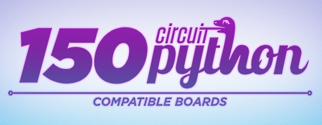](https://circuitpython.org/downloads)

[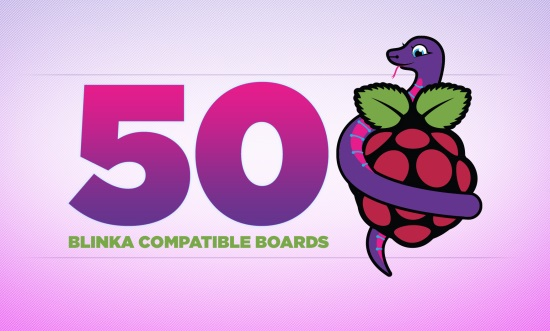](https://circuitpython.org/)

This past week, the CircuitPython community reached 150 microcontroller boards capable of running CircuitPython! - [CircuitPython.org](https://circuitpython.org/downloads)

In addition, over 50 single board computers (SBC) now run CircuitPython like the Raspberry Pi, Onion Omega, nVidia Jetson and many more. With the Blinka library, users may use Python3 and make calls to CircuitPython functionality - [CircuitPython.org](https://circuitpython.org/blinka).

## The 99th Newsletter and Python on Hardware Video

This issue, following CircuitPython Day, is the 100th issue of both this newsletter and the accompanying Python on Hardware Video produced from newsletter content. Thank you to our readers for making this newsletter the best read synopsis of Python on Hardware 100 issues running.

- [See the archive of all newsletters here](https://www.adafruitdaily.com/category/circuitpython/).
- [See the archive of all the Python on Hardware videos here](http://adafru.it/pohepisodes).

## Thank you for making CircuitPython Day a huge success

[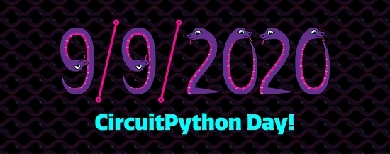](https://blog.adafruit.com/2020/09/09/today-is-circuitpython-day-lots-of-events-on-tap-circuitpythonday-circuitpython-python/)

CircuitPython Day on September 9, 2020 (9/9/2020) came last Wednesday with projects, events and CircuitPython livestreams highlighting all things Python and Python on Hardware.

This year CircuitPython Day was dedicated to Lamba Labs Makerspace, who are helping during the Beirut disaster.

[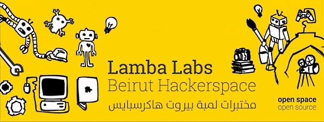](https://twitter.com/LambaLabs)

If you're interested in creating CircuitPython Day 2021 projects or hosting events, videos, or livestreams, start planning now and watch around July for announcements.

## CircuitPython Deep Dive Stream with Scott Shawcroft

[This week](https://youtu.be/0xyeEGdmLKE), Scott streams his work on ESP32-S2 SPI + PSRAM debugging.

You can see the latest video and past videos on the Adafruit YouTube channel under the Deep Dive playlist - [YouTube](https://www.youtube.com/playlist?list=PLjF7R1fz_OOXBHlu9msoXq2jQN4JpCk8A).

## Adafruit Update

[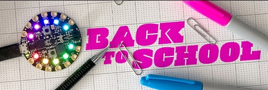](https://blog.adafruit.com/2020/05/26/adafruit-is-open-safely-and-shipping-all-orders/)

**Adafruit is shipping orders!**

Adafruit is stocked and shipping orders!

Now is the best time to get orders in for your favorite products, including items for students.

Science is fun and educational when using Adafruit parts and free, easy to follow tutorials in the [Adafruit Learning System](https://learn.adafruit.com/).

[Shop Adafruit now](https://www.adafruit.com/)

## News from around the web!

[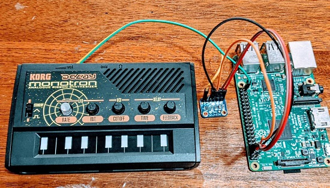](https://schollz.com/raspberrypi/monotron/)

Using a Raspberry Pi to add MIDI to a CV synthesizer (uses the Blinka library in Python3 on the Raspberry Pi) - [schollz.com](https://schollz.com/raspberrypi/monotron/) and [YouTube](https://youtu.be/TuBCexYkAv0).

[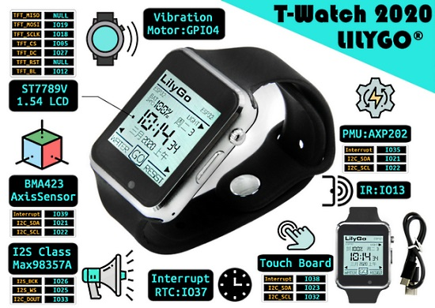](https://nick.zoic.org/art/lilygo-ttgo-t-watch-2020/)

Lilygo TTgo T-Watch 2020, running MicroPython, a review and some hacking - [...and another thing...](https://nick.zoic.org/art/lilygo-ttgo-t-watch-2020/).

[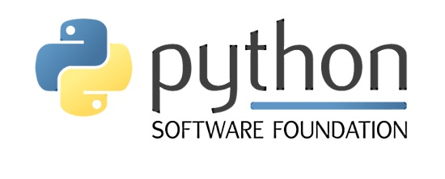](https://twitter.com/ThePSF/status/1303470930069532673)

Python 3.8.6rc1 is now ready for testing - [Python.org](https://mail.python.org/archives/list/python-committers@python.org/message/WCMNX3JKHZVOUA2NET2NRWCU6K6OJXNY/), [new features](https://docs.python.org/3.8/whatsnew/3.8.html) and [download](https://www.python.org/downloads/release/python-386rc1/).

[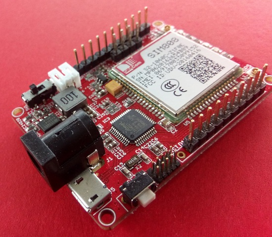](https://twitter.com/N10_SoJu3/status/1303053966620725248)

The Maduino Zero from @MakerfabsTech. With a SIM808, they integrate a UF2 bootloader and the Circuitpython interpreter to connect IoT projects to the telephone network - [Twitter](https://twitter.com/N10_SoJu3/status/1303053966620725248).

[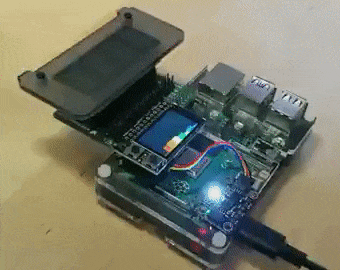](https://twitter.com/UnfinishedStuff/status/1303061602753818625?s=03)

Using a FeatherCap to run FeatherWing boards off of a Raspberry Pi board, with Python3 and the Blinka library. It's the reverse of what it was designed for but it works fine! 

[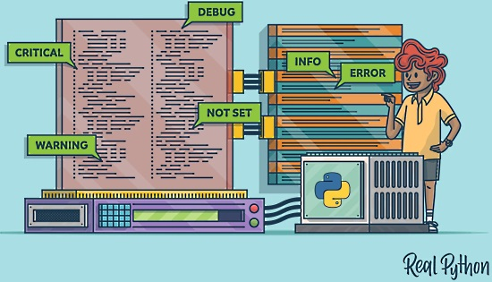](https://realpython.com/python-logging-source-code/)

Python Logging: A Stroll Through the Source Code - [Real Python](https://realpython.com/python-logging-source-code/).

The Python Software Foundation has a jobs board for people looking for jobs in Python (free account creation required) - [Python.org](https://www.python.org/accounts/login/?next=/jobs/create/) and [Twitter](https://twitter.com/ThePSF/status/1302698841628647431).

#ICYDNCI What was the most popular, most clicked link, in [last week's newsletter](https://www.adafruitdaily.com/2020/09/08/python-on-microcontrollers-newsletter-circuitpython-day-wednesday-a-new-micropython-version-and-more-python-adafruit-circuitpython-circuitpythonday-micropython-thepsf/)? [MicroPython releases version 1.13](https://github.com/micropython/micropython/releases/tag/v1.13).

## Open Source Hardware

[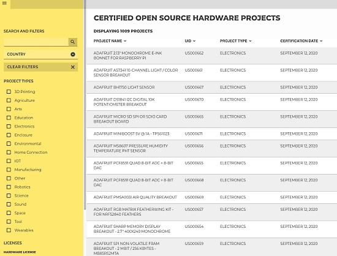](https://twitter.com/adafruit/status/1304778977849073664)

There are now over 1,009 certified open source hardware projects @ https://certification.oshwa.org/list.html. Adafruit has certified over 410 projects out of 1,009, representing 40.63% of certified open source hardware list - [OSHWA](https://certification.oshwa.org/list.html?q=adafruit) and [Twitter](https://certification.oshwa.org/list.html?q=adafruit).

## New Boards Supported by CircuitPython

The number of supported microcontrollers and Single Board Computers (SBC) grows every week. This section outlines which boards have been included in CircuitPython or added to [CircuitPython.org](https://circuitpython.org/).

This week we had X new boards added!

- [Board name](url)

Looking for adding a new board to CircuitPython? It's highly encouraged! Adafruit has four guides to help you do so:

- [How to Add a New Board to CircuitPython](https://learn.adafruit.com/how-to-add-a-new-board-to-circuitpython/overview)
- [How to add a New Board to the circuitpython.org website](https://learn.adafruit.com/how-to-add-a-new-board-to-the-circuitpython-org-website)
- [Adding a Single Board Computer to PlatformDetect for Blinka](https://learn.adafruit.com/adding-a-single-board-computer-to-platformdetect-for-blinka)
- [Adding a Single Board Computer to Blinka](https://learn.adafruit.com/adding-a-single-board-computer-to-blinka)

## New Learn Guides!

[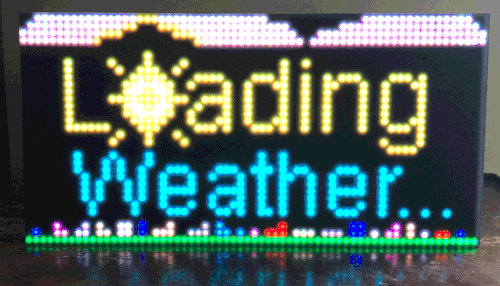](https://learn.adafruit.com/)

[Weather Display Matrix](https://learn.adafruit.com/weather-display-matrix) from [John Park](https://learn.adafruit.com/users/johnpark)

[Adafruit SPI FRAM Breakout - 2 or 4 Mbit](https://learn.adafruit.com/spi-fram-2mbit-4mbit) from [Kattni](https://learn.adafruit.com/users/kattni)

[Adafruit 128x64 OLED FeatherWing ](https://learn.adafruit.com/adafruit-128x64-oled-featherwing) from [Kattni](https://learn.adafruit.com/users/kattni)

## CircuitPython Libraries!

CircuitPython support for hardware continues to grow. We are adding support for new sensors and breakouts all the time, as well as improving on the drivers we already have. As we add more libraries and update current ones, you can keep up with all the changes right here!

For the latest libraries, download the [Adafruit CircuitPython Library Bundle](https://circuitpython.org/libraries). For the latest community contributed libraries, download the [CircuitPython Community Bundle](https://github.com/adafruit/CircuitPython_Community_Bundle/releases).

If you'd like to contribute, CircuitPython libraries are a great place to start. Have an idea for a new driver? File an issue on [CircuitPython](https://github.com/adafruit/circuitpython/issues)! Have you written a library you'd like to make available? Submit it to the [CircuitPython Community Bundle](https://github.com/adafruit/CircuitPython_Community_Bundle). Interested in helping with current libraries? Check out the [CircuitPython.org Contributing page](https://circuitpython.org/contributing). We've included open pull requests and issues from the libraries, and details about repo-level issues that need to be addressed. We have a guide on [contributing to CircuitPython with Git and Github](https://learn.adafruit.com/contribute-to-circuitpython-with-git-and-github) if you need help getting started. You can also find us in the #circuitpython channel on the [Adafruit Discord](https://adafru.it/discord).

You can check out this [list of all the Adafruit CircuitPython libraries and drivers available](https://github.com/adafruit/Adafruit_CircuitPython_Bundle/blob/master/circuitpython_library_list.md). 

The current number of CircuitPython libraries is **267**!

**Updated Libraries!**

Here's this week's updated CircuitPython libraries:

 * [Adafruit_CircuitPython_DS3502](https://github.com/adafruit/Adafruit_CircuitPython_DS3502)
 * [Adafruit_CircuitPython_Display_Text](https://github.com/adafruit/Adafruit_CircuitPython_Display_Text)
 * [Adafruit_CircuitPython_FeatherWing](https://github.com/adafruit/Adafruit_CircuitPython_FeatherWing)
 * [Adafruit_CircuitPython_BLE](https://github.com/adafruit/Adafruit_CircuitPython_BLE)
 * [Adafruit_CircuitPython_MatrixPortal](https://github.com/adafruit/Adafruit_CircuitPython_MatrixPortal)
 * [Adafruit_CircuitPython_NeoPixel_SPI](https://github.com/adafruit/Adafruit_CircuitPython_NeoPixel_SPI)
 * [Adafruit_CircuitPython_MLX90640](https://github.com/adafruit/Adafruit_CircuitPython_MLX90640)
 * [Adafruit_CircuitPython_RFM69](https://github.com/adafruit/Adafruit_CircuitPython_RFM69)
 * [Adafruit_CircuitPython_BLE_BerryMed_Pulse_Oximeter](https://github.com/adafruit/Adafruit_CircuitPython_BLE_BerryMed_Pulse_Oximeter)
 * [Adafruit_CircuitPython_PyPortal](https://github.com/adafruit/Adafruit_CircuitPython_PyPortal)
 * [Adafruit_CircuitPython_framebuf](https://github.com/adafruit/Adafruit_CircuitPython_framebuf)
 * [Adafruit_Blinka](https://github.com/adafruit/Adafruit_Blinka)

**PyPI Download Stats!**

We've written a special library called Adafruit Blinka that makes it possible to use CircuitPython Libraries on [Raspberry Pi and other compatible single-board computers](https://learn.adafruit.com/circuitpython-on-raspberrypi-linux/). Adafruit Blinka and all the CircuitPython libraries have been deployed to PyPI for super simple installation on Linux! Here are the top 10 CircuitPython libraries downloaded from PyPI in the last week, including the total downloads for those libraries:

Keep checking back for updated download stats coming soon!

## What’s the team up to this week?

What is the team up to this week? Let’s check in!

**Bryan**

With a feature complete version of the BNO080 library on the horizon, I’ve been primarily focused on getting the CircuitPython library complete and released. While I have been working on adding the final bunch of sensor reports, Ladyada was able to add UART support and further investigate why SPI isn’t working reliably. We’ve got some more hardware to test to get a final answer on that.

[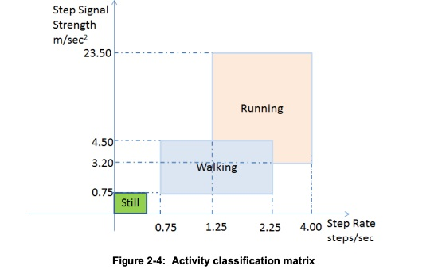](https://circuitpython.org/)

One of the final report types that I added is a fun one: a motion classifier! This little bit of sensor fusion magic does its best to determine what type of activity is creating the motion that it is sensing, be it sitting on a desk, walking, running, in a vehicle(?!) and some others. I’m pretty sure they had to shrink down some PhDs and squeeze them into the sensor because that is pretty amazing.

Sometime not too long after releasing this library we’re going to write another version with many less bells and whistles that is super simple to use, thanks to a mode within the sensor that was added for robotic vacuum cleaners. So, if you think your SOCK_SHERLOCK_9000 missing sock locating robot needs an update to its heading and guidance system, keep an eye out for that library.

**Dan**

Both my HCI \_bleio work and Scott's ESP32S2 additions are now merged into the mainline of CircuitPython. There are some bugfix PR's still in progress; after they're finished I'll make a 6.0.0-beta.0 release.

I've been working on the Blinka \_bleio library. I verified it's still working on Windows and Linux. The MacOS version still needs work, and I've made significant progress on that. We're using the bleak library underneath, and the MacOS objects it uses are fairly different than what Windows and Linux present. Normally in bleak, you can just treat these objects as opaque boxes, but \_bleio exposes details that make it necessary to look at them in more detail. For instance, MacOS (and iOS) does not normally give you access to BLE addresses, for security reasons: instead you're just given a UUID. \_bleio expects that addresses are available, so I'll need to simulate this.

Our annual CircuitPython Day was last Wednesday, 9/9. A few days before, I decided to do a [beginner's introduction to CircuitPython as a live stream](https://youtu.be/1rkM0Ow8Pkc). It went well. I'm grateful to the Adafruit team members who helped run the stream, especially Pedro and Noe. The rest of the day was wonderful, and made me proud of what we have done and how far we've come in just a few years. It's a pleasure to work on something that is so fun and useful.

**Jeff**

My work with the CAN interface of the SAM series microcontrollers continues.  I have successfully transmitted packets from the SAM E54 Xplained dev board and received them on an STM32F405 Feather running Micropython.  I also have created a pull request that adds support for the SAM E51 series, because this chip (which supports CAN just like the E54) is likely to power an upcoming Adafruit board.

However, I'm most excited about progress in a personal project with CircuitPython: a port of standard Python's `decimal` library.  For efficiency, CircuitPython uses "single precision" floating point numbers which only have about 7 digits of precision (22 bits), and in binary floating point simple statements like ".1 + .2 = .3" are not necessarily true due to rounding.  With decimal, you can use as many digits as you need (up to the limits of RAM) and numbers that can be written as exact decimal numbers like ".1" are exact, instead of being rounded as they are in binary floating point.  This makes for calculations that are less surprising to users.  This library is on github and I plan to submit it to the community bundle.

Here, the unreasonably large number being displayed is the number 2 raised to the power 332.  In order to fit the size of screen I use, my calculator has 15 digits of precision and up to 2 digits of exponent.

[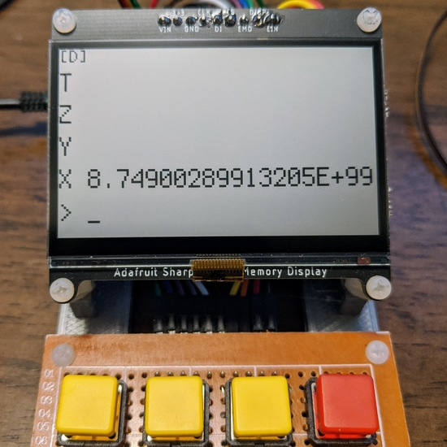](https://circuitpython.org/)

**Kattni**

I've been writing up guides for new products as we release them, and updating some older guides with CircuitPython usage and examples, as well as creating and endless supply of Fritzing objects for released and yet-to-be-released products. I've also filled extra time with miscellaneous that I keep around for that exact purpose.

This past week was CircuitPython Day. I ran a special edition of [Show and Tell in Español](https://youtu.be/V3q3RI5JL6E), hosted by Àlvaro Figueroa. Àlvaro did an amazing job. We live-streamed the [CircuitPython Weekly meeting](https://youtu.be/CsaqMtyZlak). Then, Jeff and I streamed a [CircuitPython Conversation](https://youtu.be/L4Bz_ztQew4) where we interviewed each other about some recent projects that we worked on. The stream went incredibly well (and that's coming from both of us expecting it to be a massive disaster). Finally, we all finished out the day on [Show and Tell](https://youtu.be/BGVP0vJlqvI) and [Ask an Engineer](https://youtu.be/JqK911g7O7Q), which became Ask All the CircuitPython Engineers. CircuitPython day turned out great, those watching seemed to enjoy it, and those participating seemed to have fun. Couldn't ask for more.

**Melissa**

[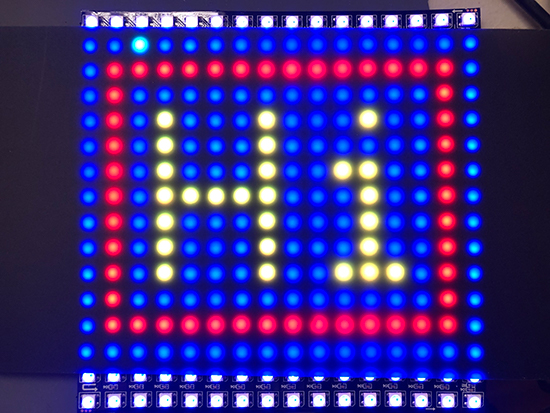](https://circuitpython.org/)

This past week I started with getting GPIO working on the STM32MP1 in Blinka. However, the way that this development board was intended to be used was for companies to create a custom version of Linux including compiling the device tree in order to get I2C, SPI, and UART working. This is beyond the scope of the average user and we decided to put it on hold until we can come up with something that's easier.

Next, I went and wrote up a quick demo for John Park's workshop that displayed a countdown until Halloween. This was a fun project and the only updates I needed to make to the MatrixPortal library were a couple of bug fixes.

I also started working on the Pixel Framebuf library. The purpose of the library it to make it easy for people to display text and shapes to a matrix of NeoPixels or Dotstars. This piggybacks on top of Kattni's LED Animation library and the existing framebuf library, which I extended to work with the RGB888 format so it can be used with NeoPixels.

**Scott**

This has been a short week because I took Friday and Monday off for a long weekend. Around that I iterated on the native wifi support for ESP32-S2 with Dan and just merged it!!! Next, I'm fixing SPI with the PSRAM. After that, I'll finish my changes to `adafruit_requests` to support the newer WiFi API alongside the older socket-like API.

CircuitPython Day was a blast as well with a number of [awesome streams](https://www.youtube.com/playlist?list=PLjF7R1fz_OOXqPXt-XCGZbGxkg5J17KyA).

## Upcoming events!

PyGotham is a New York City based, eclectic, Py-centric conference covering many topics. PyGotham TV taking place October 2-3, 2020 with a single track of talks presented online - [Event Website](https://2020.pygotham.tv/).

PyCon India 2020: the premier conference in India on using and developing the Python programming language. To be held online October 3-5, 2020 - [Website](https://in.pycon.org/2020/) and [Twitter](https://twitter.com/pyconindia).

The Hackaday Remoticon will take place everywhere November 6th – 8th, 2020. It’s a weekend packed with workshops about hardware creation, held virtually for all to enjoy - [Hackaday](https://hackaday.com/2020/08/04/hackaday-remoticon-our-2020-conference-is-packed-with-workshops-and-were-calling-for-proposals/).

**Send Your Events In**

As for other events, with the COVID pandemic, most in-person events are postponed or cancelled. If you know of virtual events or events that may occur in the future, please let us know on Discord or on Twitter with hashtag #CircuitPython.

## Latest releases

CircuitPython's stable release is [#.#.#](https://github.com/adafruit/circuitpython/releases/latest) and its unstable release is [#.#.#-##.#](https://github.com/adafruit/circuitpython/releases). New to CircuitPython? Start with our [Welcome to CircuitPython Guide](https://learn.adafruit.com/welcome-to-circuitpython).

[2020####](https://github.com/adafruit/Adafruit_CircuitPython_Bundle/releases/latest) is the latest CircuitPython library bundle.

[v#.#.#](https://micropython.org/download) is the latest MicroPython release. Documentation for it is [here](http://docs.micropython.org/en/latest/pyboard/).

[#.#.#](https://www.python.org/downloads/) is the latest Python release. The latest pre-release version is [#.#.#](https://www.python.org/download/pre-releases/).

[1822 Stars](https://github.com/adafruit/circuitpython/stargazers) Like CircuitPython? [Star it on GitHub!](https://github.com/adafruit/circuitpython)

## Call for help -- Translating CircuitPython is now easier than ever!

[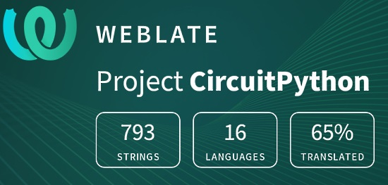](https://hosted.weblate.org/engage/circuitpython/)

One important feature of CircuitPython is translated control and error messages.

With the help of fellow open source project [Weblate](https://weblate.org/), we're making it even easier to add or improve translations.

Sign in with an existing account such as Github, Google or Facebook and start contributing through a simple web interface. No forks or pull requests needed!

As always, if you run into trouble join us on [Discord](https://adafru.it/discord), we're here to help.

## jobs.adafruit.com - Find a dream job, find great candidates!

[jobs.adafruit.com](https://jobs.adafruit.com/) has returned and folks are posting their skills (including CircuitPython) and companies are looking for talented makers to join their companies - from Digi-Key, to Hackaday, Microcenter, Raspberry Pi and more.

## NUMBER thanks!

The Adafruit Discord community, where we do all our CircuitPython development in the open, reached over NUMBER humans, thank you!  Adafruit believes Discord offers a unique way for CircuitPython folks to connect. Join today at [https://adafru.it/discord](https://adafru.it/discord).

## ICYMI - In case you missed it

The wonderful world of Python on hardware! This is our first video-newsletter-podcast that we’ve started! The news comes from the Python community, Discord, Adafruit communities and more. Kattni turns the weekly news into video form for ASK an ENGINEER and Adafruit social media. The complete Python on Hardware weekly videocast [playlist is here](https://www.youtube.com/playlist?list=PLjF7R1fz_OOXRMjM7Sm0J2Xt6H81TdDev). 

This video podcast is on [iTunes](https://itunes.apple.com/us/podcast/python-on-hardware/id1451685192?mt=2), [YouTube](http://adafru.it/pohepisodes), [IGTV (Instagram TV](https://www.instagram.com/adafruit/channel/)), and [XML](https://itunes.apple.com/us/podcast/python-on-hardware/id1451685192?mt=2).

[Weekly community chat on Adafruit Discord server CircuitPython channel - Audio / Podcast edition](https://itunes.apple.com/us/podcast/circuitpython-weekly-meeting/id1451685016) - Audio from the Discord chat space for CircuitPython, meetings are usually Mondays at 2pm ET, this is the audio version on [iTunes](https://itunes.apple.com/us/podcast/circuitpython-weekly-meeting/id1451685016), Pocket Casts, [Spotify](https://adafru.it/spotify), and [XML feed](https://adafruit-podcasts.s3.amazonaws.com/circuitpython_weekly_meeting/audio-podcast.xml).

And lastly, we are working up a one-spot destination for all things podcast-able here - [podcasts.adafruit.com](https://podcasts.adafruit.com/)

## Codecademy "Learn Hardware Programming with CircuitPython"

Codecademy, an online interactive learning platform used by more than 45 million people, has teamed up with the leading manufacturer in STEAM electronics, Adafruit Industries, to create a coding course, "Learn Hardware Programming with CircuitPython". The course is now available in the [Codecademy catalog](https://www.codecademy.com/learn/learn-circuitpython?utm_source=adafruit&utm_medium=partners&utm_campaign=circuitplayground&utm_content=pythononhardwarenewsletter).

Python is a highly versatile, easy to learn programming language that a wide range of people, from visual effects artists in Hollywood to mission control at NASA, use to quickly solve problems. But you don’t need to be a rocket scientist to accomplish amazing things with it. This new course introduces programmers to Python by way of a microcontroller — CircuitPython — which is a Python-based programming language optimized for use on hardware.

CircuitPython’s hardware-ready design makes it easier than ever to program a variety of single-board computers, and this course gets you from no experience to working prototype faster than ever before. Codecademy’s interactive learning environment, combined with Adafruit's highly rated Circuit Playground Express, present aspiring hardware hackers with a never-before-seen opportunity to learn hardware programming seamlessly online.

Whether for those who are new to programming, or for those who want to expand their skill set to include physical computing, this course will have students getting familiar with Python and creating incredible projects along the way. By the end, students will have built their own bike lights, drum machine, and even a moisture detector that can tell when it's time to water a plant.

Visit Codecademy to access the [Learn Hardware Programming with CircuitPython](https://www.codecademy.com/learn/learn-circuitpython?utm_source=adafruit&utm_medium=partners&utm_campaign=circuitplayground&utm_content=pythononhardwarenewsletter) course and Adafruit to purchase a [Circuit Playground Express](https://www.adafruit.com/product/3333).

Codecademy has helped more than 45 million people around the world upgrade their careers with technology skills. The company’s online interactive learning platform is widely recognized for providing an accessible, flexible, and engaging experience for beginners and experienced programmers alike. Codecademy has raised a total of $43 million from investors including Union Square Ventures, Kleiner Perkins, Index Ventures, Thrive Capital, Naspers, Yuri Milner and Richard Branson, most recently raising its $30 million Series C in July 2016.

## Contribute!

The CircuitPython Weekly Newsletter is a CircuitPython community-run newsletter emailed every Tuesday. The complete [archives are here](https://www.adafruitdaily.com/category/circuitpython/). It highlights the latest CircuitPython related news from around the web including Python and MicroPython developments. To contribute, edit next week's draft [on GitHub](https://github.com/adafruit/circuitpython-weekly-newsletter/tree/gh-pages/_drafts) and [submit a pull request](https://help.github.com/articles/editing-files-in-your-repository/) with the changes. You may also tag your information on Twitter with #CircuitPython. 

Join our [Discord](https://adafru.it/discord) or [post to the forum](https://forums.adafruit.com/viewforum.php?f=60) for any further questions.
