- [ ] Kattni updates
- [ ] change date
- [ ] update title
- [ ] Feature story
- [ ] Update  for images
- [ ] Update ICYDNCI
- [ ] All images 550w max only
- [ ] Link "View this email in your browser."

View this email in your browser.

Hi everyone! It's the latest Python for Microcontrollers newsletter, brought you by the community! We're on [Discord](https://discord.gg/HYqvREz), [Twitter](https://twitter.com/search?q=circuitpython&src=typed_query&f=live), and for past newsletters - [view them all here](https://www.adafruitdaily.com/category/circuitpython/). If you're reading this on the web, [subscribe here](https://www.adafruitdaily.com/). Let's get started!

## CircuitPython 6.0.0 Beta 0

CircuitPython version 6.0.0 beta 0 is the initial beta release of CircuitPython 6.0.0. The most notable additions since 5.3.x are basic lower power support when in time.sleep(), initial ESP32-S2 support, including WiFi, and and \_bleio HCI support for ESP32 co-processors. The lower power work changed time keeping and may have introduced bugs. Please use 5.3.x if you need a stable version of CircuitPython. See the [Release Notes](https://github.com/adafruit/circuitpython/releases) for all the changes.

## The State of OSHdata and Open Hardware

[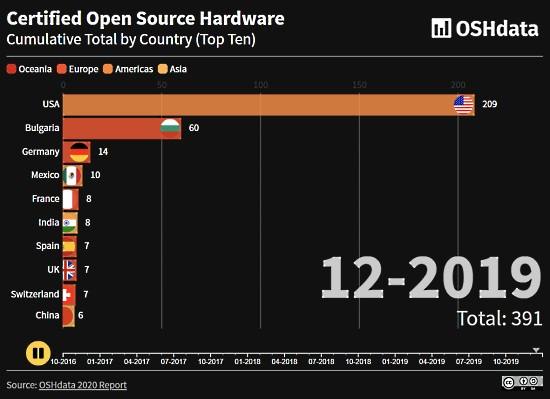](https://oshdata.com/2020/09/17/the-state-of-oshdata/)

An update on the OSHdata project and what is happening next in the broader Open Source Hardware community, looking ahead to Open Hardware Month in October.

> [Our research](https://oshdata.com/2020/02/19/2020-state-of-open-hardware/) has been read in over 40 countries around the world, on every continent—except Antarctica. Our report helped increase awareness of the certification program and created a sense of friendly competition between some of the leading Open Source Hardware companies in the world. Since our report was first published, the program went from slightly over 400 certifications to now boasting over 1,000 certifications!

A more than doubling of the certification program was led by Adafruit, who are now the leading creator with nearly 40% of all certifications. To mark the time when they claimed the top slot, Adafruit founder Limor Fried was interviewed - [OSHdata](https://oshdata.com/2020/05/04/limor-fried-of-adafruit-industries/).

> The Open Source Hardware movement is a global movement. It’s not just about leading brands like Adafruit, SparkFun, Olimex, or Field Ready. It’s also not about the big companies are involved in this space and have certified hardware, like Google or BeagleBoard. Open hardware is built by people you know, and by people you may not know yet. We have worked hard to shine a spotlight on the up-and-coming creators.

Read more - [OSHdata](https://oshdata.com/2020/09/17/the-state-of-oshdata/).

## CircuitPython Deep Dive Stream with Scott Shawcroft

[This week](https://youtu.be/xmB22q2p40g), Scott streams his work on a displayio overview, ESP32-S2 UF2, flash sizes and USB PIDs.

You can see the latest video and past videos on the Adafruit YouTube channel under the Deep Dive playlist - [YouTube](https://www.youtube.com/playlist?list=PLjF7R1fz_OOXBHlu9msoXq2jQN4JpCk8A).

## Adafruit Update

**Adafruit is shipping orders!**

Adafruit is stocked and shipping orders!

Now is the best time to get orders in for your favorite products, including items for students.

Science is fun and educational when using Adafruit parts and free, easy to follow tutorials in the [Adafruit Learning System](https://learn.adafruit.com/).

[Shop Adafruit now](https://www.adafruit.com/)

## The Adafruit Discord Server surpasses 25,000 members!

The Adafruit Discord community, where we do all our CircuitPython development in the open, reached over 25,000 humans, thank you!  Adafruit believes Discord offers a unique way for CircuitPython folks to connect. Join today at [https://adafru.it/discord](https://adafru.it/discord).

## Hacker Lab's  CircuitPython Program will now be Thursday September 24th online

Due to fires and power issues, Hacker Lab, in Sacramento, California, had to reschedule their CircuitPython Day activities. The new date is Thursday September 24th.

> Join Hacker Lab instructor and all-around amazing maker Curtis Soldano for a day of learning, discussion and fun!

More - [Hacker Lab](https://hackerlab.org/en/blog/read/1376035664/hacker-lab-is-celebrating-circuit-python-day--how-you-can-join).

## News from around the web!

[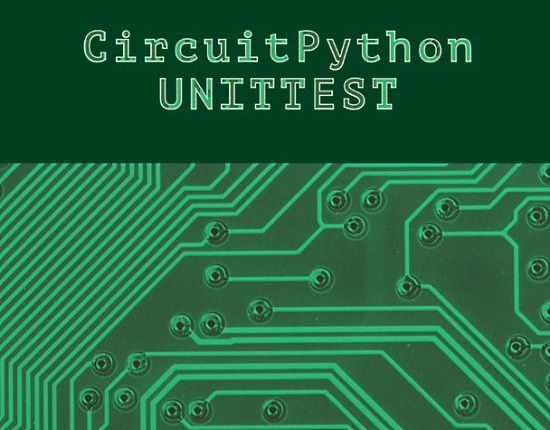](https://github.com/rrainey/DSKY-alarm-panel-replica)

CircuitPython_Unittest provides the MP-Lib unittest.py to CircuitPython to provide full advantage of Python's unittest within CircuitPython - [GitHub](https://github.com/mytechnotalent/CircuitPython_Unittest) and [Twitter](https://twitter.com/mytechnotalent/status/1308086272615948288).

[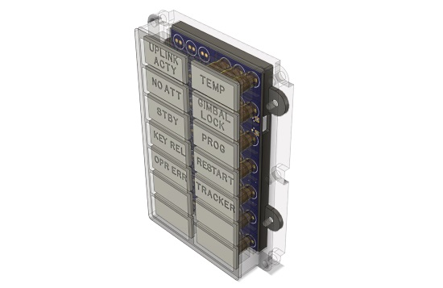](https://github.com/rrainey/DSKY-alarm-panel-replica)

An Apollo DSKY Alarm Indicator Panel replica, programmable in CircuitPython - [GitHub](https://github.com/rrainey/DSKY-alarm-panel-replica).

[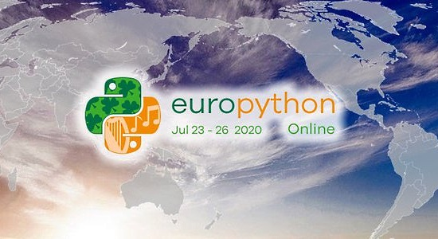](https://twitter.com/europython/status/1308041770803048448)

Sixty videos from EuroPython have now been posted to YouTube for your vierwing pleasure - [YouTube](https://www.youtube.com/playlist?list=PL8uoeex94UhHgMD9GOCbEHWku7pEPx9fW) and [Twitter](https://twitter.com/europython/status/1308041770803048448).

[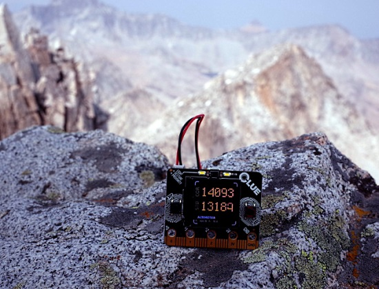](https://learn.adafruit.com/clue-altimeter)

An Adafruit CLUE running CircuitPython from [the altimeter guide](https://learn.adafruit.com/clue-altimeter), on the summit of [Snowmass Mountain](https://en.wikipedia.org/wiki/Snowmass_Mountain), Colorado, USA. The summit elevation is 14098 ft. The upper readout is the corrected altitude, which agrees well with the official number - [Adafruit Guide](https://learn.adafruit.com/clue-altimeter).

[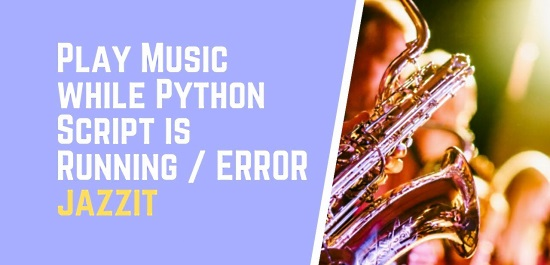](https://github.com/Sangarshanan/jazzit)

JazzIt is software which allows for adding a decorator to your Python functions to play music. For example during a long running function or on error - [GitHub](https://github.com/Sangarshanan/jazzit).

[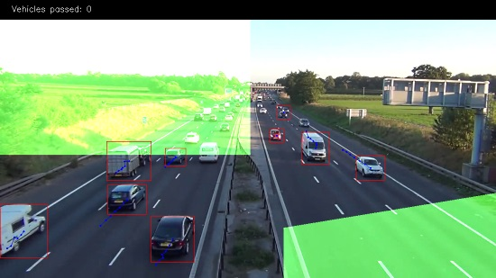](https://learnml.today/making-road-traffic-counting-app-4)

Learning how to count road traffic based on computer vision and without heavy deep learning algorithms, using only Python and OpenCV - [LearnML](https://learnml.today/making-road-traffic-counting-app-4).

[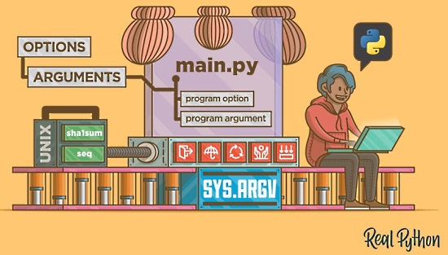](https://twitter.com/pycoders/status/1307387484008001538)

Command Line Interfaces in Python - [Real Python](https://realpython.com/lessons/cli-python-overview/).

Python-Fast-Raytracer is a basic Ray Tracer that exploits numpy arrays and functions to work fast. The MIT licensed code is written to make it as readable as possible - [GitHub](https://github.com/rafael-fuente/Python-Raytracer), [Reddit](https://www.reddit.com/r/madeinpython/comments/i9hgfb/i_finished_my_python_ray_tracer_capable_of/), and [Twitter](https://twitter.com/PythonHub/status/1298036155796131841).

[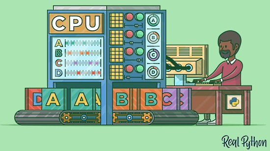](https://realpython.com/python-concurrency/)

Speed Up Your Python Program With Concurrency - [Real Python](https://realpython.com/python-concurrency/).

What's your Hackers movie handle? Find out with a Python project - [bigl.es](https://bigl.es/hack-the-planet-with-python/).

#ICYDNCI What was the most popular, most clicked link, in [last week's newsletter](https://www.adafruitdaily.com/2020/09/15/python-on-microcontrollers-newsletter-over-200-circuitpython-compatible-boards-python-adafruit-circuitpython-circuitpythonday-micropython-thepsf/)? [Lilygo TTgo T-Watch 2020](https://nick.zoic.org/art/lilygo-ttgo-t-watch-2020/).

PyDev of the Week: Jim Anderson on [Mouse vs Python](https://www.blog.pythonlibrary.org/2020/09/21/pydev-of-the-week-jim-anderson/)

CircuitPython Weekly Meeting for September 21, 2020 ([notes](https://github.com/adafruit/adafruit-circuitpython-weekly-meeting/blob/32c4f183ecc06ab1fc2d2bf8661ea8ed98b9321f/2020/2020-09-21.md#circuitpython-weekly-for-september-22st-2020)) [on YouTube](https://youtu.be/g3mNZKh4AMw)

## Coming soon

[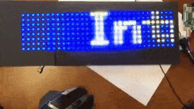](https://twitter.com/makermelissa/status/1306735939629195264)

Display a scrolling message using only have a single GPIO. The Adafruit pixel framebuf library allows this. Here testing on a Pi 3. An Adafruit Learning System guide will be coming soon - [Twitter](https://twitter.com/makermelissa/status/1306735939629195264).

[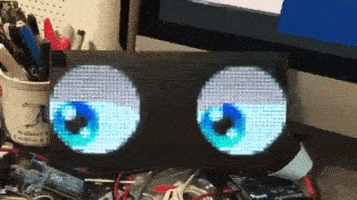](https://twitter.com/PaintYourDragon/status/1306732364605739010)

It wouldn’t be Halloween without a new eyeball project, would it? A 64x32 pixel RGB LED matrix, coded in CircuitPython. A new guide is coming out soon - [Twitter](https://twitter.com/PaintYourDragon/status/1306732364605739010).

[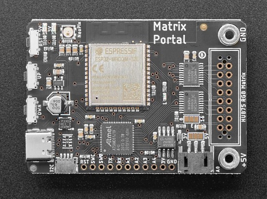](https://www.adafruit.com/product/4745)

The Adafruit Matrix Portal add-on for RGB Matricies plugs directly into the back of any HUB-75 compatible LED matrix display (all the ones Adafruit stocks will work) from 16x32 up to 64x64 - [Adafruit](https://www.adafruit.com/product/4745).

## New Boards Supported by CircuitPython

The number of supported microcontrollers and Single Board Computers (SBC) grows every week. This section outlines which boards have been included in CircuitPython or added to [CircuitPython.org](https://circuitpython.org/).

This week we had two new boards added!

- [Matrix Portal M4](https://circuitpython.org/board/matrixportal_m4/)
- [NanoESP32 S2](https://circuitpython.org/board/muselab_nanoesp32_s2/)

Looking for adding a new board to CircuitPython? It's highly encouraged! Adafruit has four guides to help you do so:

- [How to Add a New Board to CircuitPython](https://learn.adafruit.com/how-to-add-a-new-board-to-circuitpython/overview)
- [How to add a New Board to the circuitpython.org website](https://learn.adafruit.com/how-to-add-a-new-board-to-the-circuitpython-org-website)
- [Adding a Single Board Computer to PlatformDetect for Blinka](https://learn.adafruit.com/adding-a-single-board-computer-to-platformdetect-for-blinka)
- [Adding a Single Board Computer to Blinka](https://learn.adafruit.com/adding-a-single-board-computer-to-blinka)

## New Learn Guides!

[NeoPixel LED Necklace Insert with USB Charging](https://learn.adafruit.com/neopixel-led-necklace-insert-with-usb-charging) from [Erin St Blaine](https://learn.adafruit.com/users/firepixie)

[Custom Scrolling Quote Board Matrix Display](https://learn.adafruit.com/aio-quote-board-matrix-display) from [John Park](https://learn.adafruit.com/users/johnpark)

## CircuitPython Libraries!

CircuitPython support for hardware continues to grow. We are adding support for new sensors and breakouts all the time, as well as improving on the drivers we already have. As we add more libraries and update current ones, you can keep up with all the changes right here!

For the latest libraries, download the [Adafruit CircuitPython Library Bundle](https://circuitpython.org/libraries). For the latest community contributed libraries, download the [CircuitPython Community Bundle](https://github.com/adafruit/CircuitPython_Community_Bundle/releases).

If you'd like to contribute, CircuitPython libraries are a great place to start. Have an idea for a new driver? File an issue on [CircuitPython](https://github.com/adafruit/circuitpython/issues)! Have you written a library you'd like to make available? Submit it to the [CircuitPython Community Bundle](https://github.com/adafruit/CircuitPython_Community_Bundle). Interested in helping with current libraries? Check out the [CircuitPython.org Contributing page](https://circuitpython.org/contributing). We've included open pull requests and issues from the libraries, and details about repo-level issues that need to be addressed. We have a guide on [contributing to CircuitPython with Git and Github](https://learn.adafruit.com/contribute-to-circuitpython-with-git-and-github) if you need help getting started. You can also find us in the #circuitpython channel on the [Adafruit Discord](https://adafru.it/discord).

You can check out this [list of all the Adafruit CircuitPython libraries and drivers available](https://github.com/adafruit/Adafruit_CircuitPython_Bundle/blob/master/circuitpython_library_list.md). 

The current number of CircuitPython libraries is **270**!

**New Libraries!**

Here's this week's new CircuitPython libraries:

 * [Adafruit_CircuitPython_AirLift](https://github.com/adafruit/Adafruit_CircuitPython_AirLift)
 * [Adafruit_CircuitPython_Pixel_Framebuf](https://github.com/adafruit/Adafruit_CircuitPython_Pixel_Framebuf)
 * [Adafruit_CircuitPython_BNO08x_RVC](https://github.com/adafruit/Adafruit_CircuitPython_BNO08x_RVC)

**Updated Libraries!**

Here's this week's updated CircuitPython libraries:

 * [Adafruit_CircuitPython_BLE](https://github.com/adafruit/Adafruit_CircuitPython_BLE)
 * [Adafruit_CircuitPython_MLX90640](https://github.com/adafruit/Adafruit_CircuitPython_MLX90640)
 * [Adafruit_CircuitPython_Display_Shapes](https://github.com/adafruit/Adafruit_CircuitPython_Display_Shapes)
 * [Adafruit_CircuitPython_BLE_BerryMed_Pulse_Oximeter](https://github.com/adafruit/Adafruit_CircuitPython_BLE_BerryMed_Pulse_Oximeter)
 * [Adafruit_CircuitPython_PyPortal](https://github.com/adafruit/Adafruit_CircuitPython_PyPortal)
 * [Adafruit_CircuitPython_framebuf](https://github.com/adafruit/Adafruit_CircuitPython_framebuf)
 * [Adafruit_CircuitPython_Thermal_Printer](https://github.com/adafruit/Adafruit_CircuitPython_Thermal_Printer)
 * [Adafruit_CircuitPython_MatrixPortal](https://github.com/adafruit/Adafruit_CircuitPython_MatrixPortal)
 * [Adafruit_CircuitPython_VC0706](https://github.com/adafruit/Adafruit_CircuitPython_VC0706)
 * [Adafruit_CircuitPython_CLUE](https://github.com/adafruit/Adafruit_CircuitPython_CLUE)
 * [Adafruit_CircuitPython_Debouncer](https://github.com/adafruit/Adafruit_CircuitPython_Debouncer)
 * [Adafruit_CircuitPython_SSD1306](https://github.com/adafruit/Adafruit_CircuitPython_SSD1306)
 * [Adafruit_Blinka](https://github.com/adafruit/Adafruit_Blinka)
 * [CircuitPython_Community_Bundle](https://github.com/adafruit/CircuitPython_Community_Bundle)

**PyPI Download Stats!**

We've written a special library called Adafruit Blinka that makes it possible to use CircuitPython Libraries on [Raspberry Pi and other compatible single-board computers](https://learn.adafruit.com/circuitpython-on-raspberrypi-linux/). Adafruit Blinka and all the CircuitPython libraries have been deployed to PyPI for super simple installation on Linux! Here are the top 10 CircuitPython libraries downloaded from PyPI in the last week, including the total downloads for those libraries:

Keep checking back for updated download stats coming soon!

## What’s the team up to this week?

What is the team up to this week? Let’s check in!

**Bryan**

The CircuitPython BNO080 library is now the CircuitPython \_BNO08x_ library which is a simple way of making it clear that it works with both the BNO080 and BNO085 sensors from Hillcrest Labs. Other than a name change, the library will be released by the time you read this along with newly added calibration code. If you've ever had to move your phone around in wonky 3-dimensional figure eights, not unlike making a toy airplane doing some maneuvers, you've gone through a calibration procedure like the BNO08x sensors are capable of. 

Magnetometers sense magnetic fields like the that surrounds the earth and makes sure your compass points north. This can be handy because unless something has gone \_horribly wrong_, magnetic north will always be to the North (more or less). Motion. sensors can use this outside reference to correct any errors in their calculations but doing so accurately requires accounting for all of the other stray magnetic fields in the sensor's environment. Most multi-axis sensors with magnetometers have a way of storing this offset information and usign it to correct the readings, but you generally have to do the work of calculating it yourself. The BNO08x sensors do all that work for you. In essence you say "start calibrating" then move the sensor into 4-5 different orientations until it's told you that it's calibrated. All you have to do after that is tell it to save the calibration data and voila! A calibrated super-fancy motion sensor.

**Dan**

The [Blinka \_bleio library](https://github.com/adafruit/Adafruit_Blinka_bleio) is now working on Windows, Linux, and MacOS. Some recent changes to the MacOS support in the [bleak library](https://github.com/hbldh/bleak) fixed the issues we were having with \_bleio on MacOS. I will also vet the Linux support on Raspberry Pi soon. I'll have a PR soon after that, and then will start working on a Learn Guide with setup steps and examples for all the platforms.

I finished the small [Airlift helper library](https://github.com/adafruit/Adafruit_CircuitPython_AirLift), which helps manage ESP32 co-processors for use with WiFi and Bluetooth.

**Jeff**

Since I last checked in about it, I've made a lot of good progress on the CAN bus support for SAM E5x microcontrollers.  Sending and receiving now work, as well as recovery from bus errors.  Addition of filtering and 29-bit IDs is next.

In this demo, the sender waits for the buttons to be pressed and sends messages to the receiver, which displays it.

[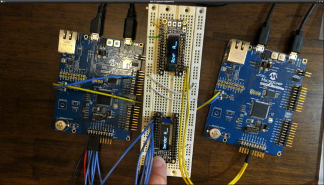](https://circuitpython.org/)

**Lucian**

This past week and a half I spent fixing bugs in Circuitpython. The most critical fix was removing a number of null reference exceptions that were occurring in DisplayIO for I2C based screens, like the OLED Featherwing - these were initially assumed to only be happening on the ESP32-S2, but turned out to be present across all ports. These errors may have slipped under the radar because they only appeared when certain things went wrong - if the user typed their I2C address incorrectly, for instance, or if they forgot to include a pin by default in their constructor. Unfortunately, their reliance on hardware makes these kinds of issues tricky to unit test, and I'm still thinking about ways around that issue.

I also helped wrap up an issue that was preventing SD cards from working on the STM32, related to how ST's SPI peripheral deals with the write line when a read is going on. There's a particular parameter for the read function that can set a temporary output value for the write line, holding it high or low, or even putting out a single repeating byte of data, which is something SD cards require - however, most ports ignore this in their implementation. This wasn't an issue for the NRF52, which the ST port's SPI code was based off of, because the default for that chip works correctly with SD cards, but the STM32 had all kinds of undefined behavior. It's possible the same issue is now happening on ESP32-S2, so I'll be checking that out next.

I'm now moving on to bugs on the STM32 version of RGBMatrix, which should simply be a matter of inspecting a lot of data lines on the SAMD and NRF52 versions and looking for differences.

As a fun project, I finally got my Circuitpython library for the Dynamixel brand of robot servos submitted to the community bundle, and finished my first Featherwing:

The board contains the basic logic needed to turn a Feather's two UART RX and TX lines into the single half-duplex line that the Dynamixels use, as well as including a simple direction control circuit using buffers. It also lets you plug in a 12V cable directly to supply the motors, and has a built-in regulator and power source selector if you'd like to run Circuitpython off the motor power line instead of USB.

I'm looking forward to trying out some new projects, now that my robot servos aren't tied to a fragile breadboard circuit to handle their direction control - next up is figuring out quadruped gaits!

[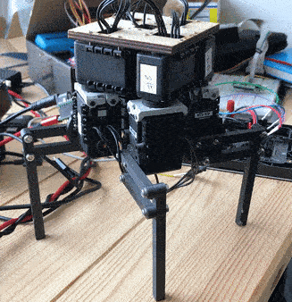](https://circuitpython.org/)

**Melissa**

This past week was a short week for me as I traveled away from the smoke that was particularly hazardous in my local area. Outside of that, I finished up writing the CircuitPython Pixel Framebuf library and got it added to the bundle. It leverages the power of the existing framebuf library and the Animated LED library to display text and graphics on many different configurations of NeoPixels and DotStars. I started writing a guide on using this library. Keep an eye out if you're interested because it should be published soon. 

If you're too excited to wait and would like to dive right in by looking at examples, [the repository is available now](https://github.com/adafruit/Adafruit_CircuitPython_Pixel_Framebuf).

**Scott**

This week I've been doing a smattering of different ESP32-S2 related tasks to get everything ready for more and more boards. I started by fixing SPI on boards with PSRAM. I finished up the changes to Adafruit_Requests so that it works with existing libraries and the new native wifi code.

There is a PR for adding support for different flash sizes: 8MB and 16MB in addition to 4MB.

I'm also sorting out USB PIDs. I finished up the CI check for unique USB PIDs for boards. I've been helping http://pid.codes get caught up on PR merges.

Next up is polishing up the UF2 bootloader for the ESP32-S2. I'll be writing a guide to adding your own board to the UF2 bootloader. The goal is to make it easy to load UF2 once so that all the loading after that can be done with a USB drive.

## Upcoming events!

PyGotham is a New York City based, eclectic, Py-centric conference covering many topics. PyGotham TV taking place October 2-3, 2020 with a single track of talks presented online - [Event Website](https://2020.pygotham.tv/).

PyCon India 2020: the premier conference in India on using and developing the Python programming language. Held online October 3-5, 2020. A [call for proposals](https://in.pycon.org/cfp/2020/proposals/) is now open through August 14, 2020. - [Website](https://in.pycon.org/2020/) and [Twitter](https://twitter.com/pyconindia)

The Hackaday Remoticon will take place everywhere November 6th – 8th, 2020. It’s a weekend packed with workshops about hardware creation, held virtually for all to enjoy - [Hackaday](https://hackaday.com/2020/08/04/hackaday-remoticon-our-2020-conference-is-packed-with-workshops-and-were-calling-for-proposals/).

**Send Your Events In**

As for other events, with the COVID pandemic, most in-person events are postponed or cancelled. If you know of virtual events or events that may occur in the future, please let us know on Discord or on Twitter with hashtag #CircuitPython.

## Latest releases

CircuitPython's stable release is [5.3.1](https://github.com/adafruit/circuitpython/releases/latest) and its unstable release is [6.0.0-beta.0](https://github.com/adafruit/circuitpython/releases). New to CircuitPython? Start with our [Welcome to CircuitPython Guide](https://learn.adafruit.com/welcome-to-circuitpython).

[20200919](https://github.com/adafruit/Adafruit_CircuitPython_Bundle/releases/latest) is the latest CircuitPython library bundle.

[v1.13](https://micropython.org/download) is the latest MicroPython release. Documentation for it is [here](http://docs.micropython.org/en/latest/pyboard/).

[3.8.5](https://www.python.org/downloads/) is the latest Python release. The latest pre-release version is [3.9.0.rc.2](https://www.python.org/download/pre-releases/).

[1,837 Stars](https://github.com/adafruit/circuitpython/stargazers) Like CircuitPython? [Star it on GitHub!](https://github.com/adafruit/circuitpython)

## Call for help -- Translating CircuitPython is now easier than ever!

[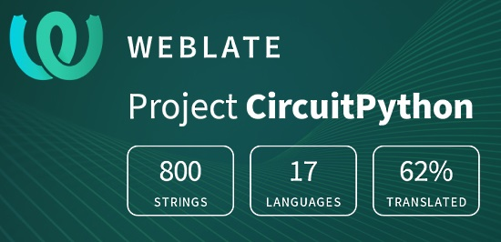](https://hosted.weblate.org/engage/circuitpython/)

One important feature of CircuitPython is translated control and error messages.

With the help of fellow open source project [Weblate](https://weblate.org/), we're making it even easier to add or improve translations.

Sign in with an existing account such as Github, Google or Facebook and start contributing through a simple web interface. No forks or pull requests needed!

As always, if you run into trouble join us on [Discord](https://adafru.it/discord), we're here to help.

## jobs.adafruit.com - Find a dream job, find great candidates!

[jobs.adafruit.com](https://jobs.adafruit.com/) has returned and folks are posting their skills (including CircuitPython) and companies are looking for talented makers to join their companies - from Digi-Key, to Hackaday, Microcenter, Raspberry Pi and more.

## ICYMI - In case you missed it

The wonderful world of Python on hardware! This is our first video-newsletter-podcast that we’ve started! The news comes from the Python community, Discord, Adafruit communities and more. Kattni turns the weekly news into video form for ASK an ENGINEER and Adafruit social media. The complete Python on Hardware weekly videocast [playlist is here](https://www.youtube.com/playlist?list=PLjF7R1fz_OOXRMjM7Sm0J2Xt6H81TdDev). 

This video podcast is on [iTunes](https://itunes.apple.com/us/podcast/python-on-hardware/id1451685192?mt=2), [YouTube](http://adafru.it/pohepisodes), [IGTV (Instagram TV](https://www.instagram.com/adafruit/channel/)), and [XML](https://itunes.apple.com/us/podcast/python-on-hardware/id1451685192?mt=2).

[Weekly community chat on Adafruit Discord server CircuitPython channel - Audio / Podcast edition](https://itunes.apple.com/us/podcast/circuitpython-weekly-meeting/id1451685016) - Audio from the Discord chat space for CircuitPython, meetings are usually Mondays at 2pm ET, this is the audio version on [iTunes](https://itunes.apple.com/us/podcast/circuitpython-weekly-meeting/id1451685016), Pocket Casts, [Spotify](https://adafru.it/spotify), and [XML feed](https://adafruit-podcasts.s3.amazonaws.com/circuitpython_weekly_meeting/audio-podcast.xml).

And lastly, we are working up a one-spot destination for all things podcast-able here - [podcasts.adafruit.com](https://podcasts.adafruit.com/)

## Codecademy "Learn Hardware Programming with CircuitPython"

Codecademy, an online interactive learning platform used by more than 45 million people, has teamed up with the leading manufacturer in STEAM electronics, Adafruit Industries, to create a coding course, "Learn Hardware Programming with CircuitPython". The course is now available in the [Codecademy catalog](https://www.codecademy.com/learn/learn-circuitpython?utm_source=adafruit&utm_medium=partners&utm_campaign=circuitplayground&utm_content=pythononhardwarenewsletter).

Python is a highly versatile, easy to learn programming language that a wide range of people, from visual effects artists in Hollywood to mission control at NASA, use to quickly solve problems. But you don’t need to be a rocket scientist to accomplish amazing things with it. This new course introduces programmers to Python by way of a microcontroller — CircuitPython — which is a Python-based programming language optimized for use on hardware.

CircuitPython’s hardware-ready design makes it easier than ever to program a variety of single-board computers, and this course gets you from no experience to working prototype faster than ever before. Codecademy’s interactive learning environment, combined with Adafruit's highly rated Circuit Playground Express, present aspiring hardware hackers with a never-before-seen opportunity to learn hardware programming seamlessly online.

Whether for those who are new to programming, or for those who want to expand their skill set to include physical computing, this course will have students getting familiar with Python and creating incredible projects along the way. By the end, students will have built their own bike lights, drum machine, and even a moisture detector that can tell when it's time to water a plant.

Visit Codecademy to access the [Learn Hardware Programming with CircuitPython](https://www.codecademy.com/learn/learn-circuitpython?utm_source=adafruit&utm_medium=partners&utm_campaign=circuitplayground&utm_content=pythononhardwarenewsletter) course and Adafruit to purchase a [Circuit Playground Express](https://www.adafruit.com/product/3333).

Codecademy has helped more than 45 million people around the world upgrade their careers with technology skills. The company’s online interactive learning platform is widely recognized for providing an accessible, flexible, and engaging experience for beginners and experienced programmers alike. Codecademy has raised a total of $43 million from investors including Union Square Ventures, Kleiner Perkins, Index Ventures, Thrive Capital, Naspers, Yuri Milner and Richard Branson, most recently raising its $30 million Series C in July 2016.

## Contribute!

The CircuitPython Weekly Newsletter is a CircuitPython community-run newsletter emailed every Tuesday. The complete [archives are here](https://www.adafruitdaily.com/category/circuitpython/). It highlights the latest CircuitPython related news from around the web including Python and MicroPython developments. To contribute, edit next week's draft [on GitHub](https://github.com/adafruit/circuitpython-weekly-newsletter/tree/gh-pages/_drafts) and [submit a pull request](https://help.github.com/articles/editing-files-in-your-repository/) with the changes. You may also tag your information on Twitter with #CircuitPython. 

Join our [Discord](https://adafru.it/discord) or [post to the forum](https://forums.adafruit.com/viewforum.php?f=60) for any further questions.
