- [ ] Kattni updates
- [ ] change date
- [ ] update title
- [ ] Feature story
- [ ] Update  for images
- [ ] Update ICYDNCI
- [ ] All images 550w max only
- [ ] Link "View this email in your browser."

View this email in your browser.

Hi everyone! It's the latest Python for Microcontrollers newsletter, brought you by the community! We're on [Discord](https://discord.gg/HYqvREz), [Twitter](https://twitter.com/search?q=circuitpython&src=typed_query&f=live), and for past newsletters - [view them all here](https://www.adafruitdaily.com/category/circuitpython/). If you're reading this on the web, [subscribe here](https://www.adafruitdaily.com/). Let's get started!

## Headline Article

Text

## A CircuitPython Music Visualizer

[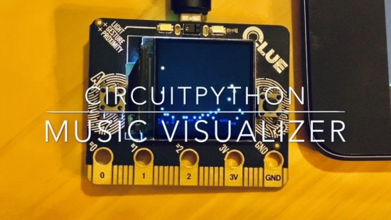](https://steam-tokyo.com/making-circuitpython-music-visualizer/)

A CircuitPython-based music and sound visualizer, built using the Adafruit CLUE board. The onboard microphone captures the ambient sound and the CLUE provides a visual representation of the frequencies it detects on the color display. The ulab library, similar to numpy, provides the fast fourier transform function which takes the sound data and provides the frequencies to display. Written in Japanese and English - [STEAM Tokyo](https://steam-tokyo.com/making-circuitpython-music-visualizer/) and [Twitter](https://twitter.com/AoyamaProd/status/1308710472611315712).

## Hacktoberfest

Hacktoberfest® is a celebration of Open Source Softare, created by DigitalOcean. It's open to everyone around the globe. Whether you’re a developer, student learning to code, event host, or company of any size, you can help drive growth of open source and make positive contributions to an ever-growing community. All backgrounds and skill levels are encouraged to complete the challenge. You can win a t-shirt or plant a tree.

Pull requests can be made in any GitHub-hosted repositories/projects. You can sign up anytime between October 1 and October 31. More - [Hacktoberfest](https://hacktoberfest.digitalocean.com/).

## PyLadies inaugural Global Council

PyLadies announced the results for the inaugural PyLadies Global Council! The Global Council has 9 seats, including 6 seats selected by public election with a 2 year service commitment and 3 seats selected by application with a 1 year service commitment. Additionally the Council has a diversity and inclusion requirement that sets a maximum of 3 seats to be filled by members from the same counry of residence.

The inaugural Council members include:

- Ana Cecília Vieira Silva (Brazil) - 2 year term
- Juliana Ferreira Alves (Brazil) - 2 year term
- Ana Valeria Calderón Briz (México) - 2 year term
- Jessica Upani (Namibia) - 2 year term
- Lynn Root (United States of America) - 2 year term
- Tania Allard (United Kingdom) - 2 year term
- Sarah Adigwe (Nigeria) - 1 year term
- Marie-Louise Annan (United Kingdom) - 1 year term
- Reshama Shaikh (United States of America) - 1 year term

## CircuitPython Deep Dive Stream with Scott Shawcroft

[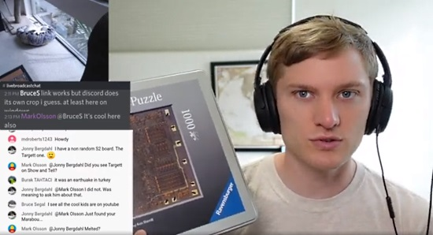](link)

[This week](link), Scott streams his work on .

You can see the latest video and past videos on the Adafruit YouTube channel under the Deep Dive playlist - [YouTube](https://www.youtube.com/playlist?list=PLjF7R1fz_OOXBHlu9msoXq2jQN4JpCk8A).

## Adafruit Update

**Adafruit is shipping orders!**

Adafruit is stocked and shipping orders!

Now is the best time to get orders in for your favorite products, including items for students.

Science is fun and educational when using Adafruit parts and free, easy to follow tutorials in the [Adafruit Learning System](https://learn.adafruit.com/).

[Shop Adafruit now](https://www.adafruit.com/)

## News from around the web!

A demonstration of an internet-calibrated clock on an ESP32-S2 using CircuitPython 6.0.0 beta 0 - [Twitter](https://twitter.com/krantas/status/1309796454450429953).

[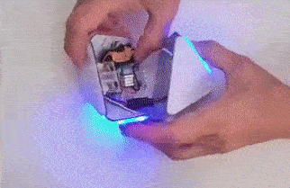](https://twitter.com/GeekMomProjects/status/1290047633906470912)

A self contained RGB LED edge-lit octohedron. It's controlled by a Serpente M0 running CircuitPython with a wire broken out for use as a capacitive touch switch. The halves snap together with homemade magnetic connectors - [Twitter](https://twitter.com/GeekMomProjects/status/1290047633906470912).

[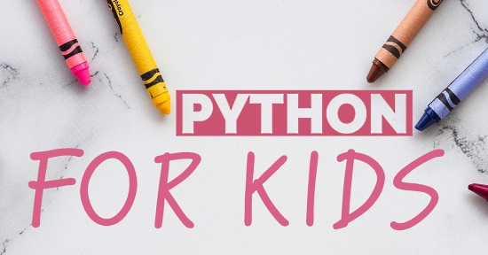](https://github.com/mytechnotalent/Python-For-Kids)

Python For Kids is a comprehensive Python Development tutorial FOR KIDS utilizing a micro:bit Development Board going step-by-step into the world of Python for Microcontrollers - [GitHub](https://github.com/mytechnotalent/Python-For-Kids).

[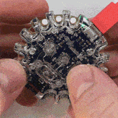](https://jjmojojjmojo.github.io/time-based-fading.html)

Time-Based NeoPixel Fading In CircuitPython With FancyLED, demonstrated with a Circuit Playground Express - [GitHub](https://jjmojojjmojo.github.io/time-based-fading.html).

A Python GUI App In No Time: a closer look into the Tkinter library - [TowardsDataScience](https://towardsdatascience.com/python-gui-app-in-no-time-ea7282e33024) and [Twitter](https://twitter.com/itknowingness/status/1309580721477111808).

[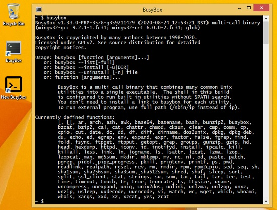](http://frippery.org/busybox/)

busybox-w32 is a port of BusyBox to the Microsoft Windows WIN32 API. BusyBox implements well over a hundred Unix-style commands. busybox-w32 brings a subset of the functionality of BusyBox to Windows in a single self-contained native executable - [frippery.org](http://frippery.org/busybox/).

Dictionary view objects in Python - [JohnLekberg.com](https://johnlekberg.com/blog/2020-09-19-dict-view.html).

## Coming soon

[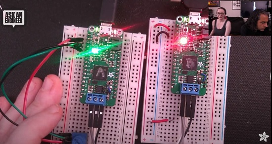](https://blog.adafruit.com/2020/09/24/adafruit-top-secret-video-september-23-2020-adafruittopsecret-circuitpython-adafruit-fromthevault-adafruit/)

On last week's Adafruit [Ask an Engineer program](https://www.adafruit.com/ask), Ladyada demonstrated a new Feather board on Top Secret. The board is SAMD54-based (SAMD51 ARM Cortex M4) with extra capabilities, including hardware CANbus support. A CAN transceiver on board provides the proper signalling and two of these boards were communicating over a three wire bidirectional CANbus (similar to the communications used in automotive and industrial applications). It's not out yet but keep an eye out for availability soon - [Adafruit Top Secret](https://blog.adafruit.com/2020/09/24/adafruit-top-secret-video-september-23-2020-adafruittopsecret-circuitpython-adafruit-fromthevault-adafruit/).

**#ICYDNCI What was the most popular, most clicked link, in [last week's newsletter](https://link)? [title](url).**

## Made with Mu

Why Mu? Mu tries to make it as easy as possible to get started with programming but aims to help you graduate to "real" development tools soon after. Everything in Mu is the "real thing" but presented in as simple and obvious way possible. It's like the toddling stage in learning to walk: you're finding your feet and once you're confident, you should move on and explore! Put simply, Mu aims to foster autonomy. Try out Mu today! - [codewith.mu](https://codewith.mu/)

## New Boards Supported by CircuitPython

The number of supported microcontrollers and Single Board Computers (SBC) grows every week. This section outlines which boards have been included in CircuitPython or added to [CircuitPython.org](https://circuitpython.org/).

This week we had X new boards added!

- [Board name](url)

Looking for adding a new board to CircuitPython? It's highly encouraged! Adafruit has four guides to help you do so:

- [How to Add a New Board to CircuitPython](https://learn.adafruit.com/how-to-add-a-new-board-to-circuitpython/overview)
- [How to add a New Board to the circuitpython.org website](https://learn.adafruit.com/how-to-add-a-new-board-to-the-circuitpython-org-website)
- [Adding a Single Board Computer to PlatformDetect for Blinka](https://learn.adafruit.com/adding-a-single-board-computer-to-platformdetect-for-blinka)
- [Adding a Single Board Computer to Blinka](https://learn.adafruit.com/adding-a-single-board-computer-to-blinka)

## New Learn Guides!

[title](url) from [name](url)

## Updated Learn Guides!

[title](url) from [name](url)

## CircuitPython Libraries!

[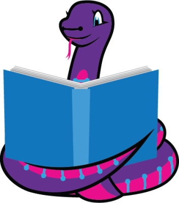](https://circuitpython.org/libraries)

CircuitPython support for hardware continues to grow. We are adding support for new sensors and breakouts all the time, as well as improving on the drivers we already have. As we add more libraries and update current ones, you can keep up with all the changes right here!

For the latest libraries, download the [Adafruit CircuitPython Library Bundle](https://circuitpython.org/libraries). For the latest community contributed libraries, download the [CircuitPython Community Bundle](https://github.com/adafruit/CircuitPython_Community_Bundle/releases).

If you'd like to contribute, CircuitPython libraries are a great place to start. Have an idea for a new driver? File an issue on [CircuitPython](https://github.com/adafruit/circuitpython/issues)! Have you written a library you'd like to make available? Submit it to the [CircuitPython Community Bundle](https://github.com/adafruit/CircuitPython_Community_Bundle). Interested in helping with current libraries? Check out the [CircuitPython.org Contributing page](https://circuitpython.org/contributing). We've included open pull requests and issues from the libraries, and details about repo-level issues that need to be addressed. We have a guide on [contributing to CircuitPython with Git and Github](https://learn.adafruit.com/contribute-to-circuitpython-with-git-and-github) if you need help getting started. You can also find us in the #circuitpython channel on the [Adafruit Discord](https://adafru.it/discord).

You can check out this [list of all the Adafruit CircuitPython libraries and drivers available](https://github.com/adafruit/Adafruit_CircuitPython_Bundle/blob/master/circuitpython_library_list.md). 

The current number of CircuitPython libraries is **###**!

**New Libraries!**

Here's this week's new CircuitPython libraries:

* [library](url)

**Updated Libraries!**

Here's this week's updated CircuitPython libraries:

* [library](url)

**PyPI Download Stats!**

We've written a special library called Adafruit Blinka that makes it possible to use CircuitPython Libraries on [Raspberry Pi and other compatible single-board computers](https://learn.adafruit.com/circuitpython-on-raspberrypi-linux/). Adafruit Blinka and all the CircuitPython libraries have been deployed to PyPI for super simple installation on Linux! Here are the top 10 CircuitPython libraries downloaded from PyPI in the last week, including the total downloads for those libraries:

Keep checking back for updated download stats coming soon!

## What’s the team up to this week?

What is the team up to this week? Let’s check in!

**Bryan**

[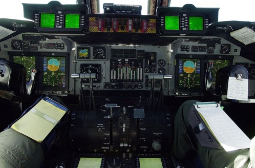](https://circuitpython.org/)

The BNO08x libraries for CircuitPython and Arduino are released, both for the full SHTP based interface as well as libraries to use the super-neat **UART-RVC** interface. Along with them the guide has been mostly finished, and with four associated libraries as well as 3 and a half different transports, it’s my largest guide to date except for, possibly, my first which included an inordinate number of animated gifs. I always say this and it’s always genuine but I am _really_ excited to see what folks do with these libraries and the BNO08x sensors. There are many applications that I can think of, just off the top of my noggin: 

**Head tracking for VR applications:** This sensor specifically targets this use case and includes several report types and fusion products to optimize for that application. I’d like to see BNO08x support added to the [Relativity project](https://github.com/relativty/Relativty) but it’d have to be someone with more free time than me! I can also imagine IMUs and autopilots or AHRS systems for model airplanes, novel input devices and even musical instruments. I’ll be honestly sad if I don’t see a little glass cockpit for RC planes come out of this.

[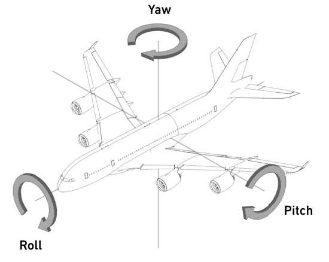](https://circuitpython.org/)

By Aashmango4793 - Own work, CC BY-SA 4.0, https://commons.wikimedia.org/w/index.php?curid=81688701 

With the BNO08x libraries (and soon breakouts) shipped, I’m back to CAN land, currently implementing a (Circuit)Python library to complement the `canio` module that Jepler is adding to the CP core for MCUs that support it. Once we get a stable foundation for the basics on the platforms we target, we can then start thinking about supporting features for [higher level protocols](http://www.copperhilltechnologies.com/can-bus-guide-higher-layer-protocols/) that will enable things like car hacking and more robust sensor networks.

**Jeff**

My new "canio" module with support for the SAM E51 and E54 was merged to CircuitPython. The code has been validated by exchanging packets between the E5x microcontrollers and STM32F405 microcontrollers running Micropython. I also snooped the CAN bus in my car. It missed the 6.0.0-beta.0 release, but it will be a part of the next beta.  A Feather with CAN support is in the works, but if you're eager (maybe you want to start creating an OBD-II library?) you can check it out now with the SAM E54 Xplained board from Microchip.

**Lucian**

This week I finished investigating the bugs occurring on the RGBMatrix, which turned out to mostly be from a single, minor issue in the Learn guide! It's funny when one small mixup in something like the documentation can result in an error being compounded across multiple systems until it looks like some monstrous, mysterious bug, when in fact the software is fine. There was a legitimate crash hidden in there too, though, so it's good that we revisited the issue in detail. 

I've also started up work on the AnalogIO functionality for the ESP32, and had a good discussion with Scott about module priorities after that. Getting the basics done for the ESP32 series is the highest priority for now, since those chips are so capable, but I'm still excited for things that might be a little further down the pipeline, like enabling the crypto modules and camera functions of the STM32 series. There are a lot of interesting chips coming out from Espressif and ST in the near future, so it's been fun to think about what can be done with the next generation of smaller, faster, and even more capable SoCs. 

**Melissa**

This past week I worked on writing a guide for the Pixel Framebuf library. You can check it out at https://learn.adafruit.com/easy-neopixel-graphics-with-the-circuitpython-pixel-framebuf-library.

I also wrote another demo for John Park's workshop. Be sure to catch his show each week on Thursdays at 1PM Pacific/4PM Eastern.

I also worked on converting the adafruit-pitft shell script from Bash to Python. I am going to continue working on testing and debugging it before I put it up on github, but it's working well so far. One of the biggest changes are that it has a master configuration that will be much easier to add more boards to so it will be easier to manage.

**Scott**

This week I've been bouncing between adding multiple flash size support to UF2 and fixing bugs in my requests library changes. UF2 is the USB drive bootloader that we've loved on SAMD and nRF and we're now bringing it to the ESP32-S2.

Updating the adafruit_requests library has been a challenge. Networking can error at any time, which means the code needs to handle exceptions in many places. Furthermore, the library works with a number of socket implementations that currently do things a little bit different from each other. CircuitPython is also memory limited so we're trying to do it all while using memory in small pieces, rather than large ones.

## Upcoming events!

PyGotham is a New York City based, eclectic, Py-centric conference covering many topics. PyGotham TV taking place October 2-3, 2020 with a single track of talks presented online - [Event Website](https://2020.pygotham.tv/).

PyCon India 2020: the premier conference in India on using and developing the Python programming language. Held online October 3-5, 2020 - [Website](https://in.pycon.org/2020/) and [Twitter](https://twitter.com/pyconindia).

PyCon Estonia 2020 will be a virtual conference held October 8, 2020 - [PyCon Estonia](https://pycon.ee/).

The Hackaday Remoticon will take place everywhere November 6th – 8th, 2020. It’s a weekend packed with workshops about hardware creation, held virtually for all to enjoy - [Hackaday](https://hackaday.com/2020/08/04/hackaday-remoticon-our-2020-conference-is-packed-with-workshops-and-were-calling-for-proposals/).

PyCon Sweden 2020 will be held 12-13 of November 2020 online. The Call for proposals ends quickly, on **30 September 2020** - [PyCon Sweden](http://www.pycon.se/).

**Send Your Events In**

As for other events, with the COVID pandemic, most in-person events are postponed or cancelled. If you know of virtual events or events that may occur in the future, please let us know on Discord or on Twitter with hashtag #CircuitPython.

## Latest releases

CircuitPython's stable release is [#.#.#](https://github.com/adafruit/circuitpython/releases/latest) and its unstable release is [#.#.#-##.#](https://github.com/adafruit/circuitpython/releases). New to CircuitPython? Start with our [Welcome to CircuitPython Guide](https://learn.adafruit.com/welcome-to-circuitpython).

[2020####](https://github.com/adafruit/Adafruit_CircuitPython_Bundle/releases/latest) is the latest CircuitPython library bundle.

[v#.#.#](https://micropython.org/download) is the latest MicroPython release. Documentation for it is [here](http://docs.micropython.org/en/latest/pyboard/).

[#.#.#](https://www.python.org/downloads/) is the latest Python release. The latest pre-release version is [#.#.#](https://www.python.org/download/pre-releases/).

[### Stars](https://github.com/adafruit/circuitpython/stargazers) Like CircuitPython? [Star it on GitHub!](https://github.com/adafruit/circuitpython)

## Call for help -- Translating CircuitPython is now easier than ever!

[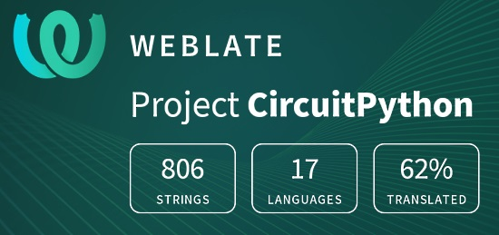](https://hosted.weblate.org/engage/circuitpython/)

One important feature of CircuitPython is translated control and error messages.

With the help of fellow open source project [Weblate](https://weblate.org/), we're making it even easier to add or improve translations.

Sign in with an existing account such as Github, Google or Facebook and start contributing through a simple web interface. No forks or pull requests needed!

As always, if you run into trouble join us on [Discord](https://adafru.it/discord), we're here to help.

## jobs.adafruit.com - Find a dream job, find great candidates!

[jobs.adafruit.com](https://jobs.adafruit.com/) has returned and folks are posting their skills (including CircuitPython) and companies are looking for talented makers to join their companies - from Digi-Key, to Hackaday, Microcenter, Raspberry Pi and more.

## NUMBER thanks!

The Adafruit Discord community, where we do all our CircuitPython development in the open, reached over NUMBER humans, thank you!  Adafruit believes Discord offers a unique way for CircuitPython folks to connect. Join today at [https://adafru.it/discord](https://adafru.it/discord).

## ICYMI - In case you missed it

The wonderful world of Python on hardware! This is our first video-newsletter-podcast that we’ve started! The news comes from the Python community, Discord, Adafruit communities and more. Kattni turns the weekly news into video form for ASK an ENGINEER and Adafruit social media. The complete Python on Hardware weekly videocast [playlist is here](https://www.youtube.com/playlist?list=PLjF7R1fz_OOXRMjM7Sm0J2Xt6H81TdDev). 

This video podcast is on [iTunes](https://itunes.apple.com/us/podcast/python-on-hardware/id1451685192?mt=2), [YouTube](http://adafru.it/pohepisodes), [IGTV (Instagram TV](https://www.instagram.com/adafruit/channel/)), and [XML](https://itunes.apple.com/us/podcast/python-on-hardware/id1451685192?mt=2).

[Weekly community chat on Adafruit Discord server CircuitPython channel - Audio / Podcast edition](https://itunes.apple.com/us/podcast/circuitpython-weekly-meeting/id1451685016) - Audio from the Discord chat space for CircuitPython, meetings are usually Mondays at 2pm ET, this is the audio version on [iTunes](https://itunes.apple.com/us/podcast/circuitpython-weekly-meeting/id1451685016), Pocket Casts, [Spotify](https://adafru.it/spotify), and [XML feed](https://adafruit-podcasts.s3.amazonaws.com/circuitpython_weekly_meeting/audio-podcast.xml).

And lastly, we are working up a one-spot destination for all things podcast-able here - [podcasts.adafruit.com](https://podcasts.adafruit.com/)

## Codecademy "Learn Hardware Programming with CircuitPython"

Codecademy, an online interactive learning platform used by more than 45 million people, has teamed up with the leading manufacturer in STEAM electronics, Adafruit Industries, to create a coding course, "Learn Hardware Programming with CircuitPython". The course is now available in the [Codecademy catalog](https://www.codecademy.com/learn/learn-circuitpython?utm_source=adafruit&utm_medium=partners&utm_campaign=circuitplayground&utm_content=pythononhardwarenewsletter).

Python is a highly versatile, easy to learn programming language that a wide range of people, from visual effects artists in Hollywood to mission control at NASA, use to quickly solve problems. But you don’t need to be a rocket scientist to accomplish amazing things with it. This new course introduces programmers to Python by way of a microcontroller — CircuitPython — which is a Python-based programming language optimized for use on hardware.

CircuitPython’s hardware-ready design makes it easier than ever to program a variety of single-board computers, and this course gets you from no experience to working prototype faster than ever before. Codecademy’s interactive learning environment, combined with Adafruit's highly rated Circuit Playground Express, present aspiring hardware hackers with a never-before-seen opportunity to learn hardware programming seamlessly online.

Whether for those who are new to programming, or for those who want to expand their skill set to include physical computing, this course will have students getting familiar with Python and creating incredible projects along the way. By the end, students will have built their own bike lights, drum machine, and even a moisture detector that can tell when it's time to water a plant.

Visit Codecademy to access the [Learn Hardware Programming with CircuitPython](https://www.codecademy.com/learn/learn-circuitpython?utm_source=adafruit&utm_medium=partners&utm_campaign=circuitplayground&utm_content=pythononhardwarenewsletter) course and Adafruit to purchase a [Circuit Playground Express](https://www.adafruit.com/product/3333).

Codecademy has helped more than 45 million people around the world upgrade their careers with technology skills. The company’s online interactive learning platform is widely recognized for providing an accessible, flexible, and engaging experience for beginners and experienced programmers alike. Codecademy has raised a total of $43 million from investors including Union Square Ventures, Kleiner Perkins, Index Ventures, Thrive Capital, Naspers, Yuri Milner and Richard Branson, most recently raising its $30 million Series C in July 2016.

## Contribute!

The CircuitPython Weekly Newsletter is a CircuitPython community-run newsletter emailed every Tuesday. The complete [archives are here](https://www.adafruitdaily.com/category/circuitpython/). It highlights the latest CircuitPython related news from around the web including Python and MicroPython developments. To contribute, edit next week's draft [on GitHub](https://github.com/adafruit/circuitpython-weekly-newsletter/tree/gh-pages/_drafts) and [submit a pull request](https://help.github.com/articles/editing-files-in-your-repository/) with the changes. You may also tag your information on Twitter with #CircuitPython. 

Join our [Discord](https://adafru.it/discord) or [post to the forum](https://forums.adafruit.com/viewforum.php?f=60) for any further questions.
