- [ ] Kattni updates
- [ ] change date
- [ ] update title
- [ ] Feature story
- [ ] Update  for images
- [ ] Update ICYDNCI
- [ ] All images 550w max only
- [ ] Link "View this email in your browser."

View this email in your browser.

Welcome, here's the latest Python for Microcontrollers newsletter, brought you by the community! We're on [Discord](https://discord.gg/HYqvREz), [Twitter](https://twitter.com/search?q=circuitpython&src=typed_query&f=live), and for past newsletters - [view them all here](https://www.adafruitdaily.com/category/circuitpython/). If you're reading this on the web, [subscribe here](https://www.adafruitdaily.com/). Here we go!

## CircuitPython 6.0.0 Beta 1 and Beta 2 Released

CircuitPython 6.0.0 Beta 1 and Beta 2 were released in the last week. These are the second and third beta releases of CircuitPython 6.0.0. The code is relatively stable overall. Beta 1 includes a new canio API, support for the 128x64 OLED and many fixes while Beta 2 fixes a crash mode with RGBMatrix - [Release Notes Beta 1](https://github.com/adafruit/circuitpython/releases/tag/6.0.0-beta.1) and [Release Notes Beta 2](https://github.com/adafruit/circuitpython/releases/tag/6.0.0-beta.2).

## A CircuitPython Programmable Watch

[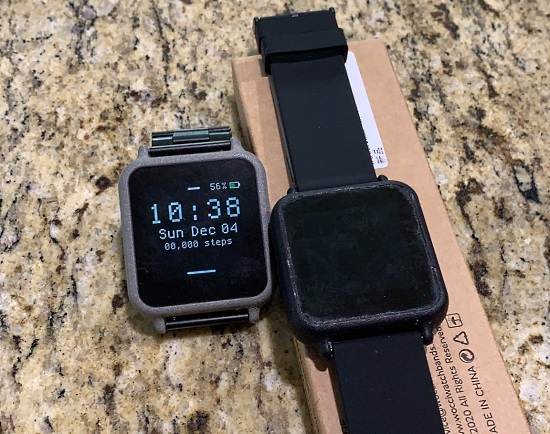](https://twitter.com/TG_Techie)

[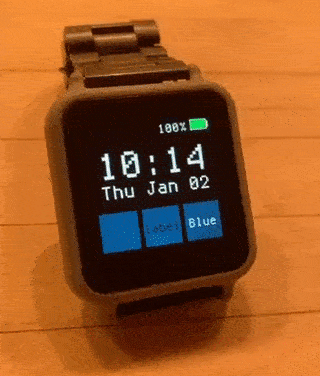](https://twitter.com/TG_Techie)

Twitter user TG-Techie is progressing with work on a watch running CircuitPython.

> Choosing CircuitPython for the firmware was certainly the right choice, having a REPL makes testing on-board components easy as py.

In the latest updates, the new GUI framework is coming along - [Twitter](https://twitter.com/TG_Techie).

## Join the Python Developers Survey 2020

This year, the Python Software Foundation is conducting the fourth iteration of the official Python Developers Survey. The goal is to capture the current state of the language and the ecosystem around it. By comparing the results with last year’s, they can identify and share with everyone the hottest trends in the Python community and the key insights into it.

In 2019, more than 24,000 Python users from 150 countries participated and shared how they use the language.

Contribute to the community’s knowledge. The survey takes about 10 minutes to complete - [Python Blog](http://pyfound.blogspot.com/2020/10/join-python-developers-survey-2020.html).

**Other Official Python News**

Python 3.9 Removes Backwards Compatibility Layers for Python 2.7 - [Python.Org](https://docs.python.org/3.9/whatsnew/3.9.html?v=) and [Twitter](https://twitter.com/pycoders/status/1310915228507529217).

As of Friday, October 2, 2020, Python 3.5 is no longer supported - [Python Insider](https://pythoninsider.blogspot.com/2020/10/python-35-is-no-longer-supported.html).

Changes are coming to pip, Python's package installation tool, this month. -[Twitter](https://twitter.com/ThePSF/status/1311675995661926401) and [YouTube](https://www.youtube.com/watch?v=B4GQCBBsuNU&feature=youtu.be) plus a [Migration Guide](https://pip.pypa.io/en/latest/user_guide/#changes-to-the-pip-dependency-resolver-in-20-2-2020).

## Laughing Skulls with CircuitPython

[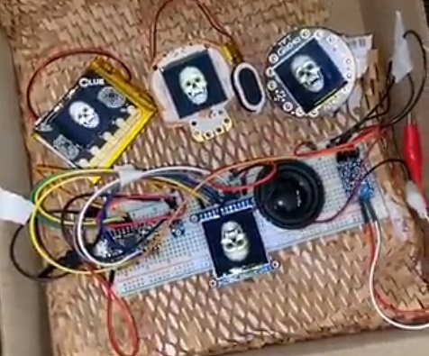](https://twitter.com/MarkKomus/status/1312878023864135680)

Turn your Adafruit[ HalloWing M4](https://www.adafruit.com/product/4300), [CLUE](https://www.adafruit.com/product/4500), [Circuit Playground Bluefruit](https://www.adafruit.com/product/4333) or [ItsyBitsy M4](https://www.adafruit.com/product/3800) into a laughing haunted skill animation with CircuitPython 6.0. Includes code and resources - [GitHub](https://github.com/Gamblor21/laughing_skull) and [Twitter](https://twitter.com/MarkKomus/status/1312878023864135680).

## KiCad 2020 Virtual Edition Badge

[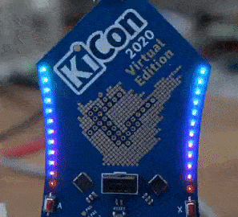](https://twitter.com/thomasflummer/status/1311031744091439104)

The KiCad 2020 Virtual Edition badge, designed by Thomas Flummer, uses the SAMD21 microcontroller and has 21 tiny RGB LEDs along the sides. The badge is programmable in CircuitPython - [Twitter](https://twitter.com/thomasflummer/status/1311031744091439104).

## CircuitPython Deep Dive Stream with Scott Shawcroft

[This week](https://youtu.be/vAPOZrG8pBo), Scott streams his work on Email and Code Reviews.

You can see the latest video and past videos on the Adafruit YouTube channel under the Deep Dive playlist - [YouTube](https://www.youtube.com/playlist?list=PLjF7R1fz_OOXBHlu9msoXq2jQN4JpCk8A).

## Adafruit Update

**Adafruit is stocked and shipping orders!**

Now is the best time to get orders in for your favorite products, including items for students. Science is fun and educational when using Adafruit parts and free, easy to follow tutorials in the [Adafruit Learning System](https://learn.adafruit.com/).

See projects tagged #ElectronicHalloween all month for Halloween related projects using Adafruit gear. Adafruit carries all the technology to make Halloween special - [Twitter](https://twitter.com/hashtag/ElectronicHalloween?src=hashtag_click) and [Adafruit Blog](https://blog.adafruit.com/category/halloween/).

**[Shop Adafruit now](https://www.adafruit.com/)**

## Unexpected Maker FeatherS2

[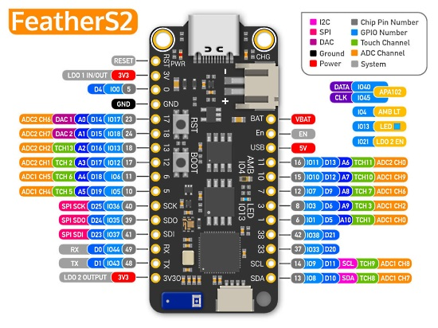](https://unexpectedmaker.com/shop/feathers2-esp32-s2)

The FeatherS2 is a PRO ESP32-S2 based development board in a Feather format. This Feather has some nice extras: 16MB Flash, 8MB PSRAM, and a STEMMA QT/Qwiic connector. It comes flashed with CircuitPython 6.0 Beta 1 - [Unexpected Maker](https://unexpectedmaker.com/shop/feathers2-esp32-s2). 

## News from around the web!

[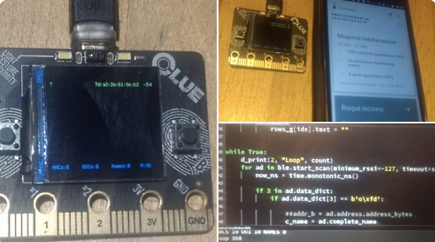](https://twitter.com/DavidGlaude/status/1311435336686473216)

Counting the number of phones with [Coronalert.Be](https://twitter.com/CoronalertBe) nearby an [Adafruit CLUE board](https://www.adafruit.com/product/4500) - [GitHub](https://github.com/dglaude/circuitpython-examples/blob/master/clue/clue-ble-scanner.py) and [Twitter](https://twitter.com/DavidGlaude/status/1311435336686473216).

[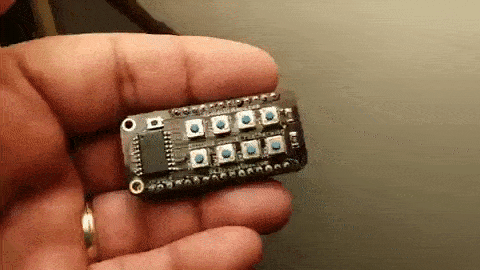](https://twitter.com/cogliano/status/1312005953970110464)

Dan's Buttons Galore! FeatherWing being used as a handheld sound cue system. It can play up to 64 sounds/tracks with 8 banks of 8 sounds each - [Twitter](https://twitter.com/cogliano/status/1312005953970110464).

Woolsey Workshop published a tutorial on how to get started using Blinka to support your CircuitPython Programs on the Raspberry Pi - [Woolsey Workshop](https://www.woolseyworkshop.com/2020/09/29/getting-started-with-circuitpython-on-raspberry-pi-with-blinka/) and [Twitter](https://twitter.com/JohnWWoolsey/status/1310969536221523969).

Prevent annoying Mac ._ files on CIRCUITPY - [todbit blog](https://todbot.com/blog/2020/10/03/prevent-annoying-mac-_-files-being-created-on-circuitpy/) and [Twitter](https://twitter.com/todbot/status/1312632671453863936).

Model Train Layout Lighting FX with CircuitPython & Arduino - [YouTube](https://www.youtube.com/watch?v=2CXffkDRE9s).

[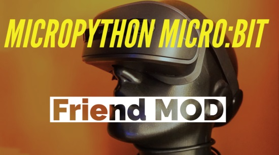](https://github.com/mytechnotalent/MicroPython-micro-bit_Friend_MOD)

Add a chatbot MOD to the official BBC micro:bit fork of MicroPython - [GitHub](https://github.com/mytechnotalent/MicroPython-micro-bit_Friend_MOD).

[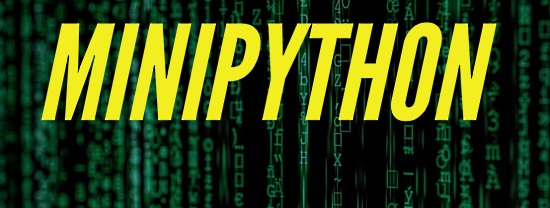](https://github.com/mytechnotalent/minipython)

MiniPython for the BBC micro:bit - [GitHub](https://github.com/mytechnotalent/minipython).

[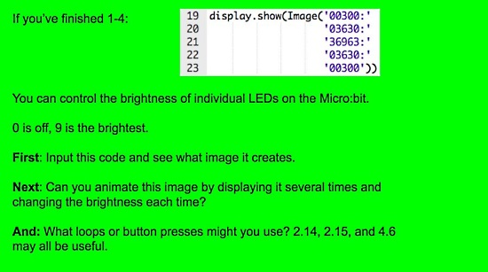](https://twitter.com/morrill_rob/status/1310959501202403330)

Rob Morrill writes: "My students can work at whatever pace is comfortable for them in [Firia Labs's CodeSpace](https://twitter.com/FiriaLabs) to learn Python on the 
micro:bit" - [Twitter](https://twitter.com/morrill_rob/status/1310959501202403330).

[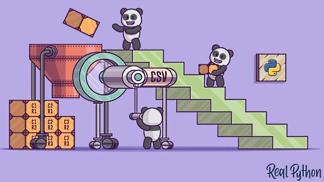](https://twitter.com/realpython/status/1311682305006632963)

Reading and Writing CSV Files in Python - [Real Python](https://twitter.com/realpython/status/1311682305006632963).

#ICYDNCI What was the most popular, most clicked link, in [last week's newsletter](https://www.adafruitdaily.com/2020/09/29/python-on-microcontrollers-newsletter-halloween-events-projects-and-more-python-adafruit-circuitpython-circuitpythonday-micropython-thepsf/)? [Creating a CircuitPython Music Visualizer](https://steam-tokyo.com/making-circuitpython-music-visualizer/).

## Coming soon

The Desk of Ladyada - Testing out CircuitPython on ESP32S2 Metro - [YouTube](https://youtu.be/9XlwXvT19Rk) and [Twitter](https://twitter.com/adafruit/status/1312929272332316672).

## New Boards Supported by CircuitPython

The number of supported microcontrollers and Single Board Computers (SBC) grows every week. This section outlines which boards have been included in CircuitPython or added to [CircuitPython.org](https://circuitpython.org/).

This week we had 6 new boards added!

- [QT Py Haxpress](https://circuitpython.org/board/qtpy_m0_haxpress/)
- [Feather M4 CAN](https://circuitpython.org/board/feather_m4_can/)
- [Vina-D21](https://circuitpython.org/board/bdmicro_vina_d21/)
- [QT Py](https://circuitpython.org/board/qtpy_m0/)
- [https://circuitpython.org/board/unexpectedmaker_feathers2/](https://circuitpython.org/board/unexpectedmaker_feathers2/)
- [Metro ESP32-S2](https://circuitpython.org/board/adafruit_metro_esp32s2/)

Looking for adding a new board to CircuitPython? It's highly encouraged! Adafruit has four guides to help you do so:

- [How to Add a New Board to CircuitPython](https://learn.adafruit.com/how-to-add-a-new-board-to-circuitpython/overview)
- [How to add a New Board to the circuitpython.org website](https://learn.adafruit.com/how-to-add-a-new-board-to-the-circuitpython-org-website)
- [Adding a Single Board Computer to PlatformDetect for Blinka](https://learn.adafruit.com/adding-a-single-board-computer-to-platformdetect-for-blinka)
- [Adding a Single Board Computer to Blinka](https://learn.adafruit.com/adding-a-single-board-computer-to-blinka)

## New Learn Guides!

[Adafruit QT Py](https://learn.adafruit.com/adafruit-qt-py) from [Kattni Rembor](https://learn.adafruit.com/users/kattni)

[Adafruit IO Basics: Schedule Triggers](https://learn.adafruit.com/adafruit-io-basics-scheduled-triggers) from [Brent Rubell](https://learn.adafruit.com/users/brubell)

[Easy No-Soldering Bluetooth Controlled Room Lights](https://learn.adafruit.com/easy-no-solder-bluetooth-controlled-room-lights) from [Erin St Blaine](https://learn.adafruit.com/users/firepixie)

[MIDI Melody Maker](https://learn.adafruit.com/midi-melody-maker) from [Ruiz Brothers](https://learn.adafruit.com/users/pixil3d)

[Purple Air AQI Display](https://learn.adafruit.com/purple-air-aqi-display) from [John Park](https://learn.adafruit.com/users/johnpark)

## CircuitPython Libraries!

CircuitPython support for hardware continues to grow. We are adding support for new sensors and breakouts all the time, as well as improving on the drivers we already have. As we add more libraries and update current ones, you can keep up with all the changes right here!

For the latest libraries, download the [Adafruit CircuitPython Library Bundle](https://circuitpython.org/libraries). For the latest community contributed libraries, download the [CircuitPython Community Bundle](https://github.com/adafruit/CircuitPython_Community_Bundle/releases).

If you'd like to contribute, CircuitPython libraries are a great place to start. Have an idea for a new driver? File an issue on [CircuitPython](https://github.com/adafruit/circuitpython/issues)! Have you written a library you'd like to make available? Submit it to the [CircuitPython Community Bundle](https://github.com/adafruit/CircuitPython_Community_Bundle). Interested in helping with current libraries? Check out the [CircuitPython.org Contributing page](https://circuitpython.org/contributing). We've included open pull requests and issues from the libraries, and details about repo-level issues that need to be addressed. We have a guide on [contributing to CircuitPython with Git and Github](https://learn.adafruit.com/contribute-to-circuitpython-with-git-and-github) if you need help getting started. You can also find us in the #circuitpython channel on the [Adafruit Discord](https://adafru.it/discord).

You can check out this [list of all the Adafruit CircuitPython libraries and drivers available](https://github.com/adafruit/Adafruit_CircuitPython_Bundle/blob/master/circuitpython_library_list.md). 

The current number of CircuitPython libraries is **273**!

**New Libraries!**

Here's this week's new CircuitPython libraries:

* [Adafruit_CircuitPython_DisplayIO_SH1107](https://github.com/adafruit/Adafruit_CircuitPython_DisplayIO_SH1107)

**Updated Libraries!**

Here's this week's updated CircuitPython libraries:

 * [Adafruit_CircuitPython_AdafruitIO](https://github.com/adafruit/Adafruit_CircuitPython_AdafruitIO)
 * [Adafruit_CircuitPython_FRAM](https://github.com/adafruit/Adafruit_CircuitPython_FRAM)
 * [Adafruit_CircuitPython_MotorKit](https://github.com/adafruit/Adafruit_CircuitPython_MotorKit)
 * [Adafruit_CircuitPython_MatrixPortal](https://github.com/adafruit/Adafruit_CircuitPython_MatrixPortal)
 * [Adafruit_Blinka](https://github.com/adafruit/Adafruit_Blinka)
 * [CircuitPython_Community_Bundle](https://github.com/adafruit/CircuitPython_Community_Bundle)

**PyPI Download Stats!**

We've written a special library called Adafruit Blinka that makes it possible to use CircuitPython Libraries on [Raspberry Pi and other compatible single-board computers](https://learn.adafruit.com/circuitpython-on-raspberrypi-linux/). Adafruit Blinka and all the CircuitPython libraries have been deployed to PyPI for super simple installation on Linux! Here are the top 10 CircuitPython libraries downloaded from PyPI in the last week, including the total downloads for those libraries:

Keep checking back for updated download stats coming soon!

## What’s the team up to this week?

What is the team up to this week? Let’s check in!

**Bryan**

I just wrapped up my work on the [CircuitPython library](https://github.com/adafruit/Adafruit_CircuitPython_MCP2515) for the MCP2515 CANbus controller. It was fun to work with and I enjoyed collaborating with Jeff to determine the API that the `canio` devices will use. This work will make it so that code written for one CAN controller, like those included with the SAM-E51 will be usable with another CAN controller, such as the venerable MCP2515.

Next up, I’m working on a sweet little 12-bit ADC, the TLA2024, before looping back to do some additional real-world tests with the CAN hardware and libraries.

**Jeff**

[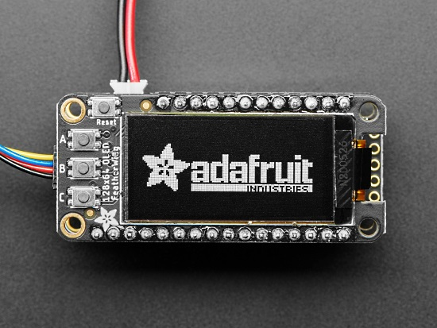](https://circuitpython.org/)

For info about what I've been up to with CAN bus, check out Bryan's report.  I want to spotlight a contribution from github user @mdroberts1243, who has added support for the FeatherWing SH1107 128x64 OLED display.  It will be great to have these displays be compatible with CircuitPython starting with beta.1.  Thanks, Mark!  I have one one of these displays that I hope to include in a project soon.

**Kattni**

I'm back after being out for two weeks, so there's not much to report this week. Published a guide for the QT Py. Many of these were purchased before the guide was written, so if you got your QT Py, but aren't sure where to begin, check out the guide to get started. I updated the guide for the TSL2591 to include the STEMMA QT version. I wrote up a quick guide for the LTC4311 with pinouts and downloads resources. I'm now working on a guide for the MIDI FeatherWing, so keep an eye out for that.

**Melissa**

This past week I've been quite busy. It started off with writing a [guide for the new MatrixPortal board](https://learn.adafruit.com/adafruit-matrixportal-m4), which turned out quite well.

[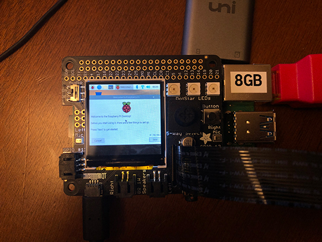](https://circuitpython.org/)

I finished up the Python version of the PiTFT installer script and learned enough of the Click library to add some automation flags so that the script could be completely automated with a single command and no other user input. For complex installations with boards like the new BrainCraft Hat, this makes a huge difference. One of the big advantages of this is that we can customize the install command for each display and the user can run it without worrying about selecting the wrong options.

[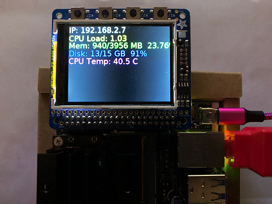](https://circuitpython.org/)

Finally, the Jetson Nano has been updated to include easily enabling SPI since I wrote a guide for it. So I went through and did a refresh of the guide to make it so it is up to date including how to enable SPI. I also [added a page on SPI](https://learn.adafruit.com/circuitpython-libraries-on-linux-and-the-nvidia-jetson-nano) including TFT usage and using NeoPixels with SPI. With the recent improvements, this is now one of my favorite boards that supports Blinka.

**Scott**

Since last week, I've finished fixing Requests for now. Seems to recover from errors well enough. Plus, I burnt myself out a bit on working on networking so a break is welcome.

Later last week I continued to polish up UF2 for the ESP32-S2. I got release assets attached to releases. The last thing I need to do is write up a guide on how to add UF2 support to new boards and install it on them.

Most of this week though has been fixing software issues for two new Metros for two different platforms. Metros are the best form factor to start with because they have the debug connection for easy debugging. I'm excited to see new boards coming!

## Upcoming events!

Hacktoberfest® is a celebration of Open Source Softare, created by DigitalOcean. It's open to everyone around the globe. Whether you’re a developer, student learning to code, event host, or company of any size, you can help drive growth of open source and make positive contributions to an ever-growing community. All backgrounds and skill levels are encouraged to complete the challenge. You can win a t-shirt or plant a tree.

Pull requests can be made in any GitHub-hosted repositories/projects. You can sign up anytime between October 1 and October 31. More - [Hacktoberfest](https://hacktoberfest.digitalocean.com/).

[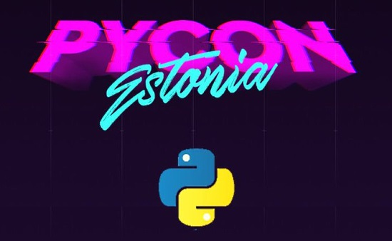](https://pycon.ee/)

PyCon Estonia 2020 will be a virtual conference held October 8, 2020 - [PyCon Estonia](https://pycon.ee/).

The Hackaday Remoticon will take place everywhere November 6th – 8th, 2020. It’s a weekend packed with workshops about hardware creation, held virtually for all to enjoy - [Hackaday](https://hackaday.com/2020/08/04/hackaday-remoticon-our-2020-conference-is-packed-with-workshops-and-were-calling-for-proposals/).

PyCon Sweden 2020 will be held 12-13 of November 2020 online - [PyCon Sweden](http://www.pycon.se/).

**Send Your Events In**

As for other events, with the COVID pandemic, most in-person events are postponed or cancelled. If you know of virtual events or events that may occur in the future, please let us know on Discord or on Twitter with hashtag #CircuitPython.

## Latest releases

CircuitPython's stable release is [#.#.#](https://github.com/adafruit/circuitpython/releases/latest) and its unstable release is [#.#.#-##.#](https://github.com/adafruit/circuitpython/releases). New to CircuitPython? Start with our [Welcome to CircuitPython Guide](https://learn.adafruit.com/welcome-to-circuitpython).

[2020####](https://github.com/adafruit/Adafruit_CircuitPython_Bundle/releases/latest) is the latest CircuitPython library bundle.

[v#.#.#](https://micropython.org/download) is the latest MicroPython release. Documentation for it is [here](http://docs.micropython.org/en/latest/pyboard/).

[#.#.#](https://www.python.org/downloads/) is the latest Python release. The latest pre-release version is [#.#.#](https://www.python.org/download/pre-releases/).

[1,855 Stars](https://github.com/adafruit/circuitpython/stargazers) Like CircuitPython? [Star it on GitHub!](https://github.com/adafruit/circuitpython)

## Call for help -- Translating CircuitPython is now easier than ever!

One important feature of CircuitPython is translated control and error messages.

With the help of fellow open source project [Weblate](https://weblate.org/), we're making it even easier to add or improve translations.

Sign in with an existing account such as Github, Google or Facebook and start contributing through a simple web interface. No forks or pull requests needed!

As always, if you run into trouble join us on [Discord](https://adafru.it/discord), we're here to help.

## jobs.adafruit.com - Find a dream job, find great candidates!

[jobs.adafruit.com](https://jobs.adafruit.com/) has returned and folks are posting their skills (including CircuitPython) and companies are looking for talented makers to join their companies - from Digi-Key, to Hackaday, Microcenter, Raspberry Pi and more.

## 25,133 thanks!

The Adafruit Discord community, where we do all our CircuitPython development in the open, reached over 25,133 humans, thank you!  Adafruit believes Discord offers a unique way for CircuitPython folks to connect. Join today at [https://adafru.it/discord](https://adafru.it/discord).

## ICYMI - In case you missed it

The wonderful world of Python on hardware! This is our first video-newsletter-podcast that we’ve started! The news comes from the Python community, Discord, Adafruit communities and more. Kattni turns the weekly news into video form for ASK an ENGINEER and Adafruit social media. The complete Python on Hardware weekly videocast [playlist is here](https://www.youtube.com/playlist?list=PLjF7R1fz_OOXRMjM7Sm0J2Xt6H81TdDev). 

This video podcast is on [iTunes](https://itunes.apple.com/us/podcast/python-on-hardware/id1451685192?mt=2), [YouTube](http://adafru.it/pohepisodes), [IGTV (Instagram TV](https://www.instagram.com/adafruit/channel/)), and [XML](https://itunes.apple.com/us/podcast/python-on-hardware/id1451685192?mt=2).

[Weekly community chat on Adafruit Discord server CircuitPython channel - Audio / Podcast edition](https://itunes.apple.com/us/podcast/circuitpython-weekly-meeting/id1451685016) - Audio from the Discord chat space for CircuitPython, meetings are usually Mondays at 2pm ET, this is the audio version on [iTunes](https://itunes.apple.com/us/podcast/circuitpython-weekly-meeting/id1451685016), Pocket Casts, [Spotify](https://adafru.it/spotify), and [XML feed](https://adafruit-podcasts.s3.amazonaws.com/circuitpython_weekly_meeting/audio-podcast.xml).

And lastly, we are working up a one-spot destination for all things podcast-able here - [podcasts.adafruit.com](https://podcasts.adafruit.com/)

## Codecademy "Learn Hardware Programming with CircuitPython"

Codecademy, an online interactive learning platform used by more than 45 million people, has teamed up with the leading manufacturer in STEAM electronics, Adafruit Industries, to create a coding course, "Learn Hardware Programming with CircuitPython". The course is now available in the [Codecademy catalog](https://www.codecademy.com/learn/learn-circuitpython?utm_source=adafruit&utm_medium=partners&utm_campaign=circuitplayground&utm_content=pythononhardwarenewsletter).

Python is a highly versatile, easy to learn programming language that a wide range of people, from visual effects artists in Hollywood to mission control at NASA, use to quickly solve problems. But you don’t need to be a rocket scientist to accomplish amazing things with it. This new course introduces programmers to Python by way of a microcontroller — CircuitPython — which is a Python-based programming language optimized for use on hardware.

CircuitPython’s hardware-ready design makes it easier than ever to program a variety of single-board computers, and this course gets you from no experience to working prototype faster than ever before. Codecademy’s interactive learning environment, combined with Adafruit's highly rated Circuit Playground Express, present aspiring hardware hackers with a never-before-seen opportunity to learn hardware programming seamlessly online.

Whether for those who are new to programming, or for those who want to expand their skill set to include physical computing, this course will have students getting familiar with Python and creating incredible projects along the way. By the end, students will have built their own bike lights, drum machine, and even a moisture detector that can tell when it's time to water a plant.

Visit Codecademy to access the [Learn Hardware Programming with CircuitPython](https://www.codecademy.com/learn/learn-circuitpython?utm_source=adafruit&utm_medium=partners&utm_campaign=circuitplayground&utm_content=pythononhardwarenewsletter) course and Adafruit to purchase a [Circuit Playground Express](https://www.adafruit.com/product/3333).

Codecademy has helped more than 45 million people around the world upgrade their careers with technology skills. The company’s online interactive learning platform is widely recognized for providing an accessible, flexible, and engaging experience for beginners and experienced programmers alike. Codecademy has raised a total of $43 million from investors including Union Square Ventures, Kleiner Perkins, Index Ventures, Thrive Capital, Naspers, Yuri Milner and Richard Branson, most recently raising its $30 million Series C in July 2016.

## Contribute!

The CircuitPython Weekly Newsletter is a CircuitPython community-run newsletter emailed every Tuesday. The complete [archives are here](https://www.adafruitdaily.com/category/circuitpython/). It highlights the latest CircuitPython related news from around the web including Python and MicroPython developments. To contribute, edit next week's draft [on GitHub](https://github.com/adafruit/circuitpython-weekly-newsletter/tree/gh-pages/_drafts) and [submit a pull request](https://help.github.com/articles/editing-files-in-your-repository/) with the changes. You may also tag your information on Twitter with #CircuitPython. 

Join our [Discord](https://adafru.it/discord) or [post to the forum](https://forums.adafruit.com/viewforum.php?f=60) for any further questions.
