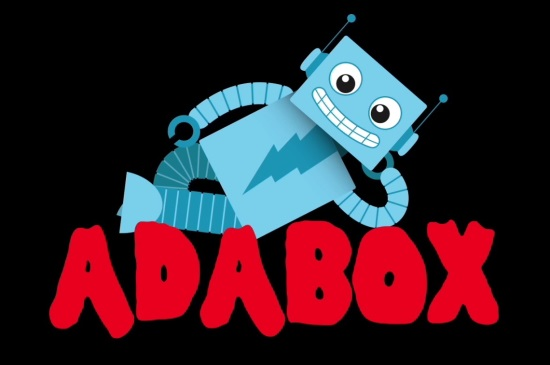
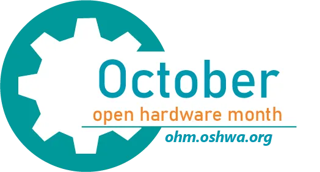
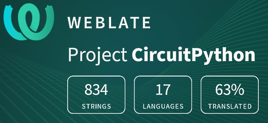

- [X] Kattni updates
- [ ] change date
- [ ] update title
- [ ] Feature story
- [ ] Update  for images
- [ ] Update ICYDNCI
- [ ] All images 550w max only
- [ ] Link "View this email in your browser."

News Sources

- [python.org](https://www.python.org/)
- [Python Insider - dev team blog](https://pythoninsider.blogspot.com/)

View this email in your browser.

Hi everyone! It's the latest Python for Microcontrollers newsletter, brought you by the community! We're on [Discord](https://discord.gg/HYqvREz), [Twitter](https://twitter.com/search?q=circuitpython&src=typed_query&f=live), and for past newsletters - [view them all here](https://www.adafruitdaily.com/category/circuitpython/). If you're reading this on the web, [subscribe here](https://www.adafruitdaily.com/). Let's get started!

## CircuitPython 6.0.0 Release Candidate 0 Available

The first release candidate of CircuitPython 6.0.0 was out late last week. No major issues are noted and the release is stable.

CircuitPython has a number of "ports" that are the core implementation for a variety of microcontroller families. Stability varies on a per-port basis. As of this release, atmel-samd, nrf, and stm for the F4 family are stable. cxd56, esp32s2, and stm for other chip families are being actively improved but may be missing functionality and have bugs. litex and mimxrt10xx are in an alpha state and will have bugs and missing functionality.

Read the full release notes - [GitHub](https://github.com/adafruit/circuitpython/releases). Download for your favorite board at [https://www.circuitPython.org/](https://www.circuitPython.org/).

## AdaBox 016 shipping, last call for subscriptions

JOIN NOW, SHIPPING SOON! https://www.adafruit.com/adabox Halloween edition!

The next ADABOX ships this month! There are a few openings for ADABOX 16 left! Curated Adafruit products, unique collectibles, and exclusive discounts. All delivered quarterly. Halloween plans have probably changed this year, Halloween is still going to happen! With an ADABOX – learn some new skills and make something fun.

Subscribe now or give AdaBox as a gift!

https://www.adafruit.com/adabox

## CircuitPython Deep Dive Stream with Scott Shawcroft

[This week](https://youtu.be/XW-C6DsOJc8), Scott streams his work on Release Candidate 0 and sleepio.

You can see the latest video and past videos on the Adafruit YouTube channel under the Deep Dive playlist - [YouTube](https://www.youtube.com/playlist?list=PLjF7R1fz_OOXBHlu9msoXq2jQN4JpCk8A).

## Adafruit Update

Adafruit carries all the technology to make Halloween fantastic! See projects tagged #ElectronicHalloween all month for Halloween related projects using Adafruit gear  - [Twitter](https://twitter.com/hashtag/ElectronicHalloween?src=hashtag_click) and [Adafruit Blog](https://blog.adafruit.com/category/halloween/).

**Adafruit is stocked and shipping orders!**

Now is the best time to get orders in for your favorite products, including items for students. 
Science is fun and educational when using Adafruit parts and free, easy to follow tutorials in the [Adafruit Learning System](https://learn.adafruit.com/).

## Hacktoberfest - Participate with the CircuitPython Team

Hacktoberfest® is a celebration of Open Source Software, created by DigitalOcean. It's open to everyone around the globe. Whether you’re a developer, student learning to code, event host, or company of any size, you can help drive growth of open source and make positive contributions to an ever-growing community. All backgrounds and skill levels are encouraged to complete the challenge. You can win a t-shirt or plant a tree.

**CircuitPython is participating in Hacktobefest.** If you submit a pull request to the CircuitPython core, it will automatically be considered for Hacktoberfest. However, if you submit a PR to a CircuitPython library and you are participating in Hacktoberfest, you must notify one of the maintainers that you would like your PR to be considered. We would love to help you reach your Hacktoberfest goal, but we need your assistance. Please make a note and tag a maintainer on your pull request though GitHub, or join us on [Discord](https://adafru.it/discord) and let us know in the #circuitpython channel. 

Pull requests can be made in any participating GitHub-hosted repositories/projects. You can sign up anytime between October 1 and October 31. 

More - [Hacktoberfest](https://hacktoberfest.digitalocean.com/).

## Open Source Hardware 2000 Survey Results Published

In 2020, OSHWA conducted the third OSHW Community Survey, which collected 441 responses. A few highlights from this year’s survey compared to the 2013 survey:

- The portion of people coming to open source hardware from open source software increased from 14.6% to 23.9%
- In 2013, 42.8% of respondents indicated they have worked on or contributed to an open hardware project. This jumped to 85.6% in 2020.
- While 2013 showed a plurality of people using blogs to publish design files, this year’s survey shows public repositories as the most popular option. The increase in people with open source software experience and improvement in repository collaboration offerings may be contributing factors.
- This year’s survey shows a large increase in attendees for the 2020 Open Hardware Summit. This is likely due to 2020 being the first virtual summit. Although it was moved online due to unfortunate circumstances, the virtual platform offered the upside of greatly expanding the audience.
- A small gain in the community’s gender diversity was seen, with those identifying as either female or other making up 18% of respondents, compared to 7% in 2013.

See the results - [OSHWA](https://www.oshwa.org/2020/10/16/oshw-community-survey-2020/).

And October is Open Hardware Month - [Learn More](https://ohm.oshwa.org/).

## News from around the web!

Among Us the Game - left side panels randomly light up one of 4 colors. Right panels light up in random order. Wire all for blocks together to complete the circuit - [Twitter](https://twitter.com/reidwender/status/1316921228398108673).

CircuitPython Weekly Meeting for October 13, 2020 ([notes](https://github.com/adafruit/adafruit-circuitpython-weekly-meeting/blob/master/2020/2020-10-13.md)) and on [YouTube](https://www.youtube.com/watch?v=GN8sr7_nris).

#ICYDNCI What was the most popular, most clicked link, in [last week's newsletter](https://www.adafruitdaily.com/2020/10/13/python-on-microcontrollers-newsletter-vsc-for-raspi-chromebook-projects-and-more-python-adafruit-circuitpython-electronichalloween-micropython-thepsf/)? [QT Py Tricks](https://github.com/todbot/qtpy-tricks/).

## Coming soon

Oak Dev Tech's CP Sapling is a SAM D21 for CircuitPython development - [Oak Dev Tech](https://www.oakdev.tech/store/p7/CP-Sapling-m0-development-board.html#/) and [Twitter](https://twitter.com/MicrochipMakes/status/1316841599498887168).

## New Boards Supported by CircuitPython

The number of supported microcontrollers and Single Board Computers (SBC) grows every week. This section outlines which boards have been included in CircuitPython or added to [CircuitPython.org](https://circuitpython.org/).

This week we had X new boards added!

- [Board name](url)

Looking for adding a new board to CircuitPython? It's highly encouraged! Adafruit has four guides to help you do so:

- [How to Add a New Board to CircuitPython](https://learn.adafruit.com/how-to-add-a-new-board-to-circuitpython/overview)
- [How to add a New Board to the circuitpython.org website](https://learn.adafruit.com/how-to-add-a-new-board-to-the-circuitpython-org-website)
- [Adding a Single Board Computer to PlatformDetect for Blinka](https://learn.adafruit.com/adding-a-single-board-computer-to-platformdetect-for-blinka)
- [Adding a Single Board Computer to Blinka](https://learn.adafruit.com/adding-a-single-board-computer-to-blinka)

## New Learn Guides!

[Tombstone Matrix Portal](https://learn.adafruit.com/tombstone-matrix-portal) from [Noe and Pedro](https://learn.adafruit.com/users/pixil3d)

[Multi-tasking with CircuitPython](https://learn.adafruit.com/multi-tasking-with-circuitpython) from [Tim C](https://learn.adafruit.com/users/Foamyguy)

[Adafruit 9-DOF Orientation IMU Fusion Breakout - BNO085tle](https://learn.adafruit.com/adafruit-9-dof-orientation-imu-fusion-breakout-bno085) from [Bryan Siepert](https://learn.adafruit.com/users/siddacious)

[Face Mask Efficacy Testing with SCIENCE!](https://learn.adafruit.com/raspberry-pi-camera-vision-face-mask-efficacy-testing) from [Carter Nelson](https://learn.adafruit.com/users/caternuson)

## CircuitPython Libraries!

CircuitPython support for hardware continues to grow. We are adding support for new sensors and breakouts all the time, as well as improving on the drivers we already have. As we add more libraries and update current ones, you can keep up with all the changes right here!

For the latest libraries, download the [Adafruit CircuitPython Library Bundle](https://circuitpython.org/libraries). For the latest community contributed libraries, download the [CircuitPython Community Bundle](https://github.com/adafruit/CircuitPython_Community_Bundle/releases).

If you'd like to contribute, CircuitPython libraries are a great place to start. Have an idea for a new driver? File an issue on [CircuitPython](https://github.com/adafruit/circuitpython/issues)! Have you written a library you'd like to make available? Submit it to the [CircuitPython Community Bundle](https://github.com/adafruit/CircuitPython_Community_Bundle). Interested in helping with current libraries? Check out the [CircuitPython.org Contributing page](https://circuitpython.org/contributing). We've included open pull requests and issues from the libraries, and details about repo-level issues that need to be addressed. We have a guide on [contributing to CircuitPython with Git and Github](https://learn.adafruit.com/contribute-to-circuitpython-with-git-and-github) if you need help getting started. You can also find us in the #circuitpython channel on the [Adafruit Discord](https://adafru.it/discord).

You can check out this [list of all the Adafruit CircuitPython libraries and drivers available](https://github.com/adafruit/Adafruit_CircuitPython_Bundle/blob/master/circuitpython_library_list.md). 

The current number of CircuitPython libraries is **276**!

**Updated Libraries!**

Here's this week's updated CircuitPython libraries:

 * [Adafruit_CircuitPython_Pypixelbuf](https://github.com/adafruit/Adafruit_CircuitPython_Pypixelbuf)
 * [Adafruit_CircuitPython_MatrixPortal](https://github.com/adafruit/Adafruit_CircuitPython_MatrixPortal)
 * [Adafruit_CircuitPython_Wiznet5k](https://github.com/adafruit/Adafruit_CircuitPython_Wiznet5k)
 * [Adafruit_CircuitPython_PyPortal](https://github.com/adafruit/Adafruit_CircuitPython_PyPortal)
 * [Adafruit_CircuitPython_AdafruitIO](https://github.com/adafruit/Adafruit_CircuitPython_AdafruitIO)
 * [Adafruit_Blinka](https://github.com/adafruit/Adafruit_Blinka)

## What’s the team up to this week?

What is the team up to this week? Let’s check in!

**Bryan**

Over the past, week I finished the libraries for the TLA2021 and have moved onto the EMC2101, a neat little fan controller from SMSC. This lil' guy will watch an external temperature diode and compare it against various thresholds and adjust the fan settings as dictated by its configuration.

The EMC2021 can interface with common 4-pin computer fans and will read the tachometer signal to report the fan speed and adjust the speed via the fan's PWM input. There are a bunch of interesting features that you'll probably only see on a fan controller, such as a programmable "spin up" setting that will give the fan some extra juice on startup to get it up to speed before settling down to the set temperature.

One of the more large features, at least in terms of register space, is the look up table (LUT) that is used to specify the fan speed at different temperature thresholds. This allows you to modulate the fan speed based on a range of temperatures. This will allow you to make sure your only blowing as much air as needed which helps reduce noise and excess energy usage. Lastly, there are, of course, various alerts that can be set to trigger on temperature changes, as well as parameters to tune the sensor to the specific characteristics of the temperature diode. 

**Dan**

I was off work for a few weeks, and am now back. I finished the [Blinka \_bleio library](https://github.com/adafruit/Adafruit_Blinka_bleio) for Windows, Linux (including Raspberry Pi), and MacOS. I am working on a Learn Guide with setup steps and examples for all the platforms.

The library mysteriously did not work properly on Raspberry Pi 3B+ and Pi 4B, but did work on Pi Zero 0W and Pi 3B+. It turns out this is due to a [firmware issue](https://github.com/RPi-Distro/bluez-firmware/issues/6) in the bluez-firmware package. Right now the workaround is to roll that package back to an earlier version, but I hope this will be fixed in the short term. Interestingly, very few people reported this problem, which indicates to me that very few people are using BLE on RPi at all.

**Kattni**

This week I published the [Adafruit QT Py and NeoPixel LEDs](https://learn.adafruit.com/qt-py-and-neopixel-leds) guide. The guide walks though wiring up NeoPixels to your QT Py and shows how to do basic animations on the base QT Py, and how to use the LED Animation library on the QT Py Haxpress. If you're looking to light it up with your QT Py, check out this guide.

Since I was testing the LED Animation library with a SAMD21 M0 Express board, I added an FAQ to the LED Animation guide to explain which animations will work on these boards, as not all of them do. As well I explained the limitations of using multiple animations in sequence, and covered why the animations slow down over time if left running for many hours. If you want to use the LED Animation library with your SAMD21 MO Express board, check out [this FAQ](https://learn.adafruit.com/circuitpython-led-animations/faqs) to avoid any surprises.

**Lucian**

**Melissa**

This past week I updated a guide I had done on running [TensorFlow Lite on the Raspberry Pi 4](https://learn.adafruit.com/running-tensorflow-lite-on-the-raspberry-pi-4). The updates include adding setup instructions for the BrainCraft HAT as well as updating the instructions to use the latest version of TensorFlow.

I also updated the [main PiTFT learn guide page](https://learn.adafruit.com/adafruit-2-2-pitft-hat-320-240-primary-display-for-raspberry-pi/easy-install), which is included in several guides to use the PiTFT Python install script that I had rewritten several weeks back. The guide has commands to automate selecting displays and orientations that work best as well as instructions for creating your own automated commands to install the display exactly the way you want..

**Scott**

In the last week I knocked out three issue blocking the next stable release:
* Unreliable auto-reload on SAMD21.
* Flickering _pew module on SAMD21.
* I2C timeouts on STM32 due to incorrect time keeping.

With these issues fixed, we're very close to our first release candidate. A release candidate is a very we think is stable but want to test more before releasing it as such. A release candidate is marked as stable after it's been used for a week or so without major issues by folks willing to try it out. So, if you are adventurous, please give us a hand in testing the latest release candidate.

Next on my list is finishing the light and deep sleep API. It will enable the lowest power modes on the ESP32-S2 and make it easier to add for other platforms.

## Upcoming events!

The Hackaday Remoticon will take place everywhere November 6th – 8th, 2020. It’s a weekend packed with workshops about hardware creation, held virtually for all to enjoy - [Hackaday](https://hackaday.com/2020/08/04/hackaday-remoticon-our-2020-conference-is-packed-with-workshops-and-were-calling-for-proposals/).

PyCon Sweden 2020 will be held 12-13 of November 2020 online - [PyCon Sweden](http://www.pycon.se/).

**Send Your Events In**

As for other events, with the COVID pandemic, most in-person events are postponed or cancelled. If you know of virtual events or events that may occur in the future, please let us know on Discord or on Twitter with hashtag #CircuitPython.

## Latest releases

CircuitPython's stable release is [#.#.#](https://github.com/adafruit/circuitpython/releases/latest) and its unstable release is [#.#.#-##.#](https://github.com/adafruit/circuitpython/releases). New to CircuitPython? Start with our [Welcome to CircuitPython Guide](https://learn.adafruit.com/welcome-to-circuitpython).

[2020####](https://github.com/adafruit/Adafruit_CircuitPython_Bundle/releases/latest) is the latest CircuitPython library bundle.

[v#.#.#](https://micropython.org/download) is the latest MicroPython release. Documentation for it is [here](http://docs.micropython.org/en/latest/pyboard/).

[#.#.#](https://www.python.org/downloads/) is the latest Python release. The latest pre-release version is [#.#.#](https://www.python.org/download/pre-releases/).

[1869 Stars](https://github.com/adafruit/circuitpython/stargazers) Like CircuitPython? [Star it on GitHub!](https://github.com/adafruit/circuitpython)

## Call for help -- Translating CircuitPython is now easier than ever!

One important feature of CircuitPython is translated control and error messages.

With the help of fellow open source project [Weblate](https://weblate.org/), we're making it even easier to add or improve translations.

Sign in with an existing account such as Github, Google or Facebook and start contributing through a simple web interface. No forks or pull requests needed!

As always, if you run into trouble join us on [Discord](https://adafru.it/discord), we're here to help.

## jobs.adafruit.com - Find a dream job, find great candidates!

[jobs.adafruit.com](https://jobs.adafruit.com/) has returned and folks are posting their skills (including CircuitPython) and companies are looking for talented makers to join their companies - from Digi-Key, to Hackaday, Microcenter, Raspberry Pi and more.

**Job of the Week**

Technical Partner for a Startup - Architectural Modeling

I am seeking to form a partnership to develop/ collaborate on a prototype, this development would include marketing and finding partners to manufacture i.e. I am in search of start-up partners.

I am an architect (of buildings) and have prototyped a physical model with sensors embedded as interface for digital 3D modeling. 
I am looking for a sensor technician/ engineer to help me work out the bugs/ develop the product further - [Adafruit Jobs Board](https://jobs.adafruit.com/job/tech-partner-for-startup-architectural-sensor-models/).

## NUMBER thanks!

The Adafruit Discord community, where we do all our CircuitPython development in the open, reached over NUMBER humans, thank you!  Adafruit believes Discord offers a unique way for CircuitPython folks to connect. Join today at [https://adafru.it/discord](https://adafru.it/discord).

## ICYMI - In case you missed it

The wonderful world of Python on hardware! This is our first video-newsletter-podcast that we’ve started! The news comes from the Python community, Discord, Adafruit communities and more. Kattni turns the weekly news into video form for ASK an ENGINEER and Adafruit social media. The complete Python on Hardware weekly videocast [playlist is here](https://www.youtube.com/playlist?list=PLjF7R1fz_OOXRMjM7Sm0J2Xt6H81TdDev). 

This video podcast is on [iTunes](https://itunes.apple.com/us/podcast/python-on-hardware/id1451685192?mt=2), [YouTube](http://adafru.it/pohepisodes), [IGTV (Instagram TV](https://www.instagram.com/adafruit/channel/)), and [XML](https://itunes.apple.com/us/podcast/python-on-hardware/id1451685192?mt=2).

[Weekly community chat on Adafruit Discord server CircuitPython channel - Audio / Podcast edition](https://itunes.apple.com/us/podcast/circuitpython-weekly-meeting/id1451685016) - Audio from the Discord chat space for CircuitPython, meetings are usually Mondays at 2pm ET, this is the audio version on [iTunes](https://itunes.apple.com/us/podcast/circuitpython-weekly-meeting/id1451685016), Pocket Casts, [Spotify](https://adafru.it/spotify), and [XML feed](https://adafruit-podcasts.s3.amazonaws.com/circuitpython_weekly_meeting/audio-podcast.xml).

And lastly, we are working up a one-spot destination for all things podcast-able here - [podcasts.adafruit.com](https://podcasts.adafruit.com/)

## Contribute!

The CircuitPython Weekly Newsletter is a CircuitPython community-run newsletter emailed every Tuesday. The complete [archives are here](https://www.adafruitdaily.com/category/circuitpython/). It highlights the latest CircuitPython related news from around the web including Python and MicroPython developments. To contribute, edit next week's draft [on GitHub](https://github.com/adafruit/circuitpython-weekly-newsletter/tree/gh-pages/_drafts) and [submit a pull request](https://help.github.com/articles/editing-files-in-your-repository/) with the changes. You may also tag your information on Twitter with #CircuitPython. 

Join our [Discord](https://adafru.it/discord) or [post to the forum](https://forums.adafruit.com/viewforum.php?f=60) for any further questions.
