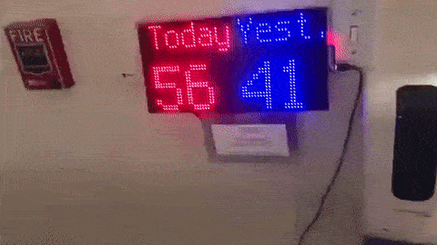
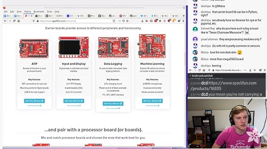
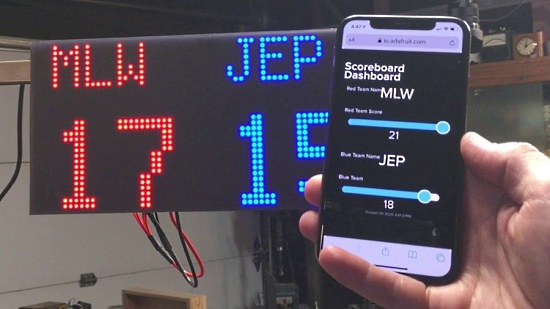
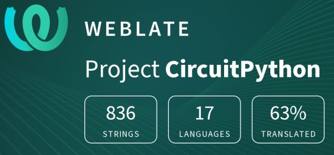

- [ ] Kattni updates
- [ ] change date
- [ ] update title
- [ ] Feature story
- [ ] Update  for images
- [ ] Update ICYDNCI
- [ ] All images 550w max only
- [ ] Link "View this email in your browser."

News Sources

- [python.org](https://www.python.org/)
- [Python Insider - dev team blog](https://pythoninsider.blogspot.com/)

Template last updated on 10-19-2020 by Anne - ICYMI paragraph wording

View this email in your browser.

Hi everyone! It's the latest Python for Microcontrollers newsletter, brought you by the community! We're on [Discord](https://discord.gg/HYqvREz), [Twitter](https://twitter.com/search?q=circuitpython&src=typed_query&f=live), and for past newsletters - [view them all here](https://www.adafruitdaily.com/category/circuitpython/). If you're reading this on the web, [subscribe here](https://www.adafruitdaily.com/). Let's get started!

## Headline Article

Text

## A Hand Sanitizer use counter

Teacher Sean Tibor set up an [Adafruit Matrix Portal](https://www.adafruit.com/product/4745) driving an [LED Matrix](https://www.adafruit.com/product/2276) to display the times a hand sanitizer unit is used during the current and prior days - [Twitter](https://twitter.com/smtibor/status/1319399789423923201).

## CircuitPython Deep Dive Stream with Scott Shawcroft

[This week](link), Scott streams his work on .

You can see the latest video and past videos on the Adafruit YouTube channel under the Deep Dive playlist - [YouTube](https://www.youtube.com/playlist?list=PLjF7R1fz_OOXBHlu9msoXq2jQN4JpCk8A).

## Adafruit Update

**Adafruit is shipping orders!**

Adafruit is stocked and shipping orders!

Now is the best time to get orders in for your favorite products, including items for students.

Science is fun and educational when using Adafruit parts and free, easy to follow tutorials in the [Adafruit Learning System](https://learn.adafruit.com/).

[Shop Adafruit now](https://www.adafruit.com/)

## News from around the web!

Text

Liz at Blitz City DIY interviews Thea Flowers of Winterbloom - lots on CircuitPython - [YouTube](https://www.youtube.com/watch?v=dhzkmPeRLcg&feature=youtu.be) and [Twitter](https://twitter.com/BlitzCityDIY/status/1317148303780417536).

text

Python For Feature Film:

> Python is a programming language that has become integral to the movie making process over the last few years. There’s rarely an animated feature or visual effects film, if any, that hasn’t had Python play a large part in getting it to the screen - [GFX](https://www.gfx.dev/python-for-feature-film) and [Twitter](https://twitter.com/fullstackpython/status/1318965791040163841).

## Coming soon

**#ICYDNCI What was the most popular, most clicked link, in [last week's newsletter](https://link)? [title](url).**

## Made with Mu

Why Mu? Mu tries to make it as easy as possible to get started with programming but aims to help you graduate to "real" development tools soon after. Everything in Mu is the "real thing" but presented in as simple and obvious way possible. It's like the toddling stage in learning to walk: you're finding your feet and once you're confident, you should move on and explore! Put simply, Mu aims to foster autonomy. Try out Mu today! - [codewith.mu](https://codewith.mu/)

## New Boards Supported by CircuitPython

The number of supported microcontrollers and Single Board Computers (SBC) grows every week. This section outlines which boards have been included in CircuitPython or added to [CircuitPython.org](https://circuitpython.org/).

This week we had X new boards added!

- [Board name](url)

Looking for adding a new board to CircuitPython? It's highly encouraged! Adafruit has four guides to help you do so:

- [How to Add a New Board to CircuitPython](https://learn.adafruit.com/how-to-add-a-new-board-to-circuitpython/overview)
- [How to add a New Board to the circuitpython.org website](https://learn.adafruit.com/how-to-add-a-new-board-to-the-circuitpython-org-website)
- [Adding a Single Board Computer to PlatformDetect for Blinka](https://learn.adafruit.com/adding-a-single-board-computer-to-platformdetect-for-blinka)
- [Adding a Single Board Computer to Blinka](https://learn.adafruit.com/adding-a-single-board-computer-to-blinka)

## New Learn Guides!

[Matrix Portal Scoreboard](https://learn.adafruit.com/matrix-portal-scoreboard) from [John Park](https://learn.adafruit.com/users/johnpark)

[DIY Desktop Calculator with CircuitPython](https://learn.adafruit.com/diy-rpn-desktop-calculator-with-circuitpython) from [Jeff Epler](https://learn.adafruit.com/users/jepler)

[Matrix Portal RGB Display Handbag](https://learn.adafruit.com/matrix-portal-rgb-display-handbag) from [Erin St. Blaine](https://learn.adafruit.com/users/firepixie)

[Creating MatrixPortal Projects with CircuitPython](https://learn.adafruit.com/creating-projects-with-the-circuitpython-matrixportal-library) from [Melissa LeBlanc-Williams](https://learn.adafruit.com/users/MakerMelissa)

[Image Correction for RGB LED Matrices](https://learn.adafruit.com/image-correction-for-rgb-led-matrices) from [Phil Burgess](https://learn.adafruit.com/users/pburgess)

## CircuitPython Libraries!

CircuitPython support for hardware continues to grow. We are adding support for new sensors and breakouts all the time, as well as improving on the drivers we already have. As we add more libraries and update current ones, you can keep up with all the changes right here!

For the latest libraries, download the [Adafruit CircuitPython Library Bundle](https://circuitpython.org/libraries). For the latest community contributed libraries, download the [CircuitPython Community Bundle](https://github.com/adafruit/CircuitPython_Community_Bundle/releases).

If you'd like to contribute, CircuitPython libraries are a great place to start. Have an idea for a new driver? File an issue on [CircuitPython](https://github.com/adafruit/circuitpython/issues)! Have you written a library you'd like to make available? Submit it to the [CircuitPython Community Bundle](https://github.com/adafruit/CircuitPython_Community_Bundle). Interested in helping with current libraries? Check out the [CircuitPython.org Contributing page](https://circuitpython.org/contributing). We've included open pull requests and issues from the libraries, and details about repo-level issues that need to be addressed. We have a guide on [contributing to CircuitPython with Git and Github](https://learn.adafruit.com/contribute-to-circuitpython-with-git-and-github) if you need help getting started. You can also find us in the #circuitpython channel on the [Adafruit Discord](https://adafru.it/discord).

You can check out this [list of all the Adafruit CircuitPython libraries and drivers available](https://github.com/adafruit/Adafruit_CircuitPython_Bundle/blob/master/circuitpython_library_list.md). 

The current number of CircuitPython libraries is **276**!

**New Libraries!**

Here's this week's new CircuitPython libraries:

 * [Adafruit_CircuitPython_MCP2515](https://github.com/adafruit/Adafruit_CircuitPython_MCP2515)
 * [Adafruit_CircuitPython_MonsterM4sk](https://github.com/adafruit/Adafruit_CircuitPython_MonsterM4sk)

**Updated Libraries!**

Here's this week's updated CircuitPython libraries:

 * [Adafruit_CircuitPython_LED_Animation](https://github.com/adafruit/Adafruit_CircuitPython_LED_Animation)
 * [Adafruit_CircuitPython_BLE_Magic_Light](https://github.com/adafruit/Adafruit_CircuitPython_BLE_Magic_Light)
 * [Adafruit_CircuitPython_BLE_BerryMed_Pulse_Oximeter](https://github.com/adafruit/Adafruit_CircuitPython_BLE_BerryMed_Pulse_Oximeter)
 * [Adafruit_CircuitPython_RockBlock](https://github.com/adafruit/Adafruit_CircuitPython_RockBlock)
 * [Adafruit_CircuitPython_MLX90393](https://github.com/adafruit/Adafruit_CircuitPython_MLX90393)
 * [Adafruit_CircuitPython_PCF8591](https://github.com/adafruit/Adafruit_CircuitPython_PCF8591)
 * [Adafruit_CircuitPython_SHTC3](https://github.com/adafruit/Adafruit_CircuitPython_SHTC3)
 * [Adafruit_CircuitPython_MAX31856](https://github.com/adafruit/Adafruit_CircuitPython_MAX31856)
 * [Adafruit_CircuitPython_BME680](https://github.com/adafruit/Adafruit_CircuitPython_BME680)
 * [Adafruit_CircuitPython_Display_Text](https://github.com/adafruit/Adafruit_CircuitPython_Display_Text)
 * [Adafruit_CircuitPython_MCP230xx](https://github.com/adafruit/Adafruit_CircuitPython_MCP230xx)

**PyPI Download Stats!**

We've written a special library called Adafruit Blinka that makes it possible to use CircuitPython Libraries on [Raspberry Pi and other compatible single-board computers](https://learn.adafruit.com/circuitpython-on-raspberrypi-linux/). Adafruit Blinka and all the CircuitPython libraries have been deployed to PyPI for super simple installation on Linux! Here are the top 10 CircuitPython libraries downloaded from PyPI in the last week, including the total downloads for those libraries:

Keep checking back for updated download stats coming soon!

## What’s the team up to this week?

What is the team up to this week? Let’s check in!

**Bryan**

This past week I completed the EMC2101 fan controller libraries for CircuitPython and Arduino, which means I will shortly start working on the guide.I continue to be impressed with this and other similar small, focused chips that do one or two related things and nothing else. While some may see such a chip and compare it unfavorably to another that has more bells and whistles, there is value in the flexibility that comes from having a discrete bit of functionality in its own modular piece. Sometimes you do want the flexibility of a Swiss Army Knife that can do many things, however many other times you just need a knife to cut something.

Earlier in the week I was able to assemble the latest version of the CAN Feather Wing and verify that the changes worked as expected. With any luck, this means that we should see one showing up in the store before too long. One interesting side effect to working on this project is that I’ve started noticing CAN bus showing up in more and more places. At this point I’m fairly sure that I’m late to the party and CAN bus has been popular for a while, however I also get the feeling that it’s seeing more and more use. I’m fairly certain that it will become even more widely known and used as more people  become familiar with its benefits. As ladyada is fond of saying, people need to use more wires. Wireless is great and all, but just like planes can be more fussy than good ‘ole trains, wires will get your bits where they need to go, even if they lack the glamour of yer Narrow Band IOT or Z-Wave.

**Dan**

I am finishing up a Learn Guide for the  Blinka \_bleio library. While working on the examples I found a regression in the bleak library, which I reported and is now fixed. I have a few more examples to write and then I'll be all done.

**Jeff**

**Kattni**

I've been working on a guide for a QT Py project involving NeoPixels and an LIS3DH accelerometer. It's an activity timer that doubles as a hydration reminder. The activity timer designed to be a simple reminder to take a break every so often or eat lunch, and then get back to work. The hydration reminder counts down an interval to remind you to regularly drink water. The guide walks you through the build, and covers all the customisations available in the code. You can easily change the colors and times to fit your aesthetics and schedule. Keep an eye out for the guide soon!

**Lucian**

**Melissa**

This past week, I worked on a guide for running [Google Assistant on the BrainCraft HAT](https://learn.adafruit.com/using-google-assistant-on-the-braincraft-hat). Running the software on the Raspberry Pi was the easy part. The difficult part was getting all of the different Google interfaces configured correctly because halfway through, the wrong project is selected. I'm glad that I was able to work through this and document it in the guide because I think it would have been very frustrating for a user to have run into this. Voice Bonnet support will be added soon.

I also worked on another guide for [creating projects using the MatrixPortal library](https://learn.adafruit.com/creating-projects-with-the-circuitpython-matrixportal-library). This goes through some of the capabilities of the library and choosing the different layers that you want to use in your project including some of the tradeoffs for choosing one method over the other. It also goes into a fairly detailed code analysis of one of the example projects that uses quite a few of the features of the library.

**Scott**

Last week I released 6.0.0 Release Candidate 0. I've done a few minor fixes after it that will lead to a second release candidate.

Most of my week has been working on adding grayscale e-paper display support to CircuitPython for the newest e-paper display FeatherWing: https://www.adafruit.com/product/4777 It's a neat display!

I've got more work to do on the e-paper display because there are a few outstanding bugs. The current bug I'm looking at is that the display only refreshes once and then fails going forwards.

My goal was to work on the deep sleep API but I've gotten sidetracked by the new e-paper display. Both things will be done eventually though because of this top secret product :-) : https://www.youtube.com/watch?v=sDWn37FbtGM

## Upcoming events!

Hacktoberfest® is a celebration of Open Source Softare, created by DigitalOcean. It's open to everyone around the globe. Whether you’re a developer, student learning to code, event host, or company of any size, you can help drive growth of open source and make positive contributions to an ever-growing community. All backgrounds and skill levels are encouraged to complete the challenge. You can win a t-shirt or plant a tree.

Pull requests can be made in any GitHub-hosted repositories/projects. You can sign up anytime between October 1 and October 31. More - [Hacktoberfest](https://hacktoberfest.digitalocean.com/).

The Hackaday Remoticon will take place everywhere November 6th – 8th, 2020. It’s a weekend packed with workshops about hardware creation, held virtually for all to enjoy - [Hackaday](https://hackaday.com/2020/08/04/hackaday-remoticon-our-2020-conference-is-packed-with-workshops-and-were-calling-for-proposals/).

PyCon Sweden 2020 will be held 12-13 of November 2020 online - [PyCon Sweden](http://www.pycon.se/).

**Send Your Events In**

As for other events, with the COVID pandemic, most in-person events are postponed or cancelled. If you know of virtual events or events that may occur in the future, please let us know on Discord or on Twitter with hashtag #CircuitPython.

## Latest releases

CircuitPython's stable release is [#.#.#](https://github.com/adafruit/circuitpython/releases/latest) and its unstable release is [#.#.#-##.#](https://github.com/adafruit/circuitpython/releases). New to CircuitPython? Start with our [Welcome to CircuitPython Guide](https://learn.adafruit.com/welcome-to-circuitpython).

[2020####](https://github.com/adafruit/Adafruit_CircuitPython_Bundle/releases/latest) is the latest CircuitPython library bundle.

[v#.#.#](https://micropython.org/download) is the latest MicroPython release. Documentation for it is [here](http://docs.micropython.org/en/latest/pyboard/).

[#.#.#](https://www.python.org/downloads/) is the latest Python release. The latest pre-release version is [#.#.#](https://www.python.org/download/pre-releases/).

[1878 Stars](https://github.com/adafruit/circuitpython/stargazers) Like CircuitPython? [Star it on GitHub!](https://github.com/adafruit/circuitpython)

## Call for help -- Translating CircuitPython is now easier than ever!

One important feature of CircuitPython is translated control and error messages.

With the help of fellow open source project [Weblate](https://weblate.org/), we're making it even easier to add or improve translations.

Sign in with an existing account such as Github, Google or Facebook and start contributing through a simple web interface. No forks or pull requests needed!

As always, if you run into trouble join us on [Discord](https://adafru.it/discord), we're here to help.

## jobs.adafruit.com - Find a dream job, find great candidates!

[jobs.adafruit.com](https://jobs.adafruit.com/) has returned and folks are posting their skills (including CircuitPython) and companies are looking for talented makers to join their companies - from Digi-Key, to Hackaday, Microcenter, Raspberry Pi and more.

## NUMBER thanks!

The Adafruit Discord community, where we do all our CircuitPython development in the open, reached over NUMBER humans, thank you!  Adafruit believes Discord offers a unique way for CircuitPython folks to connect. Join today at [https://adafru.it/discord](https://adafru.it/discord).

## ICYMI - In case you missed it

The wonderful world of Python on hardware! This is our Python video-newsletter-podcast! The news comes from the Python community, Discord, Adafruit communities and more and is reviewed on ASK an ENGINEER Wednesdays. The complete Python on Hardware weekly videocast [playlist is here](https://www.youtube.com/playlist?list=PLjF7R1fz_OOXRMjM7Sm0J2Xt6H81TdDev). 

This video podcast is on [iTunes](https://itunes.apple.com/us/podcast/python-on-hardware/id1451685192?mt=2), [YouTube](http://adafru.it/pohepisodes), [IGTV (Instagram TV](https://www.instagram.com/adafruit/channel/)), and [XML](https://itunes.apple.com/us/podcast/python-on-hardware/id1451685192?mt=2).

[Weekly community chat on Adafruit Discord server CircuitPython channel - Audio / Podcast edition](https://itunes.apple.com/us/podcast/circuitpython-weekly-meeting/id1451685016) - Audio from the Discord chat space for CircuitPython, meetings are usually Mondays at 2pm ET, this is the audio version on [iTunes](https://itunes.apple.com/us/podcast/circuitpython-weekly-meeting/id1451685016), Pocket Casts, [Spotify](https://adafru.it/spotify), and [XML feed](https://adafruit-podcasts.s3.amazonaws.com/circuitpython_weekly_meeting/audio-podcast.xml).

And lastly, we are working up a one-spot destination for all things podcast-able here - [podcasts.adafruit.com](https://podcasts.adafruit.com/)

## Codecademy "Learn Hardware Programming with CircuitPython"

Codecademy, an online interactive learning platform used by more than 45 million people, has teamed up with the leading manufacturer in STEAM electronics, Adafruit Industries, to create a coding course, "Learn Hardware Programming with CircuitPython". The course is now available in the [Codecademy catalog](https://www.codecademy.com/learn/learn-circuitpython?utm_source=adafruit&utm_medium=partners&utm_campaign=circuitplayground&utm_content=pythononhardwarenewsletter).

Python is a highly versatile, easy to learn programming language that a wide range of people, from visual effects artists in Hollywood to mission control at NASA, use to quickly solve problems. But you don’t need to be a rocket scientist to accomplish amazing things with it. This new course introduces programmers to Python by way of a microcontroller — CircuitPython — which is a Python-based programming language optimized for use on hardware.

CircuitPython’s hardware-ready design makes it easier than ever to program a variety of single-board computers, and this course gets you from no experience to working prototype faster than ever before. Codecademy’s interactive learning environment, combined with Adafruit's highly rated Circuit Playground Express, present aspiring hardware hackers with a never-before-seen opportunity to learn hardware programming seamlessly online.

Whether for those who are new to programming, or for those who want to expand their skill set to include physical computing, this course will have students getting familiar with Python and creating incredible projects along the way. By the end, students will have built their own bike lights, drum machine, and even a moisture detector that can tell when it's time to water a plant.

Visit Codecademy to access the [Learn Hardware Programming with CircuitPython](https://www.codecademy.com/learn/learn-circuitpython?utm_source=adafruit&utm_medium=partners&utm_campaign=circuitplayground&utm_content=pythononhardwarenewsletter) course and Adafruit to purchase a [Circuit Playground Express](https://www.adafruit.com/product/3333).

Codecademy has helped more than 45 million people around the world upgrade their careers with technology skills. The company’s online interactive learning platform is widely recognized for providing an accessible, flexible, and engaging experience for beginners and experienced programmers alike. Codecademy has raised a total of $43 million from investors including Union Square Ventures, Kleiner Perkins, Index Ventures, Thrive Capital, Naspers, Yuri Milner and Richard Branson, most recently raising its $30 million Series C in July 2016.

## Contribute!

The CircuitPython Weekly Newsletter is a CircuitPython community-run newsletter emailed every Tuesday. The complete [archives are here](https://www.adafruitdaily.com/category/circuitpython/). It highlights the latest CircuitPython related news from around the web including Python and MicroPython developments. To contribute, edit next week's draft [on GitHub](https://github.com/adafruit/circuitpython-weekly-newsletter/tree/gh-pages/_drafts) and [submit a pull request](https://help.github.com/articles/editing-files-in-your-repository/) with the changes. You may also tag your information on Twitter with #CircuitPython. 

Join our [Discord](https://adafru.it/discord) or [post to the forum](https://forums.adafruit.com/viewforum.php?f=60) for any further questions.
