- [x] Kattni updates
- [ ] change date
- [ ] update title
- [ ] Feature story
- [ ] Update  for images
- [ ] Update ICYDNCI
- [ ] All images 550w max only
- [ ] Link "View this email in your browser."

News Sources

- [python.org](https://www.python.org/)
- [Python Insider - dev team blog](https://pythoninsider.blogspot.com/)

View this email in your browser.

Happy November! It's the latest Python for Microcontrollers newsletter, brought you by the community! We're on [Discord](https://discord.gg/HYqvREz), [Twitter](https://twitter.com/search?q=circuitpython&src=typed_query&f=live), and for past newsletters - [view them all here](https://www.adafruitdaily.com/category/circuitpython/). If you're reading this on the web, [subscribe here](https://www.adafruitdaily.com/). Let's dig in!

## ulab 1.0.0 released

Version 1.0.0 of the ulab numerical library is now available. ulab provides numerical capabilities similar to the numpy library but ulab iss usable on the limited resources on microcontrollers. This release implements a number of missing features, like higher-dimensional tensors, proper views of arrays, and broadcasting. In addition, a bunch of new functions have been added, as well as customisation options.

The author writes:

> With the help of adafruit-sponsored people (they are credited on the front page of the PDF version of the manual), I have also updated the manual, added a reference section, and a chapter on how ulab can be extended and how new function can be implemented.

More - [Library](https://github.com/v923z/micropython-ulab/) and [Documentation](https://micropython-ulab.readthedocs.io/en/latest/).

## Python in Visual Studio Code Update

[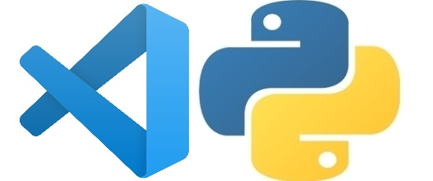](https://devblogs.microsoft.com/python/python-in-visual-studio-code-october-2020-release/)

October 2020 Release of the Python in Visual Studio Code extension is available. You can download the Python extension from the [Windows Marketplace](https://marketplace.visualstudio.com/items?itemName=ms-python.python), or install it directly from the extension gallery in Visual Studio Code. If you already have the Python extension installed, you can also get the latest update by restarting Visual Studio Code. 

This was a short release where we addressed 14 issues, and it includes debugpy 1.0! Debugpy 1.0 offers a great number of features that can help you understand bugs, errors and unexpected behaviors in your code.

More - Microsoft Python Blog](https://devblogs.microsoft.com/python/python-in-visual-studio-code-october-2020-release/).

## Grayscale e-paper support added to CircuitPython

CircuitPython now supports using e-paper / eInk displays. ABove, user Joey Castillo, author of the Open Book eReader, tests out the new capability - [Twitter](https://twitter.com/josecastillo/status/1321868836656865280).

And Adafruit has a new video out on the eInk refresh process - [YouTube](https://www.youtube.com/watch?v=FXIh4Ejwzaw&feature=youtu.be).

## Slappy.io - an easy to use web development environment for CircuitPython

[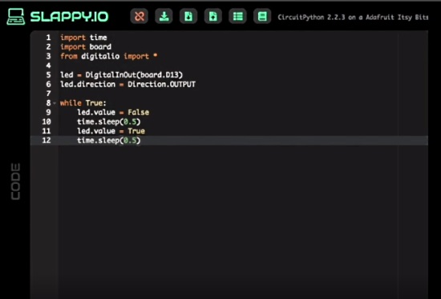](https://slappy.io/)

slappy.io is a new, easy and fast way to write and load CircuitPython to your favorite Adafruit device, on nearly any computer. They wish to be the best solution for programming using Chromebooks and for Maker education - [slappy.io](https://slappy.io/) and [Twitter](https://twitter.com/SlappyIO/status/1319347224866811904).

## A CircuitPython Sensor Ring

[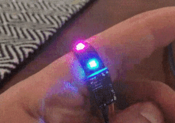](https://www.hackster.io/news/the-newest-oddly-specific-object-the-sensor-ring-shows-off-the-latest-work-from-joey-castillo-dcff779e6ab7)

Hackster.io features the Sensor Ring — the latest work from [Joey Castillo](https://twitter.com/josecastillo). Expanding on previous postings, the article discusses adding sensors and DotStar RGB LEDs, design decisions, and directions for future work - [Hackster.io](https://www.hackster.io/news/the-newest-oddly-specific-object-the-sensor-ring-shows-off-the-latest-work-from-joey-castillo-dcff779e6ab7).

## Two reviews of the CircuitPython compatible Adafruit QT Py board

Two new reviews of Adafruit's CircuitPython compatible QT Py board:

[Make:](https://makezine.com/product-review/boards/adafruit-qt-py/) - "The new QT Py is my current favorite of this class of devices. It’s also one of the smallest, most capable, and most expandable. The QT Py is a great board to start experimenting with CircuitPython..."

[Hackster.io](https://www.hackster.io/videos/769) - Adafruit's Teeny, Tiny QT Py Unboxing Video

## CircuitPython Deep Dive Stream with Scott Shawcroft

[This week](https://youtu.be/G5c7RXq5r3A), Scott streams his work on some ESP32-S2 polish.

You can see the latest video and past videos on the Adafruit YouTube channel under the Deep Dive playlist - [YouTube](https://www.youtube.com/playlist?list=PLjF7R1fz_OOXBHlu9msoXq2jQN4JpCk8A).

## Adafruit Update

**Adafruit is shipping orders!**

Adafruit is stocked and shipping orders!

Now is the best time to get orders in for your favorite products, including items for students.

Science is fun and educational when using Adafruit parts and free, easy to follow tutorials in the [Adafruit Learning System](https://learn.adafruit.com/).

[Shop Adafruit now](https://www.adafruit.com/)

## News from around the web!

[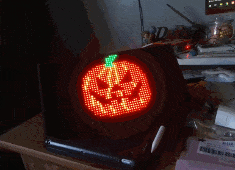](https://bobthechemist.com/2020/10/adabox-016/)

> "...when I gave CircuitPython a shot, it was amazing. Along with Mu, the simple Python text editor, I was up and running in no time. Mu recognized that I was using CircuitPython, and once I enabled serial communication to help me find the stupid syntax errors I often make, I was up and running. I hadn’t bought into the “not compiling saves time” argument of Python over C++ for microcontrollers, (especially given the lightweight programming I do) but it does turn out to be a nice feature to click save and watch my screen update."

more on this AdaBox016 build - [BobTheChemist](https://bobthechemist.com/2020/10/adabox-016/).

[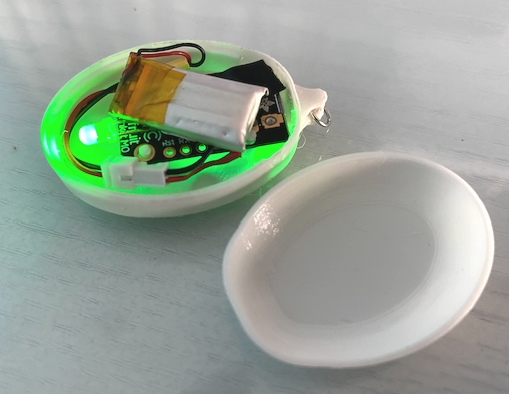](https://evanweinberg.com/2020/11/01/glowing-for-halloween-with-circuitpython-state-machines/)

Making a Heart of Te Fiti from Moana and Tony Stark Arc Reactor - [Evan Weinberg](https://evanweinberg.com/2020/11/01/glowing-for-halloween-with-circuitpython-state-machines/) and [Twitter](https://twitter.com/emwdx/status/1322832144108957696).

pygame 2.0 - the happy dance birthday release - was released October 28th on its 20 year anniversary - [Release Notes](https://github.com/pygame/pygame/releases) and information via [Hackaday](https://hackaday.com/2020/10/28/pygame-celebrates-20-years-by-releasing-pygame-2-0/) *(thanks Tim C.)*

[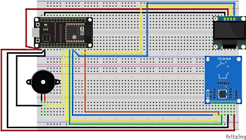](https://github.com/mytechnotalent/MicroPython_IoT_RFID_Reader)

A MicroPython IoT RFID Reader - [GitHub](https://github.com/mytechnotalent/MicroPython_IoT_RFID_Reader)

[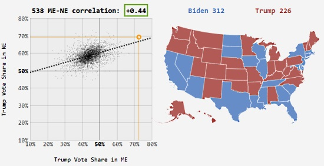](https://roadtolarissa.com/forecast-correlation/)

538 and the Economist have released detailed data from their US election forecasts, listing how each state votes in 40,000 simulations of the presidential election - [roadtolarissa](https://roadtolarissa.com/forecast-correlation/).

Python and machine learning (ML) at the NASA Jet Propulsion Laboratory (JPL) - [TalkPython Podcast](https://talkpython.fm/episodes/show/286/python-and-ml-at-nasa-jet-propulsion-laboratory-jpl).

[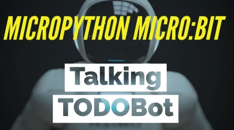](https://github.com/mytechnotalent/MicroPython-micro-bit_Talking_TODOBot)

Make a talking TODO bot with a BBC micro:bit and MicroPython - [GitHub](https://github.com/mytechnotalent/MicroPython-micro-bit_Talking_TODOBot).

Command Line Interfaces in Python (Overview video) - [Real Python](https://realpython.com/lessons/python-as-cli/)

Python Software Foundation Fellow Members for Q3 2020 announced - [PSF Blog](http://pyfound.blogspot.com/2020/10/python-software-foundation-fellow.html).

How to abort/cancel an HTTP request in Python thread with sockets? Call shutdown before close - [Stack Overflow](https://stackoverflow.com/questions/64434461/how-to-abort-cancel-http-request-in-python-thread).

#ICYDNCI What was the most popular, most clicked link, in [last week's newsletter](https://www.adafruitdaily.com/2020/10/27/python-on-microcontrollers-newsletter-m-2-boards-vscode-for-circuitpython-and-more-python-adafruit-circuitpython-electronichalloween-micropython-thepsf/)? [vscode-circuitpython plugin for VSCode](https://marketplace.visualstudio.com/items?itemName=joedevivo.vscode-circuitpython&ssr=false).

## Coming soon

## Made with Mu

Why Mu? Mu tries to make it as easy as possible to get started with programming but aims to help you graduate to "real" development tools soon after. Everything in Mu is the "real thing" but presented in as simple and obvious way possible. It's like the toddling stage in learning to walk: you're finding your feet and once you're confident, you should move on and explore! Put simply, Mu aims to foster autonomy. Try out Mu today! - [codewith.mu](https://codewith.mu/)

## New Boards Supported by CircuitPython

The number of supported microcontrollers and Single Board Computers (SBC) grows every week. This section outlines which boards have been included in CircuitPython or added to [CircuitPython.org](https://circuitpython.org/).

This week we had X new boards added!

- [Board name](url)

Looking for adding a new board to CircuitPython? It's highly encouraged! Adafruit has four guides to help you do so:

- [How to Add a New Board to CircuitPython](https://learn.adafruit.com/how-to-add-a-new-board-to-circuitpython/overview)
- [How to add a New Board to the circuitpython.org website](https://learn.adafruit.com/how-to-add-a-new-board-to-the-circuitpython-org-website)
- [Adding a Single Board Computer to PlatformDetect for Blinka](https://learn.adafruit.com/adding-a-single-board-computer-to-platformdetect-for-blinka)
- [Adding a Single Board Computer to Blinka](https://learn.adafruit.com/adding-a-single-board-computer-to-blinka)

## New Learn Guides!

[CircuitPython BLE Libraries on Any Computer](https://learn.adafruit.com/circuitpython-ble-libraries-on-any-computer) from [Dan Halbert](https://learn.adafruit.com/users/danhalbert)

[Remote Control Candy Dispenser Ghost](https://learn.adafruit.com/ble-claw) from [Noe and Pedro](https://learn.adafruit.com/users/pixil3d)

[3D Printed Frankenstein Monster with NeoPixel Eyes](https://learn.adafruit.com/neopixel-frankenstein) from [Liz Clark](https://learn.adafruit.com/users/BlitzCityDIY)

[Matrix Portal New Guide Scroller](https://learn.adafruit.com/matrix-portal-new-guide-scroller) from [Brent Rubell](https://learn.adafruit.com/users/brubell)

[Adafruit Voice Bonnet](https://learn.adafruit.com/adafruit-voice-bonnet) from [Kattni](https://learn.adafruit.com/users/kattni)

[Adafruit QT Py Activity Timer and Hydration Reminder](https://learn.adafruit.com/qt-py-activity-timer-and-hydration-reminder) from [Kattni](https://learn.adafruit.com/users/kattni)

[AdaBox 016](https://learn.adafruit.com/adabox016) from [John Park](https://learn.adafruit.com/users/johnpark)

[Using Google Assistant on the BrainCraft HAT](https://learn.adafruit.com/using-google-assistant-on-the-braincraft-hat) from [Melissa LeBlanc-Williams](https://learn.adafruit.com/users/MakerMelissa)

[Make a Pi Trash Classifier with Machine Learning and Lobe](https://learn.adafruit.com/lobe-trash-classifier-machine-learning) from [Jen Fox](https://learn.adafruit.com/users/jenfoxbot)

## CircuitPython Libraries!

CircuitPython support for hardware continues to grow. We are adding support for new sensors and breakouts all the time, as well as improving on the drivers we already have. As we add more libraries and update current ones, you can keep up with all the changes right here!

For the latest libraries, download the [Adafruit CircuitPython Library Bundle](https://circuitpython.org/libraries). For the latest community contributed libraries, download the [CircuitPython Community Bundle](https://github.com/adafruit/CircuitPython_Community_Bundle/releases).

If you'd like to contribute, CircuitPython libraries are a great place to start. Have an idea for a new driver? File an issue on [CircuitPython](https://github.com/adafruit/circuitpython/issues)! Have you written a library you'd like to make available? Submit it to the [CircuitPython Community Bundle](https://github.com/adafruit/CircuitPython_Community_Bundle). Interested in helping with current libraries? Check out the [CircuitPython.org Contributing page](https://circuitpython.org/contributing). We've included open pull requests and issues from the libraries, and details about repo-level issues that need to be addressed. We have a guide on [contributing to CircuitPython with Git and Github](https://learn.adafruit.com/contribute-to-circuitpython-with-git-and-github) if you need help getting started. You can also find us in the #circuitpython channel on the [Adafruit Discord](https://adafru.it/discord).

You can check out this [list of all the Adafruit CircuitPython libraries and drivers available](https://github.com/adafruit/Adafruit_CircuitPython_Bundle/blob/master/circuitpython_library_list.md). 

The current number of CircuitPython libraries is **279**!

**New Libraries!**

Here's this week's new CircuitPython libraries:

 * [Adafruit_CircuitPython_LC709203F](https://github.com/adafruit/Adafruit_CircuitPython_LC709203F)
 * [Adafruit_CircuitPython_EMC2101](https://github.com/adafruit/Adafruit_CircuitPython_EMC2101)

**Updated Libraries!**

Here's this week's updated CircuitPython libraries:

 * [Adafruit_CircuitPython_BNO08x](https://github.com/adafruit/Adafruit_CircuitPython_BNO08x)
 * [Adafruit_CircuitPython_Waveform](https://github.com/adafruit/Adafruit_CircuitPython_Waveform)
 * [Adafruit_CircuitPython_BLE_Heart_Rate](https://github.com/adafruit/Adafruit_CircuitPython_BLE_Heart_Rate)
 * [Adafruit_CircuitPython_PyPortal](https://github.com/adafruit/Adafruit_CircuitPython_PyPortal)
 * [Adafruit_CircuitPython_MIDI](https://github.com/adafruit/Adafruit_CircuitPython_MIDI)
 * [Adafruit_CircuitPython_Fingerprint](https://github.com/adafruit/Adafruit_CircuitPython_Fingerprint)
 * [Adafruit_CircuitPython_ImageLoad](https://github.com/adafruit/Adafruit_CircuitPython_ImageLoad)
 * [Adafruit_CircuitPython_VCNL4010](https://github.com/adafruit/Adafruit_CircuitPython_VCNL4010)
 * [Adafruit_CircuitPython_MatrixPortal](https://github.com/adafruit/Adafruit_CircuitPython_MatrixPortal)
 * [CircuitPython_Community_Bundle](https://github.com/adafruit/CircuitPython_Community_Bundle)

## What’s the team up to this week?

What is the team up to this week? Let’s check in!

**Bryan**

I've been testing new prototypes and doing maintenance on existing libraries. I should have hardware to test another revision of the CAN FeatherWing by the time this gets to you; we're moving to a new controller that is in essence a 2515 with an integrated transceiver in a smaller package!

It's not uncommon to see multiple versions of an IC in different packages, sometimes integrated with associated components to make manufacturing a bit simpler. A great, and a bit unique, example of this is the case of some of Trinamic's excellent stepper drivers; The TMC2209 is a controller with a great feature set that includes useful stuff like current-based stall prevention that enables sensorless homing on 3D printers. This and more is packed into a diminutive QFN package. 

You may have recently [EYE on NPI](https://blog.adafruit.com/2020/06/18/eye-on-npi-tmc2226-sa-ultra-silent-stepper-motor-driver-eyeonnpi-digikey-adafruit-digikey-adafruit-trinamic_mc/) where ladyada looked at Trinamic's new TMC2226 that has a lot of the features of the TMC2209 in a TSSOP package. In fact, it has all the features of the TMC2209 because it's the same guts in a new package. The larger TSSOP package has the advantage of a larger thermal pad for heat dissipation, as well as being easier to inspect by eye thanks to having external pins.

**Dan**

More, more BLE (Bluetooth Low Energy)!

I finished up the [CircuitPython BLE Libraries on Any Computer](https://learn.adafruit.com/circuitpython-ble-libraries-on-any-computer) guide, which shows how to use the adafruit-blinka library to run CircuitPython BLE code and libraries on Windows, MacOS, and Linux (including Raspberry Pi).

And, I've added a longish shared [guide page](https://learn.adafruit.com/adafruit-airlift-breakout/circuitpython-ble) to all the AirLift board product pages describing how to use the ESP32 AirLift co-processor in BLE mode, instead of its usual WiFi mode. You can now use other BLE devices to talk to AirLift-equipped accessory or development boards, such as the AirLift FeatherWing, the Metro M4 AirLift Lite, or the new MatrixPortal board.

**Jeff**

[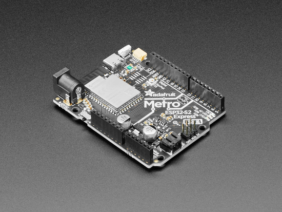](https://circuitpython.org/)

Following up on adding canio to the ESP32-S2, it's another project with the ESP32-S2!  I'm investigating support for AudioOut and I2SOut.  Both peripherals are available in the microcontroller, but I have to write the core code to make it all work.  I've switched from the Kaluga devkit to the new Adafruit Metro ESP32-S2 Express.  So far it's all a work in progress, but maybe horrible distorted noises will come out of a speaker soon!luc

**Kattni**

The [QT Py Activity Timer and Hydration Reminder](https://learn.adafruit.com/qt-py-activity-timer-and-hydration-reminder) guide was published. If you're the type of person who gets hyperfocused and forgets to take breaks or eat lunch, or you want a periodic reminder to stay hydrated, check out this guide. It's a compact little LED ring sandwich that sits on your desk, with entirely customisable code. The guide covers assembly and how to customise the code to fit your needs.

I also added a Pinouts page to the existing Braincraft HAT guide. If you picked up one of these HATs and wanted the details about what's on it, check out this update.

Along with that, I published the [Adafruit Voice Bonnet](https://learn.adafruit.com/adafruit-voice-bonnet) guide. The Voice Bonnet adds two mics and speakers to your Raspberry Pi. Everything you need to know, and details on getting up and running with it is available in this guide. 

**Lucian**

These past few weeks I've been taking some time off, working on an accumulation of life issues and some of my own projects. Some of it has been CPy related despite being off the clock, such as an SPI Peripheral module I need for a tracking system, and a new teeny Circuitpython enabled dev board I whipped together with JLCPCB:

[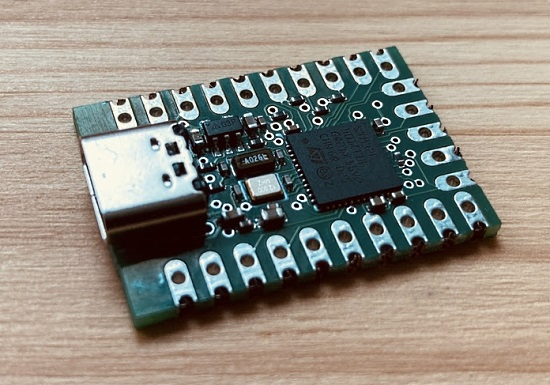](https://circuitpython.org/)

Now that I'm back, I'm switching over briefly to Arduino, to implement some of the improvements we made to the Neopixel on ESP32-S2 Circuitpython. The Neopixel libraries on Arduino don't yet use the ESP32's RMT module (ReMoTe controller module), which is usually used for IR but is also capable of emulating high speed protocols like the Neopixel's. I'm also reading up on the ESP32-S2 network layers so I can better assist Scott with those kinds of projects.

**Melissa**

This past week has mostly been about e-ink displays. I've been working on updating a the e-ink breakouts guide to be a more all inclusive guide. I started with adding our new 2.9" Grayscale e-ink display, which required ensuring the software support was in place, so there were a lot of arduino library updates. 

I also added a number of 2.9" Tri-Color e-Ink display pages to [the same guide](https://learn.adafruit.com/adafruit-eink-display-breakouts). Some of the changes that were made to examples were coming up with a common pinout for wiring up the breakouts so that the user only needed to make only minimal changes to the examples to use them with the FeatherWings and Breakouts. This was a different approach than the old examples which had the wiring chosen to make the wiring diagrams clearer. 

**Scott**

This last week has been a bit scattered. I finished up the native work in CircuitPython to support grayscale e-paper displays. I made a bit of progress on the deep sleep API before getting distracted by adding NTP support for the ESP32-S2 and fixing some bugs in latest version of Adafruit requests.

I'm going to continue fixing requests bugs, wrapping up NTP and hopefully get back to the deep sleep API. It's all worthwhile work so the only cost is switching between the different tasks. It will be great to get it all polished up. :-)

## Upcoming events!

[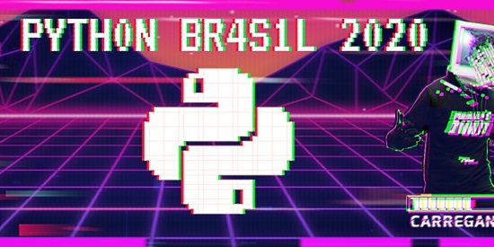](https://2020.pythonbrasil.org.br/)

Python Brasil 2020 is the largest conference on Python programming language in Brazil and Latin America. This year, due to the Covid-19 pandemic, Python Brasil will be held remotely. There will be seven days of immersion November 2-November 8, 2020 - [Site](https://2020.pythonbrasil.org.br/) and [Tickets](https://www.eventbrite.com.br/e/python-brasil-2020-tickets-117927633727).

The Hackaday Remoticon will take place everywhere November 6th – 8th, 2020. It’s a weekend packed with workshops about hardware creation, held virtually for all to enjoy - [Hackaday](https://hackaday.com/2020/08/04/hackaday-remoticon-our-2020-conference-is-packed-with-workshops-and-were-calling-for-proposals/).

PyCon Sweden 2020 will be held 12-13 of November 2020 online - [PyCon Sweden](http://www.pycon.se/).

**Send Your Events In**

As for other events, with the COVID pandemic, most in-person events are postponed or cancelled. If you know of virtual events or events that may occur in the future, please let us know on Discord or on Twitter with hashtag #CircuitPython.

## Latest releases

CircuitPython's stable release is [#.#.#](https://github.com/adafruit/circuitpython/releases/latest) and its unstable release is [#.#.#-##.#](https://github.com/adafruit/circuitpython/releases). New to CircuitPython? Start with our [Welcome to CircuitPython Guide](https://learn.adafruit.com/welcome-to-circuitpython).

[2020####](https://github.com/adafruit/Adafruit_CircuitPython_Bundle/releases/latest) is the latest CircuitPython library bundle.

[v#.#.#](https://micropython.org/download) is the latest MicroPython release. Documentation for it is [here](http://docs.micropython.org/en/latest/pyboard/).

[#.#.#](https://www.python.org/downloads/) is the latest Python release. The latest pre-release version is [#.#.#](https://www.python.org/download/pre-releases/).

[1881 Stars](https://github.com/adafruit/circuitpython/stargazers) Like CircuitPython? [Star it on GitHub!](https://github.com/adafruit/circuitpython)

## Call for help -- Translating CircuitPython is now easier than ever!

[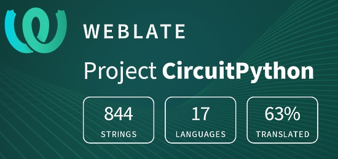](https://hosted.weblate.org/engage/circuitpython/)

One important feature of CircuitPython is translated control and error messages.

With the help of fellow open source project [Weblate](https://weblate.org/), we're making it even easier to add or improve translations.

Sign in with an existing account such as Github, Google or Facebook and start contributing through a simple web interface. No forks or pull requests needed!

As always, if you run into trouble join us on [Discord](https://adafru.it/discord), we're here to help.

## jobs.adafruit.com - Find a dream job, find great candidates!

[jobs.adafruit.com](https://jobs.adafruit.com/) has returned and folks are posting their skills (including CircuitPython) and companies are looking for talented makers to join their companies - from Digi-Key, to Hackaday, Microcenter, Raspberry Pi and more.

**Job of the Week**

text - [Adafruit Jobs Board](https://jobs.adafruit.com/).

## NUMBER thanks!

The Adafruit Discord community, where we do all our CircuitPython development in the open, reached over NUMBER humans, thank you!  Adafruit believes Discord offers a unique way for CircuitPython folks to connect. Join today at [https://adafru.it/discord](https://adafru.it/discord).

## ICYMI - In case you missed it

The wonderful world of Python on hardware! This is our Python video-newsletter-podcast! The news comes from the Python community, Discord, Adafruit communities and more and is reviewed on ASK an ENGINEER Wednesdays. The complete Python on Hardware weekly videocast [playlist is here](https://www.youtube.com/playlist?list=PLjF7R1fz_OOXRMjM7Sm0J2Xt6H81TdDev). 

This video podcast is on [iTunes](https://itunes.apple.com/us/podcast/python-on-hardware/id1451685192?mt=2), [YouTube](http://adafru.it/pohepisodes), [IGTV (Instagram TV](https://www.instagram.com/adafruit/channel/)), and [XML](https://itunes.apple.com/us/podcast/python-on-hardware/id1451685192?mt=2).

[Weekly community chat on Adafruit Discord server CircuitPython channel - Audio / Podcast edition](https://itunes.apple.com/us/podcast/circuitpython-weekly-meeting/id1451685016) - Audio from the Discord chat space for CircuitPython, meetings are usually Mondays at 2pm ET, this is the audio version on [iTunes](https://itunes.apple.com/us/podcast/circuitpython-weekly-meeting/id1451685016), Pocket Casts, [Spotify](https://adafru.it/spotify), and [XML feed](https://adafruit-podcasts.s3.amazonaws.com/circuitpython_weekly_meeting/audio-podcast.xml).

And lastly, we are working up a one-spot destination for all things podcast-able here - [podcasts.adafruit.com](https://podcasts.adafruit.com/)

## Codecademy "Learn Hardware Programming with CircuitPython"

Codecademy, an online interactive learning platform used by more than 45 million people, has teamed up with the leading manufacturer in STEAM electronics, Adafruit Industries, to create a coding course, "Learn Hardware Programming with CircuitPython". The course is now available in the [Codecademy catalog](https://www.codecademy.com/learn/learn-circuitpython?utm_source=adafruit&utm_medium=partners&utm_campaign=circuitplayground&utm_content=pythononhardwarenewsletter).

Python is a highly versatile, easy to learn programming language that a wide range of people, from visual effects artists in Hollywood to mission control at NASA, use to quickly solve problems. But you don’t need to be a rocket scientist to accomplish amazing things with it. This new course introduces programmers to Python by way of a microcontroller — CircuitPython — which is a Python-based programming language optimized for use on hardware.

CircuitPython’s hardware-ready design makes it easier than ever to program a variety of single-board computers, and this course gets you from no experience to working prototype faster than ever before. Codecademy’s interactive learning environment, combined with Adafruit's highly rated Circuit Playground Express, present aspiring hardware hackers with a never-before-seen opportunity to learn hardware programming seamlessly online.

Whether for those who are new to programming, or for those who want to expand their skill set to include physical computing, this course will have students getting familiar with Python and creating incredible projects along the way. By the end, students will have built their own bike lights, drum machine, and even a moisture detector that can tell when it's time to water a plant.

Visit Codecademy to access the [Learn Hardware Programming with CircuitPython](https://www.codecademy.com/learn/learn-circuitpython?utm_source=adafruit&utm_medium=partners&utm_campaign=circuitplayground&utm_content=pythononhardwarenewsletter) course and Adafruit to purchase a [Circuit Playground Express](https://www.adafruit.com/product/3333).

Codecademy has helped more than 45 million people around the world upgrade their careers with technology skills. The company’s online interactive learning platform is widely recognized for providing an accessible, flexible, and engaging experience for beginners and experienced programmers alike. Codecademy has raised a total of $43 million from investors including Union Square Ventures, Kleiner Perkins, Index Ventures, Thrive Capital, Naspers, Yuri Milner and Richard Branson, most recently raising its $30 million Series C in July 2016.

## Contribute!

The CircuitPython Weekly Newsletter is a CircuitPython community-run newsletter emailed every Tuesday. The complete [archives are here](https://www.adafruitdaily.com/category/circuitpython/). It highlights the latest CircuitPython related news from around the web including Python and MicroPython developments. To contribute, edit next week's draft [on GitHub](https://github.com/adafruit/circuitpython-weekly-newsletter/tree/gh-pages/_drafts) and [submit a pull request](https://help.github.com/articles/editing-files-in-your-repository/) with the changes. You may also tag your information on Twitter with #CircuitPython. 

Join our [Discord](https://adafru.it/discord) or [post to the forum](https://forums.adafruit.com/viewforum.php?f=60) for any further questions.
