- [X] Kattni updates
- [ ] change date
- [ ] update title
- [ ] Feature story
- [ ] Update  for images
- [ ] Update ICYDNCI
- [ ] All images 550w max only
- [ ] Link "View this email in your browser."

News Sources

- [python.org](https://www.python.org/)
- [Python Insider - dev team blog](https://pythoninsider.blogspot.com/)

View this email in your browser.

Hi everyone! It's the latest Python for Microcontrollers newsletter, brought you by the community! We're on [Discord](https://discord.gg/HYqvREz), [Twitter](https://twitter.com/search?q=circuitpython&src=typed_query&f=live), and for past newsletters - [view them all here](https://www.adafruitdaily.com/category/circuitpython/). If you're reading this on the web, [subscribe here](https://www.adafruitdaily.com/). Let's get started!

## CircuitPython 6.0.0 Stable and 6.1.0 beta 1

[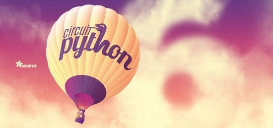](https://circuitpython.org/)

### CircuitPython 6.0.0

CircuitPython 6.0.0 is the latest major revision of CircuitPython, is now the new stable release.

Major new features and improvements since 5.x
* New port to ESP32-S2 chip.
* RGBMatrix display support.
* countio module to count pulses.
* watchdog controls hardware watchdog timer. Only on certain ports.
* vectorio provides native displayio shapes.
* canio provides support for CAN bus operations.
* \_bleio adds support for HCI-based BLE co-processors, such as AirLift boards.
* aesio provides support for AES computations.
* async/await made available by default in many builds; support improved.
* Network modules are revamped, adding wifi, socketpool, ssl, and other modules. Disabled socket, wiznet5k and network modules. They will be removed in 7.x in favor of networking * libraries.
* Updated stage and pew libraries.
* \_pixelbuf improvements.
* Improved USB serial detection.
* json can now read from stream objects.
* pulseio.PWMOut is split out into pwmio.PWMOut. It is still available in pulseio, but that is deprecated and will be removed in 7.x.
* Added memorymonitor for memory debugging. It is not enabled by default.
* Reduced power consumption (light sleep) during time.sleep() when possible.

### CircuitPython 6.1.0 Beta 1

This is the second beta release of 6.1.0. (This first was broken.) It includes many changes that were done while 6.0.0 release candidates were in pre-release. Please use 6.0.x if you need a stable version of CircuitPython on all ports except ESP32-S2. Please use this release or newer for the ESP32-S2. 

For more information: [6.0.0 Release](https://blog.adafruit.com/2020/11/16/circuitpython-6-0-0-released-adafruit-circuitpython/)
and [CircuitPython 6.1.0 Beta 1](https://blog.adafruit.com/2020/11/19/circuitpython-6-1-0-beta-1-released/).

### Core Development Milestone

[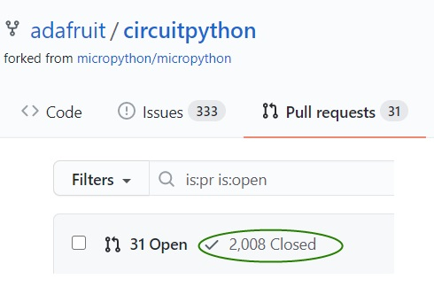](https://github.com/adafruit/circuitpython/pulls)

Work on the CircuitPython core just crossed 2,000 closed pull requests! - [GitHub](https://github.com/adafruit/circuitpython/pulls).

## Adafruit MagTag Projects

[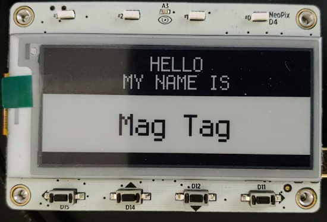](https://github.com/adafruit/Adafruit_CircuitPython_PyBadger/pull/39)

Making MagTag simple test projects including a conference badge - [GitHub](https://github.com/adafruit/Adafruit_CircuitPython_PyBadger/pull/39).

[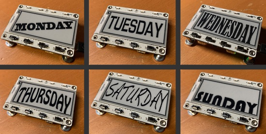](https://todbot.com/blog/2020/11/20/magtag-day-of-week/)

A MagTag Day of Week display - [todbot Blog](https://todbot.com/blog/2020/11/20/magtag-day-of-week/).

Inspirational Quote eInk Display - [Adafruit Blog](https://blog.adafruit.com/2020/11/17/inspirational-quote-e-ink-display/) and [YouTube](https://youtu.be/rmTvXKRvJ5M).
 

CircuitPyUI on the new Adafruit MagTag - [Twitter](https://twitter.com/josecastillo/status/1329801282354360321) and [GitHub](https://github.com/joeycastillo/circuitpyui/blob/main/examples/MagTag/minimal.py).

## CircuitPython Deep Dive Stream with Scott Shawcroft

[This week](link), Scott streams his work on .

You can see the latest video and past videos on the Adafruit YouTube channel under the Deep Dive playlist - [YouTube](https://www.youtube.com/playlist?list=PLjF7R1fz_OOXBHlu9msoXq2jQN4JpCk8A).

## Adafruit Update

**Adafruit is shipping orders!**

Adafruit is stocked and shipping orders! Now is the best time to get orders in for your favorite products, including holiday projects and gifts - [Adafruit](https://learn.adafruit.com/).

Adafruit is currently offering a one-time use discount code of 20% off after adding two factor authentication (2FA) to ones Adafruit account. The code may be used until November 26, 2020. See [this guide](https://learn.adafruit.com/secure-your-account-and-unlock-20-off?view=all) for details.

**[Shop Adafruit now](https://www.adafruit.com/)**

## News from around the web!

Como iniciar en ESP32-S2 con Arduino y Circuitpython / How to boot into ESP32-S2 with Arduino and Circuitpython - [YouTube](https://www.youtube.com/watch?v=zpaunhgT0wQ) (Spanish).

QuickPYTHON, a retro-futuristic educational interactive coding environment. Powered by Python and nostalgia. -[GitHub](https://timothycrosley.github.io/quickpython/).

[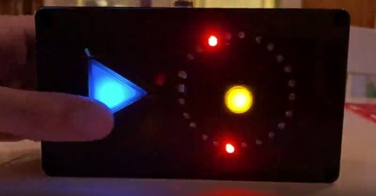](https://curtmerrill.com/posts/2020/busy-box-v1/)

> Our daugther, like many kids, enjoys pressing buttons and flipping switches. I attempted to build her a "busy box" to satisfy her button-pushing tendencies. I started simple: a couple of light-up buttons and some LEDs. The Trinket M0 from Adafruit, was my starting point. I chose it because it was small and could run CircuitPython. - [curtmerrill.com](https://curtmerrill.com/posts/2020/busy-box-v1/).

[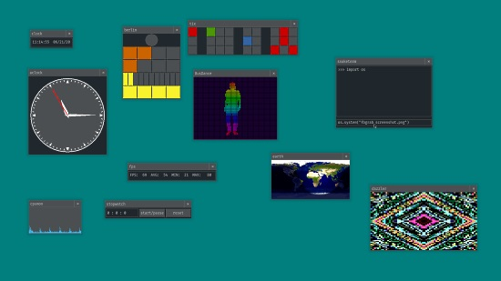](https://github.com/joshiemoore/snakeware)

snakeware is a free Linux distro with a Python userspace inspired by the Commodore 64. You are booted directly into a Python interpreter, which you can use to do with whatever you want - [GitHub](https://github.com/joshiemoore/snakeware).

[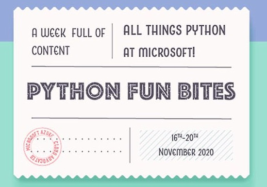](https://twitter.com/nnja/status/1328461596146888704)

Nina's lightning guide to staying connected with the Python Community - [dev.to](https://dev.to/azure/the-python-community-is-stronger-together-1anl) and [Twitter](https://twitter.com/nnja/status/1328461596146888704).

[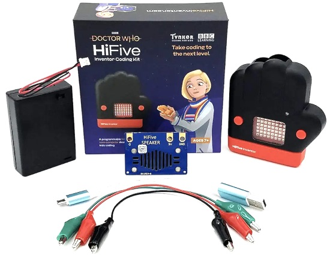](https://www.cnx-software.com/2020/11/20/bbc-doctor-who-hifive-inventor-coding-kit-aims-to-teach-iot-to-kids/)

The BBC Doctor Who "HiFive Inventor" Coding Kit - [cnx-software](https://www.cnx-software.com/2020/11/20/bbc-doctor-who-hifive-inventor-coding-kit-aims-to-teach-iot-to-kids/).
 

The Origin of the "MIT License" - [IEEE Xplore](https://ieeexplore.ieee.org/document/9263265).
 
[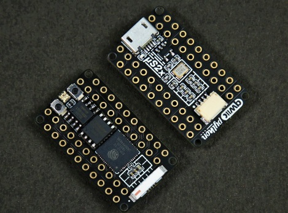](https://github.com/microDev1/microS2)

MicroDev's microS2 Packs an ESP32-S2 Microcontroller Into a Tiny Module-Size Form Factor - [hackster.io](https://www.hackster.io/news/microdev-s-micros2-packs-an-esp32-s2-microcontroller-into-a-tiny-module-size-form-factor-6baace1a1b5c) and [GitHub](https://github.com/microDev1/microS2).

[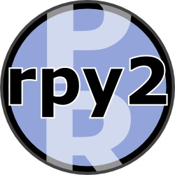](https://twitter.com/SciPyTip/status/1329913672643166209)

rpy2 is an interface to R running embedded in a Python process - [Twitter](https://twitter.com/SciPyTip/status/1329913672643166209) and [Sourceforge](https://rpy.sourceforge.io/).

Bitmap font editor tool - [NathanDumont](https://nathandumont.com/blog/bitmap-font-editor-tool) and [GitHub](https://github.com/hairymnstr/fontedit).

[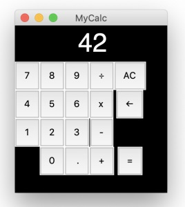](http://www.suppertime.co.uk/blogmywiki/2020/11/python-calculator-guizero/)

Make a simple calculator with guizero & Python - [blogmywiki](http://www.suppertime.co.uk/blogmywiki/2020/11/python-calculator-guizero/).

text - [site](url).

**#ICYDNCI What was the most popular, most clicked link, in [last week's newsletter](https://link)? [title](url).**

## Coming soon

MorphESP 240 by Morpheans - an ESP32-S2 dev board with integrated display at CrowdSupply - [CrowdSupply](https://www.crowdsupply.com/morpheans/morphesp-240).

[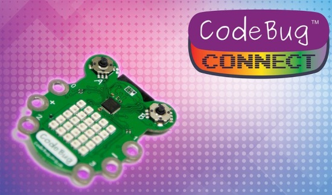](https://www.kickstarter.com/projects/codebug/codebug-connect-cute-colourful-and-programmable-iot-wearable)

CodeBug Connect: cute, colourful & programmable IoT wearable, using MicroPython, on Kickstarter - [Kickstarter](https://www.kickstarter.com/projects/codebug/codebug-connect-cute-colourful-and-programmable-iot-wearable).

## New Boards Supported by CircuitPython

The number of supported microcontrollers and Single Board Computers (SBC) grows every week. This section outlines which boards have been included in CircuitPython or added to [CircuitPython.org](https://circuitpython.org/).

This week we had X new boards added!

- [Board name](url)

Looking for adding a new board to CircuitPython? It's highly encouraged! Adafruit has four guides to help you do so:

- [How to Add a New Board to CircuitPython](https://learn.adafruit.com/how-to-add-a-new-board-to-circuitpython/overview)
- [How to add a New Board to the circuitpython.org website](https://learn.adafruit.com/how-to-add-a-new-board-to-the-circuitpython-org-website)
- [Adding a Single Board Computer to PlatformDetect for Blinka](https://learn.adafruit.com/adding-a-single-board-computer-to-platformdetect-for-blinka)
- [Adding a Single Board Computer to Blinka](https://learn.adafruit.com/adding-a-single-board-computer-to-blinka)

## New Learn Guides!

[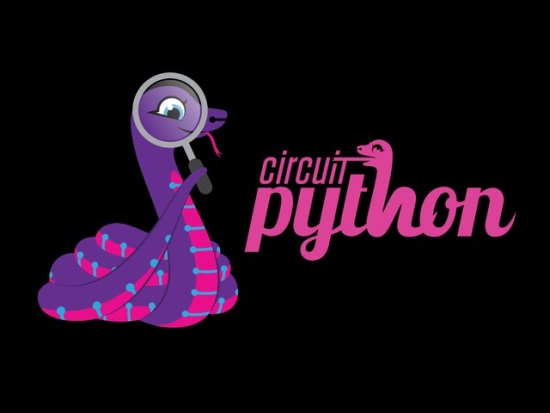](https://learn.adafruit.com/)

[Matrix Portal Flow Visualizer](https://learn.adafruit.com/matrix-portal-flow-visualizer) from [Carter Nelson](https://learn.adafruit.com/users/caternuson)

[Which CircuitPython Board is Right for You?](https://learn.adafruit.com/choose-your-circuitpython-board) from [Kattni](https://learn.adafruit.com/users/kattni)

## CircuitPython Libraries!

CircuitPython support for hardware continues to grow. We are adding support for new sensors and breakouts all the time, as well as improving on the drivers we already have. As we add more libraries and update current ones, you can keep up with all the changes right here!

For the latest libraries, download the [Adafruit CircuitPython Library Bundle](https://circuitpython.org/libraries). For the latest community contributed libraries, download the [CircuitPython Community Bundle](https://github.com/adafruit/CircuitPython_Community_Bundle/releases).

If you'd like to contribute, CircuitPython libraries are a great place to start. Have an idea for a new driver? File an issue on [CircuitPython](https://github.com/adafruit/circuitpython/issues)! Have you written a library you'd like to make available? Submit it to the [CircuitPython Community Bundle](https://github.com/adafruit/CircuitPython_Community_Bundle). Interested in helping with current libraries? Check out the [CircuitPython.org Contributing page](https://circuitpython.org/contributing). We've included open pull requests and issues from the libraries, and details about repo-level issues that need to be addressed. We have a guide on [contributing to CircuitPython with Git and Github](https://learn.adafruit.com/contribute-to-circuitpython-with-git-and-github) if you need help getting started. You can also find us in the #circuitpython channel on the [Adafruit Discord](https://adafru.it/discord).

You can check out this [list of all the Adafruit CircuitPython libraries and drivers available](https://github.com/adafruit/Adafruit_CircuitPython_Bundle/blob/master/circuitpython_library_list.md). 

The current number of CircuitPython libraries is **281**!

**New Libraries!**

Here's this week's new CircuitPython libraries:

 * [Adafruit_CircuitPython_MagTag](https://github.com/adafruit/Adafruit_CircuitPython_MagTag)

**Updated Libraries!**

Here's this week's updated CircuitPython libraries:
 * [Adafruit_CircuitPython_MONSTERM4SK](https://github.com/adafruit/Adafruit_CircuitPython_MONSTERM4SK)
 * [Adafruit_CircuitPython_IL0373](https://github.com/adafruit/Adafruit_CircuitPython_IL0373)
 * [Adafruit_CircuitPython_MatrixPortal](https://github.com/adafruit/Adafruit_CircuitPython_MatrixPortal)
 * [Adafruit_CircuitPython_LIS3MDL](https://github.com/adafruit/Adafruit_CircuitPython_LIS3MDL)
 * [Adafruit_CircuitPython_AdafruitIO](https://github.com/adafruit/Adafruit_CircuitPython_AdafruitIO)
 * [Adafruit_CircuitPython_CharLCD](https://github.com/adafruit/Adafruit_CircuitPython_CharLCD)
 * [Adafruit_CircuitPython_Display_Text](https://github.com/adafruit/Adafruit_CircuitPython_Display_Text)
 * [Adafruit_CircuitPython_Requests](https://github.com/adafruit/Adafruit_CircuitPython_Requests)
 * [Adafruit_CircuitPython_Slideshow](https://github.com/adafruit/Adafruit_CircuitPython_Slideshow)
 * [Adafruit_CircuitPython_LC709203F](https://github.com/adafruit/Adafruit_CircuitPython_LC709203F)
 * [Adafruit_CircuitPython_PyBadger](https://github.com/adafruit/Adafruit_CircuitPython_PyBadger)
 * [Adafruit_CircuitPython_PM25](https://github.com/adafruit/Adafruit_CircuitPython_PM25)
 * [CircuitPython_Community_Bundle](https://github.com/adafruit/CircuitPython_Community_Bundle)

## What’s the team up to this week?

What is the team up to this week? Let’s check in!

**Bryan**

text

**Dan**

I did the final steps for the CircuitPython 6.0.0 stable release on Monday evening. Thanks to all who worked on and tested this really significant release!

I am continuing to work on light sleep and deep sleep in CircuitPython, after significant work by Scott and @microDev.  [We iterated on the API](https://github.com/adafruit/circuitpython/issues/2796), and I'm now doing the boilerplate for that API. As soon as that compiles, I will then implement deep sleep for a time duration on the ESP32-S2 as the first case. Scott and microDev1 have done a lot of the internal work already, so I hope that part will not take long. Then I'll work on deep sleep for pin transitions, and then light sleep for both durations and pins.

**Jeff**

I did some bug fixing on esp32s2 during the past week.  First, I fixed a problem which prevented CircuitPython on the esp32s2 from connecting to certain secure websites, including thingspeak and adafruit io.  Second, I fixed a problem where the board would become unstable after using an I2C device.  Both are working much more stably now!

**Kattni**

This week I published the [Which CircuitPython Board is Right for You? guide](https://learn.adafruit.com/choose-your-circuitpython-board). This guide is designed to help you choose between CircuitPython boards based on different features such as WiFi enabled, Bluetooth enabled, built in display or tiny boards. It also has a page explaining the differences between the different chipsets available on CircuitPython compatible boards, and the pros and cons of each. If you've held off getting started with CircuitPython because you were overwhelmed by the choice of boards, or you're a seasoned pro trying to decide which board to get, this guide is for you!

I also tested an update to the PyBadger library. Thanks to @foamyguy, it now supports the new MagTag board. If you're looking to use your MagTag as a badge, check out the example included with this update.

**Lucian**

text

**Melissa**

This past week I fixed the Raspberry Pi 1.3" display driver. When it was in orientations other than 0 degrees, the display was offset by 80 pixels. I rewrote the Device Tree Overlay based on a similar one we had for the 1.14" display, which was my first experience working on a Device Tree Overlay.

I added a few improvements to the MagTag library based on feedback from a few projects that were converted to work on it. My goal with this library was to make it extensible, but easy to develop on. One of the projects I made while developing this was a bitcoin display.

[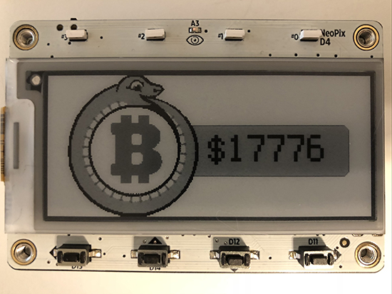](https://circuitpython.org/)

I've also been getting back into working on some of the web-based tools such as making a few fixes to my existing code and I started working on an online ESP Tool. The ESP tool would allow you to upload a bootloader and have it program your ESP board. It's not currently working, but I am debugging it at the moment.

**Scott**

This past week I've been doing my best to run down bugs CircuitPython. At the end of last week I was looking into adding grayscale EInk support and also found and fixed a couple bugs in our grayscale conversion. As of this morning, they are all merged into the main branch of CircuitPython.

We just released 6.0.0 stable, which is stable for our core platforms, SAMD21, SAMD51 and nRF52840. However, it isn't stable on the ESP32-S2 yet. So, I've been doing my best to find and fix issues. I attempted to release our first 6.1.0-beta.0 but it turned out to include a pretty nasty bug. So, I'm hoping to do a beta.1 today. Folks, with ESP32-S2 boards like the MagTag should continue to use the latest pre-release. It'll be better than 6.0.0 for the -S2.

This period of bug squishing happens for every new port we do for CircuitPython. Once we're through it, things should be very exciting. The -S2's native USB combined with WiFi and new low power API promises to bring CircuitPython's ease of use to a whole new class of long-running, connected applications.

## Upcoming events!

Women Who Code CONNECT Forward, December 2-4, 2020 online - [Women Who Code](https://connectforward.womenwhocode.dev/).

Join educators, researchers, and the developer community for micro:bit LIVE 2020 virtual, an online event December 4-5, 2020. There is no cost to register and attend - [Microbit.Org](https://microbit.org/news/events/live/).

PyDay Chile 2020 Conference: December 5, Online. The deadline for applying for talks is November 18 - [pyday.d](https://pyday.cl/).

The 2021 Open Hardware summit will be held online, Friday April 9, 2021. The summit will be livestreamed, but ticket holders will have access to additional interactive portions of the summit like meet-and-greets, workshops, and sponsor booths. Find details, including ticket and sponsorship information at [2021.oshwa.org](https://2021.oshwa.org/) - [OSHWA](https://www.oshwa.org/2020/11/16/announcing-the-2021-open-hardware-summit/) [PyDat Chile](pyday.d]).

**Send Your Events In**

As for other events, with the COVID pandemic, most in-person events are postponed or cancelled. If you know of virtual events or events that may occur in the future, please let us know on Discord or on Twitter with hashtag #CircuitPython.

## Latest releases

CircuitPython's stable release is [#.#.#](https://github.com/adafruit/circuitpython/releases/latest) and its unstable release is [#.#.#-##.#](https://github.com/adafruit/circuitpython/releases). New to CircuitPython? Start with our [Welcome to CircuitPython Guide](https://learn.adafruit.com/welcome-to-circuitpython).

[2020####](https://github.com/adafruit/Adafruit_CircuitPython_Bundle/releases/latest) is the latest CircuitPython library bundle.

[v#.#.#](https://micropython.org/download) is the latest MicroPython release. Documentation for it is [here](http://docs.micropython.org/en/latest/pyboard/).

[#.#.#](https://www.python.org/downloads/) is the latest Python release. The latest pre-release version is [#.#.#](https://www.python.org/download/pre-releases/).

[1899 Stars](https://github.com/adafruit/circuitpython/stargazers) Like CircuitPython? [Star it on GitHub!](https://github.com/adafruit/circuitpython)

## Call for help -- Translating CircuitPython is now easier than ever!

One important feature of CircuitPython is translated control and error messages.

With the help of fellow open source project [Weblate](https://weblate.org/), we're making it even easier to add or improve translations.

Sign in with an existing account such as Github, Google or Facebook and start contributing through a simple web interface. No forks or pull requests needed!

As always, if you run into trouble join us on [Discord](https://adafru.it/discord), we're here to help.

## jobs.adafruit.com - Find a dream job, find great candidates!

[jobs.adafruit.com](https://jobs.adafruit.com/) has returned and folks are posting their skills (including CircuitPython) and companies are looking for talented makers to join their companies - from Digi-Key, to Hackaday, Microcenter, Raspberry Pi and more.

**Job of the Week**

text - [Adafruit Jobs Board](https://jobs.adafruit.com/).

## NUMBER thanks!

The Adafruit Discord community, where we do all our CircuitPython development in the open, reached over NUMBER humans, thank you!  Adafruit believes Discord offers a unique way for CircuitPython folks to connect. Join today at [https://adafru.it/discord](https://adafru.it/discord).

## ICYMI - In case you missed it

The wonderful world of Python on hardware! This is our Python video-newsletter-podcast! The news comes from the Python community, Discord, Adafruit communities and more and is reviewed on ASK an ENGINEER Wednesdays. The complete Python on Hardware weekly videocast [playlist is here](https://www.youtube.com/playlist?list=PLjF7R1fz_OOXRMjM7Sm0J2Xt6H81TdDev). 

This video podcast is on [iTunes](https://itunes.apple.com/us/podcast/python-on-hardware/id1451685192?mt=2), [YouTube](http://adafru.it/pohepisodes), [IGTV (Instagram TV](https://www.instagram.com/adafruit/channel/)), and [XML](https://itunes.apple.com/us/podcast/python-on-hardware/id1451685192?mt=2).

[Weekly community chat on Adafruit Discord server CircuitPython channel - Audio / Podcast edition](https://itunes.apple.com/us/podcast/circuitpython-weekly-meeting/id1451685016) - Audio from the Discord chat space for CircuitPython, meetings are usually Mondays at 2pm ET, this is the audio version on [iTunes](https://itunes.apple.com/us/podcast/circuitpython-weekly-meeting/id1451685016), Pocket Casts, [Spotify](https://adafru.it/spotify), and [XML feed](https://adafruit-podcasts.s3.amazonaws.com/circuitpython_weekly_meeting/audio-podcast.xml).

And lastly, we are working up a one-spot destination for all things podcast-able here - [podcasts.adafruit.com](https://podcasts.adafruit.com/)

## Codecademy "Learn Hardware Programming with CircuitPython"

Codecademy, an online interactive learning platform used by more than 45 million people, has teamed up with the leading manufacturer in STEAM electronics, Adafruit Industries, to create a coding course, "Learn Hardware Programming with CircuitPython". The course is now available in the [Codecademy catalog](https://www.codecademy.com/learn/learn-circuitpython?utm_source=adafruit&utm_medium=partners&utm_campaign=circuitplayground&utm_content=pythononhardwarenewsletter).

Python is a highly versatile, easy to learn programming language that a wide range of people, from visual effects artists in Hollywood to mission control at NASA, use to quickly solve problems. But you don’t need to be a rocket scientist to accomplish amazing things with it. This new course introduces programmers to Python by way of a microcontroller — CircuitPython — which is a Python-based programming language optimized for use on hardware.

CircuitPython’s hardware-ready design makes it easier than ever to program a variety of single-board computers, and this course gets you from no experience to working prototype faster than ever before. Codecademy’s interactive learning environment, combined with Adafruit's highly rated Circuit Playground Express, present aspiring hardware hackers with a never-before-seen opportunity to learn hardware programming seamlessly online.

Whether for those who are new to programming, or for those who want to expand their skill set to include physical computing, this course will have students getting familiar with Python and creating incredible projects along the way. By the end, students will have built their own bike lights, drum machine, and even a moisture detector that can tell when it's time to water a plant.

Visit Codecademy to access the [Learn Hardware Programming with CircuitPython](https://www.codecademy.com/learn/learn-circuitpython?utm_source=adafruit&utm_medium=partners&utm_campaign=circuitplayground&utm_content=pythononhardwarenewsletter) course and Adafruit to purchase a [Circuit Playground Express](https://www.adafruit.com/product/3333).

Codecademy has helped more than 45 million people around the world upgrade their careers with technology skills. The company’s online interactive learning platform is widely recognized for providing an accessible, flexible, and engaging experience for beginners and experienced programmers alike. Codecademy has raised a total of $43 million from investors including Union Square Ventures, Kleiner Perkins, Index Ventures, Thrive Capital, Naspers, Yuri Milner and Richard Branson, most recently raising its $30 million Series C in July 2016.

## Contribute!

The CircuitPython Weekly Newsletter is a CircuitPython community-run newsletter emailed every Tuesday. The complete [archives are here](https://www.adafruitdaily.com/category/circuitpython/). It highlights the latest CircuitPython related news from around the web including Python and MicroPython developments. To contribute, edit next week's draft [on GitHub](https://github.com/adafruit/circuitpython-weekly-newsletter/tree/gh-pages/_drafts) and [submit a pull request](https://help.github.com/articles/editing-files-in-your-repository/) with the changes. You may also tag your information on Twitter with #CircuitPython. 

Join our [Discord](https://adafru.it/discord) or [post to the forum](https://forums.adafruit.com/viewforum.php?f=60) for any further questions.
