- [X] Kattni updates
- [ ] change date
- [ ] update title
- [ ] Feature story
- [ ] Update  for images
- [ ] Update ICYDNCI
- [ ] All images 550w max only
- [ ] Link "View this email in your browser."

News Sources

- [python.org](https://www.python.org/)
- [Python Insider - dev team blog](https://pythoninsider.blogspot.com/)

Template last updated on 11-23-2020 by Anne - Events, article template

View this email in your browser.

Happy December! Here's the latest Python for Microcontrollers newsletter, brought you by the community! We're on [Discord](https://discord.gg/HYqvREz), [Twitter](https://twitter.com/search?q=circuitpython&src=typed_query&f=live), and for past newsletters - [view them all here](https://www.adafruitdaily.com/category/circuitpython/). If you're reading this on the web, [subscribe here](https://www.adafruitdaily.com/). And now the news:

## Deep Sleep support coming to ESP32-S2 CircuitPython

[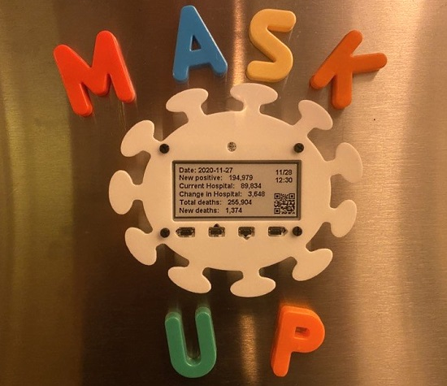](https://blog.adafruit.com/2020/11/28/deep-sleep-support-coming-to-esp32-s2-circuitpython/)

Deep Sleep support coming to ESP32-S2 CircuitPython - [Adafruit Blog](https://blog.adafruit.com/2020/11/28/deep-sleep-support-coming-to-esp32-s2-circuitpython/)

> The [Adafruit MagTag](https://adafruit.com/magtag) was made for “deep sleep”, thanks to the always-on eInk display. Thanks to a new pull request, we’re getting the beginnings of light and deep sleep support. We can get down to 250uA on the MagTag when in deep sleep which will let the board run for weeks at a time. [Check it out](https://github.com/adafruit/circuitpython/pull/3767) and subscribe to the PR to get notifications when it gets merged into main! We are testing it with data from [https://covidtracking.com](https://covidtracking.com/).

## guizero and circuitpyui - a lightweight graphical user interface libraries for Python and CircuitPython

guizero is a Python 3 library for creating simple graphical user interfaces (GUIs) on Linux/Windows/Mac/Raspberry Pi - [GitHub.io](https://lawsie.github.io/guizero/about/)

If you are looking for a similar concept framework for microcontrollers, see circuitpyui - [GitHub](https://github.com/joeycastillo/circuitpyui).

## Developing the NAU7802 24-bit DAC FeatherWing

[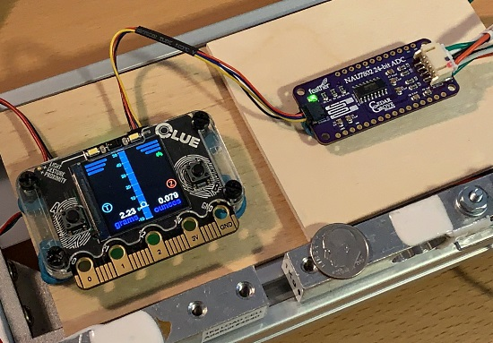](https://twitter.com/CedarGroveMakr/status/1333156977174691840)

[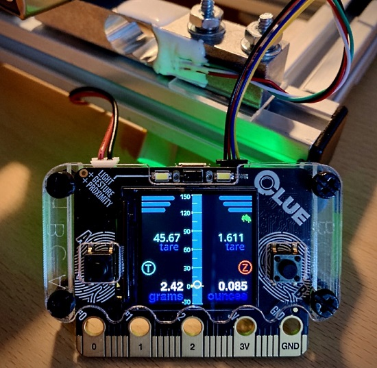](https://twitter.com/CedarGroveMakr/status/1333156977174691840)

Testing with a custom NAU7802 FeatherWing. Being developed in CircuitPython, it measures load cells connected to a SparkFun Quiic scale breakout at present - [Twitter](https://twitter.com/CedarGroveMakr/status/1333156977174691840).

> Developing a CircuitPython 6.0.0 library for the NAU7802 24-bit ADC FeatherWing was a worthwhile educational experience.

## A Stock Ticker with CircuitPython

[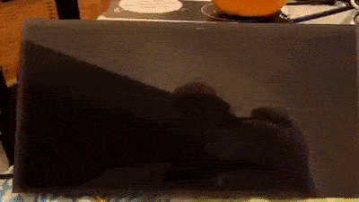](https://twitter.com/mariocruz/status/1331423755361464320)

A stock ticker with an Adafruit MatrixPortal. A possible Christmas gift idea in a beautiful wooden case - [Twitter](https://twitter.com/mariocruz/status/1331423755361464320) and code - [Adafruit Forums](https://forums.adafruit.com/viewtopic.php?f=60&t=172185&p=840476#p840476).

## Adafruit Update

**Adafruit is shipping orders!**

Adafruit is stocked and shipping orders! Now is the best time to get orders in for your favorite products, including holiday projects and gifts - [Adafruit](https://learn.adafruit.com/).

**[Shop Adafruit now](https://www.adafruit.com/)**

## News from around the web!

[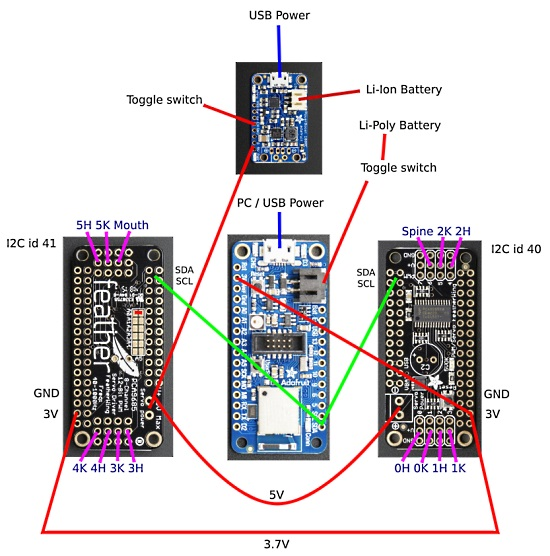](https://twitter.com/TrevorFSmith/status/1327315739859009536?s=20)

Building a mechatronic tardigrade with Adafruit parts and CircuitPython - [Twitter Thread](https://twitter.com/TrevorFSmith/status/1305939195093942272).

[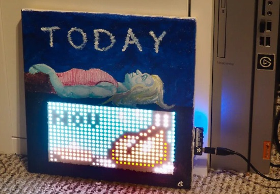](https://encyclopaedia-fortuita.com/index.php/2020/11/26/building-stuff-rgb-matrix-wall-display/)

Building stuff - An RGB Matrix wall display - [Twitter](https://encyclopaedia-fortuita.com/index.php/2020/11/26/building-stuff-rgb-matrix-wall-display/).

[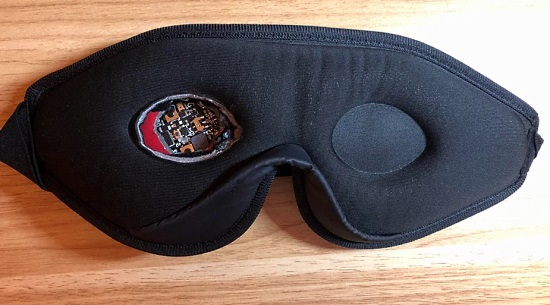](https://jabituyaben.wixsite.com/majorinput/post/lucid-dreaming-with-the-circuit-playground-express)

Lucid dreaming with the Circuit Playground Express - [Ben Jabituya](https://jabituyaben.wixsite.com/majorinput/post/lucid-dreaming-with-the-circuit-playground-express), [YouTube](https://youtu.be/8fSWKeihzBQ), and [Hackaday](https://hackaday.com/2020/11/25/building-a-mask-to-induce-lucid-dreaming/).

[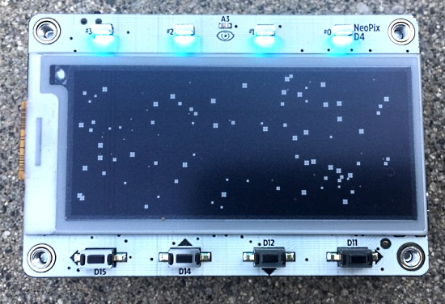](https://twitter.com/carlynorama/status/1332457389329502208)

> "My turn on the Adafruit MagTag this week for Crash Space LA DFN Happy Hour. I made stars! CircuitPython" - [Twitter](https://twitter.com/carlynorama/status/1332457389329502208).

[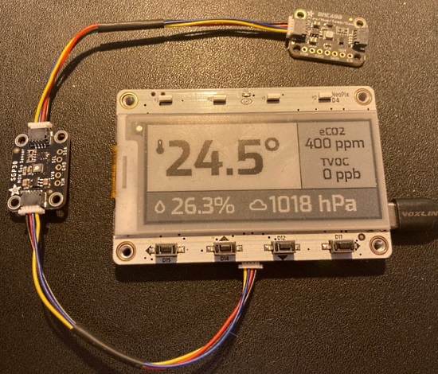](https://twitter.com/JonnyBergdahl/status/1333380431094423552)

An Adafruit MagTag displaying sensor values on the grayscale e-Ink display. All running under CircuitPython - [Twitter](https://twitter.com/JonnyBergdahl/status/1333380431094423552).

An Airlift coprocessor firmware variation for Bluetooth gamepads - [GitHub](https://github.com/adafruit/nina-fw/issues/30#issuecomment-731709288).

[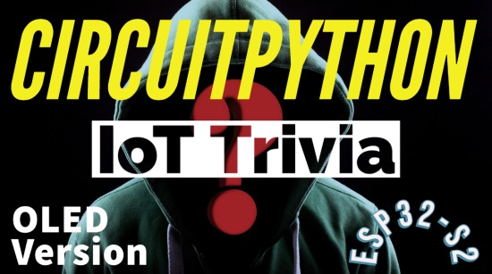](https://github.com/mytechnotalent/CircuitPython_IoT_Trivia)

CircuitPython IoT Trivia ESP32-S2 OLED Version - [GitHub](https://github.com/mytechnotalent/CircuitPython_IoT_Trivia) and [Twitter](https://twitter.com/mytechnotalent/status/1333118310922280960).

[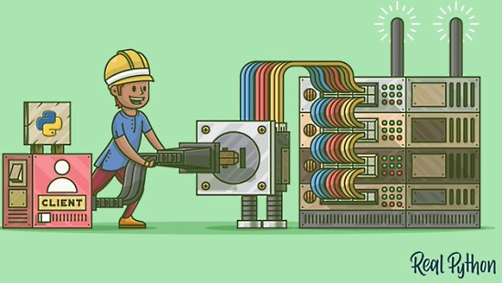](https://realpython.com/python-sockets/)

Socket Programming in Python - [Twitter](https://twitter.com/JossinJax/status/1332548496889671680) [Real Python](https://realpython.com/python-sockets/).

[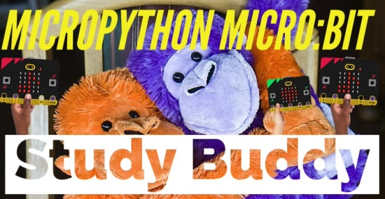](https://twitter.com/mytechnotalent/status/1330145267295936514)

MicroPython micro:bit Custom Python Module - [Twitter](https://twitter.com/mytechnotalent/status/1330145267295936514).

[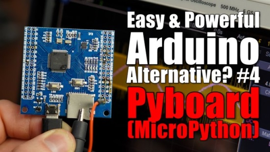](https://www.youtube.com/watch?v=CyrgzzxQPzk&feature=youtu.be)

Easy & Powerful Arduino Alternative? Pyboard (MicroPython) Beginner's Guide - [YouTube](https://www.youtube.com/watch?v=CyrgzzxQPzk&feature=youtu.be) and [Twitter](https://twitter.com/GreatScottLab/status/1333076481128468483).

10 Python Skills They Don’t Teach in Bootcamp - [Towards Data Science](https://towardsdatascience.com/10-python-skills-419e5e4c4d66).

Introspection in Python: use built-in Python tools to both find out exactly what any module can do, and find out exactly how Python will execute your code - [Anvil](https://anvil.works/blog/introspection-in-python).

text - [site](url).

**#ICYDNCI What was the most popular, most clicked link, in [last week's newsletter](https://link)? [title](url).**

## Coming soon

Adafruit posts "Our successful Cobbler400 test for attaching Pi Bonnets/PHATs is followed by a dessert...an extra big helping of Cobbler that can show off your favorite HAT like say, a Sense HAT or maybe a PiTFT to show your favorite GIFs" - [Twitter](https://twitter.com/adafruit/status/1332563758191960070)

## New Boards Supported by CircuitPython

The number of supported microcontrollers and Single Board Computers (SBC) grows every week. This section outlines which boards have been included in CircuitPython or added to [CircuitPython.org](https://circuitpython.org/).

This week we had X new boards added!

- [Board name](url)

Looking for adding a new board to CircuitPython? It's highly encouraged! Adafruit has four guides to help you do so:

- [How to Add a New Board to CircuitPython](https://learn.adafruit.com/how-to-add-a-new-board-to-circuitpython/overview)
- [How to add a New Board to the circuitpython.org website](https://learn.adafruit.com/how-to-add-a-new-board-to-the-circuitpython-org-website)
- [Adding a Single Board Computer to PlatformDetect for Blinka](https://learn.adafruit.com/adding-a-single-board-computer-to-platformdetect-for-blinka)
- [Adding a Single Board Computer to Blinka](https://learn.adafruit.com/adding-a-single-board-computer-to-blinka)

## New Learn Guides!

[MagTag Slideshow](https://learn.adafruit.com/magtag-slideshow) from [John Park](https://learn.adafruit.com/users/johnpark)

[Matrix Portal Money-Sensing Tip Jar](https://learn.adafruit.com/matrix-portal-money-sensing-tip-jar) from [Erin St. Blaine](https://learn.adafruit.com/users/firepixie)

## CircuitPython Libraries!

CircuitPython support for hardware continues to grow. We are adding support for new sensors and breakouts all the time, as well as improving on the drivers we already have. As we add more libraries and update current ones, you can keep up with all the changes right here!

For the latest libraries, download the [Adafruit CircuitPython Library Bundle](https://circuitpython.org/libraries). For the latest community contributed libraries, download the [CircuitPython Community Bundle](https://github.com/adafruit/CircuitPython_Community_Bundle/releases).

If you'd like to contribute, CircuitPython libraries are a great place to start. Have an idea for a new driver? File an issue on [CircuitPython](https://github.com/adafruit/circuitpython/issues)! Have you written a library you'd like to make available? Submit it to the [CircuitPython Community Bundle](https://github.com/adafruit/CircuitPython_Community_Bundle). Interested in helping with current libraries? Check out the [CircuitPython.org Contributing page](https://circuitpython.org/contributing). We've included open pull requests and issues from the libraries, and details about repo-level issues that need to be addressed. We have a guide on [contributing to CircuitPython with Git and Github](https://learn.adafruit.com/contribute-to-circuitpython-with-git-and-github) if you need help getting started. You can also find us in the #circuitpython channel on the [Adafruit Discord](https://adafru.it/discord).

You can check out this [list of all the Adafruit CircuitPython libraries and drivers available](https://github.com/adafruit/Adafruit_CircuitPython_Bundle/blob/master/circuitpython_library_list.md). 

The current number of CircuitPython libraries is **281**!

**Updated Libraries!**

Here's this week's updated CircuitPython libraries:

 * [Adafruit_CircuitPython_DisplayIO_SH1107](https://github.com/adafruit/Adafruit_CircuitPython_DisplayIO_SH1107)
 * [Adafruit_CircuitPython_MCP2515](https://github.com/adafruit/Adafruit_CircuitPython_MCP2515)
 * [Adafruit_CircuitPython_RPLIDAR](https://github.com/adafruit/Adafruit_CircuitPython_RPLIDAR)
 * [Adafruit_CircuitPython_LIS3DH](https://github.com/adafruit/Adafruit_CircuitPython_LIS3DH)
 * [Adafruit_CircuitPython_MatrixPortal](https://github.com/adafruit/Adafruit_CircuitPython_MatrixPortal)
 * [Adafruit_CircuitPython_Display_Shapes](https://github.com/adafruit/Adafruit_CircuitPython_Display_Shapes)
 * [Adafruit_CircuitPython_Display_Text](https://github.com/adafruit/Adafruit_CircuitPython_Display_Text)
 * [Adafruit_CircuitPython_AdafruitIO](https://github.com/adafruit/Adafruit_CircuitPython_AdafruitIO)
 * [Adafruit_CircuitPython_INA260](https://github.com/adafruit/Adafruit_CircuitPython_INA260)
 * [Adafruit_CircuitPython_Slideshow](https://github.com/adafruit/Adafruit_CircuitPython_Slideshow)
 * [Adafruit_CircuitPython_Fingerprint](https://github.com/adafruit/Adafruit_CircuitPython_Fingerprint)
 * [Adafruit_CircuitPython_Bitmap_Font](https://github.com/adafruit/Adafruit_CircuitPython_Bitmap_Font)
 * [Adafruit_CircuitPython_ImageLoad](https://github.com/adafruit/Adafruit_CircuitPython_ImageLoad)
 * [Adafruit_CircuitPython_MagTag](https://github.com/adafruit/Adafruit_CircuitPython_MagTag)
 * [Adafruit_CircuitPython_ProgressBar](https://github.com/adafruit/Adafruit_CircuitPython_ProgressBar)
 * [Adafruit_Blinka](https://github.com/adafruit/Adafruit_Blinka)
 * [Adafruit_Python_PlatformDetect](https://github.com/adafruit/Adafruit_Python_PlatformDetect)

## What’s the team up to this week?

What is the team up to this week? Let’s check in!

**Bryan**

This past week I've been working with the MLX80395 magnetometer by Melexis; it's a nice little sensor, similar to the TLV493 as they're both targeted towards directly sensing magnets as opposed to sensing the earth's electromagnetic field. These are particularly interesting to me due to the type of interfaces they enable. Being able to sense the distance, rotation and orientation of something (by attaching a magnet to it) without needing direct contact with it is pretty dang cool. 

The TLV493 is designed with joysticks in mind, and the MLX90395 is similarly marketed for "contactless" replacements in places where you'd normally see a mechanical switch or potentiometer. I think it's pretty cool when new doors are opened that change what is possible for all the many places we interact with technology. Buttons still have to be buttons, but when you don't need to make any physical contact with the "switch", a lot of the design constraints  for how an interface has to work go out the window.

It will likely be quite a while until these types of interfaces are common, as the humble switch and potentiometer aren't going anywhere anytime soon, due to familiarity, cost, and overall suitability for their intended purpose. With that said however, I think it won't be _too_ long before we see them being used more, and likely in entirely different ways and places than the switch and pot.

**Dan**

I have deep sleep working in CircuitPython on the ESP32-S2. The API has gone through several iterations, and has become simpler. I measured the current consumption to confirm it's really sleeping, using a used Monsoon power meter acquired on eBay, and it's in the couple of hundred micro-ampere range, as expected for the board. Expect to see this new capability in a beta of CircuitPython 6.1.0 soon.

**Jeff**

This week I've continued working on I2S audio output for the ESP32S2, which remains a work in progress.  I've also worked on various bugs and improvements in the core, as well as an upcoming guide using Bluetooth and Blinka on a Raspberry Pi 4.

**Kattni**

This week I added another page to the [Which CircuitPython Board is Right for You?](https://learn.adafruit.com/choose-your-circuitpython-board) guide - Beginner Boards. This page is for folks who are new to CircuitPython, microcontrollers or programming in general. There are a lot of CircuitPython compatible boards to choose from and knowing which one is best to start with should prove to be super helpful. Thanks again to Carter for helping out with this page and the rest of the guide.

I started working on a new project. It's a redo of a MicroPython project, and similar to a previous festive project I did. It will in fact use the same wreath from my previous project, but this time it's featuring the Adafruit MagTag and a NeoPixel strip. The buttons on the MagTag will activate different LED animations. This guide should be out next week.

**Lucian**

This week I wrapped up the work on UDP, with a functional demo of sendto and recvfrom_into, grabbing the time from the global NTP servers. The rest of my week was mostly spent on bugfixes and reviews, including ESP32-S2 pin claiming errors, IDF problems, STM32 I2C sending and receiving, and a new STM32 board, the Thunderpack 1.2. This coming week, I'll be transitioning back into i.MX territory, to check out some of the modules that never got wrapped up, like PWMOut and AnalogIO. I'll also be looking into TCP Server and keeping an eye on new ESP32-S2 bugs that come in on the MagTag and other boards. 

**Melissa**

This past week, I worked on an online ESP Tool some more. One of the challenges I was facing was that the Web Serial streams were converting my bytes into UTF-8 and the ESP32 I was connected to wasn't responding. I found this out by connecting a logic analyzer up and comparing what I thought I was sending to what I was actually getting at the board level. I had a similar issue with the response. I fixed this by removing the TextEncoderStream and TextDecoderStream classes out of the mix and interacting with the port directly, which was different than most examples I was seeing.

Once I had that working, I was able to get the ESP32 to sync and detect the board. I also had it returning the MAC address, which is the unique hardware ID of the network device that accesses the internet. I have the ESP32-S2 being detected as well. Once I had that working, I started work on being able to upload files and have the JavaScript code directly start programming the firmware onto the board. It's not quite working at this point, but it is getting close.

**Scott**
This last week I've been doing a number of small improvements to the ESP32-S2 and network related things. For example, I sped up json parsing. On my stream I did a test query that took 111 seconds at the start and afterwards took 3 seconds.

I've also got a PR out to tweak how the Adafruit requests library works. It turns out the send method may act like it sent data even when it actually hasn't (and can't). So now requests will send everything and check it can read a response before handing off to full response parsing. If it can't read, it recreates the socket and tries again.

There a few other small things too. If you are an early adopter of the ESP32-S2 and CircuitPython, keep an eye on CircuitPython's pull requests and make sure to stay update with the latest pre-release, or even the absolute newest build. We're squashing bugs every day. :-)

## Upcoming events!

Women Who Code CONNECT Forward, December 2-4, 2020 online - [Women Who Code](https://connectforward.womenwhocode.dev/).

Join educators, researchers, and the developer community for micro:bit LIVE 2020 virtual, an online event December 4-5, 2020. There is no cost to register and attend - [Microbit.Org](https://microbit.org/news/events/live/).

PyDay Chile 2020 Conference: December 5, Online. The deadline for applying for talks is November 18 - [pyday.cl](https://pyday.cl/).

Virtual Girls Into Coding #6, December 13th: a free event for girls ages 10-14 to explore online coding activities, online robotics, 3D Design, electronics, and physical computing using the BBC micro:bit. This is a fantastic opportunity to use Python (text-based language) and to get some hands-on making time from the comfort of your home - [Eventbright](https://www.eventbrite.co.uk/e/virtual-girls-into-coding-6-join-us-get-involved-tickets-129147061337).

The 2021 Open Hardware summit will be held online, Friday April 9, 2021. The summit will be livestreamed, but ticket holders will have access to additional interactive portions of the summit like meet-and-greets, workshops, and sponsor booths. Find details, including ticket and sponsorship information at [2021.oshwa.org](https://2021.oshwa.org/) - [OSHWA](https://www.oshwa.org/2020/11/16/announcing-the-2021-open-hardware-summit/).

**Send Your Events In**

As for other events, with the COVID pandemic, most in-person events are postponed or cancelled. If you know of virtual events or events that may occur in the future, please let us know on Discord or on Twitter with hashtag #CircuitPython.

## Latest releases

CircuitPython's stable release is [#.#.#](https://github.com/adafruit/circuitpython/releases/latest) and its unstable release is [#.#.#-##.#](https://github.com/adafruit/circuitpython/releases). New to CircuitPython? Start with our [Welcome to CircuitPython Guide](https://learn.adafruit.com/welcome-to-circuitpython).

[2020####](https://github.com/adafruit/Adafruit_CircuitPython_Bundle/releases/latest) is the latest CircuitPython library bundle.

[v#.#.#](https://micropython.org/download) is the latest MicroPython release. Documentation for it is [here](http://docs.micropython.org/en/latest/pyboard/).

[#.#.#](https://www.python.org/downloads/) is the latest Python release. The latest pre-release version is [#.#.#](https://www.python.org/download/pre-releases/).

[1908 Stars](https://github.com/adafruit/circuitpython/stargazers) Like CircuitPython? [Star it on GitHub!](https://github.com/adafruit/circuitpython)

## Call for help -- Translating CircuitPython is now easier than ever!

[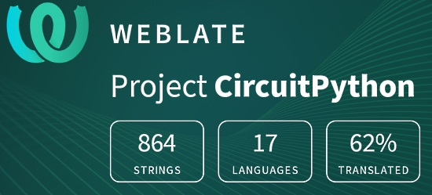](https://hosted.weblate.org/engage/circuitpython/)

One important feature of CircuitPython is translated control and error messages.

With the help of fellow open source project [Weblate](https://weblate.org/), we're making it even easier to add or improve translations.

Sign in with an existing account such as Github, Google or Facebook and start contributing through a simple web interface. No forks or pull requests needed!

As always, if you run into trouble join us on [Discord](https://adafru.it/discord), we're here to help.

## jobs.adafruit.com - Find a dream job, find great candidates!

[jobs.adafruit.com](https://jobs.adafruit.com/) has returned and folks are posting their skills (including CircuitPython) and companies are looking for talented makers to join their companies - from Digi-Key, to Hackaday, Microcenter, Raspberry Pi and more.

## NUMBER thanks!

The Adafruit Discord community, where we do all our CircuitPython development in the open, reached over NUMBER humans, thank you!  Adafruit believes Discord offers a unique way for CircuitPython folks to connect. Join today at [https://adafru.it/discord](https://adafru.it/discord).

## ICYMI - In case you missed it

The wonderful world of Python on hardware! This is our Python video-newsletter-podcast! The news comes from the Python community, Discord, Adafruit communities and more and is reviewed on ASK an ENGINEER Wednesdays. The complete Python on Hardware weekly videocast [playlist is here](https://www.youtube.com/playlist?list=PLjF7R1fz_OOXRMjM7Sm0J2Xt6H81TdDev). 

This video podcast is on [iTunes](https://itunes.apple.com/us/podcast/python-on-hardware/id1451685192?mt=2), [YouTube](http://adafru.it/pohepisodes), [IGTV (Instagram TV](https://www.instagram.com/adafruit/channel/)), and [XML](https://itunes.apple.com/us/podcast/python-on-hardware/id1451685192?mt=2).

[Weekly community chat on Adafruit Discord server CircuitPython channel - Audio / Podcast edition](https://itunes.apple.com/us/podcast/circuitpython-weekly-meeting/id1451685016) - Audio from the Discord chat space for CircuitPython, meetings are usually Mondays at 2pm ET, this is the audio version on [iTunes](https://itunes.apple.com/us/podcast/circuitpython-weekly-meeting/id1451685016), Pocket Casts, [Spotify](https://adafru.it/spotify), and [XML feed](https://adafruit-podcasts.s3.amazonaws.com/circuitpython_weekly_meeting/audio-podcast.xml).

And lastly, we are working up a one-spot destination for all things podcast-able here - [podcasts.adafruit.com](https://podcasts.adafruit.com/)

## Contribute!

The CircuitPython Weekly Newsletter is a CircuitPython community-run newsletter emailed every Tuesday. The complete [archives are here](https://www.adafruitdaily.com/category/circuitpython/). It highlights the latest CircuitPython related news from around the web including Python and MicroPython developments. To contribute, edit next week's draft [on GitHub](https://github.com/adafruit/circuitpython-weekly-newsletter/tree/gh-pages/_drafts) and [submit a pull request](https://help.github.com/articles/editing-files-in-your-repository/) with the changes. You may also tag your information on Twitter with #CircuitPython. 

Join our [Discord](https://adafru.it/discord) or [post to the forum](https://forums.adafruit.com/viewforum.php?f=60) for any further questions.
