- [X] Kattni updates
- [ ] change date
- [ ] update title
- [ ] Feature story
- [ ] Update  for images
- [ ] Update ICYDNCI
- [ ] All images 550w max only
- [ ] Link "View this email in your browser."

News Sources

- [python.org](https://www.python.org/)
- [Python Insider - dev team blog](https://pythoninsider.blogspot.com/)

View this email in your browser.

Hi everyone! It's the latest Python for Microcontrollers newsletter, brought you by the community! We're on [Discord](https://discord.gg/HYqvREz), [Twitter](https://twitter.com/search?q=circuitpython&src=typed_query&f=live), and for past newsletters - [view them all here](https://www.adafruitdaily.com/category/circuitpython/). If you're reading this on the web, [subscribe here](https://www.adafruitdaily.com/). Let's get started!

## Low Power Support Available on ESP32-S2

[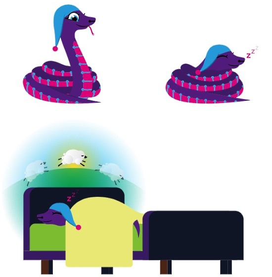](https://www.youtube.com/watch?v=m0XAT8V37-g&feature=youtu.be)

Low power capability in CircuitPython has come in the form of low power modes for the ESP32-S2 chip. Other chips will be following shortly, if they are hardware capable. The details are in [Pull Request #3767](https://github.com/adafruit/circuitpython/pull/3767) merged last week into the nighly builds of CircuitPython for the ESP32-S2. While normally the recommendation would be to use CircuitPython 6.1.0-beta.2, the "Absolute Newest" on S3, an available option, is recommended for ESP32-S2 boards. 

[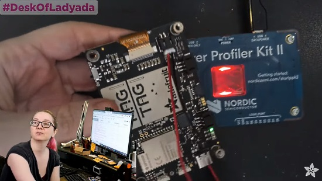](https://www.youtube.com/watch?v=m0XAT8V37-g&feature=youtu.be)

Sunday, the DESK OF LADYADA went over Deep Sleep testing for ESP32-S2 and the new ESP32-S2FH4 chip! See how the new Nordic Power Profiler Kit II helps determine the power draw on sleeping boards - [YouTube](https://www.youtube.com/watch?v=m0XAT8V37-g&feature=youtu.be)

## Another Adafruit Discord milestone: 26,000+ members

A new milestone: the Adafruit Discord community, where we do all our CircuitPython development in the open, reached over 26,000 humans, thank you! Adafruit believes Discord offers a unique way for CircuitPython folks to connect. Join today at [https://adafru.it/discord](https://adafru.it/discord).

## PyCon US 2021 Announced

PyCon US, the annual official annual Python gathering, has been announced to be held online, virtually, in 2021.

> Planning PyCon US has taken us to a whole new world of virtual options. Our staff and volunteers are working hard to bring you a great event for you to enjoy. As well as multiple days of informative talks and tutorials and exciting news from our sponsors, you’ll have ways to join in on open space conversations or a hallway track, and maybe even a virtual 5K run. This can all be done from the comfort of your favorite chair – with the exception of the 5K!

The conference will be held on the same dates originally scheduled, May 12-15, 2021. Sprints will be held May 16-18, 2021 

More information and signups may be done at [https://us.pycon.org/2021/](https://us.pycon.org/2021/) - [PyCon Blog](https://pycon.blogspot.com/2020/12/announcing-pycon-us-2021.html)

## Ladyada to Keynote linux.conf.au 2021

Australia’s grassroots Free and Open Source technologies conference, linux.conf.au announced that Limor "Ladyada" Fried, electrical engineer and founder of Adafruit, will be one of their keynote speakers at linux.conf.au 2021, scheduled for January 23-25 2021 online/worldwide.

In her keynote, Limor will discuss how Python is snaking its way into hardware, Linux single board computers and more. 

The schedule and tickets are available at [lca2021.linux.org.au](https://lca2021.linux.org.au/) - [Announcement](https://lca2021.linux.org.au/news/keynote-limor-fried/).

## The 2020 State of the Octoverse (GitHub) Released

[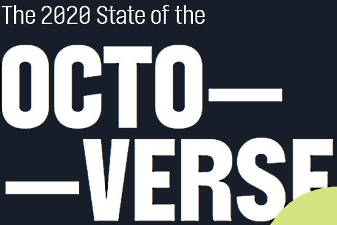](https://octoverse.github.com/)

[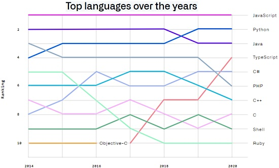](https://octoverse.github.com/)

The three 2020 State of the Octoverse reports have been released, detailing information gleaned from GitHub.

> 2020 has been a year of extraordinary change. Yet with 60M+ new repositories created this past year, one thing has remained true — developers came together from all corners of the world to innovate, find connection, and solve problems.

Some highlights:

* Python has grown to the #2 spot in languages used, uip from 4th in 2014.
* Typescript surged to #4, having been #10 in 2017.
* Developers have worked significantly more on Open Source projects since COVID-19 lockdowns in March, 2020.
* Open Source development jumps up during weekends.
* 35% more repositories created in 2020 than 2019
* 25% more contributions to open source projects.

See all three detailed reports - [GitHub](https://octoverse.github.com/).

## CircuitPython Deep Dive Stream with Scott Shawcroft

[This week](https://youtu.be/NJXvKJ0qFHQ), Scott streams his work on ESP32-S2 Sleep.

You can see the latest video and past videos on the Adafruit YouTube channel under the Deep Dive playlist - [YouTube](https://www.youtube.com/playlist?list=PLjF7R1fz_OOXBHlu9msoXq2jQN4JpCk8A).

## Adafruit Update

[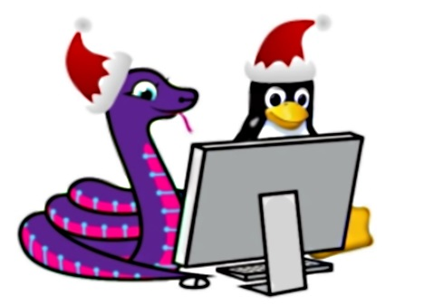](https://blog.adafruit.com/2020/05/26/adafruit-is-open-safely-and-shipping-all-orders/)

**Adafruit is shipping orders!**

Adafruit is stocked and shipping orders! Now is the best time to get orders in for your favorite products, including holiday projects and gifts - [Adafruit](https://learn.adafruit.com/).

**ACT FAST** - read about Adafruit shipping deadlines for domestic and international shipping - [Adafruit Blog](https://blog.adafruit.com/2020/12/04/adafruit-holiday-shipping-deadlines-2020-deadlines-approaching-domestic-ground-and-international/).

**[Shop Adafruit now](https://www.adafruit.com/)**

## News from around the web!

Enhancing a Nativity set with an [Adafruit Qt Py](https://www.adafruit.com/product/4600) and a [NeoPixel Ring](https://www.adafruit.com/product/1463) - [Twitter](https://twitter.com/paks/status/1335754940950720514).

[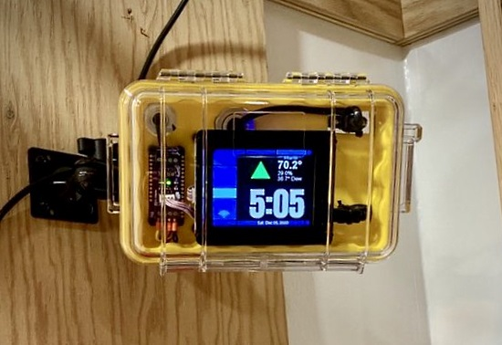](https://twitter.com/CedarGroveMakr/status/1335440144376074241)

Wrapped-up Adafruit PyPortal-based workshop corrosion monitor. Uses CircuitPython, Adafruit IO, and a custom Oshpark PCB. Already thinking about upgrading to a [MagTag](https://www.adafruit.com/product/4800) - [Twitter](https://twitter.com/CedarGroveMakr/status/1335440144376074241)

Yuri 3 is a Mars rover robot. It is powered by a Raspberry Pi and uses an [Adafruit PWM board](https://www.adafruit.com/product/815), programmed in Python - [Twitter](https://twitter.com/Yuri_3_Rover)

[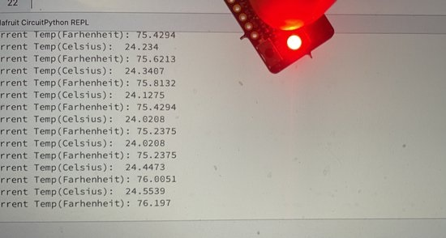](https://twitter.com/oakdevtech/status/1335286060100808712)

A tutorial on using the Oak Dev Tech CP Sapling + CircuitPython to make a low cost temperature sensor - [oakdev.tech](https://www.oakdev.tech/tutorials-new-products/tutorial-slow-tech-temperature-sensor-and-indication-using-the-cp-sapling#/) and [Twitter](https://twitter.com/oakdevtech/status/1335286060100808712).

Using analog panel meters and PWM using CircuitPython on the [Adafruit QT Py](https://www.adafruit.com/product/4600) - [Twitter](https://twitter.com/jfurcean/status/1333970060440956930).

Making a 3D scanner using a Raspberry Pi programmed in Python and Flask, controlling cameras, motors, and lasers via touchscreen and remote Web interface - [Twitter](https://twitter.com/LewisWorkshop/status/1335704774839296000).

[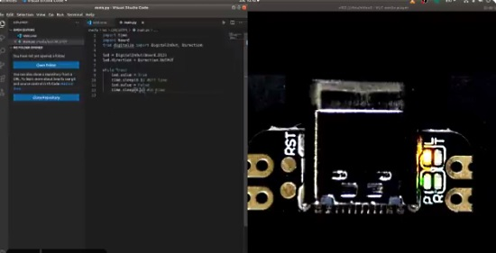](https://twitter.com/biglesp/status/1335174017888772097)

Messing around with a Raspberry Pi Zero powered microscope, OBS, Seeedstudio Xiao, CircuitPython and Visual Studio Code - [Twitter Thread](https://twitter.com/biglesp/status/1335174017888772097)

An automated music project using two Adafruit PWM Hats and a lot of Python code - [Twitter](https://twitter.com/MakeAugusta/status/1335755621241647106).

[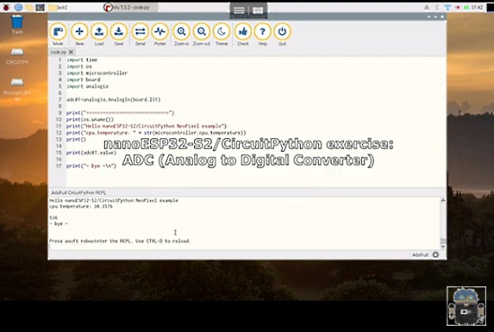](https://twitter.com/rpiiconnect/status/1335705550630211584)

Nano ESP32-S2 CircuitPython ADC (Analog to Digital Converter) - [YouTube](https://www.youtube.com/watch?v=eLd_xi6TW5E&feature=youtu.be) and [Twitter](https://twitter.com/rpiiconnect/status/1335705550630211584)

[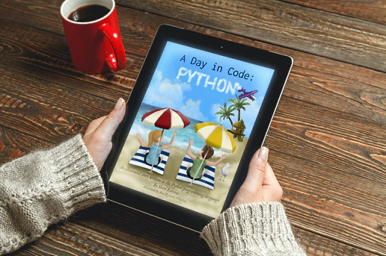](https://www.kickstarter.com/projects/914595512/a-day-in-code-python)

*A Day in Code: Python* is a picture book written in code. It's an illustrated story written in the Python programming language - [Kickstarter](https://www.kickstarter.com/projects/914595512/a-day-in-code-python).

[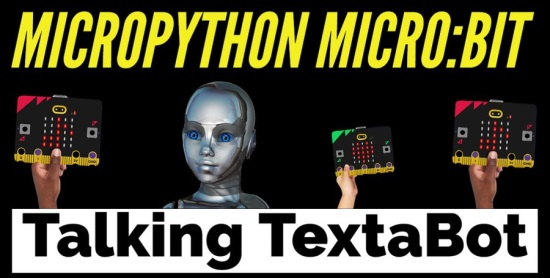](https://twitter.com/mytechnotalent/status/1335626172722450433)

MicroPython micro:bit V2 Talking TextaBot - [GitHub](https://twitter.com/mytechnotalent/status/1335626172722450433).

[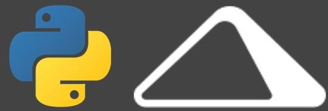](https://www.fullstackpython.com/blog/accurate-twilio-voice-call-recording-transcriptions-assemblyai.html)

Higher accuracy Twilio voice transcriptions with Python and Flask - [Full Stack Python](https://www.fullstackpython.com/blog/accurate-twilio-voice-call-recording-transcriptions-assemblyai.html) and [Twitter](https://twitter.com/QS2Point/status/1334657680040992782).

[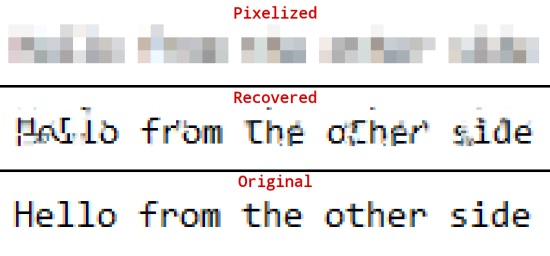](https://github.com/beurtschipper/Depix)

Depix: a tool for recovering passwords from pixelized screenshots, written in Python - [GitHub](https://github.com/beurtschipper/Depix), [LinkedIn article](https://www.linkedin.com/pulse/recovering-passwords-from-pixelized-screenshots-sipke-mellema/)  and [Twitter](https://twitter.com/spibblez/status/1335638633970348032).

Resizing images in Python with pillow - [chebe blog](https://chebe.dreamwidth.org/124559.html).

How to Use `sorted()` and `sort()` in Python - [Real Python](https://realpython.com/python-sort/).

Unravelling `not` in Python - [snarky.ca](https://snarky.ca/unravelling-not-in-python/).

[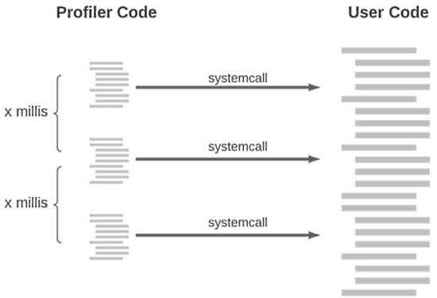](https://medium.com/better-programming/a-comprehensive-guide-to-profiling-python-programs-f8b7db772e6)

A Comprehensive Guide to Profiling Python Programs: understanding what parts of your code are problematic - [Better Programming](https://medium.com/better-programming/a-comprehensive-guide-to-profiling-python-programs-f8b7db772e6).

How to test your AWS code using Moto and Pytest - [Learn AWS](https://www.learnaws.org/2020/12/01/test-aws-code/).

#ICYDNCI What was the most popular, most clicked link, in [last week's newsletter](https://www.adafruitdaily.com/2020/12/01/python-on-microcontrollers-newsletter-esp32-s2-low-power-guis-and-more-python-adafruit-circuitpython-micropython-thepsf/)? [What is guizero](https://lawsie.github.io/guizero/about/).

## Coming soon

[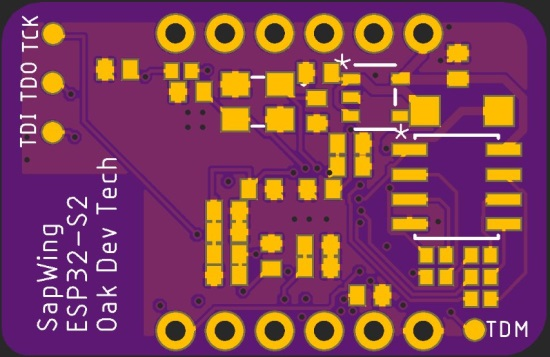](https://twitter.com/oakdevtech/status/1335702182889451522)

Oak Dev Tech is developing the SapWing, a tiny ESP32-S2 board - [Twitter](https://twitter.com/oakdevtech/status/1335702182889451522)

text - [site](url)

## New Boards Supported by CircuitPython

The number of supported microcontrollers and Single Board Computers (SBC) grows every week. This section outlines which boards have been included in CircuitPython or added to [CircuitPython.org](https://circuitpython.org/).

This week we had X new boards added!

- [Board name](url)

Looking for adding a new board to CircuitPython? It's highly encouraged! Adafruit has four guides to help you do so:

- [How to Add a New Board to CircuitPython](https://learn.adafruit.com/how-to-add-a-new-board-to-circuitpython/overview)
- [How to add a New Board to the circuitpython.org website](https://learn.adafruit.com/how-to-add-a-new-board-to-the-circuitpython-org-website)
- [Adding a Single Board Computer to PlatformDetect for Blinka](https://learn.adafruit.com/adding-a-single-board-computer-to-platformdetect-for-blinka)
- [Adding a Single Board Computer to Blinka](https://learn.adafruit.com/adding-a-single-board-computer-to-blinka)

## New Learn Guides!

[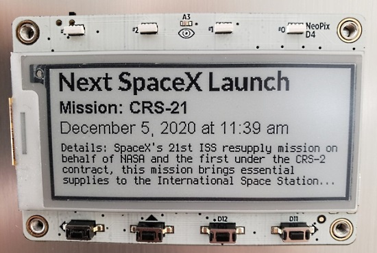](https://learn.adafruit.com/)

[SpaceX Next Launch Display with Adafruit MagTag](https://learn.adafruit.com/spacex-next-launch-display-with-adafruit-magtag) from [AnneBarela](https://learn.adafruit.com/users/AnneBarela)

[NextBus Transit Predictions for Adafruit MagTag](https://learn.adafruit.com/nextbus-transit-predictions-for-adafruit-magtag) from [Phil Burgess](https://learn.adafruit.com/users/pburgess)

[Raspberry Pi Pedal for Youtube](https://learn.adafruit.com/raspberry-pi-pedal-for-youtube) from [Jeff Epler](https://learn.adafruit.com/users/jepler)

[MagTag Progress Displays](https://learn.adafruit.com/magtag-progress-displays) from [Tim C](https://learn.adafruit.com/users/Foamyguy)

[CircuitPython Animated Holiday Wreath Lights](https://learn.adafruit.com/circuitpython-animated-holiday-wreath-lights) from [Kattni](https://learn.adafruit.com/users/kattni)

[Adafruit TMP117 High Accuracy I2C Temperature Monitor](https://learn.adafruit.com/adafruit-tmp117-high-accuracy-i2c-temperature-monitor) from [Bryan Siepert](https://learn.adafruit.com/users/siddacious)

## CircuitPython Libraries!

CircuitPython support for hardware continues to grow. We are adding support for new sensors and breakouts all the time, as well as improving on the drivers we already have. As we add more libraries and update current ones, you can keep up with all the changes right here!

For the latest libraries, download the [Adafruit CircuitPython Library Bundle](https://circuitpython.org/libraries). For the latest community contributed libraries, download the [CircuitPython Community Bundle](https://github.com/adafruit/CircuitPython_Community_Bundle/releases).

If you'd like to contribute, CircuitPython libraries are a great place to start. Have an idea for a new driver? File an issue on [CircuitPython](https://github.com/adafruit/circuitpython/issues)! Have you written a library you'd like to make available? Submit it to the [CircuitPython Community Bundle](https://github.com/adafruit/CircuitPython_Community_Bundle). Interested in helping with current libraries? Check out the [CircuitPython.org Contributing page](https://circuitpython.org/contributing). We've included open pull requests and issues from the libraries, and details about repo-level issues that need to be addressed. We have a guide on [contributing to CircuitPython with Git and Github](https://learn.adafruit.com/contribute-to-circuitpython-with-git-and-github) if you need help getting started. You can also find us in the #circuitpython channel on the [Adafruit Discord](https://adafru.it/discord).

You can check out this [list of all the Adafruit CircuitPython libraries and drivers available](https://github.com/adafruit/Adafruit_CircuitPython_Bundle/blob/master/circuitpython_library_list.md). 

The current number of CircuitPython libraries is **283**!

**New Libraries!**

Here's this week's new CircuitPython libraries:

 * [Adafruit_CircuitPython_MLX90395](https://github.com/adafruit/Adafruit_CircuitPython_MLX90395)

**Updated Libraries!**

Here's this week's updated CircuitPython libraries:

 * [Adafruit_CircuitPython_WS2801](https://github.com/adafruit/Adafruit_CircuitPython_WS2801)
 * [Adafruit_CircuitPython_EMC2101](https://github.com/adafruit/Adafruit_CircuitPython_EMC2101)
 * [Adafruit_CircuitPython_BME680](https://github.com/adafruit/Adafruit_CircuitPython_BME680)
 * [Adafruit_CircuitPython_BME280](https://github.com/adafruit/Adafruit_CircuitPython_BME280)
 * [Adafruit_CircuitPython_Requests](https://github.com/adafruit/Adafruit_CircuitPython_Requests)
 * [Adafruit_CircuitPython_FONA](https://github.com/adafruit/Adafruit_CircuitPython_FONA)
 * [Adafruit_CircuitPython_AWS_IOT](https://github.com/adafruit/Adafruit_CircuitPython_AWS_IOT)
 * [Adafruit_CircuitPython_LED_Animation](https://github.com/adafruit/Adafruit_CircuitPython_LED_Animation)
 * [Adafruit_Python_PlatformDetect](https://github.com/adafruit/Adafruit_Python_PlatformDetect)
 * [Adafruit_Blinka_PyPortal](https://github.com/adafruit/Adafruit_Blinka_PyPortal)
 * [CircuitPython_Community_Bundle](https://github.com/adafruit/CircuitPython_Community_Bundle)

## What’s the team up to this week?

What is the team up to this week? Let’s check in!

**Bryan**

This week I finished the CircuitPython library for the MLX90395, the 3-Axis magnetometer I mentioned last week. I continue to be mildly obsessed with this sensor as well as the TLV493 and other chips that use advanced magnetic sensing to unlock new methods of solving old and new problems.

I must have magnets on the brain as I recently saw a perfect application for these types of sensors: A [video](https://www.youtube.com/watch?v=5B1H5syp4PM) by [Tom Stanton](https://www.youtube.com/channel/UC67gfx2Fg7K2NSHqoENVgwA), an engineer on YouTube, about a [diaphragm based air powered engine](https://www.youtube.com/watch?v=5B1H5syp4PM). In the video he builds a small engine to power a model airplane, but that uses compressed air to power the planes flight, just like an Air Hog. 

Tom was presented with the problem of synchronizing the release of air pressure on the diaphragm with the rotation of the crankshaft without compromising the diaphragm's air seal. Tom, [being a talented engineer](https://www.youtube.com/watch?v=RVT5i4nhIGs), proceeded to engineer his way out of the problem by designing a mechanically timed valve system with seals to prevent air leaks. But what if he could access the crank's position without needing a physical connection to the crank? I'd be interested to see what it would do to the design to replace his valve with a servo-actuated valve to release the diaphragm pressure, as well as a magnet on the crank and magnetic sensor nearby.

I believe this would simplify the design by keeping the diaphragm value and crank sensor physically separate, and avoiding using one mechanism to sense the position of the crank as well as release the diaphragm pressure. As I write this however, I realize that my proposed "improvement" would require the addition of a battery to power both the diaphragm valve and crank sensing circuitry. Tom has used hall-effect sensors in another video https://www.youtube.com/watch?v=SgqflcHBTwc so he certainly knows how to use them, so I'm willing to bet that keeping the design entirely mechanical and air powered was a design goal from the beginning.

**Dan**

I finished the initial version of deep (and light) sleep in CircuitPython, and it's now merged into the main line in the CircuitPython repo. The API went through a few more revisions over the past week. By the time you read this, CircuitPython 6.1.0-beta.2 will have been released, and will include deep sleep. For now, sleep is only implemented on the ESP32-S2.

Thanks to Scott and @microDev1 for the initial work on deep sleep!

**Jeff**

This week I published a project guide showing how to control youtube playback on a Raspberry Pi based on readings from a Bluetooth BLE cadence sensor on a stationary bike. Check out the guide: [Raspberry Pi Pedal for Youtube](https://learn.adafruit.com/raspberry-pi-pedal-for-youtube).

**Kattni**

This week I published the [CircuitPython Animated Holiday Wreath Lights](https://learn.adafruit.com/circuitpython-animated-holiday-wreath-lights/) guide. This is a holiday themed Adafruit MagTag project involving a NeoPixel strip and LED animations. This build was similar to a previous project I did using a Circuit Playground Bluefruit, (and even uses the same wreath!) but this time the project is controlled by the MagTag. There are three holiday colored LED animations, each activated by a button. It has a lovely set of instructions on the display showing what animation each of the buttons activates. If you're looking for a quick, easy project to do with your MagTag, check out this guide.

I also began working on a guide that is a new take on Cheerlights. Cheerlights is a project that allows folks to tweet a color, to enable LED projects all over the world to sync to that color. I took it one step further, and instead of simply syncing to that color, the project instead displays a different LED animation in the specified color. It uses the same build as the guide I published this week, and turns Cheerlights into animated holiday fun. Keep an eye out next week for that guide!

**Lucian**

This past week I've been working on PWMOut for the i.MX RT series. It's been a while since I worked with the toolchains and boards involved, so spinning back up has been a work in progress. I'll hopefully have more updates on new i.MX features in the coming weeks. 

I also spent some time on implementing the DMA peripheral on the STM32 boards as a side project, but unfortunately had little success. DMA (Direct Memory Access) ranges from beneficial to essential for higher performance projects on the STM32s, but it has been fiddly in practice to get working with other peripherals like SPI, outputting mostly garbage data. I'll be putting it down for now to cool my head but will hopefully revisit at a future date.

**Melissa**

This past week I finished up the Web Serial ESPTool. I got file writing working on the ESP32 and then added ESP32-S2 support as well. I was able to get it writing in pure JavaScript by using a FileReader class which returns the raw bytes of the file. Once I got uploading working consistently, I cleaned up the UI elements to make it match the existing design and only show the controls once it has connected as well as disabling certain controls while the file is being written. It was a fun project and I feel like I learned a lot more about Web Serial. If you're interested in checking it out, you can take a look at [https://adafruit-esptool.glitch.me/](https://adafruit-esptool.glitch.me/).

**Scott**

This last week I've made a number of small fixes to CircuitPython on the ESP32-S2 with the goal of improving stability and fixing network issues. It was a short week due to Thanksgiving.

I've switched gears and am now refining deep sleep under the hood. Deep sleep will usually stop a USB connection. So, if your code deep sleeps when USB is connected, we'll pretend to deep sleep instead. This allows you to watch what happens over the serial connection and also iterate quickly on your code. I'm refining things under the hood to ensure that our pretending works more similar to a real deep sleep.

## Upcoming events!

PyCode Conference is devoted to the latest trends in the Python language and community, held online December 11-12, 2020 - [PyCode](https://pycode-conference.org/).

Virtual Girls Into Coding #6, December 13th: a free event for girls ages 10-14 to explore online coding activities, online robotics, 3D Design, electronics, and physical computing using the BBC micro:bit. This is a fantastic opportunity to use Python (text-based language) and to get some hands-on making time from the comfort of your home - [Eventbright](https://www.eventbrite.co.uk/e/virtual-girls-into-coding-6-join-us-get-involved-tickets-129147061337).

Australia’s grassroots Free and Open Source technologies conference linux.conf.au is scheduled for January 23-25 2021 online/worldwide. Limor "Ladyada" Fried, electrical engineer and founder of Adafruit, will be one of their keynote speakers. In her keynote, Limor will discuss how Python is snaking its way into hardware, Linux single board computers and more. 

The schedule and tickets are available at [lca2021.linux.org.au](https://lca2021.linux.org.au/) - [Announcement](https://lca2021.linux.org.au/news/keynote-limor-fried/).

The 2021 Open Hardware summit will be held online, Friday April 9, 2021. The summit will be livestreamed, but ticket holders will have access to additional interactive portions of the summit like meet-and-greets, workshops, and sponsor booths. Find details, including ticket and sponsorship information at [2021.oshwa.org](https://2021.oshwa.org/) - [OSHWA](https://www.oshwa.org/2020/11/16/announcing-the-2021-open-hardware-summit/).

PyCon US, the annual official annual Python gathering, has been announced to be held online May 12-15, 2021. Sprints will be held May 16-18, 2021. More information and signups at [https://us.pycon.org/2021/](https://us.pycon.org/2021/)

**Send Your Events In**

As for other events, with the COVID pandemic, most in-person events are postponed or cancelled. If you know of virtual events or events that may occur in the future, please let us know on Discord or on Twitter with hashtag #CircuitPython.

## Latest releases

CircuitPython's stable release is [#.#.#](https://github.com/adafruit/circuitpython/releases/latest) and its unstable release is [#.#.#-##.#](https://github.com/adafruit/circuitpython/releases). New to CircuitPython? Start with our [Welcome to CircuitPython Guide](https://learn.adafruit.com/welcome-to-circuitpython).

[2020####](https://github.com/adafruit/Adafruit_CircuitPython_Bundle/releases/latest) is the latest CircuitPython library bundle.

[v#.#.#](https://micropython.org/download) is the latest MicroPython release. Documentation for it is [here](http://docs.micropython.org/en/latest/pyboard/).

[#.#.#](https://www.python.org/downloads/) is the latest Python release. The latest pre-release version is [#.#.#](https://www.python.org/download/pre-releases/).

[1918 Stars](https://github.com/adafruit/circuitpython/stargazers) Like CircuitPython? [Star it on GitHub!](https://github.com/adafruit/circuitpython)

## Call for help -- Translating CircuitPython is now easier than ever!

[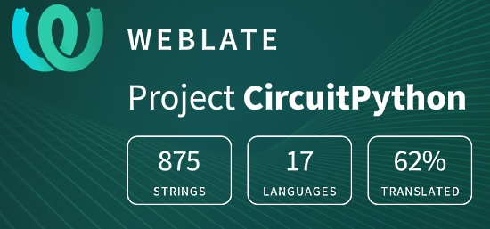](https://hosted.weblate.org/engage/circuitpython/)

One important feature of CircuitPython is translated control and error messages.

With the help of fellow open source project [Weblate](https://weblate.org/), we're making it even easier to add or improve translations.

Sign in with an existing account such as Github, Google or Facebook and start contributing through a simple web interface. No forks or pull requests needed!

As always, if you run into trouble join us on [Discord](https://adafru.it/discord), we're here to help.

## jobs.adafruit.com - Find a dream job, find great candidates!

[jobs.adafruit.com](https://jobs.adafruit.com/) has returned and folks are posting their skills (including CircuitPython) and companies are looking for talented makers to join their companies - from Digi-Key, to Hackaday, Microcenter, Raspberry Pi and more.

**Job of the Week**

text - [Adafruit Jobs Board](https://jobs.adafruit.com/).

## ICYMI - In case you missed it

[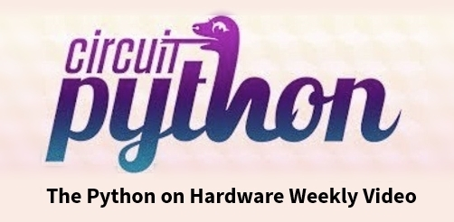](https://www.youtube.com/playlist?list=PLjF7R1fz_OOXRMjM7Sm0J2Xt6H81TdDev)

The wonderful world of Python on hardware! This is our Python video-newsletter-podcast! The news comes from the Python community, Discord, Adafruit communities and more and is reviewed on ASK an ENGINEER Wednesdays. The complete Python on Hardware weekly videocast [playlist is here](https://www.youtube.com/playlist?list=PLjF7R1fz_OOXRMjM7Sm0J2Xt6H81TdDev). 

This video podcast is on [iTunes](https://itunes.apple.com/us/podcast/python-on-hardware/id1451685192?mt=2), [YouTube](http://adafru.it/pohepisodes), [IGTV (Instagram TV](https://www.instagram.com/adafruit/channel/)), and [XML](https://itunes.apple.com/us/podcast/python-on-hardware/id1451685192?mt=2).

[Weekly community chat on Adafruit Discord server CircuitPython channel - Audio / Podcast edition](https://itunes.apple.com/us/podcast/circuitpython-weekly-meeting/id1451685016) - Audio from the Discord chat space for CircuitPython, meetings are usually Mondays at 2pm ET, this is the audio version on [iTunes](https://itunes.apple.com/us/podcast/circuitpython-weekly-meeting/id1451685016), Pocket Casts, [Spotify](https://adafru.it/spotify), and [XML feed](https://adafruit-podcasts.s3.amazonaws.com/circuitpython_weekly_meeting/audio-podcast.xml).

And lastly, we are working up a one-spot destination for all things podcast-able here - [podcasts.adafruit.com](https://podcasts.adafruit.com/)

## Codecademy "Learn Hardware Programming with CircuitPython"

Codecademy, an online interactive learning platform used by more than 45 million people, has teamed up with the leading manufacturer in STEAM electronics, Adafruit Industries, to create a coding course, "Learn Hardware Programming with CircuitPython". The course is now available in the [Codecademy catalog](https://www.codecademy.com/learn/learn-circuitpython?utm_source=adafruit&utm_medium=partners&utm_campaign=circuitplayground&utm_content=pythononhardwarenewsletter).

Python is a highly versatile, easy to learn programming language that a wide range of people, from visual effects artists in Hollywood to mission control at NASA, use to quickly solve problems. But you don’t need to be a rocket scientist to accomplish amazing things with it. This new course introduces programmers to Python by way of a microcontroller — CircuitPython — which is a Python-based programming language optimized for use on hardware.

CircuitPython’s hardware-ready design makes it easier than ever to program a variety of single-board computers, and this course gets you from no experience to working prototype faster than ever before. Codecademy’s interactive learning environment, combined with Adafruit's highly rated Circuit Playground Express, present aspiring hardware hackers with a never-before-seen opportunity to learn hardware programming seamlessly online.

Whether for those who are new to programming, or for those who want to expand their skill set to include physical computing, this course will have students getting familiar with Python and creating incredible projects along the way. By the end, students will have built their own bike lights, drum machine, and even a moisture detector that can tell when it's time to water a plant.

Visit Codecademy to access the [Learn Hardware Programming with CircuitPython](https://www.codecademy.com/learn/learn-circuitpython?utm_source=adafruit&utm_medium=partners&utm_campaign=circuitplayground&utm_content=pythononhardwarenewsletter) course and Adafruit to purchase a [Circuit Playground Express](https://www.adafruit.com/product/3333).

Codecademy has helped more than 45 million people around the world upgrade their careers with technology skills. The company’s online interactive learning platform is widely recognized for providing an accessible, flexible, and engaging experience for beginners and experienced programmers alike. Codecademy has raised a total of $43 million from investors including Union Square Ventures, Kleiner Perkins, Index Ventures, Thrive Capital, Naspers, Yuri Milner and Richard Branson, most recently raising its $30 million Series C in July 2016.

## Contribute!

The CircuitPython Weekly Newsletter is a CircuitPython community-run newsletter emailed every Tuesday. The complete [archives are here](https://www.adafruitdaily.com/category/circuitpython/). It highlights the latest CircuitPython related news from around the web including Python and MicroPython developments. To contribute, edit next week's draft [on GitHub](https://github.com/adafruit/circuitpython-weekly-newsletter/tree/gh-pages/_drafts) and [submit a pull request](https://help.github.com/articles/editing-files-in-your-repository/) with the changes. You may also tag your information on Twitter with #CircuitPython. 

Join our [Discord](https://adafru.it/discord) or [post to the forum](https://forums.adafruit.com/viewforum.php?f=60) for any further questions.
