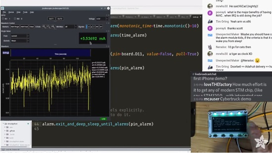
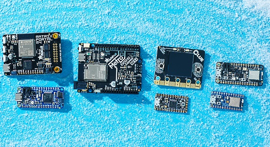
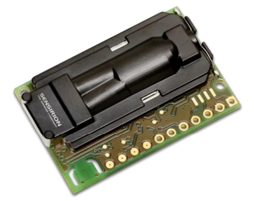
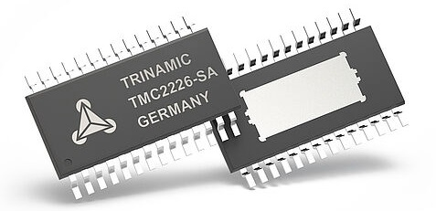
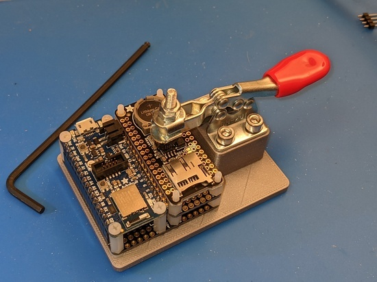
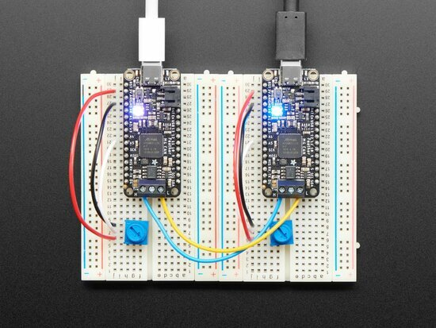
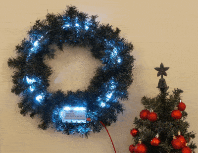

- [X] Kattni updates
- [ ] change date
- [ ] update title
- [ ] Feature story
- [ ] Update  for images
- [ ] Update ICYDNCI
- [ ] All images 550w max only
- [ ] Link "View this email in your browser."

News Sources

- [python.org](https://www.python.org/)
- [Python Insider - dev team blog](https://pythoninsider.blogspot.com/)

View this email in your browser.

Hi everyone! It's the latest Python for Microcontrollers newsletter, brought you by the community! We're on [Discord](https://discord.gg/HYqvREz), [Twitter](https://twitter.com/search?q=circuitpython&src=typed_query&f=live), and for past newsletters - [view them all here](https://www.adafruitdaily.com/category/circuitpython/). If you're reading this on the web, [subscribe here](https://www.adafruitdaily.com/). Let's get started!

## Sony Publishes a Guide to CircuitPython on their Spresense Board

Sony has just released a brand new [getting started guide](https://developer.sony.com/develop/spresense/docs/circuitpython_set_up_en.html) to help developers program their Spresense microcontroller board with CircuitPython.

> Python developers will feel familiar with the way to program Spresense. After the initial set-up for Spresense, there is no need for any extra desktop development environment tools. Use your favorite text editor to start developing. The brand new getting started guide helps set up Spresense for CircuitPython in a matter of minutes in a step-by-step fashion. All CircuitPython libraries have example code to help you kick-start your programming.

Sony plans to continue expanding the guide with tutorials featuring unique Spresense features and capabilities when using CircuitPython. You can get Spresense updates via [Sony’s Developer World on Twitter](https://twitter.com/SonyDevWorld) - [Sony Blog](https://developer.sony.com/posts/circuitpython-is-now-available-for-spresense/), [Guide](https://developer.sony.com/develop/spresense/docs/circuitpython_set_up_en.html), and [Developer Site](https://developer.sony.com/develop/spresense).

## Feature

text - [site](url)

## CircuitPython Deep Dive Stream with Scott Shawcroft

[This week](link), Scott streams his work on .

You can see the latest video and past videos on the Adafruit YouTube channel under the Deep Dive playlist - [YouTube](https://www.youtube.com/playlist?list=PLjF7R1fz_OOXBHlu9msoXq2jQN4JpCk8A).

## Adafruit Update

**Adafruit is shipping orders!**

Adafruit is stocked and shipping orders! Now is the best time to get orders in for your favorite products, including holiday projects and gifts - [Adafruit](https://learn.adafruit.com/).

Adafruit is currently offering a one-time use discount code of 20% off after adding two factor authentication (2FA) to ones Adafruit account. The code may be used until November 26, 2020. See [this guide](https://learn.adafruit.com/secure-your-account-and-unlock-20-off?view=all) for details.

**[Shop Adafruit now](https://www.adafruit.com/)**

## News from around the web!

text - [site](url).

text - [site](url).

text - [site](url).

text - [site](url).

text - [site](url).

text - [site](url).

text - [site](url).

text - [site](url).

Watching this guy live code Frogger in Python is a great way to learn the language - [Bong Boing](5https://boingboing.net/2020/12/09/watching-this-guy-live-code-frogger-in-python-is-a-great-way-to-learn-the-language.html), YouTube [Part One](https://youtu.be/CDM4U5A7BX8) and [Part Two](https://youtu.be/ShZEdQYRNy4).

text - [site](url).

**#ICYDNCI What was the most popular, most clicked link, in [last week's newsletter](https://link)? [title](url).**

## Coming soon

text - [site](url)

## New Boards Supported by CircuitPython

The number of supported microcontrollers and Single Board Computers (SBC) grows every week. This section outlines which boards have been included in CircuitPython or added to [CircuitPython.org](https://circuitpython.org/).

This week we had X new boards added!

- [Board name](url)

Looking for adding a new board to CircuitPython? It's highly encouraged! Adafruit has four guides to help you do so:

- [How to Add a New Board to CircuitPython](https://learn.adafruit.com/how-to-add-a-new-board-to-circuitpython/overview)
- [How to add a New Board to the circuitpython.org website](https://learn.adafruit.com/how-to-add-a-new-board-to-the-circuitpython-org-website)
- [Adding a Single Board Computer to PlatformDetect for Blinka](https://learn.adafruit.com/adding-a-single-board-computer-to-platformdetect-for-blinka)
- [Adding a Single Board Computer to Blinka](https://learn.adafruit.com/adding-a-single-board-computer-to-blinka)

## New Learn Guides!

[MagTag Tides Viewer](https://learn.adafruit.com/magtag-tides-viewer) from [Carter Nelson](https://learn.adafruit.com/users/caternuson)

[MagTag Showerthoughts and Quotes](https://learn.adafruit.com/magtag-showerthoughts) from [John Park](https://learn.adafruit.com/users/johnpark)

[Cheerlights Holiday Wreath with Animations](https://learn.adafruit.com/cheerlights-led-animations) from [Kattni](https://learn.adafruit.com/users/kattni)

[What’s Fresh Today? In-Season Produce Reminder for Adafruit MagTag](https://learn.adafruit.com/seasonal-produce-for-adafruit-magtag) from [Phil Burgess](https://learn.adafruit.com/users/pburgess)

[MagTag Daily Christmas Countdown](https://learn.adafruit.com/magtag-daily-christmas-countdown) from [Noe and Pedro](https://learn.adafruit.com/users/pixil3d)

## CircuitPython Libraries!

CircuitPython support for hardware continues to grow. We are adding support for new sensors and breakouts all the time, as well as improving on the drivers we already have. As we add more libraries and update current ones, you can keep up with all the changes right here!

For the latest libraries, download the [Adafruit CircuitPython Library Bundle](https://circuitpython.org/libraries). For the latest community contributed libraries, download the [CircuitPython Community Bundle](https://github.com/adafruit/CircuitPython_Community_Bundle/releases).

If you'd like to contribute, CircuitPython libraries are a great place to start. Have an idea for a new driver? File an issue on [CircuitPython](https://github.com/adafruit/circuitpython/issues)! Have you written a library you'd like to make available? Submit it to the [CircuitPython Community Bundle](https://github.com/adafruit/CircuitPython_Community_Bundle). Interested in helping with current libraries? Check out the [CircuitPython.org Contributing page](https://circuitpython.org/contributing). We've included open pull requests and issues from the libraries, and details about repo-level issues that need to be addressed. We have a guide on [contributing to CircuitPython with Git and Github](https://learn.adafruit.com/contribute-to-circuitpython-with-git-and-github) if you need help getting started. You can also find us in the #circuitpython channel on the [Adafruit Discord](https://adafru.it/discord).

You can check out this [list of all the Adafruit CircuitPython libraries and drivers available](https://github.com/adafruit/Adafruit_CircuitPython_Bundle/blob/master/circuitpython_library_list.md). 

The current number of CircuitPython libraries is **286**!

**New Libraries!**

Here's this week's new CircuitPython libraries:

 * [Adafruit_CircuitPython_FakeRequests](https://github.com/adafruit/Adafruit_CircuitPython_FakeRequests)
 * [Adafruit_CircuitPython_PortalBase](https://github.com/adafruit/Adafruit_CircuitPython_PortalBase)
 * [Adafruit_CircuitPython_SCD30](https://github.com/adafruit/Adafruit_CircuitPython_SCD30)

**Updated Libraries!**

Here's this week's updated CircuitPython libraries:

 * [Adafruit_CircuitPython_MatrixPortal](https://github.com/adafruit/Adafruit_CircuitPython_MatrixPortal)
 * [Adafruit_CircuitPython_SSD1306](https://github.com/adafruit/Adafruit_CircuitPython_SSD1306)
 * [Adafruit_CircuitPython_Display_Text](https://github.com/adafruit/Adafruit_CircuitPython_Display_Text)
 * [Adafruit_CircuitPython_SI7021](https://github.com/adafruit/Adafruit_CircuitPython_SI7021)
 * [Adafruit_CircuitPython_MagTag](https://github.com/adafruit/Adafruit_CircuitPython_MagTag)
 * [Adafruit_CircuitPython_Bitmap_Font](https://github.com/adafruit/Adafruit_CircuitPython_Bitmap_Font)
 * [Adafruit_CircuitPython_BMP3XX](https://github.com/adafruit/Adafruit_CircuitPython_BMP3XX)
 * [Adafruit_Blinka](https://github.com/adafruit/Adafruit_Blinka)
 * [Adafruit_Blinka_Displayio](https://github.com/adafruit/Adafruit_Blinka_Displayio)
 * [Adafruit_Python_PlatformDetect](https://github.com/adafruit/Adafruit_Python_PlatformDetect)
 * [Adafruit_Python_PureIO](https://github.com/adafruit/Adafruit_Python_PureIO)
 * [Adafruit_Blinka_PyPortal](https://github.com/adafruit/Adafruit_Blinka_PyPortal)
 * [Adafruit_Python_Extended_Bus](https://github.com/adafruit/Adafruit_Python_Extended_Bus)
 * [CircuitPython_Community_Bundle](https://github.com/adafruit/CircuitPython_Community_Bundle)

## What’s the team up to this week?

What is the team up to this week? Let’s check in!

**Bryan**

This week I've been working with the SCD30 NDIR eCO2 sensor from those fine sensing folks at Sensirion, who take their sensing very seriously. Looking at the SCD30 you can immediately tell that this is not like most other sensors, at least the ones we normally see. The NDIR I mentioned stands for "NonDispersive InfraRed" which signifies that the SCD30 uses infrared spectroscopy to measure the CO2 in its environment.

In essence, the SCD30 measures the amount of CO2 by shining IR light into the sample measurement area and measuring the amount of light within a narrow wavelength band corresponding to what is absorbed by CO2.  You've basically got a little optics lab built into a breakout! In case you were on the fence, I'm pretty sure this is confirmation that we're living in the future.

In other news, the hot tip from sources on Varick street is that nearly every sensor manufacturer just released a revision of one of their sensors in the last month or so, which means... more sensor breakouts! Expect to see some more sensors headed your way over the next month or so, and if that doesn't _move_ you, perhaps some of the boards we're eyeing for after the current batch of sensors will do that for you!

**Dan**

I am working on adding persistent memory to CircuitPython that is maintained even during deep sleep. This is not flash, which could wear out if you wrote it too often, but a special section of low-power RAM. Its contents go away if power is removed completely, but otherwise it survives through all kinds of sleep.

I am also writing an introductory guide to the new sleep and alarm capabilities.

We thought there might have been an issue with the ADC battery monitoring on the MagTag.  I did several checks, including comparing with an external ADC, and instrumenting the ADC code to check the raw values, and all that appeared to be OK. A simple change to the MagTag library fixed the problem.

**Jeff**

I've been putting the finishing touches on a guide for creating your own pogo-pin jig.

I'm also excited that the long awaited Fether M4 CAN is in the store; several months ago I wrote the code that allows this functionality to be used from CircuitPython.

**Kattni**

This week I published the [Cheerlights Holiday Wreath with Animations](https://learn.adafruit.com/cheerlights-led-animations) guide. [Cheerlights](https://cheerlights.com/about/) is an IoT project that allows folks to sync up LED colors across the world by sending a message on Twitter. I took it one step further, and instead of simply lighting up the LEDs, it displays a different LED animation for each color. This project uses the Adafruit MagTag and a NeoPixel strip - no soldering required. Whether you're familiar with Cheerlights, or new to it entirely, this project is a fun and festive way to display different LED animations.

I updated the [SGP30 guide](https://learn.adafruit.com/adafruit-sgp30-gas-tvoc-eco2-mox-sensor) to feature the new STEMMA QT version of the breakout, as well as starting the guide for the next generation, the SGP40. 

I also started the guide for the new [Feather M4 CAN Express](https://www.adafruit.com/product/4759) board. If you're looking to learn all the details about your new Feather CAN board, keep an eye out for this guide.

**Lucian**

This week I fixed a couple of bugs that popped up in the ESP32S2 port, including a memory leak that was occurring in AnalogIO and some continuing effort towards fixing the reset system for individual pins. I also helped to investigate other issues with the ESP32S2's ADC, relating to calibration behavior when measuring near the min or max voltages, which were impacting battery readings on the MagTag.

I've also been working on completing PWMOut on the i.MX. As with most of the common-hal modules that use "sets" of peripherals, a lot of it is just creating a reservation system that prevents you from picking PWM drivers on the chip that are already in use, and then testing for bugs. It's been a bit of a slog, since NXP's examples and drivers are very tied to the idea that you've designed your whole system before compiling (ST's HAL has similar limitations). But with Circuitpython, your whole program is always designed at runtime, so there's a lot of wading through enums, macros and tables in order to get things working smoothly. 

**Melissa**

This past week I worked on a couple fairly major projects. The first thing I did was create a Unified Portal library which I called PortalBase. The intention of it is to hold the common functions for the Portal libraries such as MagTag, MatrixPortal, and both PyPortal libraries. That way if we find a bug in one of them it doesn't require 4 or more fixes. I ended up writing that and also porting the MagTag library over to use it. The port went well and any scripts that use the MagTag library require no changes in order to use it. I'd like to port over the other libraries in the next couple of weeks and will hopefully get similar results.

The other major project that I worked on was adding stub loading functionality to the Web Serial ESPTool. The way that stub loading works is it takes some binary data - called stub code - and writes it into the RAM of the ESP32-S2 and then sends a command to run that stub code. Once I was able to get a good "Hello" response from the stub that was running, it became much easier. The stub code basically listens for some extended commands that are not available by default on the ESP32-S2. This allowed some additional functions such as erasing the entire flash and programming files that are larger than 2MB.

**Scott**

This week I picked up deep sleep from Dan. We got my first pull request merged that reorganized sleep internally so that it would shut everything down gracefully before sleeping. It also changed the pretend deep sleep to behave more like real deep sleep. (We pretend to deep sleep when USB data is connected so it's easy to iterate on code that deep sleeps.) Now, boards can be init and *deinit* to shut down board circuitry while asleep.

Once done with that, I jumped right into adding PinAlarm support. It allow you to sleep until the value on a pin is either high or low. This allows the code to wake on button press or interrupt from a sensor. It's more dynamic sleep than what one can do with time based alarms. I've gotten it mostly working but need to fix a few bugs before making a PR.

## Upcoming events!

Australia’s grassroots Free and Open Source technologies conference linux.conf.au is scheduled for January 23-25 2021 online/worldwide. Limor "Ladyada" Fried, electrical engineer and founder of Adafruit, will be one of their keynote speakers. In her keynote, Limor will discuss how Python is snaking its way into hardware, Linux single board computers and more. 

The schedule and tickets are available at [lca2021.linux.org.au](https://lca2021.linux.org.au/) - [Announcement](https://lca2021.linux.org.au/news/keynote-limor-fried/).

The 2021 Open Hardware summit will be held online, Friday April 9, 2021. The summit will be livestreamed, but ticket holders will have access to additional interactive portions of the summit like meet-and-greets, workshops, and sponsor booths. Find details, including ticket and sponsorship information at [2021.oshwa.org](https://2021.oshwa.org/) - [OSHWA](https://www.oshwa.org/2020/11/16/announcing-the-2021-open-hardware-summit/).

PyCon US, the annual official annual Python gathering, has been announced to be held online May 12-15, 2021. Sprints will be held May 16-18, 2021. More information and signups at [https://us.pycon.org/2021/](https://us.pycon.org/2021/)

**Send Your Events In**

As for other events, with the COVID pandemic, most in-person events are postponed or cancelled. If you know of virtual events or events that may occur in the future, please let us know on Discord or on Twitter with hashtag #CircuitPython.

## Latest releases

CircuitPython's stable release is [#.#.#](https://github.com/adafruit/circuitpython/releases/latest) and its unstable release is [#.#.#-##.#](https://github.com/adafruit/circuitpython/releases). New to CircuitPython? Start with our [Welcome to CircuitPython Guide](https://learn.adafruit.com/welcome-to-circuitpython).

[2020####](https://github.com/adafruit/Adafruit_CircuitPython_Bundle/releases/latest) is the latest CircuitPython library bundle.

[v#.#.#](https://micropython.org/download) is the latest MicroPython release. Documentation for it is [here](http://docs.micropython.org/en/latest/pyboard/).

[#.#.#](https://www.python.org/downloads/) is the latest Python release. The latest pre-release version is [#.#.#](https://www.python.org/download/pre-releases/).

[1930 Stars](https://github.com/adafruit/circuitpython/stargazers) Like CircuitPython? [Star it on GitHub!](https://github.com/adafruit/circuitpython)

## Call for help -- Translating CircuitPython is now easier than ever!

One important feature of CircuitPython is translated control and error messages.

With the help of fellow open source project [Weblate](https://weblate.org/), we're making it even easier to add or improve translations.

Sign in with an existing account such as Github, Google or Facebook and start contributing through a simple web interface. No forks or pull requests needed!

As always, if you run into trouble join us on [Discord](https://adafru.it/discord), we're here to help.

## jobs.adafruit.com - Find a dream job, find great candidates!

[jobs.adafruit.com](https://jobs.adafruit.com/) has returned and folks are posting their skills (including CircuitPython) and companies are looking for talented makers to join their companies - from Digi-Key, to Hackaday, Microcenter, Raspberry Pi and more.

**Job of the Week**

text - [Adafruit Jobs Board](https://jobs.adafruit.com/).

## NUMBER thanks!

The Adafruit Discord community, where we do all our CircuitPython development in the open, reached over NUMBER humans, thank you!  Adafruit believes Discord offers a unique way for CircuitPython folks to connect. Join today at [https://adafru.it/discord](https://adafru.it/discord).

## ICYMI - In case you missed it

The wonderful world of Python on hardware! This is our Python video-newsletter-podcast! The news comes from the Python community, Discord, Adafruit communities and more and is reviewed on ASK an ENGINEER Wednesdays. The complete Python on Hardware weekly videocast [playlist is here](https://www.youtube.com/playlist?list=PLjF7R1fz_OOXRMjM7Sm0J2Xt6H81TdDev). 

This video podcast is on [iTunes](https://itunes.apple.com/us/podcast/python-on-hardware/id1451685192?mt=2), [YouTube](http://adafru.it/pohepisodes), [IGTV (Instagram TV](https://www.instagram.com/adafruit/channel/)), and [XML](https://itunes.apple.com/us/podcast/python-on-hardware/id1451685192?mt=2).

[Weekly community chat on Adafruit Discord server CircuitPython channel - Audio / Podcast edition](https://itunes.apple.com/us/podcast/circuitpython-weekly-meeting/id1451685016) - Audio from the Discord chat space for CircuitPython, meetings are usually Mondays at 2pm ET, this is the audio version on [iTunes](https://itunes.apple.com/us/podcast/circuitpython-weekly-meeting/id1451685016), Pocket Casts, [Spotify](https://adafru.it/spotify), and [XML feed](https://adafruit-podcasts.s3.amazonaws.com/circuitpython_weekly_meeting/audio-podcast.xml).

And lastly, we are working up a one-spot destination for all things podcast-able here - [podcasts.adafruit.com](https://podcasts.adafruit.com/)

## Codecademy "Learn Hardware Programming with CircuitPython"

Codecademy, an online interactive learning platform used by more than 45 million people, has teamed up with the leading manufacturer in STEAM electronics, Adafruit Industries, to create a coding course, "Learn Hardware Programming with CircuitPython". The course is now available in the [Codecademy catalog](https://www.codecademy.com/learn/learn-circuitpython?utm_source=adafruit&utm_medium=partners&utm_campaign=circuitplayground&utm_content=pythononhardwarenewsletter).

Python is a highly versatile, easy to learn programming language that a wide range of people, from visual effects artists in Hollywood to mission control at NASA, use to quickly solve problems. But you don’t need to be a rocket scientist to accomplish amazing things with it. This new course introduces programmers to Python by way of a microcontroller — CircuitPython — which is a Python-based programming language optimized for use on hardware.

CircuitPython’s hardware-ready design makes it easier than ever to program a variety of single-board computers, and this course gets you from no experience to working prototype faster than ever before. Codecademy’s interactive learning environment, combined with Adafruit's highly rated Circuit Playground Express, present aspiring hardware hackers with a never-before-seen opportunity to learn hardware programming seamlessly online.

Whether for those who are new to programming, or for those who want to expand their skill set to include physical computing, this course will have students getting familiar with Python and creating incredible projects along the way. By the end, students will have built their own bike lights, drum machine, and even a moisture detector that can tell when it's time to water a plant.

Visit Codecademy to access the [Learn Hardware Programming with CircuitPython](https://www.codecademy.com/learn/learn-circuitpython?utm_source=adafruit&utm_medium=partners&utm_campaign=circuitplayground&utm_content=pythononhardwarenewsletter) course and Adafruit to purchase a [Circuit Playground Express](https://www.adafruit.com/product/3333).

Codecademy has helped more than 45 million people around the world upgrade their careers with technology skills. The company’s online interactive learning platform is widely recognized for providing an accessible, flexible, and engaging experience for beginners and experienced programmers alike. Codecademy has raised a total of $43 million from investors including Union Square Ventures, Kleiner Perkins, Index Ventures, Thrive Capital, Naspers, Yuri Milner and Richard Branson, most recently raising its $30 million Series C in July 2016.

## Contribute!

The CircuitPython Weekly Newsletter is a CircuitPython community-run newsletter emailed every Tuesday. The complete [archives are here](https://www.adafruitdaily.com/category/circuitpython/). It highlights the latest CircuitPython related news from around the web including Python and MicroPython developments. To contribute, edit next week's draft [on GitHub](https://github.com/adafruit/circuitpython-weekly-newsletter/tree/gh-pages/_drafts) and [submit a pull request](https://help.github.com/articles/editing-files-in-your-repository/) with the changes. You may also tag your information on Twitter with #CircuitPython. 

Join our [Discord](https://adafru.it/discord) or [post to the forum](https://forums.adafruit.com/viewforum.php?f=60) for any further questions.
