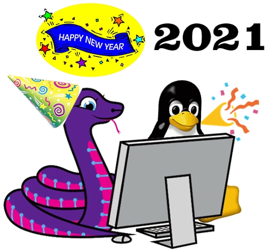
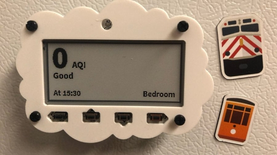
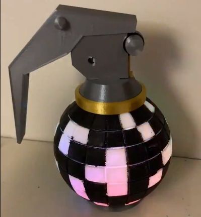
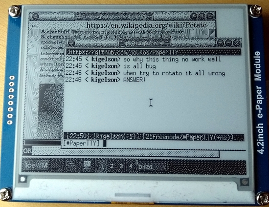
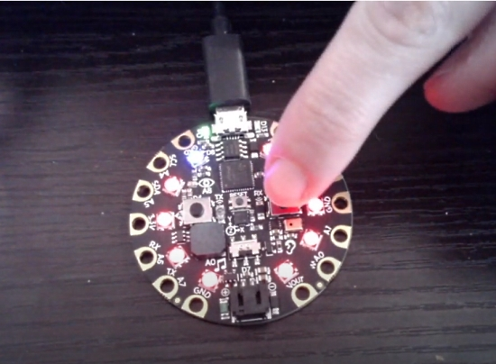
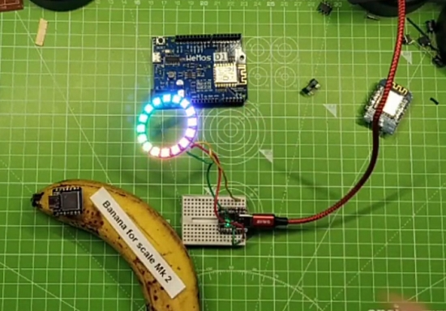
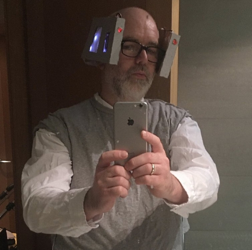
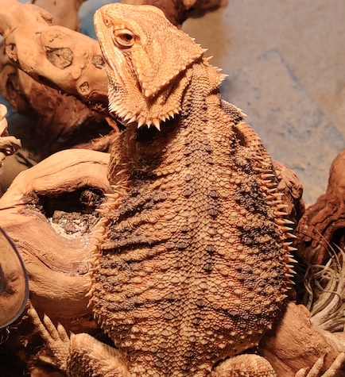

- [ ] Kattni updates
- [ ] change date
- [ ] update title
- [ ] Feature story
- [ ] Update  for images
- [ ] Update ICYDNCI
- [ ] All images 550w max only
- [ ] Link "View this email in your browser."

News Sources

- [python.org](https://www.python.org/)
- [Python Insider - dev team blog](https://pythoninsider.blogspot.com/)

Template last updated on 12-14-2020 by Anne 

View this email in your browser.

Hi everyone! It's the latest Python for Microcontrollers newsletter, brought you by the community! We're on [Discord](https://discord.gg/HYqvREz), [Twitter](https://twitter.com/search?q=circuitpython&src=typed_query&f=live), and for past newsletters - [view them all here](https://www.adafruitdaily.com/category/circuitpython/). If you're reading this on the web, [subscribe here](https://www.adafruitdaily.com/). Let's get started!

## Headline Article

text - [site](url)

## PyCon US 2021 Call for Proposals

PyCon US 2021’s Call for Proposals has officially opened for talks, tutorials, posters, and charlas. 

With the decision to hold PyCon US 2021 virtually, it will be quite a bit different. The plan is to provide a platform for community members to share their knowledge with those attending the event. During this unique year, presenters are asked to pre-record their session and be available online during their sessions to engage with the attendees via chat. This will eliminate the challenges of internet quality, timezones, and logistics of providing a full schedule over multiple days.  

Please make note of the important deadline for submissions: All proposals are due February 12, 2021 - [PyCon US 2021](https://pycon.blogspot.com/2020/12/pycon-us-2021-call-for-proposals-is-open.html)

## Feature

text - [site](url)

## CircuitPython Deep Dive Stream with Scott Shawcroft

[This week](link), Scott streams his work on .

You can see the latest video and past videos on the Adafruit YouTube channel under the Deep Dive playlist - [YouTube](https://www.youtube.com/playlist?list=PLjF7R1fz_OOXBHlu9msoXq2jQN4JpCk8A).

## Adafruit Update

Adafruit is stocked and shipping orders! 

Now is the best time to get orders in for your favorite products, including holiday projects and gifts - [Adafruit](https://learn.adafruit.com/).

Adafruit is currently offering a one-time use discount code of 20% off after adding two factor authentication (2FA) to ones Adafruit account. The code may be used until November 26, 2020. See [this guide](https://learn.adafruit.com/secure-your-account-and-unlock-20-off?view=all) for details.

**[Shop Adafruit now](https://www.adafruit.com/)**

## News from around the web!

Make a dashboard for your [PurpleAir](https://www2.purpleair.com/) air quality sensor with an Adafruit MagTag e-ink display - [Twitter](https://twitter.com/endico/status/1341123218866782209) and [GitHub](https://github.com/endico/PurpleAir-for-MagTag).

A remix of the Fortnite boogie bomb from [The Ray Gun Project](https://twitter.com/RayGunProject) using an [Adafruit PropMaker FeatherWing](https://www.adafruit.com/product/3988) plus a [Feather M0 Express](https://www.adafruit.com/product/3403) to run audio and NeoPixels with CircuitPython - [Twitter](https://twitter.com/resplendr/status/1341422061659410433).

PaperTTY - A Python module to render a TTY or VNC on an e-ink display - [GitHub](https://github.com/joukos/PaperTTY).

[Circuit Playground Express](https://www.adafruit.com/product/3333) Holiday Jukebox - [GitHub](https://github.com/Hey-Its-Rinn/CPE-christmas-jukebox) and [YouTube](https://youtu.be/JMjhn3Ar_0s).

CircuitPython with the [Adafruit QT Py](https://www.adafruit.com/product/4600) and Seeedstudio Xiao - [YouTube](https://youtu.be/kz9WPPSOqjU) via [Twitter](https://twitter.com/biglesp/status/1340028104094457857).

> A low cost lobot! Cardboard, led strip and a bit of CircuitPython code, all ready for my brother in law's 50th birthday Zoom party - [Twitter](https://twitter.com/thebotmakes/status/1341060093656358921).

text - [site](url).

text - [site](url).

text - [site](url).

text - [site](url).

text - [site](url).

text - [site](url).

text - [site](url).

**#ICYDNCI What was the most popular, most clicked link, in [last week's newsletter](https://link)? [title](url).**

## Coming soon

text - [site](url)

## New Boards Supported by CircuitPython

The number of supported microcontrollers and Single Board Computers (SBC) grows every week. This section outlines which boards have been included in CircuitPython or added to [CircuitPython.org](https://circuitpython.org/).

This week we had X new boards added!

- [Board name](url)

Looking for adding a new board to CircuitPython? It's highly encouraged! Adafruit has four guides to help you do so:

- [How to Add a New Board to CircuitPython](https://learn.adafruit.com/how-to-add-a-new-board-to-circuitpython/overview)
- [How to add a New Board to the circuitpython.org website](https://learn.adafruit.com/how-to-add-a-new-board-to-the-circuitpython-org-website)
- [Adding a Single Board Computer to PlatformDetect for Blinka](https://learn.adafruit.com/adding-a-single-board-computer-to-platformdetect-for-blinka)
- [Adding a Single Board Computer to Blinka](https://learn.adafruit.com/adding-a-single-board-computer-to-blinka)

## New Learn Guides!

[title](url) from [name](url)

[title](url) from [name](url)

[title](url) from [name](url)

## Updated Learn Guides!

[title](url) from [name](url)

## CircuitPython Libraries!

CircuitPython support for hardware continues to grow. We are adding support for new sensors and breakouts all the time, as well as improving on the drivers we already have. As we add more libraries and update current ones, you can keep up with all the changes right here!

For the latest libraries, download the [Adafruit CircuitPython Library Bundle](https://circuitpython.org/libraries). For the latest community contributed libraries, download the [CircuitPython Community Bundle](https://github.com/adafruit/CircuitPython_Community_Bundle/releases).

If you'd like to contribute, CircuitPython libraries are a great place to start. Have an idea for a new driver? File an issue on [CircuitPython](https://github.com/adafruit/circuitpython/issues)! Have you written a library you'd like to make available? Submit it to the [CircuitPython Community Bundle](https://github.com/adafruit/CircuitPython_Community_Bundle). Interested in helping with current libraries? Check out the [CircuitPython.org Contributing page](https://circuitpython.org/contributing). We've included open pull requests and issues from the libraries, and details about repo-level issues that need to be addressed. We have a guide on [contributing to CircuitPython with Git and Github](https://learn.adafruit.com/contribute-to-circuitpython-with-git-and-github) if you need help getting started. You can also find us in the #circuitpython channel on the [Adafruit Discord](https://adafru.it/discord).

You can check out this [list of all the Adafruit CircuitPython libraries and drivers available](https://github.com/adafruit/Adafruit_CircuitPython_Bundle/blob/master/circuitpython_library_list.md). 

The current number of CircuitPython libraries is **###**!

**New Libraries!**

Here's this week's new CircuitPython libraries:

* [library](url)

**Updated Libraries!**

Here's this week's updated CircuitPython libraries:

* [library](url)

## What’s the team up to this week?

What is the team up to this week? Let’s check in!

**Bryan**

This week my time was primarily spent on the LTR390 UV and ambient light sensor from Liteon. This little fellow allows you to take measurements across a wide band of the UV spectrum, from approximately 275nm to 400nm with the bulk of its sensitivity from 300-350nm. This range of the light spectrum includes both UVA which is associated with skin aging, and UVB which is associated with getting a sunburn. Neither is good for your skin and both are associated with various skin cancers due to the damage they do the the DNA in your skin cells. Keeping your skin safe from excessive UV exposure by staying out of the direct sun, wearing sunscreen and sunglasses, and even a wide brimmed hat can help keep you safe. And for Blinka's sake, don't use a tanning bed.

With that said, UV light isn't _all_ bad. It's important to get some exposure to sunlight as UV light is necessary for the production of vitamin D which helps with the absorption of calcium and phosphorus which is required for proper bone development. Owners of reptiles such as bearded dragons provide their scaly little friends with UV light fixtures to keep them from getting floppy bone disease (i's a technical term, look it up).

All this is a long way of saying that it can be useful to be able to measure UV light. Most weather sites will report the UV index for various parts of the day, however if you're the DIY type something like the LTR390 will allow you to measure it for yourself.

**Dan**

A few regressions from 5.3.1 were reported in the CircuitPython 6.0.0 release. I have fixed those bugs, which were in _bleio and frequencyio. We are planning for a 6.0.1 release early in the last week of the year.

I've also been working on issues that need to be fixed before we release 6.1.0 as a stable release. Most of the functionality we want is now there, including deep sleep, but we need to clear the issue queue. Scott just finished pin alarms. I'll be revising the Sleep guide to include that new functionality.

**Jeff**

I fixed a couple of problems with displayio rendering that were encountered on the MagTag, including incorrect transparent colors and a crash.

**Kattni**

This week was a short week for me. Around a couple of meetings, I went through all of the MagTag guides and added a warning regarding updating CircuitPython and any necessary libraries. There was a huge refactor of the MagTag library, and folks are running into issues with running project code because they're either missing some libraries, or running older versions with newer versions, etc. This warning links to the definitive library list and the latest version of CircuitPython for the MagTag. In that process, I identified some out of date information in those guides related to the refactor, and contacted the guide authors to get that info fixed up. The MagTag guides should all be good to go within the next couple of days! 

**Lucian**

This past week I worked on refining the ESP32S2 API for the TCP server features, and running tests to confirm they can send and receive data from other machines (like your PC) on a local network. I've also been working to bring the Socket API closer to CPython overall in terms of error behavior, since there are currently some discrepancies that mess up certain libraries. Besides sockets, I'm working on a guide for the MagTag, creating a language learning flashcard program that uses the new PCF fonts for international characters.

**Melissa**

This past week I spent on several different activities. I found and fixed a bug related to text wrapping in the display text library. It took a few attempts to get the fix just right because we kept finding more types of text that were not wrapping correctly.

I also worked on porting over the MatrixPortal library to use PortalBase which went very smoothly. I started working on the PyPortal library as well, but ended up running into stuff where it wasn't quite as modular as I had thought and am currently working on figuring out the best solution.

After that, I worked on closing a bunch of different Blinka related Pull Requests and Issues that I had been putting off, while also working on the WebSerial ESPTool.

**Scott**

text

## Upcoming events!

Australia’s grassroots Free and Open Source technologies conference linux.conf.au is scheduled for January 23-25 2021 online/worldwide. Limor "Ladyada" Fried, electrical engineer and founder of Adafruit, will be one of their keynote speakers. In her keynote, Limor will discuss how Python is snaking its way into hardware, Linux single board computers and more. 

The schedule and tickets are available at [lca2021.linux.org.au](https://lca2021.linux.org.au/) - [Announcement](https://lca2021.linux.org.au/news/keynote-limor-fried/).

FOSDEM is a free and non-commercial event organised by the community for the community. Typically hosted in Brussels, Belgium, FOSDEM 2021 is taking place online February 6-7, 2021. This year, there will be a Python Developer Room. Details - [Adafruit Blog](https://blog.adafruit.com/2020/12/08/fosdem-2021-python-developer-room-python/).

PyCascades is a regional PyCon in the Pacific Northwest, celebrating the west coast Python developer and user community. Held online February 19th — 21st, 2021 - [PyCascades](https://2021.pycascades.com/).

The 2021 Open Hardware summit will be held online, Friday April 9, 2021. The summit will be livestreamed, but ticket holders will have access to additional interactive portions of the summit like meet-and-greets, workshops, and sponsor booths. Find details, including ticket and sponsorship information at [2021.oshwa.org](https://2021.oshwa.org/) - [OSHWA](https://www.oshwa.org/2020/11/16/announcing-the-2021-open-hardware-summit/).

PyCon US, the annual official annual Python gathering, has been announced to be held online May 12-15, 2021. Sprints will be held May 16-18, 2021. More information and signups at [https://us.pycon.org/2021/](https://us.pycon.org/2021/)

**Send Your Events In**

As for other events, with the COVID pandemic, most in-person events are postponed or cancelled. If you know of virtual events or events that may occur in the future, please let us know on Discord or on Twitter with hashtag #CircuitPython.

## Latest releases

CircuitPython's stable release is [#.#.#](https://github.com/adafruit/circuitpython/releases/latest) and its unstable release is [#.#.#-##.#](https://github.com/adafruit/circuitpython/releases). New to CircuitPython? Start with our [Welcome to CircuitPython Guide](https://learn.adafruit.com/welcome-to-circuitpython).

[2020####](https://github.com/adafruit/Adafruit_CircuitPython_Bundle/releases/latest) is the latest CircuitPython library bundle.

[v#.#.#](https://micropython.org/download) is the latest MicroPython release. Documentation for it is [here](http://docs.micropython.org/en/latest/pyboard/).

[#.#.#](https://www.python.org/downloads/) is the latest Python release. The latest pre-release version is [#.#.#](https://www.python.org/download/pre-releases/).

[#### Stars](https://github.com/adafruit/circuitpython/stargazers) Like CircuitPython? [Star it on GitHub!](https://github.com/adafruit/circuitpython)

## Call for help -- Translating CircuitPython is now easier than ever!

One important feature of CircuitPython is translated control and error messages.

With the help of fellow open source project [Weblate](https://weblate.org/), we're making it even easier to add or improve translations.

Sign in with an existing account such as Github, Google or Facebook and start contributing through a simple web interface. No forks or pull requests needed!

As always, if you run into trouble join us on [Discord](https://adafru.it/discord), we're here to help.

## jobs.adafruit.com - Find a dream job, find great candidates!

[jobs.adafruit.com](https://jobs.adafruit.com/) has returned and folks are posting their skills (including CircuitPython) and companies are looking for talented makers to join their companies - from Digi-Key, to Hackaday, Microcenter, Raspberry Pi and more.

**Job of the Week**

text - [Adafruit Jobs Board](https://jobs.adafruit.com/).

## NUMBER thanks!

The Adafruit Discord community, where we do all our CircuitPython development in the open, reached over NUMBER humans, thank you!  Adafruit believes Discord offers a unique way for CircuitPython folks to connect. Join today at [https://adafru.it/discord](https://adafru.it/discord).

## ICYMI - In case you missed it

The wonderful world of Python on hardware! This is our Python video-newsletter-podcast! The news comes from the Python community, Discord, Adafruit communities and more and is reviewed on ASK an ENGINEER Wednesdays. The complete Python on Hardware weekly videocast [playlist is here](https://www.youtube.com/playlist?list=PLjF7R1fz_OOXRMjM7Sm0J2Xt6H81TdDev). 

This video podcast is on [iTunes](https://itunes.apple.com/us/podcast/python-on-hardware/id1451685192?mt=2), [YouTube](http://adafru.it/pohepisodes), [IGTV (Instagram TV](https://www.instagram.com/adafruit/channel/)), and [XML](https://itunes.apple.com/us/podcast/python-on-hardware/id1451685192?mt=2).

[Weekly community chat on Adafruit Discord server CircuitPython channel - Audio / Podcast edition](https://itunes.apple.com/us/podcast/circuitpython-weekly-meeting/id1451685016) - Audio from the Discord chat space for CircuitPython, meetings are usually Mondays at 2pm ET, this is the audio version on [iTunes](https://itunes.apple.com/us/podcast/circuitpython-weekly-meeting/id1451685016), Pocket Casts, [Spotify](https://adafru.it/spotify), and [XML feed](https://adafruit-podcasts.s3.amazonaws.com/circuitpython_weekly_meeting/audio-podcast.xml).

And lastly, we are working up a one-spot destination for all things podcast-able here - [podcasts.adafruit.com](https://podcasts.adafruit.com/)

## Codecademy "Learn Hardware Programming with CircuitPython"

Codecademy, an online interactive learning platform used by more than 45 million people, has teamed up with the leading manufacturer in STEAM electronics, Adafruit Industries, to create a coding course, "Learn Hardware Programming with CircuitPython". The course is now available in the [Codecademy catalog](https://www.codecademy.com/learn/learn-circuitpython?utm_source=adafruit&utm_medium=partners&utm_campaign=circuitplayground&utm_content=pythononhardwarenewsletter).

Python is a highly versatile, easy to learn programming language that a wide range of people, from visual effects artists in Hollywood to mission control at NASA, use to quickly solve problems. But you don’t need to be a rocket scientist to accomplish amazing things with it. This new course introduces programmers to Python by way of a microcontroller — CircuitPython — which is a Python-based programming language optimized for use on hardware.

CircuitPython’s hardware-ready design makes it easier than ever to program a variety of single-board computers, and this course gets you from no experience to working prototype faster than ever before. Codecademy’s interactive learning environment, combined with Adafruit's highly rated Circuit Playground Express, present aspiring hardware hackers with a never-before-seen opportunity to learn hardware programming seamlessly online.

Whether for those who are new to programming, or for those who want to expand their skill set to include physical computing, this course will have students getting familiar with Python and creating incredible projects along the way. By the end, students will have built their own bike lights, drum machine, and even a moisture detector that can tell when it's time to water a plant.

Visit Codecademy to access the [Learn Hardware Programming with CircuitPython](https://www.codecademy.com/learn/learn-circuitpython?utm_source=adafruit&utm_medium=partners&utm_campaign=circuitplayground&utm_content=pythononhardwarenewsletter) course and Adafruit to purchase a [Circuit Playground Express](https://www.adafruit.com/product/3333).

Codecademy has helped more than 45 million people around the world upgrade their careers with technology skills. The company’s online interactive learning platform is widely recognized for providing an accessible, flexible, and engaging experience for beginners and experienced programmers alike. Codecademy has raised a total of $43 million from investors including Union Square Ventures, Kleiner Perkins, Index Ventures, Thrive Capital, Naspers, Yuri Milner and Richard Branson, most recently raising its $30 million Series C in July 2016.

## Contribute!

The CircuitPython Weekly Newsletter is a CircuitPython community-run newsletter emailed every Tuesday. The complete [archives are here](https://www.adafruitdaily.com/category/circuitpython/). It highlights the latest CircuitPython related news from around the web including Python and MicroPython developments. To contribute, edit next week's draft [on GitHub](https://github.com/adafruit/circuitpython-weekly-newsletter/tree/gh-pages/_drafts) and [submit a pull request](https://help.github.com/articles/editing-files-in-your-repository/) with the changes. You may also tag your information on Twitter with #CircuitPython. 

Join our [Discord](https://adafru.it/discord) or [post to the forum](https://forums.adafruit.com/viewforum.php?f=60) for any further questions.
