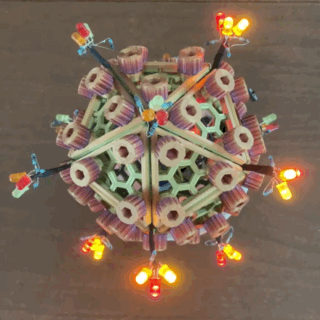
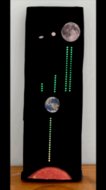
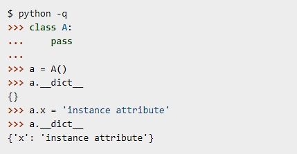

- [X] Kattni updates
- [ ] change date
- [ ] update title
- [ ] Feature story
- [ ] Update  for images
- [ ] Update ICYDNCI
- [ ] All images 550w max only
- [ ] Link "View this email in your browser."

News Sources

- [python.org](https://www.python.org/)
- [Python Insider - dev team blog](https://pythoninsider.blogspot.com/)

Template last updated on 12-28-2020 by Anne - 2021 changes

View this email in your browser.

Hi everyone! It's the latest Python for Microcontrollers newsletter, brought you by the community! We're on [Discord](https://discord.gg/HYqvREz), [Twitter](https://twitter.com/search?q=circuitpython&src=typed_query&f=live), and for past newsletters - [view them all here](https://www.adafruitdaily.com/category/circuitpython/). If you're reading this on the web, [subscribe here](https://www.adafruitdaily.com/). Let's get started!

## Headline Article

text - [site](url)

## Feature

text - [site](url)

## Feature

text - [site](url)

## Coming soon

text - [site](url)

## CircuitPython Deep Dive Stream with Scott Shawcroft

With New Year's, Scott was off - expect Derep Dive to resume this Friday!

You can see the latest video and past videos on the Adafruit YouTube channel under the Deep Dive playlist - [YouTube](https://www.youtube.com/playlist?list=PLjF7R1fz_OOXBHlu9msoXq2jQN4JpCk8A).

## News from around the web!

text - [site](url).

text - [site](url).

[]

Multi-mode Game of Life to show variations of the GoL, including viral contagion, #BLM, and Rose Garden Massacre. Metro M4 and 16x32 RGB Matrix, running CircuitPython. - [Molecularist](https://www.molecularist.com/2020/08/multi-mode-game-of-life.html).

[]

The Virus in 39 LEDs - red, yellow, orange (and limiting resistors); Neopixel jewel (7 pixs); rainbow PLA icosahedron (model by @Clockspring3D); LiPo; slide switch; and orchestrated in CircuitPython by an @adafruit ItsyBitsy M0 with battery backpack. - [Molecularist](https://www.molecularist.com/2020/10/covid-themed-halloween-fun-and-more.html).

Visualization of light speed between Sun, Earth, Moon, Jupiter, and Saturn using 149 NeoPixels driven by a Trinket M0 running CircuitPython. - [Molecularist](https://www.molecularist.com/2020/10/another-tangible-concept-seeing-through-time.html).

text - [site](url).

text - [site](url).

text - [site](url).

text - [site](url).

Building an E-Ink Calendar, and a UI Toolkit along the way with MicroPython and 0Auth2 - [rahulrav.com](https://rahulrav.com/blog/e_ink_dashboard.html).

text - [site](url).

text - [site](url).

text - [site](url).

text - [site](url).

NumPy Illustrated: The Visual Guide to NumPy - [BetterProgramming](https://medium.com/better-programming/numpy-illustrated-the-visual-guide-to-numpy-3b1d4976de1d).

Learn Python with Fantasy Football - [fantasyfootballdatapros](https://www.fantasyfootballdatapros.com/) via [Reddit](https://www.reddit.com/r/fantasyfootball/comments/kn41qn/learn_python_with_fantasy_football_giveaway/).

Python behind the scenes: how Python attributes work - [tenthousandmeters](https://tenthousandmeters.com/blog/python-behind-the-scenes-7-how-python-attributes-work/).

**#ICYDNCI What was the most popular, most clicked link, in [last week's newsletter](https://link)? [title](url).**

## New Boards Supported by CircuitPython

The number of supported microcontrollers and Single Board Computers (SBC) grows every week. This section outlines which boards have been included in CircuitPython or added to [CircuitPython.org](https://circuitpython.org/).

This week we had X new boards added!

- [Board name](url)

Looking for adding a new board to CircuitPython? It's highly encouraged! Adafruit has four guides to help you do so:

- [How to Add a New Board to CircuitPython](https://learn.adafruit.com/how-to-add-a-new-board-to-circuitpython/overview)
- [How to add a New Board to the circuitpython.org website](https://learn.adafruit.com/how-to-add-a-new-board-to-the-circuitpython-org-website)
- [Adding a Single Board Computer to PlatformDetect for Blinka](https://learn.adafruit.com/adding-a-single-board-computer-to-platformdetect-for-blinka)
- [Adding a Single Board Computer to Blinka](https://learn.adafruit.com/adding-a-single-board-computer-to-blinka)

## New Learn Guides!

[MagTag Twitter Display](https://learn.adafruit.com/magtag-twitter-display) from [Brent Rubell](https://learn.adafruit.com/users/brubell)

[Adafruit LTR390 UV Sensor](https://learn.adafruit.com/adafruit-ltr390-uv-sensor) from [Brian Siepert](https://learn.adafruit.com/users/siddacious)

[Adafruit SGP40 Air Quality Sensor](https://learn.adafruit.com/adafruit-sgp40) from [Kattni](https://learn.adafruit.com/users/kattni)

[Adafruit MagTag Project Selector](https://learn.adafruit.com/adafruit-magtag-project-selector) from [Dylan Herrada](https://learn.adafruit.com/users/dherrada)

## CircuitPython Libraries!

CircuitPython support for hardware continues to grow. We are adding support for new sensors and breakouts all the time, as well as improving on the drivers we already have. As we add more libraries and update current ones, you can keep up with all the changes right here!

For the latest libraries, download the [Adafruit CircuitPython Library Bundle](https://circuitpython.org/libraries). For the latest community contributed libraries, download the [CircuitPython Community Bundle](https://github.com/adafruit/CircuitPython_Community_Bundle/releases).

If you'd like to contribute, CircuitPython libraries are a great place to start. Have an idea for a new driver? File an issue on [CircuitPython](https://github.com/adafruit/circuitpython/issues)! Have you written a library you'd like to make available? Submit it to the [CircuitPython Community Bundle](https://github.com/adafruit/CircuitPython_Community_Bundle). Interested in helping with current libraries? Check out the [CircuitPython.org Contributing page](https://circuitpython.org/contributing). We've included open pull requests and issues from the libraries, and details about repo-level issues that need to be addressed. We have a guide on [contributing to CircuitPython with Git and Github](https://learn.adafruit.com/contribute-to-circuitpython-with-git-and-github) if you need help getting started. You can also find us in the #circuitpython channel on the [Adafruit Discord](https://adafru.it/discord).

You can check out this [list of all the Adafruit CircuitPython libraries and drivers available](https://github.com/adafruit/Adafruit_CircuitPython_Bundle/blob/master/circuitpython_library_list.md). 

The current number of CircuitPython libraries is **289**!

**New Libraries!**

Here's this week's new CircuitPython libraries:

 * [Adafruit_CircuitPython_SGP40](https://github.com/adafruit/Adafruit_CircuitPython_SGP40)

**Updated Libraries!**

Here's this week's updated CircuitPython libraries:

 * [Adafruit_CircuitPython_LSM9DS1](https://github.com/adafruit/Adafruit_CircuitPython_LSM9DS1)
 * [Adafruit_CircuitPython_BluefruitConnect](https://github.com/adafruit/Adafruit_CircuitPython_BluefruitConnect)
 * [Adafruit_CircuitPython_BNO08x](https://github.com/adafruit/Adafruit_CircuitPython_BNO08x)
 * [Adafruit_CircuitPython_SHTC3](https://github.com/adafruit/Adafruit_CircuitPython_SHTC3)
 * [Adafruit_CircuitPython_JWT](https://github.com/adafruit/Adafruit_CircuitPython_JWT)
 * [Adafruit_CircuitPython_GPS](https://github.com/adafruit/Adafruit_CircuitPython_GPS)
 * [Adafruit_CircuitPython_PortalBase](https://github.com/adafruit/Adafruit_CircuitPython_PortalBase)
 * [Adafruit_CircuitPython_RFM9x](https://github.com/adafruit/Adafruit_CircuitPython_RFM9x)
 * [Adafruit_CircuitPython_MagTag](https://github.com/adafruit/Adafruit_CircuitPython_MagTag)
 * [Adafruit_CircuitPython_Slideshow](https://github.com/adafruit/Adafruit_CircuitPython_Slideshow)
 * [Adafruit_CircuitPython_LTR390](https://github.com/adafruit/Adafruit_CircuitPython_LTR390)
 * [circuitpython](https://github.com/adafruit/circuitpython)
 * [Adafruit_Blinka](https://github.com/adafruit/Adafruit_Blinka)
 * [Adafruit_Blinka_bleio](https://github.com/adafruit/Adafruit_Blinka_bleio)

## What’s the team up to this week?

What is the team up to this week? Let’s check in!

**Bryan**

text

**Dan**

I prepared and released CircuitPython 6.0.1. It fixed a significant BLE and FrequencyIO regressions. We also included Scott's JSON speedup, which is substantial.

Since then I've been working on fixes clearing the issue queue for 6.1.0. There are still a number of issues that need fixing or research.

**Jeff**

text

**Kattni**

This week was a short week for me. I worked with Bryan on the [new guide](https://learn.adafruit.com/adafruit-ltr390-uv-sensor for the [Adafruit LTR390](https://www.adafruit.com/product/4831), and created the fritzing object for the board. I wrote the [guide](https://learn.adafruit.com/adafruit-mpr121-gator) for the new [MPR121 QT Gator breakout](https://www.adafruit.com/product/4830). I also did some miscellaneous support on Discord and the forums.

**Lucian**

text

**Melissa**

This past week I took some time off and have been enjoying the holidays.

**Scott**

The big thing this week was getting the PinAlarm code merged in. PinAlarm allows you to wake from sleep (light or deep) based on the logic level of an external pin. This is commonly used to wake based on button presses or based on the interrupt line from an external sensor. Keep trying the latest versions of CircuitPython for the latest and greatest.

## Upcoming events!

Australia’s grassroots Free and Open Source technologies conference linux.conf.au is scheduled for January 23-25 2021 online/worldwide. Limor "Ladyada" Fried, electrical engineer and founder of Adafruit, will be one of their keynote speakers. In her keynote, Limor will discuss how Python is snaking its way into hardware, Linux single board computers and more. 

The schedule and tickets are available at [lca2021.linux.org.au](https://lca2021.linux.org.au/) - [Announcement](https://lca2021.linux.org.au/news/keynote-limor-fried/).

FOSDEM is a free and non-commercial event organised by the community for the community. Typically hosted in Brussels, Belgium, FOSDEM 2021 is taking place online February 6-7, 2021. This year, there will be a Python Developer Room. Details - [Adafruit Blog](https://blog.adafruit.com/2020/12/08/fosdem-2021-python-developer-room-python/).

PyCascades is a regional PyCon in the Pacific Northwest, celebrating the west coast Python developer and user community. Held online February 19th — 21st, 2021 - [PyCascades](https://2021.pycascades.com/).

The 2021 Open Hardware summit will be held online, Friday April 9, 2021. The summit will be livestreamed, but ticket holders will have access to additional interactive portions of the summit like meet-and-greets, workshops, and sponsor booths. Find details, including ticket and sponsorship information at [2021.oshwa.org](https://2021.oshwa.org/) - [OSHWA](https://www.oshwa.org/2020/11/16/announcing-the-2021-open-hardware-summit/).

PyCon US, the annual official annual Python gathering, has been announced to be held online May 12-15, 2021. Sprints will be held May 16-18, 2021. More information and signups at [https://us.pycon.org/2021/](https://us.pycon.org/2021/)

**Send Your Events In**

As for other events, with the COVID pandemic, most in-person events are postponed or cancelled. If you know of virtual events or events that may occur in the future, please let us know on Discord or on Twitter with hashtag #CircuitPython.

## Latest releases

CircuitPython's stable release is [#.#.#](https://github.com/adafruit/circuitpython/releases/latest) and its unstable release is [#.#.#-##.#](https://github.com/adafruit/circuitpython/releases). New to CircuitPython? Start with our [Welcome to CircuitPython Guide](https://learn.adafruit.com/welcome-to-circuitpython).

[2020####](https://github.com/adafruit/Adafruit_CircuitPython_Bundle/releases/latest) is the latest CircuitPython library bundle.

[v#.#.#](https://micropython.org/download) is the latest MicroPython release. Documentation for it is [here](http://docs.micropython.org/en/latest/pyboard/).

[#.#.#](https://www.python.org/downloads/) is the latest Python release. The latest pre-release version is [#.#.#](https://www.python.org/download/pre-releases/).

[1958 Stars](https://github.com/adafruit/circuitpython/stargazers) Like CircuitPython? [Star it on GitHub!](https://github.com/adafruit/circuitpython)

## Call for help -- Translating CircuitPython is now easier than ever!

One important feature of CircuitPython is translated control and error messages.

With the help of fellow open source project [Weblate](https://weblate.org/), we're making it even easier to add or improve translations.

Sign in with an existing account such as Github, Google or Facebook and start contributing through a simple web interface. No forks or pull requests needed!

As always, if you run into trouble join us on [Discord](https://adafru.it/discord), we're here to help.

## jobs.adafruit.com - Find a dream job, find great candidates!

[jobs.adafruit.com](https://jobs.adafruit.com/) has returned and folks are posting their skills (including CircuitPython) and companies are looking for talented makers to join their companies - from Digi-Key, to Hackaday, Microcenter, Raspberry Pi and more.

**Job of the Week**

text - [Adafruit Jobs Board](https://jobs.adafruit.com/).

## NUMBER thanks!

The Adafruit Discord community, where we do all our CircuitPython development in the open, reached over NUMBER humans, thank you!  Adafruit believes Discord offers a unique way for CircuitPython folks to connect. Join today at [https://adafru.it/discord](https://adafru.it/discord).

## ICYMI - In case you missed it

The wonderful world of Python on hardware! This is our Python video-newsletter-podcast! The news comes from the Python community, Discord, Adafruit communities and more and is reviewed on ASK an ENGINEER Wednesdays. The complete Python on Hardware weekly videocast [playlist is here](https://www.youtube.com/playlist?list=PLjF7R1fz_OOXRMjM7Sm0J2Xt6H81TdDev). 

This video podcast is on [iTunes](https://itunes.apple.com/us/podcast/python-on-hardware/id1451685192?mt=2), [YouTube](http://adafru.it/pohepisodes), [IGTV (Instagram TV](https://www.instagram.com/adafruit/channel/)), and [XML](https://itunes.apple.com/us/podcast/python-on-hardware/id1451685192?mt=2).

[Weekly community chat on Adafruit Discord server CircuitPython channel - Audio / Podcast edition](https://itunes.apple.com/us/podcast/circuitpython-weekly-meeting/id1451685016) - Audio from the Discord chat space for CircuitPython, meetings are usually Mondays at 2pm ET, this is the audio version on [iTunes](https://itunes.apple.com/us/podcast/circuitpython-weekly-meeting/id1451685016), Pocket Casts, [Spotify](https://adafru.it/spotify), and [XML feed](https://adafruit-podcasts.s3.amazonaws.com/circuitpython_weekly_meeting/audio-podcast.xml).

And lastly, we are working up a one-spot destination for all things podcast-able here - [podcasts.adafruit.com](https://podcasts.adafruit.com/)

## Codecademy "Learn Hardware Programming with CircuitPython"

Codecademy, an online interactive learning platform used by more than 45 million people, has teamed up with the leading manufacturer in STEAM electronics, Adafruit Industries, to create a coding course, "Learn Hardware Programming with CircuitPython". The course is now available in the [Codecademy catalog](https://www.codecademy.com/learn/learn-circuitpython?utm_source=adafruit&utm_medium=partners&utm_campaign=circuitplayground&utm_content=pythononhardwarenewsletter).

Python is a highly versatile, easy to learn programming language that a wide range of people, from visual effects artists in Hollywood to mission control at NASA, use to quickly solve problems. But you don’t need to be a rocket scientist to accomplish amazing things with it. This new course introduces programmers to Python by way of a microcontroller — CircuitPython — which is a Python-based programming language optimized for use on hardware.

CircuitPython’s hardware-ready design makes it easier than ever to program a variety of single-board computers, and this course gets you from no experience to working prototype faster than ever before. Codecademy’s interactive learning environment, combined with Adafruit's highly rated Circuit Playground Express, present aspiring hardware hackers with a never-before-seen opportunity to learn hardware programming seamlessly online.

Whether for those who are new to programming, or for those who want to expand their skill set to include physical computing, this course will have students getting familiar with Python and creating incredible projects along the way. By the end, students will have built their own bike lights, drum machine, and even a moisture detector that can tell when it's time to water a plant.

Visit Codecademy to access the [Learn Hardware Programming with CircuitPython](https://www.codecademy.com/learn/learn-circuitpython?utm_source=adafruit&utm_medium=partners&utm_campaign=circuitplayground&utm_content=pythononhardwarenewsletter) course and Adafruit to purchase a [Circuit Playground Express](https://www.adafruit.com/product/3333).

Codecademy has helped more than 45 million people around the world upgrade their careers with technology skills. The company’s online interactive learning platform is widely recognized for providing an accessible, flexible, and engaging experience for beginners and experienced programmers alike. Codecademy has raised a total of $43 million from investors including Union Square Ventures, Kleiner Perkins, Index Ventures, Thrive Capital, Naspers, Yuri Milner and Richard Branson, most recently raising its $30 million Series C in July 2016.

## Contribute!

The CircuitPython Weekly Newsletter is a CircuitPython community-run newsletter emailed every Tuesday. The complete [archives are here](https://www.adafruitdaily.com/category/circuitpython/). It highlights the latest CircuitPython related news from around the web including Python and MicroPython developments. To contribute, edit next week's draft [on GitHub](https://github.com/adafruit/circuitpython-weekly-newsletter/tree/gh-pages/_drafts) and [submit a pull request](https://help.github.com/articles/editing-files-in-your-repository/) with the changes. You may also tag your information on Twitter with #CircuitPython. 

Join our [Discord](https://adafru.it/discord) or [post to the forum](https://forums.adafruit.com/viewforum.php?f=60) for any further questions.
