- [X] Kattni updates
- [ ] change date
- [ ] update title
- [ ] Feature story
- [ ] Update  for images
- [ ] Update ICYDNCI
- [ ] All images 550w max only
- [ ] Link "View this email in your browser."

View this email in your browser.

Happy New Year! It's the latest Python for Microcontrollers newsletter, brought you by the community! We're on [Discord](https://discord.gg/HYqvREz), [Twitter](https://twitter.com/search?q=circuitpython&src=typed_query&f=live), and for past newsletters - [view them all here](https://www.adafruitdaily.com/category/circuitpython/). If you're reading this on the web, [subscribe here](https://www.adafruitdaily.com/). Here's the latest:

## Where should CircuitPython go in 2021?

As 2021 starts, let’s take some time to share our goals for CircuitPython in 2021. Just like past years (full summary [2019](https://blog.adafruit.com/2019/01/28/circuitpython-in-2019/) and [2020](https://blog.adafruit.com/2020/02/03/circuitpython2020-recap/)), we’d like everyone in the CircuitPython community to contribute by posting their thoughts to some public place on the Internet.

Here are a few ways to post: a video on YouTube, a [post on the CircuitPython forum](https://forums.adafruit.com/posting.php?mode=post&f=60), a blog post on your site, a series of Tweets, a [Gist on GitHub](https://gist.github.com/), or [a /r/CircuitPython subreddit post](https://www.reddit.com/r/circuitpython/).

We want to hear from you. When you post, please add #CircuitPython2021 and email circuitpython2021@adafruit.com to let us know about your post so we can blog it up here.

The post can cover any topic related to CircuitPython. Here are some specific topics you could address:

* Projects you’d like to build
* Things you think could be easier
* Additional community programs
  * Weekly meeting
* Core CircuitPython features
  * Core CPython libraries to add
  * Additional microcontroller platforms
  * New boards to support
* Library improvements
  * [Blinka](https://github.com/adafruit/Adafruit_Blinka)
  * Additional libraries
  * Package management
* Documentation improvements
  * [Adafruit Learning System guides](https://learn.adafruit.com/category/circuitpython)
  * [ReadTheDocs](https://circuitpython.readthedocs.io/en/latest/)
  * [Video tutorials](https://www.youtube.com/adafruit)
* Ecosystem needs
  * [This newsletter](https://blog.adafruit.com/2018/12/17/python-on-microcontrollers-newsletter-sign-up-today-python-circuitpython-microcontrollers-circuitpython-micropython-thepsf-adafruit-2/)
  * [The Awesome CircuitPython list](https://github.com/adafruit/awesome-circuitpython)
  * [Circuitpython.org](https://circuitpython.org/)
  * [Adafruit support forum](https://forums.adafruit.com/viewforum.php?f=60)
  * [Discord channel](https://adafru.it/discord)
* Tooling enhancements
  * Github Actions
  * The bootloader

These, of course, are just ideas to start from. Please us know about all ideas you have for CircuitPython.

We, as a community, can use these ideas to coordinate and collaborate to make CircuitPython even better in 2021. Let’s use these ideas to spark further discussion and brainstorming. Keep an eye on the blog here and join the discussion on the Adafruit Discord.

More - [Adafruit Blog](https://blog.adafruit.com/2021/01/01/where-should-circuitpython-go-in-2021-circuitpython2021-circuitpython/)

## Coming Soon

[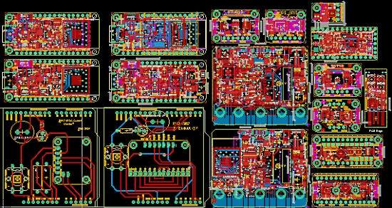](https://twitter.com/adafruit/status/1345923028224507904)

There are so many new pieces of hardware under development, we're featuring them here. As with all things in the [Top Secret](https://www.youtube.com/playlist?list=PLjF7R1fz_OOWnS6phH64KwEJBekaawPBC) category, these things are being conceptualized - release dates are not available. Keep an eye out on [Adafruit New Products](https://www.adafruit.com/new) to watch for their possible introduction.

[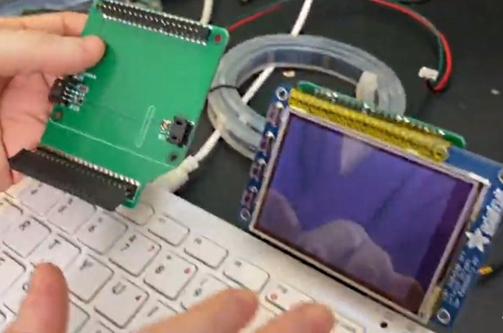](https://blog.adafruit.com/2020/12/30/cyberdeck-hat-for-raspberry-pi-400/)

CYBERDECK HAT for Raspberry Pi 400 - [Adafruit Blog](https://blog.adafruit.com/2020/12/30/cyberdeck-hat-for-raspberry-pi-400/) and [YouTube](https://youtu.be/df7Hj26HBO0).

[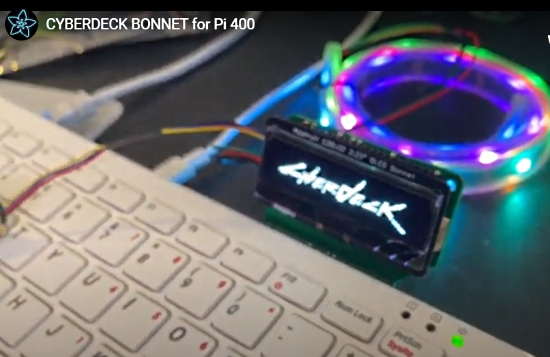](https://blog.adafruit.com/2020/12/30/cyberdeck-bonnet-for-raspberry-pi-400/)

CYBERDECK BONNET for Raspberry Pi 400 - [Adafruit Blog](https://blog.adafruit.com/2020/12/30/cyberdeck-bonnet-for-raspberry-pi-400/) and [YouTube](https://youtu.be/jFXF38f7CC4).

[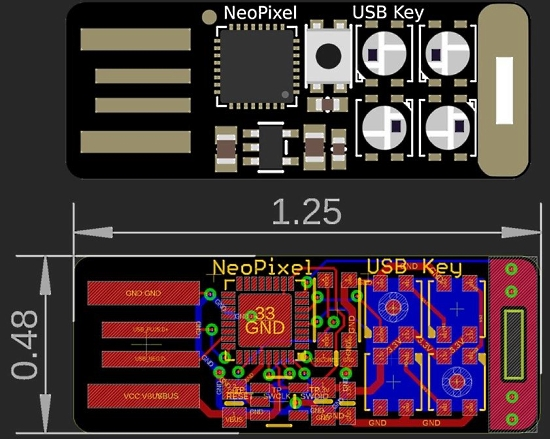](https://blog.adafruit.com/2020/12/28/samd21-neopixel-usb-stick-usb-trinket/)

SAMD21 NeoPixel USB Stick – USB “TRINKET” - [Adafruit Blog](https://blog.adafruit.com/2020/12/28/samd21-neopixel-usb-stick-usb-trinket/).

[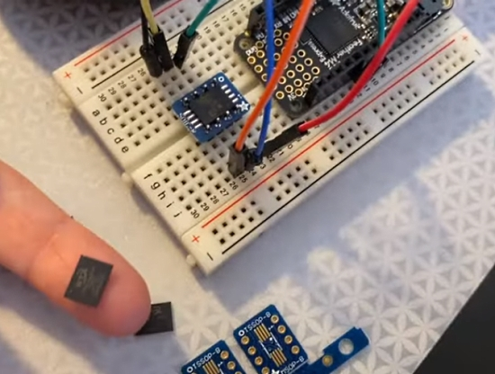](https://blog.adafruit.com/2020/12/26/sd-card-on-a-chip/)

SD Card on a Chip! - [Adafruit Blog](https://blog.adafruit.com/2020/12/26/sd-card-on-a-chip/) and [YouTube](https://youtu.be/HkZB3UUS85Y).

[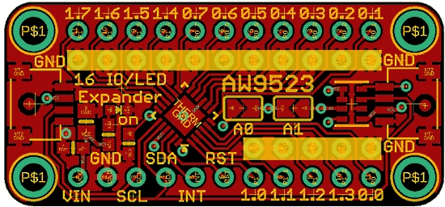](https://twitter.com/adafruit/status/1344120307012014081)

> We saw this nifty chip on the [nicechips sub-reddit](https://reddit.com/r/nicechips/comments/gzbsqn/aw9523_16_channel_i2c_io_expander_and_led_driver/) a few months ago and got a few samples. Recently we were thinking how we could really use this chip in a more complex design that could use a GPIO expander. So...it's time to make a STEMMA breakout! This I2C expander driver has 16 constant-current LED drivers and I/O pins. It seems pretty straightforward, just watch out for the address line 'default pin values' and the reset pin's internal pulldown. This breakout is looooooong so that you get every IO pin plus a matching ground pad.

STEMMA AW9523 - [Twitter](https://twitter.com/adafruit/status/1344120307012014081).

[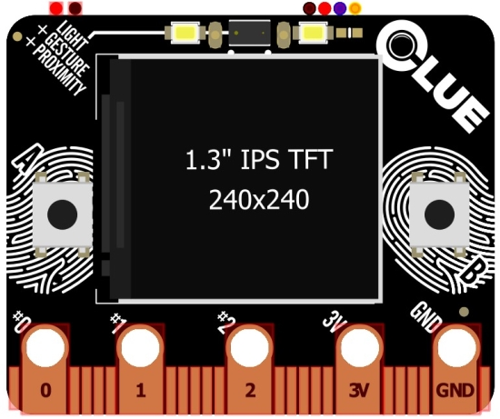](https://blog.adafruit.com/2020/12/29/esp32-s2-based-clue-board/)

ESP32-S2 based CLUE board - [Adafruit Blog](https://blog.adafruit.com/2020/12/29/esp32-s2-based-clue-board/).

[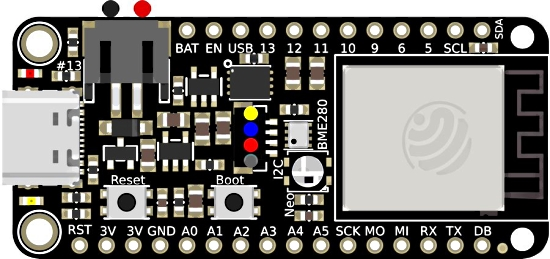](https://twitter.com/adafruit/status/1344687440582197255)

> We've been putting off getting a Feather board designed using the ESP32-S2... The ESP32-S2 mini modules make an easy job of this board, it's very compact and the pins lined up perfectly (don't you love when that happens) so that the IO numbers match the Feather pinout we prefer. We even got the high speed SPI pins on the SPI port, and the two DAC pins on A0 and A1. Given that we don't need a USB to serial converter, and flash memory is built into the 'mini, we had lots of space left in the middle. We ended up deciding on putting in a LC709203 battery monitor and a BMx280 sensor footprint that can place DPS310, BMP280 or BME280. For adding other sensors we have a vertical-style STEMMA QT in the center. The current mini modules have 4Mbyte flash and no PSRAM, but given the existence of ESP32-S2FN4R2, we hope it'll eventually happen.

Feather ESP32-S2 - [Twitter](https://twitter.com/adafruit/status/1344687440582197255).

## Espressif Systems Announces the ESP32-S3 Microcontroller

[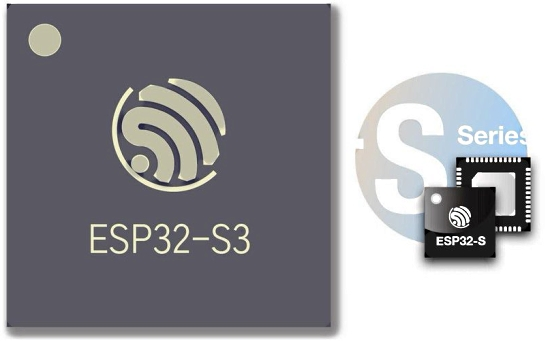](https://www.hackster.io/news/espressif-s-new-esp32-s3-adds-ai-features-for-iot-devices-b42b902abdf5)

> The ESP32-S3 features a dual-core LX7 32-bit processor operating up to 240 MHz. (The previous -S2 was single-core.) On-chip is 512 KB of SRAM and 384 KB of RAM with support for octal SPI to connect to external memory devices. The RF capabilities include WiFi 2.4 GHz b/g/n, legacy Bluetooth, and Bluetooth Low-Energy 5.0. Artificial Intelligence applications can take advantage of the ESP32-S3's vector instructions in the MCU. These provide acceleration for neural networks and signal processing loads.

For peripherals, the ESP32-S3 supports up to 44 programmable GPIOs for GPIOs, SPI, I2S, I2C, PWM, RMT, ADC, DAC, UART, SD/MMC host, and TWAI.

More - [hackster.io](https://www.hackster.io/news/espressif-s-new-esp32-s3-adds-ai-features-for-iot-devices-b42b902abdf5) via [Twitter](https://twitter.com/Hacksterio/status/1345094922215579655) and [Espressif Website](https://www.espressif.com/en/products/socs).

## CircuitPython Deep Dive Stream with Scott Shawcroft

With New Year's, Scott was off - expect Deep Dive to resume this Friday!

You can see the latest video and past videos on the Adafruit YouTube channel under the Deep Dive playlist - [YouTube](https://www.youtube.com/playlist?list=PLjF7R1fz_OOXBHlu9msoXq2jQN4JpCk8A).

## News from around the web!

[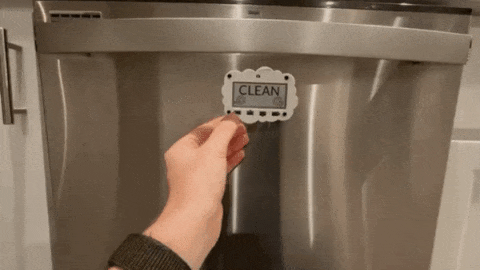](https://twitter.com/kevcody/status/1345930090035752961)

A dishwasher status indicator with [Adafruit MagTag](https://www.adafruit.com/product/4800) - [Twitter](https://twitter.com/kevcody/status/1345930090035752961).

[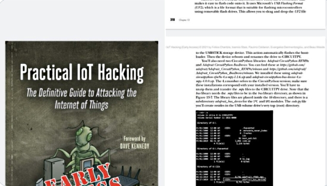](https://twitter.com/Sabasacustico/status/1344199975039860739)

Mention of CircuitPython in the book Practical IoT Hacking - [Twitter](https://twitter.com/Sabasacustico/status/1344199975039860739).

[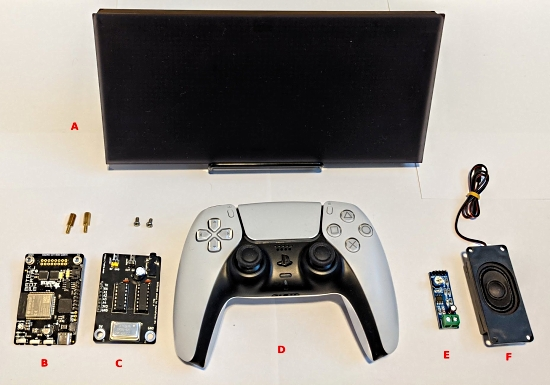](https://retro.moe/2020/12/31/building-quico-improved-sound-and-more-part-iii/)

Quico is the new name of the game console developed around the [Adafruit Matrix Portal microcontroller board](https://www.adafruit.com/product/4745) and an RGB LED Matrix display. A new Sound Shield uses a SN76489 chip on a custom shield board for the Matrix Portal - [retro.moe](https://retro.moe/2020/12/31/building-quico-improved-sound-and-more-part-iii/).

A PyPortal Titano Weather Display - [Adafruit Blog](https://blog.adafruit.com/2021/01/04/pyportal-titano-weather-display-circuitpython/) and [GitHub](https://github.com/bdsvac/adafruit_titano_weather).

[]

Multi-mode Game of Life to show variations of the GoL, including viral contagion, #BLM, and Rose Garden Massacre. Metro M4 and 16x32 RGB Matrix, running CircuitPython - [Molecularist](https://www.molecularist.com/2020/08/multi-mode-game-of-life.html).

[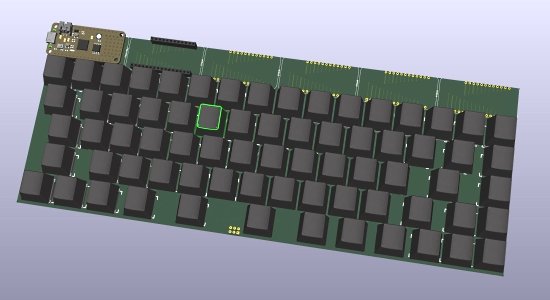](https://twitter.com/obra/status/1345916546355318785)

A keyboard designed as a FeatherWing - [Twitter thread](https://twitter.com/obra/status/1345916546355318785).

A CircuitPython Star Wars Pixel Tree Topper - [Twitter](https://twitter.com/MJ_BIO/status/1342029667780481026).

[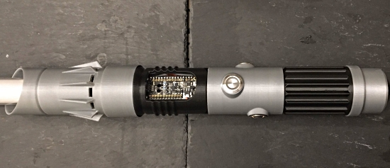](https://twitter.com/drfootleg/status/1244049164557848576)

A refined 3D printed Lightsaber with [Adafruit Feather](https://www.adafruit.com/product/3857) and [PropMaker FeatherWing](https://www.adafruit.com/product/3988) programmed in CircuitPython - [Twitter](https://twitter.com/drfootleg/status/1244049164557848576).

[]

The Virus in 39 LEDs - red, yellow, orange (and limiting resistors); [NeoPixel Jewel](https://www.adafruit.com/product/2226) (7 pix); rainbow PLA icosahedron (model by @Clockspring3D), LiPo battery, slide switch, and orchestrated in CircuitPython by an [Adafruit ItsyBitsy M0](https://www.adafruit.com/product/3727) with battery backpack - [Molecularist](https://www.molecularist.com/2020/10/covid-themed-halloween-fun-and-more.html).

[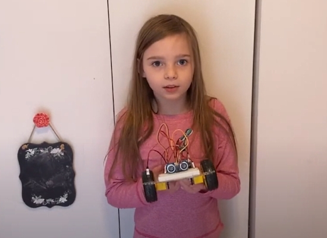](https://www.youtube.com/watch?v=kJSJ_gjpXvg&feature=youtu.be)

A father and daughter build a robot over holiday break with CircuitPython - [YouTube](https://www.youtube.com/watch?v=kJSJ_gjpXvg&feature=youtu.be) via [Twitter](https://twitter.com/scottmonaghan/status/1346102620277133314).

[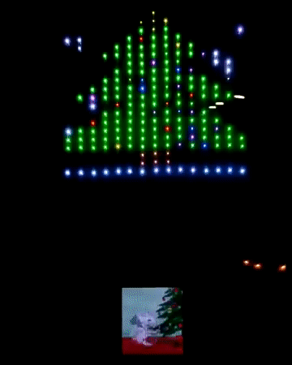](https://twitter.com/MarkKomus/status/1343329630678343686)

Two pixel Christmas light display in action. Top is 300 Adafruit NeoPixels powered by a [Feather M4 Express](https://www.adafruit.com/product/3857) with CircuitPython. The bottom is two 64x32 matrices chained together running Arduino with the Adafruit protomatter library - [Twitter](https://twitter.com/MarkKomus/status/1343329630678343686).

[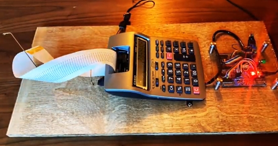](https://youtu.be/EgL9kBPkL38)

Buhbye 2020 with an Adafruit Trinket M0 - [YouTube](https://youtu.be/EgL9kBPkL38) via [Reddit](https://www.reddit.com/r/circuitpython/comments/kofgda/buhbye_2020_trinketm0/).

Visualization of light speed between Sun, Earth, Moon, Jupiter, and Saturn using 149 NeoPixels driven by a [Trinket M0](https://www.adafruit.com/product/3500) running CircuitPython - [Molecularist](https://www.molecularist.com/2020/10/another-tangible-concept-seeing-through-time.html).

Circuitpython driver library for AT42QT1070 Capacitive Touch Sensor - [GitHub](https://github.com/skerr92/at42qt-acorn-python).

FPGA hacking: MicroPython on Vexriscv on up5k on an ice40 Feather - [Twitter Thread](https://twitter.com/whatnick/status/1346083581320335360).

[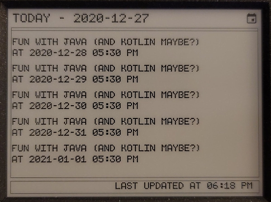](https://rahulrav.com/blog/e_ink_dashboard.html)

Building an E-Ink Calendar, and a UI Toolkit along the way with MicroPython and 0Auth2 - [rahulrav.com](https://rahulrav.com/blog/e_ink_dashboard.html).

Raspberry Pi HQ Camera: Autofocus for the Telephoto Lens (JiJi). The M5Stack application is programmed in MicroPython - [LeMaRiva](https://lemariva.com/blog/2020/12/raspberry-pi-hq-camera-autofocus-telephoto-lens).

[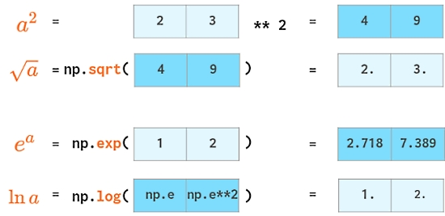](https://medium.com/better-programming/numpy-illustrated-the-visual-guide-to-numpy-3b1d4976de1d)

NumPy Illustrated: The Visual Guide to NumPy - [BetterProgramming](https://medium.com/better-programming/numpy-illustrated-the-visual-guide-to-numpy-3b1d4976de1d) and [YouTube](https://youtu.be/PrbyPmq_Z7Q).

Learn Python with Fantasy Football - [fantasyfootballdatapros](https://www.fantasyfootballdatapros.com/) via [Reddit](https://www.reddit.com/r/fantasyfootball/comments/kn41qn/learn_python_with_fantasy_football_giveaway/).

Python behind the scenes: how Python attributes work - [tenthousandmeters](https://tenthousandmeters.com/blog/python-behind-the-scenes-7-how-python-attributes-work/).

[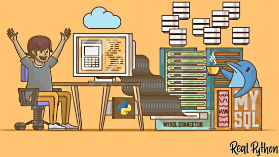](https://realpython.com/python-mysql/)

Python and MySQL Database: A Practical Introduction - [Real Python](https://realpython.com/python-mysql/) via [Twitter](https://twitter.com/PythonLibHunt/status/1343740292290101248).

**#ICYDNCI What was the most popular, most clicked link, in [last week's newsletter](https://link)? [title](url).**

## New Boards Supported by CircuitPython

The number of supported microcontrollers and Single Board Computers (SBC) grows every week. This section outlines which boards have been included in CircuitPython or added to [CircuitPython.org](https://circuitpython.org/).

No new boards were added this holiday week but there are some in development, stay tuned.

Looking for adding a new board to CircuitPython? It's highly encouraged! Adafruit has four guides to help you do so:

- [How to Add a New Board to CircuitPython](https://learn.adafruit.com/how-to-add-a-new-board-to-circuitpython/overview)
- [How to add a New Board to the circuitpython.org website](https://learn.adafruit.com/how-to-add-a-new-board-to-the-circuitpython-org-website)
- [Adding a Single Board Computer to PlatformDetect for Blinka](https://learn.adafruit.com/adding-a-single-board-computer-to-platformdetect-for-blinka)
- [Adding a Single Board Computer to Blinka](https://learn.adafruit.com/adding-a-single-board-computer-to-blinka)

## New Learn Guides!

[MagTag Twitter Display](https://learn.adafruit.com/magtag-twitter-display) from [Brent Rubell](https://learn.adafruit.com/users/brubell)

[Adafruit LTR390 UV Sensor](https://learn.adafruit.com/adafruit-ltr390-uv-sensor) from [Brian Siepert](https://learn.adafruit.com/users/siddacious)

[Adafruit SGP40 Air Quality Sensor](https://learn.adafruit.com/adafruit-sgp40) from [Kattni](https://learn.adafruit.com/users/kattni)

[Adafruit MagTag Project Selector](https://learn.adafruit.com/adafruit-magtag-project-selector) from [Dylan Herrada](https://learn.adafruit.com/users/dherrada)

## CircuitPython Libraries!

CircuitPython support for hardware continues to grow. We are adding support for new sensors and breakouts all the time, as well as improving on the drivers we already have. As we add more libraries and update current ones, you can keep up with all the changes right here!

For the latest libraries, download the [Adafruit CircuitPython Library Bundle](https://circuitpython.org/libraries). For the latest community contributed libraries, download the [CircuitPython Community Bundle](https://github.com/adafruit/CircuitPython_Community_Bundle/releases).

If you'd like to contribute, CircuitPython libraries are a great place to start. Have an idea for a new driver? File an issue on [CircuitPython](https://github.com/adafruit/circuitpython/issues)! Have you written a library you'd like to make available? Submit it to the [CircuitPython Community Bundle](https://github.com/adafruit/CircuitPython_Community_Bundle). Interested in helping with current libraries? Check out the [CircuitPython.org Contributing page](https://circuitpython.org/contributing). We've included open pull requests and issues from the libraries, and details about repo-level issues that need to be addressed. We have a guide on [contributing to CircuitPython with Git and Github](https://learn.adafruit.com/contribute-to-circuitpython-with-git-and-github) if you need help getting started. You can also find us in the #circuitpython channel on the [Adafruit Discord](https://adafru.it/discord).

You can check out this [list of all the Adafruit CircuitPython libraries and drivers available](https://github.com/adafruit/Adafruit_CircuitPython_Bundle/blob/master/circuitpython_library_list.md). 

The current number of CircuitPython libraries is **289**!

**New Libraries!**

Here's this week's new CircuitPython libraries:

 * [Adafruit_CircuitPython_SGP40](https://github.com/adafruit/Adafruit_CircuitPython_SGP40)

**Updated Libraries!**

Here's this week's updated CircuitPython libraries:

 * [Adafruit_CircuitPython_LSM9DS1](https://github.com/adafruit/Adafruit_CircuitPython_LSM9DS1)
 * [Adafruit_CircuitPython_BluefruitConnect](https://github.com/adafruit/Adafruit_CircuitPython_BluefruitConnect)
 * [Adafruit_CircuitPython_BNO08x](https://github.com/adafruit/Adafruit_CircuitPython_BNO08x)
 * [Adafruit_CircuitPython_SHTC3](https://github.com/adafruit/Adafruit_CircuitPython_SHTC3)
 * [Adafruit_CircuitPython_JWT](https://github.com/adafruit/Adafruit_CircuitPython_JWT)
 * [Adafruit_CircuitPython_GPS](https://github.com/adafruit/Adafruit_CircuitPython_GPS)
 * [Adafruit_CircuitPython_PortalBase](https://github.com/adafruit/Adafruit_CircuitPython_PortalBase)
 * [Adafruit_CircuitPython_RFM9x](https://github.com/adafruit/Adafruit_CircuitPython_RFM9x)
 * [Adafruit_CircuitPython_MagTag](https://github.com/adafruit/Adafruit_CircuitPython_MagTag)
 * [Adafruit_CircuitPython_Slideshow](https://github.com/adafruit/Adafruit_CircuitPython_Slideshow)
 * [Adafruit_CircuitPython_LTR390](https://github.com/adafruit/Adafruit_CircuitPython_LTR390)
 * [circuitpython](https://github.com/adafruit/circuitpython)
 * [Adafruit_Blinka](https://github.com/adafruit/Adafruit_Blinka)
 * [Adafruit_Blinka_bleio](https://github.com/adafruit/Adafruit_Blinka_bleio)

## What’s the team up to this week?

What is the team up to this week? Let’s check in!

**Dan**

I prepared and released CircuitPython 6.0.1. It fixed a significant BLE and FrequencyIO regressions. We also included Scott's JSON speedup, which is substantial.

Since then I've been working on fixes clearing the issue queue for 6.1.0. There are still a number of issues that need fixing or research.

**Jeff**

This week I released the next beta test version of CircuitPython, 6.1.0-beta.3.  Thanks to contributions from Adafruit people and the community, we continue to move ESP32-S2 towards a stable release!  Check it out and give us feedback.

**Kattni**

This week was a short week for me. I worked with Bryan on the [new guide](https://learn.adafruit.com/adafruit-ltr390-uv-sensor for the [Adafruit LTR390](https://www.adafruit.com/product/4831), and created the fritzing object for the board. I wrote the [guide](https://learn.adafruit.com/adafruit-mpr121-gator) for the new [MPR121 QT Gator breakout](https://www.adafruit.com/product/4830). I also did some miscellaneous support on Discord and the forums.

**Lucian**

This past week I've been working on a new MagTag guide for smart flashcards, and reviewing further changes to the Socket module.

**Melissa**

This past week I took some time off and have been enjoying the holidays.

**Scott**

The big thing this week was getting the PinAlarm code merged in. PinAlarm allows you to wake from sleep (light or deep) based on the logic level of an external pin. This is commonly used to wake based on button presses or based on the interrupt line from an external sensor. Keep trying the latest versions of CircuitPython for the latest and greatest.

## Upcoming events!

Australia’s grassroots Free and Open Source technologies conference linux.conf.au is scheduled for January 23-25 2021 online/worldwide. Limor "Ladyada" Fried, electrical engineer and founder of Adafruit, will be one of their keynote speakers. In her keynote, Limor will discuss how Python is snaking its way into hardware, Linux single board computers and more. 

The schedule and tickets are available at [lca2021.linux.org.au](https://lca2021.linux.org.au/) - [Announcement](https://lca2021.linux.org.au/news/keynote-limor-fried/).

FOSDEM is a free and non-commercial event organised by the community for the community. Typically hosted in Brussels, Belgium, FOSDEM 2021 is taking place online February 6-7, 2021. This year, there will be a Python Developer Room. Details - [Adafruit Blog](https://blog.adafruit.com/2020/12/08/fosdem-2021-python-developer-room-python/).

PyCascades is a regional PyCon in the Pacific Northwest, celebrating the west coast Python developer and user community. Held online February 19th — 21st, 2021 - [PyCascades](https://2021.pycascades.com/).

The 2021 Open Hardware summit will be held online, Friday April 9, 2021. The summit will be livestreamed, but ticket holders will have access to additional interactive portions of the summit like meet-and-greets, workshops, and sponsor booths. Find details, including ticket and sponsorship information at [2021.oshwa.org](https://2021.oshwa.org/) - [OSHWA](https://www.oshwa.org/2020/11/16/announcing-the-2021-open-hardware-summit/).

PyCon US, the annual official annual Python gathering, has been announced to be held online May 12-15, 2021. Sprints will be held May 16-18, 2021. More information and signups at [https://us.pycon.org/2021/](https://us.pycon.org/2021/)

**Send Your Events In**

As for other events, with the COVID pandemic, most in-person events are postponed or cancelled. If you know of virtual events or events that may occur in the future, please let us know on Discord or on Twitter with hashtag #CircuitPython.

## Latest releases

CircuitPython's stable release is [#.#.#](https://github.com/adafruit/circuitpython/releases/latest) and its unstable release is [#.#.#-##.#](https://github.com/adafruit/circuitpython/releases). New to CircuitPython? Start with our [Welcome to CircuitPython Guide](https://learn.adafruit.com/welcome-to-circuitpython).

[2020####](https://github.com/adafruit/Adafruit_CircuitPython_Bundle/releases/latest) is the latest CircuitPython library bundle.

[v#.#.#](https://micropython.org/download) is the latest MicroPython release. Documentation for it is [here](http://docs.micropython.org/en/latest/pyboard/).

[#.#.#](https://www.python.org/downloads/) is the latest Python release. The latest pre-release version is [#.#.#](https://www.python.org/download/pre-releases/).

[1958 Stars](https://github.com/adafruit/circuitpython/stargazers) Like CircuitPython? [Star it on GitHub!](https://github.com/adafruit/circuitpython)

## Call for help -- Translating CircuitPython is now easier than ever!

One important feature of CircuitPython is translated control and error messages.

With the help of fellow open source project [Weblate](https://weblate.org/), we're making it even easier to add or improve translations.

Sign in with an existing account such as Github, Google or Facebook and start contributing through a simple web interface. No forks or pull requests needed!

As always, if you run into trouble join us on [Discord](https://adafru.it/discord), we're here to help.

## jobs.adafruit.com - Find a dream job, find great candidates!

[jobs.adafruit.com](https://jobs.adafruit.com/) has returned and folks are posting their skills (including CircuitPython) and companies are looking for talented makers to join their companies - from Digi-Key, to Hackaday, Microcenter, Raspberry Pi and more.

**Job of the Week**

Director of Resource Development - Python Software Foundation

The PSF is seeking to hire a Director of Resource Development to spearhead fundraising and sponsorship efforts! They are accepting resumes through January 14th, 2021 - [Adafruit Jobs Board](https://jobs.adafruit.com/).

## 26,495 thanks!

The Adafruit Discord community, where we do all our CircuitPython development in the open, reached over 26,495 humans, thank you!  Adafruit believes Discord offers a unique way for CircuitPython folks to connect. Join today at [https://adafru.it/discord](https://adafru.it/discord).

## ICYMI - In case you missed it

The wonderful world of Python on hardware! This is our Python video-newsletter-podcast! The news comes from the Python community, Discord, Adafruit communities and more and is reviewed on ASK an ENGINEER Wednesdays. The complete Python on Hardware weekly videocast [playlist is here](https://www.youtube.com/playlist?list=PLjF7R1fz_OOXRMjM7Sm0J2Xt6H81TdDev). 

This video podcast is on [iTunes](https://itunes.apple.com/us/podcast/python-on-hardware/id1451685192?mt=2), [YouTube](http://adafru.it/pohepisodes), [IGTV (Instagram TV](https://www.instagram.com/adafruit/channel/)), and [XML](https://itunes.apple.com/us/podcast/python-on-hardware/id1451685192?mt=2).

[Weekly community chat on Adafruit Discord server CircuitPython channel - Audio / Podcast edition](https://itunes.apple.com/us/podcast/circuitpython-weekly-meeting/id1451685016) - Audio from the Discord chat space for CircuitPython, meetings are usually Mondays at 2pm ET, this is the audio version on [iTunes](https://itunes.apple.com/us/podcast/circuitpython-weekly-meeting/id1451685016), Pocket Casts, [Spotify](https://adafru.it/spotify), and [XML feed](https://adafruit-podcasts.s3.amazonaws.com/circuitpython_weekly_meeting/audio-podcast.xml).

And lastly, we are working up a one-spot destination for all things podcast-able here - [podcasts.adafruit.com](https://podcasts.adafruit.com/)

## Codecademy "Learn Hardware Programming with CircuitPython"

Codecademy, an online interactive learning platform used by more than 45 million people, has teamed up with the leading manufacturer in STEAM electronics, Adafruit Industries, to create a coding course, "Learn Hardware Programming with CircuitPython". The course is now available in the [Codecademy catalog](https://www.codecademy.com/learn/learn-circuitpython?utm_source=adafruit&utm_medium=partners&utm_campaign=circuitplayground&utm_content=pythononhardwarenewsletter).

Python is a highly versatile, easy to learn programming language that a wide range of people, from visual effects artists in Hollywood to mission control at NASA, use to quickly solve problems. But you don’t need to be a rocket scientist to accomplish amazing things with it. This new course introduces programmers to Python by way of a microcontroller — CircuitPython — which is a Python-based programming language optimized for use on hardware.

CircuitPython’s hardware-ready design makes it easier than ever to program a variety of single-board computers, and this course gets you from no experience to working prototype faster than ever before. Codecademy’s interactive learning environment, combined with Adafruit's highly rated Circuit Playground Express, present aspiring hardware hackers with a never-before-seen opportunity to learn hardware programming seamlessly online.

Whether for those who are new to programming, or for those who want to expand their skill set to include physical computing, this course will have students getting familiar with Python and creating incredible projects along the way. By the end, students will have built their own bike lights, drum machine, and even a moisture detector that can tell when it's time to water a plant.

Visit Codecademy to access the [Learn Hardware Programming with CircuitPython](https://www.codecademy.com/learn/learn-circuitpython?utm_source=adafruit&utm_medium=partners&utm_campaign=circuitplayground&utm_content=pythononhardwarenewsletter) course and Adafruit to purchase a [Circuit Playground Express](https://www.adafruit.com/product/3333).

Codecademy has helped more than 45 million people around the world upgrade their careers with technology skills. The company’s online interactive learning platform is widely recognized for providing an accessible, flexible, and engaging experience for beginners and experienced programmers alike. Codecademy has raised a total of $43 million from investors including Union Square Ventures, Kleiner Perkins, Index Ventures, Thrive Capital, Naspers, Yuri Milner and Richard Branson, most recently raising its $30 million Series C in July 2016.

## Contribute!

The CircuitPython Weekly Newsletter is a CircuitPython community-run newsletter emailed every Tuesday. The complete [archives are here](https://www.adafruitdaily.com/category/circuitpython/). It highlights the latest CircuitPython related news from around the web including Python and MicroPython developments. To contribute, edit next week's draft [on GitHub](https://github.com/adafruit/circuitpython-weekly-newsletter/tree/gh-pages/_drafts) and [submit a pull request](https://help.github.com/articles/editing-files-in-your-repository/) with the changes. You may also tag your information on Twitter with #CircuitPython. 

Join our [Discord](https://adafru.it/discord) or [post to the forum](https://forums.adafruit.com/viewforum.php?f=60) for any further questions.
