- [X] Kattni updates
- [ ] change date
- [ ] update title
- [ ] Feature story
- [ ] Update  for images
- [ ] Update ICYDNCI
- [ ] All images 550w max only
- [ ] Link "View this email in your browser."

View this email in your browser.

Hi everyone! Here's the latest Python for Microcontrollers newsletter, brought you by the community! We're on [Discord](https://discord.gg/HYqvREz), [Twitter](https://twitter.com/search?q=circuitpython&src=typed_query&f=live), and for past newsletters - [view them all here](https://www.adafruitdaily.com/category/circuitpython/). If you're reading this on the web, [subscribe here](https://www.adafruitdaily.com/). 

**Content warning - moving images with flashing lights**

## LCA 2021 Online Keynote: The Story Behind Blinka by Limor Fried

[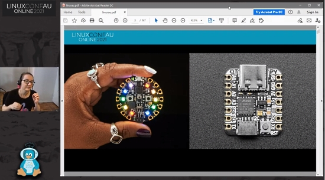](https://www.youtube.com/watch?v=jZnDCs80b_A)

Limor Fried, founder of Adafruit, gave a keynote talk on the "The Story Behind Blinka" discussing CircuitPython at Linux Conference Australia 2021. The video is now available - [YouTube](https://www.youtube.com/watch?v=jZnDCs80b_A)

## Die shots of the Raspberry Pi RP2040 chip

[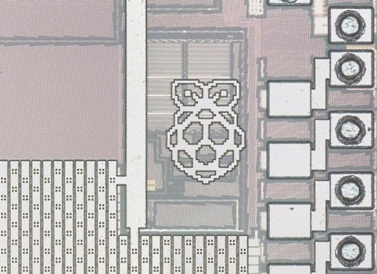](https://blog.adafruit.com/2021/01/29/die-shots-of-the-raspberry-pi-rp2040-chip-teardown-dieshot-reverseengineering-piday-johndmcmaster-raspberry_pi/)

An informative thread on Twitter, starting with x-rays of the new Raspberry Pi Pico board and subsequently going layer by layer through the board’s RP2040 chip. The die shots are both beautiful and informative in understanding this new chip. The thread indicates the chip is made in 40nm and at the TSMC fab - [Adafruit Blog](https://blog.adafruit.com/2021/01/29/die-shots-of-the-raspberry-pi-rp2040-chip-teardown-dieshot-reverseengineering-piday-johndmcmaster-raspberry_pi/) and [Twitter](https://twitter.com/johndmcmaster/status/1355092011829719046) with [zoomable image](https://siliconpr0n.org/map/raspberry-pi/rp2-b0/mz_mit20x/).

## 27,000 thanks!

The Adafruit Discord community, where we do all our CircuitPython development in the open, reached over 27,000 humans, thank you!  Adafruit believes Discord offers a unique way for CircuitPython folks to connect. Join today at [https://adafru.it/discord](https://adafru.it/discord).

## pip updates

pip is the package installer for Python. pip installs packages from the Python Package Index. A late January update introduced two important changes: Support for Python 2 has been removed. Also support for Python 3.5 has been removed. More - [pip.pypa.io](https://pip.pypa.io/en/stable/news/)

## CircuitPython Deep Dive Stream with Scott Shawcroft

[This week](https://youtu.be/WS64J3BTBj0), Scott streams his work on RP2040 DMA and Audio.

You can see the latest video and past videos on the Adafruit YouTube channel under the Deep Dive playlist - [YouTube](https://www.youtube.com/playlist?list=PLjF7R1fz_OOXBHlu9msoXq2jQN4JpCk8A).

## News from around the web!

[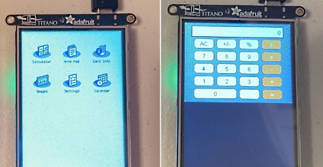](https://twitter.com/makermelissa/status/1354264012368691202)

Melissa LeBlanc-Williams is working on a fun little side project - [Twitter](https://twitter.com/makermelissa/status/1354264012368691202).

> I call it the CPDA or CircuitPython Digital Assistant running on an Adafruit PyPortal Titano. I’ve only worked on it for a few days so far. Icons will be reworked eventually. It is able to launch apps right off the SD Card.

[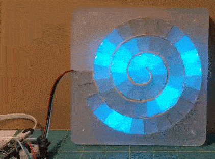](https://twitter.com/GeekMomProjects/status/1353879065304866816)

An edge-lit spiral. This one uses a single standard LED strip wound around the path of the spiral.  No soldering at all. Animations generated by the Adafruit
 led_animation CircuitPython library running on an [Adafruit ItsyBitsy M4 board](https://www.adafruit.com/product/3800) - [Twitter](https://twitter.com/GeekMomProjects/status/1353879065304866816).

[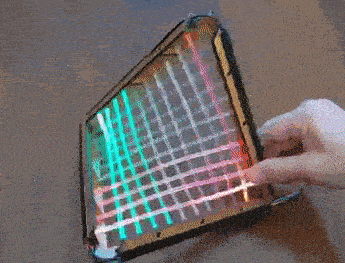](https://twitter.com/GeekMomProjects/status/1354998311531343879)

Build instructions for the illuminated fiber-optic hyperbolic paraboloid - [Geek Mom Projects](https://www.geekmomprojects.com/fiber-optic-hyperbolic-paraboloid/) via [Twitter](https://twitter.com/GeekMomProjects/status/1354998311531343879).

[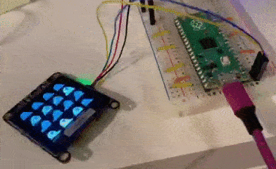](https://twitter.com/BlitzCityDIY/status/1353833477242843141)

Pico parrots with a [Raspberry Pi Pico](https://www.adafruit.com/product/4864) running CircuitPython - [Twitter](https://twitter.com/BlitzCityDIY/status/1353833477242843141).

[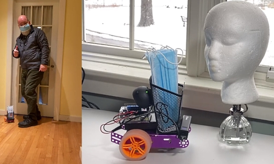](https://www.youtube.com/watch?v=o-lmGqXfOSc&feature=youtu.be)

Mil Mascaras is an iOS-controlled, CircuitPython-powered Raspberry Pi robot that can offering face masks, "speak" selected sound-files on demand, and move about. It is a no-solder, beginner-friendly robot project. Follow along step-by-step tutorial at on [gallaugher.com](https://gallaugher.com/mil-mascaras/) with code on [GitHub](https://github.com/gallaugher/mil-mascaras). See more on [YouTube](https://www.youtube.com/watch?v=o-lmGqXfOSc&feature=youtu.be) via [Twitter](https://twitter.com/gallaugher/status/1355176817901113345).

[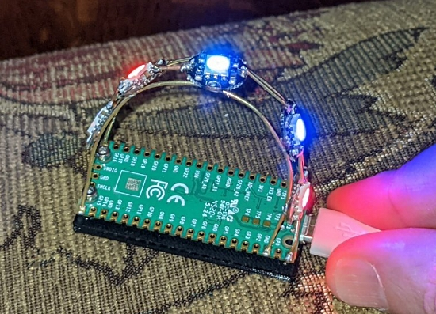](https://twitter.com/jeffepler/status/1356252370167066632)

A circuit sculpture with a Raspberry Pi Pico and Adafruit CircuitPython - [Twitter](https://twitter.com/jeffepler/status/1356252370167066632).

[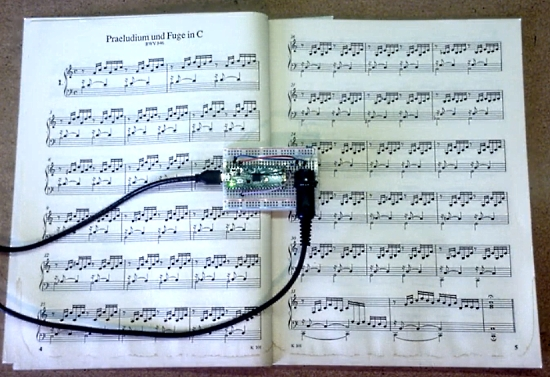](https://blog.adafruit.com/2021/01/29/raspberry-pi-pico-plays-bach-piday-raspberrypi-raspberry_pi/)

Raspberry Pi Pico Plays Bach - [Adafruit Blog](https://blog.adafruit.com/2021/01/29/raspberry-pi-pico-plays-bach-piday-raspberrypi-raspberry_pi/), [Blog](https://diyelectromusic.wordpress.com/2021/01/23/midi-micropython-and-the-raspberry-pi-pico/) and [YouTube](https://youtu.be/PeaxpHmEKZk).

[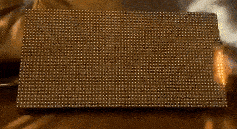](https://twitter.com/mariocruz/status/1355952449379590148)

An [Adafruit Matrix Portal](https://www.adafruit.com/product/4745) and CircuitPython powered internet display to fetch stock information from the web - [Twitter](https://twitter.com/mariocruz/status/1355952449379590148) and [GitHub](https://github.com/MarioCruz/MatrixPortalStockTicker).

[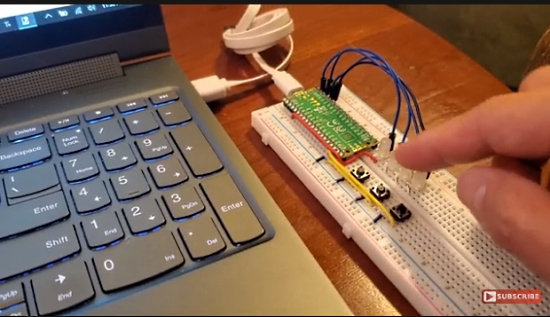](https://hackaday.io/project/177200-pi-pico-draws-in-ms-paint/details)

A Pi Pico draws in MS Paint - [hackaday.io](https://hackaday.io/project/177200-pi-pico-draws-in-ms-paint/details) and [YouTube](https://youtu.be/uXIJCFDP0Zo).

[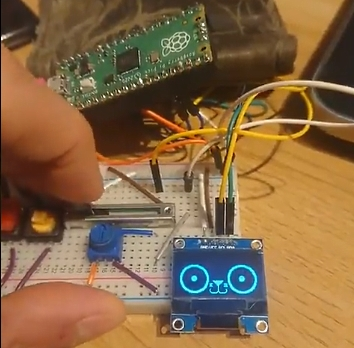](https://twitter.com/digitalMakerCIC/status/1355587524031369217)

Developing an OSC device use with Sonic Pi and the the Raspberry Pi Pico. The ADC read CircuitPython slider allows the pupils on the dinkyOSC to move all around the eye - [Twitter](https://twitter.com/digitalMakerCIC/status/1355587524031369217).

[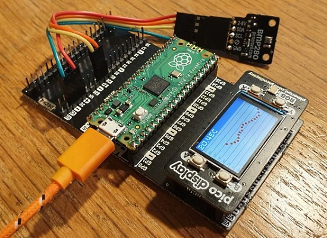](https://twitter.com/Worlds6440/status/1355994933346316289)

18 hours worth of temp data logged and displayed on a Raspberry Pi Pico and Pimoroni PicoDisplay with MicroPython - [Twitter](https://twitter.com/Worlds6440/status/1355994933346316289).

[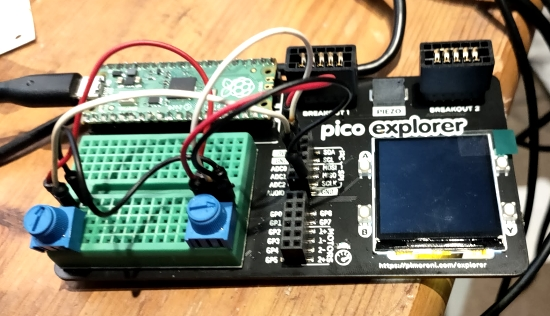](https://blog.rareschool.com/2021/01/pi-pico-emulating-etch-sketch.html)

A Raspberry Pi Pico emulating an Etch-a-sketch - [RAREblog](https://blog.rareschool.com/2021/01/pi-pico-emulating-etch-sketch.html).

[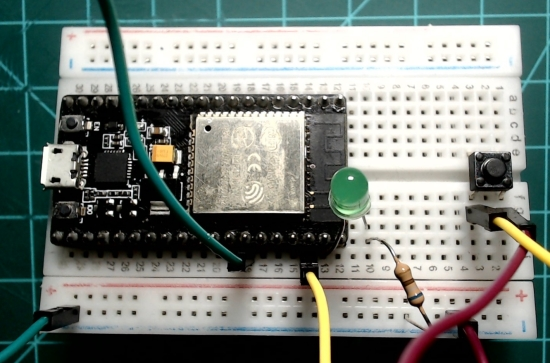](https://micronote.tech/2021/01/Timers-and-Interrupts-with-a-ESP32-NodeMCU-and-MicroPython/)

A guide and video on timers and interrupts with an ESP32 NodeMCU and MicroPython - [Guide](https://micronote.tech/2021/01/Timers-and-Interrupts-with-a-ESP32-NodeMCU-and-MicroPython/), [YouTube](https://www.youtube.com/watch?app=desktop&v=ZkmPRzZPqzc) via [Twitter](https://twitter.com/micro_note/status/1353764777122791424).

[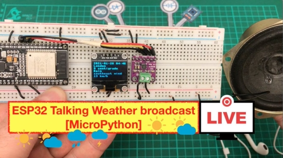](https://twitter.com/DjamalUK/status/1354676795384221700)

A talking weather broadcast with an ESP32 and MicroPython - [YouTube](https://www.youtube.com/watch?v=D7g3iiPH0l0&feature=youtu.be) via [Twitter](https://twitter.com/DjamalUK/status/1354676795384221700).

A sneak-peak demo of a Pico tutorial from next month's HackSpace magazine using MicroPython - [Twitter](https://twitter.com/HackSpaceMag/status/1354080898954764290).

[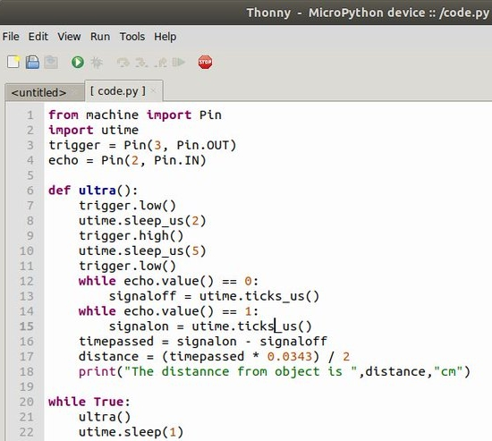](https://twitter.com/biglesp/status/1354121727069065218)

Using an HCSR04P or HCSR04+ Ultrasonic Sensor with a Raspberry Pi Pico and MicroPython - [Tom's Hardware](https://www.tomshardware.com/how-to/raspberry-pi-pico-ultrasonic-sensor?utm_source=twitter.com&utm_medium=social&utm_campaign=socialflow) via [Twitter](https://twitter.com/biglesp/status/1354121727069065218).

Making is Show Business now - [alexdanco.com](https://alexdanco.com/2020/10/08/making-is-show-business-now/).

[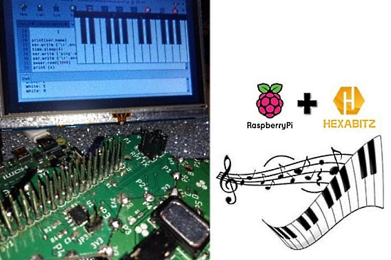](https://blog.adafruit.com/2021/01/29/hexabitz-piano-controllable-from-raspberry-pi-and-python-gui-raspberry_pi-piday-raspberrypi/)

A Hexabitz Piano, controllable from Raspberry Pi and a Python GUI - [Adafruit Blog](https://blog.adafruit.com/2021/01/29/hexabitz-piano-controllable-from-raspberry-pi-and-python-gui-raspberry_pi-piday-raspberrypi/).

A comprehensive guide to debugging Python scripts in VS Code, how to efficiently debug your scripts in 10 mins - [Towards Data Science](https://towardsdatascience.com/a-comprehensive-guide-to-debugging-python-scripts-in-vs-code-b9f9f777d4b8).

[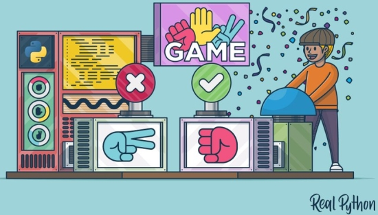](https://twitter.com/realpython/status/1354134540856549378)

Make Your First Python Game: Rock, Paper, Scissors - [Real Python](https://twitter.com/realpython/status/1354134540856549378).

[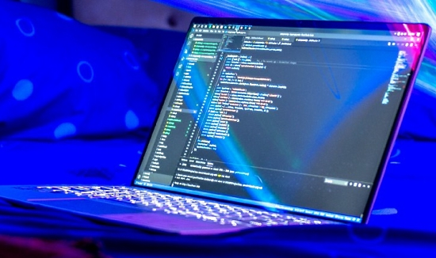](https://towardsdatascience.com/become-a-more-efficient-python-programmer-3850c94b95a4)

Become a More Efficient Python Programmer - [Towards Data Science](https://towardsdatascience.com/become-a-more-efficient-python-programmer-3850c94b95a4).

The History of Python Package Managers - [nickmccullum.com](https://nickmccullum.com/history-python-package-managers/).

[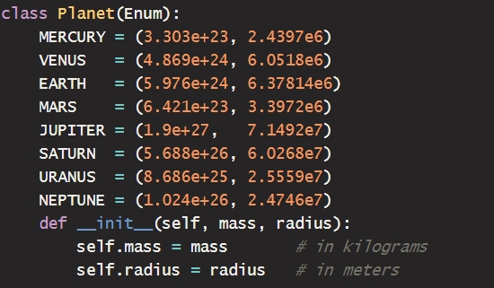](https://kodare.net/2020/11/17/why_we_dont_use_enums.html)

Why we don't use Python native enums - [kodare.net](https://kodare.net/2020/11/17/why_we_dont_use_enums.html).

[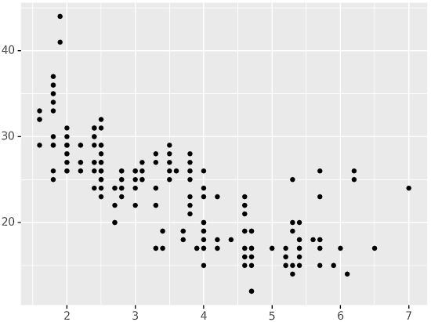](https://datascienceworkshops.com/blog/plotnine-grammar-of-graphics-for-python/)

Plotnine: Grammar of Graphics for Python - a translation of the visualisation chapters from “R for Data Science” to Python using Plotnine and Pandas - [datascienceworkshops.com](https://datascienceworkshops.com/blog/plotnine-grammar-of-graphics-for-python/).

#ICYDNCI What was the most popular, most clicked link, in [last week's newsletter](https://www.adafruitdaily.com/2021/01/26/python-on-microcontrollers-newsletter-python-on-the-new-raspberry-pi-pico-board-and-rp2040-chip-python-adafruit-circuitpython-micropython-thepsf/)? [Adafruit Learning Guide: Getting Started with Raspberry Pi Pico and CircuitPython](https://learn.adafruit.com/getting-started-with-raspberry-pi-pico-circuitpython).

## Coming soon

[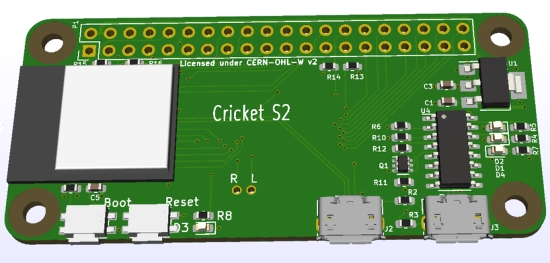](https://twitter.com/TonyMac_32/status/1356261425287733249)

The Cricket-S2 is getting a revision: an ESP32-S2 CircuitPython capable board in a Raspberry Pi Zero board format - [Twitter](https://twitter.com/TonyMac_32/status/1356261425287733249).

## New Boards Supported by CircuitPython

The number of supported microcontrollers and Single Board Computers (SBC) grows every week. This section outlines which boards have been included in CircuitPython or added to [CircuitPython.org](https://circuitpython.org/).

This week, there were 2 new boards added!

- [DynOSSAT-EDU OBC](https://circuitpython.org/board/dynossat_edu_obc/)
- [DynOSSAT-EDU EPS](https://circuitpython.org/board/dynossat_edu_eps/)

Looking to add a new board to CircuitPython? It's highly encouraged! Adafruit has four guides to help you do so:

- [How to Add a New Board to CircuitPython](https://learn.adafruit.com/how-to-add-a-new-board-to-circuitpython/overview)
- [How to add a New Board to the circuitpython.org website](https://learn.adafruit.com/how-to-add-a-new-board-to-the-circuitpython-org-website)
- [Adding a Single Board Computer to PlatformDetect for Blinka](https://learn.adafruit.com/adding-a-single-board-computer-to-platformdetect-for-blinka)
- [Adding a Single Board Computer to Blinka](https://learn.adafruit.com/adding-a-single-board-computer-to-blinka)

## New Learn Guides!

[Neopixel Crystal Chandelier with CircuitPython Animations and Speed Control](https://learn.adafruit.com/neopixel-crystal-chandelier-with-circuitpython-animations-and-speed-control) from [Erin St. Blaine](https://learn.adafruit.com/users/firepixie)

[Raspberry Pi YouTube Boombox](https://learn.adafruit.com/youtube-radio) from [Noe and Pedro](https://learn.adafruit.com/users/pixil3d)

[Adafruit Feather M4 CAN Express](https://learn.adafruit.com/adafruit-feather-m4-can-express) from [Kattni](https://learn.adafruit.com/users/kattni)

## CircuitPython Libraries!

CircuitPython support for hardware continues to grow. We are adding support for new sensors and breakouts all the time, as well as improving on the drivers we already have. As we add more libraries and update current ones, you can keep up with all the changes right here!

For the latest libraries, download the [Adafruit CircuitPython Library Bundle](https://circuitpython.org/libraries). For the latest community contributed libraries, download the [CircuitPython Community Bundle](https://github.com/adafruit/CircuitPython_Community_Bundle/releases).

If you'd like to contribute, CircuitPython libraries are a great place to start. Have an idea for a new driver? File an issue on [CircuitPython](https://github.com/adafruit/circuitpython/issues)! Have you written a library you'd like to make available? Submit it to the [CircuitPython Community Bundle](https://github.com/adafruit/CircuitPython_Community_Bundle). Interested in helping with current libraries? Check out the [CircuitPython.org Contributing page](https://circuitpython.org/contributing). We've included open pull requests and issues from the libraries, and details about repo-level issues that need to be addressed. We have a guide on [contributing to CircuitPython with Git and Github](https://learn.adafruit.com/contribute-to-circuitpython-with-git-and-github) if you need help getting started. You can also find us in the #circuitpython channel on the [Adafruit Discord](https://adafru.it/discord).

You can check out this [list of all the Adafruit CircuitPython libraries and drivers available](https://github.com/adafruit/Adafruit_CircuitPython_Bundle/blob/master/circuitpython_library_list.md). 

The current number of CircuitPython libraries is **290**!

**New Libraries!**

Here's this week's new CircuitPython libraries:

 * [Adafruit_CircuitPython_PIOASM](https://github.com/adafruit/Adafruit_CircuitPython_PIOASM)
 * [Adafruit_CircuitPython_AW9523](https://github.com/adafruit/Adafruit_CircuitPython_AW9523)

**Updated Libraries!**

Here's this week's updated CircuitPython libraries:

* A list of updated libraries can be found [here](https://adafruit-circuit-python.s3.amazonaws.com/adabot/bin/reports/circuitpython_library_report_20210127.txt).

## What’s the team up to this week?

What is the team up to this week? Let’s check in!

**Dan**

I made a CircuitPython 6.2.0-beta.0 release last week, and just today (written 1/27) released 6.2.0-beta.1. These releases include support for the Raspberry Pi RP2040 chip. Thanks, Scott, for that port!

In beta.1 I made it a lot easier to enable and disable json, re, and other modules that we inherited from MicroPython but haven't yet incorporated into the CircuitPython style of coding native modules. I also cleaned up the documentation for those modules, removing the MicroPython ujson and ure style of naming.

I continued to work on the mysterious slow files writes issue. I have a fix but it's fixing the symptom rather than the underlying problem, so we'll try to find the root cause.

As I may have mentioned before, the next significant project I'll be working on is a secondary CDC (serial) USB channel. This will allow easy serial communication with a host computer without worrying about the REPL and things like ctrl-C getting in the way.

**Jeff**

This past week, I created a MagTag project to show the poem that Amanda Gorman read at the Inaguration, showing one new line every hour.  To make it work how I wanted, I wrote a function to precisely wrap text according to its width in pixels.  Discord's FoamyGuy (Tim) has stepped up and plans to bring this feature to a future version of the adafruit_display_text library.  I wrote more about it [on my blog](https://emergent.unpythonic.net/01611420170).

[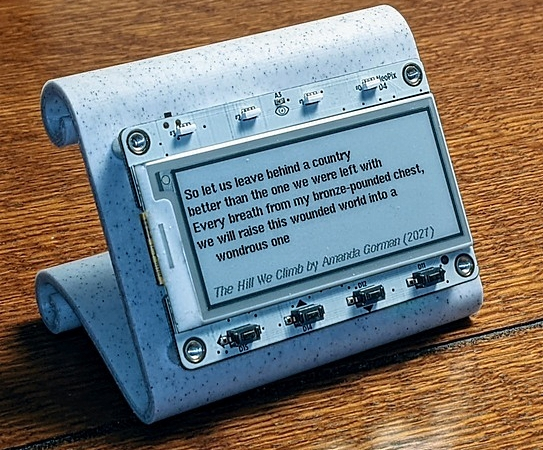](https://circuitpython.org/)

I also updated the "Protomatter" library for RGBMatrix.  This version adds support for stacked or "tiled" displays-For instance, you can now take 4 64x32 displays, arrange them as two rows of two, and use them as a virtual 128x64 display. This feature is in the first 6.2 alpha release.  An update to the matrixportal library and the guide page are on the way as well.

[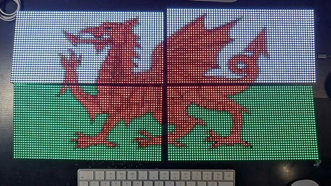](https://circuitpython.org/)

**Kattni**

I worked on a lot of miscellaneous this week, as we spent the week getting caught up with RP2040 launch whatnot. I updated the MPR121 guide to include the STEMMA QT revision, and everything that goes with that such as new wiring diagrams and images. I created a repo for a new CircuitPython library called DisplayIO_Layout that will initially be populated with a grid layout concept from @foamyguy and @kmatch98. I used the base code in a personal project and I'm really looking forward to it being available as a library for others to use. I fixed up a couple of wiring diagrams that were done up wrong. I merged a PR from a community contributor on the CircuitPlayground library to add further configuration for tap, and then removed some unnecessary code now that we have CircuitPython 6.x stable and beta in play. Finally, I've been keeping up with questions on Discord regarding the new Pico and its RP2040 chip as folks are getting their new boards and trying them out with CircuitPython.

**Lucian**

This past week, I've been debugging Socket, moving through a list of new issues and concerns as more people get their hands on the module and start testing. I also took a little time to get up to date on the features of the newly revealed RP2040, and have gotten some new low power monitoring tools, so I'm looking forward to contributing to those projects as well.

**Melissa**

This past week I mostly worked on closing a variety of GitHub issues and reviewing some GitHub Pull Requests. I also took a look at Home Assistant and figuring out what is required to get some of our sensors working. I ended up using CircuitPython to publish messages directly to MQTT and added a device into the configuration. I will be working on writing a guide, so keep an eye out for that.

**Scott**

This week was a whirlwind with the launch of the RP2040. I've been answering lots of questions continuing to do a bunch of reviews.

My next goal is to add audio playback support to the RP2040. It's been a bit slow to get my brain back in audio mode but I hope to have something playing for Friday's stream. (I'm hoping to knock out PWM and I2S output.)

## Upcoming events!

FOSDEM is a free and non-commercial event organised by the community for the community. Typically hosted in Brussels, Belgium, FOSDEM 2021 is taking place online February 6-7, 2021. This year, there will be a Python Developer Room. Details - [Adafruit Blog](https://blog.adafruit.com/2020/12/08/fosdem-2021-python-developer-room-python/).

PyCascades is a regional PyCon in the Pacific Northwest, celebrating the west coast Python developer and user community. Held online February 19th — 21st, 2021 - [PyCascades](https://2021.pycascades.com/).

The 2021 Open Hardware summit will be held online, Friday April 9, 2021. The summit will be livestreamed, but ticket holders will have access to additional interactive portions of the summit like meet-and-greets, workshops, and sponsor booths. Find details, including ticket and sponsorship information at [2021.oshwa.org](https://2021.oshwa.org/) - [OSHWA](https://www.oshwa.org/2020/11/16/announcing-the-2021-open-hardware-summit/).

The online GeoPython conference is focused on Python and Geo, its toolkits and applications. April 22-23, 2021 - [https://2021.geopython.net/](https://2021.geopython.net/).

PyCon US, the annual official annual Python gathering, has been announced to be held online May 12-15, 2021. Sprints will be held May 16-18, 2021. More information and signups at [https://us.pycon.org/2021/](https://us.pycon.org/2021/)

**Send Your Events In**

As for other events, with the COVID pandemic, most in-person events are postponed or cancelled. If you know of virtual events or events that may occur in the future, please let us know on Discord or on Twitter with hashtag #CircuitPython.

## Latest releases

CircuitPython's stable release is [#.#.#](https://github.com/adafruit/circuitpython/releases/latest) and its unstable release is [#.#.#-##.#](https://github.com/adafruit/circuitpython/releases). New to CircuitPython? Start with our [Welcome to CircuitPython Guide](https://learn.adafruit.com/welcome-to-circuitpython).

[2020####](https://github.com/adafruit/Adafruit_CircuitPython_Bundle/releases/latest) is the latest CircuitPython library bundle.

[v#.#.#](https://micropython.org/download) is the latest MicroPython release. Documentation for it is [here](http://docs.micropython.org/en/latest/pyboard/).

[#.#.#](https://www.python.org/downloads/) is the latest Python release. The latest pre-release version is [#.#.#](https://www.python.org/download/pre-releases/).

[2217 Stars](https://github.com/adafruit/circuitpython/stargazers) Like CircuitPython? [Star it on GitHub!](https://github.com/adafruit/circuitpython)

## Call for help -- Translating CircuitPython is now easier than ever!

One important feature of CircuitPython is translated control and error messages.

With the help of fellow open source project [Weblate](https://weblate.org/), we're making it even easier to add or improve translations.

Sign in with an existing account such as Github, Google or Facebook and start contributing through a simple web interface. No forks or pull requests needed!

As always, if you run into trouble join us on [Discord](https://adafru.it/discord), we're here to help.

## jobs.adafruit.com - Find a dream job, find great candidates!

[jobs.adafruit.com](https://jobs.adafruit.com/) has returned and folks are posting their skills (including CircuitPython) and companies are looking for talented makers to join their companies - from Digi-Key, to Hackaday, Microcenter, Raspberry Pi and more.

**Job of the Week**

Community Game Designer - Hack Club - [Adafruit Jobs Board](https://jobs.adafruit.com/job/community-game-designer/).

> You hear a friendly dragon whisper "hack club is cool". You're inclined to agree. You find yourself compelled to type the following into your terminal to learn about the open game designer position at hack club: $ ssh jobs.hackclub.com

## ICYMI - In case you missed it

The wonderful world of Python on hardware! This is our Python video-newsletter-podcast! The news comes from the Python community, Discord, Adafruit communities and more and is reviewed on ASK an ENGINEER Wednesdays. The complete Python on Hardware weekly videocast [playlist is here](https://www.youtube.com/playlist?list=PLjF7R1fz_OOXRMjM7Sm0J2Xt6H81TdDev). 

This video podcast is on [iTunes](https://itunes.apple.com/us/podcast/python-on-hardware/id1451685192?mt=2), [YouTube](http://adafru.it/pohepisodes), [IGTV (Instagram TV](https://www.instagram.com/adafruit/channel/)), and [XML](https://itunes.apple.com/us/podcast/python-on-hardware/id1451685192?mt=2).

[Weekly community chat on Adafruit Discord server CircuitPython channel - Audio / Podcast edition](https://itunes.apple.com/us/podcast/circuitpython-weekly-meeting/id1451685016) - Audio from the Discord chat space for CircuitPython, meetings are usually Mondays at 2pm ET, this is the audio version on [iTunes](https://itunes.apple.com/us/podcast/circuitpython-weekly-meeting/id1451685016), Pocket Casts, [Spotify](https://adafru.it/spotify), and [XML feed](https://adafruit-podcasts.s3.amazonaws.com/circuitpython_weekly_meeting/audio-podcast.xml).

And lastly, we are working up a one-spot destination for all things podcast-able here - [podcasts.adafruit.com](https://podcasts.adafruit.com/)

## Contribute!

The CircuitPython Weekly Newsletter is a CircuitPython community-run newsletter emailed every Tuesday. The complete [archives are here](https://www.adafruitdaily.com/category/circuitpython/). It highlights the latest CircuitPython related news from around the web including Python and MicroPython developments. To contribute, edit next week's draft [on GitHub](https://github.com/adafruit/circuitpython-weekly-newsletter/tree/gh-pages/_drafts) and [submit a pull request](https://help.github.com/articles/editing-files-in-your-repository/) with the changes. You may also tag your information on Twitter with #CircuitPython. 

Join our [Discord](https://adafru.it/discord) or [post to the forum](https://forums.adafruit.com/viewforum.php?f=60) for any further questions.
