- [X] Kattni updates
- [ ] change date
- [ ] update title
- [ ] Feature story
- [ ] Update  for images
- [ ] Update ICYDNCI
- [ ] All images 550w max only
- [ ] Link "View this email in your browser."

News Sources

- [python.org](https://www.python.org/)
- [Python Insider - dev team blog](https://pythoninsider.blogspot.com/)

View this email in your browser.

Welcome to the latest Python on Microcontrollers newsletter, brought you by the community! We're on [Discord](https://discord.gg/HYqvREz), [Twitter](https://twitter.com/search?q=circuitpython&src=typed_query&f=live), and for past newsletters - [view them all here](https://www.adafruitdaily.com/category/circuitpython/). If you're reading this on the web, [subscribe here](https://www.adafruitdaily.com/). Let's get started!

## CircuitPython 6.2.0 Beta 2 Released!

CircuitPython 6.2.0 Beta 2 was recently released. This is the third beta release of CircuitPython 6.2.0. This release, 6.2.0-beta.2, contains fixes and improvements, most notably for RP2040 and ESP32-S2 - [Adafruit Blog](https://blog.adafruit.com/2021/02/10/circuitpython-6-2-0-beta-2-released/)

## Visual Studio Code comes to Raspberry Pi

Visual Studio Code comes to Raspberry Pi. As well as supporting Debian Linux on x64, there are now builds for ARM and ARM64 – both of which can run on Raspberry Pi OS (the ARM build on Raspberry Pi OS, the ARM64 on the beta of the 64-bit Raspberry Pi OS)  - [Raspberry Pi Blog](https://www.raspberrypi.org/blog/visual-studio-code-comes-to-raspberry-pi/)

## The Pico Producer - a Raspberry Pi Pico-based 12 Key HID Keyboard

[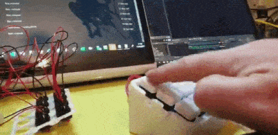](https://twitter.com/pete_codes/status/1359975352043528193)

[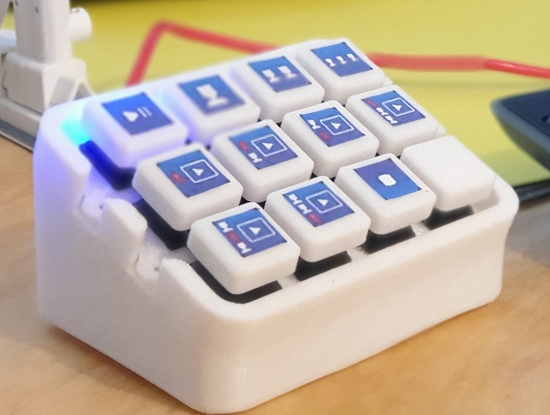](https://twitter.com/pete_codes/status/1360246770467536902)

[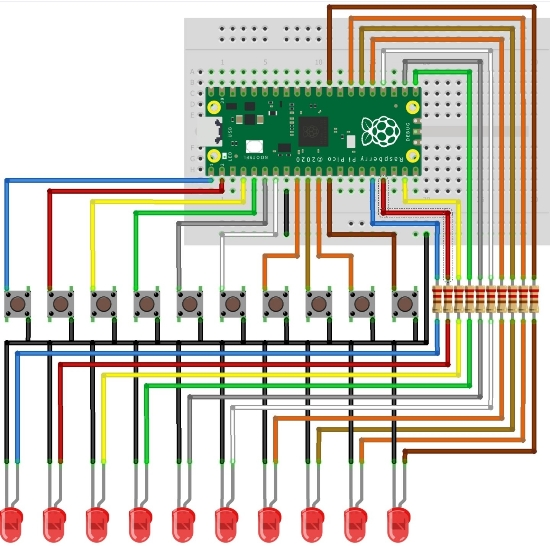](https://twitter.com/pete_codes/status/1358797979482742788)

Pico Producer is an OBS Controller using a Raspberry Pi Pico, a 3D printed case and CircuitPython - [GitHub](https://github.com/pjgpetecodes/pico-streamdeck) and [Twitter](https://twitter.com/pete_codes/status/1360012348426252289).

## A Drum Machine with a Raspberry Pi Pico 

[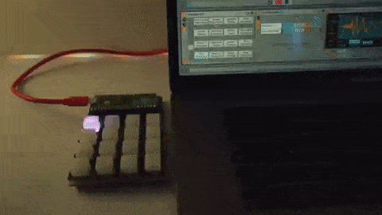](https://twitter.com/digitalfx_/status/1359183617533091841)

A USB Midi 16 channel step sequencer for Raspberry Pi Pico, written in CircuitPython v6.2.0 - [Twitter](https://twitter.com/digitalfx_/status/1359183617533091841) and code on [GitHub](https://github.com/pixlwave/Pico/blob/main/seq2.py).

## CircuitPython Deep Dive Stream with Scott Shawcroft

[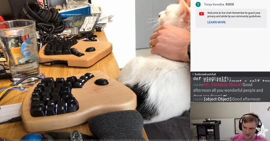](https://youtu.be/5UKr0fT51ro)

[This week](https://youtu.be/5UKr0fT51ro), Scott streams his work on Raspberry Pi RP2040 audio work.

You can see the latest video and past videos on the Adafruit YouTube channel under the Deep Dive playlist - [YouTube](https://www.youtube.com/playlist?list=PLjF7R1fz_OOXBHlu9msoXq2jQN4JpCk8A).

## News from around the web!

A Valentine's heart display using a Raspberry Pi Pico, a Pimoroni pico display and MicroPython - [Twitter](https://twitter.com/GeekMomProjects/status/1361074690987417602).

An MIDI controller using a Raspberry Pi Pico with a Pimoroni RGB Keypad and Adafruit CircuitPython. Thanks to Sandy MacDonald for the code and iPad Pro - [Twitter](https://twitter.com/andy_leer/status/1357760512495337475) and [GitHub](https://gist.github.com/sandyjmacdonald/804dc737e7cb798d1b4fa34adc87e2d4).

Hacking a RGBW photo ring light with a Raspberry Pi Pico running CircuitPython - [Twitter](https://twitter.com/timonsku/status/1359673793287962626).

A wireless, bluetooth macro keyboard, powered by an Adafruit ItsyBitsy nRF52840 and CircuitPython - [Twitter](https://twitter.com/chardane/status/1361180152550420480).

[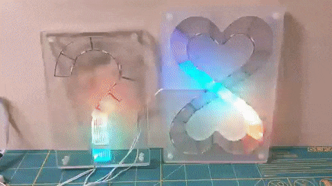](https://twitter.com/GeekMomProjects/status/1359339918233792513)

Playing around with LED strips embedded in acrylic (both clear and translucent) - [Twitter](https://twitter.com/GeekMomProjects/status/1359339918233792513).

[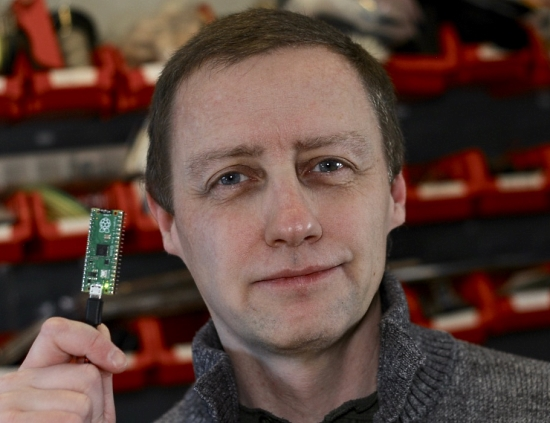](https://www.raspberrypi.org/blog/keeping-secrets-and-writing-about-raspberry-silicon/)

Keeping secrets and writing about Raspberry silicon by Alasdair Allan- [Raspberry Pi Blog](https://www.raspberrypi.org/blog/keeping-secrets-and-writing-about-raspberry-silicon/).

Receiving MIDI on the forthcoming RP2040-powered Tiny2040 from Pimoroni. MIDI notes over USB make the LED light red, but you could hook up a whole chain of NeoPixels and have them blink in time to your music, or have solenoids hit a real drum, you name it! Programmed in CircuitPython - [Twitter](https://twitter.com/sandyjmacdonald/status/1360303486034976773).

[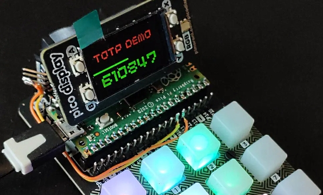](https://www.hackster.io/news/picoth-is-a-raspberry-pi-pico-based-2fa-gadget-9d6dc81a8043)

Picoth Is a Raspberry Pi Pico-Based 2FA Gadget - [hackster.io](https://www.hackster.io/news/picoth-is-a-raspberry-pi-pico-based-2fa-gadget-9d6dc81a8043).

[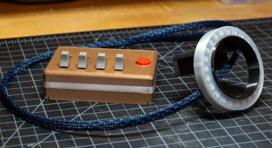](http://www.southernfriedscience.com/build-your-own-3d-printed-ring-light-to-upgrade-your-remote-meetings/)

Build Your Own 3D-printed Ring Light to Upgrade Your Remote Meetings, uses a Circuit Playground Bluefruit, NeoPixels, and CircuitPython - [Southern Fried Science](http://www.southernfriedscience.com/build-your-own-3d-printed-ring-light-to-upgrade-your-remote-meetings/).

[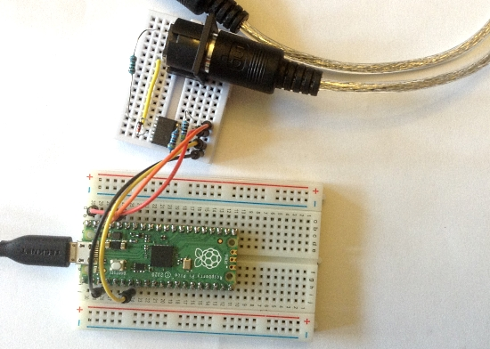](https://diyelectromusic.wordpress.com/2021/02/15/midi-in-for-3-3v-microcontrollers/)

MIDI In for 3.3V Microcontrollers - using a Raspberry Pi Pico or Circuit Playground Express and CircuitPython/MicroPython  - [DIYelectromusic](https://diyelectromusic.wordpress.com/2021/02/15/midi-in-for-3-3v-microcontrollers/) via [Twitter](https://twitter.com/diyelectromusic/status/1361338485215539203).

[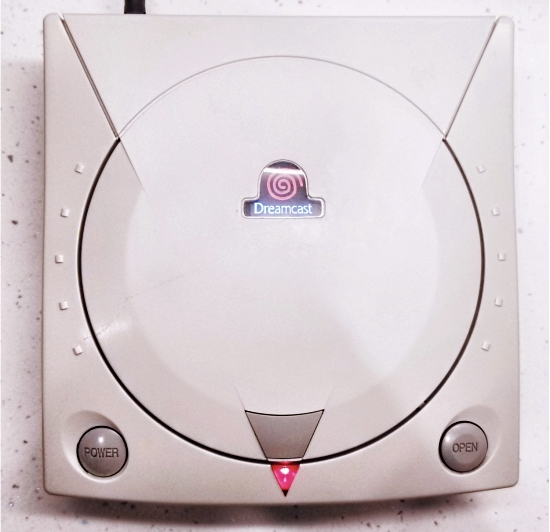](https://www.cosmicbren.com/post/ultimatedreamcast)

Adding an animated Sega Dreamcast badge using an Adafruit Clue and CircuitPython - [Cosmic Bren](https://www.cosmicbren.com/post/ultimatedreamcast) and [Hackaday](https://hackaday.com/2021/02/11/restored-dreamcast-is-a-sega-fans-dream-come-true/).

Making a USB HID Auto Clicker with Raspberry Pi Pico and CircuitPython - [YouTube](https://youtu.be/onBkPkaqDnk).

Tweeting from a Raspberry Pi Pico (using HID keyboard and CircuitPython) - [Twitter](https://twitter.com/ben_everard/status/1359545115346354181).

[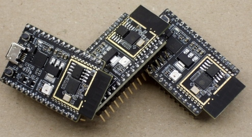](url)

Hands-on: The RISC-V ESP32-C3 will be your new ESP8266 - [Hackaday](https://hackaday.com/2021/02/08/hands-on-the-risc-v-esp32-c3-will-be-your-new-esp8266/) via [Twitter](https://twitter.com/MisterTechBlog/status/1358810448653524998).

[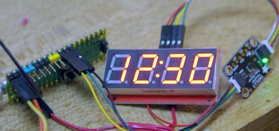](https://twitter.com/DenshiClub/status/1358924932785209344)

A Raspberry Pi Pico connected to an HT16K33 Display with CircuitPython - [Twitter](https://twitter.com/DenshiClub/status/1358924932785209344).

[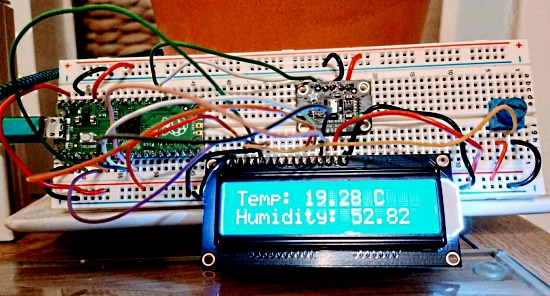](https://twitter.com/kevpartner/status/1359465914547269634)

A temperature and Humidity display with Raspberry Pi Pico, Adafruit sensor and CircuitPython - [Twitter](https://twitter.com/kevpartner/status/1359465914547269634).

Making a PyPortal NPR Station with CircuitPython - [GitHub](https://github.com/jefforulez/pyportal-npr) via [Twitter](https://twitter.com/jefforulez/status/1359157583785910274).

Building an environment for Raspberry Pi Pico development with CircuitPython in Windows (Japanese) - [Twitter](https://twitter.com/sin_deviding/status/1359411011686522881) and [Blog](https://rikoubou.hatenablog.com/entry/2021/02/10/165551).

[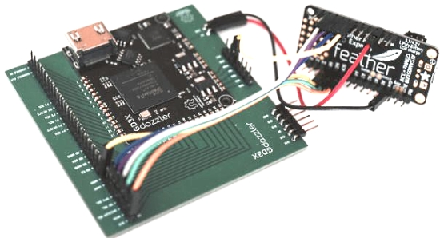](https://tinyletter.com/jamesbowman/letters/circuitpython-and-gd3x-progress)

CircuitPython and GD3X progress: GD3X graphics boards interfaced to an Adafruit Feather M4 Express, Raspberry Pi Pico and Teensy 4.0 - [tinyletter](https://tinyletter.com/jamesbowman/letters/circuitpython-and-gd3x-progress).

[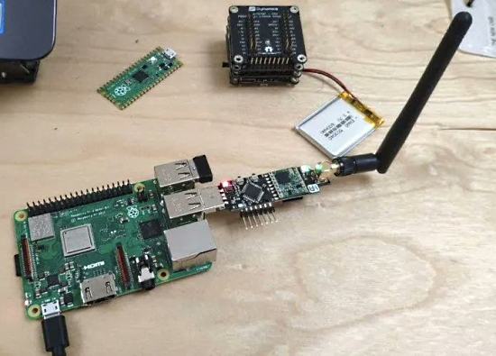](https://twitter.com/Hacksterio/status/1359907310735421453)

BH Dynamics' DynaLoRa-USB Offers an Arduino, CircuitPython Entry Point for LoRa Experimentation - [hackster.io](https://www.hackster.io/news/bh-dynamics-dynalora-usb-offers-an-arduino-circuitpython-entry-point-for-lora-experimentation-75c03c67e0af) via [Twitter](https://twitter.com/Hacksterio/status/1359907310735421453).

A Python Library to enable a Raspberry Pi to control many different Electrical Motors, like BLDC, PMSM, DC, and ACIM, in a single platform - [SOLO](https://www.solomotorcontrollers.com/python-library-for-raspberry-pi-news/) via [Twitter](https://twitter.com/SOLOcontrol/status/1359957141361156102).

text - [site](url).

text - [site](url).

[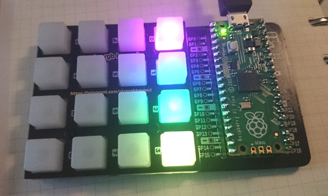](https://twitter.com/biglesp/status/1359092003473088516)

A colorful memory game with Raspberry Pi Pico and MicroPython - [Twitter](https://twitter.com/biglesp/status/1359092003473088516).

MicroWebSrv2 is the new powerful embedded Web Server for MicroPython and CPython supporting route handlers, modules like WebSockets or PyhtmlTemplate and simultaneous requests in the thousands - [GitHub](https://github.com/jczic/MicroWebSrv2).

[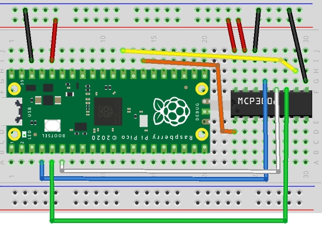](https://blog.rareschool.com/2021/02/raspberry-pi-pico-project-2-mcp3008.html)

Raspberry Pi Pico wired to an MCP3008 programmed in MicroPython - [RAREblog](https://blog.rareschool.com/2021/02/raspberry-pi-pico-project-2-mcp3008.html).

[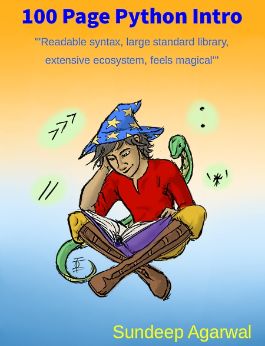](https://learnbyexample.github.io/100_page_python_intro/preface.html)

100 Page Python online guide - [GitHub](https://learnbyexample.github.io/100_page_python_intro/preface.html).

Blazing fast Python: Profiling Python applications using py-spy - [Medium](https://medium.com/build-smarter/blazing-fast-python-40a2b25b0495).

Web Scraping 101 with Python - [ScrapingBee](https://www.scrapingbee.com/blog/web-scraping-101-with-python/).

[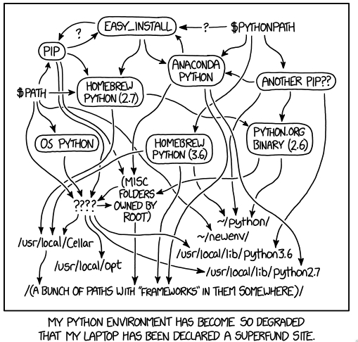](https://muttdata.ai/blog/2020/08/21/a-poetic-apology.html)

A Poetic Apology, or Why Should You Use Poetry to Manage Python Dependencies - [Mutt Data Blog](https://muttdata.ai/blog/2020/08/21/a-poetic-apology.html).

WTF Python - exploring and understanding Python through surprising snippets - [GitHub](https://github.com/satwikkansal/wtfpython).

Python “tricks” I can not live without - [gitconnected](https://levelup.gitconnected.com/python-tricks-i-can-not-live-without-87ae6aff3af8).

Python behind the scenes: how Python integers work - [TenThousandMeters](https://tenthousandmeters.com/blog/python-behind-the-scenes-8-how-python-integers-work/).

flynt - a tool to automatically convert old string literal formatting to f-strings - [GitHub](https://github.com/ikamensh/flynt).

finicky - easy data validation in Python - [GitHub](https://github.com/yaaminu/finicky).

Controversially, pattern matching accepted for Python 3.10 - [lwn.net](https://lwn.net/Articles/845480/).

Learn Python with the Women in Tech Personality Quiz - [locksleylk.com](https://www.locksleylk.com/2021/introPythonWorkshop/).

**#ICYDNCI What was the most popular, most clicked link, in [last week's newsletter](https://link)? [title](url).**

## New Boards Supported by CircuitPython

The number of supported microcontrollers and Single Board Computers (SBC) grows every week. This section outlines which boards have been included in CircuitPython or added to [CircuitPython.org](https://circuitpython.org/).

This week we had X new boards added!

- [Board name](url)

Looking to add a new board to CircuitPython? It's highly encouraged! Adafruit has four guides to help you do so:

- [How to Add a New Board to CircuitPython](https://learn.adafruit.com/how-to-add-a-new-board-to-circuitpython/overview)
- [How to add a New Board to the circuitpython.org website](https://learn.adafruit.com/how-to-add-a-new-board-to-the-circuitpython-org-website)
- [Adding a Single Board Computer to PlatformDetect for Blinka](https://learn.adafruit.com/adding-a-single-board-computer-to-platformdetect-for-blinka)
- [Adding a Single Board Computer to Blinka](https://learn.adafruit.com/adding-a-single-board-computer-to-blinka)

## New Learn Guides!

[QT Py Heart Shaped NeoPixel PCB](https://learn.adafruit.com/qtpy-heart-pcb) from [Noe and Pedro](https://learn.adafruit.com/users/pixil3d)

[Adafruit Sensirion SHT40 Temperature & Humidity Sensor](https://learn.adafruit.com/adafruit-sht40-temperature-humidity-sensor) from [Kattni](https://learn.adafruit.com/users/kattni)

## Updated Learn Guides!

[CircuitPython Essentials: CircuitPython Pins and Modules](https://learn.adafruit.com/circuitpython-essentials/circuitpython-pins-and-modules) from [Kattni](https://learn.adafruit.com/users/kattni)

## CircuitPython Libraries!

CircuitPython support for hardware continues to grow. We are adding support for new sensors and breakouts all the time, as well as improving on the drivers we already have. As we add more libraries and update current ones, you can keep up with all the changes right here!

For the latest libraries, download the [Adafruit CircuitPython Library Bundle](https://circuitpython.org/libraries). For the latest community contributed libraries, download the [CircuitPython Community Bundle](https://github.com/adafruit/CircuitPython_Community_Bundle/releases).

If you'd like to contribute, CircuitPython libraries are a great place to start. Have an idea for a new driver? File an issue on [CircuitPython](https://github.com/adafruit/circuitpython/issues)! Have you written a library you'd like to make available? Submit it to the [CircuitPython Community Bundle](https://github.com/adafruit/CircuitPython_Community_Bundle). Interested in helping with current libraries? Check out the [CircuitPython.org Contributing page](https://circuitpython.org/contributing). We've included open pull requests and issues from the libraries, and details about repo-level issues that need to be addressed. We have a guide on [contributing to CircuitPython with Git and Github](https://learn.adafruit.com/contribute-to-circuitpython-with-git-and-github) if you need help getting started. You can also find us in the #circuitpython channel on the [Adafruit Discord](https://adafru.it/discord).

You can check out this [list of all the Adafruit CircuitPython libraries and drivers available](https://github.com/adafruit/Adafruit_CircuitPython_Bundle/blob/master/circuitpython_library_list.md). 

The current number of CircuitPython libraries is **298**!

**Updated Libraries!**

Here's this week's updated CircuitPython libraries:

 * [Adafruit_CircuitPython_SI7021](https://github.com/adafruit/Adafruit_CircuitPython_SI7021)
 * [Adafruit_CircuitPython_AdafruitIO](https://github.com/adafruit/Adafruit_CircuitPython_AdafruitIO)
 * [Adafruit_CircuitPython_ProgressBar](https://github.com/adafruit/Adafruit_CircuitPython_ProgressBar)
 * [Adafruit_CircuitPython_DymoScale](https://github.com/adafruit/Adafruit_CircuitPython_DymoScale)
 * [Adafruit_CircuitPython_RFM69](https://github.com/adafruit/Adafruit_CircuitPython_RFM69)
 * [Adafruit_CircuitPython_PIOASM](https://github.com/adafruit/Adafruit_CircuitPython_PIOASM)
 * [Adafruit_CircuitPython_MiniMQTT](https://github.com/adafruit/Adafruit_CircuitPython_MiniMQTT)
 * [Adafruit_CircuitPython_DisplayIO_SH1107](https://github.com/adafruit/Adafruit_CircuitPython_DisplayIO_SH1107)
 * [Adafruit_CircuitPython_RTTTL](https://github.com/adafruit/Adafruit_CircuitPython_RTTTL)
 * [Adafruit_CircuitPython_FocalTouch](https://github.com/adafruit/Adafruit_CircuitPython_FocalTouch)
 * [Adafruit_CircuitPython_CharLCD](https://github.com/adafruit/Adafruit_CircuitPython_CharLCD)
 * [Adafruit_CircuitPython_EMC2101](https://github.com/adafruit/Adafruit_CircuitPython_EMC2101)
 * [Adafruit_CircuitPython_Requests](https://github.com/adafruit/Adafruit_CircuitPython_Requests)
 * [Adafruit_CircuitPython_PyPortal](https://github.com/adafruit/Adafruit_CircuitPython_PyPortal)
 * [Adafruit_CircuitPython_SimpleIO](https://github.com/adafruit/Adafruit_CircuitPython_SimpleIO)
 * [Adafruit_Blinka](https://github.com/adafruit/Adafruit_Blinka)
 * [Adafruit_Python_PlatformDetect](https://github.com/adafruit/Adafruit_Python_PlatformDetect)
 * [CircuitPython_Community_Bundle](https://github.com/adafruit/CircuitPython_Community_Bundle)

## What’s the team up to this week?

What is the team up to this week? Let’s check in!

**Dan**

I released CircuitPython 6.2.0-beta.2, which has dozens of fixes and improvements, including fixes for some serious issues.

I fixed the `adafruit_sdcard` library to work properly with the new native `adafruit_bus_device` module. I've also been investigating I2C problems on the RP2040. One was a red herring, and the other seems peculiar to a particular sensor.

I'm continuing to work on the second USB serial channel for CircuitPython. Scott and I discussed and settled on the outlines of the Python API. There will probably be a `usb_cdc` module, with a fixed instance of the serial object, but with the flexibility to add more later.

**Jeff**

After taking a week off to read a book & work on my own projects, I'm back! I'm learning about the RP2040's "PIO" peripheral and with the help of community members I resolved a problem affecting neopixels on the Raspberry Pi Pico and other RP2040 boards. I also made a change to the tools that build the various "bundles", which should help circup by providing the "requirements.txt" files directly within the bundle; circup uses "requirements.txt" to decide what other libraries are needed to go with the requested library.

**Kattni**

This week I finalised the [new page](https://learn.adafruit.com/circuitpython-essentials/circuitpython-pins-and-modules) in the CircuitPython Essentials guide, and got it mirrored into every CircuitPython-compatible microcontroller guide. It covers using `import board` and `dir(board)` to tell CircuitPython where to look for the hardware you connected to your project, and how to learn about what pins and board objects are available for your microcontroller. It also explains how to find the built-in modules available for your board.

I published the [SHT40 guide](https://learn.adafruit.com/adafruit-sht40-temperature-humidity-sensor) as well, which has everything you need to get started sensing temperature and humidity with this excellent sensor. I published the [ISO1540 guide] as well. I completed quite a bit of miscellaneous from my long to-do list. 

I'm currently working on the guide for the AW9523. It's nearly done, but needs some final touches. It should be live quite soon. I'm also adding at least one more example to the Getting Started with Raspberry Pi Pico and CircuitPython guide, which should also be available soon.

**Lucian**

This past week I fixed a number of internal errors in the Socket module, such as inconsistencies in internal types, connection failures for accepted sockets, and a multi-layered disconnection problem in the Requests library. I also resolved an issue with I2C not correctly sending a Repeated Start condition when requested. 

These issues required updates to my manual testing scripts, which have gradually accumulated over my time working on Circuitpython. Since many of these tests might be helpful to others doing reviews or trying to resolve their own issues, I'm working on a new manual tests directory to store and share them, along with associated documentation.

**Melissa**

This past week I worked on adding ESP32-S2 support to ESPHome. I had to get past a number of bugs. Unfortunately as I got closer to the end, I came to one that stopped me from progressing any further for the moment and that is WiFi refused to connect when I had I2C enabled. Even if I wasn't doing anything with it. I submitted a bug report to the package which I think is the culprit and I will be moving on to some other projects in the mean time.

**Scott**

This week I'm on the home stretch for audio playback with the RP2040. I got both single sample buffer and WaveFile playback with PWM audio. There is a pull request for it here: https://github.com/adafruit/circuitpython/pull/4167

I've begun work hooking up I2S which should be straightforward (fingers crossed.) Since we'll use the PIO for I2S, I'm also adding a few more APIs to the StateMachine class.

Once I'm out the audio weeds I'll be circling back to internal flash config with a possible detour to implement UART if no one has beat me to it.

Last night I also hacked a system to allow me to use my right hand on my keyboard for mouse clicks. I'm very happy with it so far. Tweet for it is here: https://twitter.com/tannewt/status/1359937799173021699

## Upcoming events!

PyCascades is a regional PyCon in the Pacific Northwest, celebrating the west coast Python developer and user community. Held online February 19th — 21st, 2021 - [PyCascades](https://2021.pycascades.com/).

The 2021 Open Hardware summit will be held online, Friday April 9, 2021. The summit will be livestreamed, but ticket holders will have access to additional interactive portions of the summit like meet-and-greets, workshops, and sponsor booths. Find details, including ticket and sponsorship information at [2021.oshwa.org](https://2021.oshwa.org/) - [OSHWA](https://www.oshwa.org/2020/11/16/announcing-the-2021-open-hardware-summit/).

The online GeoPython conference is focused on Python and Geo, its toolkits and applications. April 22-23, 2021 - [https://2021.geopython.net/](https://2021.geopython.net/).

PyCon US, the annual official annual Python gathering, has been announced to be held online May 12-15, 2021. Sprints will be held May 16-18, 2021. More information and signups at [https://us.pycon.org/2021/](https://us.pycon.org/2021/)

**Send Your Events In**

As for other events, with the COVID pandemic, most in-person events are postponed or cancelled. If you know of virtual events or events that may occur in the future, please let us know on Discord or on Twitter with hashtag #CircuitPython.

## Latest releases

CircuitPython's stable release is [#.#.#](https://github.com/adafruit/circuitpython/releases/latest) and its unstable release is [#.#.#-##.#](https://github.com/adafruit/circuitpython/releases). New to CircuitPython? Start with our [Welcome to CircuitPython Guide](https://learn.adafruit.com/welcome-to-circuitpython).

[2021####](https://github.com/adafruit/Adafruit_CircuitPython_Bundle/releases/latest) is the latest CircuitPython library bundle.

[v#.#.#](https://micropython.org/download) is the latest MicroPython release. Documentation for it is [here](http://docs.micropython.org/en/latest/pyboard/).

[#.#.#](https://www.python.org/downloads/) is the latest Python release. The latest pre-release version is [#.#.#](https://www.python.org/download/pre-releases/).

[2291 Stars](https://github.com/adafruit/circuitpython/stargazers) Like CircuitPython? [Star it on GitHub!](https://github.com/adafruit/circuitpython)

## Call for help -- Translating CircuitPython is now easier than ever!

One important feature of CircuitPython is translated control and error messages.

With the help of fellow open source project [Weblate](https://weblate.org/), we're making it even easier to add or improve translations.

Sign in with an existing account such as Github, Google or Facebook and start contributing through a simple web interface. No forks or pull requests needed!

As always, if you run into trouble join us on [Discord](https://adafru.it/discord), we're here to help.

## jobs.adafruit.com - Find a dream job, find great candidates!

[jobs.adafruit.com](https://jobs.adafruit.com/) has returned and folks are posting their skills (including CircuitPython) and companies are looking for talented makers to join their companies - from Digi-Key, to Hackaday, Microcenter, Raspberry Pi and more.

**Job of the Week**

text - [Adafruit Jobs Board](https://jobs.adafruit.com/).

## NUMBER thanks!

The Adafruit Discord community, where we do all our CircuitPython development in the open, reached over NUMBER humans, thank you!  Adafruit believes Discord offers a unique way for CircuitPython folks to connect. Join today at [https://adafru.it/discord](https://adafru.it/discord).

## ICYMI - In case you missed it

The wonderful world of Python on hardware! This is our Python video-newsletter-podcast! The news comes from the Python community, Discord, Adafruit communities and more and is reviewed on ASK an ENGINEER Wednesdays. The complete Python on Hardware weekly videocast [playlist is here](https://www.youtube.com/playlist?list=PLjF7R1fz_OOXRMjM7Sm0J2Xt6H81TdDev). 

This video podcast is on [iTunes](https://itunes.apple.com/us/podcast/python-on-hardware/id1451685192?mt=2), [YouTube](http://adafru.it/pohepisodes), [IGTV (Instagram TV](https://www.instagram.com/adafruit/channel/)), and [XML](https://itunes.apple.com/us/podcast/python-on-hardware/id1451685192?mt=2).

[Weekly community chat on Adafruit Discord server CircuitPython channel - Audio / Podcast edition](https://itunes.apple.com/us/podcast/circuitpython-weekly-meeting/id1451685016) - Audio from the Discord chat space for CircuitPython, meetings are usually Mondays at 2pm ET, this is the audio version on [iTunes](https://itunes.apple.com/us/podcast/circuitpython-weekly-meeting/id1451685016), Pocket Casts, [Spotify](https://adafru.it/spotify), and [XML feed](https://adafruit-podcasts.s3.amazonaws.com/circuitpython_weekly_meeting/audio-podcast.xml).

And lastly, we are working up a one-spot destination for all things podcast-able here - [podcasts.adafruit.com](https://podcasts.adafruit.com/)

## Codecademy "Learn Hardware Programming with CircuitPython"

Codecademy, an online interactive learning platform used by more than 45 million people, has teamed up with the leading manufacturer in STEAM electronics, Adafruit Industries, to create a coding course, "Learn Hardware Programming with CircuitPython". The course is now available in the [Codecademy catalog](https://www.codecademy.com/learn/learn-circuitpython?utm_source=adafruit&utm_medium=partners&utm_campaign=circuitplayground&utm_content=pythononhardwarenewsletter).

Python is a highly versatile, easy to learn programming language that a wide range of people, from visual effects artists in Hollywood to mission control at NASA, use to quickly solve problems. But you don’t need to be a rocket scientist to accomplish amazing things with it. This new course introduces programmers to Python by way of a microcontroller — CircuitPython — which is a Python-based programming language optimized for use on hardware.

CircuitPython’s hardware-ready design makes it easier than ever to program a variety of single-board computers, and this course gets you from no experience to working prototype faster than ever before. Codecademy’s interactive learning environment, combined with Adafruit's highly rated Circuit Playground Express, present aspiring hardware hackers with a never-before-seen opportunity to learn hardware programming seamlessly online.

Whether for those who are new to programming, or for those who want to expand their skill set to include physical computing, this course will have students getting familiar with Python and creating incredible projects along the way. By the end, students will have built their own bike lights, drum machine, and even a moisture detector that can tell when it's time to water a plant.

Visit Codecademy to access the [Learn Hardware Programming with CircuitPython](https://www.codecademy.com/learn/learn-circuitpython?utm_source=adafruit&utm_medium=partners&utm_campaign=circuitplayground&utm_content=pythononhardwarenewsletter) course and Adafruit to purchase a [Circuit Playground Express](https://www.adafruit.com/product/3333).

Codecademy has helped more than 45 million people around the world upgrade their careers with technology skills. The company’s online interactive learning platform is widely recognized for providing an accessible, flexible, and engaging experience for beginners and experienced programmers alike. Codecademy has raised a total of $43 million from investors including Union Square Ventures, Kleiner Perkins, Index Ventures, Thrive Capital, Naspers, Yuri Milner and Richard Branson, most recently raising its $30 million Series C in July 2016.

## Contribute!

The CircuitPython Weekly Newsletter is a CircuitPython community-run newsletter emailed every Tuesday. The complete [archives are here](https://www.adafruitdaily.com/category/circuitpython/). It highlights the latest CircuitPython related news from around the web including Python and MicroPython developments. To contribute, edit next week's draft [on GitHub](https://github.com/adafruit/circuitpython-weekly-newsletter/tree/gh-pages/_drafts) and [submit a pull request](https://help.github.com/articles/editing-files-in-your-repository/) with the changes. You may also tag your information on Twitter with #CircuitPython. 

Join our [Discord](https://adafru.it/discord) or [post to the forum](https://forums.adafruit.com/viewforum.php?f=60) for any further questions.
