- [X] Kattni updates
- [ ] change date
- [ ] update title
- [ ] Feature story
- [ ] Update  for images
- [ ] Update ICYDNCI
- [ ] All images 550w max only
- [ ] Link "View this email in your browser."

News Sources

- [python.org](https://www.python.org/)
- [Python Insider - dev team blog](https://pythoninsider.blogspot.com/)

View this email in your browser.

Welcome to the latest Python on Microcontrollers newsletter, brought you by the community! We're on [Discord](https://discord.gg/HYqvREz), [Twitter](https://twitter.com/search?q=circuitpython&src=typed_query&f=live), and for past newsletters - [view them all here](https://www.adafruitdaily.com/category/circuitpython/). If you're reading this on the web, [subscribe here](https://www.adafruitdaily.com/). Let's get started!

## 70 Single Board Computers now support CiurcuitPython!

[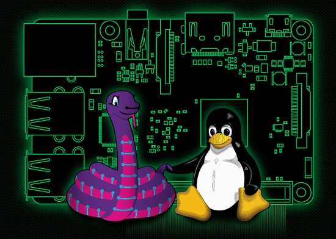](https://circuitpython.org/blinka)

Blinka brings CircuitPython APIs and CircuitPython libraries to single board computers (SBCs). It is a pip installable Python library that runs in normal "desktop" Python. One can port their microcontroller code to an SBC or visa versa! 

Blinka reached a milestone this week - it now supports 70 different single board computers!  - [CircuitPython.Org](https://circuitpython.org/blinka).

## CircuitPython Subreddit reaches 2,000 members!

[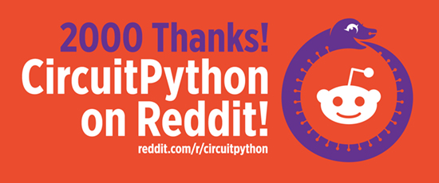](https://blog.adafruit.com/2021/02/25/the-circuitpython-subreddit-hits-2000-members-circuitpython-python-reddit-circuitpython-adafruit/)

The CircuitPython subreddit on Reddit.com crossed the 2,000 members mark! Thank you to our Reddit readers for choosing to get your Python fix on our subreddit - [Blog post](https://blog.adafruit.com/2021/02/25/the-circuitpython-subreddit-hits-2000-members-circuitpython-python-reddit-circuitpython-adafruit/).

## Python Developers Survey 2020 Results

[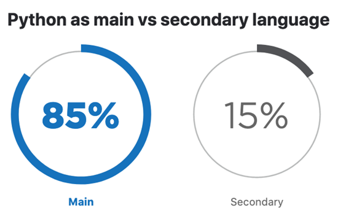](https://www.jetbrains.com/lp/python-developers-survey-2020/)
[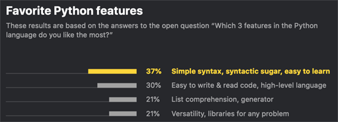](https://www.jetbrains.com/lp/python-developers-survey-2020/)
[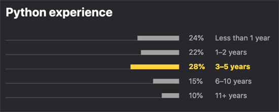](https://www.jetbrains.com/lp/python-developers-survey-2020/)

The Python Software Foundation are excited to share the results of the fourth official Python Developers Survey conducted with the help of JetBrains. More than 28,000 Python users from almost 200 countries took part in the survey this past October. With the help of the data collected, they are able to present the summarized results, identify the latest trends, and create a Python developer profile. - [Python Software Foundation](https://pyfound.blogspot.com/2021/02/python-developers-survey-2020-results.html) and [JetBrains](https://www.jetbrains.com/lp/python-developers-survey-2020/).

## Feature

.

text - [site](url)

## CircuitPython Deep Dive Stream with Scott Shawcroft

[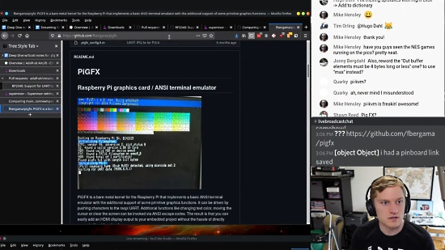](link)

[This week](link), Scott streams his work on .

You can see the latest video and past videos on the Adafruit YouTube channel under the Deep Dive playlist - [YouTube](https://www.youtube.com/playlist?list=PLjF7R1fz_OOXBHlu9msoXq2jQN4JpCk8A).

## News from around the web!

John Park streams his build of a Raspberry Pi Pico Mechanical Keyboard Build, programmable in CircuitPython - [YouTube](https://www.youtube.com/watch?v=OWGQSRKM2rA).

[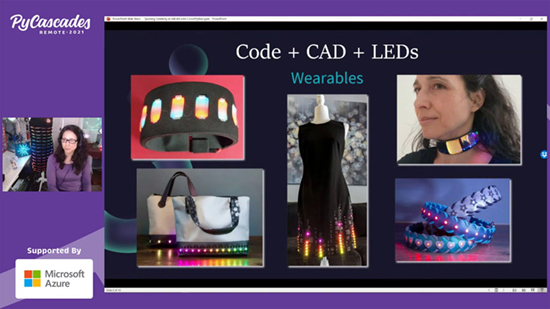](https://www.youtube.com/watch?v=voiBMj-RnEY)

Debra displays some of her works and discusses how she uses CircuitPython in her creations in this PyCascades presentation. - [YouTube](https://www.youtube.com/watch?v=voiBMj-RnEY).

[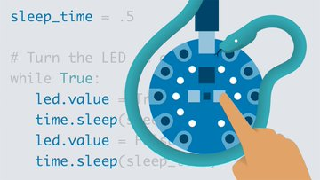](https://www.linkedin.com/learning/learning-circuitpython-with-circuit-playground-express/addressing-hardware-with-python)

New LinkedIn Learning course, Learning CircuitPython with Circuit Playground Express is now live - [LinkedIn](https://www.linkedin.com/learning/learning-circuitpython-with-circuit-playground-express/addressing-hardware-with-python) via [Twitter](https://twitter.com/robertgallup/status/1365352318544146437).

[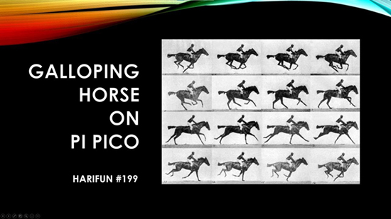](https://www.youtube.com/watch?v=cm2Fz9WTL1A)

Galloping Horse Animation on Pi Pico using CircuitPython - [YouTube](https://www.youtube.com/watch?v=cm2Fz9WTL1A) and [GitHub](https://github.com/hwiguna/HariFun_199_Galloping_Horse).

QT Py USB Media Knob, using a rotary encoder and NeoPixel ring - [GitHub](https://github.com/todbot/qtpy-knob) and [YouTube](https://www.youtube.com/watch?v=pt7JgoSlgOg).

FoamyGuy (Tim) stream from 2/20/21 covers CircuitPython library pull requests and development of RFM LoRa Radio project - [YouTube](https://www.youtube.com/watch?v=cU2HCM7k-_A).

[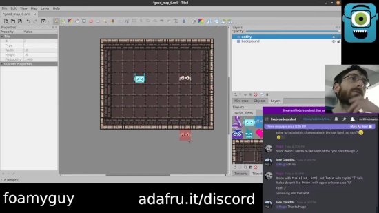](https://www.youtube.com/watch?v=UeRaBjqiUOI)

FoamyGuy (Tim) stream on 2/27/21 covers a few display_text PRs and work on Tiled game map editor file importing for CircuitPython - [YouTube](https://www.youtube.com/watch?v=UeRaBjqiUOI).

[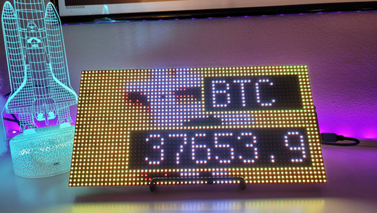](https://www.etsy.com/listing/957356177/led-pixels-bitcoin-and-crypto-live)

LED pixels Bitcoin and Crypto live updates - [Etsy](https://www.etsy.com/listing/957356177/led-pixels-bitcoin-and-crypto-live).

A (very) simple pure MicroPython plotting package - [GitHub](https://github.com/romilly/microplot).

[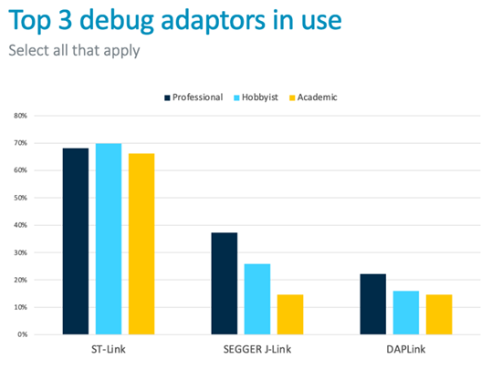](https://os.mbed.com/blog/entry/Results-of-2020-Mbed-Developer-Survey/)
[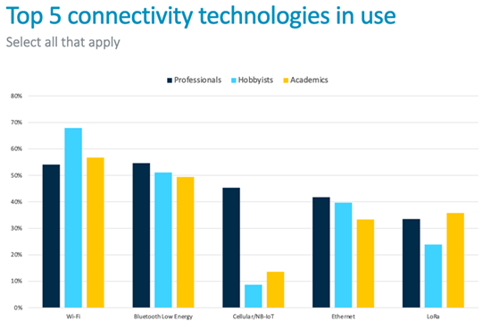](https://os.mbed.com/blog/entry/Results-of-2020-Mbed-Developer-Survey/)

The results of the 2020 MBed Developer Survey are available - [mbed.com](https://os.mbed.com/blog/entry/Results-of-2020-Mbed-Developer-Survey/).

Tom's Hardware review of Pimoroni Tiny 2040 board. - [Tom's Hardware](https://www.tomshardware.com/reviews/pimoroni-tiny-2040-review) via [Twitter](https://twitter.com/biglesp/status/1360592116943101953).

[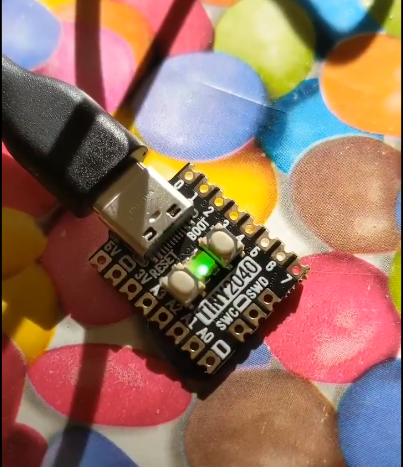](https://twitter.com/CannonFodder/status/1365290787848790022)

Color blink runnning on Pimoroni Tiny 2040 using CircuitPython and MicroPython - [Twitter](https://twitter.com/CannonFodder/status/1365290787848790022).

[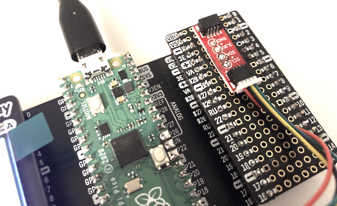](https://twitter.com/wildestpixel/status/1365177915298762752)

Adding a Stemma QT Connector to a Raspberry Pi Pico to communicate with an Adafruit PCT2075 in CircuitPython - [Twitter](https://twitter.com/wildestpixel/status/1365177915298762752).

[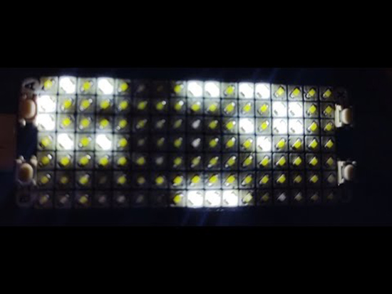](https://blog.adafruit.com/2021/02/26/conways-game-of-life-on-a-pimoroni-pico-scroll-pack-piday-raspberrypi-raspberry_pi/)

Conway's Game of Life on a Pico with a Pimoroni Pico Unicorn Pack. - [Adafruit Blog](https://blog.adafruit.com/2021/02/26/conways-game-of-life-on-a-pimoroni-pico-scroll-pack-piday-raspberrypi-raspberry_pi/).

LCARS style temperature display on MagTag - [Twitter](https://twitter.com/AstroBokonon/status/1365327937847758848).

[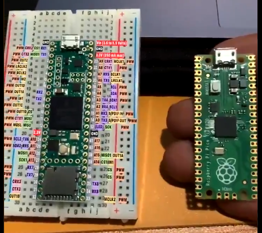](https://twitter.com/Trevs_Dev/status/1365344060098158592)

With the next Adafruit AR update, you’ll be able to display pinout overlays for the Teensy 4.1 and Raspberry pi Pico at the same time - [Twitter](https://twitter.com/Trevs_Dev/status/1365344060098158592).

A full color POV display using Raspberry Pi Pico and DotStar LED tape - [Hackster.io](https://www.hackster.io/H0meMadeGarbage/pov-display-using-raspberry-pi-pico-d6bc4f) via [Adafruit Blog](https://blog.adafruit.com/2021/02/26/pov-display-using-raspberry-pi-pico-piday-raspberrypi-raspberry_pi/).

Playing with Hardware: Learning about Hardware Programming with CircuitPython - [Twitch](https://www.twitch.tv/videos/929035443).

[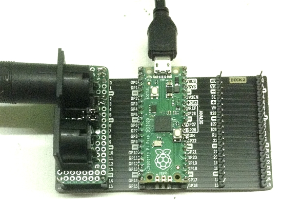](https://diyelectromusic.wordpress.com/2021/02/28/raspberry-pi-pico-midi-pack-interface/)

A Raspberry Pi Pico MIDI “pack” Interface - [DIY Electromusic Blog](https://diyelectromusic.wordpress.com/2021/02/28/raspberry-pi-pico-midi-pack-interface/).

[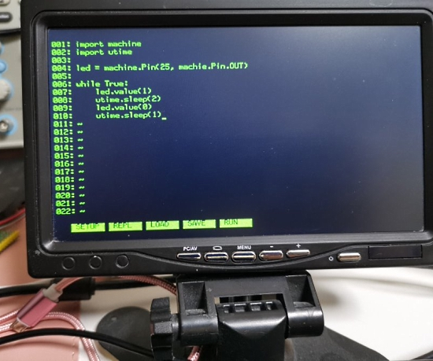](https://twitter.com/picocircuit/status/1364687846112550913)

A Raspberry Pi Pico based terminal running MicroPython with VGA viseo and a USB keyboard - [Twitter](https://twitter.com/picocircuit/status/1364687846112550913) (Japanese).

text - [site](url).

text - [site](url).

text - [site](url).

Learn about Brython, a Python implementation that runs in the browser - [Real Python](https://realpython.com/brython-python-in-browser/) via [Twitter](https://twitter.com/realpython/status/1364576146176770049).

scikit-rf is an Open Source package for RF/Microwave engineering implemented in the Python programming language - [scikit-rf.org](http://scikit-rf.org/) and [GitHub](https://github.com/scikit-rf/scikit-rf).

Convenient generic `print()` for C inspired by Python/JavaScript and other high-level languages. - [GitHub](https://github.com/exebook/generic-print).

**#ICYDNCI What was the most popular, most clicked link, in [last week's newsletter](https://link)? [title](url).**

## Coming soon

[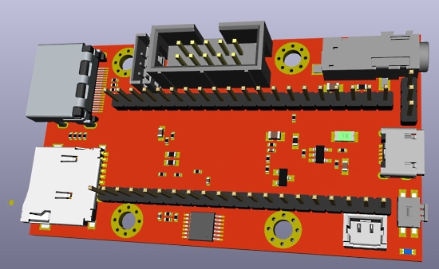](https://twitter.com/Olimex/status/1366359184116224003)

Olimex posts a RP2040-PICO-PC teaser - it's a small PC for a RP2040-PICO module. Video, Audio, SD-card, UEXT, I2C, Lipo battery, Reset, USB pwr, USB host for keyboard, Debug TxRx, SWD for JTAG debug. It's tagged CircuitPython so hopefully they help ensure compatibility - [Twitter](https://twitter.com/Olimex/status/1366359184116224003).

## New Boards Supported by CircuitPython

The number of supported microcontrollers and Single Board Computers (SBC) grows every week. This section outlines which boards have been included in CircuitPython or added to [CircuitPython.org](https://circuitpython.org/).

This week, there were 4 new boards added!

- [Orange Pi Zero Plus](https://circuitpython.org/blinka/orange_pi_zero_plus/)
- [LubanCat I.MX6ULL](https://circuitpython.org/blinka/lubancat_i.mx6ull/)
- [NanoPi Duo2](https://circuitpython.org/blinka/nanopi_duo2/)
- [Jetson TX2 Dev Kit](https://circuitpython.org/blinka/jetson_tx2_nx/)

Looking to add a new board to CircuitPython? It's highly encouraged! Adafruit has four guides to help you do so:

- [How to Add a New Board to CircuitPython](https://learn.adafruit.com/how-to-add-a-new-board-to-circuitpython/overview)
- [How to add a New Board to the circuitpython.org website](https://learn.adafruit.com/how-to-add-a-new-board-to-the-circuitpython-org-website)
- [Adding a Single Board Computer to PlatformDetect for Blinka](https://learn.adafruit.com/adding-a-single-board-computer-to-platformdetect-for-blinka)
- [Adding a Single Board Computer to Blinka](https://learn.adafruit.com/adding-a-single-board-computer-to-blinka)

## New Learn Guides!

[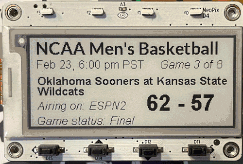](https://learn.adafruit.com/guides/latest)

[MagTag Sports Schedule Viewer](https://learn.adafruit.com/magtag-sports-schedule-viewer) from [John Park](https://learn.adafruit.com/users/johnpark)

[NeoPIO: Drive lots of LEDs with Raspberry Pi Pico](https://learn.adafruit.com/neopio-drive-lots-of-leds-with-raspberry-pi-pico) from [Jeff Epler](https://learn.adafruit.com/users/jepler)

## Updated Learn Guides!

[Getting Started with Raspberry Pi Pico and CircuitPython](https://learn.adafruit.com/getting-started-with-raspberry-pi-pico-circuitpython) from [Kattni](https://learn.adafruit.com/users/kattni)

## CircuitPython Libraries!

CircuitPython support for hardware continues to grow. We are adding support for new sensors and breakouts all the time, as well as improving on the drivers we already have. As we add more libraries and update current ones, you can keep up with all the changes right here!

For the latest libraries, download the [Adafruit CircuitPython Library Bundle](https://circuitpython.org/libraries). For the latest community contributed libraries, download the [CircuitPython Community Bundle](https://github.com/adafruit/CircuitPython_Community_Bundle/releases).

If you'd like to contribute, CircuitPython libraries are a great place to start. Have an idea for a new driver? File an issue on [CircuitPython](https://github.com/adafruit/circuitpython/issues)! Have you written a library you'd like to make available? Submit it to the [CircuitPython Community Bundle](https://github.com/adafruit/CircuitPython_Community_Bundle). Interested in helping with current libraries? Check out the [CircuitPython.org Contributing page](https://circuitpython.org/contributing). We've included open pull requests and issues from the libraries, and details about repo-level issues that need to be addressed. We have a guide on [contributing to CircuitPython with Git and Github](https://learn.adafruit.com/contribute-to-circuitpython-with-git-and-github) if you need help getting started. You can also find us in the #circuitpython channel on the [Adafruit Discord](https://adafru.it/discord).

You can check out this [list of all the Adafruit CircuitPython libraries and drivers available](https://github.com/adafruit/Adafruit_CircuitPython_Bundle/blob/master/circuitpython_library_list.md). 

The current number of CircuitPython libraries is **302**!

**New Libraries!**

Here's this week's new CircuitPython libraries:

 * [Adafruit_CircuitPython_SSD1681](https://github.com/adafruit/Adafruit_CircuitPython_SSD1681)

**Updated Libraries!**

Here's this week's updated CircuitPython libraries:
 * [Adafruit_CircuitPython_PIOASM](https://github.com/adafruit/Adafruit_CircuitPython_PIOASM)
 * [Adafruit_CircuitPython_VL53L0X](https://github.com/adafruit/Adafruit_CircuitPython_VL53L0X)
 * [Adafruit_CircuitPython_BLE_Eddystone](https://github.com/adafruit/Adafruit_CircuitPython_BLE_Eddystone)
 * [Adafruit_CircuitPython_BLE_iBBQ](https://github.com/adafruit/Adafruit_CircuitPython_BLE_iBBQ)
 * [Adafruit_CircuitPython_DS1841](https://github.com/adafruit/Adafruit_CircuitPython_DS1841)
 * [Adafruit_CircuitPython_LPS2X](https://github.com/adafruit/Adafruit_CircuitPython_LPS2X)
 * [Adafruit_CircuitPython_NeoPixel_SPI](https://github.com/adafruit/Adafruit_CircuitPython_NeoPixel_SPI)
 * [Adafruit_CircuitPython_Motor](https://github.com/adafruit/Adafruit_CircuitPython_Motor)
 * [Adafruit_CircuitPython_TMP117](https://github.com/adafruit/Adafruit_CircuitPython_TMP117)
 * [Adafruit_CircuitPython_DotStar](https://github.com/adafruit/Adafruit_CircuitPython_DotStar)
 * [Adafruit_CircuitPython_INA260](https://github.com/adafruit/Adafruit_CircuitPython_INA260)
 * [Adafruit_CircuitPython_IL0373](https://github.com/adafruit/Adafruit_CircuitPython_IL0373)
 * [Adafruit_CircuitPython_SSD1608](https://github.com/adafruit/Adafruit_CircuitPython_SSD1608)
 * [Adafruit_CircuitPython_Requests](https://github.com/adafruit/Adafruit_CircuitPython_Requests)
 * [Adafruit_CircuitPython_PyPortal](https://github.com/adafruit/Adafruit_CircuitPython_PyPortal)
 * [Adafruit_CircuitPython_ST7789](https://github.com/adafruit/Adafruit_CircuitPython_ST7789)
 * [Adafruit_CircuitPython_DisplayIO_SSD1306](https://github.com/adafruit/Adafruit_CircuitPython_DisplayIO_SSD1306)
 * [Adafruit_CircuitPython_MCP230xx](https://github.com/adafruit/Adafruit_CircuitPython_MCP230xx)
 * [Adafruit_CircuitPython_datetime](https://github.com/adafruit/Adafruit_CircuitPython_datetime)
 * [Adafruit_CircuitPython_MiniMQTT](https://github.com/adafruit/Adafruit_CircuitPython_MiniMQTT)
 * [Adafruit_CircuitPython_SCD30](https://github.com/adafruit/Adafruit_CircuitPython_SCD30)
 * [Adafruit_CircuitPython_MagTag](https://github.com/adafruit/Adafruit_CircuitPython_MagTag)
 * [Adafruit_CircuitPython_VL6180X](https://github.com/adafruit/Adafruit_CircuitPython_VL6180X)
 * [Adafruit_CircuitPython_Gizmo](https://github.com/adafruit/Adafruit_CircuitPython_Gizmo)
 * [Adafruit_CircuitPython_DHT](https://github.com/adafruit/Adafruit_CircuitPython_DHT)
 * [Adafruit_CircuitPython_MCP2515](https://github.com/adafruit/Adafruit_CircuitPython_MCP2515)
 * [Adafruit_CircuitPython_PortalBase](https://github.com/adafruit/Adafruit_CircuitPython_PortalBase)
 * [Adafruit_CircuitPython_Display_Text](https://github.com/adafruit/Adafruit_CircuitPython_Display_Text)
 * [Adafruit_Blinka_PyPortal](https://github.com/adafruit/Adafruit_Blinka_PyPortal)
 * [CircuitPython_Community_Bundle](https://github.com/adafruit/CircuitPython_Community_Bundle)

## What’s the team up to this week?

What is the team up to this week? Let’s check in!

**Dan**

I finished the secondary USB serial implementation and it was merged.

For the past couple of days, I've been working on an idiosyncrasy of the RP2040 I2C hardware: it cannot do zero-length writes, which we use for I2C bus scanning, and for device probing. MicroPython uses its bitbang I2C implementation for such writes. I tried the same thing and discovered an issue with `bitbangio.I2C` on our RP2040 port. It turned out to be some glitches caused when changing state in `DigitalInOut`. With those fixed, `bitbangio.I2C` now works fine, and `busio.I2C.scan()` also works. There is still some issue when substituting `bitbangio.I2C for the zero-length writes, and I'm tracking it down.

**Jeff**

The guide I mentioned last week, showing how to use the RP2040's PIO to drive 8 strands of neopixels has been published, [check it out](https://learn.adafruit.com/neopio-drive-lots-of-leds-with-raspberry-pi-pico).

I've continued to learn more about the RP2040's PIO module, beginning to adapt more of [the examples](https://github.com/raspberrypi/pico-examples/tree/master/pio/) to CircuitPython and ultimately create a guide that will serve as an introduction to PIO using CircuitPython.

Some of them, like "Differential Manchester Encoding", are probably quite interesting to the right person, but not likely to be used by very many people. Others, like uart_rx, can't be done without some improvements to the core of CircuitPython. We'll pick and choose what's most interesting and useful to cover in this guide, so feel free to let me know your opinion on our Discord.

The way many of them work only becomes clear after repeatedly reading the code. This makes me think someone should create a PIO emulator & debugger.

**Kattni**

This week I ran into an issue across the libraries with Pylint. Pylint is something we use to make sure all of our code is a standard format. A recent update made a previously ignored check begin working, and the way we write examples triggered the check. So, I needed to change how Pylint is run on the examples so it could still check them for other formatting, but not trigger this specific check. As we were already working on changing the logistics behind how we run Pylint, we decided to bump that process up and do both at once. All kudos goes to @Hugo on Discord for providing the update. Dylan will be running an Adabot patch this week and, once all the libraries are updated, our builds should begin passing again. Thank you to our contributors for their patience while we sorted out the best solution to this issue.

Around sorting out the Pylint issue, I also updated the [BMP388 guide](https://learn.adafruit.com/adafruit-bmp388-bmp390-bmp3xx) for the STEMMA QT revision, and created a couple of Fritzing objects for that and another new product. 

**Lucian**

This past week I've been working on low power on the STM32. Low power states and APIs are something that vary quite a lot between chip vendors - the ESP32, STM32 and Nordic APIs for low power are all quite different, which makes fitting them in the same Alarm module an interesting problem. I've been factoring out parts of the STM32 code that were previously packed into other modules, like external pin interrupts in PulseIO and the RTC in Port, so they can now be used for low power purposes. I'm also wrangling with the parts of the ESP32-S2 code that are a little convoluted, like the systems for simulating sleep when USB is connected, and the means by which wakeup alarms are returned from light vs deep sleep.

**Melissa**

This past week was both a very busy one for me and a very fun one. First of all, I started off by writing an implementation of the fromisoformat() for the CircuitPython datetime library. The tricky part for this was when I started enabling unit tests. While I originally intended on doing a partial implementation, it turned out that this wasn't very far from a full implementation, so that's what I ended up doing.

After that, I wrote my first eInk display driver. The tricky part of writing eInk drivers over TFT drivers is you don't get much feedback until they are most of the way there. I ended up hooking up a logic analyzer just to make sure the data that was being passed in was good. Once I got it updating, it was usually only a matter of tweaking a few settings to get it to look right. I also updated the gizmo library to work with the new size of display.

Finally I finished up the week with working on the issue with the Mini Pi TFT displays on the Raspberry Pi. I started out with testing some changes to the ST7789 display and ended up updating the driver so that it would do the offsets correctly in the various rotations. One of the tricky parts of these displays is depending on the size, it uses a different part of the display.

I came up with a good way of calculating the offset without a lot of fancy logic. This was also the furthest I've gotten into writing a driver and I just need to get everything packaged up and we should have the problem solved soon.

**Scott**

This week I've finally got I2SOut and PDMIn ready to merge in along with a number of improvements for the PIO on the RP2040. The PR is [here](https://github.com/adafruit/circuitpython/pull/4251).

I also knocked out a few minor issues on the RP2040 while I was at it. One thing I did was factor out the flash size so that it can vary between boards. (Perfect timing because Pimoroni just merged in definitions for three of their boards.) I'm reviewing PRs for countio and busio.UART on the RP2040. I'm also advising on work to support pulseio.PulseIn (which is used for DHT sensors.)

My next thing is adding rotaryio support which is used for rotary encoders (knobs that can rotate 360+ degrees rather than just over a range.)

## Upcoming events!

The 2021 Open Hardware summit will be held online, Friday April 9, 2021. The summit will be livestreamed, but ticket holders will have access to additional interactive portions of the summit like meet-and-greets, workshops, and sponsor booths. Find details, including ticket and sponsorship information at [2021.oshwa.org](https://2021.oshwa.org/) - [OSHWA](https://www.oshwa.org/2020/11/16/announcing-the-2021-open-hardware-summit/).

The online GeoPython conference is focused on Python and Geo, its toolkits and applications. April 22-23, 2021 - [https://2021.geopython.net/](https://2021.geopython.net/).

PyCon US, the annual official annual Python gathering, has been announced to be held online May 12-15, 2021. Sprints will be held May 16-18, 2021. More information and signups at [https://us.pycon.org/2021/](https://us.pycon.org/2021/)

EuroPython, the largest conference for the Python programming language in Europe, has been announced to be held online July 26 - August 1, 2021. More information at [https://ep2021.europython.eu/](https://ep2021.europython.eu/)

**Send Your Events In**

As for other events, with the COVID pandemic, most in-person events are postponed or cancelled. If you know of virtual events or events that may occur in the future, please let us know on Discord or on Twitter with hashtag #CircuitPython.

## Latest releases

CircuitPython's stable release is [#.#.#](https://github.com/adafruit/circuitpython/releases/latest) and its unstable release is [#.#.#-##.#](https://github.com/adafruit/circuitpython/releases). New to CircuitPython? Start with our [Welcome to CircuitPython Guide](https://learn.adafruit.com/welcome-to-circuitpython).

[2021####](https://github.com/adafruit/Adafruit_CircuitPython_Bundle/releases/latest) is the latest CircuitPython library bundle.

[v#.#.#](https://micropython.org/download) is the latest MicroPython release. Documentation for it is [here](http://docs.micropython.org/en/latest/pyboard/).

[#.#.#](https://www.python.org/downloads/) is the latest Python release. The latest pre-release version is [#.#.#](https://www.python.org/download/pre-releases/).

[2,310 Stars](https://github.com/adafruit/circuitpython/stargazers) Like CircuitPython? [Star it on GitHub!](https://github.com/adafruit/circuitpython)

## Call for help -- Translating CircuitPython is now easier than ever!

[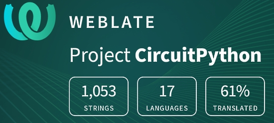](https://hosted.weblate.org/engage/circuitpython/)

One important feature of CircuitPython is translated control and error messages.

With the help of fellow open source project [Weblate](https://weblate.org/), we're making it even easier to add or improve translations.

Sign in with an existing account such as Github, Google or Facebook and start contributing through a simple web interface. No forks or pull requests needed!

As always, if you run into trouble join us on [Discord](https://adafru.it/discord), we're here to help.

## jobs.adafruit.com - Find a dream job, find great candidates!

[jobs.adafruit.com](https://jobs.adafruit.com/) has returned and folks are posting their skills (including CircuitPython) and companies are looking for talented makers to join their companies - from Digi-Key, to Hackaday, Microcenter, Raspberry Pi and more.

**Job of the Week**

text - [Adafruit Jobs Board](https://jobs.adafruit.com/).

## 27,793 thanks!

The Adafruit Discord community, where we do all our CircuitPython development in the open, reached over 27,793 humans, thank you!  Adafruit believes Discord offers a unique way for CircuitPython folks to connect. Join today at [https://adafru.it/discord](https://adafru.it/discord).

## ICYMI - In case you missed it

The wonderful world of Python on hardware! This is our Python video-newsletter-podcast! The news comes from the Python community, Discord, Adafruit communities and more and is reviewed on ASK an ENGINEER Wednesdays. The complete Python on Hardware weekly videocast [playlist is here](https://www.youtube.com/playlist?list=PLjF7R1fz_OOXRMjM7Sm0J2Xt6H81TdDev). 

This video podcast is on [iTunes](https://itunes.apple.com/us/podcast/python-on-hardware/id1451685192?mt=2), [YouTube](http://adafru.it/pohepisodes), [IGTV (Instagram TV](https://www.instagram.com/adafruit/channel/)), and [XML](https://itunes.apple.com/us/podcast/python-on-hardware/id1451685192?mt=2).

[Weekly community chat on Adafruit Discord server CircuitPython channel - Audio / Podcast edition](https://itunes.apple.com/us/podcast/circuitpython-weekly-meeting/id1451685016) - Audio from the Discord chat space for CircuitPython, meetings are usually Mondays at 2pm ET, this is the audio version on [iTunes](https://itunes.apple.com/us/podcast/circuitpython-weekly-meeting/id1451685016), Pocket Casts, [Spotify](https://adafru.it/spotify), and [XML feed](https://adafruit-podcasts.s3.amazonaws.com/circuitpython_weekly_meeting/audio-podcast.xml).

And lastly, we are working up a one-spot destination for all things podcast-able here - [podcasts.adafruit.com](https://podcasts.adafruit.com/)

## Contribute!

The CircuitPython Weekly Newsletter is a CircuitPython community-run newsletter emailed every Tuesday. The complete [archives are here](https://www.adafruitdaily.com/category/circuitpython/). It highlights the latest CircuitPython related news from around the web including Python and MicroPython developments. To contribute, edit next week's draft [on GitHub](https://github.com/adafruit/circuitpython-weekly-newsletter/tree/gh-pages/_drafts) and [submit a pull request](https://help.github.com/articles/editing-files-in-your-repository/) with the changes. You may also tag your information on Twitter with #CircuitPython. 

Join our [Discord](https://adafru.it/discord) or [post to the forum](https://forums.adafruit.com/viewforum.php?f=60) for any further questions.
