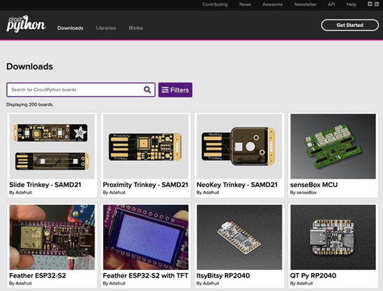
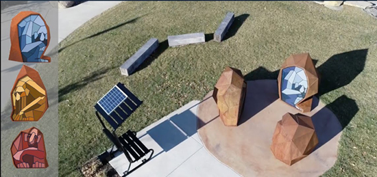
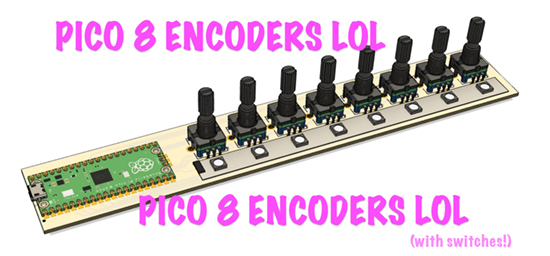
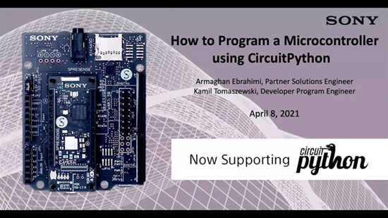
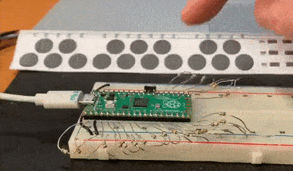
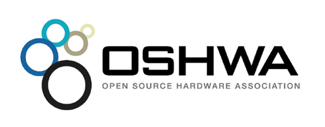
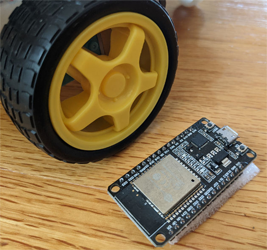
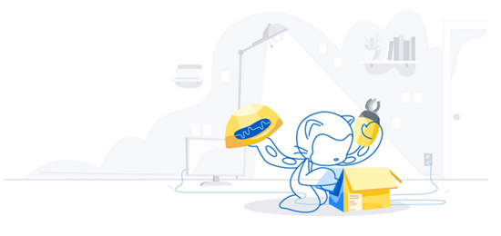
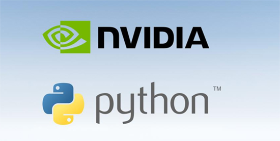
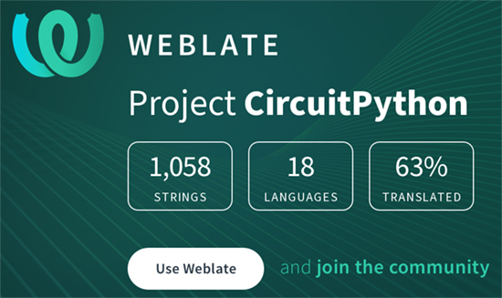

- [ ] Kattni updates
- [ ] change date
- [ ] update title
- [ ] Feature story
- [ ] Update  for images
- [ ] Update ICYDNCI
- [ ] All images 550w max only
- [ ] Link "View this email in your browser."

News Sources

- [python.org](https://www.python.org/)
- [Python Insider - dev team blog](https://pythoninsider.blogspot.com/)

Template last updated on 2021-04-12 - Remove OHS event, fix PyOhio link, typo fix - Kattni

View this email in your browser.

Welcome to the latest Python on Microcontrollers newsletter, brought you by the community! We're on [Discord](https://discord.gg/HYqvREz), [Twitter](https://twitter.com/search?q=circuitpython&src=typed_query&f=live), and for past newsletters - [view them all here](https://www.adafruitdaily.com/category/circuitpython/). If you're reading this on the web, [subscribe here](https://www.adafruitdaily.com/). Let's get started!

## CircuitPython now available for 200 boards!

There are now over 200 boards that support CircuitPython! The [Slide Trinkey - SAMD21](https://circuitpython.org/board/adafruit_slide_trinkey_m0/) is board number 200. 

CircuitPython, available in 15 different languages, is the one of the easiest ways to program microcontrollers. We began with the Circuit Playground Express approximately three years ago, and reached 100 boards in January 2020 with the Open Hardware Summit badge. Now, over a year later, we've reached 200 boards. Chips supported include: Espressif, Microchip SAMDs, Nordic, NXP, RP2040s, ST, and more! Thank you to everyone in our community who has submitted boards to CircuitPython!

Check out the full list on [CircuitPython.org](https://circuitpython.org/downloads)!

Read more - [Adafruit Blog](https://blog.adafruit.com/2021/04/16/there-are-now-over-200-boards-that-support-circuitpython/).

## Scott presents for Open Hardware Summit 2021

Scott presents Interface Design in Open Source Hardware and Software for Open Hardware Summit - [YouTube](https://www.youtube.com/watch?v=3QewiyfBQh8).

Check out the entire Open Hardware Summit broadcast on [YouTube](https://www.youtube.com/playlist?list=PLN2I5IwhHQ4remJBtoZt4p6iI6YTahWJq).

## Feature

text - [site](url)

## CircuitPython Deep Dive Stream with Scott Shawcroft

[This week](link), Scott streams his work on .

You can see the latest video and past videos on the Adafruit YouTube channel under the Deep Dive playlist - [YouTube](https://www.youtube.com/playlist?list=PLjF7R1fz_OOXBHlu9msoXq2jQN4JpCk8A).

## News from around the web!

The River Prarie Troll Project uses CircuitPython, among other things, to create an interactive art installation - [YouTube](https://www.youtube.com/watch?v=o1q2jVmUYE0).

You can hook up 8 rotary encoders with switches to Raspberry Pi Pico without any extra hardware, supported by CircuitPython - [GitHub](https://github.com/todbot/pico8enc).

CircuitPython for Spresense - [YouTube](https://youtu.be/lE3jIlMHSso) and [Sony](https://developer.sony.com/develop/spresense/news) via [Twitter](https://twitter.com/SonyDevWorld/status/1382373570970521601).

Using CircuitPython and a Raspberry Pi Pico to make a MIDI touch controller - [GitHub](https://github.com/todbot/picotouch) via [Twitter](https://twitter.com/todbot/status/1382469033061093377).

text - [site](url).

text - [site](url).

text - [site](url).

text - [site](url).

text - [site](url).

text - [site](url).

text - [site](url).

text - [site](url).

text - [site](url).

text - [site](url).

text - [site](url).

text - [site](url).

text - [site](url).

text - [site](url).

text - [site](url).

Open Source Hardware Association Open Source Hardware Community Survey - [OSHWA](http://bit.ly/oshwa-community-2021).

Build Hadabot: set up the ESP32 to interface with ROS 2 - [Hadabot](https://www.hadabot.com/setup-esp32-to-work-with-ros2.html).

text - [site](url).

text - [site](url).

text - [site](url).

text - [site](url).

text - [site](url).

text - [site](url).

text - [site](url).

text - [site](url).

text - [site](url).

text - [site](url).

text - [site](url).

text - [site](url).

text - [site](url).

text - [site](url).

text - [site](url).

text - [site](url).

text - [site](url).

text - [site](url).

text - [site](url).

text - [site](url).

text - [site](url).

text - [site](url).

text - [site](url).

text - [site](url).

text - [site](url).

text - [site](url).

text - [site](url).

text - [site](url).

text - [site](url).

text - [site](url).

text - [site](url).

text - [site](url).

text - [site](url).

text - [site](url).

text - [site](url).

text - [site](url).

Work with GitHub Actions in your terminal with GitHub CLI - [GitHub](https://github.blog/2021-04-15-work-with-github-actions-in-your-terminal-with-github-cli/).

For Python resources, check out the PSF mailing lists and newsgroups -[Python](https://www.python.org/community/lists/) via [Twitter](https://twitter.com/ThePSF/status/1382447070599131137).

Introducing CUDA Python, with improved #Python code portability and compatibility - [Twitter](https://twitter.com/NVIDIAHPCDev/status/1382068576228626432).

**#ICYDNCI What was the most popular, most clicked link, in [last week's newsletter](https://link)? [title](url).**

## Coming soon

text - [site](url).

## New Boards Supported by CircuitPython

The number of supported microcontrollers and Single Board Computers (SBC) grows every week. This section outlines which boards have been included in CircuitPython or added to [CircuitPython.org](https://circuitpython.org/).

This week we had X new boards added!

- [Board name](url)

Looking to add a new board to CircuitPython? It's highly encouraged! Adafruit has four guides to help you do so:

- [How to Add a New Board to CircuitPython](https://learn.adafruit.com/how-to-add-a-new-board-to-circuitpython/overview)
- [How to add a New Board to the circuitpython.org website](https://learn.adafruit.com/how-to-add-a-new-board-to-the-circuitpython-org-website)
- [Adding a Single Board Computer to PlatformDetect for Blinka](https://learn.adafruit.com/adding-a-single-board-computer-to-platformdetect-for-blinka)
- [Adding a Single Board Computer to Blinka](https://learn.adafruit.com/adding-a-single-board-computer-to-blinka)

## New Learn Guides!

[LED Snowboard with Motion-Reactive Animation](https://learn.adafruit.com/led-snowboard-with-motion-reactive-animation) from [Erin St. Blaine](https://learn.adafruit.com/users/firepixie)

[Improve Brushed DC Motor Performance](https://learn.adafruit.com/improve-brushed-dc-motor-performance) from [Jan Goolsbey](https://learn.adafruit.com/users/HarpDude)

[Adafruit Neo Trinkey](https://learn.adafruit.com/adafruit-neo-trinkey) from [Kattni](https://learn.adafruit.com/users/kattni)

[ScoutMakes Robot Kit](https://learn.adafruit.com/scoutmakes-robot-kit) from [Lalindra Jayatilleke](https://learn.adafruit.com/users/tinkeringtech)

[ScoutMakes FM Radio Kit](https://learn.adafruit.com/scoutmakes-fm-radio-kit) from [Lalindra Jayatilleke](https://learn.adafruit.com/users/tinkeringtech)

## Updated Learn Guides!

[CircuitPython Essentials: CircuitPython Resetting](https://learn.adafruit.com/circuitpython-essentials/circuitpython-resetting) from [Carter Nelson](https://learn.adafruit.com/users/caternuson)

## CircuitPython Libraries!

CircuitPython support for hardware continues to grow. We are adding support for new sensors and breakouts all the time, as well as improving on the drivers we already have. As we add more libraries and update current ones, you can keep up with all the changes right here!

For the latest libraries, download the [Adafruit CircuitPython Library Bundle](https://circuitpython.org/libraries). For the latest community contributed libraries, download the [CircuitPython Community Bundle](https://github.com/adafruit/CircuitPython_Community_Bundle/releases).

If you'd like to contribute, CircuitPython libraries are a great place to start. Have an idea for a new driver? File an issue on [CircuitPython](https://github.com/adafruit/circuitpython/issues)! Have you written a library you'd like to make available? Submit it to the [CircuitPython Community Bundle](https://github.com/adafruit/CircuitPython_Community_Bundle). Interested in helping with current libraries? Check out the [CircuitPython.org Contributing page](https://circuitpython.org/contributing). We've included open pull requests and issues from the libraries, and details about repo-level issues that need to be addressed. We have a guide on [contributing to CircuitPython with Git and Github](https://learn.adafruit.com/contribute-to-circuitpython-with-git-and-github) if you need help getting started. You can also find us in the #circuitpython channel on the [Adafruit Discord](https://adafru.it/discord).

You can check out this [list of all the Adafruit CircuitPython libraries and drivers available](https://github.com/adafruit/Adafruit_CircuitPython_Bundle/blob/master/circuitpython_library_list.md). 

The current number of CircuitPython libraries is **311**!

**Updated Libraries!**

Here's this week's updated CircuitPython libraries:

 * [Adafruit_CircuitPython_PIOASM](https://github.com/adafruit/Adafruit_CircuitPython_PIOASM)
 * [Adafruit_CircuitPython_Debouncer](https://github.com/adafruit/Adafruit_CircuitPython_Debouncer)
 * [Adafruit_CircuitPython_Requests](https://github.com/adafruit/Adafruit_CircuitPython_Requests)
 * [Adafruit_CircuitPython_Bitmap_Font](https://github.com/adafruit/Adafruit_CircuitPython_Bitmap_Font)
 * [Adafruit_CircuitPython_NeoPixel](https://github.com/adafruit/Adafruit_CircuitPython_NeoPixel)
 * [Adafruit_CircuitPython_DotStar](https://github.com/adafruit/Adafruit_CircuitPython_DotStar)
 * [Adafruit_CircuitPython_AzureIoT](https://github.com/adafruit/Adafruit_CircuitPython_AzureIoT)
 * [Adafruit_CircuitPython_HID](https://github.com/adafruit/Adafruit_CircuitPython_HID)
 * [Adafruit_CircuitPython_BLE_MIDI](https://github.com/adafruit/Adafruit_CircuitPython_BLE_MIDI)
 * [Adafruit_CircuitPython_BLE_iBBQ](https://github.com/adafruit/Adafruit_CircuitPython_BLE_iBBQ)
 * [Adafruit_CircuitPython_BLE_Heart_Rate](https://github.com/adafruit/Adafruit_CircuitPython_BLE_Heart_Rate)
 * [Adafruit_CircuitPython_FeatherWing](https://github.com/adafruit/Adafruit_CircuitPython_FeatherWing)
 * [Adafruit_CircuitPython_BLE_LYWSD03MMC](https://github.com/adafruit/Adafruit_CircuitPython_BLE_LYWSD03MMC)
 * [Adafruit_CircuitPython_DisplayIO_Layout](https://github.com/adafruit/Adafruit_CircuitPython_DisplayIO_Layout)
 * [Adafruit_CircuitPython_MIDI](https://github.com/adafruit/Adafruit_CircuitPython_MIDI)
 * [Adafruit_CircuitPython_PyPortal](https://github.com/adafruit/Adafruit_CircuitPython_PyPortal)
 * [Adafruit_CircuitPython_BNO055](https://github.com/adafruit/Adafruit_CircuitPython_BNO055)
 * [Adafruit_CircuitPython_MatrixPortal](https://github.com/adafruit/Adafruit_CircuitPython_MatrixPortal)
 * [Adafruit_CircuitPython_PortalBase](https://github.com/adafruit/Adafruit_CircuitPython_PortalBase)
 * [Adafruit_CircuitPython_BME280](https://github.com/adafruit/Adafruit_CircuitPython_BME280)
 * [Adafruit_CircuitPython_FunHouse](https://github.com/adafruit/Adafruit_CircuitPython_FunHouse)
 * [Adafruit_CircuitPython_PCA9685](https://github.com/adafruit/Adafruit_CircuitPython_PCA9685)
 * [CircuitPython_Community_Bundle](https://github.com/adafruit/CircuitPython_Community_Bundle)

## What’s the team up to this week?

What is the team up to this week? Let’s check in!

**Dan**

I'm working on dynamic USB descriptors, which you allow you to enable or disable CircuitPython's USB mass storage, the REPL serial connection, another data-only serial connection, MIDI, and also select among HID devices. All of this you can do in boot.py, to customize which devices are available. In addition, for HID, you'll be able to supply your own HID device descriptors, so you can make that custom gamepad or joystick or other device that isn't built-in to CircuitPython.

So far I have most of the Python API and documentation written. I've also modified the Python-based compile-time descriptor generator we already use to output additional information so the code can renumber interfaces and endpoints at run-time. I hope to have something for you to try relatively soon.

**Jeff**

Based on a user request, I added RGBMatrix (protomatter) support for the Feather M4 CAN in our main development branch.  This uses all the same code as SAM D51 microcontrollers, but because this board has a SAM E51 small modifications were needed to enable it.

The bulk of my time over the last week was spent trying to enable the I2S digital audio interface on the imxrt10xx, but something's preventing it from working and I've decided to set it aside for now.

**Kattni**

This week, I published the Neo Trinkey guide. It includes some fun examples using the capacitive touch pads and the built-in four NeoPixel LEDs. It also has everything you need to get started with your Neo Trinkey, including pinouts, CircuitPython basics, and resource downloads. If you snagged one of these cute little boards, and want a hand getting started with it, check out this guide.

This guide includes templates! I finally have a live example of what I've been working on. Here is an example of one of the templates: [NeoPixel Blink](https://learn.adafruit.com/adafruit-neo-trinkey/neopixel-blink). Most of the page is immutable in the editor, but there are spaces to include a tailored image and specific code. This page will be included in the guide for any board that has only built-in NeoPixel LEDs (and no little red LED). For example, a similar page would be included in the QT Py guide (and will be eventually!).

Next up is updating a couple of guides with the QT revision of the breakout, and then onto the FunHouse guide.

**Lucian**

This past week I've been finalizing some changes to the internal structure of the Alarm system, which fix some important bugs but also make it easier to maintain the sleep functions across all the different ports. I've drafted the revisions for the ESP32-S2, since it still has the issue with mismatched objects that I'd previously fixed for STM32. If accepted, it's still not going to make sleep completely uncomplicated - there's a lot of funny exception stuff that has to go on - but at least it should make it easier for new and existing contributors to follow the responsibilities of the internal functions.

I've also been monitoring the existing power PRs to try and make sure they all stay up to date and can be merged in any order. Since the NRF, STM32, RP2040 and ESP32-S2 all have active Alarm-related development going on, it's a lot to manage - hopefully everything can start getting merged in this week so development can go back to being a bit more linear.

**Melissa**

This past week, I've been working on the FunHouse. First I wrote the FunHouse library, which is similar to the MagTag library, but with different peripherals and MQTT functionality. The library is available either in the [Adafruit CircuitPython Bundle](https://github.com/adafruit/Adafruit_CircuitPython_Bundle/releases) or from https://github.com/adafruit/Adafruit_CircuitPython_FunHouse.

Once the library was complete, I wrote a guide on using the Funhouse board with home assistant. In the guide, I go over setting up the FunHouse project as well as how to do some more advanced things such as mapping the buttons to toggle lights and emulating an RGB bulb with the DotStars so it can be controlled from Home Assistant like any other light. You can check out the guide at https://learn.adafruit.com/using-the-adafruit-funhouse-with-home-assistant.

**Scott**

Last week I gave a short and sweet talk at the Open Hardware Summit about interface design. The video is up [here](https://youtu.be/3QewiyfBQh8). I also streamed [the one year anniversary of deep dives](https://www.youtube.com/watch?v=7djiPZU85OY).

Code-wise I added a larger read/write to the BLE file transfer test. It found some bugs in the implementation but also allowed me to measure transfer speed. I'll continue this work the second half of this week. I'll also incorporate some changes based on feedback from [the protocol design PR](https://github.com/adafruit/Adafruit_CircuitPython_BLE_File_Transfer/pull/1).

I spent the first half of this week improving our GitHub actions tooling. Specifically, I setup [a GitHub action](https://github.com/adafruit/circuitpython-action-library-ci-failed) to post a helpful comment to CircuitPython library PRs that fail. I also added [an action](https://github.com/adafruit/circuitpython-action-library-ci-problem-matchers) to better find and highlight the errors. pylint errors will now show on the related line in the files view.

## Upcoming events!

The online GeoPython conference is focused on Python and Geo, its toolkits and applications. April 22-23, 2021 - [https://2021.geopython.net/](https://2021.geopython.net/).

PyCon US, the annual official annual Python gathering, has been announced to be held online May 12-15, 2021. Sprints will be held May 16-18, 2021. More information and signups at [https://us.pycon.org/2021/](https://us.pycon.org/2021/)

EuroPython, the largest conference for the Python programming language in Europe, has been announced to be held online July 26 - August 1, 2021. More information at [https://ep2021.europython.eu/](https://ep2021.europython.eu/)

Call for proposals for PyOhio 2021 runs from March 15 - April 19, 2021 with the free event on July 31, 2021- [PyOhio.org](https://www.pyohio.org/2021/) via [Twitter](https://twitter.com/PyOhio/status/1370184124460367881).

**Send Your Events In**

As for other events, with the COVID pandemic, most in-person events are postponed or cancelled. If you know of virtual events or events that may occur in the future, please let us know on Discord or on Twitter with hashtag #CircuitPython.

## Latest releases

CircuitPython's stable release is [#.#.#](https://github.com/adafruit/circuitpython/releases/latest) and its unstable release is [#.#.#-##.#](https://github.com/adafruit/circuitpython/releases). New to CircuitPython? Start with our [Welcome to CircuitPython Guide](https://learn.adafruit.com/welcome-to-circuitpython).

[2021####](https://github.com/adafruit/Adafruit_CircuitPython_Bundle/releases/latest) is the latest CircuitPython library bundle.

[v#.#.#](https://micropython.org/download) is the latest MicroPython release. Documentation for it is [here](http://docs.micropython.org/en/latest/pyboard/).

[#.#.#](https://www.python.org/downloads/) is the latest Python release. The latest pre-release version is [#.#.#](https://www.python.org/download/pre-releases/).

[2,392 Stars](https://github.com/adafruit/circuitpython/stargazers) Like CircuitPython? [Star it on GitHub!](https://github.com/adafruit/circuitpython)

## Call for help -- Translating CircuitPython is now easier than ever!

One important feature of CircuitPython is translated control and error messages.

With the help of fellow open source project [Weblate](https://weblate.org/), we're making it even easier to add or improve translations.

Sign in with an existing account such as GitHub, Google or Facebook and start contributing through a simple web interface. No forks or pull requests needed!

As always, if you run into trouble join us on [Discord](https://adafru.it/discord), we're here to help.

## jobs.adafruit.com - Find a dream job, find great candidates!

[jobs.adafruit.com](https://jobs.adafruit.com/) has returned and folks are posting their skills (including CircuitPython) and companies are looking for talented makers to join their companies - from Digi-Key, to Hackaday, Micro Center, Raspberry Pi and more.

**Job of the Week**

text - [Adafruit Jobs Board](https://jobs.adafruit.com/).

## NUMBER thanks!

The Adafruit Discord community, where we do all our CircuitPython development in the open, reached over NUMBER humans, thank you!  Adafruit believes Discord offers a unique way for CircuitPython folks to connect. Join today at [https://adafru.it/discord](https://adafru.it/discord).

## ICYMI - In case you missed it

The wonderful world of Python on hardware! This is our Python video-newsletter-podcast! The news comes from the Python community, Discord, Adafruit communities and more and is reviewed on ASK an ENGINEER Wednesdays. The complete Python on Hardware weekly videocast [playlist is here](https://www.youtube.com/playlist?list=PLjF7R1fz_OOXRMjM7Sm0J2Xt6H81TdDev). 

This video podcast is on [iTunes](https://itunes.apple.com/us/podcast/python-on-hardware/id1451685192?mt=2), [YouTube](http://adafru.it/pohepisodes), [IGTV (Instagram TV](https://www.instagram.com/adafruit/channel/)), and [XML](https://itunes.apple.com/us/podcast/python-on-hardware/id1451685192?mt=2).

[Weekly community chat on Adafruit Discord server CircuitPython channel - Audio / Podcast edition](https://itunes.apple.com/us/podcast/circuitpython-weekly-meeting/id1451685016) - Audio from the Discord chat space for CircuitPython, meetings are usually Mondays at 2pm ET, this is the audio version on [iTunes](https://itunes.apple.com/us/podcast/circuitpython-weekly-meeting/id1451685016), Pocket Casts, [Spotify](https://adafru.it/spotify), and [XML feed](https://adafruit-podcasts.s3.amazonaws.com/circuitpython_weekly_meeting/audio-podcast.xml).

And lastly, we are working up a one-spot destination for all things podcast-able here - [podcasts.adafruit.com](https://podcasts.adafruit.com/)

## Codecademy "Learn Hardware Programming with CircuitPython"

Codecademy, an online interactive learning platform used by more than 45 million people, has teamed up with the leading manufacturer in STEAM electronics, Adafruit Industries, to create a coding course, "Learn Hardware Programming with CircuitPython". The course is now available in the [Codecademy catalog](https://www.codecademy.com/learn/learn-circuitpython?utm_source=adafruit&utm_medium=partners&utm_campaign=circuitplayground&utm_content=pythononhardwarenewsletter).

Python is a highly versatile, easy to learn programming language that a wide range of people, from visual effects artists in Hollywood to mission control at NASA, use to quickly solve problems. But you don’t need to be a rocket scientist to accomplish amazing things with it. This new course introduces programmers to Python by way of a microcontroller — CircuitPython — which is a Python-based programming language optimized for use on hardware.

CircuitPython’s hardware-ready design makes it easier than ever to program a variety of single-board computers, and this course gets you from no experience to working prototype faster than ever before. Codecademy’s interactive learning environment, combined with Adafruit's highly rated Circuit Playground Express, present aspiring hardware hackers with a never-before-seen opportunity to learn hardware programming seamlessly online.

Whether for those who are new to programming, or for those who want to expand their skill set to include physical computing, this course will have students getting familiar with Python and creating incredible projects along the way. By the end, students will have built their own bike lights, drum machine, and even a moisture detector that can tell when it's time to water a plant.

Visit Codecademy to access the [Learn Hardware Programming with CircuitPython](https://www.codecademy.com/learn/learn-circuitpython?utm_source=adafruit&utm_medium=partners&utm_campaign=circuitplayground&utm_content=pythononhardwarenewsletter) course and Adafruit to purchase a [Circuit Playground Express](https://www.adafruit.com/product/3333).

Codecademy has helped more than 45 million people around the world upgrade their careers with technology skills. The company’s online interactive learning platform is widely recognized for providing an accessible, flexible, and engaging experience for beginners and experienced programmers alike. Codecademy has raised a total of $43 million from investors including Union Square Ventures, Kleiner Perkins, Index Ventures, Thrive Capital, Naspers, Yuri Milner and Richard Branson, most recently raising its $30 million Series C in July 2016.

## Contribute!

The CircuitPython Weekly Newsletter is a CircuitPython community-run newsletter emailed every Tuesday. The complete [archives are here](https://www.adafruitdaily.com/category/circuitpython/). It highlights the latest CircuitPython related news from around the web including Python and MicroPython developments. To contribute, edit next week's draft [on GitHub](https://github.com/adafruit/circuitpython-weekly-newsletter/tree/gh-pages/_drafts) and [submit a pull request](https://help.github.com/articles/editing-files-in-your-repository/) with the changes. You may also tag your information on Twitter with #CircuitPython. 

Join our [Discord](https://adafru.it/discord) or [post to the forum](https://forums.adafruit.com/viewforum.php?f=60) for any further questions.
