- [X] Kattni updates
- [ ] change date
- [ ] update title
- [ ] Feature storyCancel changes
- [ ] Update []() for images
- [ ] Update ICYDNCI
- [ ] All images 550w max only
- [ ] Link "View this email in your browser."

News Sources

- [python.org](https://www.python.org/)
- [Python Insider - dev team blog](https://pythoninsider.blogspot.com/)

View this email in your browser.

Welcome to the latest Python on Microcontrollers newsletter, brought you by the community! We're on [Discord](https://discord.gg/HYqvREz), [Twitter](https://twitter.com/search?q=circuitpython&src=typed_query&f=live), and for past newsletters - [view them all here](https://www.adafruitdaily.com/category/circuitpython/). If you're reading this on the web, [subscribe here](https://www.adafruitdaily.com/). Let's get started!

## Upstreamed MicroPython Versions Merged Into CircuitPython

[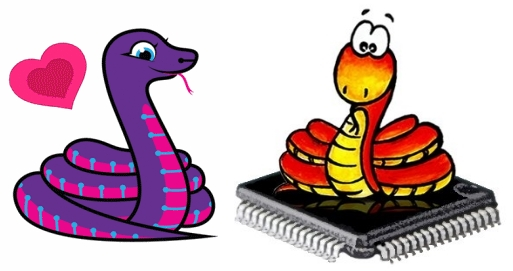](https://CircuitPython.org)

"Adafruit has recently incorporated updates from MicroPython: 1.9.4ish through six releases to the latest, 1.15. It is nearly three years of changes to MicroPython. This brings the Python core used in CircuitPython very close to the one in MicroPython. It'll make it easier to collaborate on the core going forward. MicroPython's new release policy of one every two months or so should make it easier for CircuitPython to keep up to date. We don't share much port-specific code but we're excited to be able to collaborate on the core Python VM going forwards."

"Our community has expressed interest in more advanced features of upstream MicroPython such as native modules. This merge will make it easier to bring those advancements to CircuitPython."

CircuitPython 7 - New Core Language Features from MicroPython

 * Assignment expressions, sometimes called the "walrus operator: ```python
    if (m := rx.match(line)):
        print(m.group(0))
    ```
 * Variable type annotations: ```python
    class Foo:
        x: int = 1
    ```
 * Matrix multiplication operator (however this is not yet supported by ulab, see https://github.com/v923z/micropython-ulab/issues/277): ```python
    a = l @ u
    ```

text - [site](url)

## PyCon 2021 

[](https://us.pycon.org/2021/)

PyCon US, the annual official annual Python gathering, was held online May 12-15, 2021. 

- [https://us.pycon.org/2021/](https://us.pycon.org/2021/)

[](https://twitter.com/pycon/status/1394030011120824321)

The PyLadies Auction team put together a rousing event full of joy and generosity to raise over $11,000. This will benefit of women around the world to ensure that the Python community is welcoming to them.

## Adafruit Discord reaches 29,000+ members!

[](https://adafru.it/discord)

[](https://discord.gg/adafruit)

The Adafruit Discord community, where we do all our CircuitPython development in the open, reached over 29,000 humans, thank you!  Adafruit believes Discord offers a unique way for CircuitPython folks to connect. Join today at [https://adafru.it/discord](https://adafru.it/discord).

See other Adafruit Discord milestones - [Adafruit Blog](https://blog.adafruit.com/2021/05/12/celebrating-over-29000-members-in-the-adafruit-discord-community-adafruit-discord/).

## The Hunt for a Faster Python

[](https://www.theregister.com/2021/05/06/the_quest_for_faster_python/)

The quest for faster Python: Pyston returns to open source, Facebook releases Cinder, or should devs just use PyPy? - [The Register](https://www.theregister.com/2021/05/06/the_quest_for_faster_python/)

Python programming: We want to make the language twice as fast, says its creator - [ZDnet](https://www.zdnet.com/article/python-programming-we-want-to-make-the-language-twice-as-fast-says-its-creator/).

[](https://github.com/faster-cpython/ideas/blob/main/FasterCPythonDark.pdf)

Guido van Rossum talk at PyCon US: Faster CPython - [GitHub](https://github.com/faster-cpython/ideas/blob/main/FasterCPythonDark.pdf) and [Twitter](https://twitter.com/python_japan/status/1392995172200243202).

Mark Shannon: Implementation plan for speeding up CPython - [GitHub](https://github.com/markshannon/faster-cpython/blob/master/plan.md).

## A New Book on Programming Microcontrollers with CircuitPython

[](https://blog.adafruit.com/2021/05/14/new-book-out-programming-microcontrollers-with-python-book-circuitpython-armstrongsubero/)

Apress has recently published a new book by Armstrong Subero: “Programming Microcontrollers with Python”. See more on the book and a mini-review - [Adafruit Blog](https://blog.adafruit.com/2021/05/14/new-book-out-programming-microcontrollers-with-python-book-circuitpython-armstrongsubero/)

## CircuitPython Deep Dive Stream with Scott Shawcroft

[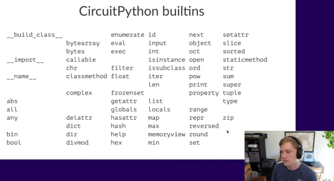](link)

[This week](link), Scott streams his work on .

You can see the latest video and past videos on the Adafruit YouTube channel under the Deep Dive playlist - [YouTube](https://www.youtube.com/playlist?list=PLjF7R1fz_OOXBHlu9msoXq2jQN4JpCk8A).

## News from around the web!

[](url)

text - [site](url).

[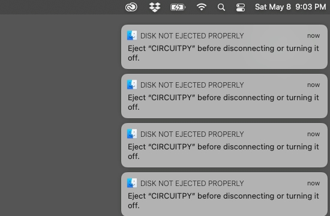](https://blog.adafruit.com/2021/05/11/how-to-tone-down-macos-big-surs-circuitpy-eject-notifications/)

HOW-TO: Tone Down macOS Big Sur’s CIRCUITPY Eject Notifications - [Adafruit Blog](https://blog.adafruit.com/2021/05/11/how-to-tone-down-macos-big-surs-circuitpy-eject-notifications/).

-and-

[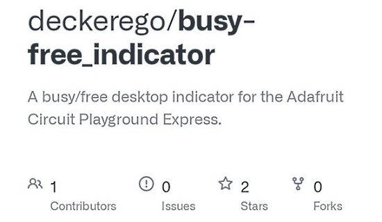](https://twitter.com/deckerego/status/1392217285348274178)

Another option is to use a switch (like those on the Circuit Playground Express) to remount the filesystem read-only - MacOS won't alert on the removal of a read-only filesystem - [Twitter](https://twitter.com/deckerego/status/1392217285348274178) and [GitHub](https://github.com/deckerego/busy-free_indicator/blob/main/boot.py).

[](https://hackaday.io/project/179496-chocolad-keyboard-hacking/log/192866-dynamic-usb-descriptors)

Using Dynamic USB Descriptors in CircuitPython - [hackaday.io](https://hackaday.io/project/179496-chocolad-keyboard-hacking/log/192866-dynamic-usb-descriptors).

[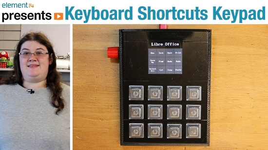](https://youtu.be/qjlZ52h8sac)

A Keyboard Shortcuts Keypad with Raspberry Pi Pico and CircuitPython - [YouTube](https://youtu.be/qjlZ52h8sac).

[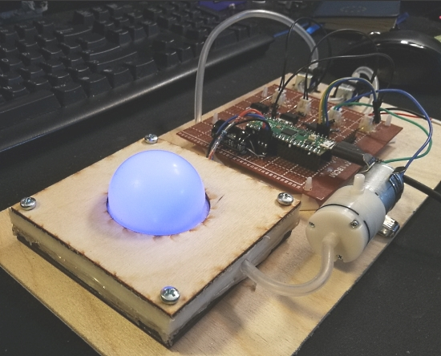](https://hackaday.io/page/10671-making-soft-bubbles)

Making Soft Bubble robotics with Raspberry Pi Pico and CircuitPython - [hackaday.io](https://hackaday.io/page/10671-making-soft-bubbles).

[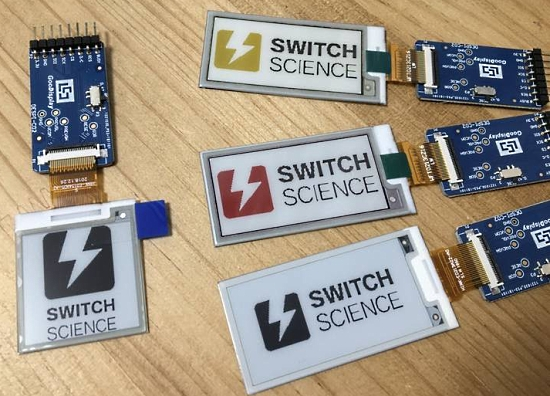](https://mag.switch-science.com/2021/05/12/raspberry-pi-pico-epaper/)

How to use Raspberry Pi Pico and electronic paper with CircuitPython (Japanese) - [SwitchScience](https://mag.switch-science.com/2021/05/12/raspberry-pi-pico-epaper/).

[](http://dangerousprototypes.com/blog/2021/05/13/qtpy-knob-simple-usb-knob-w-circuitpython/)

QTPy-knob: A simple USB knob with CircuitPython - [Dangerous Prototypes](http://dangerousprototypes.com/blog/2021/05/13/qtpy-knob-simple-usb-knob-w-circuitpython/).

[](https://github.com/aallan/pico-lorawan-circuitpython)

Raspberry Pi Pico and LoRaWAN from CircuitPython - [GitHub](https://github.com/aallan/pico-lorawan-circuitpython).

[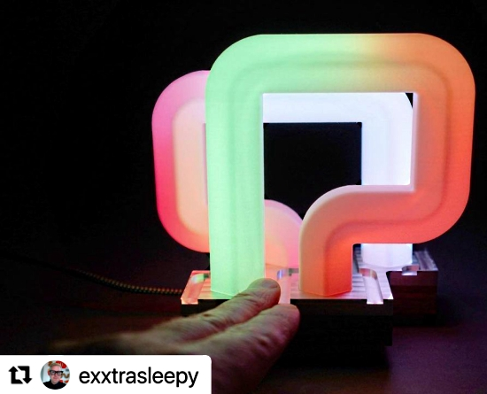](https://twitter.com/bantamtools/status/1393293515124248582)

Designer and educator [Andrew Kleindolph](https://twitter.com/akleindolph)'s Double Up touch-sensitive sculpture. He used the [Bantam Tools](https://twitter.com/bantamtools) PCB mill to machine its wood base and then used CircuitPython to program the Adafruit QT-Py controller that allows the light to change colors - [Twitter](https://twitter.com/bantamtools/status/1393293515124248582).

[](http://lushprojects.com/blog/2021/05/metronome-from-an-event-badge/)

Making a Metronome from an Event Badge with MicroPython - [Lushprojects Blog](http://lushprojects.com/blog/2021/05/metronome-from-an-event-badge/).

[](url)

text - [site](url).

[](https://melbournemicropythonmeetup.github.io/)

The Melbourne MicroPython Meetup has posted information from their sessions in March and April: talking about general news updates and Damien discussing recent MicroPython changes, including the v1.15 release. - [github.io](https://melbournemicropythonmeetup.github.io/).

[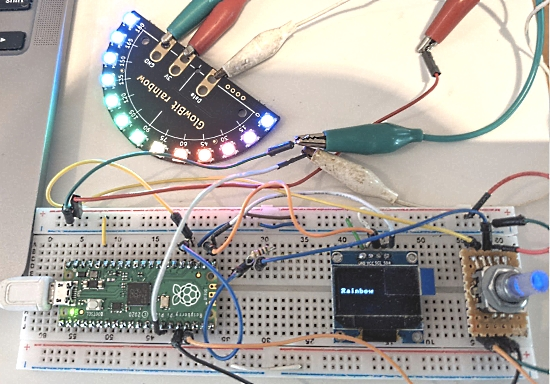](https://hackaday.io/project/178368-menus-for-micropython)

Menus for MicroPython - simple but powerful, multitasking menus for MicroPython, using a little display board and a rotary encoder - [hackaday.io](https://hackaday.io/project/178368-menus-for-micropython).

[](https://github.com/jameskmurphy/nes)

Pyntendo: a Nintendo Entertainment System (NES) emulator written in Python and Cython - [GitHub](https://github.com/jameskmurphy/nes).

[](https://python.plainenglish.io/convert-a-python-project-to-an-executable-exe-file-175080da4485)

Convert a Python Project to an Executable (.exe) File using Auto PY to EXE - [Python in Plain English](https://python.plainenglish.io/convert-a-python-project-to-an-executable-exe-file-175080da4485).

[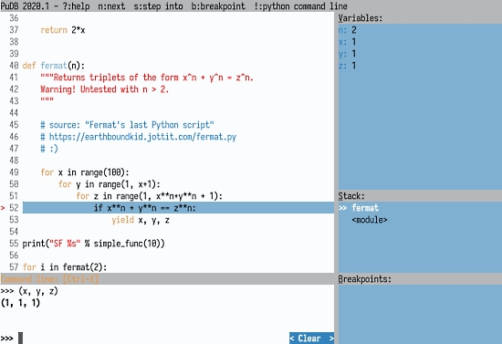](https://github.com/inducer/pudb)

PuDB: a console-based visual debugger for Python - [GitHub](https://github.com/inducer/pudb) and [Twitter](https://twitter.com/pycoders/status/1393177275017859075).

[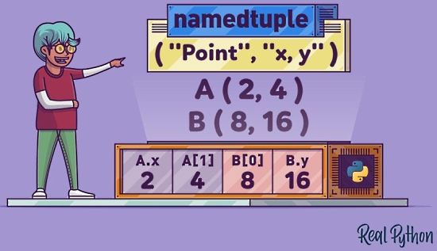](https://realpython.com/python-namedtuple/)

Write Pythonic and Clean Code With namedtuple - [Real Python](https://realpython.com/python-namedtuple/).

[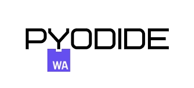](https://lwn.net/SubscriberLink/855875/25b1611bb7e4c9a4/)

Pyodide: Python for the browser, with the scientific stack, compiled to WebAssembly - [LWN.net](https://lwn.net/SubscriberLink/855875/25b1611bb7e4c9a4/) and [GitHub](https://github.com/pyodide/pyodide).

[](https://twitter.com/PythonWeekly/status/1392494796548329476)

Python and Malware: Developing Stealth and Evasive Malware Without Obfuscation - [Twitter](https://twitter.com/PythonWeekly/status/1392494796548329476) and [Paper](https://arxiv.org/pdf/2105.00565.pdf).

[](https://pyre-check.org/)

Pyre: a performant type-checker for Python 3 by Facebook Open Source - [Pyre](https://pyre-check.org/).

[](https://www.reddit.com/r/learnpython/comments/n5a6fo/do_you_know_any_python_projects_on_github_that/)

Python Projects on Github That Are Examples of Best Practices and Good Architecture - [Reddit](https://www.reddit.com/r/learnpython/comments/n5a6fo/do_you_know_any_python_projects_on_github_that/).

**#ICYDNCI What was the most popular, most clicked link, in [last week's newsletter](https://link)? [title](url).**

## Coming soon

[](url)

text - [site](url).

## New Boards Supported by CircuitPython

The number of supported microcontrollers and Single Board Computers (SBC) grows every week. This section outlines which boards have been included in CircuitPython or added to [CircuitPython.org](https://circuitpython.org/).

This week we had X new boards added!

- [Board name](url)

Looking to add a new board to CircuitPython? It's highly encouraged! Adafruit has four guides to help you do so:

- [How to Add a New Board to CircuitPython](https://learn.adafruit.com/how-to-add-a-new-board-to-circuitpython/overview)
- [How to add a New Board to the circuitpython.org website](https://learn.adafruit.com/how-to-add-a-new-board-to-the-circuitpython-org-website)
- [Adding a Single Board Computer to PlatformDetect for Blinka](https://learn.adafruit.com/adding-a-single-board-computer-to-platformdetect-for-blinka)
- [Adding a Single Board Computer to Blinka](https://learn.adafruit.com/adding-a-single-board-computer-to-blinka)

## New Learn Guides!

[](https://learn.adafruit.com/guides/latest)

[FunHouse Mail Slot Detector](https://learn.adafruit.com/funhouse-mail-slot-detector) from [John Park](https://learn.adafruit.com/users/johnpark)

[Adafruit I2C QT Rotary Encoder](https://learn.adafruit.com/adafruit-i2c-qt-rotary-encoder) from [Kattni](https://learn.adafruit.com/users/kattni)

## CircuitPython Project Bundle

[](https://learn.adafruit.com/)

When you get to the CircuitPython code section of an [Adafruit Learn Guide](https://learn.adafruit.com/), sometimes things can get a bit complicated. You not only have the code you need to upload to your device, but you likely also need to add some libraries that the code requires to run. This involved downloading all the libraries, digging through to find the ones you need, and copying them to your device. That was only the beginning on some projects, as those that include images and/or sound files required further downloading and copying of files. But, not anymore!

Now, with Project Bundles, you can download all the necessary code, libraries and, if needed, asset files with one click! We automatically check which libraries are required for the project and bundle them up for you. No more digging through a huge list of libraries to find the ones you need, or fiddling with looking for other files or dependencies. Download the Project Bundle, copy the contents to your device, and your code will simply work. We wanted to make this the easiest way to get a project working, regardless of whether you're a beginner or an expert. We'll also be adding this feature to popular IDEs as an add-on. Try it out with any Circuit Python guide on the Adafruit Learning System. Just look for the ‘Download Project Bundle’ button on the code page. 

**To download and use a Project Bundle:**

In the Learning System - above any embedded code in a guide in the Adafruit Learn System, you’ll find a Download Project Bundle button.

[](https://learn.adafruit.com/)

Click the button to download the Project Bundle zip.

[](https://learn.adafruit.com/)

Open the Project Bundle zip to find the example code, all necessary libraries, and, if available, any images, sounds, etc.

[](https://learn.adafruit.com/)

Simply copy all the files over to your CIRCUITPY drive, and you’re ready to go!

If you run into any problems or bugs, or would like to submit feedback, please file an issue on the [Adafruit Learning System Guides GitHub repo](https://github.com/adafruit/Adafruit_Learning_System_Guides/issues).

## CircuitPython Libraries!

[](https://circuitpython.org/libraries)

CircuitPython support for hardware continues to grow. We are adding support for new sensors and breakouts all the time, as well as improving on the drivers we already have. As we add more libraries and update current ones, you can keep up with all the changes right here!

For the latest libraries, download the [Adafruit CircuitPython Library Bundle](https://circuitpython.org/libraries). For the latest community contributed libraries, download the [CircuitPython Community Bundle](https://github.com/adafruit/CircuitPython_Community_Bundle/releases).

If you'd like to contribute, CircuitPython libraries are a great place to start. Have an idea for a new driver? File an issue on [CircuitPython](https://github.com/adafruit/circuitpython/issues)! Have you written a library you'd like to make available? Submit it to the [CircuitPython Community Bundle](https://github.com/adafruit/CircuitPython_Community_Bundle). Interested in helping with current libraries? Check out the [CircuitPython.org Contributing page](https://circuitpython.org/contributing). We've included open pull requests and issues from the libraries, and details about repo-level issues that need to be addressed. We have a guide on [contributing to CircuitPython with Git and Github](https://learn.adafruit.com/contribute-to-circuitpython-with-git-and-github) if you need help getting started. You can also find us in the #circuitpython channel on the [Adafruit Discord](https://adafru.it/discord).

You can check out this [list of all the Adafruit CircuitPython libraries and drivers available](https://github.com/adafruit/Adafruit_CircuitPython_Bundle/blob/master/circuitpython_library_list.md). 

The current number of CircuitPython libraries is **314**!

**Updated Libraries!**

Here's this week's updated CircuitPython libraries:

 * [Adafruit_CircuitPython_AHTx0](https://github.com/adafruit/Adafruit_CircuitPython_AHTx0)
 * [Adafruit_CircuitPython_AdafruitIO](https://github.com/adafruit/Adafruit_CircuitPython_AdafruitIO)
 * [Adafruit_CircuitPython_Wiznet5k](https://github.com/adafruit/Adafruit_CircuitPython_Wiznet5k)
 * [Adafruit_CircuitPython_RGB_Display](https://github.com/adafruit/Adafruit_CircuitPython_RGB_Display)
 * [Adafruit_CircuitPython_AS7341](https://github.com/adafruit/Adafruit_CircuitPython_AS7341)
 * [Adafruit_CircuitPython_DPS310](https://github.com/adafruit/Adafruit_CircuitPython_DPS310)
 * [Adafruit_CircuitPython_LSM9DS1](https://github.com/adafruit/Adafruit_CircuitPython_LSM9DS1)
 * [Adafruit_CircuitPython_MPU6050](https://github.com/adafruit/Adafruit_CircuitPython_MPU6050)
 * [Adafruit_CircuitPython_BMP3XX](https://github.com/adafruit/Adafruit_CircuitPython_BMP3XX)
 * [Adafruit_CircuitPython_MatrixPortal](https://github.com/adafruit/Adafruit_CircuitPython_MatrixPortal)
 * [Adafruit_CircuitPython_seesaw](https://github.com/adafruit/Adafruit_CircuitPython_seesaw)
 * [Adafruit_Blinka](https://github.com/adafruit/Adafruit_Blinka)
 * [Adafruit_Python_PlatformDetect](https://github.com/adafruit/Adafruit_Python_PlatformDetect)

## What’s the team up to this week?

What is the team up to this week? Let’s check in!

**Dan**

I am fixing bugs for CircuitPython 6.x and 7.0.0, and will continue to do that in the near future.

Now that the first version of dynamic USB descriptors is merged in, there are some more features to be added. First, I'll be looking at supporting "boot"-profile keyboards. Currently all CircuitPython HID devices are merged into a single "composite" HID device. This saves USB endpoints, which are a scarce resource. But the simple BIOS code on your computer typically does not understand these composite devices. The BIOS _can_ recognize a single HID keyboard device, which is specially marked as being a "boot" keyboard. The BIOS assumes that all boot keyboards are the same and have the same report descriptor, so it does not actually read it. So I'll add the ability to define and use boot devices. 

**Jeff**

I continued helping Scott test the micropython "merges" and fixed a bunch of resulting problems. I think we're done for now, at least until micropython releases version 1.16.

I made some changes that allowed all of the micropython "natmod" examples to compile, and tested some of them on a host computer. "natmod" is a way to write code in a subset of C that gets compiled to a "mpy" file which can then be loaded on a microcontroller with "import". I didn't test or enable it for any CircuitPython boards yet so if you're motivated to use this feature, please come help us out with this.

Speaking of Micropython, I've opened several Pull Requests there that have generated interest, and I've also seen renewed interest in one that I first opened in 2018. These PRs help speed up the process of testing micropython, and address a few obscure bugs.

Last of all, I've been working on supporting RGBMatrix on ESP32-S2 microcontrollers in CircuitPython. This was available in Arduino but we neglected to add it to CircuitPython. At the moment, it works well enough to show a demo but there are still some bugs to fix before it can be turned into a Pull Request.

**Kattni**

This week I published [the guide](https://learn.adafruit.com/adafruit-i2c-qt-rotary-encoder) for the [Adafruit I2C QT Rotary Encoder](https://www.adafruit.com/product/4991). This guide has everything you need to get started using your rotary encoder breakout with both Arduino and CircuitPython, as well as pinouts and downloads resources.

I updated the blink program on the Welcome to CircuitPython: Creating and Editing Code page to use `board.LED` in the code. It previously use `board.D13` which not all boards supported, for example, Raspberry Pi Pico. The issue was that not all Adafruit boards supported `board.LED`, which was what we use in the Blink template anyway. So, I went through and added the `LED` pin to 31 more boards in CircuitPython. This update is only available in the absolute newest version of CircuitPython, so if you run into an issue with the pin not being found, try using the "Absolute Newest" version of CircuitPython for your board. Eventually, we will release another stable version with these updates, but I'm not certain when.

**Lucian**

This week I spent on bugfixes and catchup - I resolved a boot issue on an STM32 board caused by outdated clock settings, tracked down a few more issues with deep sleep on the RP2040, fixed the circuitpython-adjacent RMT settings for the Arduino Neopixel library, and dove into the guts of set-next-file.

**Melissa**

This past week, I finally had the opportunity to use MicroPython. Blinak, our CircuitPython compatibility layer which runs on Single Board Computers such as the Raspberry Pi was originally written to run on MicroPython. However, over the year it hadn't really been tested as new boards were added. So I went through and tested it all out, fixed Digitalio, I2C, SPI, and UART and in the process, I added the Raspberry Pi Pico with MicroPython. Be sure to keep an eye out for an upcoming guide or if you're feeling brave, you can download it to try it your board right now from https://github.com/adafruit/Adafruit_Blinka.

**Scott**

1.15 was just merged in! So, we're just over 100 commits away from the newest MicroPython code. We've merged in the code from the latest release. I chatted with Damien and Jim and we're hoping to move to a shared `py` core. There are a few changes to upstream and we have a plan to see how it goes.

Now that the merge is done, we'll start doing alpha releases. They'll be a bit unstable but should have some good stuff including dynamic USB descriptors thanks to Dan. I'm working on making the status LED blinking lower power but have a bug to fix on SAMD before I can merge it in.

After that, I'll be back on BLE workflow.

## Upcoming events!

[](https://ep2021.europython.eu/)

EuroPython, the largest conference for the Python programming language in Europe, has been announced to be held online July 26 - August 1, 2021. More information at [https://ep2021.europython.eu/](https://ep2021.europython.eu/)

[](https://www.pyohio.org/2021/)

Call for proposals for PyOhio 2021 runs from March 15 - May 2, 2021 with the free event on July 31, 2021- [PyOhio.org](https://www.pyohio.org/2021/) via [Twitter](https://twitter.com/PyOhio/status/1370184124460367881).

**Send Your Events In**

As for other events, with the COVID pandemic, most in-person events are postponed or cancelled. If you know of virtual events or events that may occur in the future, please let us know on Discord or on Twitter with hashtag #CircuitPython.

## Latest releases

CircuitPython's stable release is [#.#.#](https://github.com/adafruit/circuitpython/releases/latest) and its unstable release is [#.#.#-##.#](https://github.com/adafruit/circuitpython/releases). New to CircuitPython? Start with our [Welcome to CircuitPython Guide](https://learn.adafruit.com/welcome-to-circuitpython).

[2021####](https://github.com/adafruit/Adafruit_CircuitPython_Bundle/releases/latest) is the latest CircuitPython library bundle.

[v#.#.#](https://micropython.org/download) is the latest MicroPython release. Documentation for it is [here](http://docs.micropython.org/en/latest/pyboard/).

[#.#.#](https://www.python.org/downloads/) is the latest Python release. The latest pre-release version is [#.#.#](https://www.python.org/download/pre-releases/).

[2,428 Stars](https://github.com/adafruit/circuitpython/stargazers) Like CircuitPython? [Star it on GitHub!](https://github.com/adafruit/circuitpython)

## Call for help -- Translating CircuitPython is now easier than ever!

[](https://hosted.weblate.org/engage/circuitpython/)

One important feature of CircuitPython is translated control and error messages.

With the help of fellow open source project [Weblate](https://weblate.org/), we're making it even easier to add or improve translations.

Sign in with an existing account such as GitHub, Google or Facebook and start contributing through a simple web interface. No forks or pull requests needed!

As always, if you run into trouble join us on [Discord](https://adafru.it/discord), we're here to help.

## jobs.adafruit.com - Find a dream job, find great candidates!

[](https://jobs.adafruit.com/)

[jobs.adafruit.com](https://jobs.adafruit.com/) has returned and folks are posting their skills (including CircuitPython) and companies are looking for talented makers to join their companies - from Digi-Key, to Hackaday, Micro Center, Raspberry Pi and more.

**Job of the Week**

text - [Adafruit Jobs Board](https://jobs.adafruit.com/).

## ICYMI - In case you missed it

[](https://www.youtube.com/playlist?list=PLjF7R1fz_OOXRMjM7Sm0J2Xt6H81TdDev)

The wonderful world of Python on hardware! This is our Python video-newsletter-podcast! The news comes from the Python community, Discord, Adafruit communities and more and is reviewed on ASK an ENGINEER Wednesdays. The complete Python on Hardware weekly videocast [playlist is here](https://www.youtube.com/playlist?list=PLjF7R1fz_OOXRMjM7Sm0J2Xt6H81TdDev). 

This video podcast is on [iTunes](https://itunes.apple.com/us/podcast/python-on-hardware/id1451685192?mt=2), [YouTube](http://adafru.it/pohepisodes), [IGTV (Instagram TV](https://www.instagram.com/adafruit/channel/)), and [XML](https://itunes.apple.com/us/podcast/python-on-hardware/id1451685192?mt=2).

[Weekly community chat on Adafruit Discord server CircuitPython channel - Audio / Podcast edition](https://itunes.apple.com/us/podcast/circuitpython-weekly-meeting/id1451685016) - Audio from the Discord chat space for CircuitPython, meetings are usually Mondays at 2pm ET, this is the audio version on [iTunes](https://itunes.apple.com/us/podcast/circuitpython-weekly-meeting/id1451685016), Pocket Casts, [Spotify](https://adafru.it/spotify), and [XML feed](https://adafruit-podcasts.s3.amazonaws.com/circuitpython_weekly_meeting/audio-podcast.xml).

And lastly, we are working up a one-spot destination for all things podcast-able here - [podcasts.adafruit.com](https://podcasts.adafruit.com/)

## Codecademy "Learn Hardware Programming with CircuitPython"

[](https://www.codecademy.com/learn/learn-circuitpython?utm_source=adafruit&utm_medium=partners&utm_campaign=circuitplayground&utm_content=pythononhardwarenewsletter)

Codecademy, an online interactive learning platform used by more than 45 million people, has teamed up with the leading manufacturer in STEAM electronics, Adafruit Industries, to create a coding course, "Learn Hardware Programming with CircuitPython". The course is now available in the [Codecademy catalog](https://www.codecademy.com/learn/learn-circuitpython?utm_source=adafruit&utm_medium=partners&utm_campaign=circuitplayground&utm_content=pythononhardwarenewsletter).

Python is a highly versatile, easy to learn programming language that a wide range of people, from visual effects artists in Hollywood to mission control at NASA, use to quickly solve problems. But you don’t need to be a rocket scientist to accomplish amazing things with it. This new course introduces programmers to Python by way of a microcontroller — CircuitPython — which is a Python-based programming language optimized for use on hardware.

CircuitPython’s hardware-ready design makes it easier than ever to program a variety of single-board computers, and this course gets you from no experience to working prototype faster than ever before. Codecademy’s interactive learning environment, combined with Adafruit's highly rated Circuit Playground Express, present aspiring hardware hackers with a never-before-seen opportunity to learn hardware programming seamlessly online.

Whether for those who are new to programming, or for those who want to expand their skill set to include physical computing, this course will have students getting familiar with Python and creating incredible projects along the way. By the end, students will have built their own bike lights, drum machine, and even a moisture detector that can tell when it's time to water a plant.

Visit Codecademy to access the [Learn Hardware Programming with CircuitPython](https://www.codecademy.com/learn/learn-circuitpython?utm_source=adafruit&utm_medium=partners&utm_campaign=circuitplayground&utm_content=pythononhardwarenewsletter) course and Adafruit to purchase a [Circuit Playground Express](https://www.adafruit.com/product/3333).

Codecademy has helped more than 45 million people around the world upgrade their careers with technology skills. The company’s online interactive learning platform is widely recognized for providing an accessible, flexible, and engaging experience for beginners and experienced programmers alike. Codecademy has raised a total of $43 million from investors including Union Square Ventures, Kleiner Perkins, Index Ventures, Thrive Capital, Naspers, Yuri Milner and Richard Branson, most recently raising its $30 million Series C in July 2016.

## Contribute!

The CircuitPython Weekly Newsletter is a CircuitPython community-run newsletter emailed every Tuesday. The complete [archives are here](https://www.adafruitdaily.com/category/circuitpython/). It highlights the latest CircuitPython related news from around the web including Python and MicroPython developments. To contribute, edit next week's draft [on GitHub](https://github.com/adafruit/circuitpython-weekly-newsletter/tree/gh-pages/_drafts) and [submit a pull request](https://help.github.com/articles/editing-files-in-your-repository/) with the changes. You may also tag your information on Twitter with #CircuitPython. 

Join our [Discord](https://adafru.it/discord) or [post to the forum](https://forums.adafruit.com/viewforum.php?f=60) for any further questions.
