- [X] Kattni updates
- [ ] change date
- [ ] update title
- [ ] Feature story
- [ ] Update  for images
- [ ] Update ICYDNCI
- [ ] All images 550w max only
- [ ] Link "View this email in your browser."

View this email in your browser.

Welcome to the latest Python on Microcontrollers newsletter, brought you by the community! We're on [Discord](https://discord.gg/HYqvREz), [Twitter](https://twitter.com/search?q=circuitpython&src=typed_query&f=live), and for past newsletters - [view them all here](https://www.adafruitdaily.com/category/circuitpython/). If you're reading this on the web, [subscribe here](https://www.adafruitdaily.com/). Let's get started!

## Tom's Hardware Best RP2040 Boards 2021

While Raspberry Pi has its own RP2040-powered board in the Raspberry Pi Pico, there are now more than a dozen, third-party solutions that offer improvements which range from smaller sizes to built-in Wi-Fi, more storage or a lot of additional outputs. There are even RP2040-powered keypads.

> To help you choose, we’ve listed the best RP2040 boards below. These boards can be used for everything from general learning to building Wi-Fi connected robots to implementing basic A.I. 

Adafruit has three of the 10 boards! - [Tom's Hardware](https://www.tomshardware.com/best-picks/best-rp2040-boards).

## GitHub repository use from within Visual Studio Code

The Remote Repositories extension lets you quickly browse, search, edit, and commit to any remote GitHub repository directly from within Visual Studio Code - [Visual Studio Code Blog](https://code.visualstudio.com/blogs/2021/06/10/remote-repositories) and [YouTube](https://www.youtube.com/watch?v=wHsmaXoGIXI).

## 2021 - The Year Windows Became a First Class Python Development Environment

> I felt so badly burned by Apple’s laptop hardware design decisions of a few years ago that I’ve rather fallen out of love with that platform for my personal work. My first choice was the Linux desktop, and after months of struggling, instability and accessibility issues I’ll admit I’ve been looking for stable, solid alternatives that are also powerful enough to get the job done and maybe even have something new to offer... If you’ve tangoed with Windows in the past, and found yourself struggling against its rather byzantine UI, I’d urge you to read on and see if maybe it’s not time for another careful look.

2021 - The Year Windows Became a First Class Python Development Environment - [Blind Not Dumb](https://www.feoh.org/2021-the-year-windows-became-a-first-class-python-development-environment.html).

## PyFest This week!

[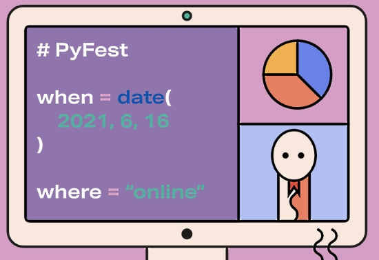](https://pyfest.online/)

PyFest is an online festival dedicated to Python. The aim is to bring all the Python community together in a fun and interactive event. 🤗

Join for a series of lighting talks, artistic performances, quizzes and more... starting on 16 June 2021.

PyFest will be free and streamed on [YouTube](https://www.youtube.com/channel/UCOyJ9ritUBmjXhoRXOFahJA) and [Twitch](https://www.twitch.tv/pythonitalia) - [PyFest](https://pyfest.online/).

## The CircuitPython Parsec with John Park

[This week](https://blog.adafruit.com/2021/06/11/john-parks-circuitpython-parsec-map-range-adafruit-johnedgarpark-adafruit-circuitpython/), John shows how to use the CircuitPython map_range function.

You can see the latest video and past videos on the Adafruit YouTube channel under John Park's CircuitPython Parsec playlist - [YouTube](https://www.youtube.com/watch?v=1VyQ86nlFf4&list=PLjF7R1fz_OOWFqZfqW9jlvQSIUmwn9lWr).

## News from around the web!

[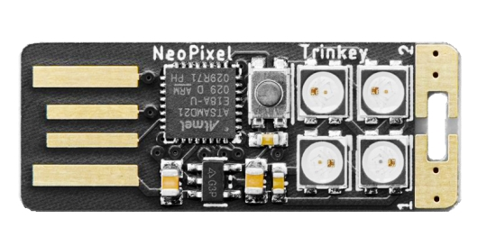](https://makezine.com/products/boards/adafruit-neo-trinkey/)

Make Boards Guide Review: Adafruit Neo Trinkey - [Make](https://makezine.com/products/boards/adafruit-neo-trinkey/).

[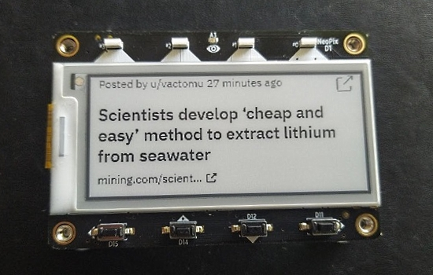](https://github.com/leventt/magtag-keps)

magtag-keps - get the top post from Reddit r/worldnews without using Reddit's API and display on an Adafruit MagTag - [GitHub](https://github.com/leventt/magtag-keps).

How to Build an RP2040 Powered Shortcut Keyboard with CircuitPython - [Tom's Hardware](https://www.tomshardware.com/how-to/build-rp2040-powered-shortcut-keypad) and [YouTube](https://youtu.be/eHP3HXQzNns).

[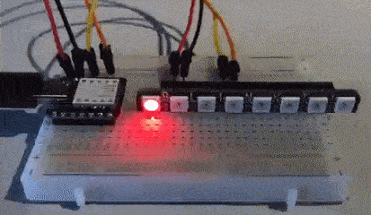](https://twitter.com/bwanijssen/status/1403696642960904193)

> Finally got the Pimoroni blinkt! working in CircuitPython on a Seeedstudio Xiao - [Twitter](https://twitter.com/bwanijssen/status/1403696642960904193).

[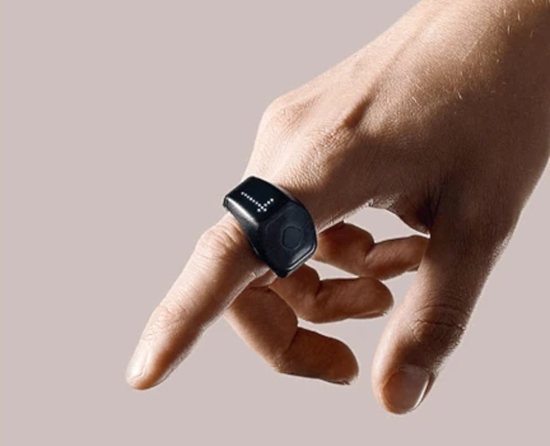](https://github.com/genkiinstruments/genki-wave)

Wave is a unique smart ring by Genki. There is a repository for the official Python API interface for Wave, arguably the easiest way to work with data from motion sensors in Python - [GitHub](https://github.com/genkiinstruments/genki-wave) and [Genki](https://genkiinstruments.com/products/wave).

> I upgraded my M4 to CircuitPython 7.0b3 with an Airlift and getting the mpy library from bundle and community bundle. The HDMI output is from the Gameduino 3X Dazzler - [Twitter](https://twitter.com/DavidGlaude/status/1402707759565475840).

"The worlds cutest 3D printed macropad" inspired by Romly‘s keycappie and powered by Adafruit QTPY and CircuitPython - [Twitter](https://twitter.com/andy_warb/status/1403455577586638861).

[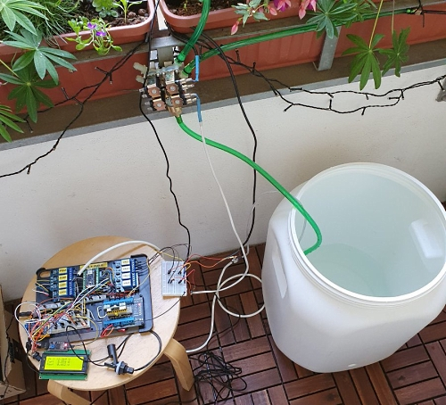](https://twitter.com/lovebootcaptain/status/1402292013920292873)

> 2nd big testing round of the plant watering project. Now with real sensors. prototyped just 2 cabels together hanging them in water detects very simple if there is water left in the tank or not and if it's refilled completely to stop the pump and close the valve. Dne in CircuitPython - [Twitter](https://twitter.com/lovebootcaptain/status/1402292013920292873).

> It's pretty easy to get audio and LEDs playing at the same time in CircuitPython on Raspberry Pi Pico RP2040 boards. This example on an Adafruit QTPy RP2040 - [Twitter](https://twitter.com/todbot/status/1403451581593374720).

[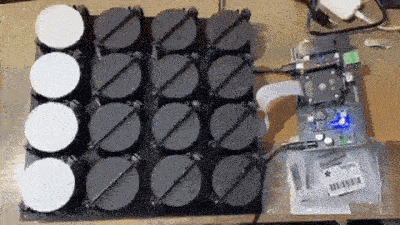](https://twitter.com/ohararp/status/1403095758996393984)

> Finally getting around to updating this project with CircuitPython in preparation for the next version (stepper motor for that one). Unexpected Maker and Adafruit are helping make this happen - [Twitter](https://twitter.com/ohararp/status/1403095758996393984).

[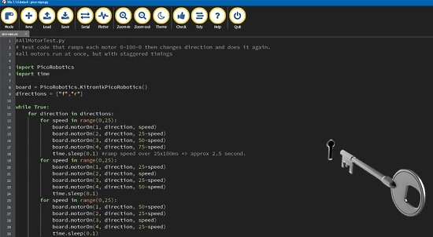](https://kitronik.co.uk/blogs/resources/circuitpython-for-kitronik-motor-driver-boards-for-raspberry-pi-pico)

Using CircuitPython With The Kitronik Motor Driver Boards for Raspberry Pi Pico - [Kitronik](https://kitronik.co.uk/blogs/resources/circuitpython-for-kitronik-motor-driver-boards-for-raspberry-pi-pico).

[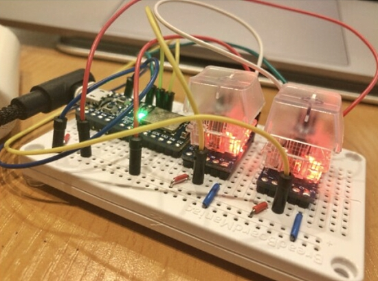](https://twitter.com/mu2in/status/1402227103278395394)

Introduction to Self-Made Keyboard in CircuitPython from PyCon mini Hiroshima (Japanese) - [Twitter](https://twitter.com/mu2in/status/1402227103278395394) and [Slides](https://speakerdeck.com/mu2in/introduction-to-self-made-keyboard-from-python).

[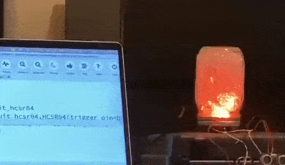](https://twitter.com/gallaugher/status/1403896772670509057)

A 4” pitch 20 light NeoPixel strand in a mason jar with gel beads for light diffusion, connected to a CircuitPlayground Bluefruit and a simple CircuitPython script - [Twitter](https://twitter.com/gallaugher/status/1403896772670509057).

Configuring an FPGA using a SAMD21 development board running a CircuitPython script - [Twitter](https://twitter.com/mifune/status/1404071501771509768).

Toy Keyboard USB Matrix Decode with the Pi Pico and CircuitPython - [DIY Electromusic](https://diyelectromusic.wordpress.com/2021/06/13/toy-keyboard-usb-matrix-decode-with-the-pi-pico/).

A scrolling text graduation gown with CircuitPython and an LED matrix display - [Twitter](https://twitter.com/caitlinsdad/status/1403552291203043328).

Pushing the "just make it out of PCB" thing, and do buttons (touch), battery holder and USB socket all from a 0.6mm PCB, with just the MCU and the screen as discrete parts running CircuitPython - [Twitter Thread](https://twitter.com/deshipu/status/1403787034679025664).

[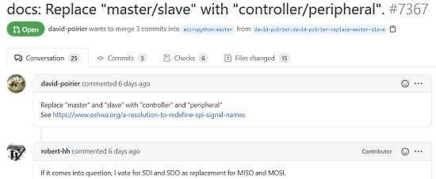](https://github.com/micropython/micropython/pull/7367)

MicroPython PR: Replace "master/slave" with "controller/peripheral" for SPI - [GitHub](https://github.com/micropython/micropython/pull/7367) and [Adafruit Blog](https://blog.adafruit.com/2021/06/12/micropython-updating-to-controller-peripheral/).

[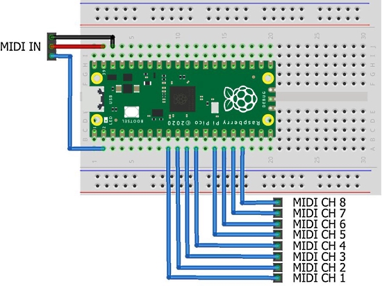](https://diyelectromusic.wordpress.com/2021/06/13/raspberry-pi-pico-midi-channel-router/)

Raspberry Pi Pico MIDI One to Eight Channel Router with MicroPython - [DIY Electromusic](https://diyelectromusic.wordpress.com/2021/06/13/raspberry-pi-pico-midi-channel-router/) and [YouTube](https://youtu.be/0nMCz2MMqjM).

[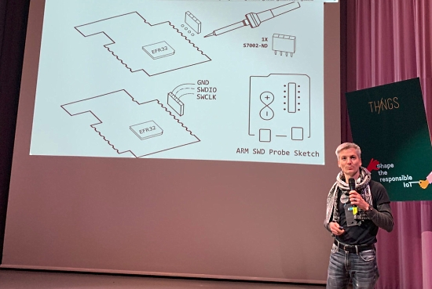](https://trmm.net/Ikea/)

MicroPython and Ikea SmartHome - [Trammell Hudson](https://trmm.net/Ikea/).

[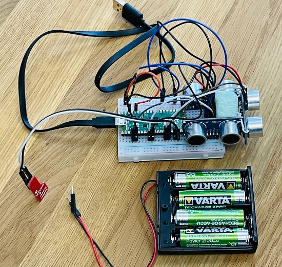](https://sonar.glass.unpi.ro/)

unPi Sonar Glass: a proof of concept, inexpensive Smart Visor for the Blind, built with MicroPython on a Raspberry Pico - [unpi.ro](https://sonar.glass.unpi.ro/).

[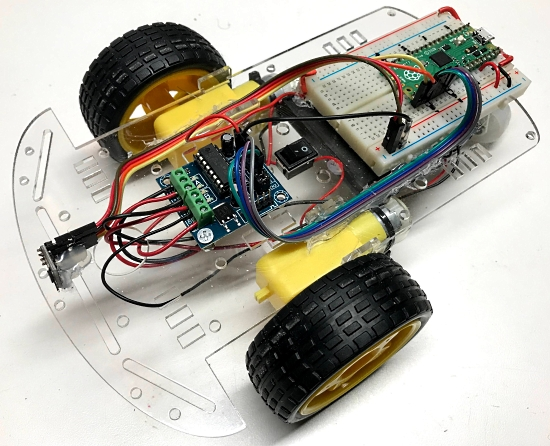](http://www.coderdojotc.org/micropython/robots/02-base-bot/)

A Raspberry Pi Pico MicroPython base robot - [Coder Dojo](http://www.coderdojotc.org/micropython/robots/02-base-bot/) and [YouTube](https://youtu.be/0d3tF1oXu90).

[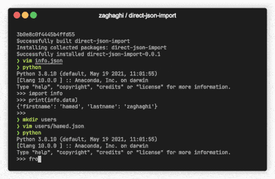](https://github.com/zaghaghi/direct-json-import)

Directly import json files into your Python code. Let's say you have a json file named `info.json`. After installing this Python package you can use json data by adding `import info` to your code - [GitHub](https://github.com/zaghaghi/direct-json-import).

[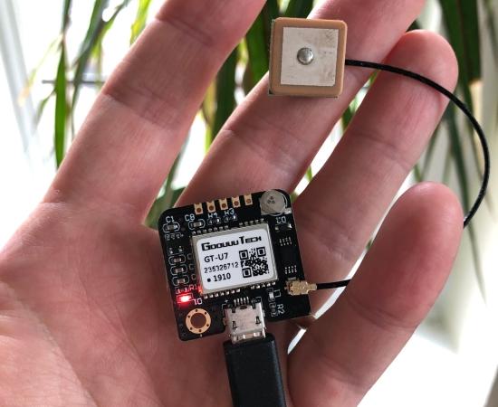](https://healeycodes.com/listening-to-satellites-with-my-raspberry-pi/)

Listening to Satellites with my Raspberry Pi - [healeycodes.com](https://healeycodes.com/listening-to-satellites-with-my-raspberry-pi/).

Air Piano using OpenCV and Python - [Towards Data Science](https://towardsdatascience.com/air-piano-using-opencv-and-python-298cb22097d9) and [GitHub](https://github.com/umar07/OpenCV-Projects/tree/main/Air-Piano).

pytube - a lightweight, dependency-free Python library (and command-line utility) for downloading YouTube Videos - [GitHub](https://github.com/pytube/pytube) and [pytube.io](https://pytube.io/en/latest/).

Python Basics: Setting Up Python video - [Twitter](https://twitter.com/realpython/status/1402713120276193280) and [Real Python](https://realpython.com/courses/setting-up-python/).

Python is 1.3x faster by just adjusting some compiling options for libpython - [Python Bug Tracker](https://bugs.python.org/issue38980?fbclid=IwAR0cyfahpBywNzbqLCpcfwatOaU6W8UQp7LgVu8KZ8hDc-wKLjLE7wjOs7g).

The 2021 Python Language Summit: What is the stdlib? - [PSF Blog](https://pyfound.blogspot.com/2021/05/the-2021-python-language-summit-what-is.html).

What’s New In Python 3.10 - [Python Docs](https://docs.python.org/3.10/whatsnew/3.10.html).

[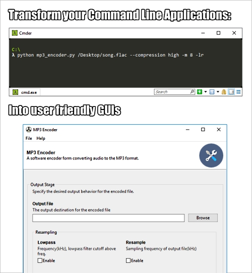](https://github.com/chriskiehl/Gooey)

Gooey: Turn (almost) any Python 2 or 3 Console Program into a GUI application with one line - [GitHub](https://github.com/chriskiehl/Gooey).

How I teach Python on the Raspberry Pi 400 at the public library - [opensource.com](https://opensource.com/article/21/6/teach-python-raspberry-pi).

[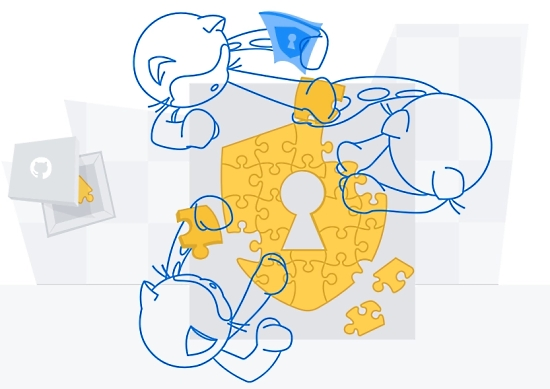](https://github.blog/2021-06-08-securing-open-source-supply-chain-scanning-package-registry-credentials/)

Securing the open source supply chain by scanning for package registry credentials - [GitHub Blog](https://github.blog/2021-06-08-securing-open-source-supply-chain-scanning-package-registry-credentials/).

Switch Statements in Python 3.10 - [Dev](https://dev.to/grayhat/switch-statements-in-python-3-10-3241).

#ICYDNCI What was the most popular, most clicked link, in [last week's newsletter](https://www.adafruitdaily.com/2021/06/08/python-on-microcontrollers-newsletter-new-circuitpython-releases-rp2040-singles-and-more-python-adafruit-circuitpython-micropython-thepsf/)? [pyRTOS: a real-time operating system (RTOS) for CircuitPython](https://blog.adafruit.com/2021/06/04/pyrtos-a-real-time-operating-system-rtos-for-circuitpython-circuitpython/).

## New Boards Supported by CircuitPython

The number of supported microcontrollers and Single Board Computers (SBC) grows every week. This section outlines which boards have been included in CircuitPython or added to [CircuitPython.org](https://circuitpython.org/).

This week there were two new boards added!

- [PGA2040](https://circuitpython.org/board/pimoroni_pga2040/)
- [ESP32-S2 Kaluga Dev Kit (v1.3) featuring WROVER](https://circuitpython.org/board/espressif_kaluga_1.3/)

Looking to add a new board to CircuitPython? It's highly encouraged! Adafruit has four guides to help you do so:

- [How to Add a New Board to CircuitPython](https://learn.adafruit.com/how-to-add-a-new-board-to-circuitpython/overview)
- [How to add a New Board to the circuitpython.org website](https://learn.adafruit.com/how-to-add-a-new-board-to-the-circuitpython-org-website)
- [Adding a Single Board Computer to PlatformDetect for Blinka](https://learn.adafruit.com/adding-a-single-board-computer-to-platformdetect-for-blinka)
- [Adding a Single Board Computer to Blinka](https://learn.adafruit.com/adding-a-single-board-computer-to-blinka)

## New Learn Guides!

[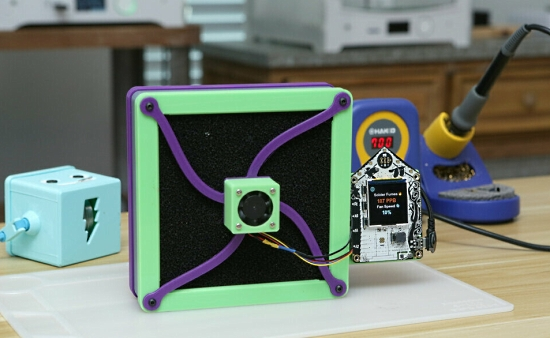](https://learn.adafruit.com/guides/latest)

[FunHouse IoT Fume Extractor and Air Quality Sensor](https://learn.adafruit.com/funhouse-fume-extractor-iot-air-quality-sensor) from [Liz Clark](https://learn.adafruit.com/users/BlitzCityDIY)

[Improved AMG8833 PyGamer Thermal Camera](https://learn.adafruit.com/improved-amg8833-pygamer-thermal-camera) from [Jan Goolsbey](https://learn.adafruit.com/users/HarpDude)

[Python Edge Speech Recognition with Voice2JSON](https://learn.adafruit.com/edge-speech-recognition-with-voice2json) from [Melissa LeBlanc-Williams](https://learn.adafruit.com/users/MakerMelissa)

[Deco Two-Key Feather Macro Pad](https://learn.adafruit.com/deco-two-key-keypad-macropad-circuitpython-feather) from [John Park](https://learn.adafruit.com/users/johnpark)

## Updated Learn Guides!

[Contribute to CircuitPython with Git and GitHub](https://learn.adafruit.com/contribute-to-circuitpython-with-git-and-github) from [Kattni](https://learn.adafruit.com/users/kattni)

## CircuitPython Project Bundle

When you get to the CircuitPython code section of an [Adafruit Learn Guide](https://learn.adafruit.com/), sometimes things can get a bit complicated. You not only have the code you need to upload to your device, but you likely also need to add some libraries that the code requires to run. This involved downloading all the libraries, digging through to find the ones you need, and copying them to your device. That was only the beginning on some projects, as those that include images and/or sound files required further downloading and copying of files. But, not anymore!

Now, with Project Bundles, you can download all the necessary code, libraries and, if needed, asset files with one click! We automatically check which libraries are required for the project and bundle them up for you. No more digging through a huge list of libraries to find the ones you need, or fiddling with looking for other files or dependencies. Download the Project Bundle, copy the contents to your device, and your code will simply work. We wanted to make this the easiest way to get a project working, regardless of whether you're a beginner or an expert. We'll also be adding this feature to popular IDEs as an add-on. Try it out with any Circuit Python guide on the Adafruit Learning System. Just look for the ‘Download Project Bundle’ button on the code page. 

**To download and use a Project Bundle:**

In the Learning System - above any embedded code in a guide in the Adafruit Learn System, you’ll find a Download Project Bundle button.

Click the button to download the Project Bundle zip.

Open the Project Bundle zip to find the example code, all necessary libraries, and, if available, any images, sounds, etc.

Simply copy all the files over to your CIRCUITPY drive, and you’re ready to go!

If you run into any problems or bugs, or would like to submit feedback, please file an issue on the [Adafruit Learning System Guides GitHub repo](https://github.com/adafruit/Adafruit_Learning_System_Guides/issues).

## CircuitPython Libraries!

CircuitPython support for hardware continues to grow. We are adding support for new sensors and breakouts all the time, as well as improving on the drivers we already have. As we add more libraries and update current ones, you can keep up with all the changes right here!

For the latest libraries, download the [Adafruit CircuitPython Library Bundle](https://circuitpython.org/libraries). For the latest community contributed libraries, download the [CircuitPython Community Bundle](https://github.com/adafruit/CircuitPython_Community_Bundle/releases).

If you'd like to contribute, CircuitPython libraries are a great place to start. Have an idea for a new driver? File an issue on [CircuitPython](https://github.com/adafruit/circuitpython/issues)! Have you written a library you'd like to make available? Submit it to the [CircuitPython Community Bundle](https://github.com/adafruit/CircuitPython_Community_Bundle). Interested in helping with current libraries? Check out the [CircuitPython.org Contributing page](https://circuitpython.org/contributing). We've included open pull requests and issues from the libraries, and details about repo-level issues that need to be addressed. We have a guide on [contributing to CircuitPython with Git and Github](https://learn.adafruit.com/contribute-to-circuitpython-with-git-and-github) if you need help getting started. You can also find us in the #circuitpython channel on the [Adafruit Discord](https://adafru.it/discord).

You can check out this [list of all the Adafruit CircuitPython libraries and drivers available](https://github.com/adafruit/Adafruit_CircuitPython_Bundle/blob/master/circuitpython_library_list.md). 

The current number of CircuitPython libraries is **319**!

**New Libraries!**

Here's this week's new CircuitPython libraries:

 * [Adafruit_CircuitPython_Simple_Text_Display](https://github.com/adafruit/Adafruit_CircuitPython_Simple_Text_Display)

**Updated Libraries!**

Here's this week's updated CircuitPython libraries:

 * [Adafruit_CircuitPython_Bitmap_Font](https://github.com/adafruit/Adafruit_CircuitPython_Bitmap_Font)
 * [Adafruit_CircuitPython_DisplayIO_Layout](https://github.com/adafruit/Adafruit_CircuitPython_DisplayIO_Layout)
 * [Adafruit_CircuitPython_DPS310](https://github.com/adafruit/Adafruit_CircuitPython_DPS310)
 * [Adafruit_CircuitPython_SI5351](https://github.com/adafruit/Adafruit_CircuitPython_SI5351)
 * [Adafruit_CircuitPython_PCA9685](https://github.com/adafruit/Adafruit_CircuitPython_PCA9685)
 * [Adafruit_CircuitPython_Gizmo](https://github.com/adafruit/Adafruit_CircuitPython_Gizmo)
 * [Adafruit_CircuitPython_Dash_Display](https://github.com/adafruit/Adafruit_CircuitPython_Dash_Display)
 * [Adafruit_CircuitPython_HID](https://github.com/adafruit/Adafruit_CircuitPython_HID)
 * [Adafruit_CircuitPython_TCA9548A](https://github.com/adafruit/Adafruit_CircuitPython_TCA9548A)
 * [Adafruit_CircuitPython_ProgressBar](https://github.com/adafruit/Adafruit_CircuitPython_ProgressBar)
 * [Adafruit_CircuitPython_seesaw](https://github.com/adafruit/Adafruit_CircuitPython_seesaw)
 * [Adafruit_CircuitPython_Wiznet5k](https://github.com/adafruit/Adafruit_CircuitPython_Wiznet5k)
 * [Adafruit_CircuitPython_BNO08x](https://github.com/adafruit/Adafruit_CircuitPython_BNO08x)
 * [Adafruit_CircuitPython_SSD1306](https://github.com/adafruit/Adafruit_CircuitPython_SSD1306)
 * [Adafruit_CircuitPython_BitbangIO](https://github.com/adafruit/Adafruit_CircuitPython_BitbangIO)
 * [Adafruit_CircuitPython_PortalBase](https://github.com/adafruit/Adafruit_CircuitPython_PortalBase)
 * [Adafruit_CircuitPython_FunHouse](https://github.com/adafruit/Adafruit_CircuitPython_FunHouse)
 * [Adafruit_CircuitPython_ESP32SPI](https://github.com/adafruit/Adafruit_CircuitPython_ESP32SPI)
 * [circuitpython](https://github.com/adafruit/circuitpython)
 * [Adafruit_Blinka](https://github.com/adafruit/Adafruit_Blinka)

## What’s the team up to this week?

What is the team up to this week? Let’s check in!

**Dan**

I released CircuitPython 7.0.0-alpha.3 last week. This the first 7.0.0 release that's been listed on [circuitpython.org](https://circuitpython.org), even though the tag is "alpha.3".

I'm continuing to work on keypad scanning support. I was on vacation for part of the past week, but will finish the initial support soon.

**Jeff**

I've continued working on ParallelImageCapture (camera) support for ESP32-S2, but sadly it's still not finished—the captured images remain very garbled, and there are some crashing bugs.

On the way, I added a board definition for the second (and current) version of the Kaluga development board, v1.3.  This version has a few pinout modifications that are supposed to let the camera work better; I also learned that, on either version, the camera module can interfere with the remote debugging feature, which creates challenges. If you have a Kaluga, check the silk screen on the bottom to find out which version it is.

Finally, while I haven't filed a pull request about it yet, I discovered and fixed a small bug in CircuitPython that could trigger a crash but only with a custom "debug build".

**Kattni**

This week we moved the rest of the CircuitPython GitHub repositories to the `main` default branch. This is an important change for many reasons. It affects contributors - the easiest solution is to delete your fork and clone, and start with a fresh fork and clone.

I also completed a massive list of miscellaneous things that came up over the weekend and throughout the week, including adding the 7.x bundle to circuitpython.org, adding a NeoPixel example to the Rotary QT Trinkey guide and more.

I started the Slider Trinkey guide and the QTRP2040 guide. Look for the Slider Trinkey guide soon, and the QTRP2040 guide not long after.

**Lucian**

While I took a week off this past week, I've most recently been working on the documentation for the sleep modes, paired with updates to the new RP2040 alarm module. I finally got a Nordic PPK2 testing board in to assist with power analysis, which has been out of stock all spring and just finally came back in with the online retailers. It's been nice to verify the power savings from the sleep modes concretely - I'm excited to revive some personal datalogging projects with Circuitpython now that I can get months of battery life per AA battery.

**Melissa**

This past week I finished working on a new guide that uses Voice2JSON to implement a very customizable Voice Assistant. Voice2JSON allows for speech recognition that runs directly on your device without the need to go out to the internet to recognize what you are saying. You can check out the guide at https://learn.adafruit.com/edge-speech-recognition-with-voice2json.

**Scott**

This week I've been bug hunting issues with the BLE workflow in the core. At this point, I think the major issues have been ironed out. Most of the issues were surrounding BLE encryption and bonding. (Bonding is the process of remembering the security keys to encrypt the connection for use in reconnecting.) Once bonded, devices may choose to broadcast an encrypted version of its device ID which reduces the ease of tracking as well. With these changes, I hope it'll be solid enough for testing with the app while I'm on vacation for next week (back June 21st).

## Upcoming events!

EuroPython, the largest conference for the Python programming language in Europe, will be held online July 26 - August 1, 2021. More information at [https://ep2021.europython.eu/](https://ep2021.europython.eu/)

PyOhio 2021 is a free event on July 31, 2021 - [PyOhio.org](https://www.pyohio.org/2021/) via [Twitter](https://twitter.com/PyOhio/status/1370184124460367881).

Call for proposals for PyConline AU 2021 runs until June 10th, 2021 with the event held 10-12 September, 2021 - [pyconlineau](https://2021.pycon.org.au/)

**Send Your Events In**

As for other events, with the COVID pandemic, most in-person events are postponed or cancelled. If you know of virtual events or events that may occur in the future, please let us know on Discord or on Twitter with hashtag #CircuitPython.

## Latest releases

CircuitPython's stable release is [#.#.#](https://github.com/adafruit/circuitpython/releases/latest) and its unstable release is [#.#.#-##.#](https://github.com/adafruit/circuitpython/releases). New to CircuitPython? Start with our [Welcome to CircuitPython Guide](https://learn.adafruit.com/welcome-to-circuitpython).

[2021####](https://github.com/adafruit/Adafruit_CircuitPython_Bundle/releases/latest) is the latest CircuitPython library bundle.

[v#.#.#](https://micropython.org/download) is the latest MicroPython release. Documentation for it is [here](http://docs.micropython.org/en/latest/pyboard/).

[#.#.#](https://www.python.org/downloads/) is the latest Python release. The latest pre-release version is [#.#.#](https://www.python.org/download/pre-releases/).

[2,467 Stars](https://github.com/adafruit/circuitpython/stargazers) Like CircuitPython? [Star it on GitHub!](https://github.com/adafruit/circuitpython)

## Call for help -- Translating CircuitPython is now easier than ever!

[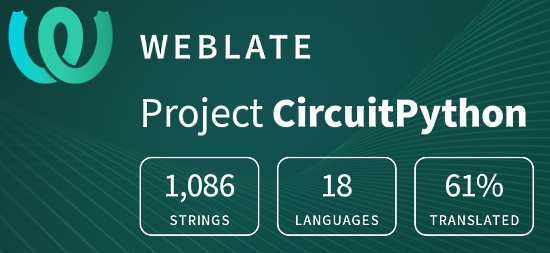](https://hosted.weblate.org/engage/circuitpython/)

One important feature of CircuitPython is translated control and error messages.

With the help of fellow open source project [Weblate](https://weblate.org/), we're making it even easier to add or improve translations.

Sign in with an existing account such as GitHub, Google or Facebook and start contributing through a simple web interface. No forks or pull requests needed!

As always, if you run into trouble join us on [Discord](https://adafru.it/discord), we're here to help.

## jobs.adafruit.com - Find a dream job, find great candidates!

[jobs.adafruit.com](https://jobs.adafruit.com/) has returned and folks are posting their skills (including CircuitPython) and companies are looking for talented makers to join their companies - from Digi-Key, to Hackaday, Micro Center, Raspberry Pi and more.

**Job of the Week**

Exhibit Fabricator III - Science Museum of Minnesota - [Adafruit Jobs Board](https://jobs.adafruit.com/job/exhibit-fabricator-iii/).

Microsoft is hiring two people for their team to speed up standard Python (CPython):

* [Senior Software Engineer](https://careers.microsoft.com/us/en/job/1062976/Senior-Software-Engineer)
* [Principal Software Engineering Manager](https://careers.microsoft.com/us/en/job/1059714/Principal-Software-Engineering-Manager).

## 29,522 thanks!

The Adafruit Discord community, where we do all our CircuitPython development in the open, reached over 29,522 humans, thank you!  Adafruit believes Discord offers a unique way for CircuitPython folks to connect. Join today at [https://adafru.it/discord](https://adafru.it/discord).

## ICYMI - In case you missed it

The wonderful world of Python on hardware! This is our Python video-newsletter-podcast! The news comes from the Python community, Discord, Adafruit communities and more and is reviewed on ASK an ENGINEER Wednesdays. The complete Python on Hardware weekly videocast [playlist is here](https://www.youtube.com/playlist?list=PLjF7R1fz_OOXRMjM7Sm0J2Xt6H81TdDev). 

This video podcast is on [iTunes](https://itunes.apple.com/us/podcast/python-on-hardware/id1451685192?mt=2), [YouTube](http://adafru.it/pohepisodes), [IGTV (Instagram TV](https://www.instagram.com/adafruit/channel/)), and [XML](https://itunes.apple.com/us/podcast/python-on-hardware/id1451685192?mt=2).

[Weekly community chat on Adafruit Discord server CircuitPython channel - Audio / Podcast edition](https://itunes.apple.com/us/podcast/circuitpython-weekly-meeting/id1451685016) - Audio from the Discord chat space for CircuitPython, meetings are usually Mondays at 2pm ET, this is the audio version on [iTunes](https://itunes.apple.com/us/podcast/circuitpython-weekly-meeting/id1451685016), Pocket Casts, [Spotify](https://adafru.it/spotify), and [XML feed](https://adafruit-podcasts.s3.amazonaws.com/circuitpython_weekly_meeting/audio-podcast.xml).

And lastly, we are working up a one-spot destination for all things podcast-able here - [podcasts.adafruit.com](https://podcasts.adafruit.com/)

## Codecademy "Learn Hardware Programming with CircuitPython"

Codecademy, an online interactive learning platform used by more than 45 million people, has teamed up with the leading manufacturer in STEAM electronics, Adafruit Industries, to create a coding course, "Learn Hardware Programming with CircuitPython". The course is now available in the [Codecademy catalog](https://www.codecademy.com/learn/learn-circuitpython?utm_source=adafruit&utm_medium=partners&utm_campaign=circuitplayground&utm_content=pythononhardwarenewsletter).

Python is a highly versatile, easy to learn programming language that a wide range of people, from visual effects artists in Hollywood to mission control at NASA, use to quickly solve problems. But you don’t need to be a rocket scientist to accomplish amazing things with it. This new course introduces programmers to Python by way of a microcontroller — CircuitPython — which is a Python-based programming language optimized for use on hardware.

CircuitPython’s hardware-ready design makes it easier than ever to program a variety of single-board computers, and this course gets you from no experience to working prototype faster than ever before. Codecademy’s interactive learning environment, combined with Adafruit's highly rated Circuit Playground Express, present aspiring hardware hackers with a never-before-seen opportunity to learn hardware programming seamlessly online.

Whether for those who are new to programming, or for those who want to expand their skill set to include physical computing, this course will have students getting familiar with Python and creating incredible projects along the way. By the end, students will have built their own bike lights, drum machine, and even a moisture detector that can tell when it's time to water a plant.

Visit Codecademy to access the [Learn Hardware Programming with CircuitPython](https://www.codecademy.com/learn/learn-circuitpython?utm_source=adafruit&utm_medium=partners&utm_campaign=circuitplayground&utm_content=pythononhardwarenewsletter) course and Adafruit to purchase a [Circuit Playground Express](https://www.adafruit.com/product/3333).

Codecademy has helped more than 45 million people around the world upgrade their careers with technology skills. The company’s online interactive learning platform is widely recognized for providing an accessible, flexible, and engaging experience for beginners and experienced programmers alike. Codecademy has raised a total of $43 million from investors including Union Square Ventures, Kleiner Perkins, Index Ventures, Thrive Capital, Naspers, Yuri Milner and Richard Branson, most recently raising its $30 million Series C in July 2016.

## Contribute!

The CircuitPython Weekly Newsletter is a CircuitPython community-run newsletter emailed every Tuesday. The complete [archives are here](https://www.adafruitdaily.com/category/circuitpython/). It highlights the latest CircuitPython related news from around the web including Python and MicroPython developments. To contribute, edit next week's draft [on GitHub](https://github.com/adafruit/circuitpython-weekly-newsletter/tree/gh-pages/_drafts) and [submit a pull request](https://help.github.com/articles/editing-files-in-your-repository/) with the changes. You may also tag your information on Twitter with #CircuitPython. 

Join our [Discord](https://adafru.it/discord) or [post to the forum](https://forums.adafruit.com/viewforum.php?f=60) for any further questions.
