- [X] Kattni updates
- [ ] change date
- [ ] update title
- [ ] Feature story
- [ ] Update  for images
- [ ] Update ICYDNCI
- [ ] All images 550w max only
- [ ] Link "View this email in your browser."

News Sources

- [python.org](https://www.python.org/)
- [Python Insider - dev team blog](https://pythoninsider.blogspot.com/)

View this email in your browser.

Welcome to the latest Python on Microcontrollers newsletter, brought you by the community! We're on [Discord](https://discord.gg/HYqvREz), [Twitter](https://twitter.com/search?q=circuitpython&src=typed_query&f=live), and for past newsletters - [view them all here](https://www.adafruitdaily.com/category/circuitpython/). If you're reading this on the web, [subscribe here](https://www.adafruitdaily.com/). Let's get started!

## Raspberry Pi Rolls Out New Documentation Online

[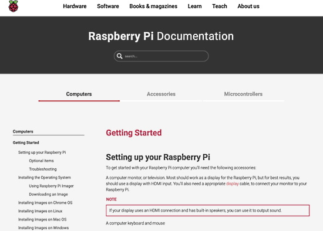](https://www.raspberrypi.org/blog/bring-on-the-documentation/)

Until recently, documentation for the non-Pico Raspberry Pi boards was on GitHub in GitHub Markdown language. As of Monday August 9th, a [new documentation site](https://www.raspberrypi.org/documentation/) has been built and deployed directly from a [documentation repository](https://github.com/raspberrypi/documentation) using [Github Actions](https://github.com/features/actions), when someone pushes to the **master** branch. However people will mostly be working on the **develop** branch in the repository, which is the default branch when you take a fresh checkout, and also the branch you should target for your [pull requests](https://github.com/raspberrypi/documentation/pulls) - [Raspberry Pi Blog](https://www.raspberrypi.org/blog/bring-on-the-documentation/).

## CircuitPython Day 2021 Recap

CircuitPython Day 2021 was held Friday August 6th with events leading up to the big day. Thanks to all who contributed to make this year a rousing success. Here is a list of events you can watch on YouTube covering the discussions:

* [Show and Tell](https://youtu.be/DB5dh_nL3hY) - August 4, 2021
* [Tim's CircuitPython Day Broadcast](https://www.youtube.com/watch?v=ED0luF_q3ec)
* [Jeff, Dan and Kattni Discuss CircuitPython](https://www.youtube.com/watch?v=NgykgLEKB3k)
* [A CircuitPython Board Tour with Ladyada](https://youtu.be/UwGtmSZkm2c)
* [Scott's CircuitPython Deep Dive](https://studio.youtube.com/video/v9NhQ0F9054/edit)

## Python in Visual Studio Code – August 2021 Release

[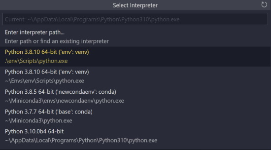](https://devblogs.microsoft.com/python/python-in-visual-studio-code-august-2021-release/)

The August 2021 release of the Python Extension for Visual Studio Code is now available. This includes a revamped Jupyter notebooks experience brought by the Jupyter extension now out of preview, and an improved way of sorting Python interpreters on the selection list - [Microsoft Python Devblog](https://devblogs.microsoft.com/python/python-in-visual-studio-code-august-2021-release/).

## The State of Python in 2021

A review of many things happening in Python this year, It includes several sections - [De Programmatica Ipsum](https://deprogrammaticaipsum.com/the-state-of-python-in-2021/).

* The Ecosystem
* Machine Learning and Scientific Computing
* Getting Python
* Learning Python
* Guido van Rossum
* More

## The Real Python Podcast with Nina Zakharenko

[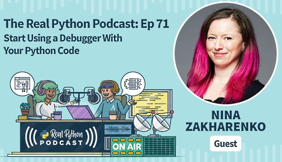](https://realpython.com/podcasts/rpp/71/)

The Real Python Podcast hosts Pythonista Nina Zakharenko. The topic is Start Using a Debugger With Your Python Code - [Real Python Podcast](https://realpython.com/podcasts/rpp/71/).

## CircuitPython Deep Dive Stream with Scott Shawcroft

[Last week](https://youtu.be/v9NhQ0F9054) on CircuitPython Day, Scott answered questions, talked about fixing for CircuitPython 7.0.0 and dived deep into system on a chip datasheet diagrams. 

You can see the latest video and past videos on the Adafruit YouTube channel under the Deep Dive playlist - [YouTube](https://www.youtube.com/playlist?list=PLjF7R1fz_OOXBHlu9msoXq2jQN4JpCk8A).

## News from around the web!

[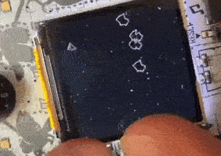](https://twitter.com/todbot/status/1423331295384399883)

> Alternate take on "Not Asteroids"™, this time using CircuitPython's displayio.TileGrid as intended (needs a 120-tile spritesheet to get rotations near rotozoom smooth!) This still on Adafruit FunHouse but this'll work better on RP2040 boards which have no floating point hardware - [Twitter](https://twitter.com/todbot/status/1423331295384399883).

[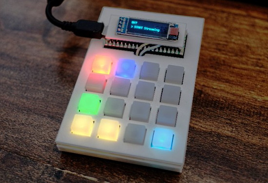](https://twitter.com/kota_morishita/status/1423524238690983940)

Pico RGB Keypad Stream Deck with OLED monitor - [Twitter](https://twitter.com/kota_morishita/status/1423524238690983940) and [GitHub](https://github.com/kotamorishi/pico-rgbkeypad-streamdeck).

[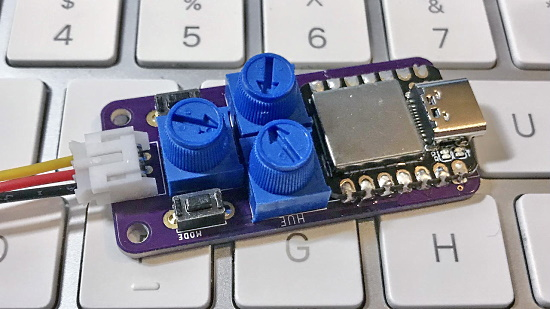](https://twitter.com/PaintYourDragon/status/1423140473665855491)

[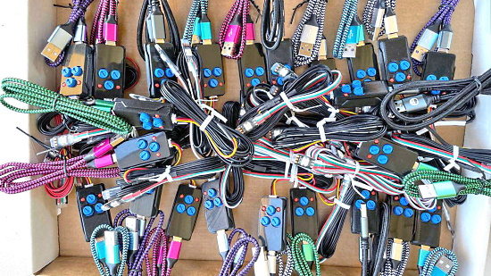](https://twitter.com/PaintYourDragon/status/1423140473665855491)

> 2 dozen NeoPixel eye controllers for a friend’s puppet production. HSV color control + a few behaviors like fire flicker, blinking, etc. What I haven’t shown them yet is that when their requirements inevitably change, it’s drag-and-drop reprogrammable  - [Twitter](https://twitter.com/PaintYourDragon/status/1423140473665855491).

[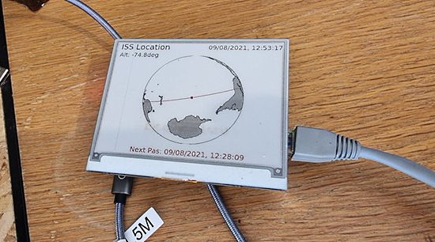](https://twitter.com/Worlds6440/status/1424706391680376841)

A graphical International Space Station (ISS) tracker with an eInk display running on a Raspberry Pi programmed in Python  - [Twitter](https://twitter.com/Worlds6440/status/1424706391680376841) and [GitHub](https://github.com/worlds6440/iss_tracker).

A DIY Stream Deck, powered by a Raspberry Pi Pico with 3D printed enclosure and keycaps. Programmed in CircuitPython, it uses LED Sequins from Adafruit which fit perfectly behind the key switches - [Twitter](https://twitter.com/btcor/status/1424708214306787328).

Circuit DAWG: a pure-python reader for DAWGs on CircuitPython compatible boards - [Twitter](https://twitter.com/kbravh/status/1423637608190681089) and [GitHub](https://github.com/kbravh/circuit-dawg).

> I've started working with an Adafruit Feather board to make a custom keyboard, and I'm forking a library to support CircuitPython for the predictive text! 

[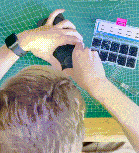](https://github.com/lanewinfield/shoom)

shoom: a foot-activated webcam to show off your sneakers in a video chat! Uses CircuitPython on an Adafruit Trinket M0 - [GitHub](https://github.com/lanewinfield/shoom).

A 3D printed working MultiPass prop, now up to version 3. Built with CircuitPython on a Raspberry Pi Pico - [Twitter](https://twitter.com/Gavin02639495/status/1422938764901560331).

[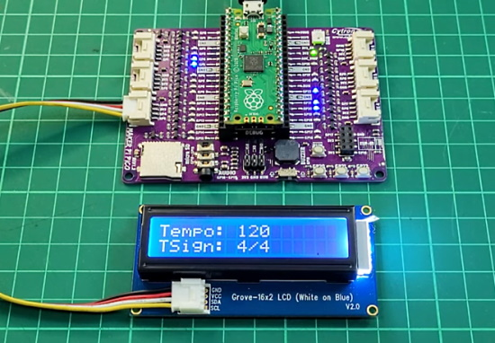](https://blog.adafruit.com/2021/08/04/make-a-metronome-powered-by-raspberry-pi-pico-and-circuitpython-circuitpythonday2021-circuitpython-cytrontech/)

A metronome, powered by Raspberry Pi Pico and CircuitPython - [Adafruit Blog](https://blog.adafruit.com/2021/08/04/make-a-metronome-powered-by-raspberry-pi-pico-and-circuitpython-circuitpythonday2021-circuitpython-cytrontech/), [Project Page](https://tutorial.cytron.io/2021/08/03/metronome-maker-pi-pico-programmed-with-circuitpython/) and [YouTube](https://youtu.be/_hdqiN1KnIs).

[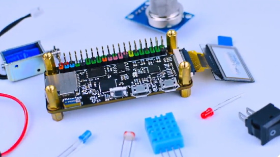](https://twitter.com/4hackrr/status/1422946634309197827)

AtmegaZero boards are being packed for GroupGets distribution with CircuitPython on them - [Twitter](https://twitter.com/4hackrr/status/1422946634309197827).

text - [site](url).

text - [site](url).

text - [site](url).

text - [site](url).

text - [site](url).

text - [site](url).

text - [site](url).

text - [site](url).

[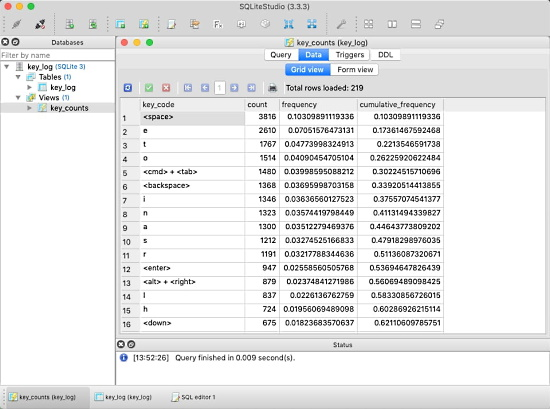](https://github.com/Ga68/benign-key-logger)

benign-key-logger: a simple, transparent, open-source key logger, written in Python, for tracking your own key usage. Originally intended as a tool for keyboard layout optimization - [GitHub](https://github.com/Ga68/benign-key-logger).

The Unknown Features of Python's Operator Module - [Martin Heinz](https://martinheinz.dev/blog/54).

[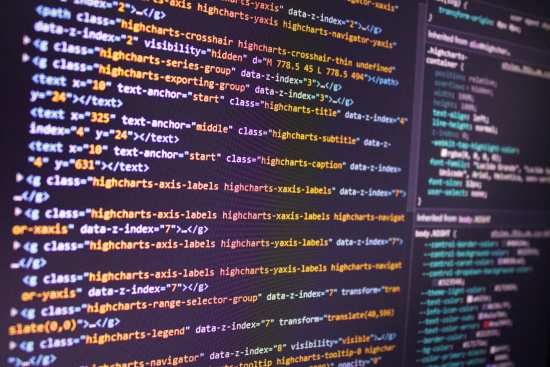](https://www.analyticsvidhya.com/blog/2021/08/5-ways-for-data-scientists-to-code-efficiently-in-python/)

5 ways for Data Scientists to Code Efficiently in Python - [Analytics Vidhya](https://www.analyticsvidhya.com/blog/2021/08/5-ways-for-data-scientists-to-code-efficiently-in-python/).

**#ICYDNCI What was the most popular, most clicked link, in [last week's newsletter](https://link)? [title](url).**

## Coming soon

[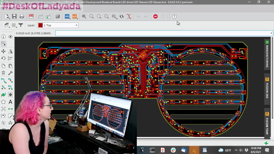](https://youtu.be/yivEf9ygd10)

Ladyada shows a complicated to route prototype board on The Desk of Ladyada - [YouTube](https://youtu.be/yivEf9ygd10).

[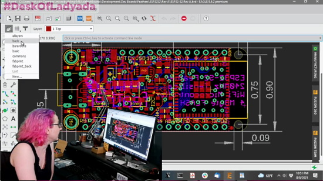](https://youtu.be/yivEf9ygd10)

Ladyada previews a Feather board with an ESP32-S2 microcontroller prototype - [YouTube](https://youtu.be/yivEf9ygd10).

## New Boards Supported by CircuitPython

The number of supported microcontrollers and Single Board Computers (SBC) grows every week. This section outlines which boards have been included in CircuitPython or added to [CircuitPython.org](https://circuitpython.org/).

This week, there were no new boards added, but there are some being worked on.

Looking to add a new board to CircuitPython? It's highly encouraged! Adafruit has four guides to help you do so:

- [How to Add a New Board to CircuitPython](https://learn.adafruit.com/how-to-add-a-new-board-to-circuitpython/overview)
- [How to add a New Board to the circuitpython.org website](https://learn.adafruit.com/how-to-add-a-new-board-to-the-circuitpython-org-website)
- [Adding a Single Board Computer to PlatformDetect for Blinka](https://learn.adafruit.com/adding-a-single-board-computer-to-platformdetect-for-blinka)
- [Adding a Single Board Computer to Blinka](https://learn.adafruit.com/adding-a-single-board-computer-to-blinka)

## New Learn Guides!

[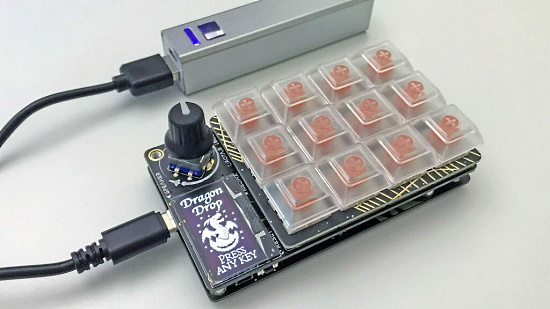](https://learn.adafruit.com/guides/latest)

[Dragon Drop: a CircuitPython Game for MacroPad](https://learn.adafruit.com/dragon-drop-a-circuitpython-game-for-macropad) from [Phil Burgess](https://learn.adafruit.com/users/pburgess)

[Minecraft Turbopad](https://learn.adafruit.com/minecraft-turbopad) from [John Park](https://learn.adafruit.com/users/johnpark)

[CircuitPython Webcam with OV2640](https://learn.adafruit.com/circuitpython-webcam-with-ov2640) from [Jeff Epler](https://learn.adafruit.com/users/jepler)

## CircuitPython Project Bundle

When you get to the CircuitPython code section of an [Adafruit Learn Guide](https://learn.adafruit.com/), sometimes things can get a bit complicated. You not only have the code you need to upload to your device, but you likely also need to add some libraries that the code requires to run. This involved downloading all the libraries, digging through to find the ones you need, and copying them to your device. That was only the beginning on some projects, as those that include images and/or sound files required further downloading and copying of files. But, not anymore!

Now, with Project Bundles, you can download all the necessary code, libraries and, if needed, asset files with one click! We automatically check which libraries are required for the project and bundle them up for you. No more digging through a huge list of libraries to find the ones you need, or fiddling with looking for other files or dependencies. Download the Project Bundle, copy the contents to your device, and your code will simply work. We wanted to make this the easiest way to get a project working, regardless of whether you're a beginner or an expert. We'll also be adding this feature to popular IDEs as an add-on. Try it out with any Circuit Python guide on the Adafruit Learning System. Just look for the ‘Download Project Bundle’ button on the code page. 

**To download and use a Project Bundle:**

In the Learning System - above any embedded code in a guide in the Adafruit Learn System, you’ll find a Download Project Bundle button.

Click the button to download the Project Bundle zip.

Open the Project Bundle zip to find the example code, all necessary libraries, and, if available, any images, sounds, etc.

Simply copy all the files over to your CIRCUITPY drive, and you’re ready to go!

If you run into any problems or bugs, or would like to submit feedback, please file an issue on the [Adafruit Learning System Guides GitHub repo](https://github.com/adafruit/Adafruit_Learning_System_Guides/issues).

## CircuitPython Libraries!

CircuitPython support for hardware continues to grow. We are adding support for new sensors and breakouts all the time, as well as improving on the drivers we already have. As we add more libraries and update current ones, you can keep up with all the changes right here!

For the latest libraries, download the [Adafruit CircuitPython Library Bundle](https://circuitpython.org/libraries). For the latest community contributed libraries, download the [CircuitPython Community Bundle](https://github.com/adafruit/CircuitPython_Community_Bundle/releases).

If you'd like to contribute, CircuitPython libraries are a great place to start. Have an idea for a new driver? File an issue on [CircuitPython](https://github.com/adafruit/circuitpython/issues)! Have you written a library you'd like to make available? Submit it to the [CircuitPython Community Bundle](https://github.com/adafruit/CircuitPython_Community_Bundle). Interested in helping with current libraries? Check out the [CircuitPython.org Contributing page](https://circuitpython.org/contributing). We've included open pull requests and issues from the libraries, and details about repo-level issues that need to be addressed. We have a guide on [contributing to CircuitPython with Git and Github](https://learn.adafruit.com/contribute-to-circuitpython-with-git-and-github) if you need help getting started. You can also find us in the #circuitpython channel on the [Adafruit Discord](https://adafru.it/discord).

You can check out this [list of all the Adafruit CircuitPython libraries and drivers available](https://github.com/adafruit/Adafruit_CircuitPython_Bundle/blob/master/circuitpython_library_list.md). 

The current number of CircuitPython libraries is **330**!

**New Libraries!**

Here's this week's new CircuitPython libraries:

 * [Adafruit_CircuitPython_IS31FL3741](https://github.com/adafruit/Adafruit_CircuitPython_IS31FL3741)

**Updated Libraries!**

Here's this week's updated CircuitPython libraries:

 * [Adafruit_CircuitPython_SCD4X](https://github.com/adafruit/Adafruit_CircuitPython_SCD4X)
 * [Adafruit_CircuitPython_MCP230xx](https://github.com/adafruit/Adafruit_CircuitPython_MCP230xx)
 * [Adafruit_CircuitPython_SGP40](https://github.com/adafruit/Adafruit_CircuitPython_SGP40)
 * [Adafruit_CircuitPython_OV2640](https://github.com/adafruit/Adafruit_CircuitPython_OV2640)
 * [Adafruit_CircuitPython_Simple_Text_Display](https://github.com/adafruit/Adafruit_CircuitPython_Simple_Text_Display)
 * [Adafruit_CircuitPython_MacroPad](https://github.com/adafruit/Adafruit_CircuitPython_MacroPad)

## What’s the team up to this week?

What is the team up to this week? Let’s check in!

**Dan**

I've fixed some more audio bugs, and am now working on a "crackling"-sound bug that is intermittent.

We are gradually knocking off the remaining issues for 7.0.0. A number remain (and we still are getting new ones), but we are making progress!

**Jeff**

Continuing with the camera theme, I've created a pull request to add QR code reading to all CircuitPython boards where we have camera support. This builds on a library called quirc by Daniel Beer (@dlbeer on github) that is also used by OpenMV. With the OV2640 camera, it takes the ESP32-S2 about a second to decode a simple QR code which can contain text, a URL, or other information. Scanning from an LCD computer monitor or a piece of paper works best, I haven't had much luck scanning from my phone's OLED screen.

**Melissa**

This past week I worked on a guide for using the MacroPad with Home Assistant via Remote Procedure Calls. This way a script running on the computer can make the actual networking calls and send the responses back over a serial connection. I was out sick for part of the week and was unable to finish the guide, so it should be coming soon.

**Kattni**

This week I spent quite a bit of time doing some cleanup around the templates, including moving code around, updating templates to use embedded examples, and using dynamically generated images to show what the CIRCUITPY drive should look like for some of the examples. I'm happy with where things are at the moment, so when I have time, I can move on to creating new templates and adding current templates to more guides.

I also updated the PCF8523 and DS3231 guides to include the STEMMA QT versions of the boards. We added those two RTC breakouts to the shop as new products (versus replacing the original version), so the guides reflect both options still being available.

**Scott**

This week has been another one full of bug hunting. The biggest bug I found was that the nRF UF2 bootloader wasn't copying UF2s >1MB over correctly. This lead to a number of issues we were seeing when trying to run debug nrf builds by loading with the UF2 bootloader. This issue has been fixed in [0.6.1 of the bootloader](https://github.com/adafruit/Adafruit_nRF52_Bootloader/releases/tag/0.6.1).

I also fixed a small issue with the BLE serial output and added the ability to disable the BLE workflow from boot.py.

I'm dabbling in a number of things at the moment as folks working on the BLE workflow apps make progress and inevitably find issues.

## Upcoming events!

PyConline AU will be held 10-12 September, 2021 - [pyconlineau](https://2021.pycon.org.au/)

Kiwi PyCon XI, Ōtautahi Christchurch, 17th, 18th, & 19th of September 2021 and CFP ends July 16th - [python.nz](https://python.nz/kiwipycon).

**Send Your Events In**

As for other events, with the COVID pandemic, most in-person events are postponed or cancelled. If you know of virtual events or events that may occur in the future, please let us know on Discord or on Twitter with hashtag #CircuitPython.

## Latest releases

CircuitPython's stable release is [#.#.#](https://github.com/adafruit/circuitpython/releases/latest) and its unstable release is [#.#.#-##.#](https://github.com/adafruit/circuitpython/releases). New to CircuitPython? Start with our [Welcome to CircuitPython Guide](https://learn.adafruit.com/welcome-to-circuitpython).

[2021####](https://github.com/adafruit/Adafruit_CircuitPython_Bundle/releases/latest) is the latest CircuitPython library bundle.

[v#.#.#](https://micropython.org/download) is the latest MicroPython release. Documentation for it is [here](http://docs.micropython.org/en/latest/pyboard/).

[#.#.#](https://www.python.org/downloads/) is the latest Python release. The latest pre-release version is [#.#.#](https://www.python.org/download/pre-releases/).

[2,535 Stars](https://github.com/adafruit/circuitpython/stargazers) Like CircuitPython? [Star it on GitHub!](https://github.com/adafruit/circuitpython)

## Call for help -- Translating CircuitPython is now easier than ever!

One important feature of CircuitPython is translated control and error messages.

With the help of fellow open source project [Weblate](https://weblate.org/), we're making it even easier to add or improve translations.

Sign in with an existing account such as GitHub, Google or Facebook and start contributing through a simple web interface. No forks or pull requests needed!

As always, if you run into trouble join us on [Discord](https://adafru.it/discord), we're here to help.

## jobs.adafruit.com - Find a dream job, find great candidates!

[jobs.adafruit.com](https://jobs.adafruit.com/) has returned and folks are posting their skills (including CircuitPython) and companies are looking for talented makers to join their companies - from Digi-Key, to Hackaday, Micro Center, Raspberry Pi and more.

**Job of the Week**

Seeking an influencer and content creator Rockstar at Digi-Key Electronics - [Adafruit Jobs Board](https://jobs.adafruit.com/job/seeking-an-influencer-and-content-creator-rockstar/).

## NUMBER thanks!

The Adafruit Discord community, where we do all our CircuitPython development in the open, reached over NUMBER humans, thank you!  Adafruit believes Discord offers a unique way for CircuitPython folks to connect. Join today at [https://adafru.it/discord](https://adafru.it/discord).

## ICYMI - In case you missed it

The wonderful world of Python on hardware! This is our Python video-newsletter-podcast! The news comes from the Python community, Discord, Adafruit communities and more and is reviewed on ASK an ENGINEER Wednesdays. The complete Python on Hardware weekly videocast [playlist is here](https://www.youtube.com/playlist?list=PLjF7R1fz_OOXRMjM7Sm0J2Xt6H81TdDev). 

This video podcast is on [iTunes](https://itunes.apple.com/us/podcast/python-on-hardware/id1451685192?mt=2), [YouTube](http://adafru.it/pohepisodes), [IGTV (Instagram TV](https://www.instagram.com/adafruit/channel/)), and [XML](https://itunes.apple.com/us/podcast/python-on-hardware/id1451685192?mt=2).

[Weekly community chat on Adafruit Discord server CircuitPython channel - Audio / Podcast edition](https://itunes.apple.com/us/podcast/circuitpython-weekly-meeting/id1451685016) - Audio from the Discord chat space for CircuitPython, meetings are usually Mondays at 2pm ET, this is the audio version on [iTunes](https://itunes.apple.com/us/podcast/circuitpython-weekly-meeting/id1451685016), Pocket Casts, [Spotify](https://adafru.it/spotify), and [XML feed](https://adafruit-podcasts.s3.amazonaws.com/circuitpython_weekly_meeting/audio-podcast.xml).

And lastly, we are working up a one-spot destination for all things podcast-able here - [podcasts.adafruit.com](https://podcasts.adafruit.com/)

## Codecademy "Learn Hardware Programming with CircuitPython"

[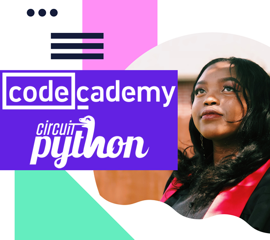](https://www.codecademy.com/learn/learn-circuitpython?utm_source=adafruit&utm_medium=partners&utm_campaign=circuitplayground&utm_content=pythononhardwarenewsletter)

Codecademy, an online interactive learning platform used by more than 45 million people, has teamed up with the leading manufacturer in STEAM electronics, Adafruit Industries, to create a coding course, "Learn Hardware Programming with CircuitPython". The course is now available in the [Codecademy catalog](https://www.codecademy.com/learn/learn-circuitpython?utm_source=adafruit&utm_medium=partners&utm_campaign=circuitplayground&utm_content=pythononhardwarenewsletter).

Python is a highly versatile, easy to learn programming language that a wide range of people, from visual effects artists in Hollywood to mission control at NASA, use to quickly solve problems. But you don’t need to be a rocket scientist to accomplish amazing things with it. This new course introduces programmers to Python by way of a microcontroller — CircuitPython — which is a Python-based programming language optimized for use on hardware.

CircuitPython’s hardware-ready design makes it easier than ever to program a variety of single-board computers, and this course gets you from no experience to working prototype faster than ever before. Codecademy’s interactive learning environment, combined with Adafruit's highly rated Circuit Playground Express, present aspiring hardware hackers with a never-before-seen opportunity to learn hardware programming seamlessly online.

Whether for those who are new to programming, or for those who want to expand their skill set to include physical computing, this course will have students getting familiar with Python and creating incredible projects along the way. By the end, students will have built their own bike lights, drum machine, and even a moisture detector that can tell when it's time to water a plant.

Visit Codecademy to access the [Learn Hardware Programming with CircuitPython](https://www.codecademy.com/learn/learn-circuitpython?utm_source=adafruit&utm_medium=partners&utm_campaign=circuitplayground&utm_content=pythononhardwarenewsletter) course and Adafruit to purchase a [Circuit Playground Express](https://www.adafruit.com/product/3333).

Codecademy has helped more than 45 million people around the world upgrade their careers with technology skills. The company’s online interactive learning platform is widely recognized for providing an accessible, flexible, and engaging experience for beginners and experienced programmers alike. Codecademy has raised a total of $43 million from investors including Union Square Ventures, Kleiner Perkins, Index Ventures, Thrive Capital, Naspers, Yuri Milner and Richard Branson, most recently raising its $30 million Series C in July 2016.

## Contribute!

The CircuitPython Weekly Newsletter is a CircuitPython community-run newsletter emailed every Tuesday. The complete [archives are here](https://www.adafruitdaily.com/category/circuitpython/). It highlights the latest CircuitPython related news from around the web including Python and MicroPython developments. To contribute, edit next week's draft [on GitHub](https://github.com/adafruit/circuitpython-weekly-newsletter/tree/gh-pages/_drafts) and [submit a pull request](https://help.github.com/articles/editing-files-in-your-repository/) with the changes. You may also tag your information on Twitter with #CircuitPython. 

Join our [Discord](https://adafru.it/discord) or [post to the forum](https://forums.adafruit.com/viewforum.php?f=60) for any further questions.
