- [X] Kattni updates
- [ ] change date
- [ ] update title
- [ ] Feature story
- [ ] Update  for images
- [ ] Update ICYDNCI
- [ ] All images 550w max only
- [ ] Link "View this email in your browser."

News Sources

- [python.org](https://www.python.org/)
- [Python Insider - dev team blog](https://pythoninsider.blogspot.com/)

View this email in your browser.

Welcome to the latest Python on Microcontrollers newsletter, brought you by the community! We're on [Discord](https://discord.gg/HYqvREz), [Twitter](https://twitter.com/search?q=circuitpython&src=typed_query&f=live), and for past newsletters - [view them all here](https://www.adafruitdaily.com/category/circuitpython/). If you're reading this on the web, [subscribe here](https://www.adafruitdaily.com/). Let's get started!

## CircuitPython 7.0.0 Alpha 6 Released

[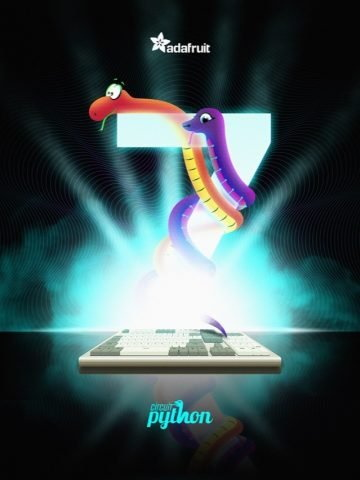](https://blog.adafruit.com/2021/08/11/circuitpython-7-0-0-alpha-6-released/)

CircuitPython 7.0.0-alpha.6, has been released. It is relatively stable, but contains a number of issues still to be addressed for 7.0.0. The Python API’s it presents may change.

Notable additions to 7.0.0 since 6.3.0 include:

- Support for the CircuitPython development workflow over BLE.
- Camera support on ESP32-S2.
- The keypad key-scanning module.
- Run-time customization of USB devices.
- Merging in of MicroPython fixes and enhancements as of MicroPython 1.16.
- `\_pixelbuf` is now `adafruit_pixelbuf`.
- `colorwheel()` routine moved to `rainbowio`.
- `supervisor.ticks_ms()` to allow easier time-keeping.
- Simplifications to the RGB status LED codes.
- A clocking fix for a few samples of RP2040 boards.
- Rework of `vectorio` and some of its API. `VectorShape` is no longer needed for user code.
- `getpass` module.
- `traceback` module.
- `board.LE` now consistently present on all boards that have such an LED.
- `PulseOut` no longer needs a `PWMOut`.
- `supervisor.get_previous_traceback()`

Read more – [Adafruit Blog](https://blog.adafruit.com/2021/08/11/circuitpython-7-0-0-alpha-6-released/) and [GitHub](https://github.com/adafruit/circuitpython/releases).

## Halloween Hackfest

Join Hackaday, Digi-Key, and Adafruit for a Halloween-themed contest! They want to see your crazy, creepy, ghostly, spooky, and awesome projects. 

If costumes are your favorite part of Halloween, then why not dress up your outfit with some hacked upgrades? You could even design a ghoulish prop to add to your home’s Halloween decor or light up a Jack-o-lantern with LEDs. Whether it’s technical, artistic, or just plain terrifying, Hackaday wants to see your projects!

Check out the Halloween Show & Tell with Hackaday, Friday, October 29th at 1pm PT, to show off your awesome projects entered in the contest. Don't forget to also share your projects on social media and use the #HalloweenHackfest!

Hackaday and Digi-Key have partnered on this Halloween-themed contest to offer three winners an online shopping spree to the Digi-Key warehouse! - [Hackaday](https://hackaday.com/2021/08/10/new-contest-halloween-hackfest/) and [hackaday.io](https://hackaday.io/contest/180664-halloween-hackfest).

## Tom’s Hardware Adafruit MacroPad RP2040 Review: The Ultimate DIY Keypad

[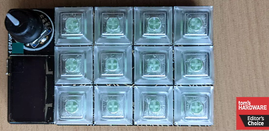](https://blog.adafruit.com/2021/08/11/toms-hardware-adafruit-macropad-rp2040-review-the-ultimate-diy-keypad-macropad-keyboards-adafruit-tomshardware/)

Tom’s Hardware just reviewed the Adafruit MacroPad USB keyboard. Their verdict: The best codable keypad on the market, Adafruit’s MacroPad RP2040 is stuffed with features you won’t find elsewhere - [Tom's Hardware](https://www.tomshardware.com/reviews/adafruit-macropad-rp2040) and [Adafruit Blog](https://blog.adafruit.com/2021/08/11/toms-hardware-adafruit-macropad-rp2040-review-the-ultimate-diy-keypad-macropad-keyboards-adafruit-tomshardware/).

## An Asteroid-like Game in CircuitPython for 6 Different Microcontroller Boards

[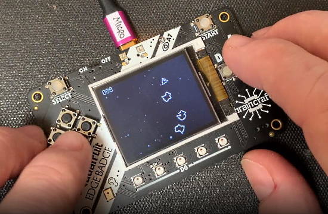](https://github.com/todbot/circuitpython_staroids)

Tod Kurt ([@todbot](https://twitter.com/todbot/status/1425556152868167685)) has created an Asteroids-like game in CircuitPython. It runs on just about any board, currently the Adafruit MacroPad, FunHouse, CLUE, PyGamer & Pybadge and the OSHW 2020 Badge. One code file for 4 different microcontrollers (nRF52840, ESP32-S2, RP2040, and SAMD51) and six different displays!

More - [GitHub](https://github.com/todbot/circuitpython_staroids) and [Twitter](https://twitter.com/todbot/status/1425556152868167685).

## Codespace for GitHub Arrives

GitHub's Codespaces, cloud-based development environments that have been in preview since May 2020, are finally here. When you create a Codespace, a shallow clone of your repository is made on a Linux virtual machine that is both dedicated and private. Prices range from $0.18 to $2.88 per hour. GitHub released Codespaces yesterday for organisations using Team and Enterprise plans. Individuals can continue to use the Codespaces beta if they have succeeded in obtaining access. GitHub said: "We'll share updates on what's coming in the near future."

GitHub has another neat feature called **github.dev**, which will remain **free**. When in a code repository, press the full stop character (period key) and an editor opens using a lightweight Codespace. What this means is that any file can be edited in the browser using a cut-down browser version of Visual Studio Code – which is very like the desktop version. There is no run or debug option in this lightweight environment, and clicking to debug prompts a dialog offering to continue either by cloning the repository locally or by starting a full Codespace - [The Register](https://www.theregister.com/2021/08/12/github_codespaces/).

## Linux and MicroPython on a simulated RISC-V chip running on a graphics card fragment shader

[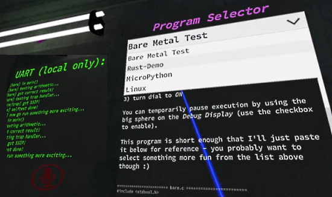](https://blog.adafruit.com/2021/08/16/linux-on-a-simulated-risc-v-chip-in-a-graphics-card-fragment-shader-riscv-linux-emulation/)

Linux and MicroPython have been ported to run on a simulated RISC-V chip in a graphics card fragment shader. Demonstrated to a group in virtual reality - [Adafruit Blog](https://blog.adafruit.com/2021/08/16/linux-on-a-simulated-risc-v-chip-in-a-graphics-card-fragment-shader-riscv-linux-emulation/), [Twitter Thread](https://twitter.com/fuopy/status/1427051048032620544) and [YouTube](https://youtu.be/G2u7NOpzcBQ?t=5162).

## Feature

text - [site](url).

## CircuitPython Deep Dive Stream with Scott Shawcroft

[This week](link), Scott streams his work on .

You can see the latest video and past videos on the Adafruit YouTube channel under the Deep Dive playlist - [YouTube](https://www.youtube.com/playlist?list=PLjF7R1fz_OOXBHlu9msoXq2jQN4JpCk8A).

## News from around the web!

[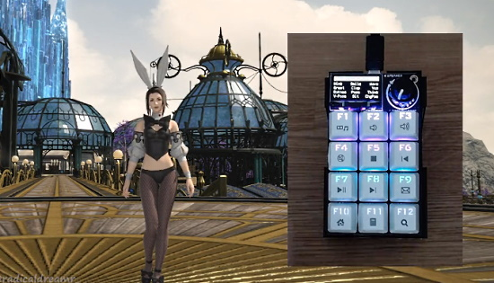](https://twitter.com/radicaldreamr_/status/1425862001247629314)

>... demonstrating the use of the new RP2040-based Macropad from Adafruit as a hotkey controller for FFXIV! There are tons of ways to program this little thing, but of course my brain went right to using it for video games - [Twitter](https://twitter.com/radicaldreamr_/status/1425862001247629314).

[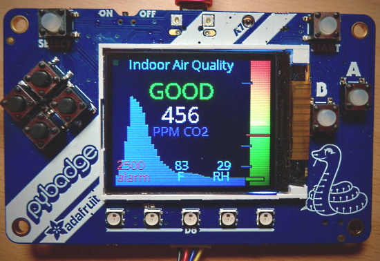](https://twitter.com/CedarGroveMakr/status/1426002682297286659)

A portable CO2 indoor air quality sensor and display with an Adafruit Pyportal, sensor and CircuitPython - [Twitter](https://twitter.com/CedarGroveMakr/status/1426002682297286659) and [GitHub](https://github.com/CedarGroveStudios/Indoor_Air_Quality).

[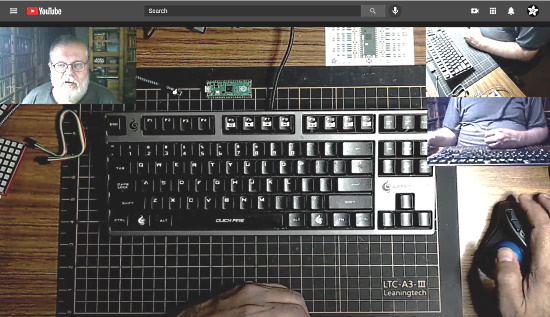](https://www.youtube.com/watch?v=byJyYnZy8UM)

A video tutorial: How to Install Visual Code Studio for working with CircuitPython - [YouTube](https://www.youtube.com/watch?v=byJyYnZy8UM).

[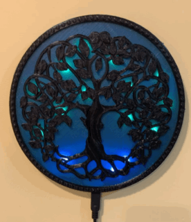](https://www.molecularist.com/2021/07/last-challenge-project-tree-of-life-with-a-twist.html)

A Tree of Life,with NeoPixels, an Adafruit QT Py and CircuitPython - [Molecularist](https://www.molecularist.com/2021/07/last-challenge-project-tree-of-life-with-a-twist.html) and [Hackaday](https://hackaday.com/2021/08/16/tree-of-life-branches-out-with-a-twist/).

[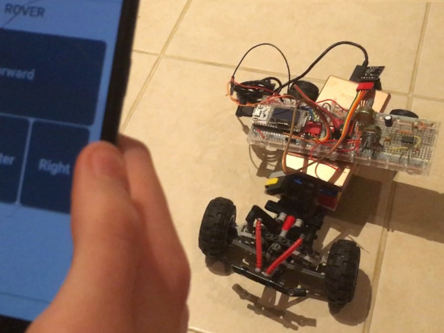](http://www.ee.ic.ac.uk/pcheung/teaching/DE1_EE/)

A detailed undergraduate course on microcontrollers and electronics from the [Dyson School of Design Engineering](https://www.imperial.ac.uk/design-engineering/) using the [Heltec WiFi kit 32](https://heltec.org/project/wifi-kit-32/) board and MicroPython - [Imperial College](http://www.ee.ic.ac.uk/pcheung/teaching/DE1_EE/).

Is the ItsyBitsy too cramped for your style? The new M4 Breadstick spreads the pins out to cover the length of a breadboard.  - [Hackaday.IO](https://hackaday.io/project/180819-m4-breadstick) - [Github](https://github.com/mrangen/M4-Breadstick).

A pixel-model of the Raspberry Pi Pico, sized for display on the Adafruit MacroPad with CircuitPython - [Adafruit Forums](https://forums.adafruit.com/viewtopic.php?f=59&t=182234&p=885696#p885696).

A macro keypad for the Vim editor with the Adafruit MacroPad and CircuitPython - [Adafruit Blog](https://blog.adafruit.com/2021/08/10/a-macropad-for-vim-keyboards-vim-circuitpython-nightshiftc/).

[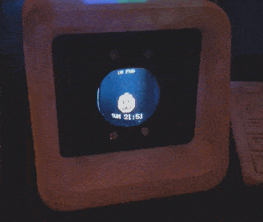](https://github.com/droxpopuli/pomodachi)

Pomodachi: a hardware pomodoro timer virtual pet with an Adafruit HalloWing M4 Express and CircuitPython - [GitHub](https://github.com/droxpopuli/pomodachi) and [Hackaday]().

[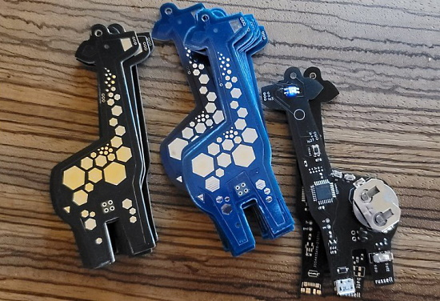](https://www.hackster.io/news/russell-is-more-than-a-giraffe-he-s-a-hackable-circuitpython-sam-d21-powered-badge-dcb1d31c0d41)

Russell Is More Than a Giraffe — A Hackable CircuitPython SAMD21-Powered Badge - [hackster.io](https://www.hackster.io/news/russell-is-more-than-a-giraffe-he-s-a-hackable-circuitpython-sam-d21-powered-badge-dcb1d31c0d41), [YouTube](https://www.youtube.com/watch?v=yjBwoZMD314) and [Tindie](https://www.tindie.com/products/redactd/russell-badge/).

A MacroPad/AdaBox19 Hotkeys YouTube Playback Controls Macro - [Adafruit Forums](https://forums.adafruit.com/viewtopic.php?f=59&t=181764).

[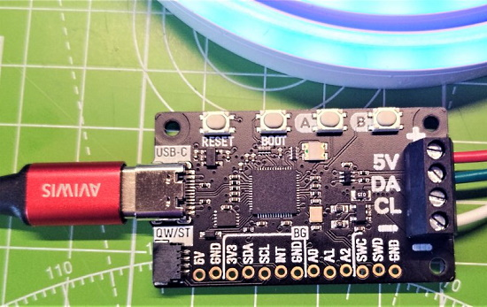](https://twitter.com/biglesp/status/1426499054704467968)

> Writing some CircuitPython code to use a rotary encoder as an input for Pimoroni's new Plasma 2040 - [Twitter](https://twitter.com/biglesp/status/1426499054704467968).

text - [site](url).

text - [site](url).

text - [site](url).

text - [site](url).

text - [site](url).

nVidia’s CUDA Python provides Cython bindings and Python wrappers for the driver and runtime API for existing toolkits and libraries to simplify GPU-based accelerated processing. The goal of CUDA Python is to unify the Python ecosystem with a single set of interfaces that provide full coverage of and access to the CUDA host APIs from Python - [nVidia](https://nvidia.github.io/cuda-python/overview.html).

[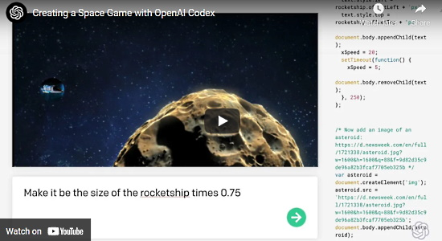](https://www.youtube.com/watch?v=Zm9B-DvwOgw)

OpenAI Codex, the AI system that translates natural language to code, had been improved and released through an API in private beta. It is demonstrated via a recent YouTube video making a JavaScript space game - [Adafruit Blog](https://blog.adafruit.com/2021/08/12/creating-a-space-game-with-openai-codex-openaicodex-openai/), [website](https://openai.com/blog/openai-codex/) and [YouTube](https://www.youtube.com/watch?v=Zm9B-DvwOgw).

text - [site](url).

text - [site](url).

text - [site](url).

[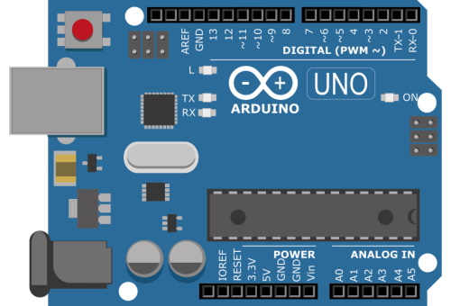](https://www.linkedin.com/pulse/why-your-dev-board-wont-catch-retrospective-arduinos-popularity/)

Why Your Dev Board Won’t Catch On: A Retrospective of Arduino’s Popularity - [LinkedIn](https://www.linkedin.com/pulse/why-your-dev-board-wont-catch-retrospective-arduinos-popularity/).

> Languages like MicroPython and CircuitPython excite me, as they offer easy ramps to using microcontrollers, especially for those coming from the software world where Python is a popular language. They don’t necessarily solve the issue of cheap dev boards, but the communities do seem to be growing. Focusing on ease-of-use (despite any losses in efficiencies) is a key takeaway from the above factors. As an engineer, if I can’t understand your API and get an LED blinking in a couple of hours, I’m likely going to look elsewhere (unless, for some reason, I’m forced to use your platform).

[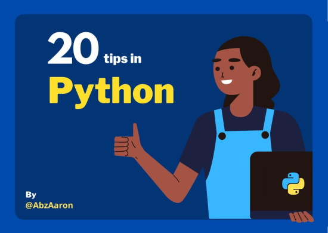](https://twitter.com/AbzAaron/status/1425779031472054277)

20 useful tricks & tips in Python - [Twitter Thread](https://twitter.com/AbzAaron/status/1425779031472054277).

[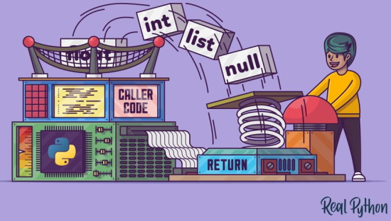](https://realpython.com/courses/effective-python-return-statement/)

Using the Python return Statement Effectively - [Real Python](https://realpython.com/courses/effective-python-return-statement/) and [Twitter](https://twitter.com/Python_News/status/1425106204108500993).

text - [site](url).

**#ICYDNCI What was the most popular, most clicked link, in [last week's newsletter](https://link)? [title](url).**

## Coming soon

text - [site](url).

text - [site](url).

## New Boards Supported by CircuitPython

The number of supported microcontrollers and Single Board Computers (SBC) grows every week. This section outlines which boards have been included in CircuitPython or added to [CircuitPython.org](https://circuitpython.org/).

This week, there were (#/no) new boards added!

- [CrumpS2 ESP32-S2 Development Board](https://github.com/tylercrumpton/CrumpS2)
- [Board name](url)

Looking to add a new board to CircuitPython? It's highly encouraged! Adafruit has four guides to help you do so:

- [How to Add a New Board to CircuitPython](https://learn.adafruit.com/how-to-add-a-new-board-to-circuitpython/overview)
- [How to add a New Board to the circuitpython.org website](https://learn.adafruit.com/how-to-add-a-new-board-to-the-circuitpython-org-website)
- [Adding a Single Board Computer to PlatformDetect for Blinka](https://learn.adafruit.com/adding-a-single-board-computer-to-platformdetect-for-blinka)
- [Adding a Single Board Computer to Blinka](https://learn.adafruit.com/adding-a-single-board-computer-to-blinka)

## New Learn Guides!

[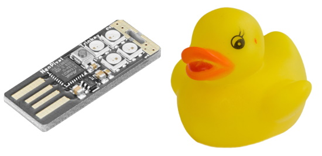](https://learn.adafruit.com/guides/latest)

[Neo Trinkey CircuitPython Rubber Ducky](https://learn.adafruit.com/neo-trinkey-circuitpython-rubber-ducky) from [Dylan Herrada](https://learn.adafruit.com/users/dherrada)

[MacroPad Remote Procedure Calls over USB to Control Home Assistant](https://learn.adafruit.com/macropad-remote-procedure-calls-over-usb-to-control-home-assistant) from [Melissa LeBlanc-Williams](https://learn.adafruit.com/users/MakerMelissa)

[Scan QR Codes with CircuitPython](https://learn.adafruit.com/scan-qr-codes-with-circuitpython) from [Jeff Epler](https://learn.adafruit.com/users/jepler)

## CircuitPython Project Bundle

When you get to the CircuitPython code section of an [Adafruit Learn Guide](https://learn.adafruit.com/), sometimes things can get a bit complicated. You not only have the code you need to upload to your device, but you likely also need to add some libraries that the code requires to run. This involved downloading all the libraries, digging through to find the ones you need, and copying them to your device. That was only the beginning on some projects, as those that include images and/or sound files required further downloading and copying of files. But, not anymore!

Now, with Project Bundles, you can download all the necessary code, libraries and, if needed, asset files with one click! We automatically check which libraries are required for the project and bundle them up for you. No more digging through a huge list of libraries to find the ones you need, or fiddling with looking for other files or dependencies. Download the Project Bundle, copy the contents to your device, and your code will simply work. We wanted to make this the easiest way to get a project working, regardless of whether you're a beginner or an expert. We'll also be adding this feature to popular IDEs as an add-on. Try it out with any Circuit Python guide on the Adafruit Learning System. Just look for the ‘Download Project Bundle’ button on the code page. 

**To download and use a Project Bundle:**

In the Learning System - above any embedded code in a guide in the Adafruit Learn System, you’ll find a Download Project Bundle button.

Click the button to download the Project Bundle zip.

Open the Project Bundle zip to find the example code, all necessary libraries, and, if available, any images, sounds, etc.

Simply copy all the files over to your CIRCUITPY drive, and you’re ready to go!

If you run into any problems or bugs, or would like to submit feedback, please file an issue on the [Adafruit Learning System Guides GitHub repo](https://github.com/adafruit/Adafruit_Learning_System_Guides/issues).

## CircuitPython Libraries!

CircuitPython support for hardware continues to grow. We are adding support for new sensors and breakouts all the time, as well as improving on the drivers we already have. As we add more libraries and update current ones, you can keep up with all the changes right here!

For the latest libraries, download the [Adafruit CircuitPython Library Bundle](https://circuitpython.org/libraries). For the latest community contributed libraries, download the [CircuitPython Community Bundle](https://github.com/adafruit/CircuitPython_Community_Bundle/releases).

If you'd like to contribute, CircuitPython libraries are a great place to start. Have an idea for a new driver? File an issue on [CircuitPython](https://github.com/adafruit/circuitpython/issues)! Have you written a library you'd like to make available? Submit it to the [CircuitPython Community Bundle](https://github.com/adafruit/CircuitPython_Community_Bundle). Interested in helping with current libraries? Check out the [CircuitPython.org Contributing page](https://circuitpython.org/contributing). We've included open pull requests and issues from the libraries, and details about repo-level issues that need to be addressed. We have a guide on [contributing to CircuitPython with Git and Github](https://learn.adafruit.com/contribute-to-circuitpython-with-git-and-github) if you need help getting started. You can also find us in the #circuitpython channel on the [Adafruit Discord](https://adafru.it/discord).

You can check out this [list of all the Adafruit CircuitPython libraries and drivers available](https://github.com/adafruit/Adafruit_CircuitPython_Bundle/blob/master/circuitpython_library_list.md). 

The current number of CircuitPython libraries is **332**!

**New Libraries!**

Here's this week's new CircuitPython libraries:

 * [Adafruit_CircuitPython_Ducky](https://github.com/adafruit/Adafruit_CircuitPython_Ducky)

**Updated Libraries!**

Here's this week's updated CircuitPython libraries:

 * [Adafruit_CircuitPython_MacroPad](https://github.com/adafruit/Adafruit_CircuitPython_MacroPad)
 * [Adafruit_CircuitPython_MIDI](https://github.com/adafruit/Adafruit_CircuitPython_MIDI)
 * [Adafruit_CircuitPython_MiniMQTT](https://github.com/adafruit/Adafruit_CircuitPython_MiniMQTT)

## What’s the team up to this week?

What is the team up to this week? Let’s see!

**Dan**

[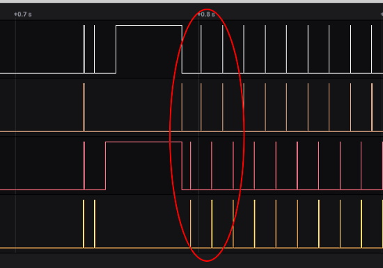](https://circuitpython.org/)

I was able to fix the "crackling" audio playback we were seeing on RP2040. Audio playback is done with two buffers which are used in alternation: while one buffer is being played using DMA, the other is being filled.

I instrumented the "DMA complete" interrupts and the buffer filling by toggling pins, and then observing the traces with a Saleae logic analyzer. I was able to determine that the wrong buffer was being filled when crackling audio was present. The flip-flopping between buffers was out of phase, probably due to an intermittent timing problem. I rewrote the code to determine which buffer actually needed filling by looking at the interrupt information in detail, instead of simply alternating between the buffers.

This same issue may be present on the SAMD51 implementation, which has similar code, and I'll take a look at that.

On Wednesday, August 11, I released CircuitPython 7.0.0-alpha.6, three weeks after the previous alpha. We are making good progress towards 7.0.0 final but still have a number of issues to fix. I need to finish some API changes to the custom HID device code, and then we can start issuing beta releases.

**Jeff**

The `qrio` module I mentioned last week is in the recent alpha release of CircuitPython, and I've been working on a guide that introduces how to use it. Next up, I'll be doing a week of bug-squashing to bring us closer to a stable release of CircutPython 7.

**Kattni**

This week I updated the PCF8523 and DS3231 guides to include the STEMMA QT updates to the breakouts. Typically we replace header-only versions with the STEMMA QT versions, but in this case, the originals are still so popular, we added these as new products. So, instead of the guides being updated to be primarily STEMMA QT, they include both versions equally.

I also completed a lot of miscellaneous tasks that came up including PR testing and merging and working through an obtuse CI failure on a different PR. 

I'm still working on a MacroPad example that types out common phrases that I use on GitHub for me, but I still haven't settled on what phrases I want to use. The project includes Fidget Mode, which makes it so the MacroPad stops sending HID so I can fidget with the light up keys without sending errant strings to my computer. I updated Fidget Mode to be on by default, requiring a manual disable by pressing the rotary encoder switch, and enabling automatically after a customisable delay. That way I don't have to remember to enable it!

**Melissa**

This past week was shorter because I was out sick for part of it. I did however finish up my guide on [MacroPad Remote Procedure Calls over USB to Control Home Assistant](https://learn.adafruit.com/macropad-remote-procedure-calls-over-usb-to-control-home-assistant). This goes over using Remote Procedure Calls to have the MacroPad communicate with the desktop and remotely run functions to allow the MacroPad to control things on your network.

**Scott**

This week I've continued fixing bugs in CircuitPython for 7.0.0. The two bugs I've been working on are tweaking time tracking on the SAMD21 which caused autoreload to break while doing PulseIn and fixing timer reset on the SAMD21 when pwmio isn't enabled. I'm going to tackle a few more bugs and then switch to expanding the BLE file transfer protocol a little to work better with the iOS files app.

## Upcoming events!

PyConline AU will be held 10-12 September, 2021 - [pyconlineau](https://2021.pycon.org.au/)

[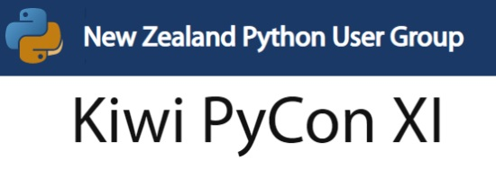](https://python.nz/kiwipycon)

Kiwi PyCon XI, Ōtautahi Christchurch, 17th, 18th, & 19th of September 2021 and CFP ends July 16th - [python.nz](https://python.nz/kiwipycon).

PyCon India is the largest gathering of Pythonistas in India for the Python programming language. The 13th edition of PyCon India will be taking place online from 17th September to 20th September 2021 - [PyCon India 2021](https://in.pycon.org/2021/).

**Send Your Events In**

As for other events, with the COVID pandemic, most in-person events are postponed or cancelled. If you know of virtual events or events that may occur in the future, please let us know on Discord or on Twitter with hashtag #CircuitPython.

## Latest releases

CircuitPython's stable release is [#.#.#](https://github.com/adafruit/circuitpython/releases/latest) and its unstable release is [#.#.#-##.#](https://github.com/adafruit/circuitpython/releases). New to CircuitPython? Start with our [Welcome to CircuitPython Guide](https://learn.adafruit.com/welcome-to-circuitpython).

[2021####](https://github.com/adafruit/Adafruit_CircuitPython_Bundle/releases/latest) is the latest CircuitPython library bundle.

[v#.#.#](https://micropython.org/download) is the latest MicroPython release. Documentation for it is [here](http://docs.micropython.org/en/latest/pyboard/).

[#.#.#](https://www.python.org/downloads/) is the latest Python release. The latest pre-release version is [#.#.#](https://www.python.org/download/pre-releases/).

[2,540 Stars](https://github.com/adafruit/circuitpython/stargazers) Like CircuitPython? [Star it on GitHub!](https://github.com/adafruit/circuitpython)

## Call for help -- Translating CircuitPython is now easier than ever!

One important feature of CircuitPython is translated control and error messages.

With the help of fellow open source project [Weblate](https://weblate.org/), we're making it even easier to add or improve translations.

Sign in with an existing account such as GitHub, Google or Facebook and start contributing through a simple web interface. No forks or pull requests needed!

As always, if you run into trouble join us on [Discord](https://adafru.it/discord), we're here to help.

## jobs.adafruit.com - Find a dream job, find great candidates!

[jobs.adafruit.com](https://jobs.adafruit.com/) has returned and folks are posting their skills (including CircuitPython) and companies are looking for talented makers to join their companies - from Digi-Key, to Hackaday, Micro Center, Raspberry Pi and more.

**Job of the Week**

text - [Adafruit Jobs Board](https://jobs.adafruit.com/).

## NUMBER thanks!

The Adafruit Discord community, where we do all our CircuitPython development in the open, reached over NUMBER humans, thank you!  Adafruit believes Discord offers a unique way for CircuitPython folks to connect. Join today at [https://adafru.it/discord](https://adafru.it/discord).

## ICYMI - In case you missed it

The wonderful world of Python on hardware! This is our Python video-newsletter-podcast! The news comes from the Python community, Discord, Adafruit communities and more and is reviewed on ASK an ENGINEER Wednesdays. The complete Python on Hardware weekly videocast [playlist is here](https://www.youtube.com/playlist?list=PLjF7R1fz_OOXRMjM7Sm0J2Xt6H81TdDev). 

This video podcast is on [iTunes](https://itunes.apple.com/us/podcast/python-on-hardware/id1451685192?mt=2), [YouTube](http://adafru.it/pohepisodes), [IGTV (Instagram TV](https://www.instagram.com/adafruit/channel/)), and [XML](https://itunes.apple.com/us/podcast/python-on-hardware/id1451685192?mt=2).

[Weekly community chat on Adafruit Discord server CircuitPython channel - Audio / Podcast edition](https://itunes.apple.com/us/podcast/circuitpython-weekly-meeting/id1451685016) - Audio from the Discord chat space for CircuitPython, meetings are usually Mondays at 2pm ET, this is the audio version on [iTunes](https://itunes.apple.com/us/podcast/circuitpython-weekly-meeting/id1451685016), Pocket Casts, [Spotify](https://adafru.it/spotify), and [XML feed](https://adafruit-podcasts.s3.amazonaws.com/circuitpython_weekly_meeting/audio-podcast.xml).

And lastly, we are working up a one-spot destination for all things podcast-able here - [podcasts.adafruit.com](https://podcasts.adafruit.com/)

## Contribute!

The CircuitPython Weekly Newsletter is a CircuitPython community-run newsletter emailed every Tuesday. The complete [archives are here](https://www.adafruitdaily.com/category/circuitpython/). It highlights the latest CircuitPython related news from around the web including Python and MicroPython developments. To contribute, edit next week's draft [on GitHub](https://github.com/adafruit/circuitpython-weekly-newsletter/tree/gh-pages/_drafts) and [submit a pull request](https://help.github.com/articles/editing-files-in-your-repository/) with the changes. You may also tag your information on Twitter with #CircuitPython. 

Join our [Discord](https://adafru.it/discord) or [post to the forum](https://forums.adafruit.com/viewforum.php?f=60) for any further questions.
