- [X] Kattni updates
- [ ] change date
- [ ] update title
- [ ] Feature story
- [ ] Update  for images
- [ ] Update ICYDNCI
- [ ] All images 550w max only
- [ ] Link "View this email in your browser."

News Sources

- [python.org](https://www.python.org/)
- [Python Insider - dev team blog](https://pythoninsider.blogspot.com/)

View this email in your browser.

Welcome to the latest Python on Microcontrollers newsletter, brought you by the community! We're on [Discord](https://discord.gg/HYqvREz), [Twitter](https://twitter.com/search?q=circuitpython&src=typed_query&f=live), and for past newsletters - [view them all here](https://www.adafruitdaily.com/category/circuitpython/). If you're reading this on the web, [subscribe here](https://www.adafruitdaily.com/). Let's get started!

## Headline Article

text - [site](url).

## JP's Workshop Reaches 200 Episodes

John Park's Workshop, a live video broadcast for Adafruit, has reached the 200 episode mark. Many projects have been highlighted, including those using CircuitPython - [Adafruit Blog](https://blog.adafruit.com/2021/08/18/200th-episode-of-john-parks-workshop-tomorrow-8-19-21-adafruit-johnedgarpark-adafruit/).

[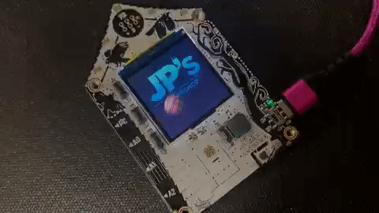](https://twitter.com/todbot/status/1428392966482055170)

In celebration of this landmark, Tod Kurt made a special CircuitPython screensaver reminiscient of the [Amiga Boing Ball screen saver](http://www.generationamiga.com/2020/04/14/amiga-history-the-story-of-the-boing-ball/) with CircuitPython on an Adafruit FunHouse - [Twitter](https://twitter.com/todbot/status/1428392966482055170). 

## Halloween Hackfest

Join Hackaday, Digi-Key, and Adafruit for a Halloween-themed contest! They want to see your crazy, creepy, ghostly, spooky, and awesome projects. 

If costumes are your favorite part of Halloween, then why not dress up your outfit with some hacked upgrades? You could even design a ghoulish prop to add to your home’s Halloween decor or light up a Jack-o-lantern with LEDs. Whether it’s technical, artistic, or just plain terrifying, Hackaday wants to see your projects!

Check out the Halloween Show & Tell with Hackaday, Friday, October 29th at 1pm PT, to show off your awesome projects entered in the contest. Don't forget to also share your projects on social media and use the #HalloweenHackfest!

Hackaday and Digi-Key have partnered on this Halloween-themed contest to offer three winners an online shopping spree to the Digi-Key warehouse! - [Hackaday](https://hackaday.com/2021/08/10/new-contest-halloween-hackfest/) and [hackaday.io](https://hackaday.io/contest/180664-halloween-hackfest).

## Wippersnapper Beta Continues

[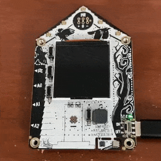](https://twitter.com/MarkKomus/status/1428558989953015808)

Wippersnapper, the Adafruit IoT solution to program using no code is still in a invitational public beta. Here is a post from one user - [Twitter](https://twitter.com/MarkKomus/status/1428558989953015808).

> Finally had a chance to try the Adafruit Wippersnapper beta. Took all of 20 minutes to hook my Funhouse LED to an existing feed from an air quality sensor. The LED now lights up when the air quality is poor. No code required!

## Recreating Classic Screensavers in CircuitPython

[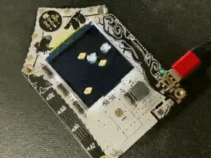](https://twitter.com/todbot/status/1428161353483624454)

Tod Kurt recreates two classic screensavers on microcontrollers with color displays using CircuitPython: DVD and Flying Toasters - [Twitter](https://twitter.com/todbot/status/1428161353483624454).

## CircuitPython Deep Dive Stream with Scott Shawcroft

[This week](link), Scott streams his work on .

You can see the latest video and past videos on the Adafruit YouTube channel under the Deep Dive playlist - [YouTube](https://www.youtube.com/playlist?list=PLjF7R1fz_OOXBHlu9msoXq2jQN4JpCk8A).

## CircuitPython Parsec

John Park’s CircuitPython Parsec: Code for Board Types - [Adafruit Blog](https://blog.adafruit.com/2021/08/17/john-parks-circuitpython-parsec-code-for-board-types-adafruit-johnedgarpark-adafruit-circuitpython/).

## News from around the web!

text - [site](url).

[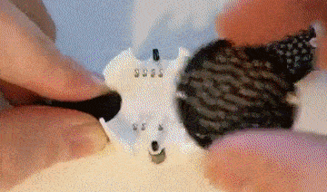](https://twitter.com/jasoncoon_/status/1428139001207300100)

> Whipped up a quick little 3D printed test jig for Fibonacci64 Nano, using an Adafruit QT Py, pogo pins, perf board, M2 standoffs, and CircuitPython code - [Twitter](https://twitter.com/jasoncoon_/status/1428139001207300100).

text - [site](url).

[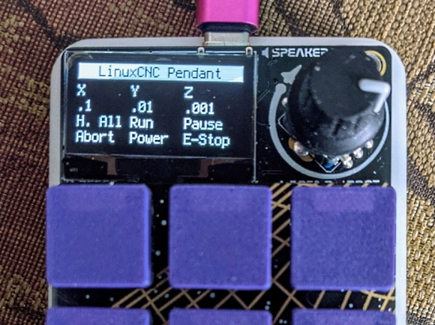](https://emergent.unpythonic.net/01629313423)

Using Adafruit Macropad as LinuxCNC Control Pendant - [unpythonic.net](https://emergent.unpythonic.net/01629313423).

[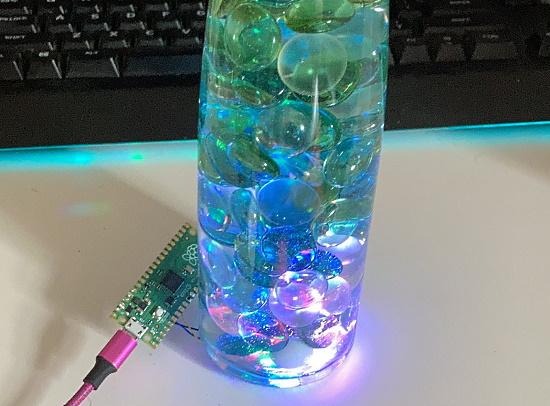](https://twitter.com/NickRuffilo/status/1428699896870223879)

> Huge shoutout to the Raspberry Pi and CircuitPython teams for making microcontrollers user friendly. I just got my first pico working with a NeoPixel strip using CircuitPython working in a matter of minutes. Very accessible to new learners. AMAZING! - [Twitter](https://twitter.com/NickRuffilo/status/1428699896870223879).

[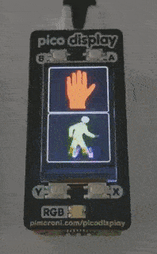](https://twitter.com/GeekMomProjects/status/1427714793054511105)

A Walk/Don't Walk wearable with Raspberry Pi Pico and CircuitPython. The project is much faster than an earlier C++ implementation with less code - [Twitter](https://twitter.com/GeekMomProjects/status/1427714793054511105).

[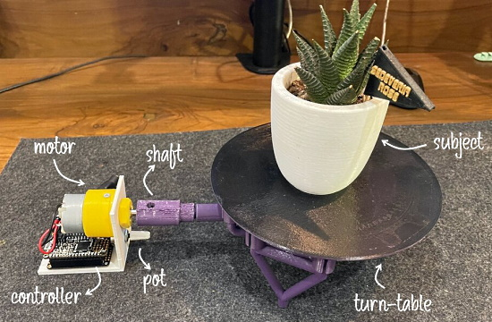](https://codensolder.com/blog/3d-printed-turntable)

DIY motorised 3D printed turntable with Feather and CircuitPython - [codensolder](https://codensolder.com/blog/3d-printed-turntable).

[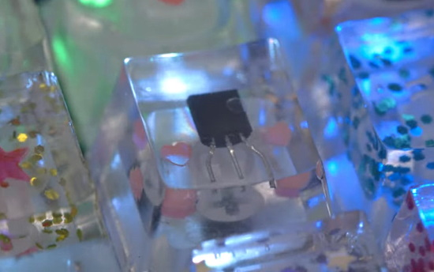](https://kbd.news/Resin-keycap-casting-917.html)

Adafruit's Make your own set of keycaps with silicone molds and UV-curable resin made it to the lastest Keyboard Builders' Digest! - [Keyboard Builder's Digest](https://kbd.news/Resin-keycap-casting-917.html).

[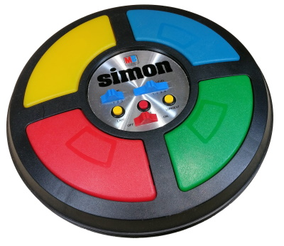](https://forums.adafruit.com/viewtopic.php?f=59&t=181717)

A Simon says game with the MacroPad from Adabox019 - [Adafruit Forums](https://forums.adafruit.com/viewtopic.php?f=59&t=181717).

[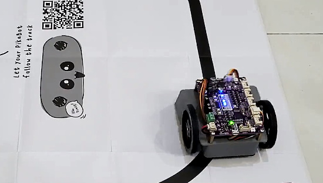](https://tutorial.cytron.io/2021/08/10/maker-pi-rp2040-mobile-robot/)

Maker Pi RP2040 Mobile Robot programmed in CircuitPython - [Cytron Technologies](https://tutorial.cytron.io/2021/08/10/maker-pi-rp2040-mobile-robot/) and [Twitter](https://twitter.com/cytrontech/status/1427842695960010752).

Highlights from the new version of Git: 2.33.0 - [GitHub Blog](https://github.blog/2021-08-16-highlights-from-git-2-33/).

[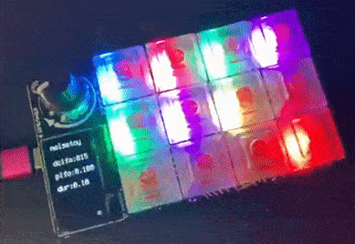](https://twitter.com/todbot/status/1427446955404271622)

> Want to make terrible noises with awful flashing colors? Yeah me too. But if you want glitchy scritchy noises in CircuitPython using just PWM, here's a little toy for the MacroPad RP2040 - [Twitter](https://twitter.com/todbot/status/1427446955404271622) and [GitHub](https://gist.github.com/todbot/f35bb5ceed013a277688b2ca333244d5).

text - [site](url).

MorphESP 240 is a ESP32-S2 dev board from Morpheans which has a high-res IPS color display, lots of GPIO, and is fully compatible with both Arduino and CircuitPython - [Twitter](https://twitter.com/crowd_supply/status/1427692451314163716) and [CrowdSupply](https://www.crowdsupply.com/morpheans/morphesp-240).

text - [site](url).

[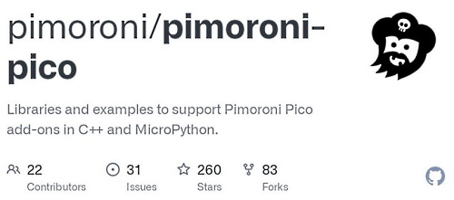](https://twitter.com/Gadgetoid/status/1428465351633817605)

APA102 and WS2812 LEDs PIO-based drivers have been added into the Pimoroni Pico MicroPython distro, along with matching C++ drivers - [Twitter](https://twitter.com/Gadgetoid/status/1428465351633817605) and [GitHub](https://github.com/pimoroni/pimoroni-pico/releases/tag/v0.2.4).

Raspberry Pi Zero waters your plants and records growth timelapse - [Raspberry Pi Blog](https://www.raspberrypi.org/blog/raspberry-pi-zero-waters-your-plants-and-records-growth-timelapse/).

Supporting the Python community by “Shifting Left” - [Tech at Bloomberg](https://www.techatbloomberg.com/blog/supporting-the-python-community-by-shifting-left/).

How to build your own AI art installation from scratch with Nvidia Jetson Xavier NX and Python - [GitHub](https://github.com/maxvfischer/DIY-ai-art).

A graphical tool to make photo collage posters in Python - [Python Awesome](https://pythonawesome.com/graphical-tool-to-make-photo-collage-posters-in-python/).

[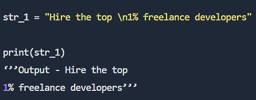](https://shorttechtutorials.hashnode.dev/how-to-add-a-new-line-in-python)

The Newline character in Python - [Short Tech Tutorials](https://shorttechtutorials.hashnode.dev/how-to-add-a-new-line-in-python).

**#ICYDNCI What was the most popular, most clicked link, in [last week's newsletter](https://link)? [title](url).**

## Coming soon

Oak Dev Tech posts their board in development - the BREAD RP2040. It's shown running CircuitPython - [Twitter](https://twitter.com/oakdevtech/status/1427433459887136768).

text - [site](url).

## New Boards Supported by CircuitPython

The number of supported microcontrollers and Single Board Computers (SBC) grows every week. This section outlines which boards have been included in CircuitPython or added to [CircuitPython.org](https://circuitpython.org/).

This week, there were (#/no) new boards added!

- [Board name](url)

Looking to add a new board to CircuitPython? It's highly encouraged! Adafruit has four guides to help you do so:

- [How to Add a New Board to CircuitPython](https://learn.adafruit.com/how-to-add-a-new-board-to-circuitpython/overview)
- [How to add a New Board to the circuitpython.org website](https://learn.adafruit.com/how-to-add-a-new-board-to-the-circuitpython-org-website)
- [Adding a Single Board Computer to PlatformDetect for Blinka](https://learn.adafruit.com/adding-a-single-board-computer-to-platformdetect-for-blinka)
- [Adding a Single Board Computer to Blinka](https://learn.adafruit.com/adding-a-single-board-computer-to-blinka)

## New Learn Guides!

[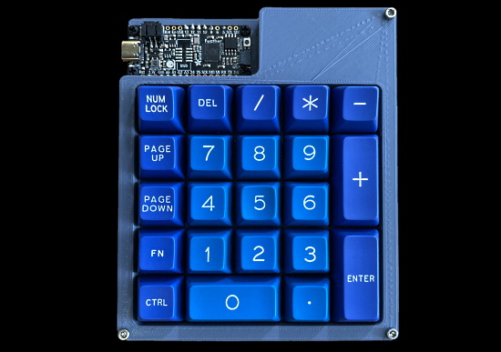](https://learn.adafruit.com/guides/latest)

[Numpad 4000 Mechanical Keyswitch Data Entry Device](https://learn.adafruit.com/numpad-4000-mechanical-keyswitch-data-entry-device) from [John Park](https://learn.adafruit.com/users/johnpark)

[Adafruit MCP9601 I2C Thermocouple Amplifier](https://learn.adafruit.com/adafruit-mcp9601) from [Kattni](https://learn.adafruit.com/users/kattni)

## CircuitPython Project Bundle

When you get to the CircuitPython code section of an [Adafruit Learn Guide](https://learn.adafruit.com/), sometimes things can get a bit complicated. You not only have the code you need to upload to your device, but you likely also need to add some libraries that the code requires to run. This involved downloading all the libraries, digging through to find the ones you need, and copying them to your device. That was only the beginning on some projects, as those that include images and/or sound files required further downloading and copying of files. But, not anymore!

Now, with Project Bundles, you can download all the necessary code, libraries and, if needed, asset files with one click! We automatically check which libraries are required for the project and bundle them up for you. No more digging through a huge list of libraries to find the ones you need, or fiddling with looking for other files or dependencies. Download the Project Bundle, copy the contents to your device, and your code will simply work. We wanted to make this the easiest way to get a project working, regardless of whether you're a beginner or an expert. We'll also be adding this feature to popular IDEs as an add-on. Try it out with any Circuit Python guide on the Adafruit Learning System. Just look for the ‘Download Project Bundle’ button on the code page. 

**To download and use a Project Bundle:**

In the Learning System - above any embedded code in a guide in the Adafruit Learn System, you’ll find a Download Project Bundle button.

Click the button to download the Project Bundle zip.

Open the Project Bundle zip to find the example code, all necessary libraries, and, if available, any images, sounds, etc.

Simply copy all the files over to your CIRCUITPY drive, and you’re ready to go!

If you run into any problems or bugs, or would like to submit feedback, please file an issue on the [Adafruit Learning System Guides GitHub repo](https://github.com/adafruit/Adafruit_Learning_System_Guides/issues).

## CircuitPython Libraries!

CircuitPython support for hardware continues to grow. We are adding support for new sensors and breakouts all the time, as well as improving on the drivers we already have. As we add more libraries and update current ones, you can keep up with all the changes right here!

For the latest libraries, download the [Adafruit CircuitPython Library Bundle](https://circuitpython.org/libraries). For the latest community contributed libraries, download the [CircuitPython Community Bundle](https://github.com/adafruit/CircuitPython_Community_Bundle/releases).

If you'd like to contribute, CircuitPython libraries are a great place to start. Have an idea for a new driver? File an issue on [CircuitPython](https://github.com/adafruit/circuitpython/issues)! Have you written a library you'd like to make available? Submit it to the [CircuitPython Community Bundle](https://github.com/adafruit/CircuitPython_Community_Bundle). Interested in helping with current libraries? Check out the [CircuitPython.org Contributing page](https://circuitpython.org/contributing). We've included open pull requests and issues from the libraries, and details about repo-level issues that need to be addressed. We have a guide on [contributing to CircuitPython with Git and Github](https://learn.adafruit.com/contribute-to-circuitpython-with-git-and-github) if you need help getting started. You can also find us in the #circuitpython channel on the [Adafruit Discord](https://adafru.it/discord).

You can check out this [list of all the Adafruit CircuitPython libraries and drivers available](https://github.com/adafruit/Adafruit_CircuitPython_Bundle/blob/master/circuitpython_library_list.md). 

The current number of CircuitPython libraries is **332**!

**Updated Libraries!**

Here's this week's updated CircuitPython libraries:

 * [Adafruit_CircuitPython_MONSTERM4SK](https://github.com/adafruit/Adafruit_CircuitPython_MONSTERM4SK)
 * [Adafruit_CircuitPython_SSD1322](https://github.com/adafruit/Adafruit_CircuitPython_SSD1322)
 * [Adafruit_CircuitPython_Slideshow](https://github.com/adafruit/Adafruit_CircuitPython_Slideshow)
 * [Adafruit_CircuitPython_SSD1327](https://github.com/adafruit/Adafruit_CircuitPython_SSD1327)
 * [Adafruit_CircuitPython_DisplayIO_SSD1306](https://github.com/adafruit/Adafruit_CircuitPython_DisplayIO_SSD1306)
 * [Adafruit_CircuitPython_MCP9600](https://github.com/adafruit/Adafruit_CircuitPython_MCP9600)
 * [Adafruit_CircuitPython_PyBadger](https://github.com/adafruit/Adafruit_CircuitPython_PyBadger)
 * [Adafruit_CircuitPython_PCA9685](https://github.com/adafruit/Adafruit_CircuitPython_PCA9685)
 * [Adafruit_CircuitPython_NeoPixel](https://github.com/adafruit/Adafruit_CircuitPython_NeoPixel)
 * [Adafruit_CircuitPython_MacroPad](https://github.com/adafruit/Adafruit_CircuitPython_MacroPad)
 * [Adafruit_CircuitPython_SSD1681](https://github.com/adafruit/Adafruit_CircuitPython_SSD1681)
 * [Adafruit_CircuitPython_SSD1608](https://github.com/adafruit/Adafruit_CircuitPython_SSD1608)
 * [Adafruit_CircuitPython_SSD1680](https://github.com/adafruit/Adafruit_CircuitPython_SSD1680)
 * [CircuitPython_Community_Bundle](https://github.com/adafruit/CircuitPython_Community_Bundle)

## What’s the team up to this week?

What is the team up to this week? Let’s check in!

**Dan**

I revised the custom USB HID device API added in CircuitPython 7: It now allows for multiple report ID's. Now the report ID must be supplied by the creator: we no longer renumber the report ID's. This is the last incompatible change we were planning to make for the CircuitPython API, so we can start issuing beta releases for CircuitPython 7.0.0 now.

All the core developers are working on the remaining 7.0.0 issues. I closed a few that are now fixed, and am working on others.

**Jeff**

I've been mostly working on fixing bugs in the core, as well as helping Dan and Kattni put the audio fixes & mp3 file playback through its paces.

**Kattni**

This week I added MP3 playback to the MacroPad guide, finding a bug in the CircuitPython core in the process. Now, in the library, `play_file()` works with both WAV and MP3 files. This is in preparation for a MP3 Playback on RP2040 guide that includes playback using the MacroPad library, and playback on Pico using CircuitPython. That guide will be out soon, so if you're interested in playing MP3s on your RP2040, keep an eye out for that.

I published the [Adafruit MCP9601 I2C Thermocouple Amplifier guide](https://learn.adafruit.com/adafruit-mcp9601). The guide covers everything you need to know to get measuring with your MCP9601. There's an overview, detailed pinouts page, examples in CircuitPython and Arduino, and resource downloads. 

I also helped with moving the Learning System Guides repo to the same version of Pylint as the libraries, which meant updating from 1.9.2 to 2.7.1. Jeff set it up so it ignores all the current code, but lints all the new code. This enables us to go through and deal with the old code at our own pace versus needing to fix upwards of 1000 linting failures all at once. Dylan has been going through and linting a few at a time, so we'll have everything updated soon. This was a long time coming, and I'm really happy to see we finally did it.

Finally, I worked through renaming all of the remaining instances of CircuitPython files called main.py in the Learn repo to code.py to be in line with our standard naming convention. This involved updating all the relevant guides as well. Thanks to Dylan for helping out with the guide updates!

**Melissa**

This past week, I finally have the WebSerial ESPTool more stable and as a result I was able to get the NVM Generator code going. It has been updated to fully install the WipperSnapper binary code as well as generate and write the NVM Partition onto the board. While writing this I got inspired and came up with a simple scripting system that  allowed it to create and display each of the steps that it was currently on and it works well. You can check out the tool on [GitHub Pages](https://adafruit.github.io/Adafruit_WebSerial_NVMGenerator/).

**Scott**

This week I've been hunting bugs. The most time consuming is USB errors on the iMX RT that prevent USB from working. Low level USB reliability is a very tricky thing.

I also took a detour into enabling unicode filename support to go along with unicode being easier to enter on mobile. I've done most of the work but have hit an issue with making builds too large.

One other small tweak I made was to raise the public broadcasting transmit power for the BLE workflow so that it is easier to initially connect. Once connected, it broadcasts at full strength with an encrypted device id.

## Upcoming events!

PyConline AU will be held 10-12 September, 2021 - [pyconlineau](https://2021.pycon.org.au/)

Kiwi PyCon XI, Ōtautahi Christchurch, 17th, 18th, & 19th of September 2021 and CFP ends July 16th - [python.nz](https://python.nz/kiwipycon).

PyCon India is the largest gathering of Pythonistas in India for the Python programming language. The 13th edition of PyCon India will be taking place online from 17th September to 20th September 2021 - [PyCon India 2021](https://in.pycon.org/2021/).

**Send Your Events In**

As for other events, with the COVID pandemic, most in-person events are postponed or cancelled. If you know of virtual events or events that may occur in the future, please let us know on Discord or on Twitter with hashtag #CircuitPython.

## Latest releases

CircuitPython's stable release is [#.#.#](https://github.com/adafruit/circuitpython/releases/latest) and its unstable release is [#.#.#-##.#](https://github.com/adafruit/circuitpython/releases). New to CircuitPython? Start with our [Welcome to CircuitPython Guide](https://learn.adafruit.com/welcome-to-circuitpython).

[2021####](https://github.com/adafruit/Adafruit_CircuitPython_Bundle/releases/latest) is the latest CircuitPython library bundle.

[v#.#.#](https://micropython.org/download) is the latest MicroPython release. Documentation for it is [here](http://docs.micropython.org/en/latest/pyboard/).

[#.#.#](https://www.python.org/downloads/) is the latest Python release. The latest pre-release version is [#.#.#](https://www.python.org/download/pre-releases/).

[2,545 Stars](https://github.com/adafruit/circuitpython/stargazers) Like CircuitPython? [Star it on GitHub!](https://github.com/adafruit/circuitpython)

## Call for help -- Translating CircuitPython is now easier than ever!

[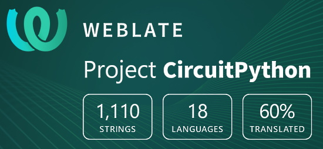](https://hosted.weblate.org/engage/circuitpython/)

One important feature of CircuitPython is translated control and error messages.

With the help of fellow open source project [Weblate](https://weblate.org/), we're making it even easier to add or improve translations.

Sign in with an existing account such as GitHub, Google or Facebook and start contributing through a simple web interface. No forks or pull requests needed!

As always, if you run into trouble join us on [Discord](https://adafru.it/discord), we're here to help.

## jobs.adafruit.com - Find a dream job, find great candidates!

[jobs.adafruit.com](https://jobs.adafruit.com/) has returned and folks are posting their skills (including CircuitPython) and companies are looking for talented makers to join their companies - from Digi-Key, to Hackaday, Micro Center, Raspberry Pi and more.

**Job of the Week**

text - [Adafruit Jobs Board](https://jobs.adafruit.com/).

## NUMBER thanks!

The Adafruit Discord community, where we do all our CircuitPython development in the open, reached over NUMBER humans, thank you!  Adafruit believes Discord offers a unique way for CircuitPython folks to connect. Join today at [https://adafru.it/discord](https://adafru.it/discord).

## ICYMI - In case you missed it

The wonderful world of Python on hardware! This is our Python video-newsletter-podcast! The news comes from the Python community, Discord, Adafruit communities and more and is reviewed on ASK an ENGINEER Wednesdays. The complete Python on Hardware weekly videocast [playlist is here](https://www.youtube.com/playlist?list=PLjF7R1fz_OOXRMjM7Sm0J2Xt6H81TdDev). 

This video podcast is on [iTunes](https://itunes.apple.com/us/podcast/python-on-hardware/id1451685192?mt=2), [YouTube](http://adafru.it/pohepisodes), [IGTV (Instagram TV](https://www.instagram.com/adafruit/channel/)), and [XML](https://itunes.apple.com/us/podcast/python-on-hardware/id1451685192?mt=2).

[Weekly community chat on Adafruit Discord server CircuitPython channel - Audio / Podcast edition](https://itunes.apple.com/us/podcast/circuitpython-weekly-meeting/id1451685016) - Audio from the Discord chat space for CircuitPython, meetings are usually Mondays at 2pm ET, this is the audio version on [iTunes](https://itunes.apple.com/us/podcast/circuitpython-weekly-meeting/id1451685016), Pocket Casts, [Spotify](https://adafru.it/spotify), and [XML feed](https://adafruit-podcasts.s3.amazonaws.com/circuitpython_weekly_meeting/audio-podcast.xml).

And lastly, we are working up a one-spot destination for all things podcast-able here - [podcasts.adafruit.com](https://podcasts.adafruit.com/)

## Codecademy "Learn Hardware Programming with CircuitPython"

Codecademy, an online interactive learning platform used by more than 45 million people, has teamed up with the leading manufacturer in STEAM electronics, Adafruit Industries, to create a coding course, "Learn Hardware Programming with CircuitPython". The course is now available in the [Codecademy catalog](https://www.codecademy.com/learn/learn-circuitpython?utm_source=adafruit&utm_medium=partners&utm_campaign=circuitplayground&utm_content=pythononhardwarenewsletter).

Python is a highly versatile, easy to learn programming language that a wide range of people, from visual effects artists in Hollywood to mission control at NASA, use to quickly solve problems. But you don’t need to be a rocket scientist to accomplish amazing things with it. This new course introduces programmers to Python by way of a microcontroller — CircuitPython — which is a Python-based programming language optimized for use on hardware.

CircuitPython’s hardware-ready design makes it easier than ever to program a variety of single-board computers, and this course gets you from no experience to working prototype faster than ever before. Codecademy’s interactive learning environment, combined with Adafruit's highly rated Circuit Playground Express, present aspiring hardware hackers with a never-before-seen opportunity to learn hardware programming seamlessly online.

Whether for those who are new to programming, or for those who want to expand their skill set to include physical computing, this course will have students getting familiar with Python and creating incredible projects along the way. By the end, students will have built their own bike lights, drum machine, and even a moisture detector that can tell when it's time to water a plant.

Visit Codecademy to access the [Learn Hardware Programming with CircuitPython](https://www.codecademy.com/learn/learn-circuitpython?utm_source=adafruit&utm_medium=partners&utm_campaign=circuitplayground&utm_content=pythononhardwarenewsletter) course and Adafruit to purchase a [Circuit Playground Express](https://www.adafruit.com/product/3333).

Codecademy has helped more than 45 million people around the world upgrade their careers with technology skills. The company’s online interactive learning platform is widely recognized for providing an accessible, flexible, and engaging experience for beginners and experienced programmers alike. Codecademy has raised a total of $43 million from investors including Union Square Ventures, Kleiner Perkins, Index Ventures, Thrive Capital, Naspers, Yuri Milner and Richard Branson, most recently raising its $30 million Series C in July 2016.

## Contribute!

The CircuitPython Weekly Newsletter is a CircuitPython community-run newsletter emailed every Tuesday. The complete [archives are here](https://www.adafruitdaily.com/category/circuitpython/). It highlights the latest CircuitPython related news from around the web including Python and MicroPython developments. To contribute, edit next week's draft [on GitHub](https://github.com/adafruit/circuitpython-weekly-newsletter/tree/gh-pages/_drafts) and [submit a pull request](https://help.github.com/articles/editing-files-in-your-repository/) with the changes. You may also tag your information on Twitter with #CircuitPython. 

Join our [Discord](https://adafru.it/discord) or [post to the forum](https://forums.adafruit.com/viewforum.php?f=60) for any further questions.
