- [X] Kattni updates
- [ ] change date
- [ ] update title
- [ ] Feature story
- [ ] Update  for images
- [ ] Update ICYDNCI
- [ ] All images 550w max only
- [ ] Link "View this email in your browser."

News Sources

- [python.org](https://www.python.org/)
- [Python Insider - dev team blog](https://pythoninsider.blogspot.com/)

View this email in your browser.

Welcome to the latest Python on Microcontrollers newsletter, brought you by the community! We're on [Discord](https://discord.gg/HYqvREz), [Twitter](https://twitter.com/search?q=circuitpython&src=typed_query&f=live), and for past newsletters - [view them all here](https://www.adafruitdaily.com/category/circuitpython/). If you're reading this on the web, [subscribe here](https://www.adafruitdaily.com/). Let's get started!

## Headline Article

text - [site](url).

## Study about the impact of open source software and hardware on technological independence, competitiveness and innovation in the EU economy

[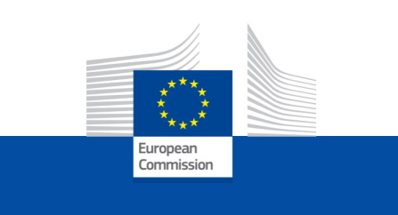](https://digital-strategy.ec.europa.eu/en/library/study-about-impact-open-source-software-and-hardware-technological-independence-competitiveness-and)

This study aims to investigate the economic impact of Open Source Software and Hardware on the EU economy. Open Source Software (OSS) has become mainstream across all sectors of the software industry over the past decade. Conversely, the level of maturity of Open Source Hardware (OSH) currently appears far lower. However, the business ecosystem for OSH is developing fast. If OSH is to follow the same development as OSS, it could constitute a cornerstone of the future Internet of Things (IoT), the future of computing and the digital transformation of the European industry at the end of the digital decade.

The objective of the study was to investigate and quantify the economic impact of OSS and OSH on the European economy. The study also identified strengths, weaknesses, opportunities and challenges of open source in relevant ICT policies, such as cybersecurity, artificial intelligence (AI), digitising European industry, the connected car, high performance computing, big data, distributed ledger technologies, and more.

See the [Summary](https://digital-strategy.ec.europa.eu/en/library/study-about-impact-open-source-software-and-hardware-technological-independence-competitiveness-and) and the [Report (pdf)](https://ec.europa.eu/newsroom/dae/redirection/document/79021).

## Push the Button – a Handy Bluetooth Button

A wonderful collaboration between makers Sophy Wong and Blitz City DIY has produced the handheld “Push the Button” box. Inside the box is an Adafruit Feather nRF52840 Express board programmed in CircuitPython to take the button input and send commands out via Bluetooth Low Energy (BLE). When the box is paired with a mobile phone playing songs, you have a complete solution for controlling your tunes without having to touch the phone.

Sophy designed the case and cover with Blitz City 3D printing the case in yellow and Sophy milling one out of aluminum. The CircuitPython code is available on [GitHub](https://github.com/BlitzCityDIY/pushTheButton).

You can see [Sophy’s video](https://youtu.be/2B4BU1NuXvE) on the case design and the [Blitz City DIY video](https://youtu.be/i17e8ODk7xg) on the electronics design - [Adafruit Blog](https://blog.adafruit.com/2021/09/09/push-the-button-a-handy-bluetooth-button-feather-circuitpython-bluetooth-ble-blitzcitydiy-sophywong/).

## Halloween Hackfest

Join Hackaday, Digi-Key, and Adafruit for a Halloween-themed contest! They want to see your crazy, creepy, ghostly, spooky, and awesome projects. 

If costumes are your favorite part of Halloween, then why not dress up your outfit with some hacked upgrades? You could even design a ghoulish prop to add to your home’s Halloween decor or light up a Jack-o-lantern with LEDs. Whether it’s technical, artistic, or just plain terrifying, Hackaday wants to see your projects!

Check out the Halloween Show & Tell with Hackaday, Friday, October 29th at 1pm PT, to show off your awesome projects entered in the contest. Don't forget to also share your projects on social media and use the #HalloweenHackfest!

Hackaday and Digi-Key have partnered on this Halloween-themed contest to offer three winners an online shopping spree to the Digi-Key warehouse! - [Hackaday](https://hackaday.com/2021/08/10/new-contest-halloween-hackfest/) and [hackaday.io](https://hackaday.io/contest/180664-halloween-hackfest).

## Python Language Reference Sheets

Aaron has crafted several reference sheets listing methods for handling data in Python.

There are currently three reference sheets for Python: Dictionary Methods, List Methods, and String Methods - [GitHub](https://github.com/ABZ-Aaron/CheatSheets) and [Twitter](https://twitter.com/AbzAaron/status/1434556230014541826).

## Feature

text - [site](url).

## CircuitPython Deep Dive Stream with Scott Shawcroft

[This week](link), Scott streams his work on .

You can see the latest video and past videos on the Adafruit YouTube channel under the Deep Dive playlist - [YouTube](https://www.youtube.com/playlist?list=PLjF7R1fz_OOXBHlu9msoXq2jQN4JpCk8A).

## CircuitPython Parsec

John Park’s CircuitPython Parsec: 

* episode - [Adafruit Blog](url)

## News from around the web!

[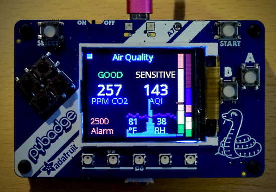](https://twitter.com/CedarGroveMakr/status/1435012845100429312)

Wrapping up the testing of a CO2 + AQI (particulate) monitor. Uses SCD-30 and PMSA003I sensors. The toughest part is figuring out how to take a decent photo of the LCD display - [Twitter](https://twitter.com/CedarGroveMakr/status/1435012845100429312).

[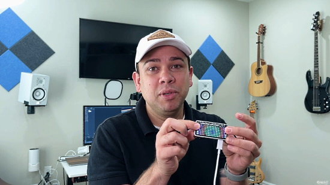](https://www.youtube.com/watch?v=iU36rs_WXAo)

Controlling the Elgato Key Light Air using the ATMegaZero ESP32-S2 & CircuitPython - [YouTube](https://www.youtube.com/watch?v=iU36rs_WXAo) and [Twitter](https://twitter.com/4hackrr/status/1435674385529163781).

[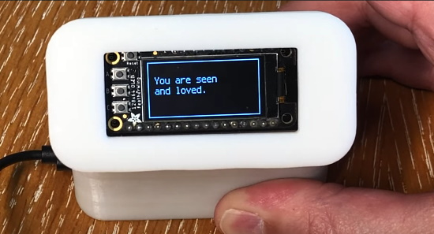](https://blog.adafruit.com/2021/09/10/send-love-letters-with-electronic-feathers-and-a-transmutable-swan-feather-circuitpython-piday-transmutableco/)

Send love letters with Feathers (programmed in CircuitPython) and a beautiful Transmutable Swan case - [YouTube](https://www.youtube.com/watch?v=cGF3H_JqrTA), [GitHub](https://github.com/Transmutable/swan/tree/main/scripts) and [Adafruit Blog](https://blog.adafruit.com/2021/09/10/send-love-letters-with-electronic-feathers-and-a-transmutable-swan-feather-circuitpython-piday-transmutableco/).

Converting an inexpensive white LED fixture to use colorful NeoPixels powered by an Adafruit QT Py and CircuitPython - [Twitter Thread](https://twitter.com/biglesp/status/1435528310176485377).

[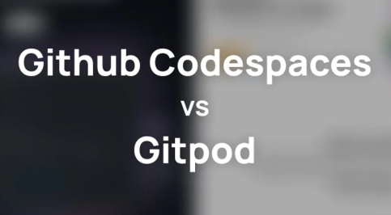](https://blog.adafruit.com/2021/09/07/github-codespaces-vs-gitpod-choosing-the-best-online-code-editor-okikio_dev/)

Github Codespaces vs. Gitpod: Choosing the Best Online Code Editor - [k](https://blog.okikio.dev/github-codespaces-vs-gitpod-choosing-the-best-online-code-editor) and [Adafruit Blog](https://blog.adafruit.com/2021/09/07/github-codespaces-vs-gitpod-choosing-the-best-online-code-editor-okikio_dev/).

[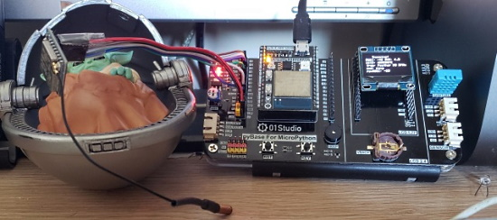](https://kongduino.wordpress.com/2021/09/09/adding-trng-to-circuitpython/)

Adding a true random number generator (TRNG) to CircuitPython via LoRa - [kongduino](https://kongduino.wordpress.com/2021/09/09/adding-trng-to-circuitpython/).

[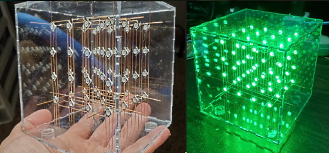](https://blog.adafruit.com/2021/09/09/an-rgb-led-neopixel-cube-circuit-sculpture-with-circuitpython-qtpy-circuitpython/)

An RGB LED NeoPixel cube circuit sculpture with CircuitPython - [Adafruit Blog](https://blog.adafruit.com/2021/09/09/an-rgb-led-neopixel-cube-circuit-sculpture-with-circuitpython-qtpy-circuitpython/), [hackaday.io](https://hackaday.io/project/181550-rgb-cube-circuit-sculpture) and [YouTube](https://youtu.be/oyY1UXWz6yU).

[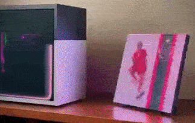](https://www.raspberrypi.org/blog/raspberry-pi-displays-album-art-on-led-matrix/)

Raspberry Pi displays album art on an Adafruit LED matrix - [Raspberry Pi Blog](https://www.raspberrypi.org/blog/raspberry-pi-displays-album-art-on-led-matrix/) and [Twitter](https://twitter.com/Raspberry_Pi/status/1435216501162774528).

text - [site](url).

Adafruit_BusIO ported to Arduino for prettier, easier-to-maintain libraries - [Adafruit Blog](https://blog.adafruit.com/2021/09/09/adafruit_busio-ification-for-prettier-easier-to-maintain-arduino-libraries/).

text - [site](url).

text - [site](url).

text - [site](url).

text - [site](url).

text - [site](url).

text - [site](url).

text - [site](url).

text - [site](url).

[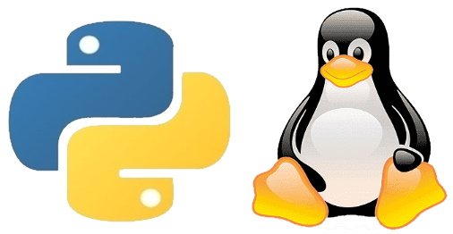](https://github.com/peterbay/sysinfo)

Python based scripts for obtaining system information from Linux - [Python Awesome](https://pythonawesome.com/python-based-scripts-for-obtaining-system-information-from-linux/) and [GitHub](https://github.com/peterbay/sysinfo).

[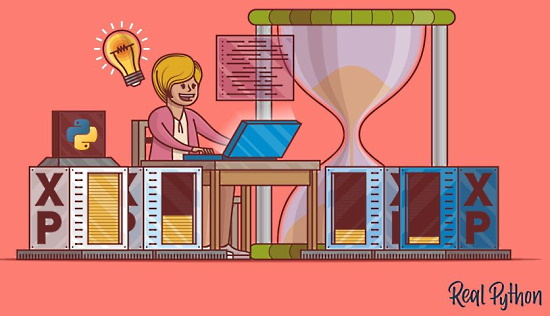](url)

How Long Does It Take to Learn Python? - [Real Python](https://twitter.com/realpython/status/1435245735298191361).

[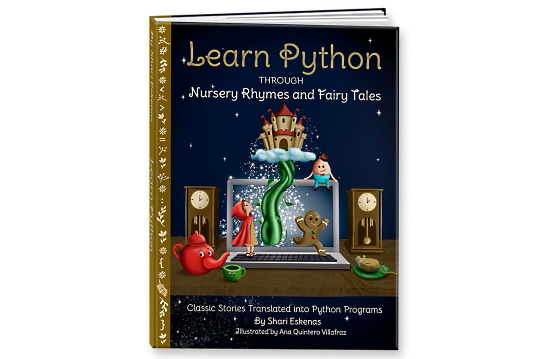](https://www.kickstarter.com/projects/914595512/learn-python-through-nursery-rhymes-and-fairy-tales)

Learn Python through Nursery Rhymes & Fairy Tales - [Kickstarter](https://www.kickstarter.com/projects/914595512/learn-python-through-nursery-rhymes-and-fairy-tales).

Getting Started with nRF Connect for Visual Studio Code - [Rajeev Piyare](https://www.rajeevpiyare.com/posts/nrfconnect-vs-code/) and [Twitter](https://twitter.com/conexiotech/status/1435826301441564680).

CircuitPython Weekly for September 7th, 2021 [on YouTube](https://youtu.be/zVjn_liofmI) and with [notes](https://github.com/adafruit/adafruit-circuitpython-weekly-meeting/blob/main/2021/2021-09-07.md)

**#ICYDNCI What was the most popular, most clicked link, in [last week's newsletter](https://link)? [title](url).**

## Coming soon

text - [site](url).

text - [site](url).

## New Boards Supported by CircuitPython

The number of supported microcontrollers and Single Board Computers (SBC) grows every week. This section outlines which boards have been included in CircuitPython or added to [CircuitPython.org](https://circuitpython.org/).

This week, there were (#/no) new boards added!

- [Board name](url)

Looking to add a new board to CircuitPython? It's highly encouraged! Adafruit has four guides to help you do so:

- [How to Add a New Board to CircuitPython](https://learn.adafruit.com/how-to-add-a-new-board-to-circuitpython/overview)
- [How to add a New Board to the circuitpython.org website](https://learn.adafruit.com/how-to-add-a-new-board-to-the-circuitpython-org-website)
- [Adding a Single Board Computer to PlatformDetect for Blinka](https://learn.adafruit.com/adding-a-single-board-computer-to-platformdetect-for-blinka)
- [Adding a Single Board Computer to Blinka](https://learn.adafruit.com/adding-a-single-board-computer-to-blinka)

## New Learn Guides!

[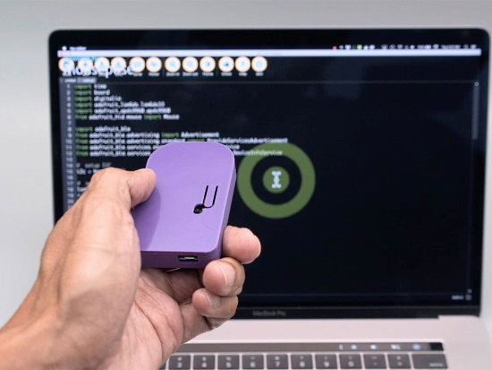](https://learn.adafruit.com/guides/latest)

[Programmable Wireless BLE Gesture Mouse](https://learn.adafruit.com/ble-wireless-gesture-mouse) from [Liz Clark](https://learn.adafruit.com/users/BlitzCityDIY)

[Adafruit 1.69" 280x240 Round Rectangle Color IPS TFT Display](https://learn.adafruit.com/adafruit-1-69-280x240-round-rectangle-color-ips-tft-display) from [Melissa LeBlanc-Williams](https://learn.adafruit.com/users/MakerMelissa)

## Updated Learn Guides!

[Adafruit INA219 Current Sensor Breakout](https://learn.adafruit.com/adafruit-ina219-current-sensor-breakout) from [Kattni](https://learn.adafruit.com/users/kattni)

## CircuitPython Project Bundle

When you get to the CircuitPython code section of an [Adafruit Learn Guide](https://learn.adafruit.com/), sometimes things can get a bit complicated. You not only have the code you need to upload to your device, but you likely also need to add some libraries that the code requires to run. This involved downloading all the libraries, digging through to find the ones you need, and copying them to your device. That was only the beginning on some projects, as those that include images and/or sound files required further downloading and copying of files. But, not anymore!

Now, with Project Bundles, you can download all the necessary code, libraries and, if needed, asset files with one click! We automatically check which libraries are required for the project and bundle them up for you. No more digging through a huge list of libraries to find the ones you need, or fiddling with looking for other files or dependencies. Download the Project Bundle, copy the contents to your device, and your code will simply work. We wanted to make this the easiest way to get a project working, regardless of whether you're a beginner or an expert. We'll also be adding this feature to popular IDEs as an add-on. Try it out with any Circuit Python guide on the Adafruit Learning System. Just look for the ‘Download Project Bundle’ button on the code page. 

**To download and use a Project Bundle:**

In the Learning System - above any embedded code in a guide in the Adafruit Learn System, you’ll find a Download Project Bundle button.

Click the button to download the Project Bundle zip.

Open the Project Bundle zip to find the example code, all necessary libraries, and, if available, any images, sounds, etc.

Simply copy all the files over to your CIRCUITPY drive, and you’re ready to go!

If you run into any problems or bugs, or would like to submit feedback, please file an issue on the [Adafruit Learning System Guides GitHub repo](https://github.com/adafruit/Adafruit_Learning_System_Guides/issues).

## CircuitPython Libraries!

CircuitPython support for hardware continues to grow. We are adding support for new sensors and breakouts all the time, as well as improving on the drivers we already have. As we add more libraries and update current ones, you can keep up with all the changes right here!

For the latest libraries, download the [Adafruit CircuitPython Library Bundle](https://circuitpython.org/libraries). For the latest community contributed libraries, download the [CircuitPython Community Bundle](https://github.com/adafruit/CircuitPython_Community_Bundle/releases).

If you'd like to contribute, CircuitPython libraries are a great place to start. Have an idea for a new driver? File an issue on [CircuitPython](https://github.com/adafruit/circuitpython/issues)! Have you written a library you'd like to make available? Submit it to the [CircuitPython Community Bundle](https://github.com/adafruit/CircuitPython_Community_Bundle). Interested in helping with current libraries? Check out the [CircuitPython.org Contributing page](https://circuitpython.org/contributing). We've included open pull requests and issues from the libraries, and details about repo-level issues that need to be addressed. We have a guide on [contributing to CircuitPython with Git and Github](https://learn.adafruit.com/contribute-to-circuitpython-with-git-and-github) if you need help getting started. You can also find us in the #circuitpython channel on the [Adafruit Discord](https://adafru.it/discord).

You can check out this [list of all the Adafruit CircuitPython libraries and drivers available](https://github.com/adafruit/Adafruit_CircuitPython_Bundle/blob/master/circuitpython_library_list.md). 

The current number of CircuitPython libraries is **333**!

**Updated Libraries!**

Here's this week's updated CircuitPython libraries:

 * [Adafruit_CircuitPython_ST7789](https://github.com/adafruit/Adafruit_CircuitPython_ST7789)
 * [Adafruit_CircuitPython_turtle](https://github.com/adafruit/Adafruit_CircuitPython_turtle)
 * [Adafruit_CircuitPython_SGP40](https://github.com/adafruit/Adafruit_CircuitPython_SGP40)
 * [CircuitPython_Community_Bundle](https://github.com/adafruit/CircuitPython_Community_Bundle)

## What’s the team up to this week?

What is the team up to this week? Let’s check in!

**Dan**

I am back from vacation, working on the final few things we need to finish for 7.0.0 final. I fixed an RP2040 I2SOut issue, and thought there was another software audio quality issue, but it turned out to be a wiring/grounding problem. The moral is to try the simplest possible wiring before concluding the issue is software.

**Jeff**

I've been on vacation, but that vacation included a trip to Adafruit Headquarters. You may have seen me on Ask an Engineer. Next week I'll return to my regular work schedule and continue with anything that needs fixing as we approach 7.0.0.

**Kattni**

This past week was a short week for me. I helped Melissa out with the 1.69" Round Rectangle TFT display guide. I finished updating the [INA219 guide](https://learn.adafruit.com/adafruit-ina219-current-sensor-breakout/overview) for the STEMMA QT revision of the board. The QT version has been out for a while, but the guide was never updated. Now there are Pinouts, new wiring diagrams, and new Downloads resources for the current version of the board.

I found a bug in CircuitPython for RP2040 regarding WAV and tone playback using I2S while working on the I2S template. Dan already figured out a fix and it's been merged. So, I'll now be able to continue working on that template. The first guide it will be in is the MP3 Playback on RP2040 guide, with Pico as the example board (the testing of which is how I found the bug in the first place). Keep an eye out for that!

**Melissa**

This past week, I worked on a fixing issues on GitHub focusing mostly on the Raspberry Pi scripts. I fixed the Pinning script which wasn't working with more recent versions of the kernel due to a version string format change. I also worked on with Kattni to get the [Adafruit 1.69" 280x240 Round Rectangle Display](https://learn.adafruit.com/adafruit-1-69-280x240-round-rectangle-color-ips-tft-display) guide written.

**Scott**

This week has been a mix of updating the BLE workflow to handle file modification times and bug hunting. Mainly, I got the BLE_File_Transfer library updated with the modification time support and the new move command. I'm now getting that working in core CircuitPython but need to tweak the protocol to work better on ARM by aligning the 64-bit field better.

Bug-wise, I fixed a bug with scanning while the workflow is advertising. I copied a fix for GCC 11.2 and the nrf bootloader into CircuitPython to fix it similarly. I also released CircuitPython 7.0.0-rc.1 for testing.

As a break from BLE and bugs I modified the CircuitPython continuous build to only build boards related to the changed files. This should reduce our usage and shorten how long it takes to get results back. See more about this on my Deep Dive from [last week](https://www.youtube.com/watch?v=q8qQi2P4g_U).

## Upcoming events!

PyConline AU will be held 10-12 September, 2021 - [pyconlineau](https://2021.pycon.org.au/)

Kiwi PyCon XI, Ōtautahi Christchurch, 17th, 18th, & 19th of September 2021 and CFP ends July 16th - [python.nz](https://python.nz/kiwipycon).

PyCon India is the largest gathering of Pythonistas in India for the Python programming language. The 13th edition of PyCon India will be taking place online from 17th September to 20th September 2021 - [PyCon India 2021](https://in.pycon.org/2021/).

PyGotham is a New York City based, eclectic, Py-centric conference covering many topics. [PyGotham TV 2021](https://2021.pygotham.tv/) is an online-only edition of PyGotham being held October 1-2, 2021. The call for proposals is [here](https://cfp.pygotham.tv/). Registration is [here](https://www.eventbrite.com/e/pygotham-tv-2021-tickets-157887556933).

**Send Your Events In**

As for other events, with the COVID pandemic, most in-person events are postponed or cancelled. If you know of virtual events or events that may occur in the future, please let us know on Discord or on Twitter with hashtag #CircuitPython.

## Latest releases

CircuitPython's stable release is [#.#.#](https://github.com/adafruit/circuitpython/releases/latest) and its unstable release is [#.#.#-##.#](https://github.com/adafruit/circuitpython/releases). New to CircuitPython? Start with our [Welcome to CircuitPython Guide](https://learn.adafruit.com/welcome-to-circuitpython).

[2021####](https://github.com/adafruit/Adafruit_CircuitPython_Bundle/releases/latest) is the latest CircuitPython library bundle.

[v#.#.#](https://micropython.org/download) is the latest MicroPython release. Documentation for it is [here](http://docs.micropython.org/en/latest/pyboard/).

[#.#.#](https://www.python.org/downloads/) is the latest Python release. The latest pre-release version is [#.#.#](https://www.python.org/download/pre-releases/).

[2,572 Stars](https://github.com/adafruit/circuitpython/stargazers) Like CircuitPython? [Star it on GitHub!](https://github.com/adafruit/circuitpython)

## Call for help -- Translating CircuitPython is now easier than ever!

One important feature of CircuitPython is translated control and error messages.

With the help of fellow open source project [Weblate](https://weblate.org/), we're making it even easier to add or improve translations.

Sign in with an existing account such as GitHub, Google or Facebook and start contributing through a simple web interface. No forks or pull requests needed!

As always, if you run into trouble join us on [Discord](https://adafru.it/discord), we're here to help.

## jobs.adafruit.com - Find a dream job, find great candidates!

[jobs.adafruit.com](https://jobs.adafruit.com/) has returned and folks are posting their skills (including CircuitPython) and companies are looking for talented makers to join their companies - from Digi-Key, to Hackaday, Micro Center, Raspberry Pi and more.

**Job of the Week**

Electrical Engineers & Technicians - Power Tools at Stanley Black and Decker - [Adafruit Jobs Board](https://jobs.adafruit.com/job/electrical-engineers-technicians-power-tools/).

## NUMBER thanks!

The Adafruit Discord community, where we do all our CircuitPython development in the open, reached over NUMBER humans, thank you!  Adafruit believes Discord offers a unique way for CircuitPython folks to connect. Join today at [https://adafru.it/discord](https://adafru.it/discord).

## ICYMI - In case you missed it

The wonderful world of Python on hardware! This is our Python video-newsletter-podcast! The news comes from the Python community, Discord, Adafruit communities and more and is reviewed on ASK an ENGINEER Wednesdays. The complete Python on Hardware weekly videocast [playlist is here](https://www.youtube.com/playlist?list=PLjF7R1fz_OOXRMjM7Sm0J2Xt6H81TdDev). 

This video podcast is on [iTunes](https://itunes.apple.com/us/podcast/python-on-hardware/id1451685192?mt=2), [YouTube](http://adafru.it/pohepisodes), [IGTV (Instagram TV](https://www.instagram.com/adafruit/channel/)), and [XML](https://itunes.apple.com/us/podcast/python-on-hardware/id1451685192?mt=2).

[Weekly community chat on Adafruit Discord server CircuitPython channel - Audio / Podcast edition](https://itunes.apple.com/us/podcast/circuitpython-weekly-meeting/id1451685016) - Audio from the Discord chat space for CircuitPython, meetings are usually Mondays at 2pm ET, this is the audio version on [iTunes](https://itunes.apple.com/us/podcast/circuitpython-weekly-meeting/id1451685016), Pocket Casts, [Spotify](https://adafru.it/spotify), and [XML feed](https://adafruit-podcasts.s3.amazonaws.com/circuitpython_weekly_meeting/audio-podcast.xml).

And lastly, we are working up a one-spot destination for all things podcast-able here - [podcasts.adafruit.com](https://podcasts.adafruit.com/)

## Contribute!

The CircuitPython Weekly Newsletter is a CircuitPython community-run newsletter emailed every Tuesday. The complete [archives are here](https://www.adafruitdaily.com/category/circuitpython/). It highlights the latest CircuitPython related news from around the web including Python and MicroPython developments. To contribute, edit next week's draft [on GitHub](https://github.com/adafruit/circuitpython-weekly-newsletter/tree/gh-pages/_drafts) and [submit a pull request](https://help.github.com/articles/editing-files-in-your-repository/) with the changes. You may also tag your information on Twitter with #CircuitPython. 

Join our [Discord](https://adafru.it/discord) or [post to the forum](https://forums.adafruit.com/viewforum.php?f=60) for any further questions.
