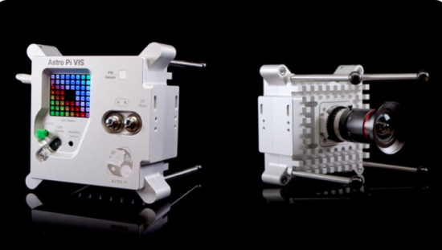
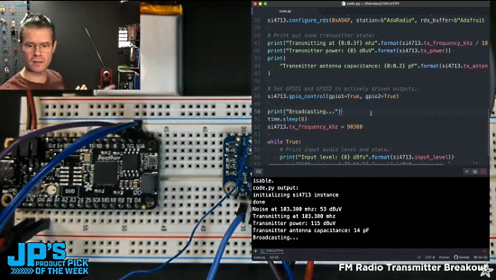
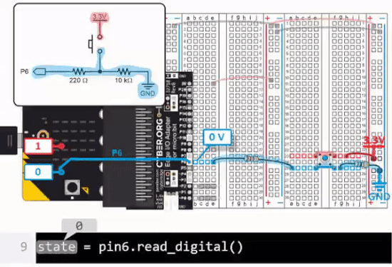
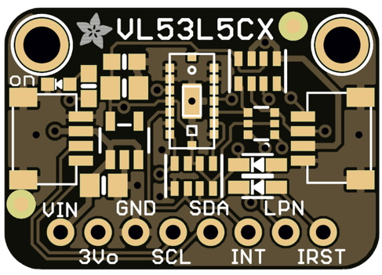
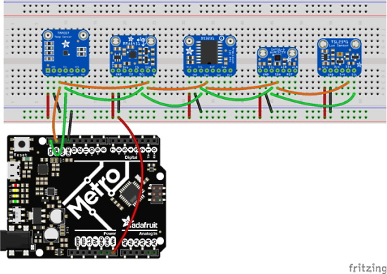
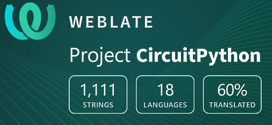

- [ ] Kattni updates
- [ ] change date
- [ ] update title
- [ ] Feature story
- [ ] Update  for images
- [ ] Update ICYDNCI
- [ ] All images 550w max only
- [ ] Link "View this email in your browser."

News Sources

- [python.org](https://www.python.org/)
- [Python Insider - dev team blog](https://pythoninsider.blogspot.com/)

Template last updated on 2021-09-13 add JP's playlist & remove PyCon AU

View this email in your browser.

Welcome to the latest Python on Microcontrollers newsletter, brought you by the community! We're on [Discord](https://discord.gg/HYqvREz), [Twitter](https://twitter.com/search?q=circuitpython&src=typed_query&f=live), and for past newsletters - [view them all here](https://www.adafruitdaily.com/category/circuitpython/). If you're reading this on the web, [subscribe here](https://www.adafruitdaily.com/). Let's get started!

## CircuitPython 7.0.0 Release Candidate 3 Now Available

CircuitPython 7.0.0-rc3, is now available. Release candidate builds mark the final testing of CircuitPython 7 for stable release. The developers have addressed all the issues scheduled for the 7.0.0 release. The release fixes an RP2040 regression introduced in 7.0.0-rc.2. This release is stable, but needs time for further testing. 

**Port status**

CircuitPython has a number of “ports” that are the core implementations for different microcontroller families. Stability varies on a per-port basis. As of this release, `atmel-samd`, `cxd56` (Spresense), `esp32s2`, `nrf`, `raspberrypi`, `stm` for the F4 family are stable. `stm` for other STM chip families is being actively improved but may be missing functionality and have bugs. `litex` and `mimxrt10xx` are in an alpha state and will have bugs and missing functionality.

More on the [Adafruit Blog](https://blog.adafruit.com/2021/09/16/circuitpython-7-0-0-release-candidate-3-released/) and [GitHub](https://github.com/adafruit/circuitpython/releases).

## An Upgraded Astro Pi Deployed to the International Space Station with a New European Astro Pi Challenge

To the ISS & beyond! Upgraded Raspberry Pi computers are heading to space for the Astro Pi challenge. New sensors, cameras & machine learning technology — young people can take advantage of all these features & more! The Astro Pi units, in their space-ready cases of machined aluminium, will travel to the ISS in December on the SpaceX Dragon Cargo rocket, launching from Kennedy Space Center. Once the resupply vehicle docks with the ISS, the units will be unpacked and set up ready to run Astro Pi participants’ code in 2022 - [Raspberry Pi Blog](https://www.raspberrypi.org/blog/astro-pi-2021-news-rocket-launch-hardware/) and [Twitter](https://twitter.com/Raspberry_Pi/status/1437356639087206406).

**New European Astro Pi Challenge**

There are two Astro Pi missions for young people to choose from: Mission Zero and Mission Space Lab. Young people can participate in one or both of the missions! Participation is free and open for young people up to age 19 in ESA member states, Slovenia, Canada, Latvia, Lithuania, and Malta - [YouTube](https://youtu.be/uCg6DZ5YRLc) and [Astro Pi Website](https://astro-pi.org/).

## GitHub Starts to Embed Thanks to People as Contributors to Releases

GitHub will now automate making a Release Notes contributors section based on the GitHub @ handles found within the release notes - [GitHub Documentation](https://docs.github.com/en/repositories/releasing-projects-on-github/managing-releases-in-a-repository) (see 7th point) and [Twitter](https://twitter.com/IAmTrySound/status/1438238193460076548).

## Feature

text - [site](url).

## Feature

text - [site](url).

## Halloween Hackfest

Join Hackaday, Digi-Key, and Adafruit for a Halloween-themed contest! They want to see your crazy, creepy, ghostly, spooky, and awesome projects. 

If costumes are your favorite part of Halloween, then why not dress up your outfit with some hacked upgrades? You could even design a ghoulish prop to add to your home’s Halloween decor or light up a Jack-o-lantern with LEDs. Whether it’s technical, artistic, or just plain terrifying, Hackaday wants to see your projects!

Check out the Halloween Show & Tell with Hackaday, Friday, October 29th at 1pm PT, to show off your awesome projects entered in the contest. Don't forget to also share your projects on social media and use the #HalloweenHackfest!

Hackaday and Digi-Key have partnered on this Halloween-themed contest to offer three winners an online shopping spree to the Digi-Key warehouse! - [Hackaday](https://hackaday.com/2021/08/10/new-contest-halloween-hackfest/) and [hackaday.io](https://hackaday.io/contest/180664-halloween-hackfest).

## Feature

text - [site](url).

## CircuitPython Deep Dive Stream with Scott Shawcroft

[This week](link), Scott streams his work on .

You can see the latest video and past videos on the Adafruit YouTube channel under the Deep Dive playlist - [YouTube](https://www.youtube.com/playlist?list=PLjF7R1fz_OOXBHlu9msoXq2jQN4JpCk8A).

## CircuitPython Parsec

John Park’s CircuitPython Parsec: 

* episode - [Adafruit Blog](url)

Catch all the episodes in the [YouTube playlist](https://www.youtube.com/playlist?list=PLjF7R1fz_OOWFqZfqW9jlvQSIUmwn9lWr).

## News from around the web!

text - [site](url).

JP's Product Pick of the Week: FM Radio Transmitter Breakout - build a pirate radio station with the Si4713 FM Radio Transmitter breakout with RDS Text support.
Running with a Feather RP2040 and CircuitPython - [YouTube](https://youtu.be/4nuNYbzkt4Y) and [Twitter](https://twitter.com/adafruit/status/1437880246724825092).

micro:bit and Python classroom tutorials for pushbuttons just released using free Parallax CYBERscope software - [Parallax](https://learn.parallax.com/tutorials/language/python/sense-pushbutton-presses) and [Twitter](https://twitter.com/ParallaxInc/status/1438182292573220868).

> UPS-Lite, ATmegaZero S2, plus an Adafruit MiniPiTFT 1.13" all make a lovely little CircuitPython gadget/keychain. Will be working on design a keychain case for it, a keychain able to send HID keystrokes, mouse moves, and make a litle bad boy lol (can connect WiFi too) - [Twitter](https://twitter.com/BeBoXoS/status/1438478735838220289).

text - [site](url).

text - [site](url).

text - [site](url).

text - [site](url).

11 Alternatives to the Raspberry Pi Pico (using the same RP2040 processor) - [Make Use Of](https://www.makeuseof.com/alternatives-to-the-raspberry-pi-pico/) and [Adafruit Blog](https://blog.adafruit.com/2021/09/17/11-rp2040-alternatives-to-the-raspberry-pi-pico-piday-raspberrypipico-muo_official/).

text - [site](url).

text - [site](url).

text - [site](url).

Ultimate Python Cheat Sheet - [Dev](https://dev.to/ericchapman/ultimate-python-cheat-sheet-2j88).

text - [site](url).

text - [site](url).

text - [site](url).

text - [site](url).

text - [site](url).

text - [site](url).

text - [site](url).

**#ICYDNCI What was the most popular, most clicked link, in [last week's newsletter](https://link)? [title](url).**

## Coming soon

Adafruit is spinning up a new STEMMA QT connected design for the VL53L5CX time of flight sensor. It has up to 4 meter ranging and also has ‘depth mapping’ of 4×4 or 8×8, which is a first for ToF sensors - [Adafruit Blog](https://blog.adafruit.com/2021/09/14/vl53lcx-stemma-qt-breakout-design/).

text - [site](url).

## New Boards Supported by CircuitPython

The number of supported microcontrollers and Single Board Computers (SBC) grows every week. This section outlines which boards have been included in CircuitPython or added to [CircuitPython.org](https://circuitpython.org/).

This week, there were (#/no) new boards added!

- [Board name](url)

Looking to add a new board to CircuitPython? It's highly encouraged! Adafruit has four guides to help you do so:

- [How to Add a New Board to CircuitPython](https://learn.adafruit.com/how-to-add-a-new-board-to-circuitpython/overview)
- [How to add a New Board to the circuitpython.org website](https://learn.adafruit.com/how-to-add-a-new-board-to-the-circuitpython-org-website)
- [Adding a Single Board Computer to PlatformDetect for Blinka](https://learn.adafruit.com/adding-a-single-board-computer-to-platformdetect-for-blinka)
- [Adding a Single Board Computer to Blinka](https://learn.adafruit.com/adding-a-single-board-computer-to-blinka)

## New Learn Guides!

[title](url) from [name](url)

[title](url) from [name](url)

[title](url) from [name](url)

## Updated Learn Guides!

[title](url) from [name](url)

## CircuitPython Project Bundle

When you get to the CircuitPython code section of an [Adafruit Learn Guide](https://learn.adafruit.com/), sometimes things can get a bit complicated. You not only have the code you need to upload to your device, but you likely also need to add some libraries that the code requires to run. This involved downloading all the libraries, digging through to find the ones you need, and copying them to your device. That was only the beginning on some projects, as those that include images and/or sound files required further downloading and copying of files. But, not anymore!

Now, with Project Bundles, you can download all the necessary code, libraries and, if needed, asset files with one click! We automatically check which libraries are required for the project and bundle them up for you. No more digging through a huge list of libraries to find the ones you need, or fiddling with looking for other files or dependencies. Download the Project Bundle, copy the contents to your device, and your code will simply work. We wanted to make this the easiest way to get a project working, regardless of whether you're a beginner or an expert. We'll also be adding this feature to popular IDEs as an add-on. Try it out with any Circuit Python guide on the Adafruit Learning System. Just look for the ‘Download Project Bundle’ button on the code page. 

**To download and use a Project Bundle:**

In the Learning System - above any embedded code in a guide in the Adafruit Learn System, you’ll find a Download Project Bundle button.

Click the button to download the Project Bundle zip.

Open the Project Bundle zip to find the example code, all necessary libraries, and, if available, any images, sounds, etc.

Simply copy all the files over to your CIRCUITPY drive, and you’re ready to go!

If you run into any problems or bugs, or would like to submit feedback, please file an issue on the [Adafruit Learning System Guides GitHub repo](https://github.com/adafruit/Adafruit_Learning_System_Guides/issues).

## CircuitPython Libraries!

CircuitPython support for hardware continues to grow. We are adding support for new sensors and breakouts all the time, as well as improving on the drivers we already have. As we add more libraries and update current ones, you can keep up with all the changes right here!

For the latest libraries, download the [Adafruit CircuitPython Library Bundle](https://circuitpython.org/libraries). For the latest community contributed libraries, download the [CircuitPython Community Bundle](https://github.com/adafruit/CircuitPython_Community_Bundle/releases).

If you'd like to contribute, CircuitPython libraries are a great place to start. Have an idea for a new driver? File an issue on [CircuitPython](https://github.com/adafruit/circuitpython/issues)! Have you written a library you'd like to make available? Submit it to the [CircuitPython Community Bundle](https://github.com/adafruit/CircuitPython_Community_Bundle). Interested in helping with current libraries? Check out the [CircuitPython.org Contributing page](https://circuitpython.org/contributing). We've included open pull requests and issues from the libraries, and details about repo-level issues that need to be addressed. We have a guide on [contributing to CircuitPython with Git and Github](https://learn.adafruit.com/contribute-to-circuitpython-with-git-and-github) if you need help getting started. You can also find us in the #circuitpython channel on the [Adafruit Discord](https://adafru.it/discord).

You can check out this [list of all the Adafruit CircuitPython libraries and drivers available](https://github.com/adafruit/Adafruit_CircuitPython_Bundle/blob/master/circuitpython_library_list.md). 

The current number of CircuitPython libraries is **###**!

**New Libraries!**

Here's this week's new CircuitPython libraries:

* [library](url)

**Updated Libraries!**

Here's this week's updated CircuitPython libraries:

* [library](url)

## What’s the team up to this week?

What is the team up to this week? Let’s check in!

**Dan**

text

**Jeff**

text

**Kattni**

text

**Melissa**

text

**Scott**

text

## Upcoming events!

Kiwi PyCon XI, Ōtautahi Christchurch, 17th, 18th, & 19th of September 2021 and CFP ends July 16th - [python.nz](https://python.nz/kiwipycon).

PyCon India is the largest gathering of Pythonistas in India for the Python programming language. The 13th edition of PyCon India will be taking place online from 17th September to 20th September 2021 - [PyCon India 2021](https://in.pycon.org/2021/).

PyGotham is a New York City based, eclectic, Py-centric conference covering many topics. [PyGotham TV 2021](https://2021.pygotham.tv/) is an online-only edition of PyGotham being held October 1-2, 2021. The call for proposals is [here](https://cfp.pygotham.tv/). Registration is [here](https://www.eventbrite.com/e/pygotham-tv-2021-tickets-157887556933).

**Send Your Events In**

As for other events, with the COVID pandemic, most in-person events are postponed or cancelled. If you know of virtual events or events that may occur in the future, please let us know on Discord or on Twitter with hashtag #CircuitPython.

## Latest releases

CircuitPython's stable release is [#.#.#](https://github.com/adafruit/circuitpython/releases/latest) and its unstable release is [#.#.#-##.#](https://github.com/adafruit/circuitpython/releases). New to CircuitPython? Start with our [Welcome to CircuitPython Guide](https://learn.adafruit.com/welcome-to-circuitpython).

[2021####](https://github.com/adafruit/Adafruit_CircuitPython_Bundle/releases/latest) is the latest CircuitPython library bundle.

[v#.#.#](https://micropython.org/download) is the latest MicroPython release. Documentation for it is [here](http://docs.micropython.org/en/latest/pyboard/).

[#.#.#](https://www.python.org/downloads/) is the latest Python release. The latest pre-release version is [#.#.#](https://www.python.org/download/pre-releases/).

[#### Stars](https://github.com/adafruit/circuitpython/stargazers) Like CircuitPython? [Star it on GitHub!](https://github.com/adafruit/circuitpython)

## Call for help -- Translating CircuitPython is now easier than ever!

One important feature of CircuitPython is translated control and error messages.

With the help of fellow open source project [Weblate](https://weblate.org/), we're making it even easier to add or improve translations.

Sign in with an existing account such as GitHub, Google or Facebook and start contributing through a simple web interface. No forks or pull requests needed!

As always, if you run into trouble join us on [Discord](https://adafru.it/discord), we're here to help.

## jobs.adafruit.com - Find a dream job, find great candidates!

[jobs.adafruit.com](https://jobs.adafruit.com/) has returned and folks are posting their skills (including CircuitPython) and companies are looking for talented makers to join their companies - from Digi-Key, to Hackaday, Micro Center, Raspberry Pi and more.

**Job of the Week**

text - [Adafruit Jobs Board](https://jobs.adafruit.com/).

## NUMBER thanks!

The Adafruit Discord community, where we do all our CircuitPython development in the open, reached over NUMBER humans, thank you!  Adafruit believes Discord offers a unique way for CircuitPython folks to connect. Join today at [https://adafru.it/discord](https://adafru.it/discord).

## ICYMI - In case you missed it

The wonderful world of Python on hardware! This is our Python video-newsletter-podcast! The news comes from the Python community, Discord, Adafruit communities and more and is reviewed on ASK an ENGINEER Wednesdays. The complete Python on Hardware weekly videocast [playlist is here](https://www.youtube.com/playlist?list=PLjF7R1fz_OOXRMjM7Sm0J2Xt6H81TdDev). 

This video podcast is on [iTunes](https://itunes.apple.com/us/podcast/python-on-hardware/id1451685192?mt=2), [YouTube](http://adafru.it/pohepisodes), [IGTV (Instagram TV](https://www.instagram.com/adafruit/channel/)), and [XML](https://itunes.apple.com/us/podcast/python-on-hardware/id1451685192?mt=2).

[Weekly community chat on Adafruit Discord server CircuitPython channel - Audio / Podcast edition](https://itunes.apple.com/us/podcast/circuitpython-weekly-meeting/id1451685016) - Audio from the Discord chat space for CircuitPython, meetings are usually Mondays at 2pm ET, this is the audio version on [iTunes](https://itunes.apple.com/us/podcast/circuitpython-weekly-meeting/id1451685016), Pocket Casts, [Spotify](https://adafru.it/spotify), and [XML feed](https://adafruit-podcasts.s3.amazonaws.com/circuitpython_weekly_meeting/audio-podcast.xml).

And lastly, we are working up a one-spot destination for all things podcast-able here - [podcasts.adafruit.com](https://podcasts.adafruit.com/)

## Codecademy "Learn Hardware Programming with CircuitPython"

Codecademy, an online interactive learning platform used by more than 45 million people, has teamed up with the leading manufacturer in STEAM electronics, Adafruit Industries, to create a coding course, "Learn Hardware Programming with CircuitPython". The course is now available in the [Codecademy catalog](https://www.codecademy.com/learn/learn-circuitpython?utm_source=adafruit&utm_medium=partners&utm_campaign=circuitplayground&utm_content=pythononhardwarenewsletter).

Python is a highly versatile, easy to learn programming language that a wide range of people, from visual effects artists in Hollywood to mission control at NASA, use to quickly solve problems. But you don’t need to be a rocket scientist to accomplish amazing things with it. This new course introduces programmers to Python by way of a microcontroller — CircuitPython — which is a Python-based programming language optimized for use on hardware.

CircuitPython’s hardware-ready design makes it easier than ever to program a variety of single-board computers, and this course gets you from no experience to working prototype faster than ever before. Codecademy’s interactive learning environment, combined with Adafruit's highly rated Circuit Playground Express, present aspiring hardware hackers with a never-before-seen opportunity to learn hardware programming seamlessly online.

Whether for those who are new to programming, or for those who want to expand their skill set to include physical computing, this course will have students getting familiar with Python and creating incredible projects along the way. By the end, students will have built their own bike lights, drum machine, and even a moisture detector that can tell when it's time to water a plant.

Visit Codecademy to access the [Learn Hardware Programming with CircuitPython](https://www.codecademy.com/learn/learn-circuitpython?utm_source=adafruit&utm_medium=partners&utm_campaign=circuitplayground&utm_content=pythononhardwarenewsletter) course and Adafruit to purchase a [Circuit Playground Express](https://www.adafruit.com/product/3333).

Codecademy has helped more than 45 million people around the world upgrade their careers with technology skills. The company’s online interactive learning platform is widely recognized for providing an accessible, flexible, and engaging experience for beginners and experienced programmers alike. Codecademy has raised a total of $43 million from investors including Union Square Ventures, Kleiner Perkins, Index Ventures, Thrive Capital, Naspers, Yuri Milner and Richard Branson, most recently raising its $30 million Series C in July 2016.

## Contribute!

The CircuitPython Weekly Newsletter is a CircuitPython community-run newsletter emailed every Tuesday. The complete [archives are here](https://www.adafruitdaily.com/category/circuitpython/). It highlights the latest CircuitPython related news from around the web including Python and MicroPython developments. To contribute, edit next week's draft [on GitHub](https://github.com/adafruit/circuitpython-weekly-newsletter/tree/gh-pages/_drafts) and [submit a pull request](https://help.github.com/articles/editing-files-in-your-repository/) with the changes. You may also tag your information on Twitter with #CircuitPython. 

Join our [Discord](https://adafru.it/discord) or [post to the forum](https://forums.adafruit.com/viewforum.php?f=60) for any further questions.
