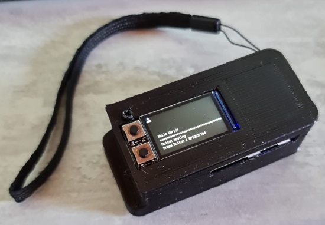
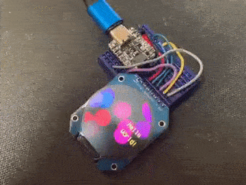
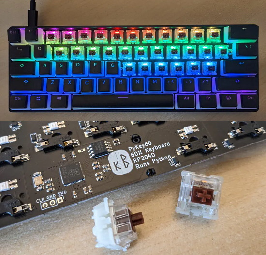
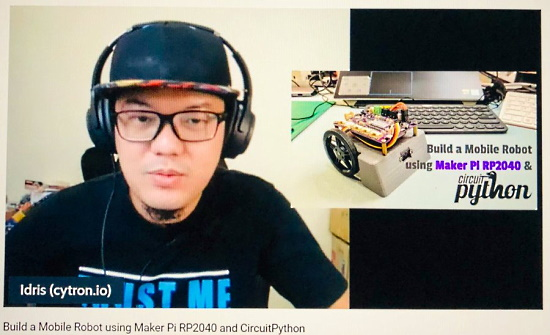
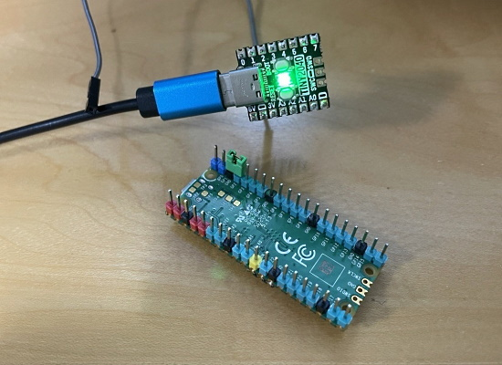
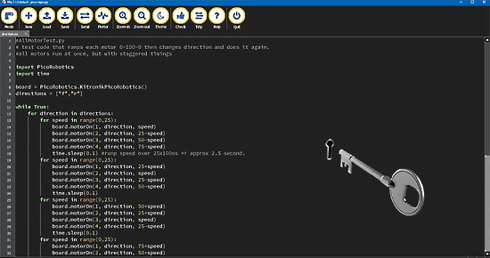
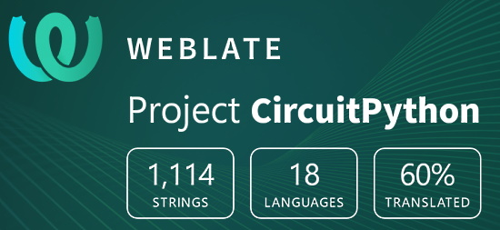

- [X] Kattni updates
- [ ] change date
- [ ] update title
- [ ] Feature story
- [ ] Update  for images
- [ ] Update ICYDNCI
- [ ] All images 550w max only
- [ ] Link "View this email in your browser."

News Sources

- [python.org](https://www.python.org/)
- [Python Insider - dev team blog](https://pythoninsider.blogspot.com/)

View this email in your browser.

Welcome to the latest Python on Microcontrollers newsletter, brought you by the community! We're on [Discord](https://discord.gg/HYqvREz), [Twitter](https://twitter.com/search?q=circuitpython&src=typed_query&f=live), and for past newsletters - [view them all here](https://www.adafruitdaily.com/category/circuitpython/). If you're reading this on the web, [subscribe here](https://www.adafruitdaily.com/). Let's get started!

## Headline Article

text - [site](url).

## Feature

text - [site](url).

## Feature

text - [site](url).

## Halloween Hackfest

Join Hackaday, Digi-Key, and Adafruit for a Halloween-themed contest! They want to see your crazy, creepy, ghostly, spooky, and awesome projects. 

If costumes are your favorite part of Halloween, then why not dress up your outfit with some hacked upgrades? You could even design a ghoulish prop to add to your home’s Halloween decor or light up a Jack-o-lantern with LEDs. Whether it’s technical, artistic, or just plain terrifying, Hackaday wants to see your projects!

Check out the Halloween Show & Tell with Hackaday, Friday, October 29th at 1pm PT, to show off your awesome projects entered in the contest. Don't forget to also share your projects on social media and use the #HalloweenHackfest!

Hackaday and Digi-Key have partnered on this Halloween-themed contest to offer three winners an online shopping spree to the Digi-Key warehouse! - [Hackaday](https://hackaday.com/2021/08/10/new-contest-halloween-hackfest/) and [hackaday.io](https://hackaday.io/contest/180664-halloween-hackfest).

## Feature

text - [site](url).

## CircuitPython Deep Dive Stream with Scott Shawcroft

[This week](link), Scott streams his work on .

You can see the latest video and past videos on the Adafruit YouTube channel under the Deep Dive playlist - [YouTube](https://www.youtube.com/playlist?list=PLjF7R1fz_OOXBHlu9msoXq2jQN4JpCk8A).

## CircuitPython Parsec

John Park’s CircuitPython Parsec: 

* episode - [Adafruit Blog](url)

Catch all the episodes in the [YouTube playlist](https://www.youtube.com/playlist?list=PLjF7R1fz_OOWFqZfqW9jlvQSIUmwn9lWr).

## News from around the web!

> Playing with the layout of components for the portable CO2+particulate air quality monitor. The phone-sized Pelican Go case is very spacious. Implemented with 
Adafruit CircuitPython v7.0.0. - [Twitter](https://twitter.com/CedarGroveMakr/status/1441472138230206469).

Stephane BeBoX has released the Boot Menu Application Laucher code highlighted in the last issue for creating menus on screen which launch CircuitPython programs - [GitHub](https://github.com/beboxos/circuitpython/tree/main/ATMegaZero%20S2/BootMenu) and [Twitter](https://twitter.com/BeBoXoS/status/1439211256783773700).

> I found my GC9A01 (round display) test board already wired up with a QTPy M0 Haxpress and I was able to quickly swap to a QTPy RP2040 and it works great! Also I updated my demos repo for it and CircuitPython 7 - [Twitter](https://twitter.com/todbot/status/1439294630546141186).

BlueMicro's PyKey60 Is a 60% Mechanical Keyboard Powered by an RP2040 and CircuitPython. Designed for beginners, this custom programmable keyboard includes per-key RGB LED lighting and hackable firmware - [hackster.io](https://www.hackster.io/news/bluemicro-s-pykey60-is-a-60-mechanical-keyboard-powered-by-an-rp2040-and-circuitpython-3d27434a6e92).

Build a Mobile Robot using Maker Pi RP2040 and CircuitPython by Idris Zainal Abidin at PyCon Malaysia 2021 - [Twitter](https://twitter.com/pyconmy/status/1439108009565700096).

Parallel LCD displays on ESP32-S2 with CircuitPython - [Adafruit Blog](https://blog.adafruit.com/2021/09/22/parallel-lcd-displays-on-esp32-s2-with-circuitpython-esp32-circuitpython-espressifsystem-adafruit/).

Roughly create a macro keyboard (not a board) with RP2040 and CircuitPython (Japanese) - [Akii Diary](https://akkiesoft.hatenablog.jp/entry/20210523/1621778666) and [YouTube](https://youtu.be/P5iPPrDTLQ8).

Example class and sample code in CircuitPython and MicroPython for Kitronik's Motor Driver/Robotics boards for Raspberry Pi Pico - [Kitronic](https://kitronik.co.uk/blogs/resources/circuitpython-for-kitronik-motor-driver-boards-for-raspberry-pi-pico) and [Twitter](https://twitter.com/Kitronik/status/1439212761905569795).

text - [site](url).

text - [site](url).

text - [site](url).

text - [site](url).

text - [site](url).

text - [site](url).

text - [site](url).

text - [site](url).

text - [site](url).

text - [site](url).

text - [site](url).

text - [site](url).

#ICYDNCI What was the most popular, most clicked link, in [last week's newsletter](https://www.adafruitdaily.com/2021/09/21/python-on-microcontrollers-newsletter-circuitpython-7-0-0-released-and-more-python-adafruit-circuitpython-micropython-thepsf/)? [Ultimate Python Cheat Sheet](https://dev.to/ericchapman/ultimate-python-cheat-sheet-2j88).

## Coming soon

text - [site](url).

> If you like Adafruit's CircuitPython, Alex Lynd and Kody Kinzie are testing adding S2Mini boards based on the ESP32-S2 to the WifiNugget! Easy installation through a web interface, plus it mounts as a USB drive to easily drag & drop your code onto - [Twitter](https://twitter.com/KodyKinzie/status/1440944507457916932).

## New Boards Supported by CircuitPython

The number of supported microcontrollers and Single Board Computers (SBC) grows every week. This section outlines which boards have been included in CircuitPython or added to [CircuitPython.org](https://circuitpython.org/).

This week, there were (#/no) new boards added!

- [Board name](url)

Looking to add a new board to CircuitPython? It's highly encouraged! Adafruit has four guides to help you do so:

- [How to Add a New Board to CircuitPython](https://learn.adafruit.com/how-to-add-a-new-board-to-circuitpython/overview)
- [How to add a New Board to the circuitpython.org website](https://learn.adafruit.com/how-to-add-a-new-board-to-the-circuitpython-org-website)
- [Adding a Single Board Computer to PlatformDetect for Blinka](https://learn.adafruit.com/adding-a-single-board-computer-to-platformdetect-for-blinka)
- [Adding a Single Board Computer to Blinka](https://learn.adafruit.com/adding-a-single-board-computer-to-blinka)

## New Learn Guides!

[Adafruit IS31FL3741](https://learn.adafruit.com/adafruit-is31fl3741) from [Kattni](https://learn.adafruit.com/users/kattni)

[Adafruit 2.9" eInk Display Breakouts and FeatherWings](https://learn.adafruit.com/adafruit-2-9-eink-display-breakouts-and-featherwings) from [Melissa LeBlanc-Williams](https://learn.adafruit.com/users/MakerMelissa)

## CircuitPython Project Bundle

When you get to the CircuitPython code section of an [Adafruit Learn Guide](https://learn.adafruit.com/), sometimes things can get a bit complicated. You not only have the code you need to upload to your device, but you likely also need to add some libraries that the code requires to run. This involved downloading all the libraries, digging through to find the ones you need, and copying them to your device. That was only the beginning on some projects, as those that include images and/or sound files required further downloading and copying of files. But, not anymore!

Now, with Project Bundles, you can download all the necessary code, libraries and, if needed, asset files with one click! We automatically check which libraries are required for the project and bundle them up for you. No more digging through a huge list of libraries to find the ones you need, or fiddling with looking for other files or dependencies. Download the Project Bundle, copy the contents to your device, and your code will simply work. We wanted to make this the easiest way to get a project working, regardless of whether you're a beginner or an expert. We'll also be adding this feature to popular IDEs as an add-on. Try it out with any Circuit Python guide on the Adafruit Learning System. Just look for the ‘Download Project Bundle’ button on the code page. 

**To download and use a Project Bundle:**

In the Learning System - above any embedded code in a guide in the Adafruit Learn System, you’ll find a Download Project Bundle button.

Click the button to download the Project Bundle zip.

Open the Project Bundle zip to find the example code, all necessary libraries, and, if available, any images, sounds, etc.

Simply copy all the files over to your CIRCUITPY drive, and you’re ready to go!

If you run into any problems or bugs, or would like to submit feedback, please file an issue on the [Adafruit Learning System Guides GitHub repo](https://github.com/adafruit/Adafruit_Learning_System_Guides/issues).

## CircuitPython Libraries!

CircuitPython support for hardware continues to grow. We are adding support for new sensors and breakouts all the time, as well as improving on the drivers we already have. As we add more libraries and update current ones, you can keep up with all the changes right here!

For the latest libraries, download the [Adafruit CircuitPython Library Bundle](https://circuitpython.org/libraries). For the latest community contributed libraries, download the [CircuitPython Community Bundle](https://github.com/adafruit/CircuitPython_Community_Bundle/releases).

If you'd like to contribute, CircuitPython libraries are a great place to start. Have an idea for a new driver? File an issue on [CircuitPython](https://github.com/adafruit/circuitpython/issues)! Have you written a library you'd like to make available? Submit it to the [CircuitPython Community Bundle](https://github.com/adafruit/CircuitPython_Community_Bundle). Interested in helping with current libraries? Check out the [CircuitPython.org Contributing page](https://circuitpython.org/contributing). We've included open pull requests and issues from the libraries, and details about repo-level issues that need to be addressed. We have a guide on [contributing to CircuitPython with Git and Github](https://learn.adafruit.com/contribute-to-circuitpython-with-git-and-github) if you need help getting started. You can also find us in the #circuitpython channel on the [Adafruit Discord](https://adafru.it/discord).

You can check out this [list of all the Adafruit CircuitPython libraries and drivers available](https://github.com/adafruit/Adafruit_CircuitPython_Bundle/blob/master/circuitpython_library_list.md). 

The current number of CircuitPython libraries is **335**!

**New Libraries!**

Here's this week's new CircuitPython libraries:

 * [Adafruit_CircuitPython_UC8151D](https://github.com/adafruit/Adafruit_CircuitPython_UC8151D)

**Updated Libraries!**

Here's this week's updated CircuitPython libraries:

 * [Adafruit_CircuitPython_AS7341](https://github.com/adafruit/Adafruit_CircuitPython_AS7341)
 * [Adafruit_CircuitPython_ESP_ATcontrol](https://github.com/adafruit/Adafruit_CircuitPython_ESP_ATcontrol)
 * [Adafruit_CircuitPython_MIDI](https://github.com/adafruit/Adafruit_CircuitPython_MIDI)
 * [Adafruit_CircuitPython_TLC59711](https://github.com/adafruit/Adafruit_CircuitPython_TLC59711)
 * [Adafruit_CircuitPython_DisplayIO_SH1107](https://github.com/adafruit/Adafruit_CircuitPython_DisplayIO_SH1107)
 * [Adafruit_CircuitPython_EPD](https://github.com/adafruit/Adafruit_CircuitPython_EPD)
 * [Adafruit_CircuitPython_BLE](https://github.com/adafruit/Adafruit_CircuitPython_BLE)
 * [Adafruit_CircuitPython_PortalBase](https://github.com/adafruit/Adafruit_CircuitPython_PortalBase)
 * [Adafruit_CircuitPython_IS31FL3741](https://github.com/adafruit/Adafruit_CircuitPython_IS31FL3741)
 * [Adafruit_CircuitPython_TrellisM4](https://github.com/adafruit/Adafruit_CircuitPython_TrellisM4)
 * [Adafruit_CircuitPython_RGBLED](https://github.com/adafruit/Adafruit_CircuitPython_RGBLED)
 * [Adafruit_CircuitPython_BLE_Magic_Light](https://github.com/adafruit/Adafruit_CircuitPython_BLE_Magic_Light)
 * [Adafruit_CircuitPython_Pixie](https://github.com/adafruit/Adafruit_CircuitPython_Pixie)
 * [Adafruit_CircuitPython_CircuitPlayground](https://github.com/adafruit/Adafruit_CircuitPython_CircuitPlayground)
 * [Adafruit_CircuitPython_NeoKey](https://github.com/adafruit/Adafruit_CircuitPython_NeoKey)
 * [Adafruit_CircuitPython_LED_Animation](https://github.com/adafruit/Adafruit_CircuitPython_LED_Animation)
 * [circuitpython](https://github.com/adafruit/circuitpython)
 * [Adafruit_Blinka](https://github.com/adafruit/Adafruit_Blinka)
 * [CircuitPython_Community_Bundle](https://github.com/adafruit/CircuitPython_Community_Bundle)

## What’s the team up to this week?

What is the team up to this week? Let’s check in!

**Dan**

I released CircuitPython 7.0.0 final on Monday, September 20. Thanks to everyone who contributed to and tested the alpha, beta, and RC releases leading up to this final release.

I'm now working on a backlog of HID-related tasks for 7.1.0 or later. I hope to add boot-protocol keyboards. I'm also working on an example of an HID radial controller. The Microsoft Surface Dial is the most well-known such controller.

**Jeff**

I added a timestamping feature to key Event objects, so that CircuitPython code can tell when a keypress was registered, even if it's not reacted to immediately.

I also worked on improving parallel LCD support in the ESP32-S2. My original goal was to get the display of the Espressif HMI Devkit working, but I wasn't able to reach it. However, there's a coming enhancement for 8-bit displays that will make them faster than now using the I2S peripheral of the ESP32-S2.

**Kattni**

https://blog.adafruit.com/2021/09/24/the-first-risc-v-computer-chip-lands-at-the-european-processor-initiative-riscv-eu/

**Melissa**

This past week, I was out sick for a couple of days, so I didn't end up getting as much done as usual. I also ended up having to delay the 2.9" eInk guide for a bit that I had worked on because the newer eInk flexible display needed a new driver written for it in CircuitPython and Python. So I ended up writing that and updated the guide. The guide is now live [here](https://learn.adafruit.com/adafruit-2-9-eink-display-breakouts-and-featherwings).

**Scott**

This week I've been sucked into Cortex-A land on the Raspberry Pi. My goal is to bring TinyUSB and then CircuitPython to the Raspberry Pi 4s. I've got debugging over JTAG working and [designed a PCB](https://oshpark.com/shared_projects/fBq76nP9) to make it easy to connect to. I'll test it when I receive it. I've also figured out how to catch crashes and determine the reason. This is huge for debugging and fixing things. I used QEMU running the code too but found it doesn't mimic alignment checks like the real one does. So, my next step is getting the memory mapping unit (MMU) configured correctly so that strlen will work. At that point, I hope I'll have debug printing working. If you've done Cortex-A programming, then please ping me [on Discord](https://adafru.it/discord). I'd love some more eyes on the code.

## Upcoming events!

PyGotham is a New York City based, eclectic, Py-centric conference covering many topics. [PyGotham TV 2021](https://2021.pygotham.tv/) is an online-only edition of PyGotham being held October 1-2, 2021. The call for proposals is [here](https://cfp.pygotham.tv/). Registration is [here](https://www.eventbrite.com/e/pygotham-tv-2021-tickets-157887556933).

**Send Your Events In**

As for other events, with the COVID pandemic, most in-person events are postponed or cancelled. If you know of virtual events or events that may occur in the future, please let us know on Discord or on Twitter with hashtag #CircuitPython.

## Latest releases

CircuitPython's stable release is [#.#.#](https://github.com/adafruit/circuitpython/releases/latest) and its unstable release is [#.#.#-##.#](https://github.com/adafruit/circuitpython/releases). New to CircuitPython? Start with our [Welcome to CircuitPython Guide](https://learn.adafruit.com/welcome-to-circuitpython).

[2021####](https://github.com/adafruit/Adafruit_CircuitPython_Bundle/releases/latest) is the latest CircuitPython library bundle.

[v#.#.#](https://micropython.org/download) is the latest MicroPython release. Documentation for it is [here](http://docs.micropython.org/en/latest/pyboard/).

[#.#.#](https://www.python.org/downloads/) is the latest Python release. The latest pre-release version is [#.#.#](https://www.python.org/download/pre-releases/).

[2,592 Stars](https://github.com/adafruit/circuitpython/stargazers) Like CircuitPython? [Star it on GitHub!](https://github.com/adafruit/circuitpython)

## Call for help -- Translating CircuitPython is now easier than ever!

One important feature of CircuitPython is translated control and error messages.

With the help of fellow open source project [Weblate](https://weblate.org/), we're making it even easier to add or improve translations.

Sign in with an existing account such as GitHub, Google or Facebook and start contributing through a simple web interface. No forks or pull requests needed!

As always, if you run into trouble join us on [Discord](https://adafru.it/discord), we're here to help.

## jobs.adafruit.com - Find a dream job, find great candidates!

[jobs.adafruit.com](https://jobs.adafruit.com/) has returned and folks are posting their skills (including CircuitPython) and companies are looking for talented makers to join their companies - from Digi-Key, to Hackaday, Micro Center, Raspberry Pi and more.

**Job of the Week**

text - [Adafruit Jobs Board](https://jobs.adafruit.com/).

## NUMBER thanks!

The Adafruit Discord community, where we do all our CircuitPython development in the open, reached over NUMBER humans, thank you!  Adafruit believes Discord offers a unique way for CircuitPython folks to connect. Join today at [https://adafru.it/discord](https://adafru.it/discord).

## ICYMI - In case you missed it

The wonderful world of Python on hardware! This is our Python video-newsletter-podcast! The news comes from the Python community, Discord, Adafruit communities and more and is reviewed on ASK an ENGINEER Wednesdays. The complete Python on Hardware weekly videocast [playlist is here](https://www.youtube.com/playlist?list=PLjF7R1fz_OOXRMjM7Sm0J2Xt6H81TdDev). 

This video podcast is on [iTunes](https://itunes.apple.com/us/podcast/python-on-hardware/id1451685192?mt=2), [YouTube](http://adafru.it/pohepisodes), [IGTV (Instagram TV](https://www.instagram.com/adafruit/channel/)), and [XML](https://itunes.apple.com/us/podcast/python-on-hardware/id1451685192?mt=2).

[Weekly community chat on Adafruit Discord server CircuitPython channel - Audio / Podcast edition](https://itunes.apple.com/us/podcast/circuitpython-weekly-meeting/id1451685016) - Audio from the Discord chat space for CircuitPython, meetings are usually Mondays at 2pm ET, this is the audio version on [iTunes](https://itunes.apple.com/us/podcast/circuitpython-weekly-meeting/id1451685016), Pocket Casts, [Spotify](https://adafru.it/spotify), and [XML feed](https://adafruit-podcasts.s3.amazonaws.com/circuitpython_weekly_meeting/audio-podcast.xml).

And lastly, we are working up a one-spot destination for all things podcast-able here - [podcasts.adafruit.com](https://podcasts.adafruit.com/)

## Contribute!

The CircuitPython Weekly Newsletter is a CircuitPython community-run newsletter emailed every Tuesday. The complete [archives are here](https://www.adafruitdaily.com/category/circuitpython/). It highlights the latest CircuitPython related news from around the web including Python and MicroPython developments. To contribute, edit next week's draft [on GitHub](https://github.com/adafruit/circuitpython-weekly-newsletter/tree/gh-pages/_drafts) and [submit a pull request](https://help.github.com/articles/editing-files-in-your-repository/) with the changes. You may also tag your information on Twitter with #CircuitPython. 

Join our [Discord](https://adafru.it/discord) or [post to the forum](https://forums.adafruit.com/viewforum.php?f=60) for any further questions.
