- [X] Kattni updates
- [ ] change date
- [ ] update title
- [ ] Feature story
- [ ] Update  for images
- [ ] Update ICYDNCI
- [ ] All images 550w max only
- [ ] Link "View this email in your browser."

News Sources

- [python.org](https://www.python.org/)
- [Python Insider - dev team blog](https://pythoninsider.blogspot.com/)

View this email in your browser.

Welcome to the latest Python on Microcontrollers newsletter, brought you by the community! We're on [Discord](https://discord.gg/HYqvREz), [Twitter](https://twitter.com/search?q=circuitpython&src=typed_query&f=live), and for past newsletters - [view them all here](https://www.adafruitdaily.com/category/circuitpython/). If you're reading this on the web, [subscribe here](https://www.adafruitdaily.com/). Let's get started!

## Headline Article

text - [site](url).

## Events Planning

RISC-V Summit brings the community together to show the power open collaboration can have on the processor industry. The audience spans across industries, organizations, workloads, and geographies to learn about the technology advancements in the RISC-V ecosystem and visibility of RISC-V successes. The event is December 6 – 8, in-person in San Francisco or virtually from anywhere in the world - [Linux Foundation](https://events.linuxfoundation.org/riscv-summit/register/) via [Twitter](https://twitter.com/risc_v/status/1449886188941238274).

PyCon US 2022 planning is underway. The team is planning to host the event in person with an online component. April 27, 2022 - May 5, 2022. Head over to the [PyCon US 2022 website](https://us.pycon.org/2022/) for details about the conference and more information about the sponsorship program - [PyCon Blog](https://pycon.blogspot.com/2021/10/pycon-us-2022-website-and-sponsorship.html).

## An Ultra-thin, Portable Keyboard Running CircuitPython on a RP2040

Based on the PyKey60, this ultra-portable keyboard is inspired from Keyboardio's Atreus but uses low profile Kailh Choc switches instead. These are lower profile than standard MX switches and even have a slightly closer pitch from switch to switch; making the keys closer to each other.

> Why did I create a custom board instead of using a Raspberry Pi Pico? The Pico wouldn't allow for the thinnest keyboard. Its position would need room below the PCB and thus would also need a bottom plate to enclose it all, defeating the whole point of an ultra-low profile keyboard.

The project uses 44 Kailh Choc Low Profile Hot Swappable key switches, a RP2040 controller, and USB-C. It runs CircuitPython, changing the keymap is as easy as changing a file on the keyboard - [Reddit](https://www.reddit.com/r/circuitpython/comments/q88gav/my_thinnest_most_portable_keyboard_runs/).

## Halloween Hackfest

Join Hackaday, Digi-Key, and Adafruit for a Halloween-themed contest! They want to see your crazy, creepy, ghostly, spooky, and awesome projects. 

If costumes are your favorite part of Halloween, then why not dress up your outfit with some hacked upgrades? You could even design a ghoulish prop to add to your home’s Halloween decor or light up a Jack-o-lantern with LEDs. Whether it’s technical, artistic, or just plain terrifying, Hackaday wants to see your projects!

Check out the Halloween Show & Tell with Hackaday, Friday, October 29th at 1pm PT, to show off your awesome projects entered in the contest. Don't forget to also share your projects on social media and use the #HalloweenHackfest!

Hackaday and Digi-Key have partnered on this Halloween-themed contest to offer three winners an online shopping spree to the Digi-Key warehouse! - [Hackaday](https://hackaday.com/2021/08/10/new-contest-halloween-hackfest/) and [hackaday.io](https://hackaday.io/contest/180664-halloween-hackfest).

## Hacktoberfest Begins October 1st

Hosted by DigitalOcean for the 8th year in a row, Hacktoberfest encourages participation in giving back to the open source community by completing pull requests, participating in events, and donating to open source projects. 

Anyone around the globe who desires to help drive the growth of open source and make positive contributions to an ever-growing community. All backgrounds and skill levels are encouraged to participate. The first 55,000 participants can earn a T-shirt. Learn more - [DigitalOcean](https://hacktoberfest.digitalocean.com/).

For CircuitPython, issues will soon be tagged for Hacktoberfest. [Good First Issues](https://circuitpython.org/contributing/open-issues?label=good-first-issue) and [open issues](https://circuitpython.org/contributing/open-issues) will both be featured. It is anticipated that the number of CircuitPython issues to work on will be higher this year.

# October is also Open Hardware Month 

October is Open Hardware Month! The Open Source Hardware Association (OSHWA) is providing resources and asking the community to host small, local events in the name of open source hardware. See more - [OSHWA](https://ohm.oshwa.org/).

## Building a smart IoT flowerpot from scratch

[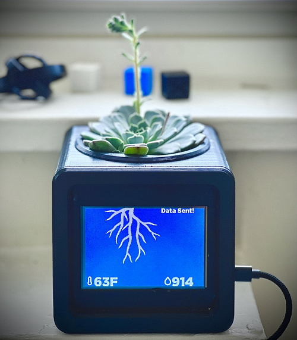](https://jegamboafuentes.medium.com/building-an-iot-flowerpot-from-scratch-bad9e6623f48)

This project is a cute IoT flowerpot that helps you tracking the basic measures needed to take care of your favorite plants such as water, moisture, and temperature levels. You can see the measures directly on the device or on the online dashboards. This DYI project uses a 3D printer and is powered by CircuitPython - [Medium](https://jegamboafuentes.medium.com/building-an-iot-flowerpot-from-scratch-bad9e6623f48) and [Vimeo](https://vimeo.com/631658610).

## CircuitPython Deep Dive Stream with Scott Shawcroft

[This week](https://youtu.be/3f13Jl72cL4), Scott streams his work on CircuitPython running "bare metal" on a Raspberry Pi 4.

You can see the latest video and past videos on the Adafruit YouTube channel under the Deep Dive playlist - [YouTube](https://www.youtube.com/playlist?list=PLjF7R1fz_OOXBHlu9msoXq2jQN4JpCk8A).

## CircuitPython Parsec

John Park’s CircuitPython Parsec: 

* boot.py - [Adafruit Blog](https://blog.adafruit.com/2021/10/14/john-parks-circuitpython-parsec-boot-py-adafruit-johnedgarpark-adafruit-circuitpython/) and [YouTube](https://youtu.be/d4Iitpnth5s).

Catch all the episodes in the [YouTube playlist](https://www.youtube.com/playlist?list=PLjF7R1fz_OOWFqZfqW9jlvQSIUmwn9lWr).

## News from around the web!

[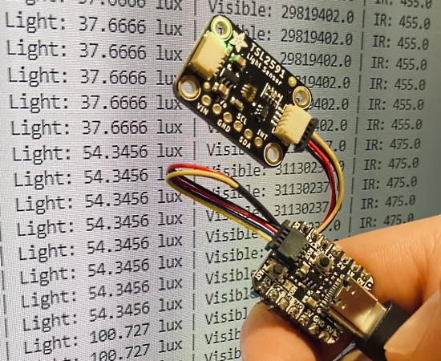](https://github.com/MarineNeuroLab/Light_sensor)

A simple, no solder light logging sensor with an Adafruit QT Py and CircuitPython - [GitHub](https://github.com/MarineNeuroLab/Light_sensor), [Twitter](https://twitter.com/marineneurolab/status/1449421925948792834?s=21) and [Adafruit Blog](https://blog.adafruit.com/2021/10/18/a-solderless-logging-light-meter-with-adafruit-parts-and-circuitpython-sensors-circuitpython-marineneurolab/).

[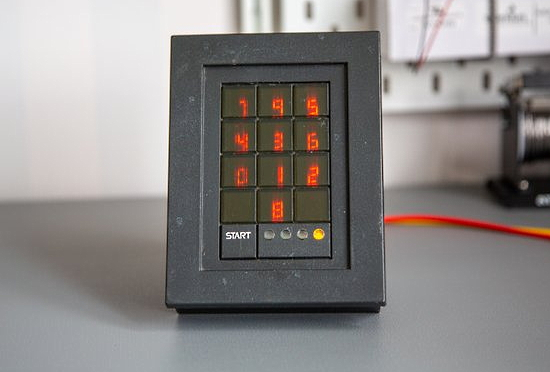](https://twitter.com/landberg/status/1449707391696650243)

Implemented PIO-based bitbanging for the Scramblepad protocol using CircuitPython on the Raspberry Pi Pico - [Twitter Thread](https://twitter.com/landberg/status/1449707391696650243).

[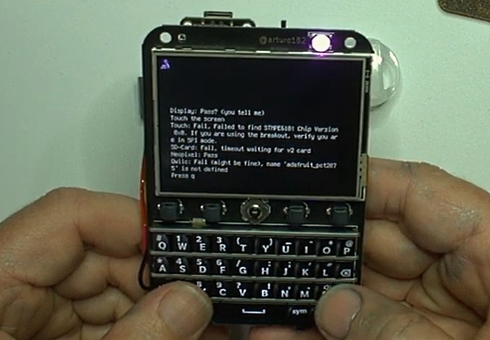](https://youtu.be/pVs20lEJR-8)

A CircuitPython / PyDOS / PyBasic handheld using a Feather RP2040 and Keyboard FeatherWing by arturo182/solderparty - [YouTube](https://youtu.be/pVs20lEJR-8) via [Twitter](https://twitter.com/RetiredWizardUS/status/1444126210355863553) and [GitHub](https://github.com/RetiredWizard/PyDOS/tree/Keyboard-FeatherWing).

[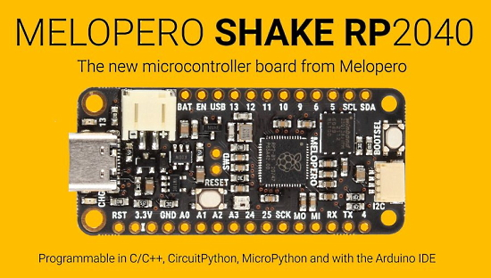](https://www.melopero.com/shop/development-boards/melopero-shake-rp2040/)

Melopero Shake RP2040, a new microcontroller board based on the Raspberry Pi RP2040! It features 16MB of flash memory, battery charger with low battery monitor, WS2812 rgb LED, Qwiic/Stemma QT connector, USB-C connector and more - [Milopero](https://www.melopero.com/shop/development-boards/melopero-shake-rp2040/) via [Twitter](https://twitter.com/MeloperoMakers/status/1448973733889253376).

[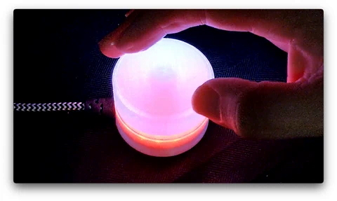](https://elmwoodelectronics.ca/blogs/news/we-made-a-media-controller)

A version of the QTPy-knob: a simple USB knob with CircuitPython and an Adafruit QT Py, a NeoPixel Ring, a Rotary Encoder and some 3D-printed parts. It's glowy and useful! - [Elmwood ELectronics](https://elmwoodelectronics.ca/blogs/news/we-made-a-media-controller).

[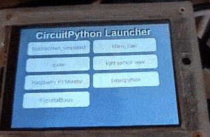](https://twitter.com/BeBoXoS/status/1448544606115803139)

> I made some progress on Basic for my Adafruit PyPortal Titano. It can read a light sensor, use NeoPixels, read touch screen, added a pause function. Need some work for sound etc. But the work is in progress - [Twitter](https://twitter.com/BeBoXoS/status/1448544606115803139).

Where does all the effort go? Looking at Python core developer activity - [Łukasz Langa](https://lukasz.langa.pl/f15a8851-af26-4e94-a4b1-c146c57c9d20/).

[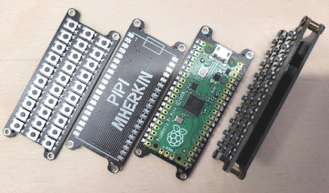](https://www.40percent.club/2021/10/pipi-mherkin.html)

The Micro Gherkin: the tiniest Pi Pico powered keypad. Both the switches and the Pi Pico are surface mounted, back to back - [40 Percent Club](https://www.40percent.club/2021/10/pipi-mherkin.html).

[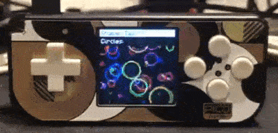](https://twitter.com/Gadgetoid/status/1448645816785113090)

MicroPython is being ported to the new Pimoroni PicoSystem - [Twitter Thread](https://twitter.com/Gadgetoid/status/1448645816785113090).

[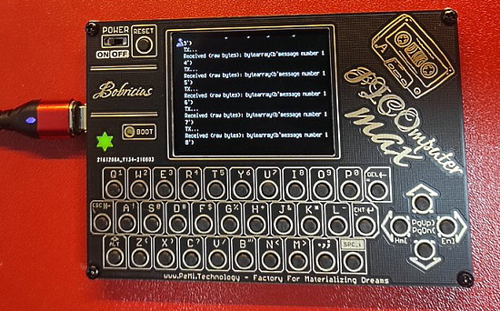](https://twitter.com/bobricius/status/1448413090949836806)

> First steps on Raspberry Pi Pico Picomputer PICO is now chip crisis resistant and with Adafruit CircuitPython. I am totally Python beginner but all Adafruit examples and libraries works without a problem ;) I am going to learn Python - [Twitter](https://twitter.com/bobricius/status/1448413090949836806).

[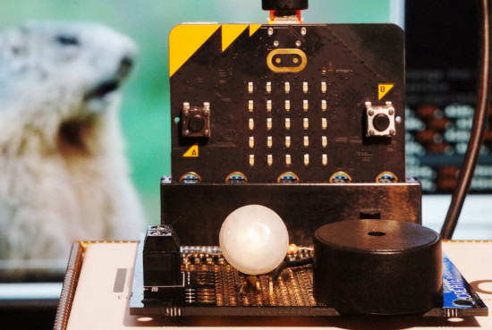](https://www.instructables.com/PIR-Movement-Alarm-With-BBC-Microbit-and-External-/)

A movement alarm made with a BBC micro:bit, a mini-PIR sensor module and an external speaker on a [Kitronik :CREATE Proto Board](https://kitronik.co.uk/products/5634-create-proto-board) with a MicroPython program which plays short audio samples - [Instructables](https://www.instructables.com/PIR-Movement-Alarm-With-BBC-Microbit-and-External-/).

text - [site](url).

text - [site](url).

text - [site](url).

text - [site](url).

QuecPython is Quectel’s port of MicroPython for cellular modules - [Adafruit Blog](https://blog.adafruit.com/2021/10/12/quecpython-is-quectels-port-of-micropython-for-modules/).

text - [site](url).

This MIT CS class teaches you things that all the other classes don't teach you, like...

* Shell tools and scripting
* Vim
* Data wrangling
* Command-line environment
* Version control

Watch all 11 lectures for free - [YouTube](https://www.youtube.com/watch?v=Z56Jmr9Z34Q&list=PLyzOVJj3bHQuloKGG59rS43e29ro7I57J&index=3) via [Twitter](https://twitter.com/MIT_CSAIL/status/1449043388314136583).

Conventional Commits - a specification for adding human and machine readable meaning to commit messages using GitHub Actions - [Conventional Commits](https://www.conventionalcommits.org/en/v1.0.0/) and [GitHub](https://github.com/bcoe/conventional-release-labels).

[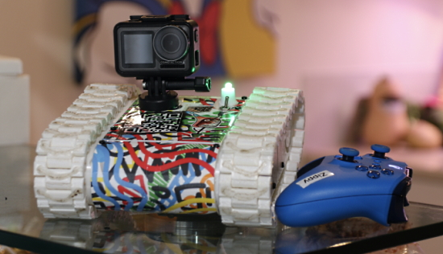](https://magpi.raspberrypi.com/articles/zippy)

Zippy is a treadded robot using an L298N H-bridge motor driver to operate 12 V high-torque metal gear motors, powered by an 11.4 V lithium polymer battery. It based around a Raspberry Pi Zero W programmed in Python - [The MagPi](https://magpi.raspberrypi.com/articles/zippy).

[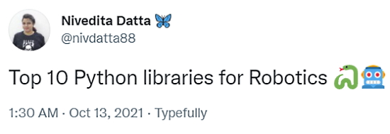](https://twitter.com/nivdatta88/status/1448159303135739904)

Top 10 Python libraries for Robotics - [Twitter](https://twitter.com/nivdatta88/status/1448159303135739904).

[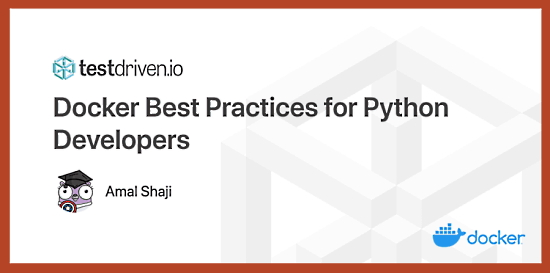](https://testdriven.io/blog/docker-best-practices/)

Docker Best Practices for Python Developers - [testdriven.io](https://testdriven.io/blog/docker-best-practices/).

String Formatting with the "old school" % Operator - [Reak Python](https://realpython.com/lessons/string-formatting-operator/) via [Twitter](https://twitter.com/realpython/status/1447623092143013895).

[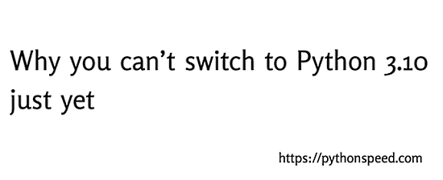](https://pythonspeed.com/articles/switch-python-3.10/)

Why you can’t switch to Python 3.10 just yet  - [Python Speed](https://pythonspeed.com/articles/switch-python-3.10/).

The Microsoft Python Discord Server - [Discord](https://t.co/MFz8Obc6Ax?amp=1) via [Twitter](https://twitter.com/pythonvscode/status/1449041478336925704).

A viable solution for Python concurrency - [lwn.net](https://lwn.net/SubscriberLink/872869/0e62bba2db51ec7a/) and [news.ycombinator.com](https://news.ycombinator.com/item?id=28880782).

#ICYDNCI What was the most popular, most clicked link, in [last week's newsletter](https://www.adafruitdaily.com/2021/10/12/python-on-microcontrollers-newsletter-python-reaches-1-3k-core-circuitpython-prs-and-much-more-python-adafruit-circuitpython-micropython-thepsf/)? [Python #1 on the TIOBE Index](https://www.tiobe.com/tiobe-index/).

## Coming soon

text - [site](url).

text - [site](url).

## New Boards Supported by CircuitPython

The number of supported microcontrollers and Single Board Computers (SBC) grows every week. This section outlines which boards have been included in CircuitPython or added to [CircuitPython.org](https://circuitpython.org/).

This week, there was one boards added:

- [Seeeduino XIAO - Keyboard Optimized](https://circuitpython.org/board/seeeduino_xiao_kb/)

Looking to add a new board to CircuitPython? It's highly encouraged! Adafruit has four guides to help you do so:

- [How to Add a New Board to CircuitPython](https://learn.adafruit.com/how-to-add-a-new-board-to-circuitpython/overview)
- [How to add a New Board to the circuitpython.org website](https://learn.adafruit.com/how-to-add-a-new-board-to-the-circuitpython-org-website)
- [Adding a Single Board Computer to PlatformDetect for Blinka](https://learn.adafruit.com/adding-a-single-board-computer-to-platformdetect-for-blinka)
- [Adding a Single Board Computer to Blinka](https://learn.adafruit.com/adding-a-single-board-computer-to-blinka)

## New Learn Guides!

[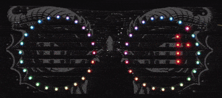](https://learn.adafruit.com/guides/latest)

[Adafruit EyeLights LED Glasses and Driver](https://learn.adafruit.com/adafruit-eyelights-led-glasses-and-driver) from [Kattni and Phil Burgess](https://learn.adafruit.com/users/kattni)

[Contribute to the Adafruit Learning System with Git and GitHub](https://learn.adafruit.com/contribute-to-the-adafruit-learning-system-with-git-and-github) from [Anne Barela](https://learn.adafruit.com/users/AnneBarela)

[Capturing Camera Images with CircuitPython](https://learn.adafruit.com/capturing-camera-images-with-circuitpython) from [Jeff Epler](https://learn.adafruit.com/users/jepler)

[OSHWA Project Display With Adafruit MagTag](https://learn.adafruit.com/oshwa-project-display-with-adafruit-magtag) from [Dylan Herrada](https://learn.adafruit.com/users/dherrada)

[Pico Four Keypad](https://learn.adafruit.com/pico-four-key-macropad) from [John Park](https://learn.adafruit.com/users/johnpark)

## CircuitPython Project Bundle

When you get to the CircuitPython code section of an [Adafruit Learn Guide](https://learn.adafruit.com/), sometimes things can get a bit complicated. You not only have the code you need to upload to your device, but you likely also need to add some libraries that the code requires to run. This involved downloading all the libraries, digging through to find the ones you need, and copying them to your device. That was only the beginning on some projects, as those that include images and/or sound files required further downloading and copying of files. But, not anymore!

Now, with Project Bundles, you can download all the necessary code, libraries and, if needed, asset files with one click! We automatically check which libraries are required for the project and bundle them up for you. No more digging through a huge list of libraries to find the ones you need, or fiddling with looking for other files or dependencies. Download the Project Bundle, copy the contents to your device, and your code will simply work. We wanted to make this the easiest way to get a project working, regardless of whether you're a beginner or an expert. We'll also be adding this feature to popular IDEs as an add-on. Try it out with any Circuit Python guide on the Adafruit Learning System. Just look for the ‘Download Project Bundle’ button on the code page. 

**To download and use a Project Bundle:**

In the Learning System - above any embedded code in a guide in the Adafruit Learn System, you’ll find a Download Project Bundle button.

Click the button to download the Project Bundle zip.

Open the Project Bundle zip to find the example code, all necessary libraries, and, if available, any images, sounds, etc.

Simply copy all the files over to your CIRCUITPY drive, and you’re ready to go!

If you run into any problems or bugs, or would like to submit feedback, please file an issue on the [Adafruit Learning System Guides GitHub repo](https://github.com/adafruit/Adafruit_Learning_System_Guides/issues).

## CircuitPython Libraries!

CircuitPython support for hardware continues to grow. We are adding support for new sensors and breakouts all the time, as well as improving on the drivers we already have. As we add more libraries and update current ones, you can keep up with all the changes right here!

For the latest libraries, download the [Adafruit CircuitPython Library Bundle](https://circuitpython.org/libraries). For the latest community contributed libraries, download the [CircuitPython Community Bundle](https://github.com/adafruit/CircuitPython_Community_Bundle/releases).

If you'd like to contribute, CircuitPython libraries are a great place to start. Have an idea for a new driver? File an issue on [CircuitPython](https://github.com/adafruit/circuitpython/issues)! Have you written a library you'd like to make available? Submit it to the [CircuitPython Community Bundle](https://github.com/adafruit/CircuitPython_Community_Bundle). Interested in helping with current libraries? Check out the [CircuitPython.org Contributing page](https://circuitpython.org/contributing). We've included open pull requests and issues from the libraries, and details about repo-level issues that need to be addressed. We have a guide on [contributing to CircuitPython with Git and Github](https://learn.adafruit.com/contribute-to-circuitpython-with-git-and-github) if you need help getting started. You can also find us in the #circuitpython channel on the [Adafruit Discord](https://adafru.it/discord).

You can check out this [list of all the Adafruit CircuitPython libraries and drivers available](https://github.com/adafruit/Adafruit_CircuitPython_Bundle/blob/master/circuitpython_library_list.md). 

The current number of CircuitPython libraries is **337**!

**New Libraries!**

Here's this week's new CircuitPython libraries:

 * [Adafruit_CircuitPython_OV5640](https://github.com/adafruit/Adafruit_CircuitPython_OV5640)

**Updated Libraries!**

Here's this week's updated CircuitPython libraries:

 * [Adafruit_CircuitPython_ATECC](https://github.com/adafruit/Adafruit_CircuitPython_ATECC)
 * [Adafruit_CircuitPython_ILI9341](https://github.com/adafruit/Adafruit_CircuitPython_ILI9341)
 * [Adafruit_CircuitPython_NTP](https://github.com/adafruit/Adafruit_CircuitPython_NTP)
 * [Adafruit_CircuitPython_ST7789](https://github.com/adafruit/Adafruit_CircuitPython_ST7789)
 * [Adafruit_CircuitPython_SSD1306](https://github.com/adafruit/Adafruit_CircuitPython_SSD1306)
 * [Adafruit_CircuitPython_NeoPixel](https://github.com/adafruit/Adafruit_CircuitPython_NeoPixel)
 * [Adafruit_CircuitPython_IS31FL3741](https://github.com/adafruit/Adafruit_CircuitPython_IS31FL3741)
 * [Adafruit_CircuitPython_seesaw](https://github.com/adafruit/Adafruit_CircuitPython_seesaw)

## What’s the team up to this week?

What is the team up to this week? Let’s check in!

**Dan**

I have gotten boot keyboard support to work in CircuitPython. It's necessary to turn off most or all of the other USB devices to ensure that HID is the first device interface listed. That matches the expectations of the BIOS and similar software. After some more testing on a Mac, I'll turn this into a PR.

My attempts at simplifying the Windows 7/8.1 drivers failed. Ideally, I'd like anything identifying as a CDC serial device to use the USB serial driver. That is what is built in to Windows 10. But as a third-party driver provider in Windows 7/8.1, I am not permitted to provide a "class driver", that is, a driver that matches all devices of a particular class. So instead I will automate the current manual process of adding boards to the Windows drivers.

**Jeff**

I've continued working on support for the OV5640 camera. After a few enhancements, refresh rate of the camera preview to the Kaluga's LCD display is over 15FPS, up from less than 2 a week ago.

**Kattni**

This week saw the publishing of the [Adafruit EyeLights LED Glasses and Driver guide](https://learn.adafruit.com/adafruit-eyelights-led-glasses-and-driver), which was a collaboration between me and our very own Dragon, Phil B. This guide has everything you need to get started with your EyeLights Driver and LED Glasses panel including detailed pinouts, CircuitPython and Arduino setup instructions for the driver, and a bunch of starter projects for the LED glasses. When you get your new LED Glasses and Driver, check out this guide!

Next up is the guide for the [ATtiny8x7 breakout with seesaw and STEMMA QT](https://www.adafruit.com/product/5233). This guide will have a number of examples for seesaw in both CircuitPython and Arduino, as well as look at the seesaw API. If you picked up one of these nifty little boards, keep an eye out for this guide!

**Melissa**

[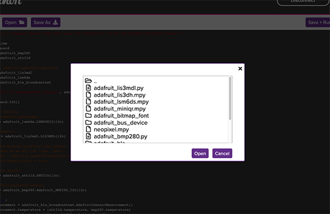](https://circuitpython.org/)

text

**Scott**

This week has been more plugging away at TinyUSB on the Raspberry Pi. I made good progress getting interrupts to work but then hit a wall getting USB itself going. I haven't been able to find clear examples of using the USB peripheral in device mode which has made it difficult to determine what I need to change. So, if you know anything about the broadcom chips and the DWC USB core please reach out to me.

In the meantime I've switched gears to getting CircuitPython going over UART. Hopefully it'll be in a good state once USB gets going and it'll be fast to put the two together.

## Upcoming events!

[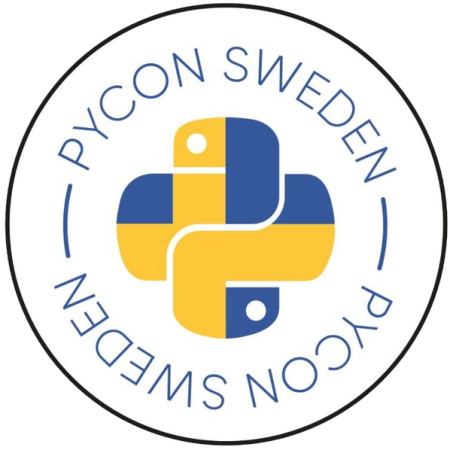](http://www.pycon.se/)

PyCon Sweden 2021 will be held on 21-22 October, online for free - [more](http://www.pycon.se/).

PyCon Chile is coming November 5, 6 and 7th online - one day of workshops and Sprints, two days of talks! - [more](https://pycon.cl/).

**Send Your Events In**

As for other events, with the COVID pandemic, most in-person events are postponed or cancelled. If you know of virtual events or events that may occur in the future, please let us know on Discord or on Twitter with hashtag #CircuitPython.

## Latest releases

CircuitPython's stable release is [#.#.#](https://github.com/adafruit/circuitpython/releases/latest) and its unstable release is [#.#.#-##.#](https://github.com/adafruit/circuitpython/releases). New to CircuitPython? Start with our [Welcome to CircuitPython Guide](https://learn.adafruit.com/welcome-to-circuitpython).

[2021####](https://github.com/adafruit/Adafruit_CircuitPython_Bundle/releases/latest) is the latest CircuitPython library bundle.

[v#.#.#](https://micropython.org/download) is the latest MicroPython release. Documentation for it is [here](http://docs.micropython.org/en/latest/pyboard/).

[#.#.#](https://www.python.org/downloads/) is the latest Python release. The latest pre-release version is [#.#.#](https://www.python.org/download/pre-releases/).

[2.621 Stars](https://github.com/adafruit/circuitpython/stargazers) Like CircuitPython? [Star it on GitHub!](https://github.com/adafruit/circuitpython)

## Call for help -- Translating CircuitPython is now easier than ever!

[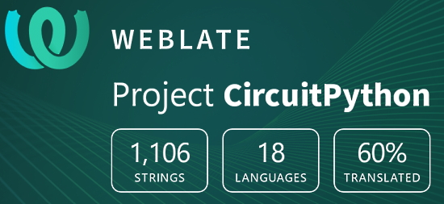](https://hosted.weblate.org/engage/circuitpython/)

One important feature of CircuitPython is translated control and error messages.

With the help of fellow open source project [Weblate](https://weblate.org/), we're making it even easier to add or improve translations.

Sign in with an existing account such as GitHub, Google or Facebook and start contributing through a simple web interface. No forks or pull requests needed!

As always, if you run into trouble join us on [Discord](https://adafru.it/discord), we're here to help.

## jobs.adafruit.com - Find a dream job, find great candidates!

[jobs.adafruit.com](https://jobs.adafruit.com/) has returned and folks are posting their skills (including CircuitPython) and companies are looking for talented makers to join their companies - from Digi-Key, to Hackaday, Micro Center, Raspberry Pi and more.

**Job of the Week**

Enrollment Director - Bluestamp Engineering - [Adafruit Jobs Board](https://jobs.adafruit.com/job/enrollment-director-3/).

## NUMBER thanks!

The Adafruit Discord community, where we do all our CircuitPython development in the open, reached over NUMBER humans, thank you!  Adafruit believes Discord offers a unique way for CircuitPython folks to connect. Join today at [https://adafru.it/discord](https://adafru.it/discord).

## ICYMI - In case you missed it

The wonderful world of Python on hardware! This is our Python video-newsletter-podcast! The news comes from the Python community, Discord, Adafruit communities and more and is reviewed on ASK an ENGINEER Wednesdays. The complete Python on Hardware weekly videocast [playlist is here](https://www.youtube.com/playlist?list=PLjF7R1fz_OOXRMjM7Sm0J2Xt6H81TdDev). 

This video podcast is on [iTunes](https://itunes.apple.com/us/podcast/python-on-hardware/id1451685192?mt=2), [YouTube](http://adafru.it/pohepisodes), [IGTV (Instagram TV](https://www.instagram.com/adafruit/channel/)), and [XML](https://itunes.apple.com/us/podcast/python-on-hardware/id1451685192?mt=2).

[Weekly community chat on Adafruit Discord server CircuitPython channel - Audio / Podcast edition](https://itunes.apple.com/us/podcast/circuitpython-weekly-meeting/id1451685016) - Audio from the Discord chat space for CircuitPython, meetings are usually Mondays at 2pm ET, this is the audio version on [iTunes](https://itunes.apple.com/us/podcast/circuitpython-weekly-meeting/id1451685016), Pocket Casts, [Spotify](https://adafru.it/spotify), and [XML feed](https://adafruit-podcasts.s3.amazonaws.com/circuitpython_weekly_meeting/audio-podcast.xml).

And lastly, we are working up a one-spot destination for all things podcast-able here - [podcasts.adafruit.com](https://podcasts.adafruit.com/)

## Codecademy "Learn Hardware Programming with CircuitPython"

Codecademy, an online interactive learning platform used by more than 45 million people, has teamed up with the leading manufacturer in STEAM electronics, Adafruit Industries, to create a coding course, "Learn Hardware Programming with CircuitPython". The course is now available in the [Codecademy catalog](https://www.codecademy.com/learn/learn-circuitpython?utm_source=adafruit&utm_medium=partners&utm_campaign=circuitplayground&utm_content=pythononhardwarenewsletter).

Python is a highly versatile, easy to learn programming language that a wide range of people, from visual effects artists in Hollywood to mission control at NASA, use to quickly solve problems. But you don’t need to be a rocket scientist to accomplish amazing things with it. This new course introduces programmers to Python by way of a microcontroller — CircuitPython — which is a Python-based programming language optimized for use on hardware.

CircuitPython’s hardware-ready design makes it easier than ever to program a variety of single-board computers, and this course gets you from no experience to working prototype faster than ever before. Codecademy’s interactive learning environment, combined with Adafruit's highly rated Circuit Playground Express, present aspiring hardware hackers with a never-before-seen opportunity to learn hardware programming seamlessly online.

Whether for those who are new to programming, or for those who want to expand their skill set to include physical computing, this course will have students getting familiar with Python and creating incredible projects along the way. By the end, students will have built their own bike lights, drum machine, and even a moisture detector that can tell when it's time to water a plant.

Visit Codecademy to access the [Learn Hardware Programming with CircuitPython](https://www.codecademy.com/learn/learn-circuitpython?utm_source=adafruit&utm_medium=partners&utm_campaign=circuitplayground&utm_content=pythononhardwarenewsletter) course and Adafruit to purchase a [Circuit Playground Express](https://www.adafruit.com/product/3333).

Codecademy has helped more than 45 million people around the world upgrade their careers with technology skills. The company’s online interactive learning platform is widely recognized for providing an accessible, flexible, and engaging experience for beginners and experienced programmers alike. Codecademy has raised a total of $43 million from investors including Union Square Ventures, Kleiner Perkins, Index Ventures, Thrive Capital, Naspers, Yuri Milner and Richard Branson, most recently raising its $30 million Series C in July 2016.

## Contribute!

The CircuitPython Weekly Newsletter is a CircuitPython community-run newsletter emailed every Tuesday. The complete [archives are here](https://www.adafruitdaily.com/category/circuitpython/). It highlights the latest CircuitPython related news from around the web including Python and MicroPython developments. To contribute, edit next week's draft [on GitHub](https://github.com/adafruit/circuitpython-weekly-newsletter/tree/gh-pages/_drafts) and [submit a pull request](https://help.github.com/articles/editing-files-in-your-repository/) with the changes. You may also tag your information on Twitter with #CircuitPython. 

Join our [Discord](https://adafru.it/discord) or [post to the forum](https://forums.adafruit.com/viewforum.php?f=60) for any further questions.
