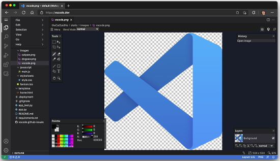
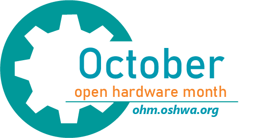
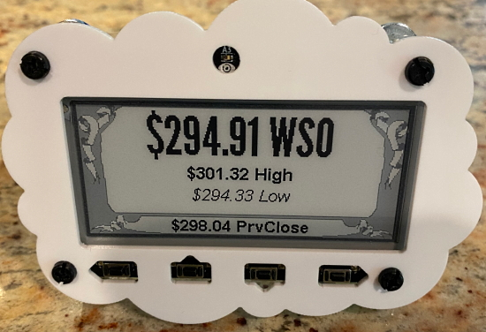
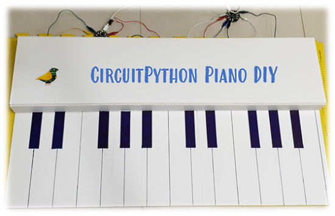
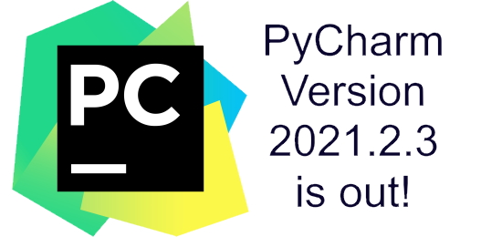
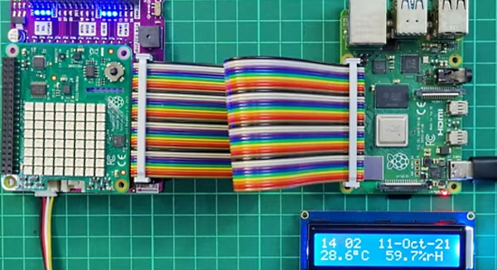
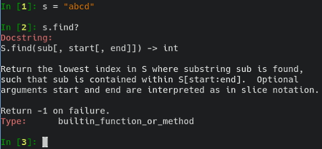
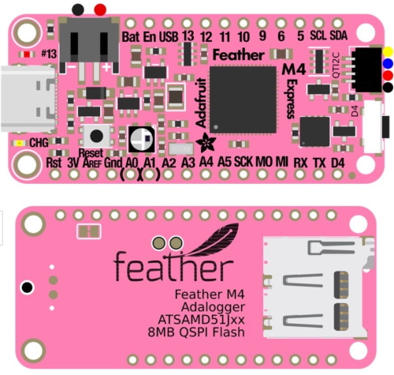
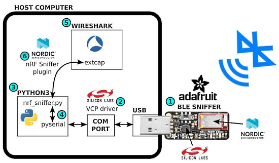

- [X] Kattni updates
- [ ] change date
- [ ] update title
- [ ] Feature story
- [ ] Update  for images
- [ ] Update ICYDNCI
- [ ] All images 550w max only
- [ ] Link "View this email in your browser."

News Sources

- [python.org](https://www.python.org/)
- [Python Insider - dev team blog](https://pythoninsider.blogspot.com/)

View this email in your browser.

Welcome to the latest Python on Microcontrollers newsletter, brought you by the community! We're on [Discord](https://discord.gg/HYqvREz), [Twitter](https://twitter.com/search?q=circuitpython&src=typed_query&f=live), and for past newsletters - [view them all here](https://www.adafruitdaily.com/category/circuitpython/). If you're reading this on the web, [subscribe here](https://www.adafruitdaily.com/). Let's get started!

## Headline Article

text - .

## Python Developer's Survey 2021

Join the Python Developers Survey 2021 - this year the PSF conducting the fifth iteration of the official Python Developers Survey. The goal is to capture the current state of the language and the ecosystem around it. By comparing the results with last year's, they can identify and share with everyone the hottest trends in the Python community and the key insights into them - [Survey Link](https://surveys.jetbrains.com/s3/c1-python-developers-survey-2021) and information via the [Python Software Foundation](https://pyfound.blogspot.com/2021/10/join-python-developers-survey-2021.html).

Also - do you now someone who should be a Python Software Foundation Fellow but isn't yet? Nominate them before November 20, 2021, and PSF will add them to the list for considering Q4 2021 fellows - [Nomination instructions](https://python.org/psf/fellows/). 

## vscode.dev Brings VS Code to the Browser

[vscode.dev](https://vscode.dev/) – bringing VS Code to the web with a lightweight version running fully in the browser. Open a folder on your local machine and start coding - [Announcement Post](https://code.visualstudio.com/blogs/2021/10/20/vscode-dev) and [Adafruit Blog](https://blog.adafruit.com/2021/10/21/vscode-dev-bringing-vs-code-to-the-browser-vscode-code/).

## Halloween Hackfest

**HURRY! Ends October 28 at 11:59PM PDT!** Join Hackaday, Digi-Key, and Adafruit for a Halloween-themed contest! They want to see your crazy, creepy, ghostly, spooky, and awesome projects. 

If costumes are your favorite part of Halloween, then why not dress up your outfit with some hacked upgrades? You could even design a ghoulish prop to add to your home’s Halloween decor or light up a Jack-o-lantern with LEDs. Whether it’s technical, artistic, or just plain terrifying, Hackaday wants to see your projects!

Check out the Halloween Show & Tell with Hackaday, Friday, October 29th at 1pm PT, to show off your awesome projects entered in the contest. Don't forget to also share your projects on social media and use the #HalloweenHackfest!

Hackaday and Digi-Key have partnered on this Halloween-themed contest to offer three winners an online shopping spree to the Digi-Key warehouse! - [Hackaday](https://hackaday.com/2021/08/10/new-contest-halloween-hackfest/) and [hackaday.io](https://hackaday.io/contest/180664-halloween-hackfest).

## Hacktoberfest Begins October 1st

Hosted by DigitalOcean for the 8th year in a row, Hacktoberfest encourages participation in giving back to the open source community by completing pull requests, participating in events, and donating to open source projects. 

Anyone around the globe who desires to help drive the growth of open source and make positive contributions to an ever-growing community. All backgrounds and skill levels are encouraged to participate. The first 55,000 participants can earn a T-shirt. Learn more - [DigitalOcean](https://hacktoberfest.digitalocean.com/).

For CircuitPython, edit [Good First Issues](https://circuitpython.org/contributing/open-issues?label=good-first-issue) and [open issues](https://circuitpython.org/contributing/open-issues). It is anticipated that the number of CircuitPython issues to work on will be higher this year.

# October is also Open Hardware Month 

October is Open Hardware Month! The Open Source Hardware Association (OSHWA) is providing resources and asking the community to host small, local events in the name of open source hardware. See more - [OSHWA](https://ohm.oshwa.org/).

## Feature

text - [site](url).

## CircuitPython Deep Dive Stream with Scott Shawcroft

[This week](https://youtu.be/XSMMpCXWFzg), Scott streams his work with CircuitPython on Raspberry Pi 4. He hets CircuitPython and the REPL to display on the Raspberry Pi HDMI port and working USB communications!

You can see the latest video and past videos on the Adafruit YouTube channel under the Deep Dive playlist - [YouTube](https://www.youtube.com/playlist?list=PLjF7R1fz_OOXBHlu9msoXq2jQN4JpCk8A).

## CircuitPython Parsec

John Park’s CircuitPython Parsec: 

* episode - [Adafruit Blog](url)

Catch all the episodes in the [YouTube playlist](https://www.youtube.com/playlist?list=PLjF7R1fz_OOWFqZfqW9jlvQSIUmwn9lWr).

## News from around the web!

CircuitPython I2S audio on an RP2040 enables this spooky doll to sing - [Twitter](https://twitter.com/jankmammal/status/1451263661197119488).

An animated scene made with the BBC micro:bit and Cytron EDU:BIT playing sound samples, moving a door with a micro servo and illuminating the scene with RGB pixels - [Instructables](https://www.instructables.com/Halloween-Spooky-Ghost-With-BBC-Microbit-on-Cytron/).

Itsy Bitsy Kawaii Bat with an Adafruit Itsy Bitsy and CircuitPython - [Twitter](https://twitter.com/caitlinsdad/status/1452460912389115906).

SparkFun flame necklace, using an Adafruit QTPy RP2040 + CircuitPython, flame code by todbot - [Adafruit Blog](https://blog.adafruit.com/2021/10/21/sparkfun-flame-necklace-qtpy-rp2040-circuitpython-armdevsummit-arm-alie_gg-geekmomprojects-todbot/).

MagTag Stock Tracker / Ticker - [GitHub](https://github.com/MarioCruz/MagTagStockTracker/) via [Twitter](https://twitter.com/mariocruz/status/1451979483611910145).

How I won the CircuitPython Challenge with a Piano - [Wokwi Blog](https://blog.wokwi.com/how-i-won-the-circuitpython-challenge-with-a-piano/) via [Twitter](https://twitter.com/gallaugher/status/1452596673142734849).

cPyBasic is a Circuitpython version of PyBasic for microcontrollers and has added a number of handy commands like NeoPixel use. It's being developed on an Adafruit PyPortal Titano - [GitHub](https://github.com/beboxos/cpybasic).

PyCharm 2021.2.3 is out, the third minor release of PyCharm 2021.2, containing multiple bug fixes - [PyCharm Blog](https://blog.jetbrains.com/pycharm/2021/10/2021-2-3/) and [Adafruit Blog](https://blog.adafruit.com/2021/10/21/pycharm-2021-2-3-is-out-python-pycharm/).

Maker HAT Base, combine HAT and modules on Raspberry Pi 4 with CircuitPython Blinka - [Cytron](https://tutorial.cytron.io/2021/10/20/maker-hat-base-combine-hat-and-modules-on-raspberry-pi-4/) and [YouTube](https://youtu.be/86Ea6nd4srA).

text - [site](url).

text - [site](url).

text - [site](url).

text - [site](url).

text - [site](url).

text - [site](url).

text - [site](url).

text - [site](url).

text - [site](url).

text - [site](url).

text - [site](url).

text - [site](url).

text - [site](url).

Attempting REPL-Driven Development in Python  - [Twitter](https://twitter.com/PythonWeekly/status/1450869525893767170).

pytube is a lightweight, dependency-free Python library (and command-line utility) for downloading YouTube Videos - [GitHub](https://github.com/pytube/pytube).

compatlib - easily write backwards-and-forwards compatible libraries in CPython - [GitHub](https://github.com/ttymck/compatlib).

**#ICYDNCI What was the most popular, most clicked link, in [last week's newsletter](https://link)? [title](url).**

## Coming soon

Adafruit is doing a little revision of the favorite [Feather M4](https://www.adafruit.com/product/3857) – with all the new things folks love from the last few years! From the RP2040 they’re borrowing the built-in STEMMA QT I2C port and 8MB QSPI flash. From the STM32 Feather, the bottom SD card slot. From the upcoming ESP32-S2 Feather, lower power usage by putting the I2C/SD/NeoPixel on disable-able power. Many still like the original Feather M4 but who doesn’t love a glow-up? Adafruit is gonna try this new PCB in pink. It also comes with USB-C.

> We are thinking of doing a RP2040 Adalogger as well, with an SD card, but only if a bunch of ya’ll want it, so make some noise if so - [Adafruit Blog](https://blog.adafruit.com/2021/10/23/feather-m4-adalogger-is-pretty-in-pink/).

arturo182 on Twitter is running a survey on interest in an RP2040 educational board and what types of peripherals should be available if one were to be made - [Twitter Thread](https://twitter.com/arturo182/status/1451155997670715393) and [Survey](https://docs.google.com/forms/d/e/1FAIpQLSc0E_Bgsp3DswVgb-N0V2Q9XoShaqNsLmo-Fjs8bdc--WsfJg/viewform).

Raspberry Pi has worked with LEGO to design the new Raspberry Pi Build HAT. Priced at $25, the Build HAT brings Raspberry Pi computing to LEGO elements: control LEGO Technic motors and sensors from a Raspberry Pi - [Raspberry Pi](https://www.raspberrypi.com/news/raspberry-pi-build-hat-lego-education/).

text - [site](url).

## New Boards Supported by CircuitPython

The number of supported microcontrollers and Single Board Computers (SBC) grows every week. This section outlines which boards have been included in CircuitPython or added to [CircuitPython.org](https://circuitpython.org/).

This week, there were (#/no) new boards added!

- [Board name](url)

Looking to add a new board to CircuitPython? It's highly encouraged! Adafruit has four guides to help you do so:

- [How to Add a New Board to CircuitPython](https://learn.adafruit.com/how-to-add-a-new-board-to-circuitpython/overview)
- [How to add a New Board to the circuitpython.org website](https://learn.adafruit.com/how-to-add-a-new-board-to-the-circuitpython-org-website)
- [Adding a Single Board Computer to PlatformDetect for Blinka](https://learn.adafruit.com/adding-a-single-board-computer-to-platformdetect-for-blinka)
- [Adding a Single Board Computer to Blinka](https://learn.adafruit.com/adding-a-single-board-computer-to-blinka)

## New Learn Guides!

[Adafruit ATtiny817 Breakout with seesaw](https://learn.adafruit.com/adafruit-attiny817-seesaw) from [Kattni](https://learn.adafruit.com/users/kattni)

## Updated Guides

The Introducing the [Adafruit Bluefruit LE Sniffer guide](https://learn.adafruit.com/introducing-the-adafruit-bluefruit-le-sniffer) was in much need of a refresh. The guide has been updated to show how to install and setup all the necessary software components. Luckily the Adafruit BLE Sniffer still works fine when using the latest versions of Wireshark, the Nordic plugin, and best of all – Python 3 - [Adafruit Blog](https://blog.adafruit.com/2021/10/22/updated-guide-introducing-the-adafruit-bluefruit-le-sniffer-adafruitlearningsystem-adafruit/).

## CircuitPython Project Bundle

When you get to the CircuitPython code section of an [Adafruit Learn Guide](https://learn.adafruit.com/), sometimes things can get a bit complicated. You not only have the code you need to upload to your device, but you likely also need to add some libraries that the code requires to run. This involved downloading all the libraries, digging through to find the ones you need, and copying them to your device. That was only the beginning on some projects, as those that include images and/or sound files required further downloading and copying of files. But, not anymore!

Now, with Project Bundles, you can download all the necessary code, libraries and, if needed, asset files with one click! We automatically check which libraries are required for the project and bundle them up for you. No more digging through a huge list of libraries to find the ones you need, or fiddling with looking for other files or dependencies. Download the Project Bundle, copy the contents to your device, and your code will simply work. We wanted to make this the easiest way to get a project working, regardless of whether you're a beginner or an expert. We'll also be adding this feature to popular IDEs as an add-on. Try it out with any Circuit Python guide on the Adafruit Learning System. Just look for the ‘Download Project Bundle’ button on the code page. 

**To download and use a Project Bundle:**

In the Learning System - above any embedded code in a guide in the Adafruit Learn System, you’ll find a Download Project Bundle button.

Click the button to download the Project Bundle zip.

Open the Project Bundle zip to find the example code, all necessary libraries, and, if available, any images, sounds, etc.

Simply copy all the files over to your CIRCUITPY drive, and you’re ready to go!

If you run into any problems or bugs, or would like to submit feedback, please file an issue on the [Adafruit Learning System Guides GitHub repo](https://github.com/adafruit/Adafruit_Learning_System_Guides/issues).

## CircuitPython Libraries!

CircuitPython support for hardware continues to grow. We are adding support for new sensors and breakouts all the time, as well as improving on the drivers we already have. As we add more libraries and update current ones, you can keep up with all the changes right here!

For the latest libraries, download the [Adafruit CircuitPython Library Bundle](https://circuitpython.org/libraries). For the latest community contributed libraries, download the [CircuitPython Community Bundle](https://github.com/adafruit/CircuitPython_Community_Bundle/releases).

If you'd like to contribute, CircuitPython libraries are a great place to start. Have an idea for a new driver? File an issue on [CircuitPython](https://github.com/adafruit/circuitpython/issues)! Have you written a library you'd like to make available? Submit it to the [CircuitPython Community Bundle](https://github.com/adafruit/CircuitPython_Community_Bundle). Interested in helping with current libraries? Check out the [CircuitPython.org Contributing page](https://circuitpython.org/contributing). We've included open pull requests and issues from the libraries, and details about repo-level issues that need to be addressed. We have a guide on [contributing to CircuitPython with Git and Github](https://learn.adafruit.com/contribute-to-circuitpython-with-git-and-github) if you need help getting started. You can also find us in the #circuitpython channel on the [Adafruit Discord](https://adafru.it/discord).

You can check out this [list of all the Adafruit CircuitPython libraries and drivers available](https://github.com/adafruit/Adafruit_CircuitPython_Bundle/blob/master/circuitpython_library_list.md). 

The current number of CircuitPython libraries is **337**!

**Updated Libraries!**

Here's this week's updated CircuitPython libraries:

 * [Adafruit_CircuitPython_OV5640](https://github.com/adafruit/Adafruit_CircuitPython_OV5640)
 * [Adafruit_CircuitPython_HID](https://github.com/adafruit/Adafruit_CircuitPython_HID)
 * [Adafruit_CircuitPython_IS31FL3741](https://github.com/adafruit/Adafruit_CircuitPython_IS31FL3741)
 * [Adafruit_CircuitPython_seesaw](https://github.com/adafruit/Adafruit_CircuitPython_seesaw)
 * [Adafruit_Blinka](https://github.com/adafruit/Adafruit_Blinka)
 * [Adafruit_Python_PlatformDetect](https://github.com/adafruit/Adafruit_Python_PlatformDetect)

## What’s the team up to this week?

What is the team up to this week? Let’s check in!

**Dan**

I fixed a PDMIn microphone bug on SAMD21, which was quite tricky to figure out. Thanks to Scott for talking through the possible causes.

A major focus of CircuitPython 8.0.0 will be support for cooperative multitasking, which is provided in regular Python by asyncio and similar packages. A subset of asyncio has already been implemented in MicroPython, and we might use that, or develop something similar.  A simple example is to blink two LEDs at different rates as independent tasks. Another example would be to interrupt and change a running NeoPixel animation with a button push, without having to check explicitly inside the animation code for the interrupt. Or, you might want to do other work while waiting for, an I2C device to respond or a network request to finish. I'll be spending time looking at this in more detail as we head toward 8.0.0.

**Jeff**

Last week I implemented the `watchdog` module for SAM D5x/E5x microcontrollers (it was already available on most of the other families). This allows the microcontroller to reset itself if something goes wrong in a CircuitPython program that stops it from executing

I have a clock that this happens to, but more no more often than once a month, so it's a tough problem to debug. If you have a project where "automatically resetting" is better than "getting lost & stuck", consider enabling a `watchdog` to automatically reset it when things go wrong.

**Kattni**

This week I published the [ATtiny817 Breakout guide](https://learn.adafruit.com/adafruit-attiny817-seesaw). This turned out to be a beefy one, with all the details about the [ATtiny817 breakout with seesaw and STEMMA QT](https://www.adafruit.com/product/5233). It has everything you need to know about seesaw in general, and specific details and examples in both CircuitPython and Arduino for the ATtiny817 breakout with seesaw. If you picked up one of these versatile little boards, and need help getting started, check out this guide!

I'm now updating the [Welcome to CircuitPython guide](https://learn.adafruit.com/welcome-to-circuitpython/overview). This guide has been around for quite a while now, and has gone through many additions over that time. Which has been excellent, but has also caused it to grow and left it a bit meandering. To that end, I'm working on updating and restructuring the guide to provide the best possible experience to those getting started with CircuitPython.

**Melissa**

This past week I finished up the file opening and saving dialogs and fixed any bugs that I came across. One particularly weird bug I came across was that it was writing random garbage to the files when saving them. I figured out it was only saving from a certain offset where the file was edited and anything before the offset was just whatever CircuitPython had in its memory. By changing it to write from the beginning of the file, it fixed the issue. The Code Editor is available at https://code.circuitpython.org/.

**Scott**

This week I hit a road block with TinyUSB on the Raspberry Pi so I switched to getting CircuitPython going over UART. I've made really good progress! I got the REPL working over UART and LEDs blinking. My next goal was to get displayio working over HDMI. That is the main reason I'm interested in getting CircuitPython going on the RPi. I spent all day yesterday poking at it only to realize I hadn't fully seated my compute module on the IO board! Such a simple mistake. Once I did that, I was able to advance the code past where I was stuck. So I'm unblocked.

Furthermore, it turns out that the USB pins are also on the same connector! So, I need to circle back to that and see how much is working. It'd be great to get both HDMI and USB working soon.

## Upcoming events!

PyCon Chile is coming November 5, 6 and 7th online - one day of workshops and Sprints, two days of talks! - [more](https://pycon.cl/).

RISC-V Summit brings the community together to show the power open collaboration can have on the processor industry. The audience spans across industries, organizations, workloads, and geographies to learn about the technology advancements in the RISC-V ecosystem and visibility of RISC-V successes. The event is December 6 – 8, in-person in San Francisco or virtually from anywhere in the world - [Linux Foundation](https://events.linuxfoundation.org/riscv-summit/register/) via [Twitter](https://twitter.com/risc_v/status/1449886188941238274).

PyCon US 2022 planning is underway. The team is planning to host the event in person with an online component. April 27, 2022 - May 5, 2022. Head over to the [PyCon US 2022 website](https://us.pycon.org/2022/) for details about the conference and more information about the sponsorship program - [PyCon Blog](https://pycon.blogspot.com/2021/10/pycon-us-2022-website-and-sponsorship.html).

**Send Your Events In**

As for other events, with the COVID pandemic, most in-person events are postponed or cancelled. If you know of virtual events or events that may occur in the future, please let us know on Discord or on Twitter with hashtag #CircuitPython.

## Latest releases

CircuitPython's stable release is [#.#.#](https://github.com/adafruit/circuitpython/releases/latest) and its unstable release is [#.#.#-##.#](https://github.com/adafruit/circuitpython/releases). New to CircuitPython? Start with our [Welcome to CircuitPython Guide](https://learn.adafruit.com/welcome-to-circuitpython).

[2021####](https://github.com/adafruit/Adafruit_CircuitPython_Bundle/releases/latest) is the latest CircuitPython library bundle.

[v#.#.#](https://micropython.org/download) is the latest MicroPython release. Documentation for it is [here](http://docs.micropython.org/en/latest/pyboard/).

[#.#.#](https://www.python.org/downloads/) is the latest Python release. The latest pre-release version is [#.#.#](https://www.python.org/download/pre-releases/).

[#### Stars](https://github.com/adafruit/circuitpython/stargazers) Like CircuitPython? [Star it on GitHub!](https://github.com/adafruit/circuitpython)

## Call for help -- Translating CircuitPython is now easier than ever!

One important feature of CircuitPython is translated control and error messages.

With the help of fellow open source project [Weblate](https://weblate.org/), we're making it even easier to add or improve translations.

Sign in with an existing account such as GitHub, Google or Facebook and start contributing through a simple web interface. No forks or pull requests needed!

As always, if you run into trouble join us on [Discord](https://adafru.it/discord), we're here to help.

## jobs.adafruit.com - Find a dream job, find great candidates!

[jobs.adafruit.com](https://jobs.adafruit.com/) has returned and folks are posting their skills (including CircuitPython) and companies are looking for talented makers to join their companies - from Digi-Key, to Hackaday, Micro Center, Raspberry Pi and more.

**Jobs of the Week**

Gameplay Programmer and other positions - Light Pong - [Adafruit Jobs Board](https://jobs.adafruit.com/).

## NUMBER thanks!

The Adafruit Discord community, where we do all our CircuitPython development in the open, reached over NUMBER humans, thank you!  Adafruit believes Discord offers a unique way for CircuitPython folks to connect. Join today at [https://adafru.it/discord](https://adafru.it/discord).

## ICYMI - In case you missed it

The wonderful world of Python on hardware! This is our Python video-newsletter-podcast! The news comes from the Python community, Discord, Adafruit communities and more and is reviewed on ASK an ENGINEER Wednesdays. The complete Python on Hardware weekly videocast [playlist is here](https://www.youtube.com/playlist?list=PLjF7R1fz_OOXRMjM7Sm0J2Xt6H81TdDev). 

This video podcast is on [iTunes](https://itunes.apple.com/us/podcast/python-on-hardware/id1451685192?mt=2), [YouTube](http://adafru.it/pohepisodes), [IGTV (Instagram TV](https://www.instagram.com/adafruit/channel/)), and [XML](https://itunes.apple.com/us/podcast/python-on-hardware/id1451685192?mt=2).

[Weekly community chat on Adafruit Discord server CircuitPython channel - Audio / Podcast edition](https://itunes.apple.com/us/podcast/circuitpython-weekly-meeting/id1451685016) - Audio from the Discord chat space for CircuitPython, meetings are usually Mondays at 2pm ET, this is the audio version on [iTunes](https://itunes.apple.com/us/podcast/circuitpython-weekly-meeting/id1451685016), Pocket Casts, [Spotify](https://adafru.it/spotify), and [XML feed](https://adafruit-podcasts.s3.amazonaws.com/circuitpython_weekly_meeting/audio-podcast.xml).

And lastly, we are working up a one-spot destination for all things podcast-able here - [podcasts.adafruit.com](https://podcasts.adafruit.com/)

## Contribute!

The CircuitPython Weekly Newsletter is a CircuitPython community-run newsletter emailed every Tuesday. The complete [archives are here](https://www.adafruitdaily.com/category/circuitpython/). It highlights the latest CircuitPython related news from around the web including Python and MicroPython developments. To contribute, edit next week's draft [on GitHub](https://github.com/adafruit/circuitpython-weekly-newsletter/tree/gh-pages/_drafts) and [submit a pull request](https://help.github.com/articles/editing-files-in-your-repository/) with the changes. You may also tag your information on Twitter with #CircuitPython. 

Join our [Discord](https://adafru.it/discord) or [post to the forum](https://forums.adafruit.com/viewforum.php?f=60) for any further questions.
