- [X] Kattni updates
- [ ] change date
- [ ] update title
- [ ] Feature story
- [ ] Update  for images
- [ ] Update ICYDNCI
- [ ] All images 550w max only
- [ ] Link "View this email in your browser."

News Sources

- [python.org](https://www.python.org/)
- [Python Insider - dev team blog](https://pythoninsider.blogspot.com/)

Template last updated on 2021-11-02 adjust events again

View this email in your browser.

Welcome to the latest Python on Microcontrollers newsletter, brought you by the community! We're on [Discord](https://discord.gg/HYqvREz), [Twitter](https://twitter.com/search?q=circuitpython&src=typed_query&f=live), and for past newsletters - [view them all here](https://www.adafruitdaily.com/category/circuitpython/). If you're reading this on the web, [subscribe here](https://www.adafruitdaily.com/). Let's get started!

## Headline Article

text - [site](url).

## CircuitPython Course: Connecting a Robot Cat to the Internet

[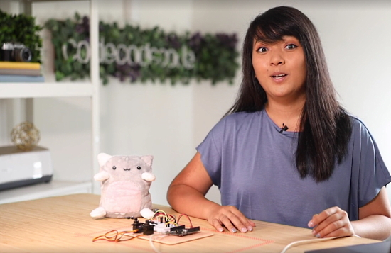](https://www.linkedin.com/learning/circuitpython-connecting-a-robot-cat-to-the-internet)

In a new LinkedIn Learning course, Charlyn Gonda shows you how to use CircuitPython — a version of Python specifically for microcontrollers — to program a robot cat that reacts to events while connected to the internet. Charlyn shows how to code for common hardware devices like LEDs and servos, and explains a common messaging protocol for IoT projects called message queue telemetry transport, or MQTT. If you’re looking for an internet cat video that actually teaches you something useful, join Charlyn as she shows how to program this robot cat.

Main Course Page - [LinkedIn](https://www.linkedin.com/learning/circuitpython-connecting-a-robot-cat-to-the-internet).

The course is $34.99 after the intro chapters. But, Charlyn notes "I found a way to share it for free! If anyone with a linked in account [clicks the link inside this post](https://www.linkedin.com/posts/charlyn-g_if-youd-like-to-dip-your-toes-into-the-wonderful-activity-6862139656771923968-I7jl), they'll be able to access it for 24 hours from the time that they click the link".

## Feature

text - [site](url).

## “Bare metal” CircuitPython on a Raspberry Pi, HDMI, and e-ink

Scott is working on a port of CircuitPython that runs on “bare metal” on the Raspberry Pi (i.e. runs on the Pi without the Linux operating system). So of course Ladyada wanted to see what works with HDMI since the REPL is available… and she happen to have an e-ink HDMI display. It’s AWESOME.

One of the plans is to make a little computer with a keyboard, that is just CircuitPython. Write code, make art … with HDMI, have the output go to a little portable projector… kids could make cool kaleidoscopes, or make a Haiku computer that shows the last one made when the power is off since this one is e-ink - [Adafruit Blog](https://blog.adafruit.com/2021/11/02/bare-metal-circuitpython-on-a-raspberry-pi-hdmi-and-e-ink/) and [YouTube](https://youtu.be/n0HsC9ctNmM).

## CircuitPython Deep Dive Stream with Scott Shawcroft

[This week](link), Scott streams his work on .

You can see the latest video and past videos on the Adafruit YouTube channel under the Deep Dive playlist - [YouTube](https://www.youtube.com/playlist?list=PLjF7R1fz_OOXBHlu9msoXq2jQN4JpCk8A).

## CircuitPython Parsec

John Park’s CircuitPython Parsec: 

* episode - [Adafruit Blog](url)

Catch all the episodes in the [YouTube playlist](https://www.youtube.com/playlist?list=PLjF7R1fz_OOWFqZfqW9jlvQSIUmwn9lWr).

## News from around the web!

[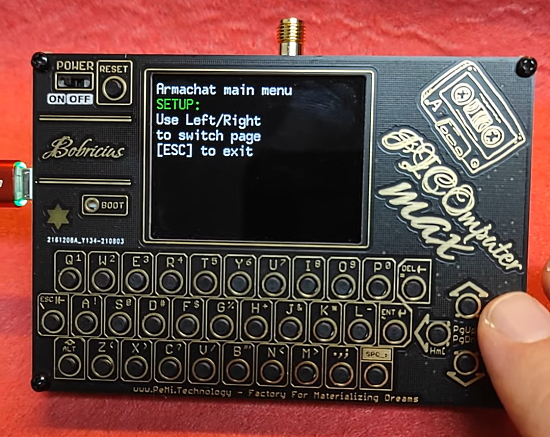](https://blog.adafruit.com/2021/11/03/the-armchat-lora-communicator-based-on-the-raspberry-pi-pico-picomputer-circuitpython-bobricius/)

Armachat is a “doomsday” wireless messenger with LoRa radio reception. The latest versions are based on the Picomputer form factor, based on Raspberry Pi Pico RP2040 and LoRa RFM95 radio module. It uses a CircuitPython user interface - [Twitter](https://twitter.com/bobricius/status/1455308535135444996?s=21) and [Adafruit Blog](https://blog.adafruit.com/2021/11/03/the-armchat-lora-communicator-based-on-the-raspberry-pi-pico-picomputer-circuitpython-bobricius/).

[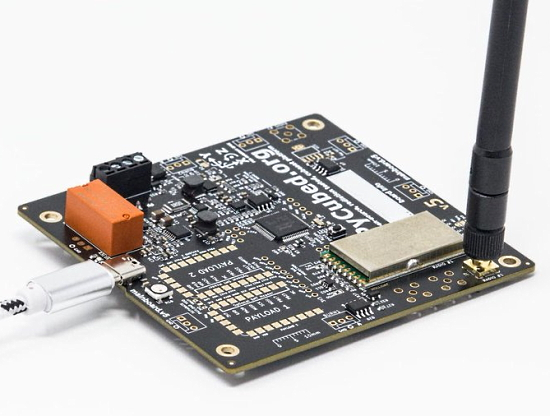](https://twitter.com/maholli404/status/1455362880925171717)

Doctoral candidate Max Holliday writes on Twitter about using CircuitPython on satellites:

> I love CircuitPython – enough to even run my on-orbit PyCubed satellites with it – and now that my deep sleep code for D/E51 boards is in the main branch, the possibilities are endless!  Now all your Adafruit M4 projects can last forever sipping 0.5mA - [Twitter](https://twitter.com/maholli404/status/1455362880925171717) and [Adafruit Blog](https://blog.adafruit.com/2021/11/02/circuitpython-used-to-run-satellites-with-deep-sleep-mode-circuitpython-space-maholli404/).

[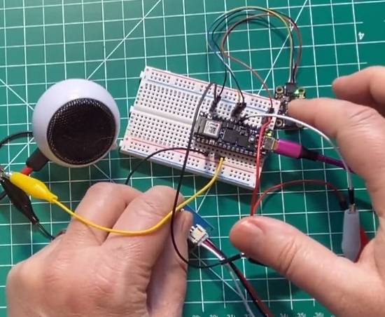](https://twitter.com/gallaugher/status/1456313506488373258)

> Among Physical Computing challenges today will be “create a CircuitPython pseudo theremin” using an Arduino RP2040 + proximity input from an Adafruit STEMMA-QT APDS9960 and a potentiometer - [Twitter](https://twitter.com/gallaugher/status/1456313506488373258).

[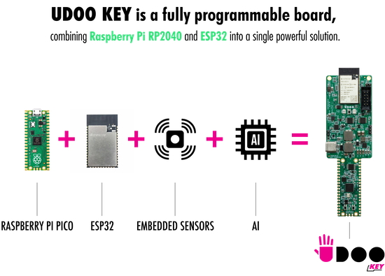](https://www.kickstarter.com/projects/udoo/udoo-key-the-4-ai-platform)

The UDOO KEY is a fully programmable Raspberry Pi RP2040 + ESP32 microcontroller with Wi-Fi, Bluetooth and Bluetooth Low Energy. It also gives you access to an AI platform, Clea, with pre-trained AI models. Both microcontrollers can be programmed using different environments, such as TinyML, TensorFlow Lite, MicroPython, C/C++, and more - [Kickstarter](https://www.kickstarter.com/projects/udoo/udoo-key-the-4-ai-platform).

[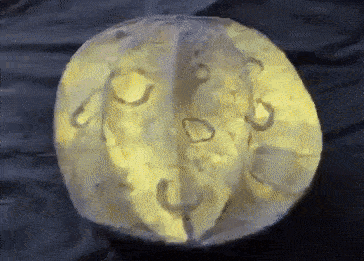](https://www.instructables.com/Wheel-of-Cheese-Moon-Phase-Lamp/)

Wheel of Cheese Moon Phase Lamp with CircuitPython on an Adafruit Circuit Playground Express - [Instructables](https://www.instructables.com/Wheel-of-Cheese-Moon-Phase-Lamp/) via [Twitter](https://twitter.com/caitlinsdad/status/1382782128862167041).

text - [site](url).

text - [site](url).

text - [site](url).

text - [site](url).

[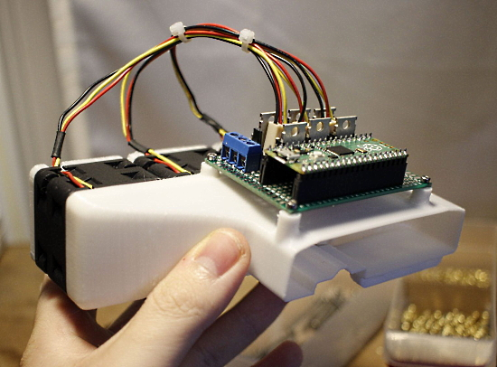](https://www.esologic.com/tesla-cooler/)

A high performance GPU cooler for the NVIDIA Tesla K80 with Raspberry Pi Pico and MicroPython- [esologic](https://www.esologic.com/tesla-cooler/).

Students use a Raspberry Pi Pico with MicroPython to write text and graphics to an OLED display following a [Tom's Hardware tutorial](https://www.tomshardware.com/uk/how-to/oled-display-raspberry-pi-pico) - [Twitter](https://twitter.com/heeedt/status/1456683997719932930).

text - [site](url).

text - [site](url).

[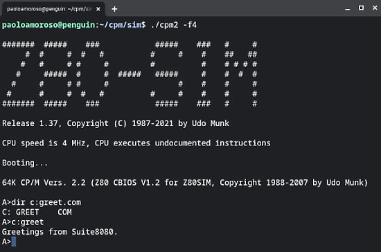](https://blog.paoloamoroso.com/2021/11/an-intel-8080-assembly-suite-in-python.html)

An Intel 8080 Assembly Suite in Python - [Paolo Amoroso](https://blog.paoloamoroso.com/2021/11/an-intel-8080-assembly-suite-in-python.html).

An oral history of Bank Python - the strange world of Python, as used by big investment banks - [Cal Paterson](https://calpaterson.com/bank-python.html).

text - [site](url).

text - [site](url).

text - [site](url).

[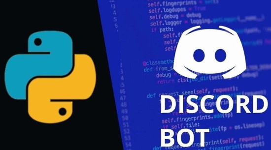](https://pythonawesome.com/a-custom-discord-bot-maker-in-python/)

Two guides on how to make custom Discord bots in Python - [Python Awesome](https://pythonawesome.com/a-custom-discord-bot-maker-in-python/) and [Better Programming](https://betterprogramming.pub/how-to-make-discord-bot-commands-in-python-2cae39cbfd55).

[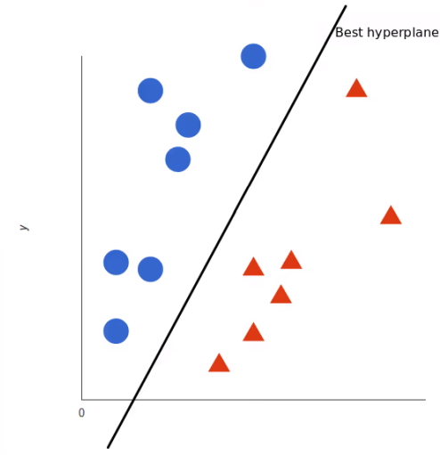](https://blog.logrocket.com/email-spam-detector-python-machine-learning/)

Build a machine learning email spam detector with Python - [LogRocket](https://blog.logrocket.com/email-spam-detector-python-machine-learning/) vcia [Twitter](https://twitter.com/Python_News/status/1456313270026084354).

[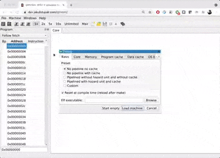](https://twitter.com/i_grr/status/1455918873547522052?t=nH12JzbGBQD48gBYHV8JFQ&s=03)

A new education-focused RISC-V simulator: qtrvsim. It lets you visualise what is happening in single stage and pipelined CPUs running RISC-V code. And there is also a webassembly port, so it runs in the browser! - [Twitter](https://twitter.com/i_grr/status/1455918873547522052?t=nH12JzbGBQD48gBYHV8JFQ&s=03) and [web simulator](https://dev.jakubdupak.com/qtrvsim/).

A blog post on why it's important to contribute to good documentation also - [Network to Code](https://blog.networktocode.com/post/show-us-the-bugs/).

**#ICYDNCI What was the most popular, most clicked link, in [last week's newsletter](https://link)? [title](url).**

## Coming soon

[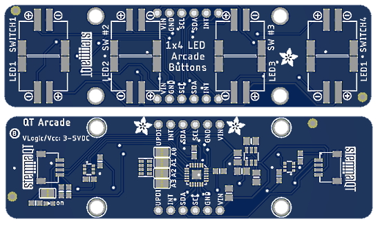](https://blog.adafruit.com/2021/11/04/4x-led-arcade-rev-b-attiny8x7-version/)

4x LED Arcade rev B (ATtiny8x7 version) - [Adafruit Blog](https://blog.adafruit.com/2021/11/04/4x-led-arcade-rev-b-attiny8x7-version/).

[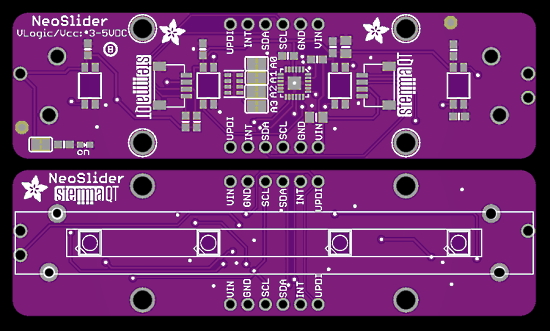](https://twitter.com/adafruit/status/1455662736000565261)

Final render and check of NeoSlider Stemma QT board before ordering this new design. It's a I2C Slide Pot + NeoPixel board - [Twitter](https://twitter.com/adafruit/status/1455662736000565261) and [Adafruit Blog](https://blog.adafruit.com/2021/11/02/final-render-of-neoslider-stemma-qt-board-before-ordering/).

> The brains of the CutiePi #RaspberryPi CM4-based tablet. Looks like there are extra unused interfaces too! I'm working on a preview of this new RPi tablet for next week. It's the best Pi-based tablet I've used—but it's still no iPad! - [Twitter](https://twitter.com/geerlingguy/status/1456322500816629761).

text - [site](url).

## New Boards Supported by CircuitPython

The number of supported microcontrollers and Single Board Computers (SBC) grows every week. This section outlines which boards have been included in CircuitPython or added to [CircuitPython.org](https://circuitpython.org/).

This week, there were (#/no) new boards added!

- [Board name](url)

Looking to add a new board to CircuitPython? It's highly encouraged! Adafruit has four guides to help you do so:

- [How to Add a New Board to CircuitPython](https://learn.adafruit.com/how-to-add-a-new-board-to-circuitpython/overview)
- [How to add a New Board to the circuitpython.org website](https://learn.adafruit.com/how-to-add-a-new-board-to-the-circuitpython-org-website)
- [Adding a Single Board Computer to PlatformDetect for Blinka](https://learn.adafruit.com/adding-a-single-board-computer-to-platformdetect-for-blinka)
- [Adding a Single Board Computer to Blinka](https://learn.adafruit.com/adding-a-single-board-computer-to-blinka)

## New Learn Guides!

[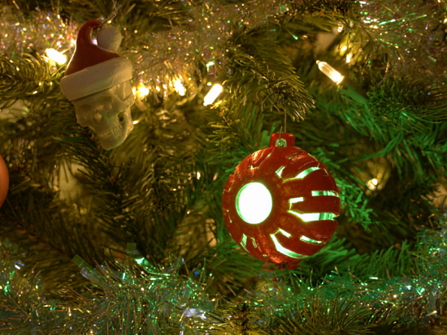](https://learn.adafruit.com/guides/latest)

[Green Goblin Pumpkin CPB Ornament](https://learn.adafruit.com/green-goblin-pumpkin-cpb-ornament) from [Noe and Pedro](https://learn.adafruit.com/users/pixil3d)

[Clue And MagTag Pep Talk Generator](https://learn.adafruit.com/clue-and-magtag-pep-talk-generator) from [Dylan Herrada](https://learn.adafruit.com/users/dherrada)

[Adafruit VL53L1X Time of Flight Distance Sensor](https://learn.adafruit.com/adafruit-vl53l1x) from [Kattni](https://learn.adafruit.com/users/kattni)

## CircuitPython Project Bundle

When you get to the CircuitPython code section of an [Adafruit Learn Guide](https://learn.adafruit.com/), sometimes things can get a bit complicated. You not only have the code you need to upload to your device, but you likely also need to add some libraries that the code requires to run. This involved downloading all the libraries, digging through to find the ones you need, and copying them to your device. That was only the beginning on some projects, as those that include images and/or sound files required further downloading and copying of files. But, not anymore!

Now, with Project Bundles, you can download all the necessary code, libraries and, if needed, asset files with one click! We automatically check which libraries are required for the project and bundle them up for you. No more digging through a huge list of libraries to find the ones you need, or fiddling with looking for other files or dependencies. Download the Project Bundle, copy the contents to your device, and your code will simply work. We wanted to make this the easiest way to get a project working, regardless of whether you're a beginner or an expert. We'll also be adding this feature to popular IDEs as an add-on. Try it out with any Circuit Python guide on the Adafruit Learning System. Just look for the ‘Download Project Bundle’ button on the code page. 

**To download and use a Project Bundle:**

In the Learning System - above any embedded code in a guide in the Adafruit Learn System, you’ll find a Download Project Bundle button.

Click the button to download the Project Bundle zip.

Open the Project Bundle zip to find the example code, all necessary libraries, and, if available, any images, sounds, etc.

Simply copy all the files over to your CIRCUITPY drive, and you’re ready to go!

If you run into any problems or bugs, or would like to submit feedback, please file an issue on the [Adafruit Learning System Guides GitHub repo](https://github.com/adafruit/Adafruit_Learning_System_Guides/issues).

## CircuitPython Libraries!

CircuitPython support for hardware continues to grow. We are adding support for new sensors and breakouts all the time, as well as improving on the drivers we already have. As we add more libraries and update current ones, you can keep up with all the changes right here!

For the latest libraries, download the [Adafruit CircuitPython Library Bundle](https://circuitpython.org/libraries). For the latest community contributed libraries, download the [CircuitPython Community Bundle](https://github.com/adafruit/CircuitPython_Community_Bundle/releases).

If you'd like to contribute, CircuitPython libraries are a great place to start. Have an idea for a new driver? File an issue on [CircuitPython](https://github.com/adafruit/circuitpython/issues)! Have you written a library you'd like to make available? Submit it to the [CircuitPython Community Bundle](https://github.com/adafruit/CircuitPython_Community_Bundle). Interested in helping with current libraries? Check out the [CircuitPython.org Contributing page](https://circuitpython.org/contributing). We've included open pull requests and issues from the libraries, and details about repo-level issues that need to be addressed. We have a guide on [contributing to CircuitPython with Git and Github](https://learn.adafruit.com/contribute-to-circuitpython-with-git-and-github) if you need help getting started. You can also find us in the #circuitpython channel on the [Adafruit Discord](https://adafru.it/discord).

You can check out this [list of all the Adafruit CircuitPython libraries and drivers available](https://github.com/adafruit/Adafruit_CircuitPython_Bundle/blob/master/circuitpython_library_list.md). 

The current number of CircuitPython libraries is **340**!

**Updated Libraries!**

Here's this week's updated CircuitPython libraries:

 * [Adafruit_CircuitPython_PCF8523](https://github.com/adafruit/Adafruit_CircuitPython_PCF8523)
 * [Adafruit_CircuitPython_ESP_ATcontrol](https://github.com/adafruit/Adafruit_CircuitPython_ESP_ATcontrol)
 * [Adafruit_CircuitPython_AzureIoT](https://github.com/adafruit/Adafruit_CircuitPython_AzureIoT)
 * [Adafruit_CircuitPython_VEML7700](https://github.com/adafruit/Adafruit_CircuitPython_VEML7700)
 * [Adafruit_CircuitPython_GPS](https://github.com/adafruit/Adafruit_CircuitPython_GPS)
 * [Adafruit_CircuitPython_ADS1x15](https://github.com/adafruit/Adafruit_CircuitPython_ADS1x15)
 * [Adafruit_CircuitPython_DS3231](https://github.com/adafruit/Adafruit_CircuitPython_DS3231)
 * [Adafruit_CircuitPython_DHT](https://github.com/adafruit/Adafruit_CircuitPython_DHT)
 * [Adafruit_CircuitPython_Logging](https://github.com/adafruit/Adafruit_CircuitPython_Logging)
 * [Adafruit_CircuitPython_ST7735R](https://github.com/adafruit/Adafruit_CircuitPython_ST7735R)
 * [Adafruit_CircuitPython_PM25](https://github.com/adafruit/Adafruit_CircuitPython_PM25)
 * [Adafruit_CircuitPython_WSGI](https://github.com/adafruit/Adafruit_CircuitPython_WSGI)
 * [Adafruit_CircuitPython_74HC595](https://github.com/adafruit/Adafruit_CircuitPython_74HC595)
 * [Adafruit_CircuitPython_HT16K33](https://github.com/adafruit/Adafruit_CircuitPython_HT16K33)
 * [Adafruit_CircuitPython_SSD1305](https://github.com/adafruit/Adafruit_CircuitPython_SSD1305)
 * [Adafruit_CircuitPython_Waveform](https://github.com/adafruit/Adafruit_CircuitPython_Waveform)
 * [Adafruit_CircuitPython_WS2801](https://github.com/adafruit/Adafruit_CircuitPython_WS2801)
 * [Adafruit_CircuitPython_AM2320](https://github.com/adafruit/Adafruit_CircuitPython_AM2320)
 * [Adafruit_CircuitPython_Display_Notification](https://github.com/adafruit/Adafruit_CircuitPython_Display_Notification)
 * [Adafruit_CircuitPython_LED_Animation](https://github.com/adafruit/Adafruit_CircuitPython_LED_Animation)
 * [Adafruit_Python_PlatformDetect](https://github.com/adafruit/Adafruit_Python_PlatformDetect)
 * [CircuitPython_Community_Bundle](https://github.com/adafruit/CircuitPython_Community_Bundle)

## What’s the team up to this week?

What is the team up to this week? Let’s check in!

**Dan**

text

**Jeff**

In your CIRCUITPY drive, the file `boot_out.txt` holds information about the board & CircuitPython version. Thanks to my pull request (recently merged, to appear in CircuitPython 7.1), this file will now include the text written by the board's `boot.py` initialization code (up to 512 bytes), and only be rewritten when it changes, both of which were long intended but never quite worked that way.

**Kattni**

text

**Melissa**

[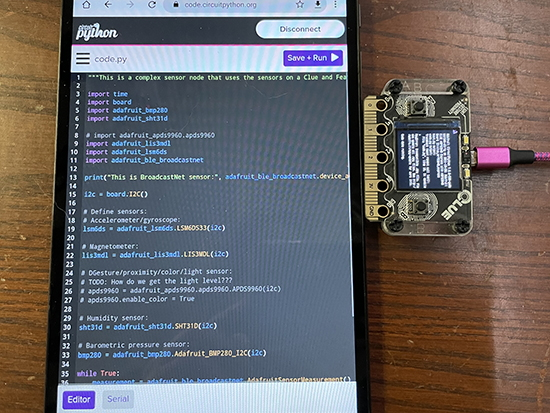](https://circuitpython.org/)

text

**Scott**

text

## Upcoming events!

RISC-V Summit brings the community together to show the power open collaboration can have on the processor industry. The audience spans across industries, organizations, workloads, and geographies to learn about the technology advancements in the RISC-V ecosystem and visibility of RISC-V successes. The event is December 6 – 8, in-person in San Francisco or virtually from anywhere in the world - [Linux Foundation](https://events.linuxfoundation.org/riscv-summit/register/) via [Twitter](https://twitter.com/risc_v/status/1449886188941238274).

PyCon US 2022 planning is underway. The team is planning to host the event in person with an online component. April 27, 2022 - May 5, 2022. Head over to the [PyCon US 2022 website](https://us.pycon.org/2022/) for details about the conference and more information about the sponsorship program - [PyCon Blog](https://pycon.blogspot.com/2021/10/pycon-us-2022-website-and-sponsorship.html).

**Send Your Events In**

As for other events, with the COVID pandemic, most in-person events are postponed or cancelled. If you know of virtual events or events that may occur in the future, please let us know on Discord or on Twitter with hashtag #CircuitPython.

## Latest releases

CircuitPython's stable release is [#.#.#](https://github.com/adafruit/circuitpython/releases/latest) and its unstable release is [#.#.#-##.#](https://github.com/adafruit/circuitpython/releases). New to CircuitPython? Start with our [Welcome to CircuitPython Guide](https://learn.adafruit.com/welcome-to-circuitpython).

[2021####](https://github.com/adafruit/Adafruit_CircuitPython_Bundle/releases/latest) is the latest CircuitPython library bundle.

[v#.#.#](https://micropython.org/download) is the latest MicroPython release. Documentation for it is [here](http://docs.micropython.org/en/latest/pyboard/).

[#.#.#](https://www.python.org/downloads/) is the latest Python release. The latest pre-release version is [#.#.#](https://www.python.org/download/pre-releases/).

[#### Stars](https://github.com/adafruit/circuitpython/stargazers) Like CircuitPython? [Star it on GitHub!](https://github.com/adafruit/circuitpython)

## Call for help -- Translating CircuitPython is now easier than ever!

[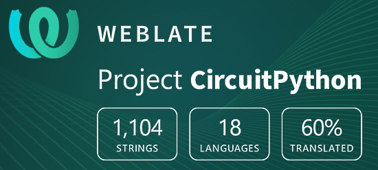](https://hosted.weblate.org/engage/circuitpython/)

One important feature of CircuitPython is translated control and error messages.

With the help of fellow open source project [Weblate](https://weblate.org/), we're making it even easier to add or improve translations.

Sign in with an existing account such as GitHub, Google or Facebook and start contributing through a simple web interface. No forks or pull requests needed!

As always, if you run into trouble join us on [Discord](https://adafru.it/discord), we're here to help.

## jobs.adafruit.com - Find a dream job, find great candidates!

[jobs.adafruit.com](https://jobs.adafruit.com/) has returned and folks are posting their skills (including CircuitPython) and companies are looking for talented makers to join their companies - from Digi-Key, to Hackaday, Micro Center, Raspberry Pi and more.

**Job of the Week**

text - [Adafruit Jobs Board](https://jobs.adafruit.com/).

## NUMBER thanks!

The Adafruit Discord community, where we do all our CircuitPython development in the open, reached over NUMBER humans, thank you!  Adafruit believes Discord offers a unique way for CircuitPython folks to connect. Join today at [https://adafru.it/discord](https://adafru.it/discord).

## ICYMI - In case you missed it

The wonderful world of Python on hardware! This is our Python video-newsletter-podcast! The news comes from the Python community, Discord, Adafruit communities and more and is reviewed on ASK an ENGINEER Wednesdays. The complete Python on Hardware weekly videocast [playlist is here](https://www.youtube.com/playlist?list=PLjF7R1fz_OOXRMjM7Sm0J2Xt6H81TdDev). 

This video podcast is on [iTunes](https://itunes.apple.com/us/podcast/python-on-hardware/id1451685192?mt=2), [YouTube](http://adafru.it/pohepisodes), [IGTV (Instagram TV](https://www.instagram.com/adafruit/channel/)), and [XML](https://itunes.apple.com/us/podcast/python-on-hardware/id1451685192?mt=2).

[Weekly community chat on Adafruit Discord server CircuitPython channel - Audio / Podcast edition](https://itunes.apple.com/us/podcast/circuitpython-weekly-meeting/id1451685016) - Audio from the Discord chat space for CircuitPython, meetings are usually Mondays at 2pm ET, this is the audio version on [iTunes](https://itunes.apple.com/us/podcast/circuitpython-weekly-meeting/id1451685016), Pocket Casts, [Spotify](https://adafru.it/spotify), and [XML feed](https://adafruit-podcasts.s3.amazonaws.com/circuitpython_weekly_meeting/audio-podcast.xml).

And lastly, we are working up a one-spot destination for all things podcast-able here - [podcasts.adafruit.com](https://podcasts.adafruit.com/)

## Contribute!

The CircuitPython Weekly Newsletter is a CircuitPython community-run newsletter emailed every Tuesday. The complete [archives are here](https://www.adafruitdaily.com/category/circuitpython/). It highlights the latest CircuitPython related news from around the web including Python and MicroPython developments. To contribute, edit next week's draft [on GitHub](https://github.com/adafruit/circuitpython-weekly-newsletter/tree/gh-pages/_drafts) and [submit a pull request](https://help.github.com/articles/editing-files-in-your-repository/) with the changes. You may also tag your information on Twitter with #CircuitPython. 

Join our [Discord](https://adafru.it/discord) or [post to the forum](https://forums.adafruit.com/viewforum.php?f=60) for any further questions.
