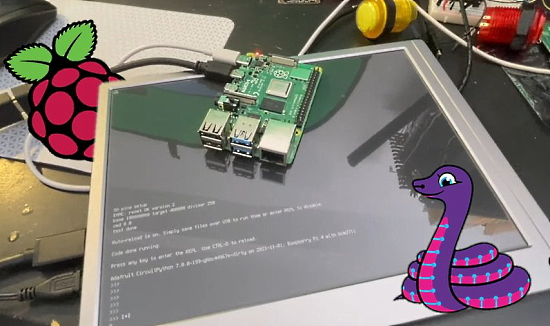
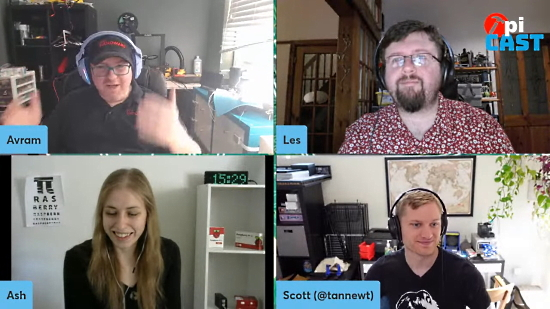
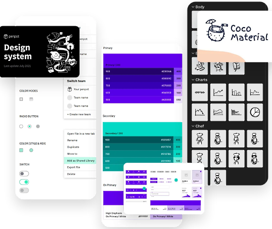
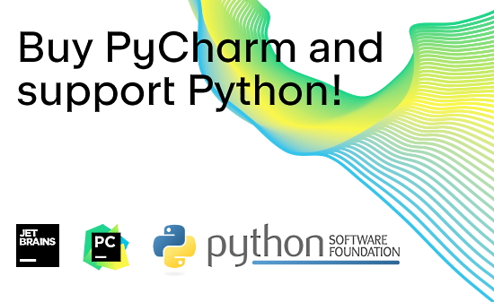
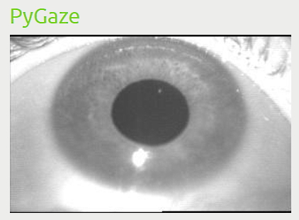
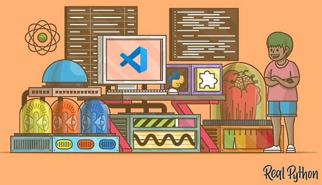
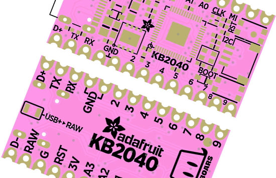

- [X] Kattni updates
- [ ] change date
- [ ] update title
- [ ] Feature story
- [ ] Update  for images
- [ ] Update ICYDNCI
- [ ] All images 550w max only
- [ ] Link "View this email in your browser."

News Sources

- [python.org](https://www.python.org/)
- [Python Insider - dev team blog](https://pythoninsider.blogspot.com/)
- [MicroPython Meetup Blog](https://melbournemicropythonmeetup.github.io/)

Template last updated on 2021-11-03 - remove october events

View this email in your browser.

Welcome to the latest Python on Microcontrollers newsletter, brought you by the community! We're on [Discord](https://discord.gg/HYqvREz), [Twitter](https://twitter.com/search?q=circuitpython&src=typed_query&f=live), and for past newsletters - [view them all here](https://www.adafruitdaily.com/category/circuitpython/). If you're reading this on the web, [subscribe here](https://www.adafruitdaily.com/). Let's get started!

## CircuitPython 7.1.0 Beta 0 is Available

CircuitPython 7.1.0-beta.0 is available, the initial beta release for CircuitPython 7.1.0. It is relatively stable, but contains issues we may still address for 7.1.0 - [GitHub](https://github.com/adafruit/circuitpython/releases).

Notable additions to 7.1.0 since 7.0.0:
* `keypad.Events` now include timestamps.
* The Espressif port now provides I2CPeripheral, WiFi monitor mode, ESP32-C3 support, and ParallelImageCapture.
* bitmaptools: dithering and alphablend are new.
* Preliminary support for asyncio is included. Use the CircuitPython asyncio library.
* `gifio.GifWriter` is new.
* HID now provides boot device and feature report support.
* rotaryio now allows setting the divisor of counts per transition.
* The SAMD port now provides watchdog and alarm with sleep.
* The STM port now provides STM32L4R5 support.
* MicroPython 1.17 has been merged in.

## Make Magazine Issues now on Internet Archive

Make is an American magazine published by Make: Community LLC which focuses on Do It Yourself and/or Do It With Others projects involving computers, electronics, metalworking, robotics, woodworking and other disciplines.

Now past issues of Make Magazine are available on The Internet Archive for Controlled Digital Lending - [Internet Archive](https://archive.org/details/Makezine) and [Adafruit Blog](https://blog.adafruit.com/2021/11/15/make-magazine-issues-are-now-available-on-internetarchive-making-make-carlmalamud/).

## The Pi Cast: Booting CircuitPython On Raspberry Pi

Adafruit's CircuitPython lead developer Scott Shawcroft joins Tom's Hardware Pi Cast to talk about a new version of the programming language that boots up on bare metal Raspberry Pi, no host OS required. Les Pounder also shows off the new Raspberry Pi OS Bullseye - [YouTube](https://www.youtube.com/watch?v=c9SOPgA8I0E).

## CircuitPython Deep Dive Stream with Scott Shawcroft

[This week](link), Scott streams his work on .

You can see the latest video and past videos on the Adafruit YouTube channel under the Deep Dive playlist - [YouTube](https://www.youtube.com/playlist?list=PLjF7R1fz_OOXBHlu9msoXq2jQN4JpCk8A).

## Penpot - Open Source Interface Prototyping

Penpot is the first Open Source design and prototyping platform meant for cross-domain teams. Non dependent on operating systems, Penpot is web based and works with open web standards (SVG). For all and empowered by the community. The [beta](https://penpot.app/why-beta.html) is now open - [Penpot](https://penpot.app/#project).

## CircuitPython Parsec

John Park’s CircuitPython Parsec: 

* episode - [Adafruit Blog](url)

Catch all the episodes in the [YouTube playlist](https://www.youtube.com/playlist?list=PLjF7R1fz_OOWFqZfqW9jlvQSIUmwn9lWr).

## The Python Software Foundation 2021 End of the Year Fundraiser

The PSF launched its end-of-the-year fundraiser. There are two ways to donate: 1. donate directly to the PSF or 2. purchase a discounted PyCharm license, with all proceeds going to the PSF. Contributing to the PSF financially helps sustain programs that support the larger Python community - [Python Software Foundation](https://pyfound.blogspot.com/2021/11/2021-end-of-year-fundraiser.html).

You may donate [here](https://psfmember.org/civicrm/contribute/transact?reset=1&id=36).

## News from around the web!

"Pi Cabinet", the Smart "Meds Reminder" Pill Cabinet. A no-solder, beginner-friendly project to build a "med reminder" box that will light up when it's time to take medications or supplements. Works with any Wi-Fi-capable Raspberry Pi. A Tech for Good project targeted at the enormous problem of prescription non-adherence,, and that makes a great launching pad for exploring even more complex solutions. - [Twitter](https://twitter.com/angiesaggers/status/1458681994632744961), [guide](https://gallaugher.com/pi-cabinet/)  and [YouTube](https://www.youtube.com/watch?v=e1_tQ9RsY2A).

text - [site](url).

text - [site](url).

text - [site](url).

text - [site](url).

text - [site](url).

text - [site](url).

text - [site](url).

text - [site](url).

text - [site](url).

text - [site](url).

text - [site](url).

text - [site](url).

text - [site](url).

Access Linux Filesystems in Windows 10 and WSL 2 - [linuxiac](https://linuxiac.com/how-to-access-linux-filesystems-in-windows-10-and-wsl-2/) and [Adafruit Blog](https://blog.adafruit.com/2021/11/10/access-linux-filesystems-in-windows-10-and-wsl-2-windows-wsl-linuxiac/).

PyGaze: Open-source toolbox for eye tracking in Python - [pygaze.org](https://www.pygaze.org/).

Speeding up Python with Guido and Mark - Talk Python Live Stream - [TalkPython Podcast](https://talkpython.fm/episodes/show/339/making-python-faster-with-guido-and-mark) and [YouTube](https://www.youtube.com/watch?v=_r6bFhl6wR8).

Setting up VS Code for Python beginners - [Visual Studio Code Livestreams](https://code.visualstudio.com/livestream?WT.mc_id=devcloud-18509-cxa) and [YouTube](https://youtu.be/7FltByLPnrg).

Advanced Visual Studio Code for Python Developers - [Real Python](https://realpython.com/advanced-visual-studio-code-python/).

How to run a Python script in Linux with SYSTEMD - [codementor](https://www.codementor.io/@ufukafak/how-to-run-a-python-script-in-linux-with-systemd-1nh2x3hi0e).

#ICYDNCI What was the most popular, most clicked link, in [last week's newsletter](https://www.adafruitdaily.com/2021/11/09/python-on-microcontrollers-newsletter-raspberry-pi-os-update-bare-metal-circuitpython-and-more-python-adafruit-circuitpython-micropython-thepsf/)? [Bullseye – the new version of Raspberry Pi OS](https://www.raspberrypi.com/news/raspberry-pi-os-debian-bullseye/).

## Coming soon

Adafruit KB2040 controller: an RP2040 in a Pro Micro form factor great as an upgrade for keyboards - [kbd.news](https://kbd.news/Adafruit-KB2040-controller-1072.html).

And see the giveaway [here](https://kbd.news/giveaway)!

text - [site](url).

text - [site](url).

## New Boards Supported by CircuitPython

The number of supported microcontrollers and Single Board Computers (SBC) grows every week. This section outlines which boards have been included in CircuitPython or added to [CircuitPython.org](https://circuitpython.org/).

This week, there were (#/no) new boards added!

- [Board name](url)

Looking to add a new board to CircuitPython? It's highly encouraged! Adafruit has four guides to help you do so:

- [How to Add a New Board to CircuitPython](https://learn.adafruit.com/how-to-add-a-new-board-to-circuitpython/overview)
- [How to add a New Board to the circuitpython.org website](https://learn.adafruit.com/how-to-add-a-new-board-to-the-circuitpython-org-website)
- [Adding a Single Board Computer to PlatformDetect for Blinka](https://learn.adafruit.com/adding-a-single-board-computer-to-platformdetect-for-blinka)
- [Adding a Single Board Computer to Blinka](https://learn.adafruit.com/adding-a-single-board-computer-to-blinka)

## New Learn Guides!

[Talking Computer from Star Trek](https://learn.adafruit.com/talking-computer-from-star-trek) from [Noe, Pedro and Phil B](https://learn.adafruit.com/users/pixil3d)

[Hacking Holiday Animatronics](https://learn.adafruit.com/hacking-holiday-animatronics) from [John Park](https://learn.adafruit.com/users/johnpark)

[Glowy Message Crown](https://learn.adafruit.com/glowy-message-crown) from [Charlyn G](https://learn.adafruit.com/users/chardane)

## CircuitPython Project Bundle

When you get to the CircuitPython code section of an [Adafruit Learn Guide](https://learn.adafruit.com/), sometimes things can get a bit complicated. You not only have the code you need to upload to your device, but you likely also need to add some libraries that the code requires to run. This involved downloading all the libraries, digging through to find the ones you need, and copying them to your device. That was only the beginning on some projects, as those that include images and/or sound files required further downloading and copying of files. But, not anymore!

Now, with Project Bundles, you can download all the necessary code, libraries and, if needed, asset files with one click! We automatically check which libraries are required for the project and bundle them up for you. No more digging through a huge list of libraries to find the ones you need, or fiddling with looking for other files or dependencies. Download the Project Bundle, copy the contents to your device, and your code will simply work. We wanted to make this the easiest way to get a project working, regardless of whether you're a beginner or an expert. We'll also be adding this feature to popular IDEs as an add-on. Try it out with any Circuit Python guide on the Adafruit Learning System. Just look for the ‘Download Project Bundle’ button on the code page. 

**To download and use a Project Bundle:**

In the Learning System - above any embedded code in a guide in the Adafruit Learn System, you’ll find a Download Project Bundle button.

Click the button to download the Project Bundle zip.

Open the Project Bundle zip to find the example code, all necessary libraries, and, if available, any images, sounds, etc.

Simply copy all the files over to your CIRCUITPY drive, and you’re ready to go!

If you run into any problems or bugs, or would like to submit feedback, please file an issue on the [Adafruit Learning System Guides GitHub repo](https://github.com/adafruit/Adafruit_Learning_System_Guides/issues).

## CircuitPython Libraries!

CircuitPython support for hardware continues to grow. We are adding support for new sensors and breakouts all the time, as well as improving on the drivers we already have. As we add more libraries and update current ones, you can keep up with all the changes right here!

For the latest libraries, download the [Adafruit CircuitPython Library Bundle](https://circuitpython.org/libraries). For the latest community contributed libraries, download the [CircuitPython Community Bundle](https://github.com/adafruit/CircuitPython_Community_Bundle/releases).

If you'd like to contribute, CircuitPython libraries are a great place to start. Have an idea for a new driver? File an issue on [CircuitPython](https://github.com/adafruit/circuitpython/issues)! Have you written a library you'd like to make available? Submit it to the [CircuitPython Community Bundle](https://github.com/adafruit/CircuitPython_Community_Bundle). Interested in helping with current libraries? Check out the [CircuitPython.org Contributing page](https://circuitpython.org/contributing). We've included open pull requests and issues from the libraries, and details about repo-level issues that need to be addressed. We have a guide on [contributing to CircuitPython with Git and Github](https://learn.adafruit.com/contribute-to-circuitpython-with-git-and-github) if you need help getting started. You can also find us in the #circuitpython channel on the [Adafruit Discord](https://adafru.it/discord).

You can check out this [list of all the Adafruit CircuitPython libraries and drivers available](https://github.com/adafruit/Adafruit_CircuitPython_Bundle/blob/master/circuitpython_library_list.md). 

The current number of CircuitPython libraries is **340**!

**Updated Libraries!**

Here's this week's updated CircuitPython libraries:

 * [Adafruit_CircuitPython_PyBadger](https://github.com/adafruit/Adafruit_CircuitPython_PyBadger)
 * [Adafruit_CircuitPython_AVRprog](https://github.com/adafruit/Adafruit_CircuitPython_AVRprog)
 * [Adafruit_CircuitPython_CircuitPlayground](https://github.com/adafruit/Adafruit_CircuitPython_CircuitPlayground)
 * [Adafruit_CircuitPython_TMP117](https://github.com/adafruit/Adafruit_CircuitPython_TMP117)
 * [Adafruit_Python_PlatformDetect](https://github.com/adafruit/Adafruit_Python_PlatformDetect)
 * [CircuitPython_Community_Bundle](https://github.com/adafruit/CircuitPython_Community_Bundle)

## What’s the team up to this week?

What is the team up to this week? Let’s check in!

**Dan**

Experimental asyncio support will be in the next CircuitPython beta. I tweaked the MicroPython version of asyncio to work with CircuitPython, and it's now a [library](https://github.com/adafruit/Adafruit_CircuitPython_asyncio). Along with this the latest builds of CircuitPython have also been adjusted to work with that library. Next, I'll be working on a Learn Guide with a number of examples.

**Jeff**

It was an exciting week for me, as a number of half-finished projects were merged into the CircuitPython core. The most recent additions are `dither` and `alphablend` in the bitmaptools library.  You can check out a short video about the functionality [on youtube](https://www.youtube.com/watch?v=a_NhAFZBHhI).

**Kattni**

This past week, I finished up the overhaul of the Welcome to CircuitPython guide. Please check it out! It's updated and better designed to provide a smooth experience for newcomers, while still offering up advanced knowledge to those who are looking for it. There are a couple of new pages as well, so take a look at those whether you're new to the guide or quite familiar with it.

I merged a number of PRs to get many more libraries in line with the latest Pylint, and helped out by submitting a few myself. As of this writing there are still ~40 to go, but based on the speed with which that's being addressed, I imagine everything will be done by the time this newsletter is published!

Next up is starting the guide for the Adafruit Monochrome 1.12" 128x128 OLED Graphic Display, a new OLED in the shop. Once complete, it'll have everything you need to get started with your new display. Keep an eye out for it.

**Melissa**

This past week, I was out sick for a few days, but I did manage to get the new Raspberry Pi OS working with the PiTFT in desktop mode. It ended up being one of those problems that could have had many possible causes, but the final solution was pretty simple.

**Scott**

This week I've been doing two things in parallel. First, I've gotten CircuitPython running on the Pi Zero 2W. Second, I've been working hard to add SD card support to CircuitPython on the Raspberry Pi. Adding SD card support will allow the CIRCUITPY drive to appear as it does when running on microcontrollers. Once SD card support is going (it's *very* close) then I'll polish things up and get them merged into main CircuitPython and released.

## Upcoming events!

RISC-V Summit brings the community together to show the power open collaboration can have on the processor industry. The audience spans across industries, organizations, workloads, and geographies to learn about the technology advancements in the RISC-V ecosystem and visibility of RISC-V successes. The event is December 6 – 8, in-person in San Francisco or virtually from anywhere in the world - [Linux Foundation](https://events.linuxfoundation.org/riscv-summit/register/) via [Twitter](https://twitter.com/risc_v/status/1449886188941238274).

PyCon US 2022 planning is underway. The team is planning to host the event in person with an online component. April 27, 2022 - May 5, 2022. Head over to the [PyCon US 2022 website](https://us.pycon.org/2022/) for details about the conference and more information about the sponsorship program - [PyCon Blog](https://pycon.blogspot.com/2021/10/pycon-us-2022-website-and-sponsorship.html).

**Send Your Events In**

As for other events, with the COVID pandemic, most in-person events are postponed or cancelled. If you know of virtual events or events that may occur in the future, please let us know on Discord or on Twitter with hashtag #CircuitPython.

## Latest releases

CircuitPython's stable release is [#.#.#](https://github.com/adafruit/circuitpython/releases/latest) and its unstable release is [#.#.#-##.#](https://github.com/adafruit/circuitpython/releases). New to CircuitPython? Start with our [Welcome to CircuitPython Guide](https://learn.adafruit.com/welcome-to-circuitpython).

[2021####](https://github.com/adafruit/Adafruit_CircuitPython_Bundle/releases/latest) is the latest CircuitPython library bundle.

[v#.#.#](https://micropython.org/download) is the latest MicroPython release. Documentation for it is [here](http://docs.micropython.org/en/latest/pyboard/).

[#.#.#](https://www.python.org/downloads/) is the latest Python release. The latest pre-release version is [#.#.#](https://www.python.org/download/pre-releases/).

[#### Stars](https://github.com/adafruit/circuitpython/stargazers) Like CircuitPython? [Star it on GitHub!](https://github.com/adafruit/circuitpython)

## Call for help -- Translating CircuitPython is now easier than ever!

One important feature of CircuitPython is translated control and error messages.

With the help of fellow open source project [Weblate](https://weblate.org/), we're making it even easier to add or improve translations.

Sign in with an existing account such as GitHub, Google or Facebook and start contributing through a simple web interface. No forks or pull requests needed!

As always, if you run into trouble join us on [Discord](https://adafru.it/discord), we're here to help.

## jobs.adafruit.com - Find a dream job, find great candidates!

[jobs.adafruit.com](https://jobs.adafruit.com/) has returned and folks are posting their skills (including CircuitPython) and companies are looking for talented makers to join their companies - from Digi-Key, to Hackaday, Micro Center, Raspberry Pi and more.

**Job of the Week**

Circuit Python programmer needed - Xander Creations LLC - [Adafruit Jobs Board](https://jobs.adafruit.com/job/circuit-python-programmer-needed/).

## 31,716 thanks!

The Adafruit Discord community, where we do all our CircuitPython development in the open, reached over 31,716 humans, thank you!  Adafruit believes Discord offers a unique way for CircuitPython folks to connect. Join today at [https://adafru.it/discord](https://adafru.it/discord).

## ICYMI - In case you missed it

The wonderful world of Python on hardware! This is our Python video-newsletter-podcast! The news comes from the Python community, Discord, Adafruit communities and more and is reviewed on ASK an ENGINEER Wednesdays. The complete Python on Hardware weekly videocast [playlist is here](https://www.youtube.com/playlist?list=PLjF7R1fz_OOXRMjM7Sm0J2Xt6H81TdDev). 

This video podcast is on [iTunes](https://itunes.apple.com/us/podcast/python-on-hardware/id1451685192?mt=2), [YouTube](http://adafru.it/pohepisodes), [IGTV (Instagram TV](https://www.instagram.com/adafruit/channel/)), and [XML](https://itunes.apple.com/us/podcast/python-on-hardware/id1451685192?mt=2).

[Weekly community chat on Adafruit Discord server CircuitPython channel - Audio / Podcast edition](https://itunes.apple.com/us/podcast/circuitpython-weekly-meeting/id1451685016) - Audio from the Discord chat space for CircuitPython, meetings are usually Mondays at 2pm ET, this is the audio version on [iTunes](https://itunes.apple.com/us/podcast/circuitpython-weekly-meeting/id1451685016), Pocket Casts, [Spotify](https://adafru.it/spotify), and [XML feed](https://adafruit-podcasts.s3.amazonaws.com/circuitpython_weekly_meeting/audio-podcast.xml).

And lastly, we are working up a one-spot destination for all things podcast-able here - [podcasts.adafruit.com](https://podcasts.adafruit.com/)

## Codecademy "Learn Hardware Programming with CircuitPython"

Codecademy, an online interactive learning platform used by more than 45 million people, has teamed up with the leading manufacturer in STEAM electronics, Adafruit Industries, to create a coding course, "Learn Hardware Programming with CircuitPython". The course is now available in the [Codecademy catalog](https://www.codecademy.com/learn/learn-circuitpython?utm_source=adafruit&utm_medium=partners&utm_campaign=circuitplayground&utm_content=pythononhardwarenewsletter).

Python is a highly versatile, easy to learn programming language that a wide range of people, from visual effects artists in Hollywood to mission control at NASA, use to quickly solve problems. But you don’t need to be a rocket scientist to accomplish amazing things with it. This new course introduces programmers to Python by way of a microcontroller — CircuitPython — which is a Python-based programming language optimized for use on hardware.

CircuitPython’s hardware-ready design makes it easier than ever to program a variety of single-board computers, and this course gets you from no experience to working prototype faster than ever before. Codecademy’s interactive learning environment, combined with Adafruit's highly rated Circuit Playground Express, present aspiring hardware hackers with a never-before-seen opportunity to learn hardware programming seamlessly online.

Whether for those who are new to programming, or for those who want to expand their skill set to include physical computing, this course will have students getting familiar with Python and creating incredible projects along the way. By the end, students will have built their own bike lights, drum machine, and even a moisture detector that can tell when it's time to water a plant.

Visit Codecademy to access the [Learn Hardware Programming with CircuitPython](https://www.codecademy.com/learn/learn-circuitpython?utm_source=adafruit&utm_medium=partners&utm_campaign=circuitplayground&utm_content=pythononhardwarenewsletter) course and Adafruit to purchase a [Circuit Playground Express](https://www.adafruit.com/product/3333).

Codecademy has helped more than 45 million people around the world upgrade their careers with technology skills. The company’s online interactive learning platform is widely recognized for providing an accessible, flexible, and engaging experience for beginners and experienced programmers alike. Codecademy has raised a total of $43 million from investors including Union Square Ventures, Kleiner Perkins, Index Ventures, Thrive Capital, Naspers, Yuri Milner and Richard Branson, most recently raising its $30 million Series C in July 2016.

## Contribute!

The CircuitPython Weekly Newsletter is a CircuitPython community-run newsletter emailed every Tuesday. The complete [archives are here](https://www.adafruitdaily.com/category/circuitpython/). It highlights the latest CircuitPython related news from around the web including Python and MicroPython developments. To contribute, edit next week's draft [on GitHub](https://github.com/adafruit/circuitpython-weekly-newsletter/tree/gh-pages/_drafts) and [submit a pull request](https://help.github.com/articles/editing-files-in-your-repository/) with the changes. You may also tag your information on Twitter with #CircuitPython. 

Join our [Discord](https://adafru.it/discord) or [post to the forum](https://forums.adafruit.com/viewforum.php?f=60) for any further questions.
