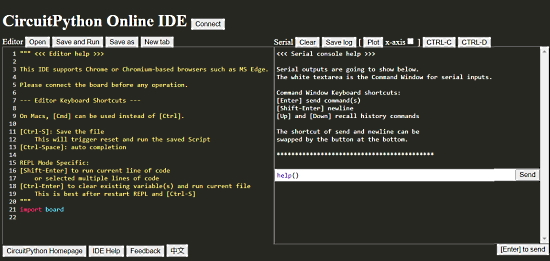
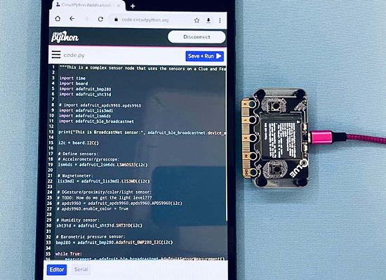
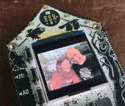
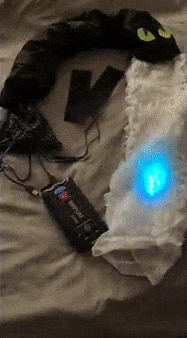
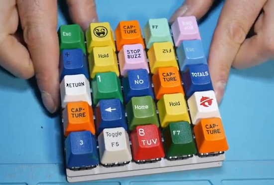
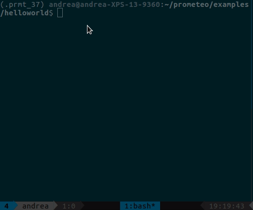
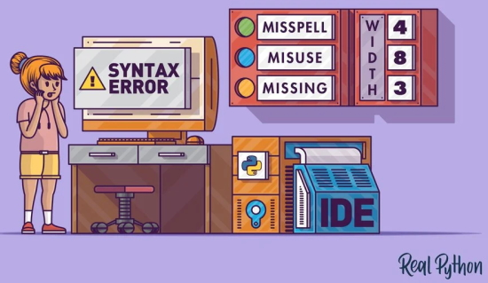
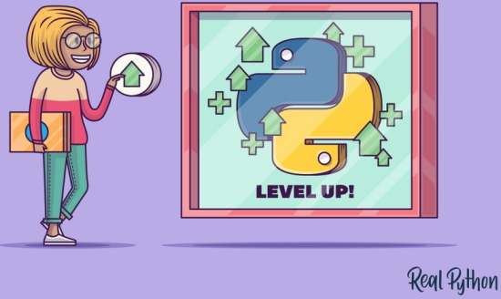
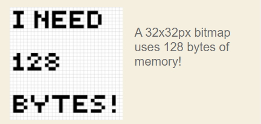
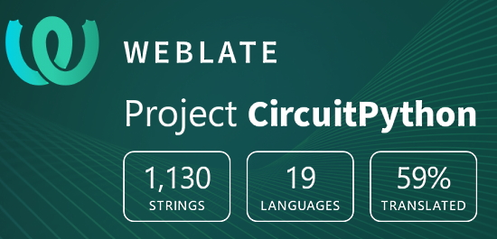

- [X] Kattni updates
- [ ] change date
- [ ] update title
- [ ] Feature story
- [ ] Update []() for images
- [ ] Update ICYDNCI
- [ ] All images 550w max only
- [ ] Link "View this email in your browser."

News Sources

- [python.org](https://www.python.org/)
- [Python Insider - dev team blog](https://pythoninsider.blogspot.com/)
- [MicroPython Meetup Blog](https://melbournemicropythonmeetup.github.io/)

View this email in your browser.

We're giving thanks for the tech in the latest Python on Microcontrollers newsletter, brought you by the community! We're on [Discord](https://discord.gg/HYqvREz), [Twitter](https://twitter.com/search?q=circuitpython&src=typed_query&f=live), and for past newsletters - [view them all here](https://www.adafruitdaily.com/category/circuitpython/). If you're reading this on the web, [subscribe here](https://www.adafruitdaily.com/). Let's get started!

## Headline Article

[](url)

text - [site](url).

## CircuitPython Online IDEs

[](https://github.com/urfdvw/CircuitPython-online-IDE)

The idea is simple: have a web-based development environment for CircuitPython. This eliminates the need for installing software and provides a unified interface. It definitely is possible with newer web technologies built into modern builds of the Chrome web browser.  GitHub user [Mr-Coxall](https://github.com/Mr-Coxall/CircuitPython-IDE) first started this trend two years ago. The idea was picked up by GitHub user [sensebox](https://github.com/sensebox/circuitpython-web-ide) 8 months ago. 

Most recently, GitHub user [urfdvw](https://github.com/urfdvw/CircuitPython-online-IDE) has made progress with a rather nice web based editor fittingly named "CircuitPython Online IDE". Available in English and Chinese, the project is well documented and has many features. There is serial console and plot output capabilities. 

Lean more: [YouTube](https://www.youtube.com/watch?v=Z44PD-ZleAU), [GitHub](https://github.com/urfdvw/CircuitPython-online-IDE), and [CircuitPython Online IDE](https://urfdvw.github.io/CircuitPython-online-IDE/).

## ESP32-S3 mini modules make for an easy 'S3 Feather

[](https://www.youtube.com/watch?v=NVoeIhUUi78)

Adafruit picked up some ESP32-S3 Mini modules from Digi-Key and surprise! They are pin compatible with the S2 Mini modules. That means they were able to upgrade their ESP32-S2 Feather to use the newest dual-core+BLE chipset. All the pins have been tested, NeoPixel works and so does I2C… they are fabricating some of these and will have some for the Adafruit shop as soon as Adafruit can get a reel from Espressif - [Adafruit Blog](https://blog.adafruit.com/2021/11/15/esp32-s3-mini-modules-make-for-an-easy-s3-feather/) and [YouTube](https://www.youtube.com/watch?v=NVoeIhUUi78).

## Wirelessly Code your Bluetooth Device with CircuitPython

[](https://learn.adafruit.com/wirelessly-code-your-bluetooth-device-with-circuitpython/device-setup)

Did you know you can transfer files over BLE? This is the basis for being able to edit CircuitPython files directly on your device.

Adafruit has been working on a new web-based Code Editor for CircuitPython. This allows you to edit files directly on your Bluetooth devices using just the Chrome web browser without installing any additional software. The great thing about this code editor is it is written completely in JavaScript, so it only runs on your computer and none of your data is ever uploaded to a server - [Adafruit Learning System](https://learn.adafruit.com/wirelessly-code-your-bluetooth-device-with-circuitpython/device-setup) and [https://code.circuitpython.org/](https://code.circuitpython.org/).

## Meet the Maker: Anne Barela

[](https://blog.adafruit.com/2021/11/18/hackspace-magazine-issue-49-meet-the-maker-anne-barela-circuitpython-hackspacemag-raspberry_pi-anne_engineer/)

Adafruit engineer Anne Barela was interviewed for the latest issue of [HackSpace Magazine, Issue 49](https://hackspace.raspberrypi.com/issues/49).

> If you’ve ever programmed anything in CircuitPython and understood the instructions first time, you probably have Anne Barela to thank. She’s a consulting engineer at Adafruit, where she puts her vast array of experience into helping people make cool stuff that ‘just works’. She’s had her work go into space on the Shuttle, she helped make sure the world’s computers didn’t melt when the clocks reset to zero in the year 2000, and she’s a big fan of open source. We got a bit flustered when we spoke to her to be honest – where do you start with a career that’s included Caltech, Hewlett-Packard, NASA, Boeing, and the US Diplomatic Service? So, we started with something we can all understand: CircuitPython.

You can read about Anne, her varied professions, her making trajectory and what she’s doing now in the latest HackSpace Magazine - [Adafruit Blog](https://blog.adafruit.com/2021/11/18/hackspace-magazine-issue-49-meet-the-maker-anne-barela-circuitpython-hackspacemag-raspberry_pi-anne_engineer/).

## Feature

[](url)

text - [site](url).

## CircuitPython Deep Dive Stream with Scott Shawcroft

[](link)

[This week](link), Scott streams his work on .

You can see the latest video and past videos on the Adafruit YouTube channel under the Deep Dive playlist - [YouTube](https://www.youtube.com/playlist?list=PLjF7R1fz_OOXBHlu9msoXq2jQN4JpCk8A).

## CircuitPython Parsec

[](https://blog.adafruit.com/2021/08/17/john-parks-circuitpython-parsec-code-for-board-types-adafruit-johnedgarpark-adafruit-circuitpython/)

John Park’s CircuitPython Parsec: 

* Keyword Arguments - [Adafruit Blog](https://blog.adafruit.com/2021/11/19/john-parks-circuitpython-parsec-keyword-arguments-adafruit-johnedgarpark-adafruit-circuitpython/) and [YouTube](https://youtu.be/uVGkxCXzgzE).

Catch all the episodes in the [YouTube playlist](https://www.youtube.com/playlist?list=PLjF7R1fz_OOWFqZfqW9jlvQSIUmwn9lWr).

## Python Software Foundation News

[](https://www.python.org/psf-landing/)

News from the PSF Community News Newsletter:

**Staffing**

* The PSF is hiring a new Executive Director. After announcing earlier this summer that Ewa Jodlowska is leaving after ten years of service, the PSF has begun its search for the organization's next Executive Director. Interested? You can [apply here today](https://python.us19.list-manage.com/track/click?u=5697f493c3a48994f504d4deb&id=c739ef7ebf&e=9b20e3624a). 
* Loren Crary joined the PSF in November 2021 as the new Director of Resource Development. Loren's focus will be to strengthen the PSF's fundraising and sponsorship efforts. Additionally, Loren will support the PSF with locating incoming grants to support the PSF's initiatives.
* Olivia Sauls joined the PSF in August 2021 as our Event Assistant and Administrator. Olivia is supporting PyCon US planning and execution. Additionally Olivia is supporting the PSF with administrative tasks pertaining to her role as the Secretary Assistant to the Foundation.

**PyPI user feedback!**

The PSF conducted a survey and interviewed PyPI users to understand common themes of improvements that would add value to PyPI. In order to consolidate these findings, we are conducting a poll that is open to anyone. Sharing feedback will allow us to decide our next course of development efforts - [Participate today]( https://docs.google.com/forms/d/e/1FAIpQLSfuDRH_KucxqHIYWVIMQJS_r6JFGMR0rNWn0KQ4bgMXsTlxhQ/viewform).

**Last call for Python Developers Survey!**

The Python Developer Survey helps the community better understand how Python is used and community trends. We will be closing the survey in about a week so if you have not yet participated in the survey, please do [here](https://surveys.jetbrains.com/s3/c1-python-developers-survey-2021).

## News from around the web!

[](https://twitter.com/todbot/status/1461086295439069195)

Using displayio palettes in CircuitPython to make a sorta datamosh slideshow viewer (with demo code) - [Twitter](https://twitter.com/todbot/status/1461086295439069195).

[](https://www.youtube.com/watch?v=zPo2CiKmx1I)

CircuitPython School - The Right Way to Add Buttons to a Raspberry Pi, Pinouts, and Cheer Machine - [YouTube](https://www.youtube.com/watch?v=zPo2CiKmx1I) via [Twitter](https://twitter.com/gallaugher/status/1460702129778311173).

[](https://twitter.com/caitlinsdad/status/1461069479501348872)

Making dragon fire with NeoPixels and CircuitPython - [Twitter](https://twitter.com/caitlinsdad/status/1461069479501348872).

[](https://www.youtube.com/watch?v=MmwpVaMa7xw)

Build a Raspberry Pi Pico Macropad for use with CircuitPython - [YouTube](https://www.youtube.com/watch?v=MmwpVaMa7xw), CircuitPython code on [GitHub](https://github.com/jpconstantineau/pykey/blob/main/examples/Raspberry_Pi_Pico_5x5_Macropad/code.py), via [Reddit](https://www.reddit.com/r/circuitpython/comments/qrosbf/build_a_raspberry_pi_pico_macropad_for_use_with/).

[](https://blog.adafruit.com/2021/11/17/prometeo-an-experimental-python-to-c-transpiler-for-embedded-high-performance-computing-python/)

prometeo – An experimental Python-to-C transpiler for embedded high-performance computing - [Adafruit Blog](https://blog.adafruit.com/2021/11/17/prometeo-an-experimental-python-to-c-transpiler-for-embedded-high-performance-computing-python/) and [GitHub](https://github.com/zanellia/prometeo).

[](url)

text - [site](url).

[](url)

text - [site](url).

[](url)

text - [site](url).

[](url)

text - [site](url).

[](url)

text - [site](url).

[](url)

text - [site](url).

[](url)

text - [site](url).

[](url)

text - [site](url).

[](url)

text - [site](url).

[](url)

text - [site](url).

[](url)

text - [site](url).

[](url)

text - [site](url).

[](https://realpython.com/invalid-syntax-python/)

Invalid Syntax in Python: Common Reasons for SyntaxError - [Real Python](https://realpython.com/invalid-syntax-python/).

[](https://github.com/TexusDev/Texus)

A fork of discord.py, texus is a modern, easy to use, feature-rich, and async ready API wrapper for Discord written in Python - [GitHub](https://github.com/TexusDev/Texus) via [Python Awesome](https://pythonawesome.com/a-fork-of-discord-py-meant-to-stabilize-and-build-off-it/).

[](https://realpython.com/intermediate-python/)

Intermediate Python — How do I take my Python skills to the next level? - [Real Python](https://realpython.com/intermediate-python/).

[](https://blog.benjamin-cabe.com/2021/10/21/5-reasons-why-i-dread-writing-embedded-guis)

5 Reasons Why I Dread Writing Embedded GUIs - [Benjamin Cabé](https://blog.benjamin-cabe.com/2021/10/21/5-reasons-why-i-dread-writing-embedded-guis).

Selecting a programming language can be a form of premature optimization - [Tall, Snarky Canadian](https://snarky.ca/programming-language-selection-is-a-form-of-premature-optimization/).

The SHA256 algorithm in Python without using any modules - [GitHub](https://github.com/kibnakamoto/sha256.py).

**#ICYDNCI What was the most popular, most clicked link, in [last week's newsletter](https://link)? [title](url).**

## Coming soon

[](https://www.tomshardware.com/news/adafruit-pink-rp2040-pcbs)

Adafruit to Release Pink RP2040 Based Boards - [Tom's Hardware](https://www.tomshardware.com/news/adafruit-pink-rp2040-pcbs).

> Adafruit's Feather RP2040 is the first board to feature the eye-catching punk pink PCBs that come powered by Raspberry Pi's RP2040 own silicon. The pink Feather RP2040 features the same layout and schematic as the original black model, a model that we awarded an Editor's Choice. The pink Feather RP2040 also features USB-C, onboard LiPo charging, NeoPixel, and a rather useful Stemma QT connector that can be used with components using the Stemma QT / Qwiic standard.

[](url)

text - [site](url).

## New Boards Supported by CircuitPython

The number of supported microcontrollers and Single Board Computers (SBC) grows every week. This section outlines which boards have been included in CircuitPython or added to [CircuitPython.org](https://circuitpython.org/).

This week, there were (#/no) new boards added!

- [Board name](url)

Looking to add a new board to CircuitPython? It's highly encouraged! Adafruit has four guides to help you do so:

- [How to Add a New Board to CircuitPython](https://learn.adafruit.com/how-to-add-a-new-board-to-circuitpython/overview)
- [How to add a New Board to the circuitpython.org website](https://learn.adafruit.com/how-to-add-a-new-board-to-the-circuitpython-org-website)
- [Adding a Single Board Computer to PlatformDetect for Blinka](https://learn.adafruit.com/adding-a-single-board-computer-to-platformdetect-for-blinka)
- [Adding a Single Board Computer to Blinka](https://learn.adafruit.com/adding-a-single-board-computer-to-blinka)

## New Learn Guides!

[](https://learn.adafruit.com/guides/latest)

[RGB Matrix Dreidel Game](https://learn.adafruit.com/rgb-matrix-dreidel-game) from [Liz Clark](https://learn.adafruit.com/users/BlitzCityDIY)

[NeoPixel Ring Lamp](https://learn.adafruit.com/neopixel-ring-lamp) from [Noe and Pedro](https://learn.adafruit.com/users/pixil3d)

[Wirelessly Code your Bluetooth Device with CircuitPython](https://learn.adafruit.com/wirelessly-code-your-bluetooth-device-with-circuitpython) from [Melissa LeBlanc-Williams](https://learn.adafruit.com/users/MakerMelissa)

## CircuitPython Project Bundle

[](https://learn.adafruit.com/)

When you get to the CircuitPython code section of an [Adafruit Learn Guide](https://learn.adafruit.com/), sometimes things can get a bit complicated. You not only have the code you need to upload to your device, but you likely also need to add some libraries that the code requires to run. This involved downloading all the libraries, digging through to find the ones you need, and copying them to your device. That was only the beginning on some projects, as those that include images and/or sound files required further downloading and copying of files. But, not anymore!

Now, with Project Bundles, you can download all the necessary code, libraries and, if needed, asset files with one click! We automatically check which libraries are required for the project and bundle them up for you. No more digging through a huge list of libraries to find the ones you need, or fiddling with looking for other files or dependencies. Download the Project Bundle, copy the contents to your device, and your code will simply work. We wanted to make this the easiest way to get a project working, regardless of whether you're a beginner or an expert. We'll also be adding this feature to popular IDEs as an add-on. Try it out with any Circuit Python guide on the Adafruit Learning System. Just look for the ‘Download Project Bundle’ button on the code page. 

**To download and use a Project Bundle:**

In the Learning System - above any embedded code in a guide in the Adafruit Learn System, you’ll find a Download Project Bundle button.

[](https://learn.adafruit.com/)

Click the button to download the Project Bundle zip.

[](https://learn.adafruit.com/)

Open the Project Bundle zip to find the example code, all necessary libraries, and, if available, any images, sounds, etc.

[](https://learn.adafruit.com/)

Simply copy all the files over to your CIRCUITPY drive, and you’re ready to go!

If you run into any problems or bugs, or would like to submit feedback, please file an issue on the [Adafruit Learning System Guides GitHub repo](https://github.com/adafruit/Adafruit_Learning_System_Guides/issues).

## CircuitPython Libraries!

[](https://circuitpython.org/libraries)

CircuitPython support for hardware continues to grow. We are adding support for new sensors and breakouts all the time, as well as improving on the drivers we already have. As we add more libraries and update current ones, you can keep up with all the changes right here!

For the latest libraries, download the [Adafruit CircuitPython Library Bundle](https://circuitpython.org/libraries). For the latest community contributed libraries, download the [CircuitPython Community Bundle](https://github.com/adafruit/CircuitPython_Community_Bundle/releases).

If you'd like to contribute, CircuitPython libraries are a great place to start. Have an idea for a new driver? File an issue on [CircuitPython](https://github.com/adafruit/circuitpython/issues)! Have you written a library you'd like to make available? Submit it to the [CircuitPython Community Bundle](https://github.com/adafruit/CircuitPython_Community_Bundle). Interested in helping with current libraries? Check out the [CircuitPython.org Contributing page](https://circuitpython.org/contributing). We've included open pull requests and issues from the libraries, and details about repo-level issues that need to be addressed. We have a guide on [contributing to CircuitPython with Git and Github](https://learn.adafruit.com/contribute-to-circuitpython-with-git-and-github) if you need help getting started. You can also find us in the #circuitpython channel on the [Adafruit Discord](https://adafru.it/discord).

You can check out this [list of all the Adafruit CircuitPython libraries and drivers available](https://github.com/adafruit/Adafruit_CircuitPython_Bundle/blob/master/circuitpython_library_list.md). 

The current number of CircuitPython libraries is **341**!

**New Libraries!**

Here's this week's new CircuitPython libraries:

 * [Adafruit_CircuitPython_asyncio](https://github.com/adafruit/Adafruit_CircuitPython_asyncio)

**Updated Libraries!**

Here's this week's updated CircuitPython libraries:

We recently did some updates to how the library testing works across all of the libraries, and that means there's too many updated libraries to list this week!

## What’s the team up to this week?

What is the team up to this week? Let’s check in!

**Dan**

I made our latest beta release, CircuitPython 7.1.0-beta.0, on November 11. Try it out and let us know of any issues.

7.1.0-beta.0 contains support for asyncio. I've started writing a guide about using asyncio in CircuitPython: you can check out the [draft so far](https://learn.adafruit.com/cooperative-multitasking-in-circuitpython/overview?preview_token=di81p2zLknUEEkeM-57bPw). Here's an example of blinking two LEDs independently:

```py
import asyncio
import board
import digitalio

async def blink(pin, interval, count):
    with digitalio.DigitalInOut(pin) as led:
        led.switch_to_output(value=False)
        for i in range(count):
            led.value = True
            await asyncio.sleep(interval)       # Don't forget the "await"!
            led.value = False
            await asyncio.sleep(interval)       # Don't forget the "await"!

async def main():
    led1_task = asyncio.create_task(blink(board.D1, 0.25, 10))
    led2_task = asyncio.create_task(blink(board.D2, 0.1, 20))
    await asyncio.gather(led1_task, led2_task)  # Don't forget the "await"!
    print("done")

asyncio.run(main())
```

**Kattni**

This week I finally published the new pages in the [Welcome to CircuitPython][(https://learn.adafruit.com/welcome-to-circuitpython) guide. There is a new [How Do I Learn Python?](https://learn.adafruit.com/welcome-to-circuitpython/how-do-i-learn-python) page that has links to resources to help you learn Python. So, that update is now complete. Check it out if you're new to CircuitPython, or if you're interested in seeing the latest revision of the guide.

Next up is the Feather ESP32-S2 guide. Keep an eye out for that!

I updated the [Adafruit CircuitPython DisplayIO SH1107](https://github.com/adafruit/Adafruit_CircuitPython_DisplayIO_SH1107) library to support the new [Adafruit Monochrome 1.12" 128x128 OLED Graphic Display](https://www.adafruit.com/product/5297). It now supports the new display and includes a basic example including text and basic shapes.

[PLEASE VERIFY THE GUIDE LINKED BELOW HAS BEEN PUBLISHED BEFORE INCLUDING THE NEXT SECTION]

I also published the [guide](https://learn.adafruit.com/adafruit-monochrome-1-12-in-128x128-oled) for the new OLD display. It includes everything you need to get started with your new display including an overview, pinouts, downloads resources, and examples in both CircuitPython and Arduino.

**Melissa**

This past week I finished writing a guide on using the [CircuitPython Code Editor](https://code.circuitpython.com). This is a web-based code editor that makes use of Web Bluetooth to be able to edit code directly on your device without any software besides the Chrome Web Browser. While writing the guide, I discovered that the Code Editor ran just fine on Linux and Windows, so I made sure to include directions for connecting with those operating systems as well. You can check out the learn guide at https://learn.adafruit.com/wirelessly-code-your-bluetooth-device-with-circuitpython.

**Scott**

Similar to last week, I've been working to wrap up the CircuitPython on Raspberry Pi work to get an initial version in. I filled out the `board` module with pins, added `board.DISPLAY` and made it possible to resize the displayio framebuffer shown on the display. I've still got a tricky issue to solve on the Pi Zero 2W when the CIRCUITPY drive is going. I'm also working to get the Pi builds going in the continuous integration system (CI) on GitHub Actions. Once it's going, we'll build new versions every commit and also auto-release the files.

## Upcoming events!

[](https://events.linuxfoundation.org/riscv-summit/register/)

RISC-V Summit brings the community together to show the power open collaboration can have on the processor industry. The audience spans across industries, organizations, workloads, and geographies to learn about the technology advancements in the RISC-V ecosystem and visibility of RISC-V successes. The event is December 6 – 8, in-person in San Francisco or virtually from anywhere in the world - [Linux Foundation](https://events.linuxfoundation.org/riscv-summit/register/) via [Twitter](https://twitter.com/risc_v/status/1449886188941238274).

[](https://2022.pycascades.com/)

PyCascades is a regional PyCon in the Pacific Northwest, celebrating the west coast Python developer and user community. Our organizing team includes members of the Vancouver, Seattle, and Portland Python user groups. DATES ANNOUNCED! February 5th-6th, 2022 The conference will take place on Saturday and the first half of Sunday, with the post-conference sprints following that on Sunday afternoon. After three amazing in-person conferences and an engaging online conference, we are ready to do it again! - [PyCascades 2022](https://2022.pycascades.com/).

[](https://us.pycon.org/2022/l)

PyCon US 2022 planning is underway. The team is planning to host the event in person with an online component. April 27, 2022 - May 5, 2022. Head over to the [PyCon US 2022 website](https://us.pycon.org/2022/) for details about the conference and more information about the sponsorship program - [PyCon Blog](https://pycon.blogspot.com/2021/10/pycon-us-2022-website-and-sponsorship.html).

**Send Your Events In**

As for other events, with the COVID pandemic, most in-person events are postponed or cancelled. If you know of virtual events or events that may occur in the future, please let us know on Discord or on Twitter with hashtag #CircuitPython.

## Latest releases

CircuitPython's stable release is [#.#.#](https://github.com/adafruit/circuitpython/releases/latest) and its unstable release is [#.#.#-##.#](https://github.com/adafruit/circuitpython/releases). New to CircuitPython? Start with our [Welcome to CircuitPython Guide](https://learn.adafruit.com/welcome-to-circuitpython).

[2021####](https://github.com/adafruit/Adafruit_CircuitPython_Bundle/releases/latest) is the latest CircuitPython library bundle.

[v#.#.#](https://micropython.org/download) is the latest MicroPython release. Documentation for it is [here](http://docs.micropython.org/en/latest/pyboard/).

[#.#.#](https://www.python.org/downloads/) is the latest Python release. The latest pre-release version is [#.#.#](https://www.python.org/download/pre-releases/).

[#### Stars](https://github.com/adafruit/circuitpython/stargazers) Like CircuitPython? [Star it on GitHub!](https://github.com/adafruit/circuitpython)

## Call for help -- Translating CircuitPython is now easier than ever!

[](https://hosted.weblate.org/engage/circuitpython/)

One important feature of CircuitPython is translated control and error messages.

With the help of fellow open source project [Weblate](https://weblate.org/), we're making it even easier to add or improve translations.

Sign in with an existing account such as GitHub, Google or Facebook and start contributing through a simple web interface. No forks or pull requests needed!

As always, if you run into trouble join us on [Discord](https://adafru.it/discord), we're here to help.

## jobs.adafruit.com - Find a dream job, find great candidates!

[](https://jobs.adafruit.com/)

[jobs.adafruit.com](https://jobs.adafruit.com/) has returned and folks are posting their skills (including CircuitPython) and companies are looking for talented makers to join their companies - from Digi-Key, to Hackaday, Micro Center, Raspberry Pi and more.

**Job of the Week**

Tech Lead, Hack Club Bank - Hack Club - [Adafruit Jobs Board](https://jobs.adafruit.com/job/tech-lead-hack-club-bank/).

## NUMBER thanks!

[](https://adafru.it/discord)

[](https://discord.gg/adafruit)

The Adafruit Discord community, where we do all our CircuitPython development in the open, reached over NUMBER humans, thank you!  Adafruit believes Discord offers a unique way for CircuitPython folks to connect. Join today at [https://adafru.it/discord](https://adafru.it/discord).

## ICYMI - In case you missed it

[](https://www.youtube.com/playlist?list=PLjF7R1fz_OOXRMjM7Sm0J2Xt6H81TdDev)

The wonderful world of Python on hardware! This is our Python video-newsletter-podcast! The news comes from the Python community, Discord, Adafruit communities and more and is reviewed on ASK an ENGINEER Wednesdays. The complete Python on Hardware weekly videocast [playlist is here](https://www.youtube.com/playlist?list=PLjF7R1fz_OOXRMjM7Sm0J2Xt6H81TdDev). 

This video podcast is on [iTunes](https://itunes.apple.com/us/podcast/python-on-hardware/id1451685192?mt=2), [YouTube](http://adafru.it/pohepisodes), [IGTV (Instagram TV](https://www.instagram.com/adafruit/channel/)), and [XML](https://itunes.apple.com/us/podcast/python-on-hardware/id1451685192?mt=2).

[Weekly community chat on Adafruit Discord server CircuitPython channel - Audio / Podcast edition](https://itunes.apple.com/us/podcast/circuitpython-weekly-meeting/id1451685016) - Audio from the Discord chat space for CircuitPython, meetings are usually Mondays at 2pm ET, this is the audio version on [iTunes](https://itunes.apple.com/us/podcast/circuitpython-weekly-meeting/id1451685016), Pocket Casts, [Spotify](https://adafru.it/spotify), and [XML feed](https://adafruit-podcasts.s3.amazonaws.com/circuitpython_weekly_meeting/audio-podcast.xml).

And lastly, we are working up a one-spot destination for all things podcast-able here - [podcasts.adafruit.com](https://podcasts.adafruit.com/)

## Contribute!

The CircuitPython Weekly Newsletter is a CircuitPython community-run newsletter emailed every Tuesday. The complete [archives are here](https://www.adafruitdaily.com/category/circuitpython/). It highlights the latest CircuitPython related news from around the web including Python and MicroPython developments. To contribute, edit next week's draft [on GitHub](https://github.com/adafruit/circuitpython-weekly-newsletter/tree/gh-pages/_drafts) and [submit a pull request](https://help.github.com/articles/editing-files-in-your-repository/) with the changes. You may also tag your information on Twitter with #CircuitPython. 

Join our [Discord](https://adafru.it/discord) or [post to the forum](https://forums.adafruit.com/viewforum.php?f=60) for any further questions.
