- [X] Kattni updates
- [ ] change date
- [ ] update title
- [ ] Feature story
- [ ] Update  for images
- [ ] Update ICYDNCI
- [ ] All images 550w max only
- [ ] Link "View this email in your browser."

News Sources

- [python.org](https://www.python.org/)
- [Python Insider - dev team blog](https://pythoninsider.blogspot.com/)
- [MicroPython Meetup Blog](https://melbournemicropythonmeetup.github.io/)
- [hackaday.io newest projects MicroPython](https://hackaday.io/projects?tag=micropython&sort=date) and [CircuitPython](https://hackaday.io/projects?tag=circuitpython&sort=date)
- [hackaday CircuitPython](https://hackaday.com/blog/?s=circuitpython) and [MicroPython](https://hackaday.com/blog/?s=micropython)
- [hackster.io CircuitPython](https://www.hackster.io/search?q=circuitpython&i=projects&sort_by=most_recent) and [MicroPython](https://www.hackster.io/search?q=micropython&i=projects&sort_by=most_recent)

View this email in your browser.

Welcome to the latest Python on Microcontrollers newsletter, brought you by the community! We're on [Discord](https://discord.gg/HYqvREz), [Twitter](https://twitter.com/search?q=circuitpython&src=typed_query&f=live), and for past newsletters - [view them all here](https://www.adafruitdaily.com/category/circuitpython/). If you're reading this on the web, [subscribe here](https://www.adafruitdaily.com/). Let's get started!

## PyLeap App Goes into Official Beta Test

[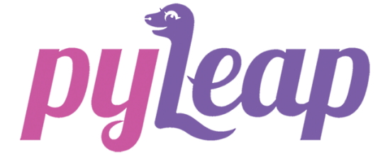](https://learn.adafruit.com/pyleap-app)

[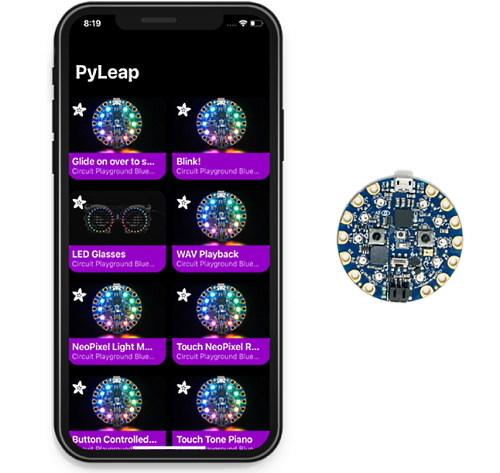](https://learn.adafruit.com/pyleap-app)

PyLeap is an app for iOS and iPadOS. It allows you to collect complete projects from the Adafruit Learn System, and transfer them directly to your Circuit Playground Bluefruit without opening a code editor or connecting to a computer. Send files and libraries directly to your Bluefruit device without a desktop computer! - [Adafruit Blog](https://blog.adafruit.com/2021/12/10/adafruitlearningsystem-weekly-pyleap/).

You can read more in the official guide on the Adafruit Learning System: [PyLeap App](https://learn.adafruit.com/pyleap-app)

The app may be downloaded via https://adafru.it/pyleap

The following guides are now up on the Adafruit Learning System to get you started with PyLeap:

* [PyLeap Tone Piano for Circuit Playground Bluefruit](https://learn.adafruit.com/pyleap-tone-piano-for-cpb)
* [PyLeap MP3 Playback for Circuit Playground Bluefruit](https://learn.adafruit.com/pyleap-mp3-playback-for-cpb)
* [PyLeap WAV Playback for Circuit Playground Bluefruit](https://learn.adafruit.com/pyleap-wav-playback-for-cpb)
* [PyLeap Button Controlled NeoPixels for Circuit Playground Bluefruit](https://learn.adafruit.com/pyleap-buttons-neopixels)
* [PyLeap NeoPixel Light Meter for Circuit Playground Bluefruit](https://learn.adafruit.com/pyleap-neopixel-light-meter)
* [PyLeap Touch NeoPixel Rainbow for Circuit Playground Bluefruit](https://learn.adafruit.com/pyleap-touch-neopixel-rainbow)
* [PyLeap NeoPixel Sound Meter for Circuit Playground Bluefruit](https://learn.adafruit.com/pyleap-neopixel-sound-meter)

## CircuitPython 7.1.0 Beta 3 is Available

CircuitPython 7.1.0-beta.3 is available, the fourth beta release for CircuitPython 7.1.0. It is relatively stable, but contains issues to address for 7.1.0. The main addition to this beta over the last is addition of Non-OS ("bare metal") versions of CircuitPython for some Broadcom-based Raspberry Pi single board computers - [GitHub](https://github.com/adafruit/circuitpython/releases).

Notable additions to 7.1.0 since 7.0.0:
* Initial port for Raspberry Pi Broadcom-based boards.
* `keypad.Events` now include timestamps.
* The Espressif port now provides I2CPeripheral, WiFi monitor mode, ESP32-C3 support, and ParallelImageCapture.
* bitmaptools: dithering and alphablend are new.
* Preliminary support for asyncio is included. Use the CircuitPython asyncio library.
* `gifio.GifWriter` is new.
* HID now provides boot device and feature report support.
* rotaryio now allows setting the divisor of counts per transition.
* The SAMD port now provides watchdog and alarm with sleep.
* The STM port now provides STM32L4R5 support.
* MicroPython 1.17 has been merged in.
* Russian translation.
* Preliminary support for `asyncio` is included. Use the [CircuitPython asyncio library](https://github.com/adafruit/Adafruit_CircuitPython_asyncio).

## Boston College Students Demonstrate their Final Projects Using CircuitPython

Professor John Gallaugher teaches an excellent class on using microcontrollers to non-engineering students. For the students' final projects, they built a number of devives using CircuitPython in innovative ways. Here are some of the projects as [posted on Twitter](https://twitter.com/gallaugher).

[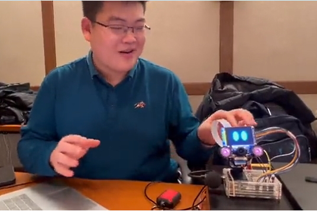](https://twitter.com/gallaugher/status/1469129837038215173)

A personal assistant robot named Popcorn - [Twitter](https://twitter.com/gallaugher/status/1469129837038215173).

A 3D printed, motorized Iron Man helmet with a heads-up display on a Raspberry Pi 4 plus Adafruit Crickit HAT running CircuitPython - [Twitter](https://twitter.com/gallaugher/status/1469133751628500993).

[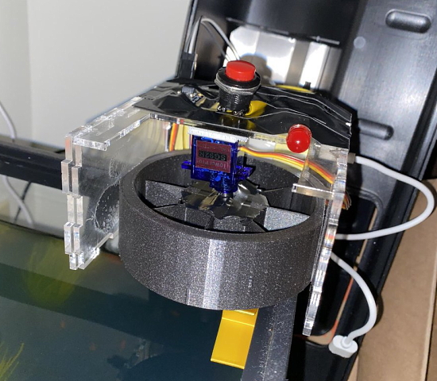](https://twitter.com/gallaugher/status/1469035642529230857)

An electronic fish feeder with CircuitPython - [Twitter](https://twitter.com/gallaugher/status/1469035642529230857).

## A deep dive into Raspberry Pi Zero 2 W power consumption

[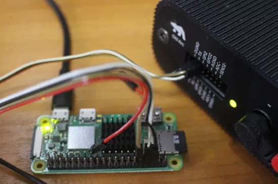](https://www.cnx-software.com/2021/12/09/raspberry-pi-zero-2-w-power-consumption/)

Raspberry Pi Zero 2 W power consumption is measures with various peripherals on and being used and some of those turned off. This is a great baseline for comparing with [Bare Metal (No OS) CircuitPython](https://circuitpython.org/board/raspberrypi_zero2w/) on the board - [CNX Software](https://www.cnx-software.com/2021/12/09/raspberry-pi-zero-2-w-power-consumption/) via [Twitter](https://twitter.com/adafruit/status/1469290818506788867).

## GitHub Code Search Technology Preview

[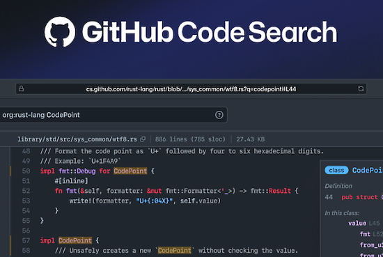](https://github.blog/2021-12-08-improving-github-code-search/)

GitHub is rolling out a technology preview for substantial improvements to searching code on the platform. A survey must be filled out for access. if granted, it'll be located at https://cs.github.com/. The search index covers more than five million of the most popular public repositories; in addition, you can search private repositories you have access to - [GitHub Blog](https://github.blog/2021-12-08-improving-github-code-search/).

## CircuitPython Deep Dive Stream with Scott Shawcroft

[This week](https://youtu.be/RqRgIhPJnDQ), Scott streams his work with CircuitPython on Rapberry Pi (No OS/Bare Metal) and use of NeoPixels.

*Note: There will be no new streams from Scott for the next three weeks.*

You can see the latest video and past videos on the Adafruit YouTube channel under the Deep Dive playlist - [YouTube](https://www.youtube.com/playlist?list=PLjF7R1fz_OOXBHlu9msoXq2jQN4JpCk8A).

## CircuitPython Parsec

John Park’s CircuitPython Parsec: 

* Pixel Patterns - [Adafruit Blog](https://blog.adafruit.com/2021/12/13/john-parks-circuitpython-parsec-pixel-patterns-adafruit-johnedgarpark-adafruit-circuitpython/) and [YouTube](https://youtu.be/qiXP7MjJZjA).

Catch all the episodes in the [YouTube playlist](https://www.youtube.com/playlist?list=PLjF7R1fz_OOWFqZfqW9jlvQSIUmwn9lWr).

## News from the Python Software Foundation

The PSF announced on December 7th that it was the last day for departing director Ewa Jodlowska. 

> Ewa's impact on Python & the Python community has been tremendous & will be longlasting. As a final sendoff, reply below with your gratitude, best wishes, stories, & support for her to see! We love you Ewa!

## News from around the web!

Learn Python – Free Python Courses for Beginners - [FreeCodeCamp](https://www.freecodecamp.org/news/learn-python-free-python-courses-for-beginners/).

[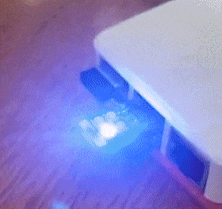](https://twitter.com/mattmovesmtns/status/1402315335106236422)

An [Adafruit Neo Trinkey](https://www.adafruit.com/product/4870) and CircuitPython mouse jiggler/mover with touch sensitive on/off button - [Twitter](https://twitter.com/mattmovesmtns/status/1402315335106236422).

A snowman holiday decoration on an Adafruit MatrixPortal. User-selectable storm/blizzard settings, written in CircuitPython - [Twitter](https://twitter.com/CedarGroveMakr/status/1468436812980834304).

[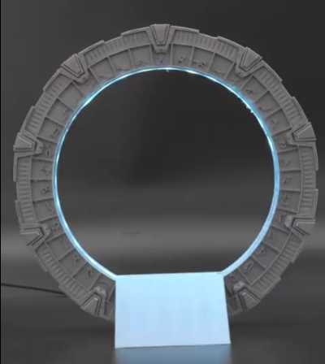](https://twitter.com/adafruit/status/1468201080999841802)

A replica Stargate, powered by an Adafruit QT Py, NeoPixel LEDs, and CicuitPython - [Twitter](https://twitter.com/adafruit/status/1468201080999841802) and [YouTube](https://www.youtube.com/watch?v=MhnFKY7zMyY).

[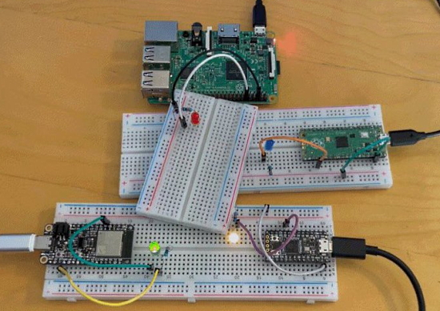](https://twitter.com/stephencross/status/1468218973212848144)

> Loving CircuitPython. (The) same code running a single board computer and different microcontrollers. Pi 3, Pi Pico, ItsyBitsy RP2040 and ESP32-S2 - [Twitter](https://twitter.com/stephencross/status/1468218973212848144).

[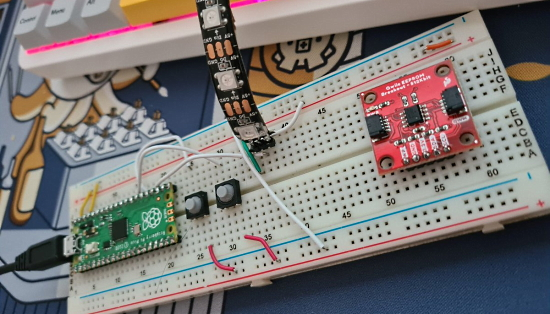](https://twitter.com/natalie_thenerd/status/1468494187595059202)

Using an EEPROM in CircuitPython to save state information with a Raspberry Pi Pico - [Twitter](https://twitter.com/natalie_thenerd/status/1468494187595059202).

[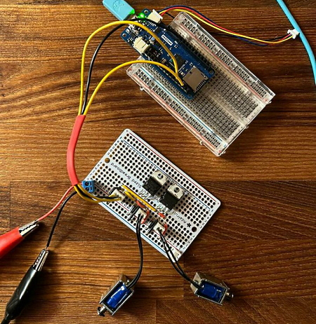](https://twitter.com/Stonehippo/status/1468758175696445441)

An Adafruit perma-proto driver for a pair of tiny solenoids in preparation for a little robot prototype - [Twitter](https://twitter.com/Stonehippo/status/1468758175696445441).

[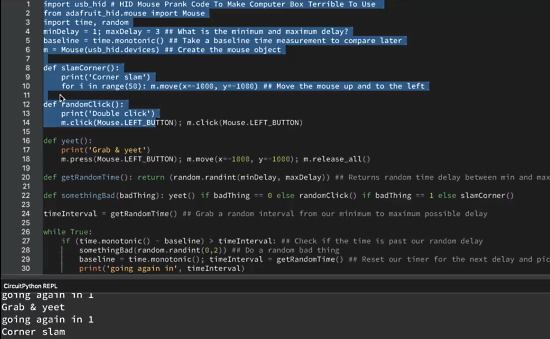](https://twitter.com/KodyKinzie/status/1468894216055148548)

CircuitPython code to create a mouse jiggler prank, making it difficult for someone using their computer mouse - [Twitter](https://twitter.com/KodyKinzie/status/1468894216055148548) and [GitHub](https://github.com/HakCat-Tech/S2-Nugget/blob/main/Mouse_Prank.py) (not necessarily recommended).

A social distancing jacket using an ultrasonic sensor and NeoPixels - [Twitter](https://twitter.com/caitlinsdad/status/1468707184754180103) and [YouTube](https://www.youtube.com/watch?v=QIwcJxDzC5M).

[!Adafruit Circuit Playground device holder](../assets/20211214/20211214cpx.jpg)](https://twitter.com/greghuber/status/1470098888832991242)

A 3D printed holder for an Adafruit Circuit Playground device - [Twitter](https://twitter.com/greghuber/status/1470098888832991242).

text - [site](url).

text - [site](url).

[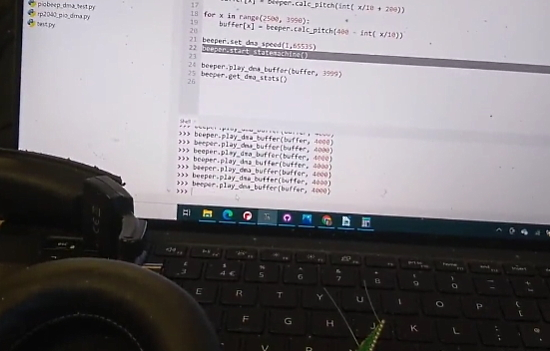](https://twitter.com/bioshock_hk/status/1468855335154860033)

> In the HackSpace lab today, we're working on getting sounds to play on a Raspberry Pi Pico on MicroPython using DMA -- this means the sound plays in the background and doesn't use any processor overhead - [Twitter](https://twitter.com/bioshock_hk/status/1468855335154860033).

text - [site](url).

microStudio, a free game engine online, now supports 4 programming languages: microScript, Python, JavaScript and Lua - [Blog](https://microstudio.dev/community/news/microstudio-now-supports-4-programming-languages-microscript-python-javascript-and-lua/254/) and [Site](https://microstudio.dev/).

Detecting and Measuring Gerrymandering with Python - a quick introduction to the declination angle and how it can be a powerful tool for detecting gerrymandering - [Towards Data Science](https://towardsdatascience.com/detecting-and-measuring-gerrymandering-with-python-f85a1315acd4).

text - [site](url).

text - [site](url).

text - [site](url).

text - [site](url).

text - [site](url).

[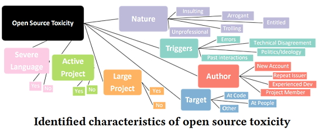](https://cmustrudel.github.io/papers/osstoxicity22.pdf)

Paper: "Did You Miss My Comment or What?" Understanding Toxicity in Open Source Discussions - [GitHub](https://cmustrudel.github.io/papers/osstoxicity22.pdf) (PDF).

text - [site](url).

text - [site](url).

**#ICYDNCI What was the most popular, most clicked link, in [last week's newsletter](https://link)? [title](url).**

## Coming soon

[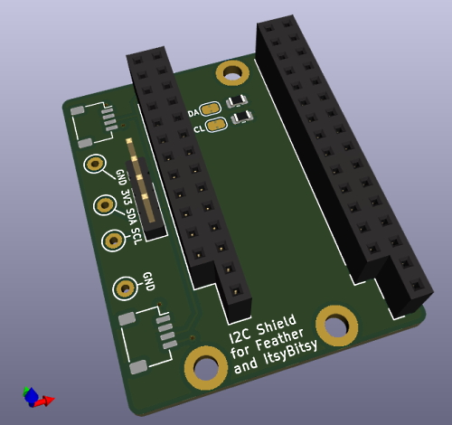](https://twitter.com/IslandRobotics/status/1468657158573203456)

A "shield" board to add I2C breakouts to a Feather or ItsyBitsy size development board, with pins broken out and 2 Qwiic/STEMMA QT connections - [Twitter](https://twitter.com/IslandRobotics/status/1468657158573203456).

[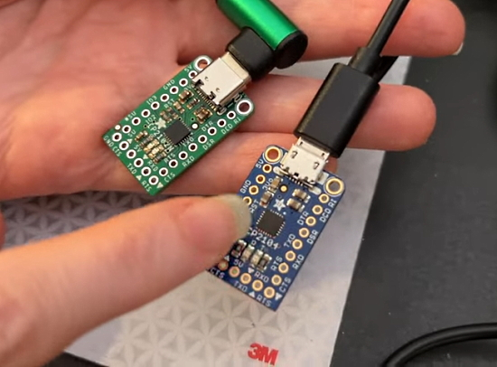](https://blog.adafruit.com/2021/12/10/we-can-now-set-rx-tx-leds-on-our-cp2012n-usb-serial-boards/)

Adafruit uses the CP2104 usb-serial converter in a lot of their designs – but it’s hard to get during the shortage(s). The CP2102N is available, and it’s a clooooose replacement, but theres a few small hardware changes needed and the internal EEPROM is different. So, if you just spent 2 days trying to figure out why your CP2104 EEPROM writing code isn't working and you were dreading having to rewrite the libusb vendor calls, good news! This PR to a fork of a program compiled cleanly and did the job a treat on the Adafruit Raspberry Pi tester: https://github.com/irrwisch1/cp210x-cfg/pull/1 whew - [Adafruit Blog](https://blog.adafruit.com/2021/12/10/we-can-now-set-rx-tx-leds-on-our-cp2012n-usb-serial-boards/).

## New Boards Supported by CircuitPython

The number of supported microcontrollers and Single Board Computers (SBC) grows every week. This section outlines which boards have been included in CircuitPython or added to [CircuitPython.org](https://circuitpython.org/).

This week, there were (#/no) new boards added!

- [Board name](url)

Looking to add a new board to CircuitPython? It's highly encouraged! Adafruit has four guides to help you do so:

- [How to Add a New Board to CircuitPython](https://learn.adafruit.com/how-to-add-a-new-board-to-circuitpython/overview)
- [How to add a New Board to the circuitpython.org website](https://learn.adafruit.com/how-to-add-a-new-board-to-the-circuitpython-org-website)
- [Adding a Single Board Computer to PlatformDetect for Blinka](https://learn.adafruit.com/adding-a-single-board-computer-to-platformdetect-for-blinka)
- [Adding a Single Board Computer to Blinka](https://learn.adafruit.com/adding-a-single-board-computer-to-blinka)

## New Learn Guides!

[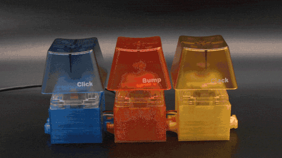](https://learn.adafruit.com/guides/latest)

[Big Key Switches Macro Pad](https://learn.adafruit.com/big-key-switch) from [Noe and Pedro](https://learn.adafruit.com/users/pixil3d)

[Nunchuck Controlled Laser Cat Toy](https://learn.adafruit.com/nunchuck-controlled-laser-cat-toy) from [Melissa LeBlanc-Williams](https://learn.adafruit.com/users/MakerMelissa)

[Trinkey True Random Number Generator](https://learn.adafruit.com/trinkey-qt2040-true-random-number-generator) from [Carter Nelson](https://learn.adafruit.com/users/caternuson)

[Adafruit KB2040](https://learn.adafruit.com/adafruit-kb2040) by [Kattni](https://learn.adafruit.com/users/kattni)

## CircuitPython Project Bundle

When you get to the CircuitPython code section of an [Adafruit Learn Guide](https://learn.adafruit.com/), sometimes things can get a bit complicated. You not only have the code you need to upload to your device, but you likely also need to add some libraries that the code requires to run. This involved downloading all the libraries, digging through to find the ones you need, and copying them to your device. That was only the beginning on some projects, as those that include images and/or sound files required further downloading and copying of files. But, not anymore!

Now, with Project Bundles, you can download all the necessary code, libraries and, if needed, asset files with one click! We automatically check which libraries are required for the project and bundle them up for you. No more digging through a huge list of libraries to find the ones you need, or fiddling with looking for other files or dependencies. Download the Project Bundle, copy the contents to your device, and your code will simply work. We wanted to make this the easiest way to get a project working, regardless of whether you're a beginner or an expert. We'll also be adding this feature to popular IDEs as an add-on. Try it out with any Circuit Python guide on the Adafruit Learning System. Just look for the ‘Download Project Bundle’ button on the code page. 

**To download and use a Project Bundle:**

In the Learning System - above any embedded code in a guide in the Adafruit Learn System, you’ll find a Download Project Bundle button.

Click the button to download the Project Bundle zip.

Open the Project Bundle zip to find the example code, all necessary libraries, and, if available, any images, sounds, etc.

Simply copy all the files over to your CIRCUITPY drive, and you’re ready to go!

If you run into any problems or bugs, or would like to submit feedback, please file an issue on the [Adafruit Learning System Guides GitHub repo](https://github.com/adafruit/Adafruit_Learning_System_Guides/issues).

## CircuitPython Libraries!

CircuitPython support for hardware continues to grow. We are adding support for new sensors and breakouts all the time, as well as improving on the drivers we already have. As we add more libraries and update current ones, you can keep up with all the changes right here!

For the latest libraries, download the [Adafruit CircuitPython Library Bundle](https://circuitpython.org/libraries). For the latest community contributed libraries, download the [CircuitPython Community Bundle](https://github.com/adafruit/CircuitPython_Community_Bundle/releases).

If you'd like to contribute, CircuitPython libraries are a great place to start. Have an idea for a new driver? File an issue on [CircuitPython](https://github.com/adafruit/circuitpython/issues)! Have you written a library you'd like to make available? Submit it to the [CircuitPython Community Bundle](https://github.com/adafruit/CircuitPython_Community_Bundle). Interested in helping with current libraries? Check out the [CircuitPython.org Contributing page](https://circuitpython.org/contributing). We've included open pull requests and issues from the libraries, and details about repo-level issues that need to be addressed. We have a guide on [contributing to CircuitPython with Git and Github](https://learn.adafruit.com/contribute-to-circuitpython-with-git-and-github) if you need help getting started. You can also find us in the #circuitpython channel on the [Adafruit Discord](https://adafru.it/discord).

You can check out this [list of all the Adafruit CircuitPython libraries and drivers available](https://github.com/adafruit/Adafruit_CircuitPython_Bundle/blob/master/circuitpython_library_list.md). 

The current number of CircuitPython libraries is **341**!

**Updated Libraries!**

Here's this week's updated CircuitPython libraries:

 * [Adafruit_CircuitPython_asyncio](https://github.com/adafruit/Adafruit_CircuitPython_asyncio)
 * [Adafruit_CircuitPython_DS3231](https://github.com/adafruit/Adafruit_CircuitPython_DS3231)
 * [Adafruit_CircuitPython_MatrixPortal](https://github.com/adafruit/Adafruit_CircuitPython_MatrixPortal)
 * [Adafruit_CircuitPython_MagTag](https://github.com/adafruit/Adafruit_CircuitPython_MagTag)
 * [Adafruit_CircuitPython_CharLCD](https://github.com/adafruit/Adafruit_CircuitPython_CharLCD)
 * [Adafruit_CircuitPython_ESP_ATcontrol](https://github.com/adafruit/Adafruit_CircuitPython_ESP_ATcontrol)
 * [Adafruit_CircuitPython_FRAM](https://github.com/adafruit/Adafruit_CircuitPython_FRAM)
 * [Adafruit_CircuitPython_RFM9x](https://github.com/adafruit/Adafruit_CircuitPython_RFM9x)
 * [Adafruit_CircuitPython_binascii](https://github.com/adafruit/Adafruit_CircuitPython_binascii)
 * [Adafruit_CircuitPython_DisplayIO_Layout](https://github.com/adafruit/Adafruit_CircuitPython_DisplayIO_Layout)
 * [Adafruit_CircuitPython_RFM69](https://github.com/adafruit/Adafruit_CircuitPython_RFM69)
 * [Adafruit_CircuitPython_LTR390](https://github.com/adafruit/Adafruit_CircuitPython_LTR390)
 * [Adafruit_CircuitPython_ADT7410](https://github.com/adafruit/Adafruit_CircuitPython_ADT7410)
 * [Adafruit_CircuitPython_BitmapSaver](https://github.com/adafruit/Adafruit_CircuitPython_BitmapSaver)
 * [Adafruit_CircuitPython_BLE_Eddystone](https://github.com/adafruit/Adafruit_CircuitPython_BLE_Eddystone)
 * [Adafruit_CircuitPython_Slideshow](https://github.com/adafruit/Adafruit_CircuitPython_Slideshow)
 * [Adafruit_CircuitPython_OV5640](https://github.com/adafruit/Adafruit_CircuitPython_OV5640)
 * [Adafruit_CircuitPython_RTTTL](https://github.com/adafruit/Adafruit_CircuitPython_RTTTL)
 * [Adafruit_CircuitPython_AdafruitIO](https://github.com/adafruit/Adafruit_CircuitPython_AdafruitIO)
 * [Adafruit_CircuitPython_ESP32SPI](https://github.com/adafruit/Adafruit_CircuitPython_ESP32SPI)
 * [Adafruit_CircuitPython_BME680](https://github.com/adafruit/Adafruit_CircuitPython_BME680)
 * [Adafruit_CircuitPython_Gizmo](https://github.com/adafruit/Adafruit_CircuitPython_Gizmo)
 * [Adafruit_CircuitPython_FunHouse](https://github.com/adafruit/Adafruit_CircuitPython_FunHouse)
 * [Adafruit_Blinka](https://github.com/adafruit/Adafruit_Blinka)

## What’s the team up to this week?

What is the team up to this week? Let’s check in!

**Dan**

I have been fixing issues for the CircuitPython 7.1.0 release. I've fixed a `countio` issue on the RP2040, fixed `frequencyio.FrequencyIn` on SAMD51, fixed Airlift BLE support, and narrowed down an SD card problem that Jeff fixed: I had SD cards that triggered the problem, Jeff did not, and I was able to do a `git bisect` to determine which code was causing the issue.

**Jeff**

With a big assist from Dan I was able to fix a problem with SD cards that I had introduced when improving write speeds. This only affected users of 7.1 beta versions.

I also added board definition files for several esp32s3 development boards, which are now in the absolute latest builds.

**Kattni**

This week I published the core of the [KB2040 guide](https://learn.adafruit.com/adafruit-kb2040). It still has a few things to add before it'll be completed, but if you're looking to get started with your board, check out the guide.

I added a `create_and_get_feed` function to the CircuitPython Adafruit IO library that combines the `get_feed` and `create_feed` functions. It allows you, in one line of code, to attempt to get a feed, and if it doesn't exist, create it and then get it. It eliminates the need for a `try`/`except` block in examples to do the same functionality.

Next up is the NeoSlider guide. Keep an eye out for that coming soon!

**Melissa**

This past week, I finished my Nunchuck Controlled Laser Cat Toy guide. I made a few tweaks to the source code to allow some cool this. For instance, since the project already had a PWM FeatherWing to control the servos, I updated it so it could change the brightness of the laser by pulsing the on/off line. I then made use of the nunchuck controller to be able to adjust the brightness of the laser just by twisting your wrist and holding down one of the buttons. This project has a lot of potential to take it to the next level and I listed a bunch of ideas that I had considered doing while writing the guide. You can check out the guide at https://learn.adafruit.com/nunchuck-controlled-laser-cat-toy.

The other big thing I did was I fixed a bug in the Web Serial ESPTool that had existed since my refactor and I hadn't been able to figure out. With several people running into the bug and Kattni finding a way to consistently reproduce the issue, I was able to narrow it down in the code and fix it.

**Scott**

This week I've continued working on the Raspberry Pi port of CircuitPython. I merged in full UART support and included a fix for the Raspberry Pi 4B disk image that prevented it from booting. Next, I started working on full SPI support. I've got it compiling and will test it today. After that, I'll add neopixel support.

I also had to tweak the CircuitPython CI to fix an unreliability that I introduced when I optimized the submodule fetch.

## Upcoming events!

The December MicroPython Meetup in Melbourne was pushed due to proximity to the holidays - the next one will be on January 26th - [Meetup](https://www.meetup.com/MicroPython-Meetup/).

PyCascades is a regional PyCon in the Pacific Northwest, celebrating the west coast Python developer and user community. Our organizing team includes members of the Vancouver, Seattle, and Portland Python user groups. DATES ANNOUNCED! February 5th-6th, 2022 The conference will take place on Saturday and the first half of Sunday, with the post-conference sprints following that on Sunday afternoon. After three amazing in-person conferences and an engaging online conference, we are ready to do it again! - [PyCascades 2022](https://2022.pycascades.com/).

PyCon US 2022 planning is underway. The team is planning to host the event in person with an online component. April 27, 2022 - May 5, 2022. Head over to the [PyCon US 2022 website](https://us.pycon.org/2022/) for details about the conference and more information about the sponsorship program - [PyCon Blog](https://pycon.blogspot.com/2021/10/pycon-us-2022-website-and-sponsorship.html).

PyCon Italia is the Italian conference on Python. Organised by Python Italia, it is one of the more important Python conferences in Europe. With over 700 attendees, the next edition will be June 2-5, 2022 - [Ticket Registration](https://pycon.it/en/tickets).

**Send Your Events In**

As for other events, with the COVID pandemic, most in-person events are postponed or cancelled. If you know of virtual events or events that may occur in the future, please let us know on Discord or on Twitter with hashtag #CircuitPython.

## Latest releases

CircuitPython's stable release is [#.#.#](https://github.com/adafruit/circuitpython/releases/latest) and its unstable release is [#.#.#-##.#](https://github.com/adafruit/circuitpython/releases). New to CircuitPython? Start with our [Welcome to CircuitPython Guide](https://learn.adafruit.com/welcome-to-circuitpython).

[2021####](https://github.com/adafruit/Adafruit_CircuitPython_Bundle/releases/latest) is the latest CircuitPython library bundle.

[v#.#.#](https://micropython.org/download) is the latest MicroPython release. Documentation for it is [here](http://docs.micropython.org/en/latest/pyboard/).

[#.#.#](https://www.python.org/downloads/) is the latest Python release. The latest pre-release version is [#.#.#](https://www.python.org/download/pre-releases/).

[#### Stars](https://github.com/adafruit/circuitpython/stargazers) Like CircuitPython? [Star it on GitHub!](https://github.com/adafruit/circuitpython)

## Call for help -- Translating CircuitPython is now easier than ever!

[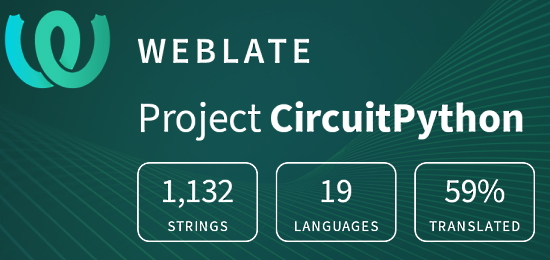](https://hosted.weblate.org/engage/circuitpython/)

One important feature of CircuitPython is translated control and error messages.

With the help of fellow open source project [Weblate](https://weblate.org/), we're making it even easier to add or improve translations.

Sign in with an existing account such as GitHub, Google or Facebook and start contributing through a simple web interface. No forks or pull requests needed!

As always, if you run into trouble join us on [Discord](https://adafru.it/discord), we're here to help.

## jobs.adafruit.com - Find a dream job, find great candidates!

[jobs.adafruit.com](https://jobs.adafruit.com/) has returned and folks are posting their skills (including CircuitPython) and companies are looking for talented makers to join their companies - from Digi-Key, to Hackaday, Micro Center, Raspberry Pi and more.

**Job of the Week**

text - [Adafruit Jobs Board](https://jobs.adafruit.com/).

## NUMBER thanks!

The Adafruit Discord community, where we do all our CircuitPython development in the open, reached over NUMBER humans, thank you!  Adafruit believes Discord offers a unique way for CircuitPython folks to connect. Join today at [https://adafru.it/discord](https://adafru.it/discord).

## ICYMI - In case you missed it

The wonderful world of Python on hardware! This is our Python video-newsletter-podcast! The news comes from the Python community, Discord, Adafruit communities and more and is reviewed on ASK an ENGINEER Wednesdays. The complete Python on Hardware weekly videocast [playlist is here](https://www.youtube.com/playlist?list=PLjF7R1fz_OOXRMjM7Sm0J2Xt6H81TdDev). 

This video podcast is on [iTunes](https://itunes.apple.com/us/podcast/python-on-hardware/id1451685192?mt=2), [YouTube](http://adafru.it/pohepisodes), [IGTV (Instagram TV](https://www.instagram.com/adafruit/channel/)), and [XML](https://itunes.apple.com/us/podcast/python-on-hardware/id1451685192?mt=2).

[Weekly community chat on Adafruit Discord server CircuitPython channel - Audio / Podcast edition](https://itunes.apple.com/us/podcast/circuitpython-weekly-meeting/id1451685016) - Audio from the Discord chat space for CircuitPython, meetings are usually Mondays at 2pm ET, this is the audio version on [iTunes](https://itunes.apple.com/us/podcast/circuitpython-weekly-meeting/id1451685016), Pocket Casts, [Spotify](https://adafru.it/spotify), and [XML feed](https://adafruit-podcasts.s3.amazonaws.com/circuitpython_weekly_meeting/audio-podcast.xml).

And lastly, we are working up a one-spot destination for all things podcast-able here - [podcasts.adafruit.com](https://podcasts.adafruit.com/)

## Codecademy "Learn Hardware Programming with CircuitPython"

Codecademy, an online interactive learning platform used by more than 45 million people, has teamed up with the leading manufacturer in STEAM electronics, Adafruit Industries, to create a coding course, "Learn Hardware Programming with CircuitPython". The course is now available in the [Codecademy catalog](https://www.codecademy.com/learn/learn-circuitpython?utm_source=adafruit&utm_medium=partners&utm_campaign=circuitplayground&utm_content=pythononhardwarenewsletter).

Python is a highly versatile, easy to learn programming language that a wide range of people, from visual effects artists in Hollywood to mission control at NASA, use to quickly solve problems. But you don’t need to be a rocket scientist to accomplish amazing things with it. This new course introduces programmers to Python by way of a microcontroller — CircuitPython — which is a Python-based programming language optimized for use on hardware.

CircuitPython’s hardware-ready design makes it easier than ever to program a variety of single-board computers, and this course gets you from no experience to working prototype faster than ever before. Codecademy’s interactive learning environment, combined with Adafruit's highly rated Circuit Playground Express, present aspiring hardware hackers with a never-before-seen opportunity to learn hardware programming seamlessly online.

Whether for those who are new to programming, or for those who want to expand their skill set to include physical computing, this course will have students getting familiar with Python and creating incredible projects along the way. By the end, students will have built their own bike lights, drum machine, and even a moisture detector that can tell when it's time to water a plant.

Visit Codecademy to access the [Learn Hardware Programming with CircuitPython](https://www.codecademy.com/learn/learn-circuitpython?utm_source=adafruit&utm_medium=partners&utm_campaign=circuitplayground&utm_content=pythononhardwarenewsletter) course and Adafruit to purchase a [Circuit Playground Express](https://www.adafruit.com/product/3333).

Codecademy has helped more than 45 million people around the world upgrade their careers with technology skills. The company’s online interactive learning platform is widely recognized for providing an accessible, flexible, and engaging experience for beginners and experienced programmers alike. Codecademy has raised a total of $43 million from investors including Union Square Ventures, Kleiner Perkins, Index Ventures, Thrive Capital, Naspers, Yuri Milner and Richard Branson, most recently raising its $30 million Series C in July 2016.

## Contribute!

The CircuitPython Weekly Newsletter is a CircuitPython community-run newsletter emailed every Tuesday. The complete [archives are here](https://www.adafruitdaily.com/category/circuitpython/). It highlights the latest CircuitPython related news from around the web including Python and MicroPython developments. To contribute, edit next week's draft [on GitHub](https://github.com/adafruit/circuitpython-weekly-newsletter/tree/gh-pages/_drafts) and [submit a pull request](https://help.github.com/articles/editing-files-in-your-repository/) with the changes. You may also tag your information on Twitter with #CircuitPython. 

Join our [Discord](https://adafru.it/discord) or [post to the forum](https://forums.adafruit.com/viewforum.php?f=60) for any further questions.
