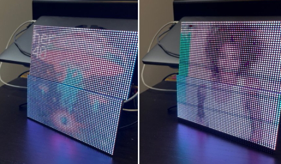
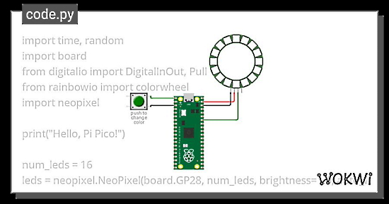
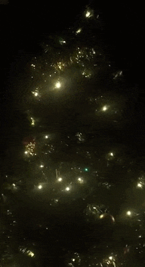
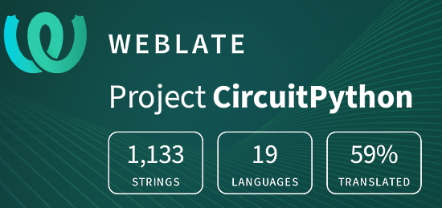

- [ ] Kattni updates
- [ ] Update  for images
- [ ] Update ICYDNCI
- [ ] Link "View this email in your browser."

View this email in your browser.

Welcome to the latest Python on Microcontrollers newsletter, brought you by the community! We're on [Discord](https://discord.gg/HYqvREz), [Twitter](https://twitter.com/search?q=circuitpython&src=typed_query&f=live), and for past newsletters - [view them all here](https://www.adafruitdaily.com/category/circuitpython/). If you're reading this on the web, [subscribe here](https://www.adafruitdaily.com/). Let's get started!

## Guest editor this week - pt !

Hi folks! The team lended me the keys to the car this week, I'll try to return it fully tanked up and scratch-free. Anne and team each week do an amazing job on the newsletter, over the last 18 months I've need to stay as exclusively focused on running Adafruit with the team/Ladyada during some of the toughest times for all of us - from COVID which is currently _not_ going away, to the chip / supply chain issues, it's been a ride. However! I wanted to say thank you to our community, customers, our team, and everyone who helps and supports us. Python on hardware, specifically - CircuitPython is something that is bigger than all of us now, or one company, and we'll continue to be open-source, community-driven, and helping everywhere we can together building something special.

For this week's newsletter I'm adding some of how we arrive at naming of products, some news, and some art. Maybe a few things we can all think about in 2022 and do together too.

One of the ideas for December (plans, ya know, we all have them until...) was to publish some of the behind the scenes at Adafruit, more, including some art, black and white photos, and things we're doing prove we're human-like sometimes. This newsletter is part of it, but if you want to see more, for this month (Dec 2021), [I'm posting art, behind the scenes, and more on Twitter](https://twitter.com/ptorrone) [@ptorrone](https://twitter.com/ptorrone) - and using Twitter how you're not supposed to at all - it's just images, no text, no replies, or likes, it's all black and white. If you're a long time reader, this is sorta like a tiny microblog version of Hackaday, which I started 17+ years ago, and it's now owned by someone else (I am reader and fan only now)... [Hackaday](https://hackaday.com/) & [Wikipedia entry](https://en.wikipedia.org/wiki/Hackaday). So, we'll see what January brings and if folks want to keep this window open.

For the readers who have not been here from the start, we started the Python on Hardware newsletter November of 2016, as we built what's now CircuitPython, in the open, we wanted to tell the story of decisions we made, updates, progress, and more - we publish on GitHub, we use Wordpress and a separate non-Adafruit-commerce site (we do not spam, etc.), to get the newsletter out each week, we're up to about 9,239 readers (but who is counting?!), thank you!

As far as scheduling goes for weekly videos and more, the teams are taking the week off - so expect all your favorite videos, live and recorded, to return next week. Even our Ladyada is taking this week off for videos, well - besides the ones she's going to do no matter what with what she is working on from her desk and more :)

On with the newsletter!

## Happy 2022 from Adafruit 

Last Python on Hardware newsletter of the year! At the end of each year, or the beginning of the new year (depending how ya look at), we post up a call for input for what's next with CircuitPython, and reflect on what we were able to build together over the last year. Sooo! It's that time again, look for the post and socialz from Scott the lead on CircuitPython VERY SOON.

The CircuitPython on Raspberry Pi "bare metal" is what I'm looking forward to using more once we have it cooked, HDMI out specifically, and being able to make a stand-alone Python computer!

For the beta, or maybe it's alpha... I tried out what we had and had the HDMI out go to an e-ink HDMI display for kicks, it was neat and I want more.

## CircuitPython 7.1.0 Release Candidate 1 Released

CircuitPython 7.1.0-rc.1, the second release candidate for CircuitPython 7.1.0 is here! We believe it is stable, but want to give time for further testing. Dan has a post with the details, and the release notes are on [GitHub](https://github.com/adafruit/circuitpython/releases/tag/7.1.0-rc.1).

**Notable additions to 7.1.0 since 7.0.0**
- Initial port for Raspberry Pi Broadcom-based boards.
- Preliminary support for `asyncio` cooperative multitasking.
- `bitmaptools`: dithering and alphablend are new.
- `keypad.Event`s now include timestamps.
- `framebufferio`: support for IS31FL3741.
- Espressif now provides `I2CPeripheral`, WiFi monitor mode, setting MAC address, ESP32-C3 support, `ParallelImageCapture`.
- `gifio.GifWriter` is new.
- HID now provides boot device and feature report support.
- `rotaryio` now allows setting the divisor of counts per transition.
- SAMD now provides `watchdog`, and `alarm` with sleep.
- SAMx5 boards now all have sleep support.
- The STM port now provides STM32L4R5 support.
- MicroPython 1.17 has been merged in.
- Russian translation.

## Mu 1.1.0-beta.7 Released

Beta 7 of the Mu Python Editor has just been released. This includes UI enhancements, localization, PyGame updates, bug fixes and more - [Made With Mu](https://madewith.mu/mu/users/2021/12/22/beta7.html).

## New board SCORPIO

We have a new board coming out, and it's called SCORPIO. How do we come up with names of things? Well, all depends on what something is, if there are potential naming issues, and really a million things. For SCORPIO, here's how we got there ... I'd say the closest analogy for good naming, or really good ideas in general, is skateboarding. We're all doing tricks, building off each other, it's not a competition, but it's also not just standing around - we're pushing each other for the design of the thing, the naming of the thing, and it's an amplification of the best of each other, and imagining a future with this thing in it, and the potential good it can provide. PhilB on our team is fantastic at all sorts of things, you may remember him from such hits as "NeoPixels" and "keep Adafruit weird"... so we started tossing some naming ideas around...

The easy and obvious ones bubble to the top right away, the design has 8MB of QSPI flash, SO IT MUST BE OCTO RIGHT? No! We cannot fall in to the trap. Names we are not going with -  Colorswirl, Octo Detroit, Eight Ashbury, Kobold ... OctoStar came up from the community, we're not scared of showing works in progress, even down to the naming, we often get good ideas on what to consider, and we also get good ideas on what we're not going to do too. Kraken came up, but it's been co-opted in politics, at least for now, skipping that one. Otto (Italian). Nautilus. Cephalopi. 20,000 LEDs under the C. Hot dog buns come in packs of 8, if there’s a metaphor to be had there. 8-wind compass rose. 8th wonder. Octo Who or Octo Manhattan, nope. I tossed around pillow, but that's already used for lots of things, I did like the idea of this dreamy fluffy rainbow thing, but kept moving on. Other ones we tossed around: Scintillate (sparkly and has an “8” in it)
The Shining, Sea Star (8 arms), Tardigrade or water bear (8 legs), Hydra (multiple heads, bonus points for dragon), Peacock (for its colorful feathers). Lumin8 and Illumin8 are of course already in use by other companies.

Mentioning “8” specifically kind of paints into a corner, if some future variant had more or fewer outputs, then what.

Spiders, they have eight legs, they are arachnids, which include ... scorpions ! We're not stuck with 8, but it's nod 8 in a subtle way. 

> "In astrology, the eighth house is the house of the zodiac sign of Scorpio and planet Pluto. Scorpio (♏︎) is the eighth astrological sign in the zodiac, originating from the constellation of Scorpius, the eighth house is the house of the zodiac sign of Scorpio and planet Pluto. It is viewed as the house of sex, taboos, death, resurrection and other people's possessions. It spans 210°–240° ecliptic longitude. Under the tropical zodiac (most commonly used in Western astrology), the Sun transits this sign on average from October 23 to November 22. It is viewed as the house of sex, taboos, death, resurrection and other people's possessions." - [Wikipedia](https://en.wikipedia.org/wiki/Scorpio_(astrology)).

Unicode Scorpio: ♏︎

Emoji: ♏️🦂

## CircuitPython Deep Dive Stream with Scott Shawcroft

Scott was off last Friday - he should be back _next week_.

You can see the latest video and past videos on the Adafruit YouTube channel under the Deep Dive playlist - [YouTube](https://www.youtube.com/playlist?list=PLjF7R1fz_OOXBHlu9msoXq2jQN4JpCk8A).

## CircuitPython Parsec

John Park’s CircuitPython Parsec is also on break this week, tune in NEXT WEEK for the latest! And - catch all the episodes in the [YouTube playlist](https://www.youtube.com/playlist?list=PLjF7R1fz_OOWFqZfqW9jlvQSIUmwn9lWr).

## News from around the web!

text - [site](url).

> Thanks to Adafruit learning guides @todbot ImageMagick tip, I can now display album art (Boston & Whitney) from the Discogs API on my 64x64 LED using CircuitPython - [Twitter](https://twitter.com/prcutler/status/1473705130784657422).

Simulating a Raspberry Pi Pico and NeoPixel ring running CircuitPython in Wokwi - [Wokwi](https://wokwi.com/arduino/projects/316012775466861122) and [Twitter](https://twitter.com/_dcd/status/1473044771128053764).

> I know I’ve posted about this before, but the magic of this has not worn off yet. Amazing that ~20 lines of CircuitPython can connect a bauble to a Raspberry Pi via Bluetooth so that the colour of the flashes links up to 1,000s of other cheerlights across the world - [Twitter](https://twitter.com/thebotmakes/status/1473415386301349892).

How I found (and fixed) a vulnerability in Python - [tldr.engineering](https://tldr.engineering/how-i-found-and-fixed-a-vulnerability-in-python/).

- [site](url).

text - [site](url).

text - [site](url).

text - [site](url).

text - [site](url).

text - [site](url).

text - [site](url).

text - [site](url).

text - [site](url).

text - [site](url).

text - [site](url).

text - [site](url).

text - [site](url).

text - [site](url).

**#ICYDNCI What was the most popular, most clicked link, in [last week's newsletter](https://link)? [title](url).**

## Coming soon

text - [site](url).

text - [site](url).

## New Boards Supported by CircuitPython

The number of supported microcontrollers and Single Board Computers (SBC) grows every week. This section outlines which boards have been included in CircuitPython or added to [CircuitPython.org](https://circuitpython.org/).

This week, there were (#/no) new boards added!

- [Board name](url)

Looking to add a new board to CircuitPython? It's highly encouraged! Adafruit has four guides to help you do so:

- [How to Add a New Board to CircuitPython](https://learn.adafruit.com/how-to-add-a-new-board-to-circuitpython/overview)
- [How to add a New Board to the circuitpython.org website](https://learn.adafruit.com/how-to-add-a-new-board-to-the-circuitpython-org-website)
- [Adding a Single Board Computer to PlatformDetect for Blinka](https://learn.adafruit.com/adding-a-single-board-computer-to-platformdetect-for-blinka)
- [Adding a Single Board Computer to Blinka](https://learn.adafruit.com/adding-a-single-board-computer-to-blinka)

## New Learn Guides!

[title](url) from [name](url)

[title](url) from [name](url)

[title](url) from [name](url)

## Updated Learn Guides!

[title](url) from [name](url)

## CircuitPython Project Bundle

When you get to the CircuitPython code section of an [Adafruit Learn Guide](https://learn.adafruit.com/), sometimes things can get a bit complicated. You not only have the code you need to upload to your device, but you likely also need to add some libraries that the code requires to run. This involved downloading all the libraries, digging through to find the ones you need, and copying them to your device. That was only the beginning on some projects, as those that include images and/or sound files required further downloading and copying of files. But, not anymore!

Now, with Project Bundles, you can download all the necessary code, libraries and, if needed, asset files with one click! We automatically check which libraries are required for the project and bundle them up for you. No more digging through a huge list of libraries to find the ones you need, or fiddling with looking for other files or dependencies. Download the Project Bundle, copy the contents to your device, and your code will simply work. We wanted to make this the easiest way to get a project working, regardless of whether you're a beginner or an expert. We'll also be adding this feature to popular IDEs as an add-on. Try it out with any Circuit Python guide on the Adafruit Learning System. Just look for the ‘Download Project Bundle’ button on the code page. 

**To download and use a Project Bundle:**

In the Learning System - above any embedded code in a guide in the Adafruit Learn System, you’ll find a Download Project Bundle button.

Click the button to download the Project Bundle zip.

Open the Project Bundle zip to find the example code, all necessary libraries, and, if available, any images, sounds, etc.

Simply copy all the files over to your CIRCUITPY drive, and you’re ready to go!

If you run into any problems or bugs, or would like to submit feedback, please file an issue on the [Adafruit Learning System Guides GitHub repo](https://github.com/adafruit/Adafruit_Learning_System_Guides/issues).

## CircuitPython Libraries!

CircuitPython support for hardware continues to grow. We are adding support for new sensors and breakouts all the time, as well as improving on the drivers we already have. As we add more libraries and update current ones, you can keep up with all the changes right here!

For the latest libraries, download the [Adafruit CircuitPython Library Bundle](https://circuitpython.org/libraries). For the latest community contributed libraries, download the [CircuitPython Community Bundle](https://github.com/adafruit/CircuitPython_Community_Bundle/releases).

If you'd like to contribute, CircuitPython libraries are a great place to start. Have an idea for a new driver? File an issue on [CircuitPython](https://github.com/adafruit/circuitpython/issues)! Have you written a library you'd like to make available? Submit it to the [CircuitPython Community Bundle](https://github.com/adafruit/CircuitPython_Community_Bundle). Interested in helping with current libraries? Check out the [CircuitPython.org Contributing page](https://circuitpython.org/contributing). We've included open pull requests and issues from the libraries, and details about repo-level issues that need to be addressed. We have a guide on [contributing to CircuitPython with Git and Github](https://learn.adafruit.com/contribute-to-circuitpython-with-git-and-github) if you need help getting started. You can also find us in the #circuitpython channel on the [Adafruit Discord](https://adafru.it/discord).

You can check out this [list of all the Adafruit CircuitPython libraries and drivers available](https://github.com/adafruit/Adafruit_CircuitPython_Bundle/blob/master/circuitpython_library_list.md). 

The current number of CircuitPython libraries is **###**!

**New Libraries!**

Here's this week's new CircuitPython libraries:

* [library](url)

**Updated Libraries!**

Here's this week's updated CircuitPython libraries:

* [library](url)

## What’s the team up to this week?

What is the team up to this week? Let’s check in!

**Dan**

I fixed a regression for 7.1.0 that caused `alarm.wake_alarm` to not be updated. This is the last bug we wanted to fix for 7.1.0. There are more 7.x.x bugs, but we will work on them for 7.2.0 or later.

As I write this, I am preparing the 7.1.0-rc.0 release. We would like to have 7.1.0 final available at the beginning of the new year.

I am also working on some infrastructure issues in library bundle building and in `circup`. Some have been fixed, and there are a few final ones to do.

**Jeff**

During the past week, I did some 'custodial' work, working with Dan to fix some problems that arose with the automatic builds of CircuitPython due to changes in libraries and packages we depend on.  I also worked on some personal projects, such as the birdbath that I talked about on last week's Show & Tell broadcast.

**Kattni**

Adafruit NeoSlider guide was published. Otherwise, it's been a short week, so not much else to report. Happy Holidays, everyone!

**Melissa**

This past week, I finished updating [Blinka Displayio](https://github.com/adafruit/Adafruit_Blinka_Displayio) to update the interface to CircuitPython 7. I also added typing information to everything to make it easier to know what kind of data is expected to be passed in. The plan is to do a little more restructuring so it's more in line with CircuitPython's layout and then let the community take it over if they want it to grow.

**Scott**

This week I got a bit distracted from Broadcom port work. Instead, I worked on adding sideset enable support for the RP2040's PIO. This is needed for the UART TX example and others as well. I'm using UART TX in my Sofle split keyboard that I showed off on the [Tom's Hardware Pi Cast](https://www.youtube.com/watch?v=jnxAq6czefY). This week and next are short weeks and I'll be wrapping up the Broadcom work while kicking off CircuitPython 2022 planning.

## Upcoming events!

The December MicroPython Meetup in Melbourne was pushed due to proximity to the holidays – the next one will be on January 26th – [Meetup](https://www.meetup.com/MicroPython-Meetup/).

PyCascades is a regional PyCon in the Pacific Northwest, celebrating the west coast Python developer and user community. Our organizing team includes members of the Vancouver, Seattle, and Portland Python user groups. DATES ANNOUNCED! February 5th-6th, 2022 The conference will take place on Saturday and the first half of Sunday, with the post-conference sprints following that on Sunday afternoon. After three amazing in-person conferences and an engaging online conference, we are ready to do it again! - [PyCascades 2022](https://2022.pycascades.com/).

PyCon US 2022 planning is underway. The team is planning to host the event in person with an online component. April 27, 2022 - May 5, 2022. Head over to the [PyCon US 2022 website](https://us.pycon.org/2022/) for details about the conference and more information about the sponsorship program - [PyCon Blog](https://pycon.blogspot.com/2021/10/pycon-us-2022-website-and-sponsorship.html).

PyCon Italia is the Italian conference on Python. Organised by Python Italia, it is one of the more important Python conferences in Europe. With over 700 attendees, the next edition will be June 2-5, 2022 - [Ticket Registration](https://pycon.it/en/tickets).

**Send Your Events In**

As for other events, with the COVID pandemic, most in-person events are postponed or cancelled. If you know of virtual events or events that may occur in the future, please let us know on Discord or on Twitter with hashtag #CircuitPython.

## Latest releases

CircuitPython's stable release is [#.#.#](https://github.com/adafruit/circuitpython/releases/latest) and its unstable release is [#.#.#-##.#](https://github.com/adafruit/circuitpython/releases). New to CircuitPython? Start with our [Welcome to CircuitPython Guide](https://learn.adafruit.com/welcome-to-circuitpython).

[2021####](https://github.com/adafruit/Adafruit_CircuitPython_Bundle/releases/latest) is the latest CircuitPython library bundle.

[v#.#.#](https://micropython.org/download) is the latest MicroPython release. Documentation for it is [here](http://docs.micropython.org/en/latest/pyboard/).

[#.#.#](https://www.python.org/downloads/) is the latest Python release. The latest pre-release version is [#.#.#](https://www.python.org/download/pre-releases/).

[#### Stars](https://github.com/adafruit/circuitpython/stargazers) Like CircuitPython? [Star it on GitHub!](https://github.com/adafruit/circuitpython)

## Call for help -- Translating CircuitPython is now easier than ever!

One important feature of CircuitPython is translated control and error messages.

With the help of fellow open source project [Weblate](https://weblate.org/), we're making it even easier to add or improve translations.

Sign in with an existing account such as GitHub, Google or Facebook and start contributing through a simple web interface. No forks or pull requests needed!

As always, if you run into trouble join us on [Discord](https://adafru.it/discord), we're here to help.

## jobs.adafruit.com - Find a dream job, find great candidates!

[jobs.adafruit.com](https://jobs.adafruit.com/) has returned and folks are posting their skills (including CircuitPython) and companies are looking for talented makers to join their companies - from Digi-Key, to Hackaday, Micro Center, Raspberry Pi and more.

**Job of the Week**

text - [Adafruit Jobs Board](https://jobs.adafruit.com/).

## NUMBER thanks!

The Adafruit Discord community, where we do all our CircuitPython development in the open, reached over NUMBER humans, thank you!  Adafruit believes Discord offers a unique way for CircuitPython folks to connect. Join today at [https://adafru.it/discord](https://adafru.it/discord).

## ICYMI - In case you missed it

The wonderful world of Python on hardware! This is our Python video-newsletter-podcast! The news comes from the Python community, Discord, Adafruit communities and more and is reviewed on ASK an ENGINEER Wednesdays. The complete Python on Hardware weekly videocast [playlist is here](https://www.youtube.com/playlist?list=PLjF7R1fz_OOXRMjM7Sm0J2Xt6H81TdDev). 

This video podcast is on [iTunes](https://itunes.apple.com/us/podcast/python-on-hardware/id1451685192?mt=2), [YouTube](http://adafru.it/pohepisodes), [IGTV (Instagram TV](https://www.instagram.com/adafruit/channel/)), and [XML](https://itunes.apple.com/us/podcast/python-on-hardware/id1451685192?mt=2).

[Weekly community chat on Adafruit Discord server CircuitPython channel - Audio / Podcast edition](https://itunes.apple.com/us/podcast/circuitpython-weekly-meeting/id1451685016) - Audio from the Discord chat space for CircuitPython, meetings are usually Mondays at 2pm ET, this is the audio version on [iTunes](https://itunes.apple.com/us/podcast/circuitpython-weekly-meeting/id1451685016), Pocket Casts, [Spotify](https://adafru.it/spotify), and [XML feed](https://adafruit-podcasts.s3.amazonaws.com/circuitpython_weekly_meeting/audio-podcast.xml).

And lastly, we are working up a one-spot destination for all things podcast-able here - [podcasts.adafruit.com](https://podcasts.adafruit.com/)

## Codecademy "Learn Hardware Programming with CircuitPython"

Codecademy, an online interactive learning platform used by more than 45 million people, has teamed up with Adafruit to create a coding course, “Learn Hardware Programming with CircuitPython”. The course is now available in the [Codecademy catalog](https://www.codecademy.com/learn/learn-circuitpython?utm_source=adafruit&utm_medium=partners&utm_campaign=circuitplayground&utm_content=pythononhardwarenewsletter).

## Contribute!

The CircuitPython Weekly Newsletter is a CircuitPython community-run newsletter emailed every Tuesday. The complete [archives are here](https://www.adafruitdaily.com/category/circuitpython/). It highlights the latest CircuitPython related news from around the web including Python and MicroPython developments. To contribute, edit next week's draft [on GitHub](https://github.com/adafruit/circuitpython-weekly-newsletter/tree/gh-pages/_drafts) and [submit a pull request](https://help.github.com/articles/editing-files-in-your-repository/) with the changes. You may also tag your information on Twitter with #CircuitPython. 

Join our [Discord](https://adafru.it/discord) or [post to the forum](https://forums.adafruit.com/viewforum.php?f=60) for any further questions.
