- [X] Kattni updates
- [ ] change date
- [ ] update title
- [ ] Feature story
- [ ] Update  for images
- [ ] Update ICYDNCI
- [ ] All images 550w max only
- [ ] Link "View this email in your browser."

View this email in your browser.

Welcome to the first Python on Microcontrollers newsletter of 2022! There are over 9,250 subscribers and we're looking to hit 10K this year.

The format has changes a bit from 2021. Hopefully that makes it easier to read. To contact us, we're on [Discord](https://discord.gg/HYqvREz), [Twitter](https://twitter.com/search?q=circuitpython&src=typed_query&f=live), and for past newsletters - [view them all here](https://www.adafruitdaily.com/category/circuitpython/). If you're reading this on the web, [subscribe here](https://www.adafruitdaily.com/). Here's the news this week:

## CircuitPython 7.1.0 Final and 7.2.0-alpha.1 Released

CircuitPython 7.1.0, the latest minor revision of CircuitPython, was just released - [Adafruit Blog](https://blog.adafruit.com/2021/12/28/circuitpython-7-1-0-released/) and [GitHub](https://github.com/adafruit/circuitpython/releases/tag/7.1.0).

**Notable additions to 7.1.0 since 7.0.0:**

* Initial port for Raspberry Pi Broadcom-based boards.
* Preliminary support for `asyncio` cooperative multitasking.
* `bitmaptools`: dithering and alphablend are new.</li
* `keypad.Event`s now include timestamps.
* `framebufferio`: support for IS31FL3741.
* Espressif now provides `I2CPeripheral`, WiFi monitor mode, setting MAC address, ESP32-C3 support, ParallelImageCapture.
* `gifio.GifWriter` is new.
* HID now provides boot device and feature report support.
* `rotaryio` now allows setting the divisor of counts per transition.
* SAMD now provides `watchdog`, and `alarm` with sleep.
* SAMx5 boards now all have sleep support.
* The STM port now provides STM32L4R5 support.
* MicroPython 1.17 has been merged in.
* Russian translation.

**Port status:**

CircuitPython has a number of “ports” that are the core implementations for different microcontroller families. Stability varies on a per-port basis. As of this release, atmel-samd, cxd56 (Spresense), esp32s2, nrf, raspberrypi, stm for the F4 family are stable. stm for other STM chip families is being actively improved but may be missing functionality and have bugs. broadcom (Raspberry Pi) "bare metal", litex and mimxrt10xx are in an alpha state and will have bugs and missing functionality.

**New boards since 7.0.0:**
- Adafruit Feather ESP32-S2
- Adafruit Feather ESP32-S2 TFT
- Adafruit KB2040
- Adafruit QT Py ESP32-S2
- AIThinker ESP32-C3S_Kit
- Challenger NB RP204
- Cytron Maker Nano RP2040
- JPConstantineau Pykey60
- Lolin/Wemos S2-Pico
- Melopero Shake RP2040
- MicroDev microC3
- Oak Development Technologies Bread 2040
- Raspberry Pi 4B
- Raspberry Pi Compute Module 4 IO Board
- Raspberry Pi Zero 2W
- Seed XIAO variant build for HID devices
- Solder Party RP2040 Stamp
- Swan R5

**7.2.0-alpha.1 Released**

CircuitPython 7.2.0-alpha.1 is the first published alpha release for CircuitPython 7.2.0. It is relatively stable, but there will be further additions and fixes before final release - [Adafruit Blog](https://blog.adafruit.com/2021/12/28/circuitpython-7-2-0-alpha-1-released/).

Notable additions to 7.2.0 since 7.1.0
* Continuing work on Raspberry Pi Broadcom board support.
* Espressif ESP32-S3 support.
* RP2040 PIO sideset support.

## CircuitPython in 2022

As 2022 starts, let's take some time to share our goals for CircuitPython in 2022. Just like past years (full summary [2019](https://blog.adafruit.com/2019/01/28/circuitpython-in-2019/), [2020](https://blog.adafruit.com/2020/02/03/circuitpython2020-recap/), and [2021](https://blog.adafruit.com/2021/02/16/circuitpython2021-round-up/)), we’d like everyone in the CircuitPython community to contribute by posting their thoughts to some public place on the Internet.

Here are a few ways to post:

- a video on YouTube
- [a post on the CircuitPython forum](https://forums.adafruit.com/posting.php?mode=post&f=60)
- a blog post on your site
- a series of Tweets
- a [Gist on GitHub](https://gist.github.com/)

We want to hear from you. When you post, please add #CircuitPython2022 and email circuitpython2022@adafruit.com to let us know about your post so we can blog it up here.

The post can cover any topic related to CircuitPython. See more at [https://www.adafruit.com/circuitpython2022](https://www.adafruit.com/circuitpython2022).

## Work in Progress: Floppy Disk Interfacing with Microcontrollers

[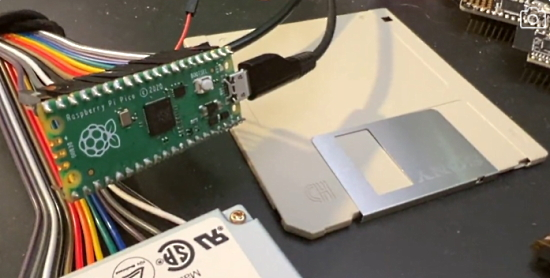](https://blog.adafruit.com/2022/01/01/low-cost-and-easily-available-floppy-interface-hardware-part-9-pico-power/)

Adafruit has been working diligently on using low cost microcontrollers to interface with floppy disk drives. There is active interest from the archival, maker and retrocomputer communities in working with floppy disks. Lots of folks want to get possibly valuable data off old disks. Ladyada has now developed Arduino code for the inexpensive Raspberry Pi Pico to work with 3.5" drives, with additional work on the way - [Adafruit Blog](https://blog.adafruit.com/2022/01/01/low-cost-and-easily-available-floppy-interface-hardware-part-9-pico-power/).

[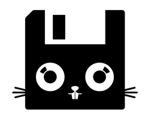](https://github.com/adafruit/Adafruit_Floppy)

Adafruit Floppy is a project to make a flexible, full-stack, open source hardware/software device for reading, archiving, accessing and duplicating floppy disk media - [GitHub](https://github.com/adafruit/Adafruit_Floppy).

## Coding the Fibonacci Micro 64 Board with CircuitPython

[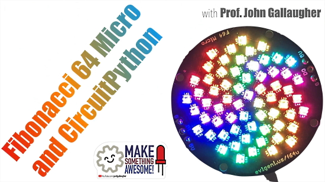](https://twitter.com/jasoncoon_/status/1476951202600476673)

John Gallaugher posts a video on programming the [Evil Genius Labs](http://evilgeniuslabs.org/) [Fibonacci Micro 64 LED board](https://www.evilgeniuslabs.org/fibonacci64-micro) using CircuitPython - [YouTube](https://youtu.be/JQoC_TL9RQU) and code - [GitHub](https://github.com/gallaugher/fib64).

[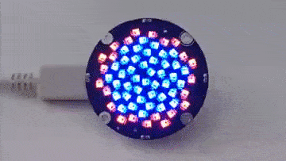](https://twitter.com/jasoncoon_/status/1476951202600476673)

Jason Coon has coded a simple demonstration reel for the Fibonacci Micro 64 using CircuitPython. "It runs really well on the QT Py RP2040, much slower on the SAMD21 and requires adafruit_pypixelbuf.mpy." It uses palette blending via the FancyLED library - [Twitter](https://twitter.com/jasoncoon_/status/1476951202600476673) and [GitHub](https://gist.github.com/jasoncoon/6884626781bac0f922c48d2a406a8a57).

## Making a RISC-V Chip to Run CircuitPython

[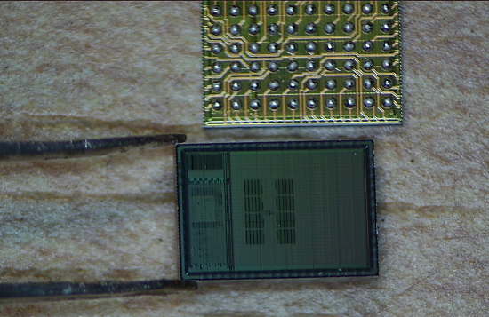](https://twitter.com/QwertyEmbedded/status/1476266183573733376)

The ultimate [goal of the PyFive project](https://pyfive-risc-v.github.io/) is to create a RISC-V based microcontroller with the ability to easily support CircuitPython. They have received some early silicon the last week - [Twitter Thread](https://twitter.com/QwertyEmbedded/status/1476266183573733376).

## The CircuitPython Online IDE Updates

[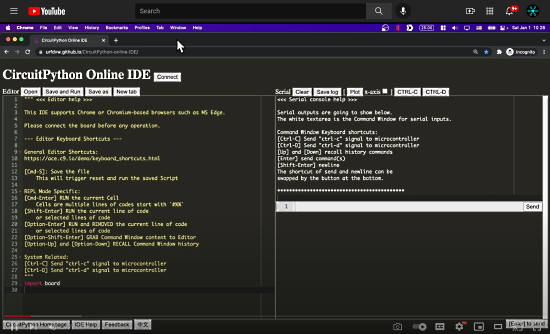](https://www.youtube.com/watch?v=QL8hLER7wAg)

The third-party CircuitPython Online integrated development environment (IDE) has received enough changes/upgrades for the developer to post a new introduction video - [YouTube](https://www.youtube.com/watch?v=QL8hLER7wAg).

You can see and use the development environment [here](https://urfdvw.github.io/CircuitPython-online-IDE/) and the GitHub repo is [here](https://github.com/urfdvw/CircuitPython-online-IDE).

The IDE supports Chrome or Chromium-based browsers such as Microsoft Edge. General editor shortcuts are in a document [here](https://ace.c9.io/demo/keyboard_shortcuts.html).

## CircuitPython Deep Dive Stream with Scott Shawcroft

Scott will return on Friday with his live show at 2pm Pacific.

You can see the latest video and past videos on the Adafruit YouTube channel under the Deep Dive playlist - [YouTube](https://www.youtube.com/playlist?list=PLjF7R1fz_OOXBHlu9msoXq2jQN4JpCk8A).

## CircuitPython Parsec

John Park’s CircuitPython Parsec returns next week.

Catch all the episodes in the [YouTube playlist](https://www.youtube.com/playlist?list=PLjF7R1fz_OOWFqZfqW9jlvQSIUmwn9lWr).

## KiCad 6.0.0 Out

[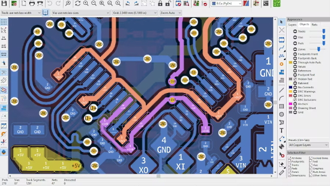](https://www.hackster.io/news/kicad-6-0-0-brings-a-new-look-new-features-and-a-much-improved-3d-viewer-for-your-pcb-designs-fa0b1d278a68)

KiCad, the open source electronic design automation package created by Jean-Pierre Charras in 1992, has hit a major milestone: the launch of KiCad 6.0.0, 30 years after the software's first release. The new release is available on the [KiCad website](https://www.kicad.org/blog/2021/12/KiCad-6.0.0-Release/), with downloads for a range of operating systems including Linux, macOS, and Windows available now; the source code, meanwhile, is published to [GitLab](https://gitlab.com/kicad/code/kicad) - [hackster.io](https://www.hackster.io/news/kicad-6-0-0-brings-a-new-look-new-features-and-a-much-improved-3d-viewer-for-your-pcb-designs-fa0b1d278a68).

## News from around the web!

[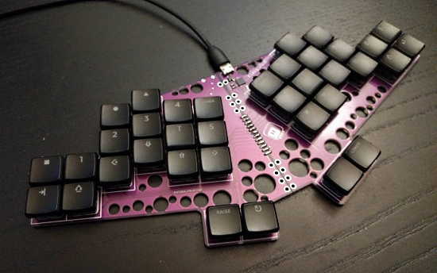](https://github.com/deshipu/ukeeb)

ukeeb: a new minimal CircuitPython keyboard library for CircuitPython- [GitHub](https://github.com/deshipu/ukeeb) and [Keyboard News Digest](https://kbd.news/Kleks-keyboard-1161.html).

Above is the kleks keyboard, a low-profile monoblock split with extreme pinky stagger and strange but cool-looking circular routing by Radomir (aka deshipu) who also authored ukeeb.

> Bounce Ball: Can't resist writing a tiny (CircuitPython) game in the mid of a DIY project - [YouTube](https://www.youtube.com/watch?v=20tLdkSwSWs) via [Twitter](https://twitter.com/River___Wang/status/1475897217496104966).

[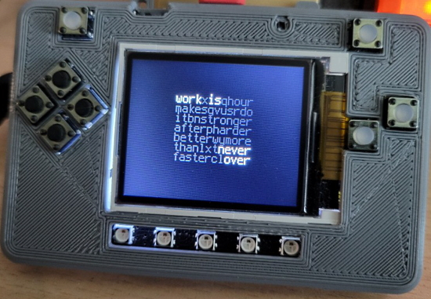](https://hackaday.io/project/183342-daft-punk-word-clock)

Daft Punk Word Clock using an Adafruit PyBadge and CircuitPython - [hackaday.io](https://hackaday.io/project/183342-daft-punk-word-clock) and [YouTube](https://youtu.be/4404ZOih_94).

> This tiny ESP32-S2 QT PY from Adafruit is gonna control a new pompom light controller in my bedroom! Can you believe it's this tiny & has WiFi!?! I'm sending requests directly to the hue api from the board!! - [Twitter](https://twitter.com/stephaniecodes/status/1478095917584728064).

[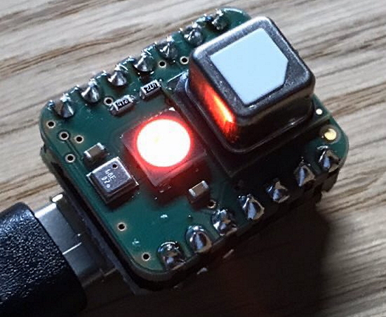](https://twitter.com/guido_burger/status/1477344824445571075)

A tiny CO2 monitor in QT Py format (also fits insofe an Arduino Mini Limited Edition) - [Twitter](https://twitter.com/guido_burger/status/1477344824445571075).

[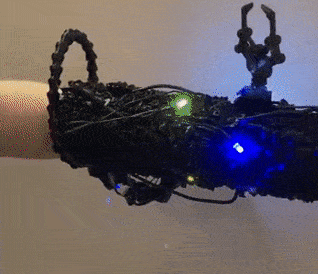](https://twitter.com/makercupboard/status/1477241357265776644)

A 3D printed, Raspberry Pi Pico-powered cosplay project programmed in CircuitPython - [Twitter](https://twitter.com/makercupboard/status/1477241357265776644).

[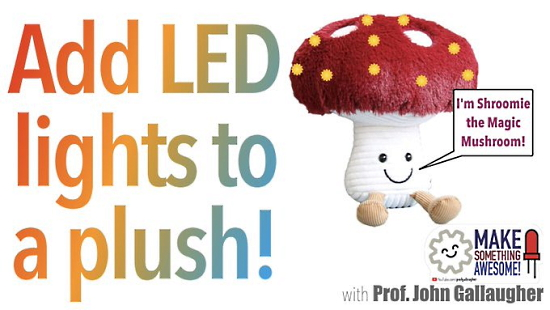](https://www.youtube.com/watch?v=CxwHz2U7oFU)

Add LED Lights to a Plush Using CircuitPython - [YouTube](https://www.youtube.com/watch?v=CxwHz2U7oFU) via [Twitter](https://twitter.com/gallaugher/status/1477059942217572359).

[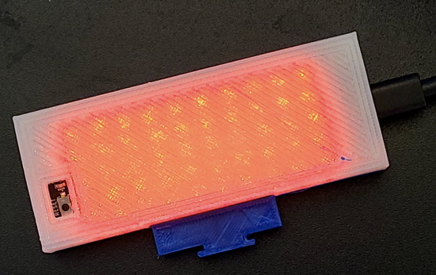](https://hackaday.io/project/182838-tallycircuitpy)

TallyCircuitPy: build network controlled tally lights for live cameras, status lights, ambient lighting, busy/free indicators - controllable over HTTP - [hackaday.io](https://hackaday.io/project/182838-tallycircuitpy).

Secrets of MicroPython: How to blink an LED - [Bhavesh Kakwani](https://bhave.sh/micropython-blink-led/).

Secrets of MicroPython: How to read a knob - [Bhavesh Kakwani](https://bhave.sh/micropython-read-knob/).

MIDI routing based on port, MIDI channel or MIDI command with Raspberry Pi Pico and MicroPython - [Twitter](https://twitter.com/diyelectromusic/status/1475865934686564357).

> I've been having a lot of fun with OpenMV MicroPython on Arduino Nano RP2040 Connect - [Twitter](https://twitter.com/ubidefeo/status/1476248690406969346).

[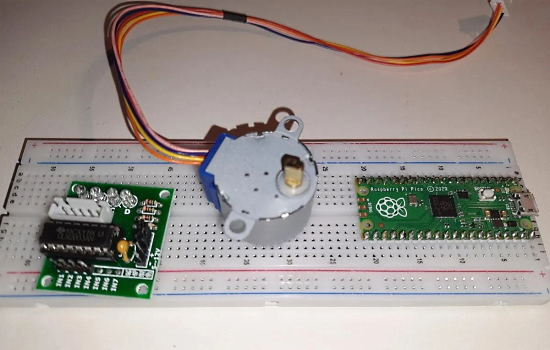](https://peppe8o.com/stepper-motor-with-raspberry-pi-pico-28byj-48-and-uln2003-wiring-and-micropython-code/)

Stepper Motor with Raspberry Pi Pico: 28BYJ-48 and ULN2003 wiring and MicroPython code - [peppe80](https://peppe8o.com/stepper-motor-with-raspberry-pi-pico-28byj-48-and-uln2003-wiring-and-micropython-code/).

The Pinouts Book is a free digital book created for designers and engineers as a quick reference for remembering the different pinout functions in your electronics projects - [pinouts.org](https://pinouts.org/). More - [n-o-d-e.net](https://n-o-d-e.net/pinouts.html).

[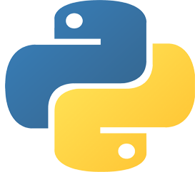](https://github.com/norvig/pytudes)

pytudes — Python programs, usually short, for perfecting particular programming skills - [GitHub](https://github.com/norvig/pytudes).

[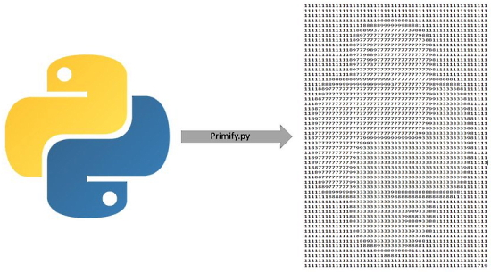](https://twitter.com/pycoders/status/1477266358811439108)

Primify: transform any image into a prime number that looks like the image if glanced upon from far away - [Twitter](https://twitter.com/pycoders/status/1477266358811439108) and [GitHub](https://github.com/LeviBorodenko/primify).

[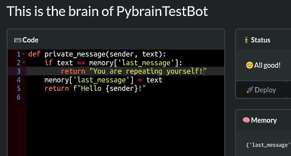](https://blog.adafruit.com/2022/01/03/telegram-bots-in-python-made-easy-telegram-python/)

Telegram bots in Python made easy - [Adafruit Blog](https://blog.adafruit.com/2022/01/03/telegram-bots-in-python-made-easy-telegram-python/).

Python Bindings: Calling C or C++ From Python - [Real Python](https://realpython.com/python-bindings-overview/).

The best things and stuff of 2021 - [Send More Parametics Blog](http://blog.fogus.me/2021/12/27/the-best-things-and-stuff-of-2021/).

CircuitPython Weekly for September 20th, 2021 [on YouTube](https://youtu.be/doQ_vNo7O04) and [notes](https://github.com/adafruit/adafruit-circuitpython-weekly-meeting/blob/main/2022/2022-01-03.md)

#ICYDNCI What was the most popular, most clicked link, in [last week's newsletter](https://www.adafruitdaily.com/2021/12/28/python-on-microcontrollers-newsletter-remember-what-the-dormouse-said-feed-your-head-feed-your-head-python-adafruit-circuitpython-micropython-thepsf/)? [RadioShack Phone Dialer - Red Box](https://hackaday.com/2004/09/05/radioshack-phone-dialer-red-box/).

## New Boards Supported by CircuitPython

The number of supported microcontrollers and Single Board Computers (SBC) grows every week. This section outlines which boards have been included in CircuitPython or added to [CircuitPython.org](https://circuitpython.org/).

This week, there were five new boards added!

- [BlueMicro833](https://circuitpython.org/board/bluemicro833/)
- [Feather ESP32-S2 with BME280 Sensor](https://circuitpython.org/board/adafruit_feather_esp32s2_bme280/)
- [PyKey44 Ergo Keyboard](https://circuitpython.org/board/jpconstantineau_pykey44/)
- [Tiny 2040 (2MB)](https://circuitpython.org/board/pimoroni_tiny2040_2mb/)
- [Maker Nano RP2040](https://circuitpython.org/board/cytron_maker_nano_rp2040/)

Looking to add a new board to CircuitPython? It's highly encouraged! Adafruit has four guides to help you do so:

- [How to Add a New Board to CircuitPython](https://learn.adafruit.com/how-to-add-a-new-board-to-circuitpython/overview)
- [How to add a New Board to the circuitpython.org website](https://learn.adafruit.com/how-to-add-a-new-board-to-the-circuitpython-org-website)
- [Adding a Single Board Computer to PlatformDetect for Blinka](https://learn.adafruit.com/adding-a-single-board-computer-to-platformdetect-for-blinka)
- [Adding a Single Board Computer to Blinka](https://learn.adafruit.com/adding-a-single-board-computer-to-blinka)

## New Learn Guides!

[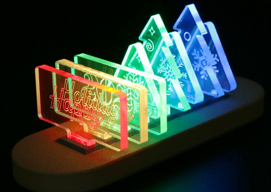](https://learn.adafruit.com/guides/latest)

[Animated Edge Lit Acrylic NeoPixel Lamp](https://learn.adafruit.com/acrylic-neopixel-lamp) from [Noe and Pedro](https://learn.adafruit.com/users/pixil3d)

[DIY Trinkey No-Soldering USB Air Quality Monitor](https://learn.adafruit.com/diy-trinkey-no-solder-air-quality-monitor) from [Carter Nelson](https://learn.adafruit.com/users/caternuson)

## CircuitPython Libraries!

CircuitPython support for hardware continues to grow. We are adding support for new sensors and breakouts all the time, as well as improving on the drivers we already have. As we add more libraries and update current ones, you can keep up with all the changes right here!

For the latest libraries, download the [Adafruit CircuitPython Library Bundle](https://circuitpython.org/libraries). For the latest community contributed libraries, download the [CircuitPython Community Bundle](https://github.com/adafruit/CircuitPython_Community_Bundle/releases).

If you'd like to contribute, CircuitPython libraries are a great place to start. Have an idea for a new driver? File an issue on [CircuitPython](https://github.com/adafruit/circuitpython/issues)! Have you written a library you'd like to make available? Submit it to the [CircuitPython Community Bundle](https://github.com/adafruit/CircuitPython_Community_Bundle). Interested in helping with current libraries? Check out the [CircuitPython.org Contributing page](https://circuitpython.org/contributing). We've included open pull requests and issues from the libraries, and details about repo-level issues that need to be addressed. We have a guide on [contributing to CircuitPython with Git and Github](https://learn.adafruit.com/contribute-to-circuitpython-with-git-and-github) if you need help getting started. You can also find us in the #circuitpython channels on the [Adafruit Discord](https://adafru.it/discord).

You can check out this [list of all the Adafruit CircuitPython libraries and drivers available](https://github.com/adafruit/Adafruit_CircuitPython_Bundle/blob/master/circuitpython_library_list.md). 

The current number of CircuitPython libraries is **341**!

**Updated Libraries!**

Here's this week's updated CircuitPython libraries:

 * [Adafruit_CircuitPython_BluefruitConnect](https://github.com/adafruit/Adafruit_CircuitPython_BluefruitConnect)
 * [Adafruit_CircuitPython_BoardTest](https://github.com/adafruit/Adafruit_CircuitPython_BoardTest)
 * [Adafruit_CircuitPython_BLE_BroadcastNet](https://github.com/adafruit/Adafruit_CircuitPython_BLE_BroadcastNet)
 * [Adafruit_CircuitPython_hashlib](https://github.com/adafruit/Adafruit_CircuitPython_hashlib)
 * [Adafruit_CircuitPython_Register](https://github.com/adafruit/Adafruit_CircuitPython_Register)
 * [Adafruit_CircuitPython_SI5351](https://github.com/adafruit/Adafruit_CircuitPython_SI5351)
 * [Adafruit_CircuitPython_RA8875](https://github.com/adafruit/Adafruit_CircuitPython_RA8875)
 * [Adafruit_CircuitPython_HTU21D](https://github.com/adafruit/Adafruit_CircuitPython_HTU21D)
 * [Adafruit_CircuitPython_ADXL34x](https://github.com/adafruit/Adafruit_CircuitPython_ADXL34x)
 * [Adafruit_CircuitPython_L3GD20](https://github.com/adafruit/Adafruit_CircuitPython_L3GD20)
 * [Adafruit_CircuitPython_SI7021](https://github.com/adafruit/Adafruit_CircuitPython_SI7021)
 * [Adafruit_CircuitPython_BMP3XX](https://github.com/adafruit/Adafruit_CircuitPython_BMP3XX)
 * [Adafruit_CircuitPython_AM2320](https://github.com/adafruit/Adafruit_CircuitPython_AM2320)
 * [Adafruit_CircuitPython_MLX90393](https://github.com/adafruit/Adafruit_CircuitPython_MLX90393)
 * [Adafruit_CircuitPython_MAX31855](https://github.com/adafruit/Adafruit_CircuitPython_MAX31855)
 * [Adafruit_CircuitPython_LSM9DS1](https://github.com/adafruit/Adafruit_CircuitPython_LSM9DS1)
 * [Adafruit_CircuitPython_seesaw](https://github.com/adafruit/Adafruit_CircuitPython_seesaw)
 * [Adafruit_CircuitPython_FocalTouch](https://github.com/adafruit/Adafruit_CircuitPython_FocalTouch)
 * [Adafruit_CircuitPython_BME680](https://github.com/adafruit/Adafruit_CircuitPython_BME680)
 * [Adafruit_CircuitPython_BME280](https://github.com/adafruit/Adafruit_CircuitPython_BME280)
 * [Adafruit_CircuitPython_MPL3115A2](https://github.com/adafruit/Adafruit_CircuitPython_MPL3115A2)
 * [Adafruit_CircuitPython_Fingerprint](https://github.com/adafruit/Adafruit_CircuitPython_Fingerprint)
 * [Adafruit_CircuitPython_RGB_Display](https://github.com/adafruit/Adafruit_CircuitPython_RGB_Display)
 * [Adafruit_CircuitPython_LSM9DS0](https://github.com/adafruit/Adafruit_CircuitPython_LSM9DS0)
 * [Adafruit_CircuitPython_FXOS8700](https://github.com/adafruit/Adafruit_CircuitPython_FXOS8700)
 * [Adafruit_CircuitPython_AS726x](https://github.com/adafruit/Adafruit_CircuitPython_AS726x)
 * [Adafruit_CircuitPython_BMP280](https://github.com/adafruit/Adafruit_CircuitPython_BMP280)
 * [Adafruit_CircuitPython_MMA8451](https://github.com/adafruit/Adafruit_CircuitPython_MMA8451)
 * [Adafruit_CircuitPython_FXAS21002C](https://github.com/adafruit/Adafruit_CircuitPython_FXAS21002C)
 * [Adafruit_CircuitPython_MCP230xx](https://github.com/adafruit/Adafruit_CircuitPython_MCP230xx)
 * [Adafruit_CircuitPython_HT16K33](https://github.com/adafruit/Adafruit_CircuitPython_HT16K33)
 * [Adafruit_CircuitPython_CursorControl](https://github.com/adafruit/Adafruit_CircuitPython_CursorControl)
 * [Adafruit_CircuitPython_Requests](https://github.com/adafruit/Adafruit_CircuitPython_Requests)
 * [Adafruit_CircuitPython_Motor](https://github.com/adafruit/Adafruit_CircuitPython_Motor)
 * [Adafruit_CircuitPython_WSGI](https://github.com/adafruit/Adafruit_CircuitPython_WSGI)
 * [Adafruit_CircuitPython_FancyLED](https://github.com/adafruit/Adafruit_CircuitPython_FancyLED)
 * [Adafruit_CircuitPython_asyncio](https://github.com/adafruit/Adafruit_CircuitPython_asyncio)
 * [Adafruit_CircuitPython_MiniMQTT](https://github.com/adafruit/Adafruit_CircuitPython_MiniMQTT)
 * [Adafruit_CircuitPython_PYOA](https://github.com/adafruit/Adafruit_CircuitPython_PYOA)
 * [Adafruit_CircuitPython_SHT31D](https://github.com/adafruit/Adafruit_CircuitPython_SHT31D)
 * [Adafruit_CircuitPython_BLE_Adafruit](https://github.com/adafruit/Adafruit_CircuitPython_BLE_Adafruit)
 * [Adafruit_CircuitPython_Touchscreen](https://github.com/adafruit/Adafruit_CircuitPython_Touchscreen)
 * [Adafruit_CircuitPython_ESP32SPI](https://github.com/adafruit/Adafruit_CircuitPython_ESP32SPI)
 * [Adafruit_CircuitPython_PIOASM](https://github.com/adafruit/Adafruit_CircuitPython_PIOASM)

## What’s the team up to this week?

What is the team up to this week? Let’s check in!

**Dan**

I made releases for both CircuitPython 7.1.0 final and 7.2.0-alpha.1 on Tuesday, December 28, 2021. 7.1.0 is a new stable release. 7.1.0-rc.0 had some mild changes, resulting in 7.1.0-rc.1, and 7.1.0-rc.1 seemed to be fine, so we re-released it as 7.1.0 final.

I'll be working on more `asyncio` examples for the [Cooperative Multitasking](https://learn.adafruit.com/cooperative-multitasking-in-circuitpython-with-asyncio) guide, and considering some new features for it as well.

**Jeff**

Rather than take on any substantial coding work, I instead finished up a 3D printed project with LEDs. A guide for making your own will probably be published on the Learn system by the time you read this, check for a link in the new guides section of the newsletter.

I've also taken some time to reflect on what we've accomplished together in 2021. For me, some of the high points of progress have been adding asyncio, getting "up to date" with MicroPython, and adding support for fun hardware like camera modules.

On a personal note, I'm grateful to get to know Damien and Jimmo from the MicroPython project a little better, and that I was able to visit Adafruit in NYC and participate in-person on an Ask an Engineer broadcast.

Thank you to everyone who has shared their CircuitPython projects in this newsletter, on Discord, Twitter, and elsewhere. It's incredible and humbling to know that I have played some small role in these meaningful, creative, insightful and inspiring projects.

**Scott**

This is a short week for me because I'm taking two days off around the holidays. The last two days have been spent working on Raspberry Pi Zero support for CircuitPython. This will broaden the supported boards and hopefully provide some perspective on the SD card issues that have been plaguing the broadcom port. I'm debugging the Zero support today and will hopefully get it going and out for merge today. :crossed_fingers:

I'll be kicking off #CircuitPython2022, so start brainstorming where you want CP to go in the new year.

## Upcoming events!

[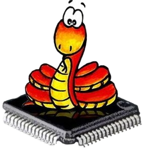](https://www.meetup.com/MicroPython-Meetup/)

The next MicroPython Meetup in Melbourne, Australia will be on January 26th – [Meetup](https://www.meetup.com/MicroPython-Meetup/). See the [blog](https://melbournemicropythonmeetup.github.io/) for notes.

PyCascades is a regional PyCon in the Pacific Northwest, celebrating the west coast Python developer and user community. Our organizing team includes members of the Vancouver, Seattle, and Portland Python user groups. DATES ANNOUNCED! February 5th-6th, 2022 The conference will take place on Saturday and the first half of Sunday, with the post-conference sprints following that on Sunday afternoon. After three amazing in-person conferences and an engaging online conference, we are ready to do it again! - [PyCascades 2022](https://2022.pycascades.com/).

PyCon US 2022 planning is underway. The team is planning to host the event in person with an online component. April 27, 2022 - May 5, 2022. Head over to the [PyCon US 2022 website](https://us.pycon.org/2022/) for details about the conference and more information about the sponsorship program - [PyCon Blog](https://pycon.blogspot.com/2022/10/pycon-us-2022-website-and-sponsorship.html).

PyCon Italia is the Italian conference on Python. Organised by Python Italia, it is one of the more important Python conferences in Europe. With over 700 attendees, the next edition will be June 2-5, 2022 - [Ticket Registration](https://pycon.it/en/tickets).

**Send Your Events In**

As for other events, with the COVID pandemic, most in-person events are postponed or cancelled. If you know of virtual events or events that may occur in the future, please let us know on Twitter with hashtag #CircuitPython or email to cpnews(at)adafruit(dot)com.

## Latest releases

CircuitPython's stable release is [7.1.0](https://github.com/adafruit/circuitpython/releases/latest) and its unstable release is [7.2.0-alpha.1](https://github.com/adafruit/circuitpython/releases). New to CircuitPython? Start with our [Welcome to CircuitPython Guide](https://learn.adafruit.com/welcome-to-circuitpython).

[20220103](https://github.com/adafruit/Adafruit_CircuitPython_Bundle/releases/latest) is the latest CircuitPython library bundle.

[v1.17](https://micropython.org/download) is the latest MicroPython release. Documentation for it is [here](http://docs.micropython.org/en/latest/pyboard/).

[3.10.1](https://www.python.org/downloads/) is the latest Python release. The latest pre-release version is [3.11.0a3](https://www.python.org/download/pre-releases/).

[2,737 Stars](https://github.com/adafruit/circuitpython/stargazers) Like CircuitPython? [Star it on GitHub!](https://github.com/adafruit/circuitpython)

## Call for help -- Translating CircuitPython is now easier than ever!

One important feature of CircuitPython is translated control and error messages. With the help of fellow open source project [Weblate](https://weblate.org/), we're making it even easier to add or improve translations. 

Sign in with an existing account such as GitHub, Google or Facebook and start contributing through a simple web interface. No forks or pull requests needed! As always, if you run into trouble join us on [Discord](https://adafru.it/discord), we're here to help.

## jobs.adafruit.com - Find a dream job, find great candidates!

[jobs.adafruit.com](https://jobs.adafruit.com/) has returned and folks are posting their skills (including CircuitPython) and companies are looking for talented makers to join their companies - from Digi-Key, to Hackaday, Micro Center, Raspberry Pi and more.

**Job of the Week**

Open Source Circuitpython driver for NFC chip PN532 and PN7150, must include point-to-point communication - Envester - [Adafruit Jobs Board](https://jobs.adafruit.com/job/open-source-circuitpython-driver-for-nfc-chip-pn532-and-pn7150-must-include-point-to-point-communication/).

## 32,472 thanks!

The Adafruit Discord community, where we do all our CircuitPython development in the open, reached over 32,472 humans - thank you!  Adafruit believes Discord offers a unique way for Python on hardware folks to connect. Join today at [https://adafru.it/discord](https://adafru.it/discord).

## ICYMI - In case you missed it

Python on hardware is the Adafruit Python video-newsletter-podcast! The news comes from the Python community, Discord, Adafruit communities and more and is broadcast on ASK an ENGINEER Wednesdays. The complete Python on Hardware weekly videocast [playlist is here](https://www.youtube.com/playlist?list=PLjF7R1fz_OOXRMjM7Sm0J2Xt6H81TdDev). The video podcast is on [iTunes](https://itunes.apple.com/us/podcast/python-on-hardware/id1451685192?mt=2), [YouTube](http://adafru.it/pohepisodes), [IGTV (Instagram TV](https://www.instagram.com/adafruit/channel/)), and [XML](https://itunes.apple.com/us/podcast/python-on-hardware/id1451685192?mt=2).

[The weekly community chat on Adafruit Discord server CircuitPython channel - Audio / Podcast edition](https://itunes.apple.com/us/podcast/circuitpython-weekly-meeting/id1451685016) - Audio from the Discord chat space for CircuitPython, meetings are usually Mondays at 2pm ET, this is the audio version on [iTunes](https://itunes.apple.com/us/podcast/circuitpython-weekly-meeting/id1451685016), Pocket Casts, [Spotify](https://adafru.it/spotify), and [XML feed](https://adafruit-podcasts.s3.amazonaws.com/circuitpython_weekly_meeting/audio-podcast.xml).

## Codecademy "Learn Hardware Programming with CircuitPython"

Codecademy, an online interactive learning platform used by more than 45 million people, has teamed up with Adafruit to create a coding course, “Learn Hardware Programming with CircuitPython”. The course is now available in the [Codecademy catalog](https://www.codecademy.com/learn/learn-circuitpython?utm_source=adafruit&utm_medium=partners&utm_campaign=circuitplayground&utm_content=pythononhardwarenewsletter).

## Contribute!

The CircuitPython Weekly Newsletter is a CircuitPython community-run newsletter emailed every Tuesday. The complete [archives are here](https://www.adafruitdaily.com/category/circuitpython/). It highlights the latest CircuitPython related news from around the web including Python and MicroPython developments. To contribute, edit next week's draft [on GitHub](https://github.com/adafruit/circuitpython-weekly-newsletter/tree/gh-pages/_drafts) and [submit a pull request](https://help.github.com/articles/editing-files-in-your-repository/) with the changes. You may also tag your information on Twitter with #CircuitPython. 

Join the Adafruit [Discord](https://adafru.it/discord) or [post to the forum](https://forums.adafruit.com/viewforum.php?f=60) if you have questions.
