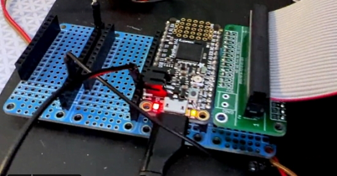
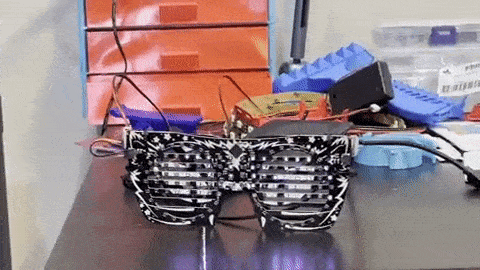
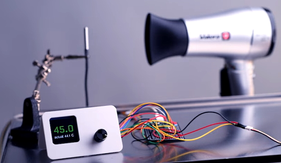
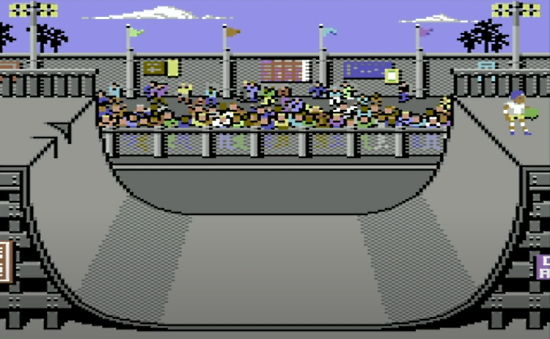
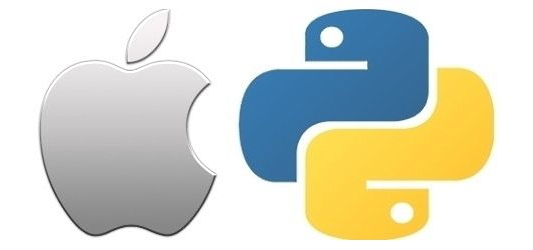
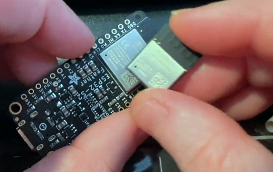
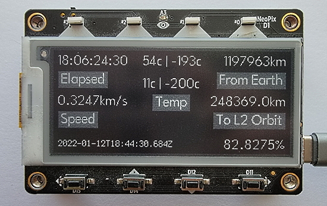
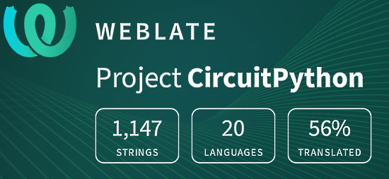

- [X] Kattni updates
- [ ] change date
- [ ] update title
- [ ] Feature story
- [ ] Update  for images
- [ ] Update ICYDNCI
- [ ] All images 550w max only
- [ ] Link "View this email in your browser."

News Sources

- [python.org](https://www.python.org/)
- [Python Insider - dev team blog](https://pythoninsider.blogspot.com/)
- [MicroPython Meetup Blog](https://melbournemicropythonmeetup.github.io/)
- [hackaday.io newest projects MicroPython](https://hackaday.io/projects?tag=micropython&sort=date) and [CircuitPython](https://hackaday.io/projects?tag=circuitpython&sort=date)
- [hackaday CircuitPython](https://hackaday.com/blog/?s=circuitpython) and [MicroPython](https://hackaday.com/blog/?s=micropython)
- [hackster.io CircuitPython](https://www.hackster.io/search?q=circuitpython&i=projects&sort_by=most_recent) and [MicroPython](https://www.hackster.io/search?q=micropython&i=projects&sort_by=most_recent)

Template last updated on 2022-01-10 Tweak board section

View this email in your browser.

Welcome to the latest Python on Microcontrollers newsletter! 

We're on [Discord](https://discord.gg/HYqvREz), [Twitter](https://twitter.com/search?q=circuitpython&src=typed_query&f=live), and for past newsletters - [view them all here](https://www.adafruitdaily.com/category/circuitpython/). If you're reading this on the web, [subscribe here](https://www.adafruitdaily.com/). Here's the news this week:

## Headline Article

text - [site](url).

## CircuitPython2022 Updates

Here's the CircuitPython 2022 feedback received to date.

* CycleMatch’s (aka kmatch) thoughts [on Twitter](https://twitter.com/CycleMatch/status/1477365350484393985?s=20)
* Jeff (aka jepler) posted to [his blog](https://emergent.unpythonic.net/01641354260).
* Dexter Starboard (aka rsbohn) wrote a [short gist](https://gist.github.com/rsbohn/6e00f4b3e5886d6a9cbcbfcc9d00947e)
* Kelly (aka ksprayberry) posted to [the forum](https://forums.adafruit.com/viewtopic.php?f=60&t=186938).
* Matt Kojetin wrote [a comment on the kick-off blog post](https://blog.adafruit.com/2022/01/01/circuitpython-in-2022-circuitpython2022-circuitpython/#comment-459352).
* Pierre Constantineau has written [a blog post that dives deep into keyboard software including CircuitPython](http://bluemicro.jpconstantineau.com/blog/State%20of%20BlueMicro%202022/).
* blakebr posted [three](https://forums.adafruit.com/viewtopic.php?f=60&t=187068#p906019) [different](https://forums.adafruit.com/viewtopic.php?f=60&t=187120#p906272) [topics](https://forums.adafruit.com/viewtopic.php?f=60&t=187125#p906287) on the forum.
* retiredwizard also posted to [the forum about using CircuitPython REPL directly to change files and protecting sensitive data](https://forums.adafruit.com/viewtopic.php?f=60&t=187126#p906289).
* mlewus [posted on the forum](https://forums.adafruit.com/viewtopic.php?f=60&t=187151)
* JohnHind also [posted to the forum](https://forums.adafruit.com/viewtopic.php?f=60&t=187156).
* Phil (PT) from Adafruit [talked on Ask An Engineer about #CircuitPython2022](https://www.youtube.com/watch?v=hT_P4vcqskY).
* Patrick (@askpatrickw) posted [a gist with two new projects and a review of last years](https://gist.github.com/askpatrickw/9d53e45095b91aa750d622b8dbb031d1).
* Scott (@tannewt) posted [#CircuitPython2020 to the blog](https://blog.adafruit.com/2022/01/13/scotts-circuitpython2022-tannewt/)
* [Anne's email](https://blog.adafruit.com/2022/01/14/annes-circuitpython2022-anne_engineer/) on #CircuitPython2022

The CircuitPython Team wants to hear from you. When you post, please add #CircuitPython2022 and email circuitpython2022@adafruit.com to let us know about your post - [More information](https://blog.adafruit.com/2022/01/01/circuitpython-in-2022-circuitpython2022-circuitpython/).

## CircuitPython 7.1.1 Released

CircuitPython 7.1.1, the latest bugfix revision of CircuitPython, is the current stable release. It has fixes for RGBMatrix on RP2040 and PDMIn (microphone input) on SAMx boards, such as Circuit Playground Express. There are no other changes; unless you are affected by these problems, you do not need to upgrade from 7.1.0. - [Adafruit Blog](https://blog.adafruit.com/2022/01/14/circuitpython-7-1-1-released/) and [GitHub](https://github.com/adafruit/circuitpython/releases).

## Reading Floppy Disks in CircuitPython

jepler just created a build of CircuitPython with the new native ‘adafruit_floppy’ module which implements MFM decoding ‘on the fly’ to provide Python-native filesystem support for floppy drives! You can now store files and code that is read or executed off of a floppy disk. Adafruit whipped up a quick demo that lists the files on a disk and pages through any textfiles it finds on these FAT12 disks. Arduino libraries and more CircuitPython capability are being worked on at the moment - [Adafruit Blog](https://blog.adafruit.com/2022/01/11/native-floppy-disk-support-coming-soon-to-circuitpython/), [YouTube](https://youtu.be/bomzzq6j4fA) and [Twitter](https://twitter.com/adafruit/status/1481116109277483015).

In related work, Adafruit also demonstrates using TinyUSB and Arduino to make a USB mass storage floppy drive on Windows. Most of us have not seen a Drive A: on their computers in many years - [Adafruit Blog](https://blog.adafruit.com/2022/01/14/using-tinyusb-and-arduino-to-make-a-usb-mass-storage-floppy-%f0%9f%92%be-drive/), [Hackster.io](https://www.hackster.io/news/adafruit-brings-floppy-disk-support-to-arduino-boards-creates-an-open-source-usb-floppy-drive-acd1a09f5cbf) and [YouTube](https://youtu.be/rPW6axdsajg).

## The CircuitPython Show

The CircuitPython Show  is a new independent podcast, hosted by Paul Cutler, focused on the people doing awesome things with CircuitPython. Each episode features Paul in conversation with a guest for a twenty to thirty minute interview - [CircuitPythonShow](https://circuitpythonshow.com/), [Blog Post](https://paulcutler.org/posts/2022/01/introducing-the-circuitpython-show/) and [Twitter](https://twitter.com/circuitpyshow).

## Feature

text - [site](url).

## CircuitPython Deep Dive Stream with Scott Shawcroft

[This week](link), Scott streams his work on .

You can see the latest video and past videos on the Adafruit YouTube channel under the Deep Dive playlist - [YouTube](https://www.youtube.com/playlist?list=PLjF7R1fz_OOXBHlu9msoXq2jQN4JpCk8A).

## CircuitPython Parsec

John Park’s CircuitPython Parsec: 

* Capacitive Touch Sensing - [Adafruit Blog](https://blog.adafruit.com/2022/01/14/john-parks-circuitpython-parsec-capacitive-touch-sensing-adafruit-johnedgarpark-adafruit-circuitpython/) and [YouTube](https://youtu.be/hg3XMPUVig8).

Catch all the episodes in the [YouTube playlist](https://www.youtube.com/playlist?list=PLjF7R1fz_OOWFqZfqW9jlvQSIUmwn9lWr).

## News from around the web!

> I finally finished putting together my LED glasses from the last Adafruit Adabox and setup the scrolling text over Bluetooth in an iOS app - so cool!  (Of course the text says “Subscribe to the CircuitPython Show" - [Twitter](https://twitter.com/prcutler/status/1481609768968011778).

text - [site](url).

text - [site](url).

text - [site](url).

text - [site](url).

text - [site](url).

text - [site](url).

text - [site](url).

text - [site](url).

text - [site](url).

text - [site](url).

text - [site](url).

text - [site](url).

text - [site](url).

text - [site](url).

A proportional integral derivative (PID) controller running a home-made precision heater with a Raspberry Pi Pico and MicroPython - [Hackaday](https://hackaday.com/2022/01/13/pico-does-pid/), [GitHub](https://github.com/veebch/heat-o-matic) and [YouTube](https://www.youtube.com/watch?v=rooKTWVzXWw).

Coding an homage to Skate or Die! on Raspberry Pi in Python - [Raspberry Pi News](https://www.raspberrypi.com/news/code-an-homage-to-skate-or-die-wireframe-58/).

5 Ways To Use Python On An iPad - [David Amos](https://davidamos.dev/5-ways-to-use-python-on-an-ipad/).

text - [site](url).

text - [site](url).

**#ICYDNCI What was the most popular, most clicked link, in [last week's newsletter](https://link)? [title](url).**

## Coming soon

New ESP32 Pico V3 02 modules are small enough to place on ItsyBitsy size boards in addition to Feather - [Twitter](https://twitter.com/adafruit/status/1481903103096102913).

text - [site](url).

## New Boards Supported by CircuitPython

The number of supported microcontrollers and Single Board Computers (SBC) grows every week. This section outlines which boards have been included in CircuitPython or added to [CircuitPython.org](https://circuitpython.org/).

This week, there were (#/no) new boards added!

- [Board name](url)
- [Board name](url)
- [Board name](url)

*Note: For non-Adafruit boards, please use the support forums of the board manufacturer for assistance, as Adafruit does not have the hardware to assist in troubleshooting.*

Looking to add a new board to CircuitPython? It's highly encouraged! Adafruit has four guides to help you do so:

- [How to Add a New Board to CircuitPython](https://learn.adafruit.com/how-to-add-a-new-board-to-circuitpython/overview)
- [How to add a New Board to the circuitpython.org website](https://learn.adafruit.com/how-to-add-a-new-board-to-the-circuitpython-org-website)
- [Adding a Single Board Computer to PlatformDetect for Blinka](https://learn.adafruit.com/adding-a-single-board-computer-to-platformdetect-for-blinka)
- [Adding a Single Board Computer to Blinka](https://learn.adafruit.com/adding-a-single-board-computer-to-blinka)

## New Learn Guides!

[MagTag James Webb Telescope Status](https://learn.adafruit.com/magtag-james-webb-telescope-status) from [Tim C](https://learn.adafruit.com/users/Foamyguy)

[Navi10 MacroPad with KB2040 and KMK CircuitPython keyboard firmware](https://learn.adafruit.com/navi10-macropad-with-kb2040-and-kmk-circuitpython-keyboard-firmware) from [Eva Herrada](https://learn.adafruit.com/users/eherrada)

[PyPortal WFH Busy Sounds Simulator](https://learn.adafruit.com/pyportal-wfh-busy-sounds-simulator) from [Tim C](https://learn.adafruit.com/users/Foamyguy)

[CircuitPython on Raspberry Pi (Bare Metal / No OS)](https://learn.adafruit.com/circuitpython-on-raspberry-pi-bare-metal-no-os) from [Scott Shawcroft](https://learn.adafruit.com/users/tannewt)

## CircuitPython Libraries!

CircuitPython support for hardware continues to grow. We are adding support for new sensors and breakouts all the time, as well as improving on the drivers we already have. As we add more libraries and update current ones, you can keep up with all the changes right here!

For the latest libraries, download the [Adafruit CircuitPython Library Bundle](https://circuitpython.org/libraries). For the latest community contributed libraries, download the [CircuitPython Community Bundle](https://github.com/adafruit/CircuitPython_Community_Bundle/releases).

If you'd like to contribute, CircuitPython libraries are a great place to start. Have an idea for a new driver? File an issue on [CircuitPython](https://github.com/adafruit/circuitpython/issues)! Have you written a library you'd like to make available? Submit it to the [CircuitPython Community Bundle](https://github.com/adafruit/CircuitPython_Community_Bundle). Interested in helping with current libraries? Check out the [CircuitPython.org Contributing page](https://circuitpython.org/contributing). We've included open pull requests and issues from the libraries, and details about repo-level issues that need to be addressed. We have a guide on [contributing to CircuitPython with Git and Github](https://learn.adafruit.com/contribute-to-circuitpython-with-git-and-github) if you need help getting started. You can also find us in the #circuitpython channels on the [Adafruit Discord](https://adafru.it/discord).

You can check out this [list of all the Adafruit CircuitPython libraries and drivers available](https://github.com/adafruit/Adafruit_CircuitPython_Bundle/blob/master/circuitpython_library_list.md). 

The current number of CircuitPython libraries is **344**!

**New Libraries!**

Here's this week's new CircuitPython libraries:

 * [Adafruit_CircuitPython_24LC32](https://github.com/adafruit/Adafruit_CircuitPython_24LC32)

**Updated Libraries!**

Here's this week's updated CircuitPython libraries:

 * [Adafruit_CircuitPython_Waveform](https://github.com/adafruit/Adafruit_CircuitPython_Waveform)
 * [Adafruit_CircuitPython_AVRprog](https://github.com/adafruit/Adafruit_CircuitPython_AVRprog)
 * [Adafruit_CircuitPython_PCA9685](https://github.com/adafruit/Adafruit_CircuitPython_PCA9685)
 * [Adafruit_CircuitPython_APDS9960](https://github.com/adafruit/Adafruit_CircuitPython_APDS9960)
 * [Adafruit_CircuitPython_OV5640](https://github.com/adafruit/Adafruit_CircuitPython_OV5640)
 * [Adafruit_CircuitPython_MMA8451](https://github.com/adafruit/Adafruit_CircuitPython_MMA8451)
 * [Adafruit_CircuitPython_DPS310](https://github.com/adafruit/Adafruit_CircuitPython_DPS310)
 * [Adafruit_CircuitPython_HTS221](https://github.com/adafruit/Adafruit_CircuitPython_HTS221)
 * [Adafruit_CircuitPython_HT16K33](https://github.com/adafruit/Adafruit_CircuitPython_HT16K33)
 * [Adafruit_CircuitPython_EMC2101](https://github.com/adafruit/Adafruit_CircuitPython_EMC2101)
 * [Adafruit_CircuitPython_Wiznet5k](https://github.com/adafruit/Adafruit_CircuitPython_Wiznet5k)
 * [Adafruit_CircuitPython_OneWire](https://github.com/adafruit/Adafruit_CircuitPython_OneWire)
 * [Adafruit_CircuitPython_Requests](https://github.com/adafruit/Adafruit_CircuitPython_Requests)
 * [Adafruit_CircuitPython_DRV2605](https://github.com/adafruit/Adafruit_CircuitPython_DRV2605)
 * [Adafruit_CircuitPython_PIOASM](https://github.com/adafruit/Adafruit_CircuitPython_PIOASM)
 * [Adafruit_Python_PlatformDetect](https://github.com/adafruit/Adafruit_Python_PlatformDetect)
 * [CircuitPython_Community_Bundle](https://github.com/adafruit/CircuitPython_Community_Bundle)

## What’s the team up to this week?

What is the team up to this week? Let’s check in!

**Dan**

I fixed a longstanding problem with `audiobusio.PDMIn`, which reads data from PDM digital microphones, such as the one on the Circuit Playground Express. I'm now working on a deep-sleep power consumption issue with ESP32-S2.

Either or both of these deserve a CircuitPython 7.1.1 release, so I'll do so after we figure out what should be in it.

**Jeff**

Great success with floppies! With my work in progress branch, I've been able to mount 1.44MB (3.5") and 1.2MB (5.25") floppies and access the files inside from CircuitPython! Next up, I'll make the code usable from both CircuitPython and Arduino and then make a pull request to add it to CircuitPython.

If you want to ask me anything about the MFM floppy encoding, do it now, because in a week or so from now the knowledge will vanish from my working memory, safely sealed away in Adafruit_Floppy.

You can watch a demo of the code in action from a segment on last week's [Ask an Engineer](https://blog.adafruit.com/2022/01/13/the-python-on-hardware-weekly-video-january-12-2022-circuitpython-python-floppy-adafruit/).

**Kattni**

This week I published the basics of the [Adafruit ESP32-S2 TFT Feather](https://learn.adafruit.com/adafruit-esp32-s2-tft-feather) guide. We wanted to get something live so folks who picked up this board had a place to get started. Keep an eye on the guide for the rest of the content, coming soon!

I also updated the Factory Reset page for the ESP32-S2 to have all the info needed for a factory reset or a bootloader repair, and updated the Install the UF2 Bootloader page to point to that so all the information is in one place. The process is identical, so we ran into having two pages with the same lengthy info on them. Not anymore!

Next up is finishing up the rest of the content for the QT Py ESP32-S2 guide, followed by the content for the TFT Feather guide. It involves a bit of bouncing around, but I'm working to get everything good to go!

**Scott**

Last week I wrapped up my Raspberry Pi work for a while. I wrote [a Learn guide](https://learn.adafruit.com/circuitpython-on-raspberry-pi-bare-metal-no-os) to get folks going using it. I also merged in support for the original Zero and Zero W (not supporting WiFi.)

After wrapping this up, I started working on the ESP32-S3 in CircuitPython. I've started by reworking the sdkconfig generation to support different target platforms. After wrapping that up, I'll be debugging the problems with WiFi on the S3.

Lastly, I'll be finishing my #CircuitPython2022 post so that I can cover it tomorrow in my second Deep Dive of the new year. In [the first Deep Dive I reviewed last year's #CircuitPython2021](https://www.youtube.com/watch?v=y5Owgls-SA8). 

## Upcoming events!

The next MicroPython Meetup in Melbourne will be on January 26th – [Meetup](https://www.meetup.com/MicroPython-Meetup/).  See the [blog](https://melbournemicropythonmeetup.github.io/) for past notes.

PyCascades is a regional PyCon in the Pacific Northwest, celebrating the west coast Python developer and user community. Our organizing team includes members of the Vancouver, Seattle, and Portland Python user groups. DATES ANNOUNCED! February 5th-6th, 2022 The conference will take place on Saturday and the first half of Sunday, with the post-conference sprints following that on Sunday afternoon. After three amazing in-person conferences and an engaging online conference, we are ready to do it again! - [PyCascades 2022](https://2022.pycascades.com/).

PyCon US 2022 planning is underway. The team is planning to host the event in person with an online component. April 27, 2022 - May 5, 2022. Head over to the [PyCon US 2022 website](https://us.pycon.org/2022/) for details about the conference and more information about the sponsorship program - [PyCon Blog](https://pycon.blogspot.com/2022/10/pycon-us-2022-website-and-sponsorship.html).

PyCon Italia is the Italian conference on Python. Organised by Python Italia, it is one of the more important Python conferences in Europe. With over 700 attendees, the next edition will be June 2-5, 2022 - [Ticket Registration](https://pycon.it/en/tickets).

**Send Your Events In**

As for other events, with the COVID pandemic, most in-person events are postponed or cancelled. If you know of virtual events or events that may occur in the future, please let us know on Twitter with hashtag #CircuitPython or email to cpnews(at)adafruit(dot)com.

## Latest releases

CircuitPython's stable release is [#.#.#](https://github.com/adafruit/circuitpython/releases/latest) and its unstable release is [#.#.#-##.#](https://github.com/adafruit/circuitpython/releases). New to CircuitPython? Start with our [Welcome to CircuitPython Guide](https://learn.adafruit.com/welcome-to-circuitpython).

[2022####](https://github.com/adafruit/Adafruit_CircuitPython_Bundle/releases/latest) is the latest CircuitPython library bundle.

[v#.#.#](https://micropython.org/download) is the latest MicroPython release. Documentation for it is [here](http://docs.micropython.org/en/latest/pyboard/).

[#.#.#](https://www.python.org/downloads/) is the latest Python release. The latest pre-release version is [#.#.#](https://www.python.org/download/pre-releases/).

[#### Stars](https://github.com/adafruit/circuitpython/stargazers) Like CircuitPython? [Star it on GitHub!](https://github.com/adafruit/circuitpython)

## Call for help -- Translating CircuitPython is now easier than ever!

One important feature of CircuitPython is translated control and error messages. With the help of fellow open source project [Weblate](https://weblate.org/), we're making it even easier to add or improve translations. 

Sign in with an existing account such as GitHub, Google or Facebook and start contributing through a simple web interface. No forks or pull requests needed! As always, if you run into trouble join us on [Discord](https://adafru.it/discord), we're here to help.

## jobs.adafruit.com - Find a dream job, find great candidates!

[jobs.adafruit.com](https://jobs.adafruit.com/) has returned and folks are posting their skills (including CircuitPython) and companies are looking for talented makers to join their companies - from Digi-Key, to Hackaday, Micro Center, Raspberry Pi and more.

**Job of the Week**

text - [Adafruit Jobs Board](https://jobs.adafruit.com/).

## NUMBER thanks!

The Adafruit Discord community, where we do all our CircuitPython development in the open, reached over NUMBER humans - thank you!  Adafruit believes Discord offers a unique way for Python on hardware folks to connect. Join today at [https://adafru.it/discord](https://adafru.it/discord).

## ICYMI - In case you missed it

Python on hardware is the Adafruit Python video-newsletter-podcast! The news comes from the Python community, Discord, Adafruit communities and more and is broadcast on ASK an ENGINEER Wednesdays. The complete Python on Hardware weekly videocast [playlist is here](https://www.youtube.com/playlist?list=PLjF7R1fz_OOXRMjM7Sm0J2Xt6H81TdDev). The video podcast is on [iTunes](https://itunes.apple.com/us/podcast/python-on-hardware/id1451685192?mt=2), [YouTube](http://adafru.it/pohepisodes), [IGTV (Instagram TV](https://www.instagram.com/adafruit/channel/)), and [XML](https://itunes.apple.com/us/podcast/python-on-hardware/id1451685192?mt=2).

[The weekly community chat on Adafruit Discord server CircuitPython channel - Audio / Podcast edition](https://itunes.apple.com/us/podcast/circuitpython-weekly-meeting/id1451685016) - Audio from the Discord chat space for CircuitPython, meetings are usually Mondays at 2pm ET, this is the audio version on [iTunes](https://itunes.apple.com/us/podcast/circuitpython-weekly-meeting/id1451685016), Pocket Casts, [Spotify](https://adafru.it/spotify), and [XML feed](https://adafruit-podcasts.s3.amazonaws.com/circuitpython_weekly_meeting/audio-podcast.xml).

## Codecademy "Learn Hardware Programming with CircuitPython"

Codecademy, an online interactive learning platform used by more than 45 million people, has teamed up with Adafruit to create a coding course, “Learn Hardware Programming with CircuitPython”. The course is now available in the [Codecademy catalog](https://www.codecademy.com/learn/learn-circuitpython?utm_source=adafruit&utm_medium=partners&utm_campaign=circuitplayground&utm_content=pythononhardwarenewsletter).

## Contribute!

The CircuitPython Weekly Newsletter is a CircuitPython community-run newsletter emailed every Tuesday. The complete [archives are here](https://www.adafruitdaily.com/category/circuitpython/). It highlights the latest CircuitPython related news from around the web including Python and MicroPython developments. To contribute, edit next week's draft [on GitHub](https://github.com/adafruit/circuitpython-weekly-newsletter/tree/gh-pages/_drafts) and [submit a pull request](https://help.github.com/articles/editing-files-in-your-repository/) with the changes. You may also tag your information on Twitter with #CircuitPython. 

Join the Adafruit [Discord](https://adafru.it/discord) or [post to the forum](https://forums.adafruit.com/viewforum.php?f=60) if you have questions.
