- [X] Kattni updates
- [ ] change date
- [ ] update title
- [ ] Feature story
- [ ] Update  for images
- [ ] Update ICYDNCI
- [ ] All images 550w max only
- [ ] Link "View this email in your browser."

News Sources

- [python.org](https://www.python.org/)
- [Python Insider - dev team blog](https://pythoninsider.blogspot.com/)
- [MicroPython Meetup Blog](https://melbournemicropythonmeetup.github.io/)
- [hackaday.io newest projects MicroPython](https://hackaday.io/projects?tag=micropython&sort=date) and [CircuitPython](https://hackaday.io/projects?tag=circuitpython&sort=date)
- [hackaday CircuitPython](https://hackaday.com/blog/?s=circuitpython) and [MicroPython](https://hackaday.com/blog/?s=micropython)
- [hackster.io CircuitPython](https://www.hackster.io/search?q=circuitpython&i=projects&sort_by=most_recent) and [MicroPython](https://www.hackster.io/search?q=micropython&i=projects&sort_by=most_recent)

View this email in your browser.

Welcome to the latest Python on Microcontrollers newsletter! 

We're on [Discord](https://discord.gg/HYqvREz), [Twitter](https://twitter.com/search?q=circuitpython&src=typed_query&f=live), and for past newsletters - [view them all here](https://www.adafruitdaily.com/category/circuitpython/). If you're reading this on the web, [subscribe here](https://www.adafruitdaily.com/). Here's the news this week:

## Floppy Interfacing Hack Chat with Adafruit and Hackaday.io

[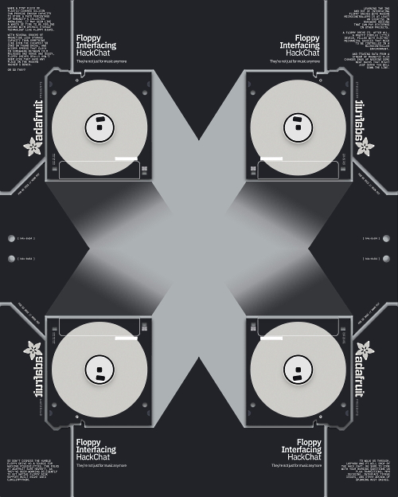](https://hackaday.io/event/183426-floppy-interfacing-hack-chat-with-adafruit)

Adafruit's Limor "Ladyada" Fried, Jeff Epler, and Phillip Torrone will host the Hack Chat on Wednesday, February 2 at noon Pacific. Time zones got you down? Try the [handy time zone converter](https://www.timeanddate.com/countdown/generic?iso=20220202T12&p0=224&msg=Floppy+Interfacing+Hack+Chat&font=cursive).

When a tiny fleck of plastic-covered silicon can provide enough capacity to store a fair percentage of humanity's collected knowledge, it may seem like a waste of time to be fooling around with archaic storage technology like floppy disks. With several orders of magnitude less storage capacity than something like even the cheapest SD card or thumb drive, and access speeds that clock in somewhere between cold molasses and horse and buggy, floppy drives really don't seem like they have any place on the modern hacker's bench.

Or do they? Learning the ins and out of interfacing floppy drives with modern microcontrollers is at least an exercise in hardware hacking that can pay dividends in other projects. A floppy drive is, after all, a pretty complex little device, filled with electromechanical goodies that need to be controlled in a microcontroller environment. And teasing data from a stream of magnetic flux changes ends up needing some neat hacks that might just serve you well down the line.

So don't dismiss the humble floppy drive as a source for hacking possibilities. The folks at Adafruit sure haven't, as they've been working diligently to get [native floppy disk support built right into CircuitPython](https://blog.adafruit.com/2022/01/11/native-floppy-disk-support-coming-soon-to-circuitpython/). To walk us through how they got where they are now, Ladyada, Jeff, and PT will drop by the Hack Chat. Be sure to come with your burning questions on flux transitions, MFM decoding, interface timing issues, and other arcana of spinning rust drives.

More information - [hackaday.io](https://hackaday.io/event/183426-floppy-interfacing-hack-chat-with-adafruit).

## Apple Finally Removing Python 2 in macOS 12.3

[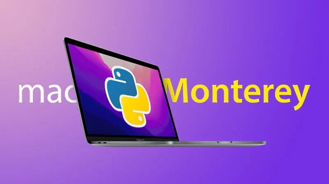](https://www.macrumors.com/2022/01/28/apple-removing-python-2-in-macos-12-3/)

Apple will no longer bundle Python 2.7 with macOS 12.3, according to developer release notes for the upcoming software update. Python 2 has not been supported since January 1, 2020 and no longer receives any bug fixes, security patches, or other changes - [MacRumors](https://www.macrumors.com/2022/01/28/apple-removing-python-2-in-macos-12-3/) and [Release Notes](https://developer.apple.com/documentation/macos-release-notes/macos-12_3-release-notes#Python).

The Python Software Foundation has installers for current and many previous supported versions of Python - [PSF](https://www.python.org/downloads/macos/).

## Golioth introduces CircuitPython SDK for Cloud Data

[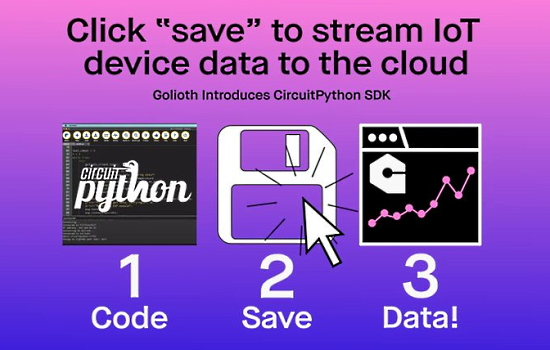](https://blog.golioth.io/click-save-to-stream-iot-device-data-to-the-cloud/)

What if you could open a text document on a device, write code, click save, and everything magically starts working? This is the promise of high level programming languages like CircuitPython. Golioth Labs now has an SDK to utilize the language’s fast prototyping capabilities. In addition to Golioth’s cloud functions, it’s super easy to pass data from a networked device up to the Golioth cloud. Click save to stream IoT device data to the cloud - [Golioth](https://blog.golioth.io/click-save-to-stream-iot-device-data-to-the-cloud/).

## The Pi Cast Celebrates 10 Years of Raspberry Pi: New Episodes With Ladyada, Eben Upton, and More

The Pi Cast Celebrates 10 Years of Raspberry Pi: New Episodes With Ladyada, Eben Upton, and others. Adafruit’s Limor Fried will be on a livecast on February 15, 2022 – More on [Tom’s Hardware](https://www.tomshardware.com/news/pi-cast-celebrates-10-years-of-raspberry-pi) and [YouTube](https://www.youtube.com/watch?v=aGV6zZmF8Bs).

## #CircuitPython2022 Updates

Here is additional #CircuitPython2022 feedback received since last week:

* [#CircuitPython2022 Monday (2 entries)](https://blog.adafruit.com/2022/01/24/final-circuitpython2022-monday-molecularist/)
* [@keithTheEE’s #CircuitPython2022](https://blog.adafruit.com/2022/01/28/keiththeees-circuitpython2022/)
* [Todbot](https://todbot.com/blog/2022/01/28/circuitpython-in-2022/)

See the wrap-up post coming next week.

## Using an ESP32-S2 and CircuitPython to Teach Web Security

[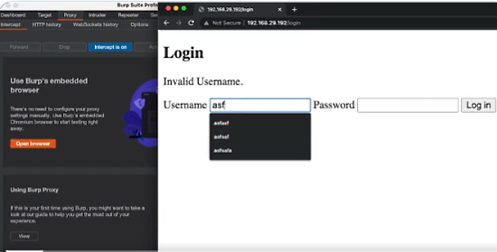](https://twitter.com/KodyKinzie/status/1486208024436002818)

Use an ESP32-S2 and CircuitPython to Teach Web Security. 

> I made a vulnerable web application anyone can run on an ESP32-S2 board to learn about username enumeration and password brute-forcing.

See more - [Twitter](https://twitter.com/KodyKinzie/status/1486208024436002818) and source plus instructions [GitHub](https://github.com/HakCat-Tech/DamnVulnerableNug).

## CircuitPython Deep Dive Stream with Scott Shawcroft

[This week](https://youtu.be/Rvtn30uZwEc), Scott streams his work on ESP32-S3 Bluetooth Low Energy (BLE).

You can see the latest video and past videos on the Adafruit YouTube channel under the Deep Dive playlist - [YouTube](https://www.youtube.com/playlist?list=PLjF7R1fz_OOXBHlu9msoXq2jQN4JpCk8A).

## CircuitPython Parsec

John Park’s CircuitPython Parsec: 

* WiFi Sniffing - [Adafruit Blog](https://blog.adafruit.com/2022/01/31/john-parks-circuitpython-parsec-wifi-sniffing-adafruit-johnedgarpark-adafruit-circuitpython/) and [YouTube](https://youtu.be/ViuriC0Y_80).

Catch all the episodes in the [YouTube playlist](https://www.youtube.com/playlist?list=PLjF7R1fz_OOWFqZfqW9jlvQSIUmwn9lWr).

## The CircuitPython Show

The CircuitPython Show is a new independent podcast, hosted by Paul Cutler, focused on the people doing awesome things with CircuitPython. Each episode features Paul in conversation with a guest for a twenty to thirty minute interview – [CircuitPythonShow](https://circuitpythonshow.com/), [Blog Post](https://paulcutler.org/posts/2022/01/introducing-the-circuitpython-show/) and [Twitter](https://twitter.com/circuitpyshow).

Listen to the Season 1 Trailer now - [CircuitPython Show](https://circuitpythonshow.com/episodes/0/trailer)

## Project of the Week

[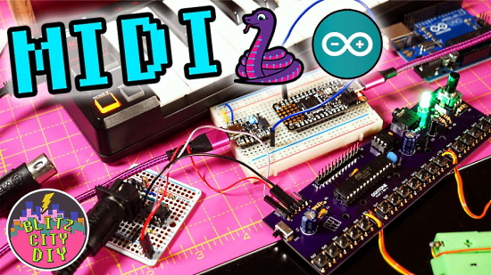](https://twitter.com/BlitzCityDIY/status/1487123314258575363)

[Blitz City DIY](https://twitter.com/BlitzCityDIY) explores MIDI Over UART with Arduino and CircuitPython - [Twitter](https://twitter.com/BlitzCityDIY/status/1486473211659395074) and [YouTube](https://www.youtube.com/watch?v=2ccK6mhd5zU).

[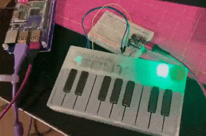](https://twitter.com/BlitzCityDIY/status/1486473211659395074)

> I went on a MIDI over UART journey across programming languages and microcontrollers while beginning to hack the Oskitone Scout synth

## News from around the web!

[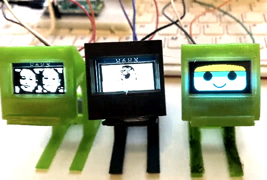](https://gurgleapps.com/learn/projects/how-to-display-your-own-custom-image-on-a-small-oled-screen-using-our-free-tool)

How to display your own custom image on a small OLED screen with both MicroPython and CircuitPython - [gurgleapps.com](https://gurgleapps.com/learn/projects/how-to-display-your-own-custom-image-on-a-small-oled-screen-using-our-free-tool) and [YouTube](https://youtu.be/MOI9qBAAClo), via [Twitter](https://twitter.com/GurgleApps/status/1488142796410261510).

Students at the [Saigon South International School (SSIS)](https://twitter.com/ssischool) coded a control system for the Sphero RVR in CircuitPython on an Adafruit Metro board. The ultrasonic sensor reads the distance and the robot moves forward/backward to keep it distant - [Twitter](https://twitter.com/emwdx/status/1486598997892792320).

[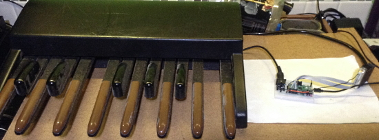](https://twitter.com/diyelectromusic/status/1486785283551019012)

Adding MIDI to an old organ pedal keyboard with CircuitPython - [Twitter](https://twitter.com/diyelectromusic/status/1486785283551019012).

[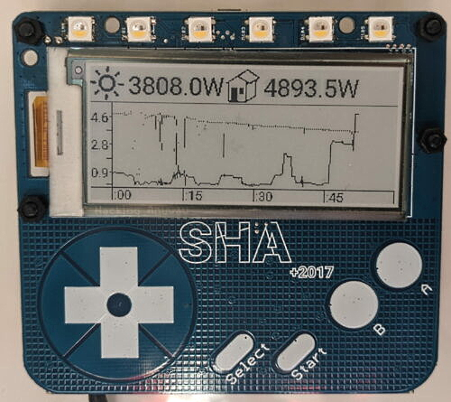](https://projectgus.com/2022/01/sha2017-badge-solar-monitor/)

Repurposing a SHA2017 hacker camp badge into a solar energy and power consumption monitor with ESP32 and MicroPython - [Project Gus](https://projectgus.com/2022/01/sha2017-badge-solar-monitor/) and [Hackaday](https://hackaday.com/2022/01/26/the-sha2017-badge-just-keeps-on-giving-this-time-its-a-solar-monitor/).

[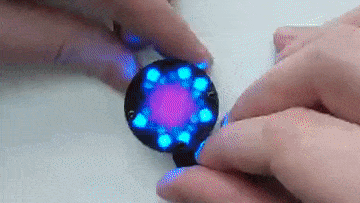](https://twitter.com/jasoncoon_/status/1487872409193652236)

> I received a Seeedstudio XIAO BLE Sense! Using the 6-axis inertial measurement unit (IMU) to measure yaw, pitch & roll. Using just yaw to "open & close" the Fibonacci64 Nano like an aperture. All in Arduino so far, will try CircuitPython soon - [Twitter](https://twitter.com/jasoncoon_/status/1487872409193652236) and [GitHub](https://gist.github.com/jasoncoon/926f037e72ec392d164f11d263db68ac).

[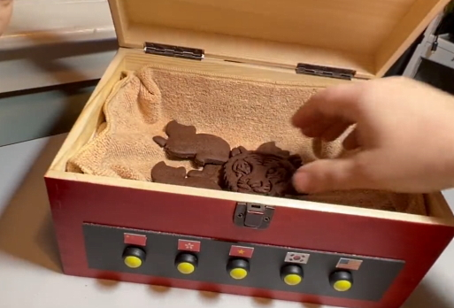](https://twitter.com/gallaugher/status/1487992178790088712)

A talking Lunar New Year box. Great for dispensing treats (like tiger cookies). Made with CircuitPython and an Adafruit Feather RP2040. Wishes you HLNY in Mandarin, Cantonese, Vietnamese, Korean, and American-accented English - [Twitter](https://twitter.com/gallaugher/status/1487992178790088712) and [Instructables](https://www.instructables.com/Build-a-Lunar-New-Year-Box-Talking-Portable-and-Mu/).

[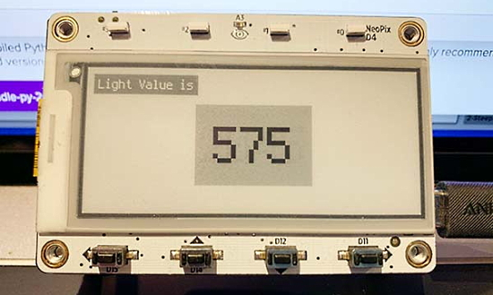](https://github.com/Nrico/MagTagLightSensor)

MagTag eInk light sensor with CircuitPython 7 - [GitHub](https://github.com/Nrico/MagTagLightSensor).

[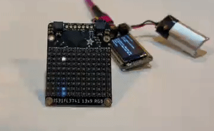](https://twitter.com/anecdat/status/1486770014740959234)

Using an ESP32-S2 and an Adafruit IS31FL3741 LED display to visualize WiFi signals locally - [Twitter](https://twitter.com/anecdat/status/1486770014740959234).

[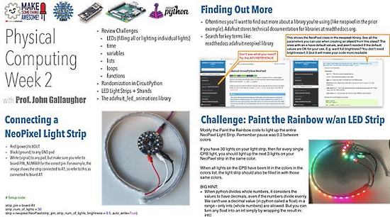](https://twitter.com/gallaugher/status/1486169840821968896?t=1QtgMwuvr4JcuXWjSLDrFw&s=03)

> Educator teaching w/CircuitPython? Or following CircuitPython School? Each Tuesday after class, professor John Gallaugher posts keynote slides with challenge/solutions used in his intro course. If useful, have at it and let him know). Cheers! - [Google Drive](https://drive.google.com/drive/folders/1uUDfCxz3o9TnB-Hq8kQDW7jimambANeI) via [Twitter](https://twitter.com/gallaugher/status/1486169840821968896?t=1QtgMwuvr4JcuXWjSLDrFw&s=03).

[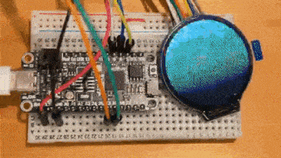](https://twitter.com/AoyamaProd/status/1486295100334682112)

Plotting colorful circles with CircuitPython on GC9A01 round LCD + Feather RP2040 and CircuitPython - [Twitter](https://twitter.com/AoyamaProd/status/1486295100334682112).

Pimoroni achieving a 10% speedup in MicroPython  with some optimization - [Twitter](https://twitter.com/Gadgetoid/status/1486330249591853059) and [GitHub](https://github.com/pimoroni/micropython/commit/fa406a911e11c8b50f3c7fe11b48bb2ab90d7af7).

[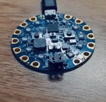](https://twitter.com/gallaugher/status/1486702263372599300)

A CircuitPython and Circuit Playground Bluefruit progress indicator - [Twitter](https://twitter.com/gallaugher/status/1486702263372599300).

[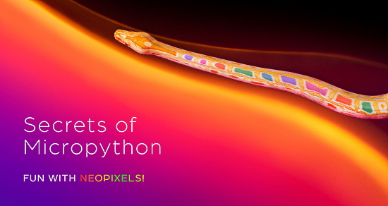](https://bhave.sh/micropython-neopixels-1/)

Secrets of MicroPython: Fun with Neopixels! - [Bhavesh Kakwani](https://bhave.sh/micropython-neopixels-1/).

[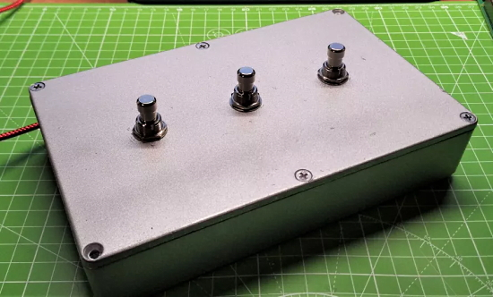](https://www.tomshardware.com/how-to/pedal-stream-controller-raspberry-pi-pico)

How To Make Your Own Pedal Stream Controller with Raspberry Pi Pico and CircuitPython - [Tom's Hardware](https://www.tomshardware.com/how-to/pedal-stream-controller-raspberry-pi-pico).

[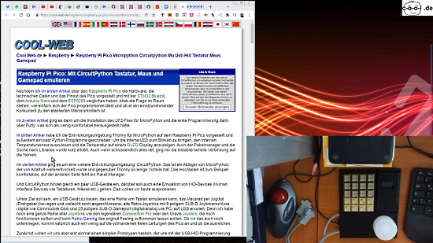](https://www.youtube.com/watch?v=qFI_m_4QV4U)

Macro Key HID Keyboard Mouse GamePad Emulator with CircuitPython - [YouTube](https://www.youtube.com/watch?v=qFI_m_4QV4U) (German).

[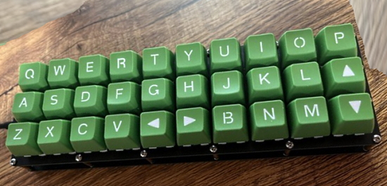](https://twitter.com/andy_leer/status/1486780926071869443)

> Thanks to Lovely folks on the Adafruit Discord for the assist with the firmware yesterday. Keycaps came in and my PBGherkin is up and running. CircuitPython with KMK firmware - [Twitter](https://twitter.com/andy_leer/status/1486780926071869443).

[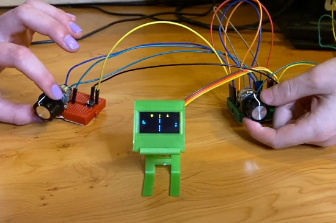](https://www.youtube.com/watch?v=WvZvtElvWlM)

How to Make Pico Pong with a Raspberry Pi Pico and MicroPython - [YouTube](https://www.youtube.com/watch?v=WvZvtElvWlM) and [GitHub](https://github.com/gurgleapps/Pico-Pong).

text - [site](url).

[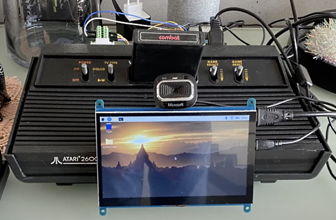](https://www.raspberrypi.com/news/hand-controlled-atari-2600/?mc_cid=8cacbb3a36&mc_eid=d98a11b1f1)

Hand gesture-controlled Atari 2600 - [Raspberry Pi Blog](https://www.raspberrypi.com/news/hand-controlled-atari-2600/?mc_cid=8cacbb3a36&mc_eid=d98a11b1f1) and [YouTube](https://youtu.be/vJO6nMwUBXw).

[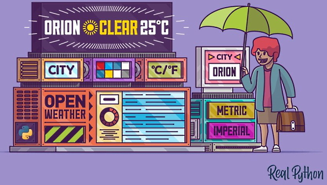](https://realpython.com/build-a-python-weather-app-cli/)

Build a Weather CLI App With Python - [Real Python](https://realpython.com/build-a-python-weather-app-cli/) via [Twitter](https://twitter.com/realpython/status/1486341302052691973).

text - [site](url).

The power of Python descriptors - [Piccolo](https://piccolo-orm.com/blog/the-power-of-python-descriptors/).

while true: - [Twitter](https://twitter.com/PrasoonPratham/status/1485893438356987914).

#ICYDNCI What was the most popular, most clicked link, in [last week's newsletter](https://www.adafruitdaily.com/2022/01/25/python-on-microcontrollers-newsletter-raspberry-pi-pico-turns-one-and-more-python-circuitpython-micropython-thepsf-2/)? [Multilingual blink for Raspberry Pi Pico](https://www.raspberrypi.com/news/multilingual-blink-for-raspberry-pi-pico/).

## Coming soon

text - [site](url).

## New Boards Supported by CircuitPython

The number of supported microcontrollers and Single Board Computers (SBC) grows every week. This section outlines which boards have been included in CircuitPython or added to [CircuitPython.org](https://circuitpython.org/).

This week there were no new boards added, but several are in development.

*Note: For non-Adafruit boards, please use the support forums of the board manufacturer for assistance, as Adafruit does not have the hardware to assist in troubleshooting.*

Looking to add a new board to CircuitPython? It's highly encouraged! Adafruit has four guides to help you do so:

- [How to Add a New Board to CircuitPython](https://learn.adafruit.com/how-to-add-a-new-board-to-circuitpython/overview)
- [How to add a New Board to the circuitpython.org website](https://learn.adafruit.com/how-to-add-a-new-board-to-the-circuitpython-org-website)
- [Adding a Single Board Computer to PlatformDetect for Blinka](https://learn.adafruit.com/adding-a-single-board-computer-to-platformdetect-for-blinka)
- [Adding a Single Board Computer to Blinka](https://learn.adafruit.com/adding-a-single-board-computer-to-blinka)

## New Learn Guides!

[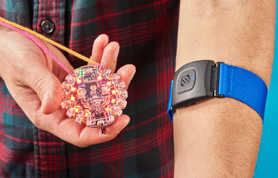](https://learn.adafruit.com/guides/latest)

[Circuit Playground Bluefruit BLE Heart Rate Pendant with CircuitPython](https://learn.adafruit.com/ble-heart-rate-display-pendant) from [Isaac Wellish](https://learn.adafruit.com/users/isaacwellish)

## CircuitPython Libraries!

CircuitPython support for hardware continues to grow. We are adding support for new sensors and breakouts all the time, as well as improving on the drivers we already have. As we add more libraries and update current ones, you can keep up with all the changes right here!

For the latest libraries, download the [Adafruit CircuitPython Library Bundle](https://circuitpython.org/libraries). For the latest community contributed libraries, download the [CircuitPython Community Bundle](https://github.com/adafruit/CircuitPython_Community_Bundle/releases).

If you'd like to contribute, CircuitPython libraries are a great place to start. Have an idea for a new driver? File an issue on [CircuitPython](https://github.com/adafruit/circuitpython/issues)! Have you written a library you'd like to make available? Submit it to the [CircuitPython Community Bundle](https://github.com/adafruit/CircuitPython_Community_Bundle). Interested in helping with current libraries? Check out the [CircuitPython.org Contributing page](https://circuitpython.org/contributing). We've included open pull requests and issues from the libraries, and details about repo-level issues that need to be addressed. We have a guide on [contributing to CircuitPython with Git and Github](https://learn.adafruit.com/contribute-to-circuitpython-with-git-and-github) if you need help getting started. You can also find us in the #circuitpython channels on the [Adafruit Discord](https://adafru.it/discord).

You can check out this [list of all the Adafruit CircuitPython libraries and drivers available](https://github.com/adafruit/Adafruit_CircuitPython_Bundle/blob/master/circuitpython_library_list.md). 

The current number of CircuitPython libraries is **344**!

**Updated Libraries!**

Here's this week's updated CircuitPython libraries:

 * [Adafruit_CircuitPython_ADS1x15](https://github.com/adafruit/Adafruit_CircuitPython_ADS1x15)
 * [Adafruit_CircuitPython_Bitmap_Font](https://github.com/adafruit/Adafruit_CircuitPython_Bitmap_Font)
 * [Adafruit_CircuitPython_CCS811](https://github.com/adafruit/Adafruit_CircuitPython_CCS811)
 * [Adafruit_CircuitPython_CLUE](https://github.com/adafruit/Adafruit_CircuitPython_CLUE)
 * [Adafruit_CircuitPython_Debouncer](https://github.com/adafruit/Adafruit_CircuitPython_Debouncer)
 * [Adafruit_CircuitPython_Display_Button](https://github.com/adafruit/Adafruit_CircuitPython_Display_Button)
 * [Adafruit_CircuitPython_DisplayIO_Layout](https://github.com/adafruit/Adafruit_CircuitPython_DisplayIO_Layout)
 * [Adafruit_CircuitPython_ESP32SPI](https://github.com/adafruit/Adafruit_CircuitPython_ESP32SPI)
 * [Adafruit_CircuitPython_Logging](https://github.com/adafruit/Adafruit_CircuitPython_Logging)
 * [Adafruit_CircuitPython_SCD4X](https://github.com/adafruit/Adafruit_CircuitPython_SCD4X)
 * [Adafruit_CircuitPython_STMPE610](https://github.com/adafruit/Adafruit_CircuitPython_STMPE610)
 * [Adafruit_CircuitPython_Thermistor](https://github.com/adafruit/Adafruit_CircuitPython_Thermistor)
 * [Adafruit_CircuitPython_Nunchuk](https://github.com/adafruit/Adafruit_CircuitPython_Nunchuk)
 * [Adafruit_CircuitPython_BNO055](https://github.com/adafruit/Adafruit_CircuitPython_BNO055)
 * [Adafruit_CircuitPython_MacroPad](https://github.com/adafruit/Adafruit_CircuitPython_MacroPad)
 * [Adafruit_CircuitPython_Simple_Text_Display](https://github.com/adafruit/Adafruit_CircuitPython_Simple_Text_Display)
 * [Adafruit_CircuitPython_24LC32](https://github.com/adafruit/Adafruit_CircuitPython_24LC32)
 * [Adafruit_CircuitPython_AzureIoT](https://github.com/adafruit/Adafruit_CircuitPython_AzureIoT)
 * [Adafruit_Python_PlatformDetect](https://github.com/adafruit/Adafruit_Python_PlatformDetect)

## What’s the team up to this week?

What is the team up to this week? Let’s check in!

**Dan**

This week I continued working on presenting multiple filesystems over USB Mass Storage in CircuitPython. I haven't yet found a way to do this dynamically that works well on Windows or macOS. If we can't figure out a way, we'll provide an API to reset the USB connection, and/or allow you to request in advance that specific filesystems be mounted when **code.py** starts.

I debugged an ESP32-S2 deep sleep problem that turned out to be a hardware issue. I'm continuing to debug other peripheral issues that have been reported recently.

**Jeff**

Again, my work has been behind the scenes on floppy drive stuff. We're learning more about the tools for converting among various floppy drive archival formats, and also I started working on using the PIO peripheral in the Raspberry Pi RP2040 microcontroller, which enables more accurate reading & writing of floppy disks.

One big milestone was that with our work in progress floppy code, we were able to preserve a classic Commodore 64 game, Archon, including emulating the original copy protection system on the floppy disk, and make the result directly playable by anyone on the archive.org website.  Check out last week's [Show & Tell](https://youtu.be/oWC4pC-3Bz0) program on YouTube if you want to hear more about that.

**Kattni**

This week I've been working on finishing up the TFT Feather guide. I took a detour to get Arduino support added to the various RP2040 board guides. 

Once that's done, I'll be looking at creating some new groups on the Adafruit Learn System. Groups are a set of related guides that you can find in one place. I think a Getting Started with CircuitPython group will be a great place to start. Keep an eye out for that and more coming soon!

**Melissa**

This past week I continued working on porting LittleFS over to JavaScript. However, I decided to take a different approach and found a package called LittleFS-JS that uses Emscripten to encapsulate the C library in a JavaScript wrapper. I was able to get this to mostly function, but have been running into a problem that it was built around a very early version of LittleFS and the resulting file is not readable by the latest version. I'm currently working on trying to get the latest version to compile, but even though it compiles, none of the functions are available.

**Scott**

This last week I've been focused on adding Bluetooth Low Energy (BLE) support to the ESP32-S3. I've made good progress and can now scan for advertisements from other devices. I'm working on getting that merged as a starting point.

At the same time, I'm working to add advertising support so that the device can advertise to others. This segues nicely into basic connection functionality which will come after that. I've been thinking of a number of projects I'd like to do so I'm motivated to get things going.

## Upcoming events!

The next MicroPython Meetup in Melbourne will be on January 26th – [Meetup](https://www.meetup.com/MicroPython-Meetup/).  See the [blog](https://melbournemicropythonmeetup.github.io/) for past notes.

PyCascades is a regional PyCon in the Pacific Northwest, celebrating the west coast Python developer and user community. Our organizing team includes members of the Vancouver, Seattle, and Portland Python user groups. DATES ANNOUNCED! February 5th-6th, 2022 The conference will take place on Saturday and the first half of Sunday, with the post-conference sprints following that on Sunday afternoon. After three amazing in-person conferences and an engaging online conference, we are ready to do it again! - [PyCascades 2022](https://2022.pycascades.com/).

PyCon US 2022 planning is underway. The team is planning to host the event in person with an online component. April 27, 2022 - May 5, 2022. Head over to the [PyCon US 2022 website](https://us.pycon.org/2022/) for details about the conference and more information about the sponsorship program - [PyCon Blog](https://pycon.blogspot.com/2022/10/pycon-us-2022-website-and-sponsorship.html).

PyCon Italia is the Italian conference on Python. Organised by Python Italia, it is one of the more important Python conferences in Europe. With over 700 attendees, the next edition will be June 2-5, 2022 - [Ticket Registration](https://pycon.it/en/tickets).

**Send Your Events In**

As for other events, with the COVID pandemic, most in-person events are postponed or cancelled. If you know of virtual events or events that may occur in the future, please let us know on Twitter with hashtag #CircuitPython or email to cpnews(at)adafruit(dot)com.

## Latest releases

CircuitPython's stable release is [#.#.#](https://github.com/adafruit/circuitpython/releases/latest) and its unstable release is [#.#.#-##.#](https://github.com/adafruit/circuitpython/releases). New to CircuitPython? Start with our [Welcome to CircuitPython Guide](https://learn.adafruit.com/welcome-to-circuitpython).

[2022####](https://github.com/adafruit/Adafruit_CircuitPython_Bundle/releases/latest) is the latest CircuitPython library bundle.

[v#.#.#](https://micropython.org/download) is the latest MicroPython release. Documentation for it is [here](http://docs.micropython.org/en/latest/pyboard/).

[#.#.#](https://www.python.org/downloads/) is the latest Python release. The latest pre-release version is [#.#.#](https://www.python.org/download/pre-releases/).

[#### Stars](https://github.com/adafruit/circuitpython/stargazers) Like CircuitPython? [Star it on GitHub!](https://github.com/adafruit/circuitpython)

## Call for help -- Translating CircuitPython is now easier than ever!

[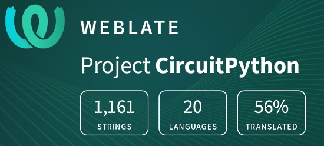](https://hosted.weblate.org/engage/circuitpython/)

One important feature of CircuitPython is translated control and error messages. With the help of fellow open source project [Weblate](https://weblate.org/), we're making it even easier to add or improve translations. 

Sign in with an existing account such as GitHub, Google or Facebook and start contributing through a simple web interface. No forks or pull requests needed! As always, if you run into trouble join us on [Discord](https://adafru.it/discord), we're here to help.

## jobs.adafruit.com - Find a dream job, find great candidates!

[jobs.adafruit.com](https://jobs.adafruit.com/) has returned and folks are posting their skills (including CircuitPython) and companies are looking for talented makers to join their companies - from Digi-Key, to Hackaday, Micro Center, Raspberry Pi and more.

**Job of the Week**

Creative Engineer/Fabricator - Mechatronics - [Adafruit Jobs Board](https://jobs.adafruit.com/job/creative-engineer-fabricator-mechatronics/).

## 32,941 thanks!

The Adafruit Discord community, where we do all our CircuitPython development in the open, reached over 32,941 humans - thank you!  Adafruit believes Discord offers a unique way for Python on hardware folks to connect. Join today at [https://adafru.it/discord](https://adafru.it/discord).

## ICYMI - In case you missed it

Python on hardware is the Adafruit Python video-newsletter-podcast! The news comes from the Python community, Discord, Adafruit communities and more and is broadcast on ASK an ENGINEER Wednesdays. The complete Python on Hardware weekly videocast [playlist is here](https://www.youtube.com/playlist?list=PLjF7R1fz_OOXRMjM7Sm0J2Xt6H81TdDev). The video podcast is on [iTunes](https://itunes.apple.com/us/podcast/python-on-hardware/id1451685192?mt=2), [YouTube](http://adafru.it/pohepisodes), [IGTV (Instagram TV](https://www.instagram.com/adafruit/channel/)), and [XML](https://itunes.apple.com/us/podcast/python-on-hardware/id1451685192?mt=2).

[The weekly community chat on Adafruit Discord server CircuitPython channel - Audio / Podcast edition](https://itunes.apple.com/us/podcast/circuitpython-weekly-meeting/id1451685016) - Audio from the Discord chat space for CircuitPython, meetings are usually Mondays at 2pm ET, this is the audio version on [iTunes](https://itunes.apple.com/us/podcast/circuitpython-weekly-meeting/id1451685016), Pocket Casts, [Spotify](https://adafru.it/spotify), and [XML feed](https://adafruit-podcasts.s3.amazonaws.com/circuitpython_weekly_meeting/audio-podcast.xml).

## Codecademy "Learn Hardware Programming with CircuitPython"

Codecademy, an online interactive learning platform used by more than 45 million people, has teamed up with Adafruit to create a coding course, “Learn Hardware Programming with CircuitPython”. The course is now available in the [Codecademy catalog](https://www.codecademy.com/learn/learn-circuitpython?utm_source=adafruit&utm_medium=partners&utm_campaign=circuitplayground&utm_content=pythononhardwarenewsletter).

## Contribute!

The CircuitPython Weekly Newsletter is a CircuitPython community-run newsletter emailed every Tuesday. The complete [archives are here](https://www.adafruitdaily.com/category/circuitpython/). It highlights the latest CircuitPython related news from around the web including Python and MicroPython developments. To contribute, edit next week's draft [on GitHub](https://github.com/adafruit/circuitpython-weekly-newsletter/tree/gh-pages/_drafts) and [submit a pull request](https://help.github.com/articles/editing-files-in-your-repository/) with the changes. You may also tag your information on Twitter with #CircuitPython. 

Join the Adafruit [Discord](https://adafru.it/discord) or [post to the forum](https://forums.adafruit.com/viewforum.php?f=60) if you have questions.
