- [X] Kattni updates
- [ ] change date
- [ ] update title
- [ ] Feature story
- [ ] Update  for images
- [ ] Update ICYDNCI
- [ ] All images 550w max only
- [ ] Link "View this email in your browser."

News Sources

- [python.org](https://www.python.org/)
- [Python Insider - dev team blog](https://pythoninsider.blogspot.com/)
- [MicroPython Meetup Blog](https://melbournemicropythonmeetup.github.io/)
- [hackaday.io newest projects MicroPython](https://hackaday.io/projects?tag=micropython&sort=date) and [CircuitPython](https://hackaday.io/projects?tag=circuitpython&sort=date)
- [hackaday CircuitPython](https://hackaday.com/blog/?s=circuitpython) and [MicroPython](https://hackaday.com/blog/?s=micropython)
- [hackster.io CircuitPython](https://www.hackster.io/search?q=circuitpython&i=projects&sort_by=most_recent) and [MicroPython](https://www.hackster.io/search?q=micropython&i=projects&sort_by=most_recent)

Template last updated on 2022-01-10 Tweak board section

View this email in your browser.

Welcome to the latest Python on Microcontrollers newsletter! 

We're on [Discord](https://discord.gg/HYqvREz), [Twitter](https://twitter.com/search?q=circuitpython&src=typed_query&f=live), and for past newsletters - [view them all here](https://www.adafruitdaily.com/category/circuitpython/). If you're reading this on the web, [subscribe here](https://www.adafruitdaily.com/). Here's the news this week:

## Raspberry Pi OS 64-bit is Out of Beta

[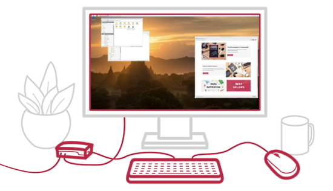](https://www.raspberrypi.com/news/raspberry-pi-os-64-bit/)

Over the past year, Raspberry Pi has been trialling a beta of Raspberry Pi OS 64-bit. Last week it finally came out of beta. - [Raspberry Pi](https://www.raspberrypi.com/news/raspberry-pi-os-64-bit/).

> "The ARMv8-A architecture, which encompasses the 64-bit AArch64 architecture and associated A64 instruction set, was first introduced into the Raspberry Pi line with Raspberry Pi 3 in 2016. From that point on, it has been possible to run a full 64-bit operating system on our flagship products, and many third-party operating systems are available. However, we have continued to build our Raspberry Pi OS releases on the 32-bit Raspbian platform, aiming to maximise compatibility between devices and to avoid customer confusion.    there are reasons to choose a 64-bit operating system over a 32-bit one. Compatibility is a key concern: many closed-source applications are only available for arm64, and open-source ones aren’t fully optimised for the armhf port. Beyond that there are some performance benefits intrinsic to the A64 instruction set: today, these are most visible in benchmarks, but the assumption is that these will feed through into real-world application performance in the future.   A more theoretical concern is that 32-bit pointers only allow you to address 4GB of memory. On Raspberry Pi 4, we use the ARM Large Physical Address Extension (LPAE) to access up to 8GB of memory, subject to the constraint that any process is limited to accessing 3GB. Some use cases will benefit from being able to allocate the entire memory of an 8GB Raspberry Pi 4 from a single process.

## 33,000 Members on the Adafruit Discord

The Adafruit Discord community, where we do all our CircuitPython development in the open, reached over 33,000 humans this week. Thank you!  Adafruit believes Discord offers a unique way for Python on hardware folks to connect. Join today at [https://adafru.it/discord](https://adafru.it/discord).

See the announcement post with a chart of the server growth - [Adafruit Blog](https://blog.adafruit.com/2022/02/03/celebrating-over-33000-members-in-the-adafruit-discord-community-adafruit-discord/).

## Feature

text - [site](url).

## A CircuitPython Pull Request to Add Split Screen Capabilities

[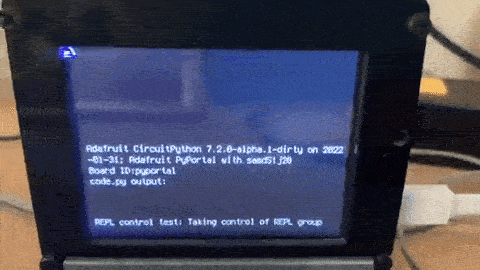](https://twitter.com/CycleMatch/status/1488370312492326918?s=20&t=n-MDQEFS8XHUjtxEpAiVxQ)

[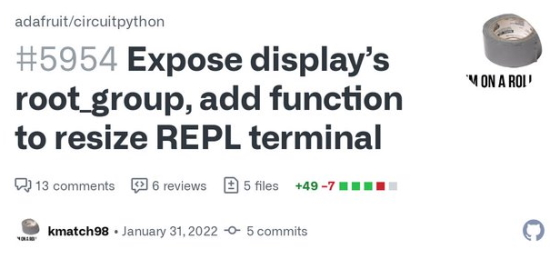](https://github.com/adafruit/circuitpython/pull/5954#issuecomment-1028431918)

kmatch98 has a new PR in (#5954) that exposes the CircuitPython REPL's display group elements, allowing relocation of the REPL and making thinks like split screens possible without breaking the existing displayio structure - [Twitter](https://twitter.com/CycleMatch/status/1488370312492326918?s=20&t=n-MDQEFS8XHUjtxEpAiVxQ) and [GitHub](https://github.com/adafruit/circuitpython/pull/5954).

## Piku: a small command line utility for managing CircuitPython projects

Piku is small command line utility for managing CircuitPython projects. With Pikuyou can make creating a CircuitPython project, installing packages, deploying, and connecting to a CircuitPython device easy to do from the command line - [Adafruit Forums](https://forums.adafruit.com/viewtopic.php?f=60&t=188036), [PyPI](https://pypi.org/project/piku/) and [GitHub](https://github.com/mraleson/piku).

> I am sure there are other tools out there but I tried to pattern piku after other package management tools i had used like poetry and npm. The tool makes it easier to create a project, add modules from the official and community bundles, deploy the project to the device, and connect to the device's serial port. I hope that in the future it will have similar functionality to other similar tools like poetry and npm. I have tested it lightly and it seems to work on Ubuntu and Windows and it may work on macOS (I don't have one to test on).   Piku can be installed using pip. I only have a few devices to test on, but it has really helped me iterate faster on my personal project. I hope it is helpful to someone else who likes a command like workflow like me. I would also love help improving it if anyone feels so inclined. You can check the docs on pypi or github. Feedback welcome.

## CircuitPython2022 Wraps Up - Thank You

[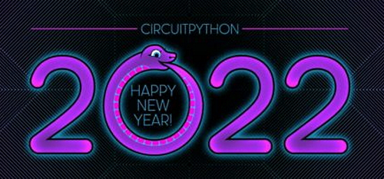](https://blog.adafruit.com/2022/02/01/thank-you-for-circuitpython2022/)

Scott posts: "[Thank you](https://blog.adafruit.com/2022/02/01/thank-you-for-circuitpython2022/) to the 24 folks who posted for #CircuitPython2022! Thank you for all of the different ideas. I hope that folks collaborate to make these ideas a reality. Thank you to those whose ideas have been guiding principles over the years. We wouldn’t be here without you."

"As Kattni points out in [her #CircuitPython2022 post](https://blog.adafruit.com/2022/02/01/the-circuitpython-community-a-round-up-and-a-look-forward-to-2022/), don’t hesitate to let us know what you’d like to see from CircuitPython and the community throughout this year. Feel free to give us more ideas on the [Adafruit Discord](https://adafru.it/discord), [Adafruit CircuitPython forum](https://forums.adafruit.com/viewforum.php?f=60) and [CircuitPython issue tracker](https://github.com/adafruit/circuitpython/issues)" - [Adafruit Blog](https://blog.adafruit.com/2022/02/01/thank-you-for-circuitpython2022/).

## CircuitPython Deep Dive Stream with Scott Shawcroft

[This week](link), Scott streams his work on .

You can see the latest video and past videos on the Adafruit YouTube channel under the Deep Dive playlist - [YouTube](https://www.youtube.com/playlist?list=PLjF7R1fz_OOXBHlu9msoXq2jQN4JpCk8A).

## CircuitPython Parsec

John Park’s CircuitPython Parsec: 

* episode - [Adafruit Blog](url)

Catch all the episodes in the [YouTube playlist](https://www.youtube.com/playlist?list=PLjF7R1fz_OOWFqZfqW9jlvQSIUmwn9lWr).

## The CircuitPython Show

The CircuitPython Show is a new independent podcast, hosted by Paul Cutler, focused on the people doing awesome things with CircuitPython. Each episode features Paul in conversation with a guest for a twenty to thirty minute interview – [CircuitPythonShow](https://circuitpythonshow.com/), [Blog Post](https://paulcutler.org/posts/2022/01/introducing-the-circuitpython-show/) and [Twitter](https://twitter.com/circuitpyshow).

Listen to the Season 1 Trailer now - [CircuitPython Show](https://circuitpythonshow.com/episodes/0/trailer)

The first episode is scheduled to air on

## Project of the Week

[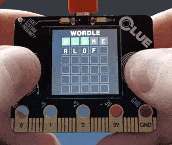](https://github.com/MichaelLacock/Wordle_for_CLUE)

We expect a number of microcontroller ports with similar looks to the New York Times Wordle game. Here is one by Michael Lacock done on an Adafruit CLUE board in CircuitPython 7 with or without a keyboard - [GitHub](https://github.com/MichaelLacock/Wordle_for_CLUE).

## Upgrade your CircuitPython Version on the Raspberry Pi Pico Without Access to the BOOTSEL Button

Upgrade your CircuitPython version on a Raspberry Pi Pico without access to the BOOTSEL Button - [Rob Miles](https://www.robmiles.com/journal/2022/1/27/upgrade-your-circuit-python-version-in-the-raspberry-pi-pico).

> You can use a couple of Python statements to get your Pico to reboot into firmware mode so that you can drop in a new version of CircuitPython (or anything else). You can issue the commands down the terminal connection. I used the Thonny program which provides a REPL connection to my CircuitPython powered CheeseBox (or Crackers Controller). 
   <code>microcontroller.on_next_reset(microcontroller.RunMode.UF2)</code>    This is the first command you type in. It tells your device to reset into UF2 mode next time it is reset.    <code>microcontroller.reset()</code>   This is the second command. It resets the device and makes it appear as as storage device into which you can load the firmware. 

## News from around the web!

[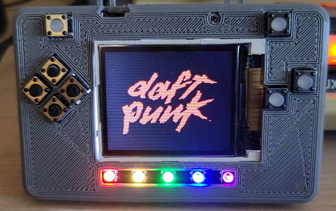](https://www.nycresistor.com/2022/02/03/daft-punk-word-clock/)

Daft Punk Word Clock - [NYCResistor](https://www.nycresistor.com/2022/02/03/daft-punk-word-clock/) and [YouTube](https://www.youtube.com/watch?v=fK78fMK-QzI).

[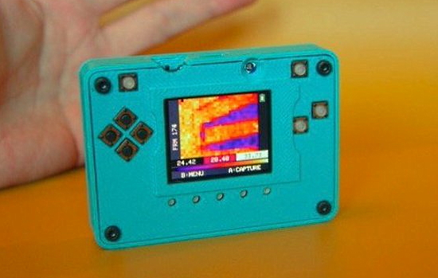](https://twitter.com/make2explore/status/1489462720936116225)

Compact Thermal Camera - [Thingiverse](https://www.thingiverse.com/thing:5023542) via [Twitter](https://twitter.com/make2explore/status/1489462720936116225).

[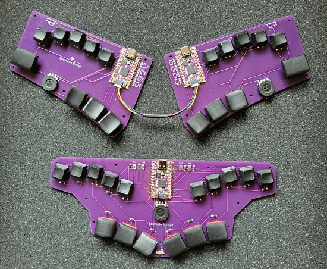](https://www.reddit.com/r/ErgoMechKeyboards/comments/si320r/two_board_concepts_that_minimize_finger_movement/)

Two board concepts that minimize finger movement and use CircuitPython - [reddit](https://www.reddit.com/r/ErgoMechKeyboards/comments/si320r/two_board_concepts_that_minimize_finger_movement/).

[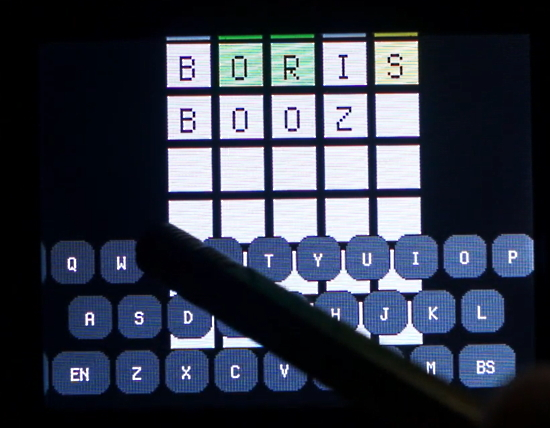](https://www.youtube.com/watch?v=QJ3flcxQJrU)

A Word Game clone on Adafruit PyPortal in CircuitPython with a pop-up touch screen - [YouTube](https://www.youtube.com/watch?v=QJ3flcxQJrU).

[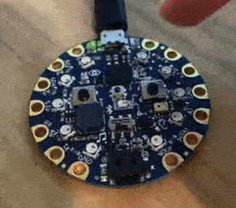](https://twitter.com/gallaugher/status/1488505684584972289)

Beat box with CircuitPlayground on an Adafruit Circuit Playground Express - [Twitter](Vhttps://twitter.com/gallaugher/status/1488505684584972289).

[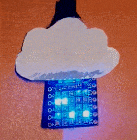](https://twitter.com/GeekMomProjects/status/1489168933709967366)

> It's like raaaaaaiiiiiin on your ESP! This little demo shows that MicroPython now works very nicely with the NeoPixels on the bedazzled ESP32-C3, thanks to a speedy assist from 
@matt_trentini and @damienpgeorge - [Twitter](https://twitter.com/GeekMomProjects/status/1489168933709967366).

[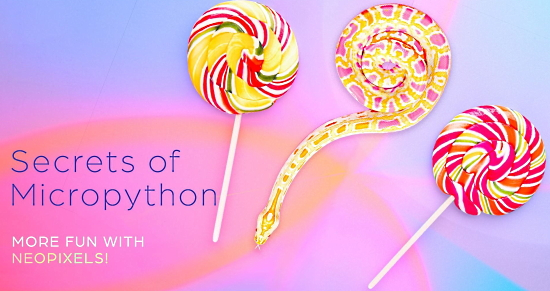](https://bhave.sh/micropython-neopixels-2/)

Secrets of MicroPython: More Fun with Neopixels! - [Bhavesh Kakwani](https://bhave.sh/micropython-neopixels-2/) via [Reddit](https://www.reddit.com/r/circuitpython/comments/sgauby/secrets_of_micropython_6_more_fun_with_neopixels/).

[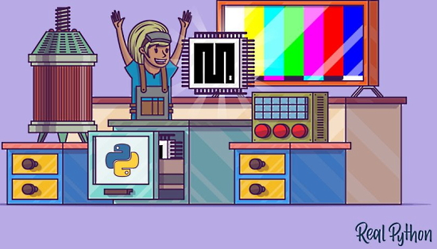](https://realpython.com/courses/getting-started-micropython/)

Getting Started With MicroPython (video lessons) - [Real Python](https://realpython.com/courses/getting-started-micropython/) via [Twitter](https://twitter.com/realpython/status/1488708883791200257).

text - [site](url).

[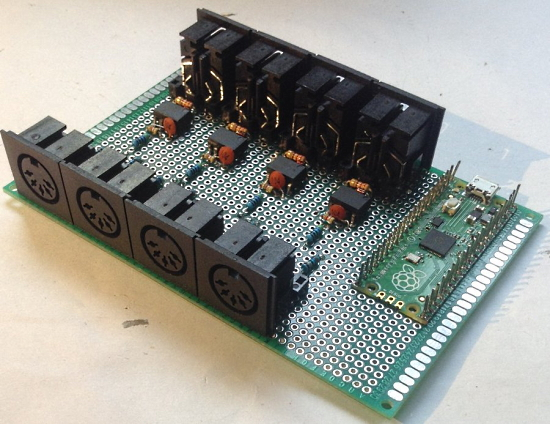](https://diyelectromusic.wordpress.com/2022/02/01/raspberry-pi-pico-multi-midi-router-part-2/)

Raspberry Pi Pico Multi MIDI Router – Part 2 - with MicroPython - [DIYelectromusic](https://diyelectromusic.wordpress.com/2022/02/01/raspberry-pi-pico-multi-midi-router-part-2/) via [Twitter](https://twitter.com/diyelectromusic/status/1488589510455791619).

text - [site](url).

text - [site](url).

text - [site](url).

Tiny Core Linux 13.0 - full Linux desktop in 22 MB. - [The Lunduke Journal of Technology](https://lunduke.substack.com/p/tiny-core-linux-130-full-linux-desktop).

Handcrafted 3D Icons, Fully Customizable Online. Free for commercial and personal use - [vertex.im](https://vertex.im/).

[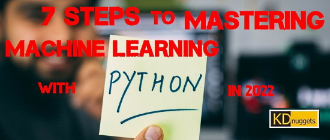](https://www.kdnuggets.com/2022/02/7-steps-mastering-machine-learning-python.html)

7 Steps to Mastering Machine Learning with Python in 2022 - [KD Nuggets](https://www.kdnuggets.com/2022/02/7-steps-mastering-machine-learning-python.html).

[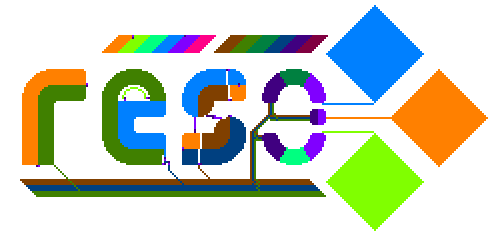](https://github.com/lynnpepin/reso)

Reso: A visual circuits programming language using pixels - [GitHub](https://github.com/lynnpepin/reso).

[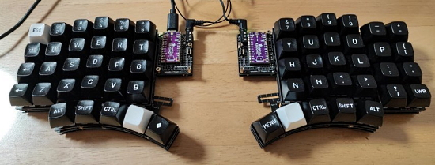](https://twitter.com/alg0002/status/1489986823292329986)

A split keyboard with Adafruit KB2040 microcontrollers using PRK firmware based on PicoRuby - [Twitter](https://twitter.com/alg0002/status/1489986823292329986).

[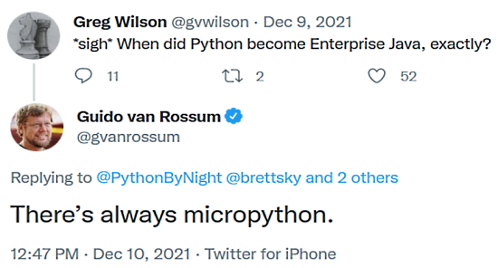](https://twitter.com/gvanrossum)

The creator of Python likes Python on Hardware - [Twitter](https://twitter.com/gvanrossum).

> This is a Django cheatsheet I created for myself for when I create a new Django project - [LinkedIn](https://www.linkedin.com/posts/driscollis_django-python-activity-6894993241851117568-JDyE/).

#ICYDNCI What was the most popular, most clicked link, in [last week's newsletter](https://www.adafruitdaily.com/2022/02/01/python-on-microcontrollers-newsletter-floppy-hack-chat-apple-ditches-python-2-and-more-python-circuitpython-micropython-thepsf/)? [xkcd Python comic](https://xkcd.com/1987/).

## Coming soon

[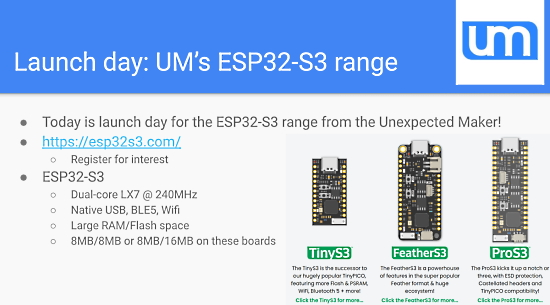](https://esp32s3.com/)

The new ESP32-S3 boards from Unexpected Maker - [esp32s3.com](https://esp32s3.com/).

text - [site](url).

## New Boards Supported by CircuitPython

The number of supported microcontrollers and Single Board Computers (SBC) grows every week. This section outlines which boards have been included in CircuitPython or added to [CircuitPython.org](https://circuitpython.org/).

This week, there were (#/no) new boards added!

- [Board name](url)
- [Board name](url)
- [Board name](url)

*Note: For non-Adafruit boards, please use the support forums of the board manufacturer for assistance, as Adafruit does not have the hardware to assist in troubleshooting.*

Looking to add a new board to CircuitPython? It's highly encouraged! Adafruit has four guides to help you do so:

- [How to Add a New Board to CircuitPython](https://learn.adafruit.com/how-to-add-a-new-board-to-circuitpython/overview)
- [How to add a New Board to the circuitpython.org website](https://learn.adafruit.com/how-to-add-a-new-board-to-the-circuitpython-org-website)
- [Adding a Single Board Computer to PlatformDetect for Blinka](https://learn.adafruit.com/adding-a-single-board-computer-to-platformdetect-for-blinka)
- [Adding a Single Board Computer to Blinka](https://learn.adafruit.com/adding-a-single-board-computer-to-blinka)

## New Learn Guides!

[CircuitPython Neko Kitty with Displayio](https://learn.adafruit.com/circuitpython-neko-kitty-with-displayio) from [Tim C](https://learn.adafruit.com/users/Foamyguy)

[NeoPixel Mini VU Meter](https://learn.adafruit.com/neopixel-mini-vu-meter) from [Noe and Pedro](https://learn.adafruit.com/users/pixil3d)

[May Pad Macropad with the KB2040, KMK, and CircuitPython](https://learn.adafruit.com/maypad-macropad-with-the-kb2040-kmk-and-circuitpython) from [Eva Herrada](https://learn.adafruit.com/users/eherrada)

[Adafruit LED Arcade Button 1x4 STEMMA QT](https://learn.adafruit.com/adafruit-led-arcade-button-qt) from [Kattni](https://learn.adafruit.com/users/kattni)

## CircuitPython Libraries!

CircuitPython support for hardware continues to grow. We are adding support for new sensors and breakouts all the time, as well as improving on the drivers we already have. As we add more libraries and update current ones, you can keep up with all the changes right here!

For the latest libraries, download the [Adafruit CircuitPython Library Bundle](https://circuitpython.org/libraries). For the latest community contributed libraries, download the [CircuitPython Community Bundle](https://github.com/adafruit/CircuitPython_Community_Bundle/releases).

If you'd like to contribute, CircuitPython libraries are a great place to start. Have an idea for a new driver? File an issue on [CircuitPython](https://github.com/adafruit/circuitpython/issues)! Have you written a library you'd like to make available? Submit it to the [CircuitPython Community Bundle](https://github.com/adafruit/CircuitPython_Community_Bundle). Interested in helping with current libraries? Check out the [CircuitPython.org Contributing page](https://circuitpython.org/contributing). We've included open pull requests and issues from the libraries, and details about repo-level issues that need to be addressed. We have a guide on [contributing to CircuitPython with Git and Github](https://learn.adafruit.com/contribute-to-circuitpython-with-git-and-github) if you need help getting started. You can also find us in the #circuitpython channels on the [Adafruit Discord](https://adafru.it/discord).

You can check out this [list of all the Adafruit CircuitPython libraries and drivers available](https://github.com/adafruit/Adafruit_CircuitPython_Bundle/blob/master/circuitpython_library_list.md). 

The current number of CircuitPython libraries is **344**!

**Updated Libraries!**

Here's this week's updated CircuitPython libraries:

 * [Adafruit_CircuitPython_AzureIoT](https://github.com/adafruit/Adafruit_CircuitPython_AzureIoT)
 * [CircuitPython_Community_Bundle](https://github.com/adafruit/CircuitPython_Community_Bundle)

## What’s the team up to this week?

What is the team up to this week? Let’s check in!

**Dan**

I fixed some Espressif I2C issues last week, and also fixed a problem that caused SAMD builds to crash immediately.

We wanted to be able to host free versions of "a certain word game" on CircuitPython boards, and discovered there was no simple HTTP web server written for ESP32-S2 boards. I found an initial version someone had created and rewrote it to be more general. The code will be a library and will be shown in a guide soon.

I am researching how to provide async versions of HTTP clients and servers. There is a nice library, `aiohttp`, used with CPython, but it is large and comprehensive. I am looking at some other smaller libraries, such as `asks` and `httpx`, and will see whether we can created a limited `adafruit_` version of one of these, as we did with `adafruit_requests`.

**Jeff**

While my main work continues to be on floppy drives, I've put in a few pull requests to CircuitPython as well.  One will update the "SDK" we use for RP2040 boards to the current version, and another starts to add "mdns" support to the espressif port.  This latter feature will allow you to use a hostname to connect to an espressif device (e.g., *qtpy.local*) instead of an IP address. Hopefully this will dovetail with some work that Dan has been doing to create a CircuitPython web server.

**Kattni**

This week I published the [Arcade QT guide](https://learn.adafruit.com/adafruit-led-arcade-button-qt). This board has been out for a bit, but other things took priority over the guide. Folks have been asking for examples, so I put together the guide this week. It has everything you need to get started with your Arcade QT board. Check it out!

**Melissa**

This past week I made some really good progress on porting LittleFS to JavaScript. I found a [nice online C compiler](https://www.onlinegdb.com/online_c_compiler) that really helped out because I could paste snippets of code to test along with the appropriate includes and test the output of code as easily as I could test JavaScript making comparing some of the low level functions very easy. It turns out there were a few functions that were returning different results than I expected and once I got the same outputs for the same input, I was able to get the rest of the code working very well. I now have it outputting a very similar file to what I was expecting and just have a little more debugging to do.

**Scott**

This week I hit my first bump on the BLE on ESP journey. The NimBLE stack that the ESP-IDF uses relies on defining all of the services to serve up front. On nRF and in our API, we're able to add services after the stack has started. This works well for CircuitPython where the user code can add more Services as needed. Thankfully, NimBLE is open source and we can modify it to handle adding Services later.

I'll start on that work after I test and propose the other changes I made this week. They lay out much of the code needed to talk to services served by the other device. This is known as the client role. It will allow CircuitPython to connect to other devices and read the data that they make available. Doing the work in stages is a best practice because it 1) minimizes how much code is on one person's version of CircuitPython and 2) allows others to use and test the newer code. 

## Upcoming events!

The next MicroPython Meetup in Melbourne will be on February 23rd – [Meetup](https://www.meetup.com/MicroPython-Meetup/).  

See [info](https://twitter.com/matt_trentini/status/1489038649878454273?t=qIcYlRq4vTqpssljyfI71Q&s=03) and the [slides](https://docs.google.com/presentation/d/e/2PACX-1vS8gSjPatIf8LgJD_t1_cglL5FO7jEWDTqy-Lbff3xBA7CskAVy_sM2FjfofILWtIF7atyg5Jx--0Sx/pub?slide=id.p) of the February 2nd meeting.

PyCon US 2022 planning is underway. The team is planning to host the event in person with an online component. April 27, 2022 - May 5, 2022. Head over to the [PyCon US 2022 website](https://us.pycon.org/2022/) for details about the conference and more information about the sponsorship program - [PyCon Blog](https://pycon.blogspot.com/2022/10/pycon-us-2022-website-and-sponsorship.html).

PyCon Italia is the Italian conference on Python. Organised by Python Italia, it is one of the more important Python conferences in Europe. With over 700 attendees, the next edition will be June 2-5, 2022 - [Ticket Registration](https://pycon.it/en/tickets).

**Send Your Events In**

As for other events, with the COVID pandemic, most in-person events are postponed or cancelled. If you know of virtual events or events that may occur in the future, please let us know on Twitter with hashtag #CircuitPython or email to cpnews(at)adafruit(dot)com.

## Latest releases

CircuitPython's stable release is [#.#.#](https://github.com/adafruit/circuitpython/releases/latest) and its unstable release is [#.#.#-##.#](https://github.com/adafruit/circuitpython/releases). New to CircuitPython? Start with our [Welcome to CircuitPython Guide](https://learn.adafruit.com/welcome-to-circuitpython).

[2022####](https://github.com/adafruit/Adafruit_CircuitPython_Bundle/releases/latest) is the latest CircuitPython library bundle.

[v#.#.#](https://micropython.org/download) is the latest MicroPython release. Documentation for it is [here](http://docs.micropython.org/en/latest/pyboard/).

[#.#.#](https://www.python.org/downloads/) is the latest Python release. The latest pre-release version is [#.#.#](https://www.python.org/download/pre-releases/).

[#### Stars](https://github.com/adafruit/circuitpython/stargazers) Like CircuitPython? [Star it on GitHub!](https://github.com/adafruit/circuitpython)

## Call for help -- Translating CircuitPython is now easier than ever!

One important feature of CircuitPython is translated control and error messages. With the help of fellow open source project [Weblate](https://weblate.org/), we're making it even easier to add or improve translations. 

Sign in with an existing account such as GitHub, Google or Facebook and start contributing through a simple web interface. No forks or pull requests needed! As always, if you run into trouble join us on [Discord](https://adafru.it/discord), we're here to help.

## jobs.adafruit.com - Find a dream job, find great candidates!

[jobs.adafruit.com](https://jobs.adafruit.com/) has returned and folks are posting their skills (including CircuitPython) and companies are looking for talented makers to join their companies - from Digi-Key, to Hackaday, Micro Center, Raspberry Pi and more.

**Job of the Week**

Arduino Uno R3 Code Composite for Water Control - MB Associates - [Adafruit Jobs Board](https://jobs.adafruit.com/job/arduino-uno-r3-code-composite/).

## ICYMI - In case you missed it

Python on hardware is the Adafruit Python video-newsletter-podcast! The news comes from the Python community, Discord, Adafruit communities and more and is broadcast on ASK an ENGINEER Wednesdays. The complete Python on Hardware weekly videocast [playlist is here](https://www.youtube.com/playlist?list=PLjF7R1fz_OOXRMjM7Sm0J2Xt6H81TdDev). The video podcast is on [iTunes](https://itunes.apple.com/us/podcast/python-on-hardware/id1451685192?mt=2), [YouTube](http://adafru.it/pohepisodes), [IGTV (Instagram TV](https://www.instagram.com/adafruit/channel/)), and [XML](https://itunes.apple.com/us/podcast/python-on-hardware/id1451685192?mt=2).

[The weekly community chat on Adafruit Discord server CircuitPython channel - Audio / Podcast edition](https://itunes.apple.com/us/podcast/circuitpython-weekly-meeting/id1451685016) - Audio from the Discord chat space for CircuitPython, meetings are usually Mondays at 2pm ET, this is the audio version on [iTunes](https://itunes.apple.com/us/podcast/circuitpython-weekly-meeting/id1451685016), Pocket Casts, [Spotify](https://adafru.it/spotify), and [XML feed](https://adafruit-podcasts.s3.amazonaws.com/circuitpython_weekly_meeting/audio-podcast.xml).

## Codecademy "Learn Hardware Programming with CircuitPython"

Codecademy, an online interactive learning platform used by more than 45 million people, has teamed up with Adafruit to create a coding course, “Learn Hardware Programming with CircuitPython”. The course is now available in the [Codecademy catalog](https://www.codecademy.com/learn/learn-circuitpython?utm_source=adafruit&utm_medium=partners&utm_campaign=circuitplayground&utm_content=pythononhardwarenewsletter).

## Contribute!

The CircuitPython Weekly Newsletter is a CircuitPython community-run newsletter emailed every Tuesday. The complete [archives are here](https://www.adafruitdaily.com/category/circuitpython/). It highlights the latest CircuitPython related news from around the web including Python and MicroPython developments. To contribute, edit next week's draft [on GitHub](https://github.com/adafruit/circuitpython-weekly-newsletter/tree/gh-pages/_drafts) and [submit a pull request](https://help.github.com/articles/editing-files-in-your-repository/) with the changes. You may also tag your information on Twitter with #CircuitPython. 

Join the Adafruit [Discord](https://adafru.it/discord) or [post to the forum](https://forums.adafruit.com/viewforum.php?f=60) if you have questions.
