- [X] Kattni updates
- [ ] change date
- [ ] update title
- [ ] Feature story
- [ ] Update  for images
- [ ] Update ICYDNCI
- [ ] All images 550w max only
- [ ] Link "View this email in your browser."

News Sources

- [python.org](https://www.python.org/)
- [Python Insider - dev team blog](https://pythoninsider.blogspot.com/)
- [MicroPython Meetup Blog](https://melbournemicropythonmeetup.github.io/)
- [hackaday.io newest projects MicroPython](https://hackaday.io/projects?tag=micropython&sort=date) and [CircuitPython](https://hackaday.io/projects?tag=circuitpython&sort=date)
- [hackaday CircuitPython](https://hackaday.com/blog/?s=circuitpython) and [MicroPython](https://hackaday.com/blog/?s=micropython)
- [hackster.io CircuitPython](https://www.hackster.io/search?q=circuitpython&i=projects&sort_by=most_recent) and [MicroPython](https://www.hackster.io/search?q=micropython&i=projects&sort_by=most_recent)

View this email in your browser. **Warning: Flashing Imagery**

Welcome to the latest Python on Microcontrollers newsletter for February, 22, 2022 or 2-2-22 for those folks who like numbers.

We're on [Discord](https://discord.gg/HYqvREz), [Twitter](https://twitter.com/search?q=circuitpython&src=typed_query&f=live), and for past newsletters - [view them all here](https://www.adafruitdaily.com/category/circuitpython/). If you're reading this on the web, [subscribe here](https://www.adafruitdaily.com/). Here's the news this week:

## 256 CircuitPython Boards and More

[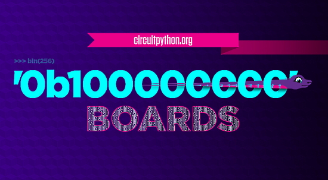](https://circuitpython.org/downloads)

A milestone achieved and passed - 256 boards running CircuitPython. Why celebrate at 256? That's one more than fits in an 8-bit value (0-255) so we're celebrating 0b100000000 boards!

Did you know that not all CircuitPython boards are made by Adafruit? Not by a long stretch! SparkFun has fifteen boards, Pimoroni has nine, and so many more. CircuitPython is an open source language which any hardware designer may look to use. 

## CircuitPython 7.2.0 Release Candidate 0

CircuitPython 7.2.0-rc.0, the initial release candidate for CircuitPython 7.2.0, was posted late last week. It is considered stable, but the CircuitPython team wants to give time for further testing before the final release of 7.2.0 - [GitHub](https://github.com/adafruit/circuitpython/releases).

**Notable additions to 7.2.0 since 7.1.1**

* Continuing work on Raspberry Pi Broadcom board support.
* Espressif ESP32-S3 and ESP32-C3 support, including BLE.
* RP2040 PIO sideset support.
* `board.STEMMA_I2C()` available on all boards with STEMMA connectors.
* `binascii.crc32()`.
* `vectorio.contains()`.
* Turkish translation.

## WipperSnapper No-Code IoT Platform now works with Adafruit Feather HUZZAH ESP8266

[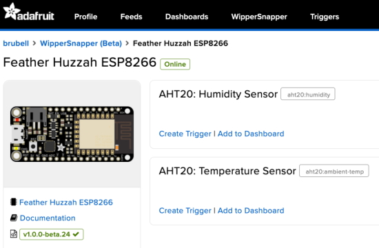](https://blog.adafruit.com/2022/02/14/wippersnapper-no-code-iot-platform-now-works-with-adafruit-feather-huzzah-esp8266/)

Adafruit.io WipperSnapper support for the Adafruit Feather Huzzah ESP8266 is here. Over the past few weeks, Melissa worked on a web-based installation tool to upload firmware to an ESP8266 or ESP32. Additionally, this web tool also generates a LittleFS filesystem containing Adafruit IO and WiFi network credentials and uploads them to your ESP32/ESP8266 board - [Adafruit Blog](https://blog.adafruit.com/2022/02/14/wippersnapper-no-code-iot-platform-now-works-with-adafruit-feather-huzzah-esp8266/).

## Universities Teaching RISC-V Poll

[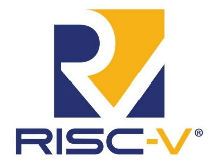](https://docs.google.com/forms/d/e/1FAIpQLSfRxBqHvnPZs8TG7BWtLOVBYa1IuK1EB7Y4pyjDQxb9sVZfBw/viewform)

RISC-V, a free and open ISA, supports professors and students through events, trainings, lecture resources and mentorships. In order to make universities aware of new and existing resources The RISC-V Organization would like to know what you teach and who to contact at your university with new resources - [Google Poll](https://docs.google.com/forms/d/e/1FAIpQLSfRxBqHvnPZs8TG7BWtLOVBYa1IuK1EB7Y4pyjDQxb9sVZfBw/viewform).

## Python Software Foundation News

The Python Software Foundation has funding available for designing, developing and deploying organization accounts in PyPI - [PSF Blog](https://pyfound.blogspot.com/2022/02/we-are-hiring-contract-developers-to.html).

> PyPI is the official repository of Python packages. PyPI allows users to search for packages, publish and distribute packages. The aim of this project is to allow PyPI users to set up an organization account, invite other users to join, organize those users into teams, and manage ownership and permissions across multiple projects. We hope to provide organization accounts as a paid service to companies and complimentary access to community projects. The organization account feature will provide the structure based on which new features can be offered to paying customers.You can read this post that summarizes the user surveys.

They hope to hire two contractors who will code, test, review, document and deploy the organization account features. The two contractors include one backend developer and one frontend developer. The solicitaion is now open and it closed March 4th.

**What is PyPI (pip)?**

[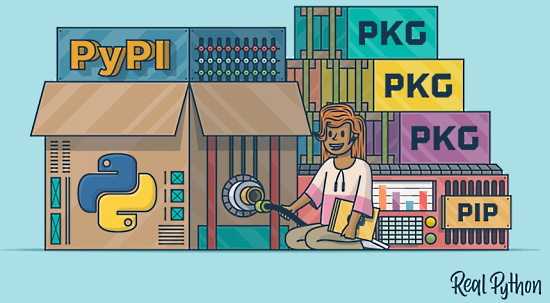](https://realpython.com/what-is-pip/)

Fortunately, Real Python just came out with a copmprehensive page on pip and PyPI: Using Python's pip to Manage Your Projects' Dependencies - [Real Python](https://realpython.com/what-is-pip/).

## CircuitPython Deep Dive Stream with Scott Shawcroft

[This week](https://youtu.be/iOgwQSAiydM), Scott streams his work on a CircuitPython USB Host API.

You can see the latest video and past videos on the Adafruit YouTube channel under the Deep Dive playlist - [YouTube](https://www.youtube.com/playlist?list=PLjF7R1fz_OOXBHlu9msoXq2jQN4JpCk8A).

Programming Note: Scottis planning to livestream on February 25th and March 4th before going on paternity leave. Tim (@foamyguy) will be doing deep dives in the same time slot while Scott spends time with his family.

## CircuitPython Parsec

John Park’s CircuitPython Parsec: 

* episode - [Adafruit Blog](url)

Catch all the episodes in the [YouTube playlist](https://www.youtube.com/playlist?list=PLjF7R1fz_OOWFqZfqW9jlvQSIUmwn9lWr).

## The CircuitPython Show

The CircuitPython Show is a new independent podcast, hosted by Paul Cutler, focused on the people doing awesome things with CircuitPython. Each episode features Paul in conversation with a guest for a twenty to thirty minute interview – [CircuitPythonShow](https://circuitpythonshow.com/), [Blog Post](https://paulcutler.org/posts/2022/01/introducing-the-circuitpython-show/) and [Twitter](https://twitter.com/circuitpyshow).

Listen to the Season 1 Trailer now - [CircuitPython Show](https://circuitpythonshow.com/episodes/0/trailer)

The first episode is scheduled to air on March 1st and will feature an interview with Kattni
Rembor as the first guest.

## Project of the Week

[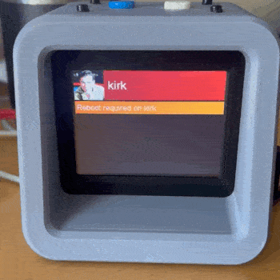](https://github.com/strlng/pyportal-zabbix-problems)

[Zabbix](https://en.wikipedia.org/wiki/Zabbix) is an open-source monitoring software tool to monitor IT infrastructure such as networks, servers, virtual machines (VMs) and cloud services. Zabbix collects and displays monitoring metrics such as CPU, memory, and network load.

Sterling Anderson has developed a stand alone (no computer required) display for Zabbix data. It uses an [Adafruit Pyportal](https://www.adafruit.com/product/4116) programmed in CircuitPython to fetch data via WiFi and display it on a color LCD display. It is housed in a 3D printed case - [GitHub](https://github.com/strlng/pyportal-zabbix-problems).

## News from around the web!

A comment on how embedded Python has made programming easier - [Twitter](https://twitter.com/hendric/status/1494682467990659073).

PAR Buddy is a DIY PPFD sensor for home growers to use as a guide for adjusting the height of indoor LEDs during a grow season - [Reddit](https://www.reddit.com/r/adafruit/comments/sup16v/using_the_as7341_as_a_par_meter/) and [GitHub](https://github.com/solarslurpi/GrowBuddy/blob/main/pages/PAR_Buddy.md).

[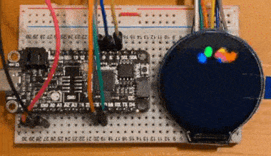](https://twitter.com/AoyamaProd/status/1492476980058800128)

Calculating vector using numpy(ulab module) in CircuitPython to bounce balls at the round edge of the screen - [Twitter](https://twitter.com/AoyamaProd/status/1492476980058800128).

[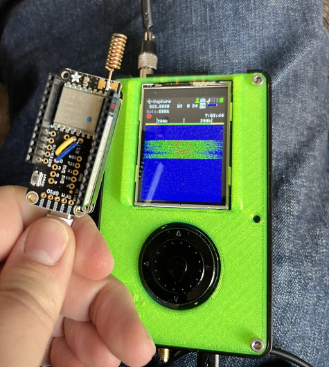](https://twitter.com/aromond2001/status/1494373308057501699)

> A little LoRa on my lunch break with the RFM95, RP2040, CircuitPython, and HackRF - [Twitter](https://twitter.com/aromond2001/status/1494373308057501699).

> A quick little MIDI in demo. An Adafruit QT Py RP2040 is receiving MIDI from the keyboard over a Raspberry Pi host. MIDI message and note number is displayed on the screen - [Twitter](https://twitter.com/BlitzCityDIY/status/1494116273109848069).

[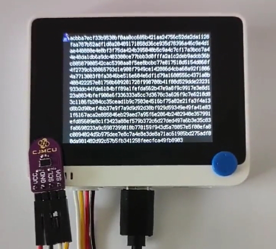](https://twitter.com/fabaff/status/1495353210680352769)

> Just a couple lines of code and you have your own CircuitPython-based hardware random number generator (HRNG) with a "poor man serial streaming interface" - [Twitter](https://twitter.com/fabaff/status/1495353210680352769).

[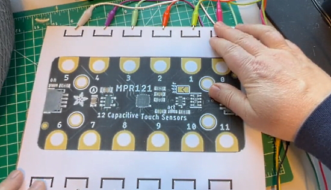](https://twitter.com/gallaugher/status/1495411170274168834)

A CircuitPython audiomixer demo with a Circuit Playground Bluefruit and MPR121 touch sensor - [Twitter](https://twitter.com/gallaugher/status/1495411170274168834).

[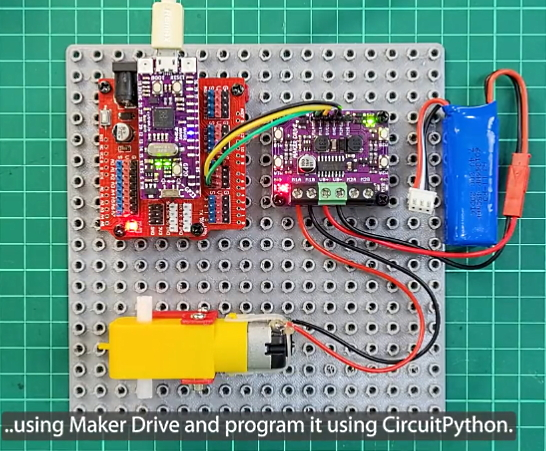](https://tutorial.cytron.io/2022/02/15/control-dc-motor-using-maker-drive-and-circuitpython-on-rp2040/)

Control DC motor using Maker Drive and CircuitPython on an RP2040 board - [Cytron](https://tutorial.cytron.io/2022/02/15/control-dc-motor-using-maker-drive-and-circuitpython-on-rp2040/) and [YouTube](https://youtu.be/GyTpytJ9qY8), via [Twitter](https://twitter.com/cytrontech/status/1493797283866943488).

text - [site](url).

text - [site](url).

text - [site](url).

text - [site](url).

text - [site](url).

text - [site](url).

An RP2040 multi timer with RGB keys with MicroPython - [Adafruit Blog](https://blog.adafruit.com/2022/02/18/an-rp2040-multi-timer-with-rgb-keys-raspberrypipico-piday/), [YouTube](https://youtu.be/n4XXL8GbGho), [project page](http://ratfactor.com/multitimer) and [GitHub](https://github.com/ratfactor/pico-multitimer).

An ESP32 walks into a bar - Jokes web API MicroPython tutorial to learn the network and urequests libraries - [Bhavesh Kakwani](https://bhave.sh/micropython-urequests/).

[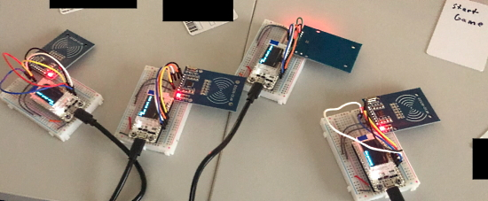](https://hackaday.io/project/183949-sus-real-life-among-us)

A real life version of Among Us. Built using ESP32s with OLED displays and RFID readers. The software was written in Python and MicroPython, with a centralised server running over WiFi on a Raspberry Pi  - [hackaday.io](https://hackaday.io/project/183949-sus-real-life-among-us) via [Twitter](https://twitter.com/HexenTronics/status/1494014015781093382).

text - [site](url).

text - [site](url).

text - [site](url).

Understanding Linked Lists - [Real Python](https://realpython.com/lessons/understand-linked-lists/).

PyDev of the Week:

CircuitPython Weekly Meeting for 

#ICYDNCI What was the most popular, most clicked link, in [last week's newsletter](https://www.adafruitdaily.com/2022/02/15/python-on-microcontrollers-newsletter-500-adafruit-open-source-boards-circuitpython-7-2-0-alpha-2-and-much-more-python-circuitpython-micropython-thepsf/)? [Linux Path Cheat Sheet](https://twitter.com/hackinarticles/status/1491297062767718400).

## Coming soon

[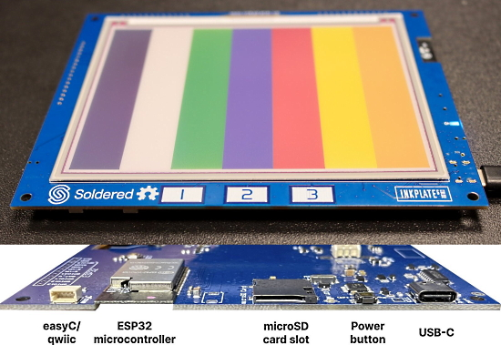](https://www.crowdsupply.com/e-radionica/inkplate-6color)

Just launched: Inkplate 6COLOR by eradionica, a versatile, easy-to-use, low power, Wi-Fi-enabled 5.8" e-paper COLOR display. Plug in a USB cable, open MicroPython (or Arduino), and change the display with just a few lines of code - [CrowdSupply](https://www.crowdsupply.com/e-radionica/inkplate-6color) via [Twitter](https://twitter.com/crowd_supply/status/1493661389512187909).

text - [site](url).

## New Boards Supported by CircuitPython

The number of supported microcontrollers and Single Board Computers (SBC) grows every week. This section outlines which boards have been included in CircuitPython or added to [CircuitPython.org](https://circuitpython.org/).

This week, there were (#/no) new boards added!

- [Board name](url)
- [Board name](url)
- [Board name](url)

*Note: For non-Adafruit boards, please use the support forums of the board manufacturer for assistance, as Adafruit does not have the hardware to assist in troubleshooting.*

Looking to add a new board to CircuitPython? It's highly encouraged! Adafruit has four guides to help you do so:

- [How to Add a New Board to CircuitPython](https://learn.adafruit.com/how-to-add-a-new-board-to-circuitpython/overview)
- [How to add a New Board to the circuitpython.org website](https://learn.adafruit.com/how-to-add-a-new-board-to-the-circuitpython-org-website)
- [Adding a Single Board Computer to PlatformDetect for Blinka](https://learn.adafruit.com/adding-a-single-board-computer-to-platformdetect-for-blinka)
- [Adding a Single Board Computer to Blinka](https://learn.adafruit.com/adding-a-single-board-computer-to-blinka)

## New Learn Guides!

[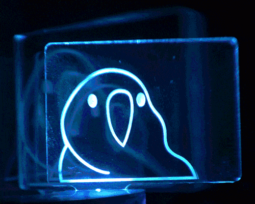](https://learn.adafruit.com/guides/latest)

[Party Parrot Zoetrope](https://learn.adafruit.com/party-parrot-zoetrope) from [Noe and Pedro](https://learn.adafruit.com/users/pixil3d) and [Liz Clark](https://learn.adafruit.com/users/BlitzCityDIY)

[Adafruit ADXL375](https://learn.adafruit.com/adafruit-adxl375) from [Kattni](https://learn.adafruit.com/users/kattni)

[Exercise Buddy: Motion aware BLE media controller](https://learn.adafruit.com/exercise-buddy) from [Charlyn G](https://learn.adafruit.com/users/chardane)

## Updated Learn Guides!

[Adafruit EyeLights LED Glasses and Driver](https://learn.adafruit.com/adafruit-eyelights-led-glasses-and-driver/displayio-message-scroller) from [Mark Komus](https://learn.adafruit.com/users/Gamblor21)

## CircuitPython Libraries!

CircuitPython support for hardware continues to grow. We are adding support for new sensors and breakouts all the time, as well as improving on the drivers we already have. As we add more libraries and update current ones, you can keep up with all the changes right here!

For the latest libraries, download the [Adafruit CircuitPython Library Bundle](https://circuitpython.org/libraries). For the latest community contributed libraries, download the [CircuitPython Community Bundle](https://github.com/adafruit/CircuitPython_Community_Bundle/releases).

If you'd like to contribute, CircuitPython libraries are a great place to start. Have an idea for a new driver? File an issue on [CircuitPython](https://github.com/adafruit/circuitpython/issues)! Have you written a library you'd like to make available? Submit it to the [CircuitPython Community Bundle](https://github.com/adafruit/CircuitPython_Community_Bundle). Interested in helping with current libraries? Check out the [CircuitPython.org Contributing page](https://circuitpython.org/contributing). We've included open pull requests and issues from the libraries, and details about repo-level issues that need to be addressed. We have a guide on [contributing to CircuitPython with Git and Github](https://learn.adafruit.com/contribute-to-circuitpython-with-git-and-github) if you need help getting started. You can also find us in the #circuitpython channels on the [Adafruit Discord](https://adafru.it/discord).

You can check out this [list of all the Adafruit CircuitPython libraries and drivers available](https://github.com/adafruit/Adafruit_CircuitPython_Bundle/blob/master/circuitpython_library_list.md). 

The current number of CircuitPython libraries is **345**!

**New Libraries!**

Here's this week's new CircuitPython libraries:

 * [Adafruit_CircuitPython_Typing](https://github.com/adafruit/Adafruit_CircuitPython_Typing)
 * [Adafruit_CircuitPython_ADXL37x](https://github.com/adafruit/Adafruit_CircuitPython_ADXL37x)

**Updated Libraries!**

Here's this week's updated CircuitPython libraries:

 * [Adafruit_CircuitPython_HTTPServer](https://github.com/adafruit/Adafruit_CircuitPython_HTTPServer)
 * [Adafruit_CircuitPython_ST7789](https://github.com/adafruit/Adafruit_CircuitPython_ST7789)
 * [Adafruit_CircuitPython_LED_Animation](https://github.com/adafruit/Adafruit_CircuitPython_LED_Animation)
 * [Adafruit_CircuitPython_VL6180X](https://github.com/adafruit/Adafruit_CircuitPython_VL6180X)
 * [Adafruit_CircuitPython_AMG88xx](https://github.com/adafruit/Adafruit_CircuitPython_AMG88xx)
 * [Adafruit_CircuitPython_AHTx0](https://github.com/adafruit/Adafruit_CircuitPython_AHTx0)
 * [Adafruit_CircuitPython_FocalTouch](https://github.com/adafruit/Adafruit_CircuitPython_FocalTouch)
 * [Adafruit_CircuitPython_AS726x](https://github.com/adafruit/Adafruit_CircuitPython_AS726x)
 * [Adafruit_CircuitPython_ADT7410](https://github.com/adafruit/Adafruit_CircuitPython_ADT7410)
 * [Adafruit_CircuitPython_Debouncer](https://github.com/adafruit/Adafruit_CircuitPython_Debouncer)
 * [Adafruit_CircuitPython_MCP9600](https://github.com/adafruit/Adafruit_CircuitPython_MCP9600)
 * [Adafruit_CircuitPython_BME280](https://github.com/adafruit/Adafruit_CircuitPython_BME280)
 * [Adafruit_CircuitPython_BLE_BroadcastNet](https://github.com/adafruit/Adafruit_CircuitPython_BLE_BroadcastNet)
 * [Adafruit_CircuitPython_NeoKey](https://github.com/adafruit/Adafruit_CircuitPython_NeoKey)
 * [Adafruit_CircuitPython_PN532](https://github.com/adafruit/Adafruit_CircuitPython_PN532)
 * [Adafruit_CircuitPython_Requests](https://github.com/adafruit/Adafruit_CircuitPython_Requests)
 * [Adafruit_CircuitPython_TLA202x](https://github.com/adafruit/Adafruit_CircuitPython_TLA202x)
 * [Adafruit_CircuitPython_BLE](https://github.com/adafruit/Adafruit_CircuitPython_BLE)
 * [Adafruit_CircuitPython_ADXL34x](https://github.com/adafruit/Adafruit_CircuitPython_ADXL34x)
 * [Adafruit_CircuitPython_Ticks](https://github.com/adafruit/Adafruit_CircuitPython_Ticks)
 * [Adafruit_CircuitPython_IRRemote](https://github.com/adafruit/Adafruit_CircuitPython_IRRemote)
 * [Adafruit_CircuitPython_BLE_Radio](https://github.com/adafruit/Adafruit_CircuitPython_BLE_Radio)
 * [Adafruit_CircuitPython_BNO08x_RVC](https://github.com/adafruit/Adafruit_CircuitPython_BNO08x_RVC)
 * [Adafruit_CircuitPython_BusDevice](https://github.com/adafruit/Adafruit_CircuitPython_BusDevice)
 * [Adafruit_CircuitPython_Debug_I2C](https://github.com/adafruit/Adafruit_CircuitPython_Debug_I2C)
 * [Adafruit_CircuitPython_AS7341](https://github.com/adafruit/Adafruit_CircuitPython_AS7341)
 * [Adafruit_Blinka](https://github.com/adafruit/Adafruit_Blinka)
 * [Adafruit_Python_PlatformDetect](https://github.com/adafruit/Adafruit_Python_PlatformDetect)
 * [CircuitPython_Community_Bundle](https://github.com/adafruit/CircuitPython_Community_Bundle)

## What’s the team up to this week?

What is the team up to this week? Let’s check in!

**Dan**

Last week the CircuitPython team went over the open issues for 7.2.0 and 7.x.x, and did some triage. As of last Thursday, the team has fixed all the remaining 7.2.0 issues, and we are on track for a 7.2.0-rc.0 release.

I did some type annotation infrastructure work, moving `circuitpython_typing` out of `adafruit-blinka` and into its own library. A few type-annotated libraries then needed their dependencies updated. This was partly prelude for my continuing work on an asyncio-enabled HTTP requests library.

**Jeff**

I finally got to do some heads-down work on CircuitPython this past week. MicroPython 1.18 was released on January 16, and now there's a Pull Request to merge it into CircuitPython. It doesn't bring any big user-visible changes, but we're always happy when we can keep up with the latest updates and bugfixes to the core. We owe a hearty thanks to the contributors to MicroPython. By my quick count, there were as many as 57 contributors to MicroPython between versions 1.17 and 1.18.

**Kattni**

This week I published the ADXL375 guide, and updated the VEML7700 guide with the STEMMA QT rev. I got to dip my toes into code a bit with writing the ADXL37x library, and then adding the offsets feature and an example using it to the ADXL34x library. I am working on getting TFT and WiFi examples into the Feather TFT guide, so if you picked one up and have been waiting on these demos, keep an eye out for that update.

I also recorded my episode of the CircuitPython Show Podcast, which will be released on 1 March 2022, if all goes as planned. I had a lot of fun recording it, and got to share my story which I always enjoy doing. If you're interested in how I got into this whole thing in the first place, check it out!

**Melissa**

This past week I worked on catching up with issues and pull requests that had been waiting for me on GitHub while I finished up the LittleFS project. One of the issues I found particularly perplexing is that on the 2.7" E-Ink displays in Arduino, it would invert the colors when a reset pin was used. The issue turned out to be a missing init code.

**Tim**

This week I finished up the PyPortal Winamp Player Learn Guide and recorded a short video introducing it. This guide has some code for the PyPortal as well as some CPython code that runs on your PC, I updated our project files screenshot utility to be able to omit the files used on the PC from the screenshot shown on the Learn Guide Pages. I also created a few basic displayio examples for the Feather TFT ESP32-S2. 

Thanks to some help from members of our community in the Discord (Neradoc and anecdata), we have narrowed down an issue with pulling data from a NASA API for the Webb Telescope to something resolved by a newer certificate. Next week, I'll be looking into how to update the certificates that CircuitPython uses by default.

**Scott**

This week I've been wrapping up the BLE work that I did for ESP32-S3. I added a PacketBuffer test example and a new native CircuitPython BroadcastNet bridge that should be simpler to keep running. The last outstanding PR is to get GATT client support into CircuitPython main. This will allow you to use CP with other devices and their data.

For most of the week I've been diving into using PIO for USB Host. I was perusing the USB 2.0 spec and learning about the various layers. [This video](https://www.youtube.com/watch?v=wdgULBpRoXk) is a great video from Ben Eater about the USB encoding. I also got the demo code from https://github.com/sekigon-gonnoc/Pico-PIO-USB working. Now I'm working to integrate it into TinyUSB. I'm starting with timing the start of frame packets and then will integrate the other packets into the frame loop.

## Upcoming events!

The next MicroPython Meetup in Melbourne will be on **February 23rd** – [Meetup](https://www.meetup.com/MicroPython-Meetup/). See [info](https://twitter.com/matt_trentini/status/1489038649878454273?t=qIcYlRq4vTqpssljyfI71Q&s=03) and the [slides](https://docs.google.com/presentation/d/e/2PACX-1vS8gSjPatIf8LgJD_t1_cglL5FO7jEWDTqy-Lbff3xBA7CskAVy_sM2FjfofILWtIF7atyg5Jx--0Sx/pub?slide=id.p) of the February 2nd meeting.

PyCon US 2022 planning is underway. The team is planning to host the event in person with an online component. April 27, 2022 - May 5, 2022. Head over to the [PyCon US 2022 website](https://us.pycon.org/2022/) for details about the conference and more information about the sponsorship program - [PyCon Blog](https://pycon.blogspot.com/2022/10/pycon-us-2022-website-and-sponsorship.html).

PyCon Italia is the Italian conference on Python. Organised by Python Italia, it is one of the more important Python conferences in Europe. With over 700 attendees, the next edition will be June 2-5, 2022 - [Ticket Registration](https://pycon.it/en/tickets).

SciPy 2022, the 21st annual Scientific Computing with Python conference, will be held in Austin, Texas, USA from July 11-17, 2022. The annual SciPy Conference brings together attendees from industry, academia, and government to showcase their latest projects, learn from skilled users and developers, and collaborate on code development. The full program will consist of 2 days tutorials (July 11-12), 3 days of talks (July 13-15) and 2 days of developer sprints (July 16-17) - [SciPy 2022](https://www.scipy2022.scipy.org/).

**Send Your Events In**

As for other events, with the COVID pandemic, most in-person events are postponed or cancelled. If you know of virtual events or events that may occur in the future, please let us know on Twitter with hashtag #CircuitPython or email to cpnews(at)adafruit(dot)com.

## Latest releases

CircuitPython's stable release is [#.#.#](https://github.com/adafruit/circuitpython/releases/latest) and its unstable release is [#.#.#-##.#](https://github.com/adafruit/circuitpython/releases). New to CircuitPython? Start with our [Welcome to CircuitPython Guide](https://learn.adafruit.com/welcome-to-circuitpython).

[2022####](https://github.com/adafruit/Adafruit_CircuitPython_Bundle/releases/latest) is the latest CircuitPython library bundle.

[v#.#.#](https://micropython.org/download) is the latest MicroPython release. Documentation for it is [here](http://docs.micropython.org/en/latest/pyboard/).

[#.#.#](https://www.python.org/downloads/) is the latest Python release. The latest pre-release version is [#.#.#](https://www.python.org/download/pre-releases/).

[#### Stars](https://github.com/adafruit/circuitpython/stargazers) Like CircuitPython? [Star it on GitHub!](https://github.com/adafruit/circuitpython)

## Call for help -- Translating CircuitPython is now easier than ever!

One important feature of CircuitPython is translated control and error messages. With the help of fellow open source project [Weblate](https://weblate.org/), we're making it even easier to add or improve translations. 

Sign in with an existing account such as GitHub, Google or Facebook and start contributing through a simple web interface. No forks or pull requests needed! As always, if you run into trouble join us on [Discord](https://adafru.it/discord), we're here to help.

## jobs.adafruit.com - Find a dream job, find great candidates!

[jobs.adafruit.com](https://jobs.adafruit.com/) has returned and folks are posting their skills (including CircuitPython) and companies are looking for talented makers to join their companies - from Digi-Key, to Hackaday, Micro Center, Raspberry Pi and more.

**Job of the Week**

Firmware Engineer - Battery Management - Analog Devices - [Adafruit Jobs Board](https://jobs.adafruit.com/job/firmware-engineer-battery-management/).

## NUMBER thanks!

The Adafruit Discord community, where we do all our CircuitPython development in the open, reached over NUMBER humans - thank you!  Adafruit believes Discord offers a unique way for Python on hardware folks to connect. Join today at [https://adafru.it/discord](https://adafru.it/discord).

## ICYMI - In case you missed it

Python on hardware is the Adafruit Python video-newsletter-podcast! The news comes from the Python community, Discord, Adafruit communities and more and is broadcast on ASK an ENGINEER Wednesdays. The complete Python on Hardware weekly videocast [playlist is here](https://www.youtube.com/playlist?list=PLjF7R1fz_OOXRMjM7Sm0J2Xt6H81TdDev). The video podcast is on [iTunes](https://itunes.apple.com/us/podcast/python-on-hardware/id1451685192?mt=2), [YouTube](http://adafru.it/pohepisodes), [IGTV (Instagram TV](https://www.instagram.com/adafruit/channel/)), and [XML](https://itunes.apple.com/us/podcast/python-on-hardware/id1451685192?mt=2).

[The weekly community chat on Adafruit Discord server CircuitPython channel - Audio / Podcast edition](https://itunes.apple.com/us/podcast/circuitpython-weekly-meeting/id1451685016) - Audio from the Discord chat space for CircuitPython, meetings are usually Mondays at 2pm ET, this is the audio version on [iTunes](https://itunes.apple.com/us/podcast/circuitpython-weekly-meeting/id1451685016), Pocket Casts, [Spotify](https://adafru.it/spotify), and [XML feed](https://adafruit-podcasts.s3.amazonaws.com/circuitpython_weekly_meeting/audio-podcast.xml).

## Codecademy "Learn Hardware Programming with CircuitPython"

Codecademy, an online interactive learning platform used by more than 45 million people, has teamed up with Adafruit to create a coding course, “Learn Hardware Programming with CircuitPython”. The course is now available in the [Codecademy catalog](https://www.codecademy.com/learn/learn-circuitpython?utm_source=adafruit&utm_medium=partners&utm_campaign=circuitplayground&utm_content=pythononhardwarenewsletter).

## Contribute!

The CircuitPython Weekly Newsletter is a CircuitPython community-run newsletter emailed every Tuesday. The complete [archives are here](https://www.adafruitdaily.com/category/circuitpython/). It highlights the latest CircuitPython related news from around the web including Python and MicroPython developments. To contribute, edit next week's draft [on GitHub](https://github.com/adafruit/circuitpython-weekly-newsletter/tree/gh-pages/_drafts) and [submit a pull request](https://help.github.com/articles/editing-files-in-your-repository/) with the changes. You may also tag your information on Twitter with #CircuitPython. 

Join the Adafruit [Discord](https://adafru.it/discord) or [post to the forum](https://forums.adafruit.com/viewforum.php?f=60) if you have questions.
