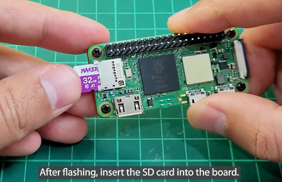
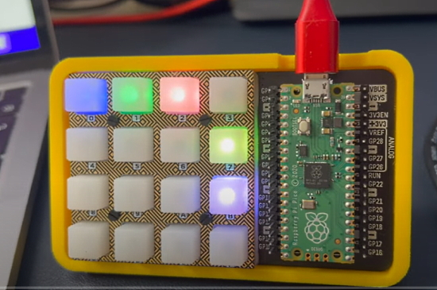
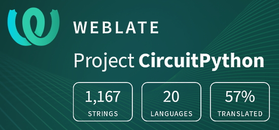

- [X] Kattni updates
- [ ] change date
- [ ] update title
- [ ] Feature story
- [ ] Update  for images
- [ ] Update ICYDNCI
- [ ] All images 550w max only
- [ ] Link "View this email in your browser."

News Sources

- [python.org](https://www.python.org/)
- [Python Insider - dev team blog](https://pythoninsider.blogspot.com/)
- [MicroPython Meetup Blog](https://melbournemicropythonmeetup.github.io/)
- [hackaday.io newest projects MicroPython](https://hackaday.io/projects?tag=micropython&sort=date) and [CircuitPython](https://hackaday.io/projects?tag=circuitpython&sort=date)
- [hackaday CircuitPython](https://hackaday.com/blog/?s=circuitpython) and [MicroPython](https://hackaday.com/blog/?s=micropython)
- [hackster.io CircuitPython](https://www.hackster.io/search?q=circuitpython&i=projects&sort_by=most_recent) and [MicroPython](https://www.hackster.io/search?q=micropython&i=projects&sort_by=most_recent)

View this email in your browser.

Welcome to the latest Python on Microcontrollers newsletter! Events on the world stage are eclipsing work in Python. It is heartening the amount of support eminating from the community and efforts like getting Starlink terminals into Ukraine. 

We're on [Discord](https://discord.gg/HYqvREz), [Twitter](https://twitter.com/search?q=circuitpython&src=typed_query&f=live), and for past newsletters - [view them all here](https://www.adafruitdaily.com/category/circuitpython/). If you're reading this on the web, [subscribe here](https://www.adafruitdaily.com/). Here's the news this week:

## Headline Article

text - [site](url).

## Feature

text - [site](url).

## Dublin Linux Developer meetup with Adafruit March 5th

Dublin Linux Developers met online with Jeff Epler and Melissa LeBlanc-Williams from Adafruit onMarch 5th - [Meetup](https://www.meetup.com/Dublin-Linux-Developers/events/283916463/) and [Adafruit Blog](https://blog.adafruit.com/2022/03/02/dublin-linux-developer-online-meetup-with-adafruit-march-5th-linux-adafruit-circuitpython/).

Jeff's presentation will be on "From Zero to CircuitPython". CircuitPython is an embedded implementation of the Python language, a friendly fork of MicroPython primarily developed by Adafruit and designed to simplify experimenting and learning to code on low-cost microcontroller boards. Jeff will demo the process from receiving a factory fresh Adafruit board to showing the Dublin forecast downloaded over WiFi on the board's built-in TFT display. Some prior familiarity with Python and JSON is helpful, but not essential. Github gist of the code written during the session and other links will be provided via chat.

Melissa's presentation is “Getting to Blinky with Blinka” and will include be an overview of how easy it is to get up and running with Adafruit Blinka on a Raspberry Pi. She will also be showing off a couple of her other projects including a scrolling message board that can easily be scripted using Python and TI calculator with a fully working Raspberry Pi Zero inside. Both projects are running Linux as the base OS. 

*Note: apologies this wasn't in last week's issue.*

## The Python Software Foundation

The Python Software Foundation are hiring to expand their Infrastructure staff. [See the job listing here](https://www.python.org/jobs/6261/). Applicants from around the world are welcome for this remote position - [The PSF Blog](https://pyfound.blogspot.com/2022/03/we-are-hiring-to-expand-our.html).

## CircuitPython Deep Dive Stream

[This week](link), Tim (foamyguy) joins Scott. Tim will be taking the reins starting next week during the time Scott is on paternity leave.

You can see the latest video and past videos on the Adafruit YouTube channel under the Deep Dive playlist - [YouTube](https://www.youtube.com/playlist?list=PLjF7R1fz_OOXBHlu9msoXq2jQN4JpCk8A).

## CircuitPython Parsec

John Park’s CircuitPython Parsec: 

* episode - [Adafruit Blog](url) and [YouTube]().

Catch all the episodes in the [YouTube playlist](https://www.youtube.com/playlist?list=PLjF7R1fz_OOWFqZfqW9jlvQSIUmwn9lWr).

## The CircuitPython Show

The CircuitPython Show is a new independent podcast, hosted by Paul Cutler, focused on the people doing awesome things with CircuitPython. Each episode features Paul in conversation with a guest for a twenty to thirty minute interview – [CircuitPythonShow](https://circuitpythonshow.com/), [Blog Post](https://paulcutler.org/posts/2022/01/introducing-the-circuitpython-show/) and [Twitter](https://twitter.com/circuitpyshow).

Listen to the Season 1 Trailer now - [CircuitPython Show](https://circuitpythonshow.com/episodes/0/trailer)

The first episode is scheduled to air on March 1st and will feature an interview with Kattni
Rembor as the first guest.

## Project of the Week

Armawatch is a wrist mount reimagination of the [Armachat](https://hackaday.io/project/179854-picomputer) microcontroller board. 

The board is powered by a [Waveshare RP2040-LCD](https://www.waveshare.com/RP2040-LCD-0.96.htm) with a 0.96" IPS LCD display. It also has a full keyboard. The firmware is based on CircuitPython.

See more on [YouTube](https://www.youtube.com/watch?v=nmVtuAFtQGE) and on [Twitter]().

## News from around the web!

Program a Raspberry Pi Zero 2 W (without needing an operating system) using CircuitPython - [Cytron](https://tutorial.cytron.io/2022/03/02/program-raspberry-pi-zero-2-w-without-os/) and [YouTube](https://youtu.be/g3HQR6I3Sbk), via [Twitter](https://twitter.com/cytrontech/status/1498957466025218052).

PiDeck turns a Pimoroni Pico RBG Keypad into a USB Shortcut Keypad Programmed in CircuitPython). It's similar to a Streamdeck X-keys - [Twitter](https://twitter.com/kevsmac/status/1499521133913284608), [YouTube](https://youtu.be/0XZPE4S9fZo) and [GitHub](https://github.com/kevinmcaleer/pideck).

text - [site](url).

text - [site](url).

text - [site](url).

text - [site](url).

text - [site](url).

text - [site](url).

text - [site](url).

text - [site](url).

text - [site](url).

text - [site](url).

text - [site](url).

text - [site](url).

text - [site](url).

text - [site](url).

text - [site](url).

text - [site](url).

text - [site](url).

text - [site](url).

PyDev of the Week:

CircuitPython Weekly Meeting for 

**#ICYDNCI What was the most popular, most clicked link, in [last week's newsletter](https://link)? [title](url).**

## Coming Soon

text - [site](url).

text - [site](url).

## New Boards Supported by CircuitPython

The number of supported microcontrollers and Single Board Computers (SBC) grows every week. This section outlines which boards have been included in CircuitPython or added to [CircuitPython.org](https://circuitpython.org/).

This week, there were (#/no) new boards added!

- [Board name](url)
- [Board name](url)
- [Board name](url)

*Note: For non-Adafruit boards, please use the support forums of the board manufacturer for assistance, as Adafruit does not have the hardware to assist in troubleshooting.*

Looking to add a new board to CircuitPython? It's highly encouraged! Adafruit has four guides to help you do so:

- [How to Add a New Board to CircuitPython](https://learn.adafruit.com/how-to-add-a-new-board-to-circuitpython/overview)
- [How to add a New Board to the circuitpython.org website](https://learn.adafruit.com/how-to-add-a-new-board-to-the-circuitpython-org-website)
- [Adding a Single Board Computer to PlatformDetect for Blinka](https://learn.adafruit.com/adding-a-single-board-computer-to-platformdetect-for-blinka)
- [Adding a Single Board Computer to Blinka](https://learn.adafruit.com/adding-a-single-board-computer-to-blinka)

## New Learn Guides!

[Sketch Drawing Toy with CircuitPython](https://learn.adafruit.com/sketch-drawing-toy) from [Noe and Pedro, and Carter Nelson](https://learn.adafruit.com/users/pixil3d)

## CircuitPython Libraries!

CircuitPython support for hardware continues to grow. We are adding support for new sensors and breakouts all the time, as well as improving on the drivers we already have. As we add more libraries and update current ones, you can keep up with all the changes right here!

For the latest libraries, download the [Adafruit CircuitPython Library Bundle](https://circuitpython.org/libraries). For the latest community contributed libraries, download the [CircuitPython Community Bundle](https://github.com/adafruit/CircuitPython_Community_Bundle/releases).

If you'd like to contribute, CircuitPython libraries are a great place to start. Have an idea for a new driver? File an issue on [CircuitPython](https://github.com/adafruit/circuitpython/issues)! Have you written a library you'd like to make available? Submit it to the [CircuitPython Community Bundle](https://github.com/adafruit/CircuitPython_Community_Bundle). Interested in helping with current libraries? Check out the [CircuitPython.org Contributing page](https://circuitpython.org/contributing). We've included open pull requests and issues from the libraries, and details about repo-level issues that need to be addressed. We have a guide on [contributing to CircuitPython with Git and Github](https://learn.adafruit.com/contribute-to-circuitpython-with-git-and-github) if you need help getting started. You can also find us in the #circuitpython channels on the [Adafruit Discord](https://adafru.it/discord).

You can check out this [list of all the Adafruit CircuitPython libraries and drivers available](https://github.com/adafruit/Adafruit_CircuitPython_Bundle/blob/master/circuitpython_library_list.md). 

The current number of CircuitPython libraries is **346**!

**Updated Libraries!**

Here's this week's updated CircuitPython libraries:

 * [Adafruit_CircuitPython_asyncio](https://github.com/adafruit/Adafruit_CircuitPython_asyncio)
 * [Adafruit_CircuitPython_INA219](https://github.com/adafruit/Adafruit_CircuitPython_INA219)
 * [Adafruit_CircuitPython_LSM6DS](https://github.com/adafruit/Adafruit_CircuitPython_LSM6DS)
 * [Adafruit_CircuitPython_seesaw](https://github.com/adafruit/Adafruit_CircuitPython_seesaw)
 * [Adafruit_CircuitPython_MacroPad](https://github.com/adafruit/Adafruit_CircuitPython_MacroPad)
 * [Adafruit_CircuitPython_DotStar](https://github.com/adafruit/Adafruit_CircuitPython_DotStar)
 * [Adafruit_CircuitPython_MiniMQTT](https://github.com/adafruit/Adafruit_CircuitPython_MiniMQTT)
 * [Adafruit_CircuitPython_Typing](https://github.com/adafruit/Adafruit_CircuitPython_Typing)
 * [Adafruit_CircuitPython_VL6180X](https://github.com/adafruit/Adafruit_CircuitPython_VL6180X)
 * [Adafruit_CircuitPython_ESP_ATcontrol](https://github.com/adafruit/Adafruit_CircuitPython_ESP_ATcontrol)
 * [Adafruit_CircuitPython_SI7021](https://github.com/adafruit/Adafruit_CircuitPython_SI7021)
 * [Adafruit_CircuitPython_24LC32](https://github.com/adafruit/Adafruit_CircuitPython_24LC32)
 * [Adafruit_CircuitPython_CursorControl](https://github.com/adafruit/Adafruit_CircuitPython_CursorControl)
 * [Adafruit_CircuitPython_BNO055](https://github.com/adafruit/Adafruit_CircuitPython_BNO055)
 * [Adafruit_Blinka](https://github.com/adafruit/Adafruit_Blinka)
 * [Adafruit_Python_PlatformDetect](https://github.com/adafruit/Adafruit_Python_PlatformDetect)

## What’s the team up to this week?

What is the team up to this week? Let’s check in!

**Dan**

I released CircuitPython 7.2.0 final about ten days before this issue of the newsletter is published. We have more bugs to fix soon for 7.2.1 or 7.3.0. I'm working on several of these bugs.

I finished some shuffling of Python annotation types from the circuitpython source tree to the `circuitpython_typing` library. The types are used for generating stubs, and are also part of the documentation for core CircuitPython. Now we have a central place for adding new annotation types.

**Jeff**

For testing purposes, I've interfaced a Feather RP2040 to an Apple 2 floppy drive. Using CircuitPython, it's possible to position the read/write head, and obtain flux information from the floppy using the PIO peripheral. This just for experimental purposes, you can find the code [in a github gist](https://gist.github.com/jepler/95cd021e60b354f388298b573d725a69).

I've also tried reading and writing Apple II floppy images with a PC drive, contributing some pull requests to FluxEngine in the process ([1](https://github.com/davidgiven/fluxengine/pull/480), [2](https://github.com/davidgiven/fluxengine/pull/481)). However, a real Apple //e still can't reliably read the disk images I create.

**Kattni**

This week I did a bit of template work in both Arduino and CircuitPython. There are new templates for reading the LC709203 battery monitor on boards that have it, graphics test on board that have a built-in TFT, and using Adafruit IO to send and receive data.

I stumbled into a bug with `microcontroller.cpu.temperature` being called when WiFi is initiated, and went through a series of steps thinking I had fixed it, and it turns out, it's not something we can resolve. There's an issue filed on the ESP-IDF about the exact issue I was having, so it's at a lower level than CircuitPython. I filed an issue on the CircuitPython core so we have somewhere to link it to the IDF issue, and to track it.

**Melissa**

This past week I was out for part of the week due to health issues, but I did manage to get a little work done with updating Blinka to work with the Beaglebone Black on newer versions of the firmware. I also worked on preparing for a talk I gave this past weekend to the Dublin Linux Developers group.

**Tim**

I updated the PyPortal Winamp project to work with and fit nicely on the PyPortal Titano device. It also will now automatically generate a playlist by searching for mp3 files on the sdcard if the user didn't set up their playlist themselves.  I submitted a PR to CircuitPython core and nina-fw repositories to update the root certificates that are used when fetching data from the internet with CircuitPython. These allow us to fetch Webb Telescope data directly from a NASA provided server, so I updated that project to use the new data source and changed it to show the current data returned. 

I made a small update to some documentation of the wifi built-in module in the core. I also did some testing around and attempted to implement a solution to an issue occurring when sending USB HID events and updating large OnDiskBitmaps showing on the display.

**Scott**

This week I've been heads down on USB Host work. A week ago I decided that CircuitPython should provide a subset of the PyUSB API. This is the most commonly used CPython API used for interacting with USB devices. The benefit of copying the API is that we can port over existing code to CircuitPython as well. Making this decision got my brain unblocked.

The first platform I'm adding support for is the iMX RT (most popularly on the Teensy 4.x). The higher end versions of the iMX RT have two USB peripherals. One we can use for CIRCUITPY and one we can use for USB host. I've been getting code going there and revamping the serial debug setup a bit along the way.

## Upcoming events!

The next MicroPython Meetup in Melbourne will be on February 23rd – [Meetup](https://www.meetup.com/MicroPython-Meetup/). See [info](https://twitter.com/matt_trentini/status/1489038649878454273?t=qIcYlRq4vTqpssljyfI71Q&s=03) and the [slides](https://docs.google.com/presentation/d/e/2PACX-1vS8gSjPatIf8LgJD_t1_cglL5FO7jEWDTqy-Lbff3xBA7CskAVy_sM2FjfofILWtIF7atyg5Jx--0Sx/pub?slide=id.p) of the February 2nd meeting.

PyCon US 2022 planning is underway. The team is planning to host the event in person with an online component. April 27, 2022 - May 5, 2022. Head over to the [PyCon US 2022 website](https://us.pycon.org/2022/) for details about the conference and more information about the sponsorship program - [PyCon Blog](https://pycon.blogspot.com/2022/10/pycon-us-2022-website-and-sponsorship.html).

PyCon Italia is the Italian conference on Python. Organised by Python Italia, it is one of the more important Python conferences in Europe. With over 700 attendees, the next edition will be June 2-5, 2022 - [Ticket Registration](https://pycon.it/en/tickets).

SciPy 2022, the 21st annual Scientific Computing with Python conference, will be held in Austin, Texas, USA from July 11-17, 2022. The annual SciPy Conference brings together attendees from industry, academia, and government to showcase their latest projects, learn from skilled users and developers, and collaborate on code development. The full program will consist of 2 days tutorials (July 11-12), 3 days of talks (July 13-15) and 2 days of developer sprints (July 16-17) - [SciPy 2022](https://www.scipy2022.scipy.org/).

**Send Your Events In**

As for other events, with the COVID pandemic, most in-person events are postponed or cancelled. If you know of virtual events or events that may occur in the future, please let us know on Twitter with hashtag #CircuitPython or email to cpnews(at)adafruit(dot)com.

## Latest releases

CircuitPython's stable release is [#.#.#](https://github.com/adafruit/circuitpython/releases/latest) and its unstable release is [#.#.#-##.#](https://github.com/adafruit/circuitpython/releases). New to CircuitPython? Start with our [Welcome to CircuitPython Guide](https://learn.adafruit.com/welcome-to-circuitpython).

[2022####](https://github.com/adafruit/Adafruit_CircuitPython_Bundle/releases/latest) is the latest CircuitPython library bundle.

[v#.#.#](https://micropython.org/download) is the latest MicroPython release. Documentation for it is [here](http://docs.micropython.org/en/latest/pyboard/).

[#.#.#](https://www.python.org/downloads/) is the latest Python release. The latest pre-release version is [#.#.#](https://www.python.org/download/pre-releases/).

[#### Stars](https://github.com/adafruit/circuitpython/stargazers) Like CircuitPython? [Star it on GitHub!](https://github.com/adafruit/circuitpython)

## Call for help -- Translating CircuitPython is now easier than ever!

One important feature of CircuitPython is translated control and error messages. With the help of fellow open source project [Weblate](https://weblate.org/), we're making it even easier to add or improve translations. 

Sign in with an existing account such as GitHub, Google or Facebook and start contributing through a simple web interface. No forks or pull requests needed! As always, if you run into trouble join us on [Discord](https://adafru.it/discord), we're here to help.

## jobs.adafruit.com - Find a dream job, find great candidates!

[jobs.adafruit.com](https://jobs.adafruit.com/) has returned and folks are posting their skills (including CircuitPython) and companies are looking for talented makers to join their companies - from Digi-Key, to Hackaday, Micro Center, Raspberry Pi and more.

**Job of the Week**

text - [Adafruit Jobs Board](https://jobs.adafruit.com/).

## NUMBER thanks!

The Adafruit Discord community, where we do all our CircuitPython development in the open, reached over NUMBER humans - thank you!  Adafruit believes Discord offers a unique way for Python on hardware folks to connect. Join today at [https://adafru.it/discord](https://adafru.it/discord).

## ICYMI - In case you missed it

Python on hardware is the Adafruit Python video-newsletter-podcast! The news comes from the Python community, Discord, Adafruit communities and more and is broadcast on ASK an ENGINEER Wednesdays. The complete Python on Hardware weekly videocast [playlist is here](https://www.youtube.com/playlist?list=PLjF7R1fz_OOXRMjM7Sm0J2Xt6H81TdDev). The video podcast is on [iTunes](https://itunes.apple.com/us/podcast/python-on-hardware/id1451685192?mt=2), [YouTube](http://adafru.it/pohepisodes), [IGTV (Instagram TV](https://www.instagram.com/adafruit/channel/)), and [XML](https://itunes.apple.com/us/podcast/python-on-hardware/id1451685192?mt=2).

[The weekly community chat on Adafruit Discord server CircuitPython channel - Audio / Podcast edition](https://itunes.apple.com/us/podcast/circuitpython-weekly-meeting/id1451685016) - Audio from the Discord chat space for CircuitPython, meetings are usually Mondays at 2pm ET, this is the audio version on [iTunes](https://itunes.apple.com/us/podcast/circuitpython-weekly-meeting/id1451685016), Pocket Casts, [Spotify](https://adafru.it/spotify), and [XML feed](https://adafruit-podcasts.s3.amazonaws.com/circuitpython_weekly_meeting/audio-podcast.xml).

## Codecademy "Learn Hardware Programming with CircuitPython"

Codecademy, an online interactive learning platform used by more than 45 million people, has teamed up with Adafruit to create a coding course, “Learn Hardware Programming with CircuitPython”. The course is now available in the [Codecademy catalog](https://www.codecademy.com/learn/learn-circuitpython?utm_source=adafruit&utm_medium=partners&utm_campaign=circuitplayground&utm_content=pythononhardwarenewsletter).

## Contribute!

The CircuitPython Weekly Newsletter is a CircuitPython community-run newsletter emailed every Tuesday. The complete [archives are here](https://www.adafruitdaily.com/category/circuitpython/). It highlights the latest CircuitPython related news from around the web including Python and MicroPython developments. To contribute, edit next week's draft [on GitHub](https://github.com/adafruit/circuitpython-weekly-newsletter/tree/gh-pages/_drafts) and [submit a pull request](https://help.github.com/articles/editing-files-in-your-repository/) with the changes. You may also tag your information on Twitter with #CircuitPython. 

Join the Adafruit [Discord](https://adafru.it/discord) or [post to the forum](https://forums.adafruit.com/viewforum.php?f=60) if you have questions.
