- [X] Kattni updates
- [ ] change date
- [ ] update title
- [ ] Feature story
- [ ] Update  for images
- [ ] Update ICYDNCI
- [ ] All images 550w max only
- [ ] Link "View this email in your browser."

News Sources

- [python.org](https://www.python.org/)
- [Python Insider - dev team blog](https://pythoninsider.blogspot.com/)
- [MicroPython Meetup Blog](https://melbournemicropythonmeetup.github.io/)
- [hackaday.io newest projects MicroPython](https://hackaday.io/projects?tag=micropython&sort=date) and [CircuitPython](https://hackaday.io/projects?tag=circuitpython&sort=date)
- [hackaday CircuitPython](https://hackaday.com/blog/?s=circuitpython) and [MicroPython](https://hackaday.com/blog/?s=micropython)
- [hackster.io CircuitPython](https://www.hackster.io/search?q=circuitpython&i=projects&sort_by=most_recent) and [MicroPython](https://www.hackster.io/search?q=micropython&i=projects&sort_by=most_recent)

View this email in your browser. **Warning: Flashing Imagery**

Welcome to the latest Python on Microcontrollers newsletter! 

We're on [Discord](https://discord.gg/HYqvREz), [Twitter](https://twitter.com/search?q=circuitpython&src=typed_query&f=live), and for past newsletters - [view them all here](https://www.adafruitdaily.com/category/circuitpython/). If you're reading this on the web, [subscribe here](https://www.adafruitdaily.com/). Here's the news this week:

## Proposed Python Standard Library Deprications

[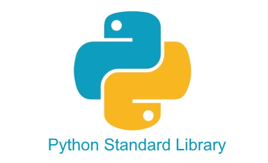](https://lwn.net/SubscriberLink/888043/66bf43728bb39692/)

Python has often been touted as a "batteries included" language because of its rich standard library that provides access to numerous utility modules and is distributed with the language itself. But those libraries need maintenance, provided by the Python core development team. Some of the modules are not being maintained any longer and they likely are not needed by most Python users. A long-running project to start the removal of those modules, [PEP594](https://peps.python.org/pep-0594/), has recently been approved - [lwn.net](https://lwn.net/SubscriberLink/888043/66bf43728bb39692/).

## CircuitPython 7.2.3 Released

CircuitPython 7.2.3, the latest bugfix revision of CircuitPython, was released and it's the new stable release - [GitHub](https://github.com/adafruit/circuitpython/releases).

**Notable fixes to 7.2.3 since 7.2.0**

* Espressif I2C pull-up detection fix.
* SAMD21 auto-reload reliability. In addition, for auto-reloads on any board, the program will stop more quickly, and will wait 0.75 seconds (was 0.5 seconds) after the last filesystem write before restarting.
* Update known certificates.
* Fix `countio` problems when used outside of code.py.
* Add `from __future__ import` annotations to allow program compatibility with CPython.
* Fix spurious `ReloadExceptions` when in the REPL.
* Improve auto-reload logic to avoid triggering multiple reloads, especially on RP2040 and macOS.
* Re-enable `_bleio` and remove frozen `PortalBase` on Adafruit MatrixPortal.

## False Advertizing Claiming Software is Open Source When it is not?

The Open Source Initiative is claiming that a recent US Court of Appeals for the Ninth Circuit recently affirmed a lower court decision concluding what we’ve always known: that it’s false advertising to claim that software is “open source” when it’s not licensed under an open source license. This would be huge news in the Open source ecosphere - [Open Source Initiative](https://opensource.org/node/1218).

BUT, another article states the Open Source Initiative’s blog post on the Neo4j appeal is self-serving, misleading, and wrong.

> The court didn’t legally decide anything about the meaning of “open source”. It didn’t define any new terms of art legal-system-wide. It didn’t even make precedent. The first page of its decision says “NOT FOR PUBLICATION” at the top and “This disposition is not appropriate for publication and is not precedent except as provided by Ninth Circuit Rule 36-3” at the bottom - [/dev/lawyer](https://writing.kemitchell.com/2022/03/17/OSI-Neo4j-PureThink.html).

The legal precedents in the Open Source field apparently continue. In chosing Open Source products and software, it's best to look at the license provided for the materials and see if that fits your needs. Licenses like MIT provide much broader use than GNU or Creative Commons.

## Power cycling a whole museum of computers with Feather

[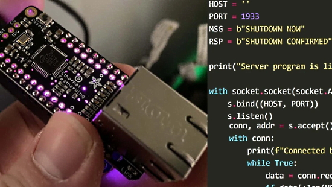](https://blog.adafruit.com/2022/03/21/power-cycling-a-whole-museum-of-computers-with-feather-esp32-jeffersglass-hackaday/)

Flicking a circuit breaker to power cycle hundreds of desktop computers inside interactive museum exhibits is hardly ideal. Tasked with finding a solution, Jeff Glass mixed off-the-shelf UPS (uninterruptible power supply) hardware, an Adafruit [Ethernet FeatherWing](https://www.adafruit.com/product/3201) and CircuitPython on a [Feather ESP32-S2](https://www.adafruit.com/product/5000) to get computers shut down and restarted properly - [Adafruit Blog](https://blog.adafruit.com/2022/03/21/power-cycling-a-whole-museum-of-computers-with-feather-esp32-jeffersglass-hackaday/), [Jeff Glass](https://jeff.glass/post/quick-dirty-system-power/) and [Hackaday](https://hackaday.com/2022/03/18/power-cycling-museum-computers-on-the-cheap/).

## Raspberry Pi Users Urged to Change Default Passwords

[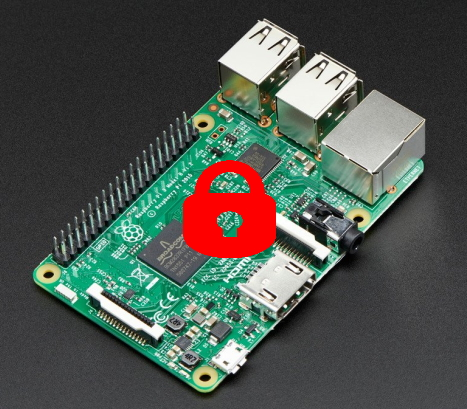](https://blog.adafruit.com/2022/03/18/raspberry-pi-users-urged-to-change-default-passwords-piday-raspberrypi-raspberry_pi/)

Security experts have called on Raspberry and Linux users to change default passwords on their machines as new data revealed the extent of bot-driven attempts to hijack systems. It found that 70% of web traffic was comprised of bot activity, with default credentials the most common passwords used by bad actors to attempt access. Of the top failed default credential login attempts targeting the honeypots, Linux username and password “nproc” was in second, and the combo of “pi” and “raspberry” came eighth - [Adafruit Blog](https://blog.adafruit.com/2022/03/18/raspberry-pi-users-urged-to-change-default-passwords-piday-raspberrypi-raspberry_pi/) and [Infosecurity Magazine](https://www.infosecurity-magazine.com/news/raspberry-pi-users-change-password/).

## This Week's Python Streams

Python on Hardware is all about building a cooperative ecosphere which allows contributions to be valued and to grow knowledge. Below are the streams within the last week focusing on the community.

### CircuitPython Deep Dive Stream

[This week](link), Tim streams work on {subject}.

You can see the latest video and past videos on the Adafruit YouTube channel under the Deep Dive playlist - [YouTube](https://www.youtube.com/playlist?list=PLjF7R1fz_OOXBHlu9msoXq2jQN4JpCk8A).

### CircuitPython Parsec

John Park’s CircuitPython Parsec this week is on Palette Swapping - [Adafruit Blog](https://blog.adafruit.com/2022/03/20/john-parks-circuitpython-parsec-palette-swap-adafruit-johnedgarpark-adafruit-circuitpython/) and [YouTube](https://youtu.be/9hfdrSrcQbs).

Catch all the episodes in the [YouTube playlist](https://www.youtube.com/playlist?list=PLjF7R1fz_OOWFqZfqW9jlvQSIUmwn9lWr).

### The CircuitPython Show

[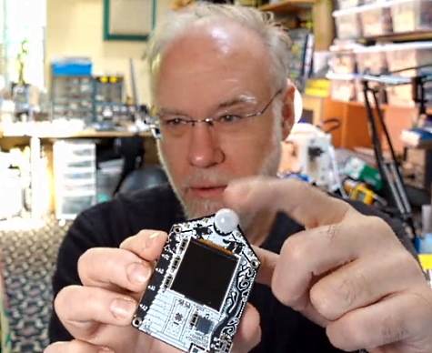](https://circuitpythonshow.com/)

The CircuitPython Show is a new independent podcast, hosted by Paul Cutler, focusing on the people doing awesome things with CircuitPython. Each episode features Paul in conversation with a guest for a twenty to thirty minute interview – [CircuitPythonShow](https://circuitpythonshow.com/), [Blog Post](https://paulcutler.org/posts/2022/01/introducing-the-circuitpython-show/) and [Twitter](https://twitter.com/circuitpyshow).

The third episode aired on March 15th featuring an interview with Professor John Gallaugher. The fourth episode airs today March 22th with Tod Kurt (above) talking about microcontrollers, Arduino, CircuitPython, synths and more – [Show List](https://twitter.com/circuitpyshow).

### TammyMakesThings is Streaming CircuitPython

Community member and CircuitPython contributor [Tammy Cravit](https://github.com/tammymakesthings) is streaming on Twitch. Her stream focuses on electronics, coding and making, with a focus on CircuitPython. The first few streams have been working on a [MacroPad](https://adafruit.com/product/5128)-based MIDI controller, and she's got lots of other project ideas in the works. An exact schedule for her streams is still being worked out, but she's targeting 2-3 streams per week. Check it out and follow now to be notified of future streams - [Twitch](https://twitch.tv/tammymakesthings).

## Project of the Week

[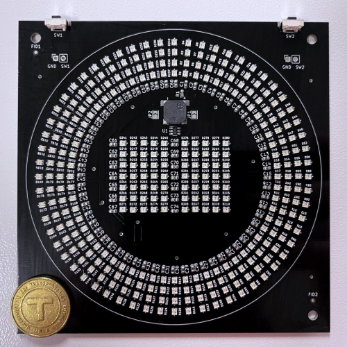](https://twitter.com/bradanlane/status/1505249217572392960)

Bradán Lane is developing a multi-NeoPixel board with many possibilities. It uses 310 WS2812C 2020 LEDs and a Lolin ESP32-S2 on the back. It consists of four concentric rings and two 5x7 square matricies within the center.

It runs CircuitPython. Anticipated demos programs will be a clock, a chess timer, and a reaction game  - [Twitter](https://twitter.com/bradanlane/status/1505249217572392960).

## News from around the web!

[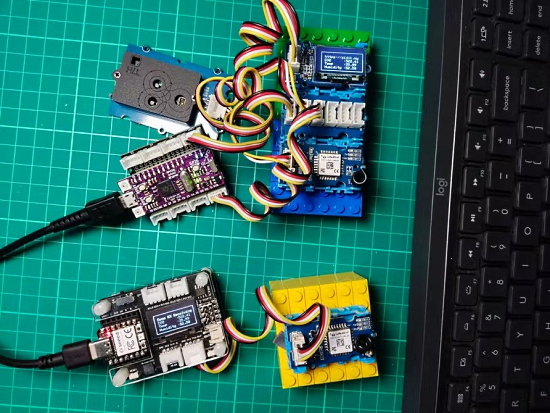](https://www.hackster.io/sidikalamini/grove-lora-e5-p2p-communication-using-circuitpython-f970e6)

Grove LoRa-E5 P2P communication using CircuitPython - [Hackster.io](https://www.hackster.io/sidikalamini/grove-lora-e5-p2p-communication-using-circuitpython-f970e6) via [Twitter](https://twitter.com/seeedstudio/status/1504722693199114240) and [sidik.my](https://sidik.my/gabungan-node-lorawan-gateway-bridge-network-server-application-server-mqtt-node-red-influxdb-grafana/).

[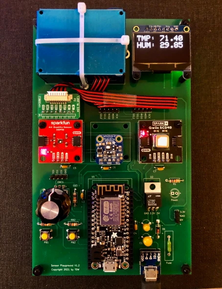](https://hackaday.com/2022/03/19/sensor-playground-keeps-track-of-indoor-air-quality-through-the-cloud/)

Sensor Playgrounnd keeps track of indoor air quality. It supports either an ESP32 DevKit or an Adafruit Feather module to provide processing power, and provides sockets for a bunch of sensors, conveniently wired with power and SPI or I2C - [Hackaday](https://hackaday.com/2022/03/19/sensor-playground-keeps-track-of-indoor-air-quality-through-the-cloud/), [Hackaday.io](https://hackaday.io/project/182619-sensor-playground) and [GitHub](https://github.com/tdwgithub/sensor-playground).

[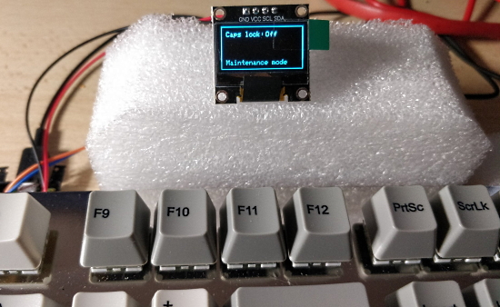](https://twitter.com/JustineSmithies/status/1505632088808173568)

A Pico TKL with a working OLED to display status information instead of individual LEDs like typical keyboards - [Twitter](https://twitter.com/JustineSmithies/status/1505632088808173568).

[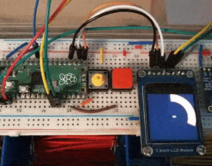](https://twitter.com/digitalMakerCIC/status/1504079443878363137)

> Playing with CircuitPython vectorIO shapes ands creating a circular bar that grows using circles and polygon masks - [Twitter](https://twitter.com/digitalMakerCIC/status/1504079443878363137).

> Wired up an Adafruit PDM microphone and tested it against the MAX9814; The difference is amazing (smoother data) - [Twitter](https://twitter.com/digitalMakerCIC/status/1504780400085905455).

text - [site](url).

[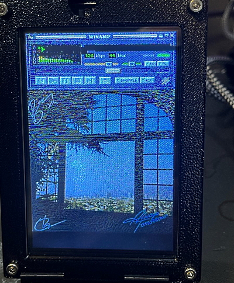](https://twitter.com/prcutler/status/1504543734347800578)

> Making progress on my CircuitPython powered album art display using an Adafruit PyPortal. Now displays a Winamp player over the album art.  (Featured: Best Coast’s Always Tomorrow). Next: Fix artifacts in Winamp image and add text for the artist / album in the Winamp player - [Twitter](https://twitter.com/prcutler/status/1504543734347800578).

[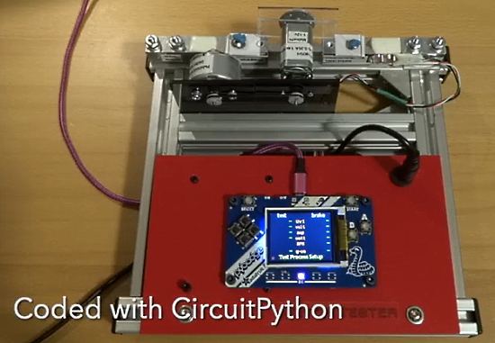](https://twitter.com/CedarGroveMakr/status/1505798416244219904)

A DC Motor Tester apparatus using an Adafruit PyBadge and some custom PCBs from Oshpark for test+brake motor control and to read the torque converter load cells annd programmed in CircuitPython - [Twitter](https://twitter.com/CedarGroveMakr/status/1505798416244219904) and [YouTube](https://www.youtube.com/watch?v=S38ulorIjJI).

text - [site](url).

MicroPython Pride Pin - [Twitter](https://twitter.com/ErinTheSmall/status/1504611642109267969).

[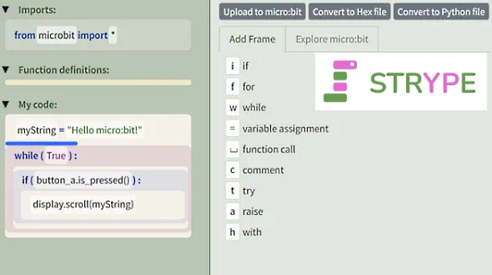](https://blog.adafruit.com/2022/03/16/strype-a-frame-based-editor-for-python-python-microbit/)

Strype, a frame-based editor for Python - [Adafruit Blog](https://blog.adafruit.com/2022/03/16/strype-a-frame-based-editor-for-python-python-microbit/), [Strype](https://www.strype.org/) and [YouTube](https://youtu.be/3Oe-ZRt4n1I).

[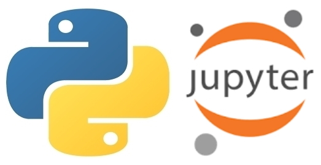](https://jupyter.org/try)

Project Jupyter builds tools, standards, and services for many different use cases, including Jupyter Notebook for Python - [jupyter.org](https://jupyter.org/try).

text - [site](url).

text - [site](url).

text - [site](url).

text - [site](url).

text - [site](url).

text - [site](url).

text - [site](url).

text - [site](url).

text - [site](url).

PyDev of the Week:

CircuitPython Weekly Meeting for 

#ICYDNCI What was the most popular, most clicked link, in [last week's newsletter](https://www.adafruitdaily.com/2022/03/15/python-on-microcontrollers-newsletter-podcast-extravaganza-circuitpython-7-2-1-and-much-more-python-circuitpython-micropython-thepsf/)? [Arduino Nicla Vision](https://blog.arduino.cc/2022/03/08/meet-the-nicla-vision-love-at-first-sight/).

## Coming Soon

[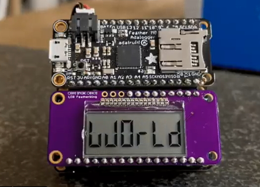](https://twitter.com/josecastillo/status/1504876196684828674)

Joey Castillo is designing a new ultra-low power LCD FeatherWing - [Twitter](https://twitter.com/josecastillo/status/1504876196684828674).

text - [site](url).

## New Boards Supported by CircuitPython

The number of supported microcontrollers and Single Board Computers (SBC) grows every week. This section outlines which boards have been included in CircuitPython or added to [CircuitPython.org](https://circuitpython.org/).

This week, there were (#/no) new boards added!

- [Board name](url)
- [Board name](url)
- [Board name](url)

*Note: For non-Adafruit boards, please use the support forums of the board manufacturer for assistance, as Adafruit does not have the hardware to assist in troubleshooting.*

Looking to add a new board to CircuitPython? It's highly encouraged! Adafruit has four guides to help you do so:

- [How to Add a New Board to CircuitPython](https://learn.adafruit.com/how-to-add-a-new-board-to-circuitpython/overview)
- [How to add a New Board to the circuitpython.org website](https://learn.adafruit.com/how-to-add-a-new-board-to-the-circuitpython-org-website)
- [Adding a Single Board Computer to PlatformDetect for Blinka](https://learn.adafruit.com/adding-a-single-board-computer-to-platformdetect-for-blinka)
- [Adding a Single Board Computer to Blinka](https://learn.adafruit.com/adding-a-single-board-computer-to-blinka)

## New Learn Guides!

There are no new Python on hardware related Learn guides from Adafruit this week. Keep an eye out for more next week!

## CircuitPython Libraries!

CircuitPython support for hardware continues to grow. We are adding support for new sensors and breakouts all the time, as well as improving on the drivers we already have. As we add more libraries and update current ones, you can keep up with all the changes right here!

For the latest libraries, download the [Adafruit CircuitPython Library Bundle](https://circuitpython.org/libraries). For the latest community contributed libraries, download the [CircuitPython Community Bundle](https://github.com/adafruit/CircuitPython_Community_Bundle/releases).

If you'd like to contribute, CircuitPython libraries are a great place to start. Have an idea for a new driver? File an issue on [CircuitPython](https://github.com/adafruit/circuitpython/issues)! Have you written a library you'd like to make available? Submit it to the [CircuitPython Community Bundle](https://github.com/adafruit/CircuitPython_Community_Bundle). Interested in helping with current libraries? Check out the [CircuitPython.org Contributing page](https://circuitpython.org/contributing). We've included open pull requests and issues from the libraries, and details about repo-level issues that need to be addressed. We have a guide on [contributing to CircuitPython with Git and Github](https://learn.adafruit.com/contribute-to-circuitpython-with-git-and-github) if you need help getting started. You can also find us in the #circuitpython channels on the [Adafruit Discord](https://adafru.it/discord).

You can check out this [list of all the Adafruit CircuitPython libraries and drivers available](https://github.com/adafruit/Adafruit_CircuitPython_Bundle/blob/master/circuitpython_library_list.md). 

The current number of CircuitPython libraries is **349**!

**New Libraries!**

Here's this week's new CircuitPython libraries:

 * [Adafruit_CircuitPython_TT21100](https://github.com/adafruit/Adafruit_CircuitPython_TT21100)

**Updated Libraries!**

Here's this week's updated CircuitPython libraries:

 * [Adafruit_CircuitPython_BLE_LYWSD03MMC](https://github.com/adafruit/Adafruit_CircuitPython_BLE_LYWSD03MMC)
 * [Adafruit_CircuitPython_APDS9960](https://github.com/adafruit/Adafruit_CircuitPython_APDS9960)
 * [Adafruit_CircuitPython_BLE](https://github.com/adafruit/Adafruit_CircuitPython_BLE)
 * [Adafruit_CircuitPython_MiniMQTT](https://github.com/adafruit/Adafruit_CircuitPython_MiniMQTT)
 * [Adafruit_CircuitPython_VL53L0X](https://github.com/adafruit/Adafruit_CircuitPython_VL53L0X)
 * [Adafruit_CircuitPython_MagTag](https://github.com/adafruit/Adafruit_CircuitPython_MagTag)
 * [Adafruit_CircuitPython_LSM6DS](https://github.com/adafruit/Adafruit_CircuitPython_LSM6DS)
 * [Adafruit_CircuitPython_Display_Text](https://github.com/adafruit/Adafruit_CircuitPython_Display_Text)
 * [Adafruit_CircuitPython_SI7021](https://github.com/adafruit/Adafruit_CircuitPython_SI7021)
 * [Adafruit_CircuitPython_RPLIDAR](https://github.com/adafruit/Adafruit_CircuitPython_RPLIDAR)
 * [Adafruit_CircuitPython_Wiznet5k](https://github.com/adafruit/Adafruit_CircuitPython_Wiznet5k)
 * [Adafruit_CircuitPython_SSD1322](https://github.com/adafruit/Adafruit_CircuitPython_SSD1322)
 * [Adafruit_CircuitPython_AMG88xx](https://github.com/adafruit/Adafruit_CircuitPython_AMG88xx)
 * [Adafruit_CircuitPython_PortalBase](https://github.com/adafruit/Adafruit_CircuitPython_PortalBase)
 * [Adafruit_CircuitPython_WSGI](https://github.com/adafruit/Adafruit_CircuitPython_WSGI)
 * [Adafruit_CircuitPython_ST7789](https://github.com/adafruit/Adafruit_CircuitPython_ST7789)
 * [Adafruit_CircuitPython_Colorsys](https://github.com/adafruit/Adafruit_CircuitPython_Colorsys)
 * [Adafruit_CircuitPython_FXOS8700](https://github.com/adafruit/Adafruit_CircuitPython_FXOS8700)
 * [circuitpython](https://github.com/adafruit/circuitpython)
 * [Adafruit_Python_PlatformDetect](https://github.com/adafruit/Adafruit_Python_PlatformDetect)

## What’s the team up to this week?

What is the team up to this week? Let’s check in!

**Dan**

After releasing CircuitPython 7.2.1 on Monday of last week, we found another problem with auto-reload, released 7.2.2 on Tuesday, and then found yet another problem on Wednesday and released 7.2.3 the same day. There is one remaining problem but it is less pervasive. Our aim is not to make a new release every day, even if it keeps CircuitPython in the news (lol), but when we must, we do. We also need to thoroughly test a fix instead of just making sure it fixes the original problem. These particular bugs we fixed don't lend themselves to easy automated testing, but we should think about how to do that.

**Jeff**

Thanks to some recently-merged changes in fluxengine, reading and writing Apple ][ disks on a TEAC floppy drives and the Adafruit Floppy prototype board is working really well. I posted up a video showing me use a disk written this way on a real Apple //e. [Check it out on the Adafruit YouTube Channel!](https://www.youtube.com/watch?v=YU6eMyiT2TM&list=PLjF7R1fz_OOWexf2WmY8cgM65ltPaAvyT)

**Kattni**

This week, I've been working with Liz to get her spun up on creating new product guides. She's been picking everything up super quickly and is doing a fantastic job! She's already put at least two new guides into moderation. Next up is showing Liz how to do the guide updates for boards for which we've released a STEMMA QT revision. I'm sure she'll make quick work of this as well!

I started a personal-but-work-tangential project, porting a CircuitPython Timestamper written by Tim for MacroPad to the NeoKey FeatherWing. In doing so, I found a massive bug in CircuitPython 7.2.0 stable. That's since been fixed, and a new release made. Glad we figured it out quickly!

**Melissa**

This past week, I worked on a bunch of CircuitPython code including rewriting some Google Calendar examples for the MagTag and PyPortal so that it works on the latest version of CircuitPython. I also wrote some examples for using the new 1.47" and 1.9" TFT displays.

**Tim**

I hosted the CircuitPython weekly meeting for the second time this week. It's been great to be able to step in to the rotation of folks that host. I noticed that I've begun to start feeling more comfortable and natural while hosting. I went over the process for applying patches to most/all library repositories with Kattni and Eva. I also streamed the first Deep Dive w/ Tim episode this week filling in while Scott is away. On the show I worked on creating async based displayio examples.

**Scott**

This last week, I've been switching between working on the ESP32-S3 and fixing/improving autoreload on CircuitPython. On the ESP32-S3, I took a look at some sleep issues. One issue was fixed with an ESP IDF update and the other appears to be an existing IDF bug, so I'll file an issue for it. I then had an idea for a web workflow that uses MDNS to discover local CircuitPython devices. I'm currently adding MDNS support for testing out this idea. I'll soon be on paternity leave, so we'll see how far I get.

**Liz**

This was my first week full-time with Adafruit! I've been working with Kattni to learn how to write the new product Learn Guides. We started with the VL53L4CD STEMMA board. I've also been working on a video mixer with Processing on a Raspberry Pi, which will have hardware controls with Blinka.

## Upcoming events!

The next MicroPython Meetup in Melbourne will be on March 23rd – [Meetup](https://www.meetup.com/MicroPython-Meetup/). See the [slides](https://docs.google.com/presentation/d/e/2PACX-1vTKYsLoMCw6NuuwN9DhX0aIx-4npH03FDRp-_Pxs9mX2o9smjQfWyNpOKpV3EhSJPi6vI04YH-Jw6O-/pub?slide=id.p) of the February 23rd meeting.

[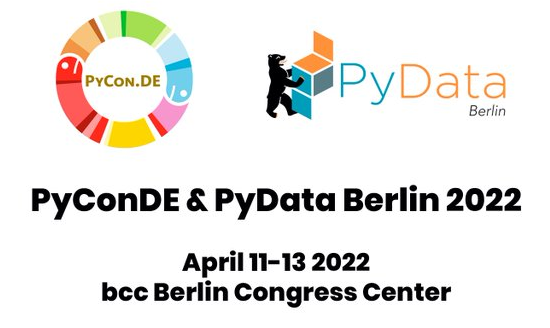](https://2022.pycon.de/)

PyConDE and PyData 2022 will be held in Berlin, Germany from April 11 - 13, 2022 at the Berlin Conference Center - [PyCon DE](https://2022.pycon.de/).

PyCon US 2022 planning is underway. The event is in-person with an online component. April 27, 2022 – May 5, 2022 in Salt Lake City, Utah USA. Head over to the [PyCon US 2022 website](https://us.pycon.org/2022/) for details about the conference and the schedule (new) – [PyCon Blog](https://pycon.blogspot.com/2022/10/pycon-us-2022-website-and-sponsorship.html).

PyCon Italia is the Italian conference on Python. Organised by Python Italia, it is one of the more important Python conferences in Europe. With over 700 attendees, the next edition will be June 2-5, 2022 - [Ticket Registration](https://pycon.it/en/tickets).

SciPy 2022, the 21st annual Scientific Computing with Python conference, will be held in Austin, Texas, USA from July 11-17, 2022. The annual SciPy Conference brings together attendees from industry, academia, and government to showcase their latest projects, learn from skilled users and developers, and collaborate on code development. The full program will consist of 2 days tutorials (July 11-12), 3 days of talks (July 13-15) and 2 days of developer sprints (July 16-17) - [SciPy 2022](https://www.scipy2022.scipy.org/).

**Send Your Events In**

As for other events, with the COVID pandemic, most in-person events are postponed or cancelled. If you know of virtual events or events that may occur in the future, please let us know on Twitter with hashtag #CircuitPython or email to cpnews(at)adafruit(dot)com.

## Latest releases

CircuitPython's stable release is [#.#.#](https://github.com/adafruit/circuitpython/releases/latest) and its unstable release is [#.#.#-##.#](https://github.com/adafruit/circuitpython/releases). New to CircuitPython? Start with our [Welcome to CircuitPython Guide](https://learn.adafruit.com/welcome-to-circuitpython).

[2022####](https://github.com/adafruit/Adafruit_CircuitPython_Bundle/releases/latest) is the latest CircuitPython library bundle.

[v#.#.#](https://micropython.org/download) is the latest MicroPython release. Documentation for it is [here](http://docs.micropython.org/en/latest/pyboard/).

[#.#.#](https://www.python.org/downloads/) is the latest Python release. The latest pre-release version is [#.#.#](https://www.python.org/download/pre-releases/).

[#### Stars](https://github.com/adafruit/circuitpython/stargazers) Like CircuitPython? [Star it on GitHub!](https://github.com/adafruit/circuitpython)

## Call for help -- Translating CircuitPython is now easier than ever!

[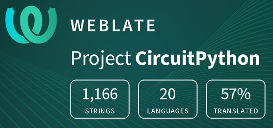](https://hosted.weblate.org/engage/circuitpython/)

One important feature of CircuitPython is translated control and error messages. With the help of fellow open source project [Weblate](https://weblate.org/), we're making it even easier to add or improve translations. 

Sign in with an existing account such as GitHub, Google or Facebook and start contributing through a simple web interface. No forks or pull requests needed! As always, if you run into trouble join us on [Discord](https://adafru.it/discord), we're here to help.

## jobs.adafruit.com - Find a dream job, find great candidates!

[jobs.adafruit.com](https://jobs.adafruit.com/) has returned and folks are posting their skills (including CircuitPython) and companies are looking for talented makers to join their companies - from Digi-Key, to Hackaday, Micro Center, Raspberry Pi and more.

**Job of the Week**

text - [Adafruit Jobs Board](https://jobs.adafruit.com/).

## NUMBER thanks!

The Adafruit Discord community, where we do all our CircuitPython development in the open, reached over NUMBER humans - thank you!  Adafruit believes Discord offers a unique way for Python on hardware folks to connect. Join today at [https://adafru.it/discord](https://adafru.it/discord).

## ICYMI - In case you missed it

Python on hardware is the Adafruit Python video-newsletter-podcast! The news comes from the Python community, Discord, Adafruit communities and more and is broadcast on ASK an ENGINEER Wednesdays. The complete Python on Hardware weekly videocast [playlist is here](https://www.youtube.com/playlist?list=PLjF7R1fz_OOXRMjM7Sm0J2Xt6H81TdDev). The video podcast is on [iTunes](https://itunes.apple.com/us/podcast/python-on-hardware/id1451685192?mt=2), [YouTube](http://adafru.it/pohepisodes), [IGTV (Instagram TV](https://www.instagram.com/adafruit/channel/)), and [XML](https://itunes.apple.com/us/podcast/python-on-hardware/id1451685192?mt=2).

[The weekly community chat on Adafruit Discord server CircuitPython channel - Audio / Podcast edition](https://itunes.apple.com/us/podcast/circuitpython-weekly-meeting/id1451685016) - Audio from the Discord chat space for CircuitPython, meetings are usually Mondays at 2pm ET, this is the audio version on [iTunes](https://itunes.apple.com/us/podcast/circuitpython-weekly-meeting/id1451685016), Pocket Casts, [Spotify](https://adafru.it/spotify), and [XML feed](https://adafruit-podcasts.s3.amazonaws.com/circuitpython_weekly_meeting/audio-podcast.xml).

## Codecademy "Learn Hardware Programming with CircuitPython"

Codecademy, an online interactive learning platform used by more than 45 million people, has teamed up with Adafruit to create a coding course, “Learn Hardware Programming with CircuitPython”. The course is now available in the [Codecademy catalog](https://www.codecademy.com/learn/learn-circuitpython?utm_source=adafruit&utm_medium=partners&utm_campaign=circuitplayground&utm_content=pythononhardwarenewsletter).

## Contribute!

The CircuitPython Weekly Newsletter is a CircuitPython community-run newsletter emailed every Tuesday. The complete [archives are here](https://www.adafruitdaily.com/category/circuitpython/). It highlights the latest CircuitPython related news from around the web including Python and MicroPython developments. To contribute, edit next week's draft [on GitHub](https://github.com/adafruit/circuitpython-weekly-newsletter/tree/gh-pages/_drafts) and [submit a pull request](https://help.github.com/articles/editing-files-in-your-repository/) with the changes. You may also tag your information on Twitter with #CircuitPython. 

Join the Adafruit [Discord](https://adafru.it/discord) or [post to the forum](https://forums.adafruit.com/viewforum.php?f=60) if you have questions.
