- [X] Kattni updates
- [ ] change date
- [ ] update title
- [ ] Feature story
- [ ] Update  for images
- [ ] Update ICYDNCI
- [ ] All images 550w max only
- [ ] Link "View this email in your browser."

News Sources

- [python.org](https://www.python.org/)
- [Python Insider - dev team blog](https://pythoninsider.blogspot.com/)
- [MicroPython Meetup Blog](https://melbournemicropythonmeetup.github.io/)
- [hackaday.io newest projects MicroPython](https://hackaday.io/projects?tag=micropython&sort=date) and [CircuitPython](https://hackaday.io/projects?tag=circuitpython&sort=date)
- [hackaday CircuitPython](https://hackaday.com/blog/?s=circuitpython) and [MicroPython](https://hackaday.com/blog/?s=micropython)
- [hackster.io CircuitPython](https://www.hackster.io/search?q=circuitpython&i=projects&sort_by=most_recent) and [MicroPython](https://www.hackster.io/search?q=micropython&i=projects&sort_by=most_recent)

View this email in your browser. **Warning: Flashing Imagery**

Welcome to the latest Python on Microcontrollers newsletter! Python on microcontrollers continues to be a popular option, driving the introduction of hardware and innovating in software features and drivers for add-on hardware.

We're on [Discord](https://discord.gg/HYqvREz), [Twitter](https://twitter.com/search?q=circuitpython&src=typed_query&f=live), and for past newsletters - [view them all here](https://www.adafruitdaily.com/category/circuitpython/). If you're reading this on the web, [subscribe here](https://www.adafruitdaily.com/). Here's the news this week:

## New Python Twitter Communities

Twitter Communities is a new feature being rolled out on Twitter to aggregate people with common interests. And there are now two communities related to Python on Microcontrollers:

Twitter launched Twitter Communities to give people a dedicated place to connect, share, and get closer to the discussions they care about most. Communities are started and managed by people on Twitter — admins and moderators who enforce Community rules and keep conversations informative, relevant, and fun. People who accept invites to join a Community become members. Tweets in Communities can be seen by anyone on Twitter, but only others within the Community itself can engage and participate in the discussion. 

[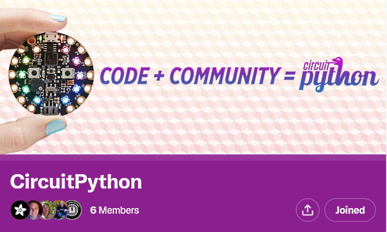](https://twitter.com/i/communities/1506567111837159424)

Two communities related to Python on Hardware now exist: the [Twitter MicroPython Community](https://twitter.com/i/communities/1506567111837159424) and the [CircuitPython Twitter Community](https://twitter.com/i/communities/1506684289622106117).

[More on Twitter Communities](https://help.twitter.com/en/using-twitter/communities) and you can also [search for communities](https://twitter.com/i/communities/suggested) - for example here are [all Python-related communities](https://twitter.com/i/communities/suggested?q=python).

## A New Major Thonny Update is in Beta

The Thonny Python editor had received a version 4.0.0 beta 1 release. They are looking for help in reporting bugs and bug fixes.

There are many changes since 3.3.13. Here are some notable ones:

* Upgrade bundled Python to 3.10
* Mac bundle now comes with the unversal2 build of Python
* Drop support for Python 3.5, 3.6 and 3.7
* Use [pipkin](https://pypi.org/project/pipkin/) for managing packages on MicroPython and CircuitPython devices. This enables proper listing of packages together with version info and proper uninstallation.
* Automatically interrupt current process when connecting to bare-metal MicroPython or CircuitPython device.
* Add generic “MicroPython (RP2040)” back-end in addition to the more specific “MicroPython (Raspberry Pi Pico)”

More - [Releases Page on GitHub](https://github.com/thonny/thonny/releases/tag/v4.0.0b1), [thonny.org](https://thonny.org/) and the [Adafruit Blog](https://blog.adafruit.com/2022/03/25/thonny-python-editor-gets-4-0-0-beta-release-python-micropython/).

## The MicroPython Wiki Returns

[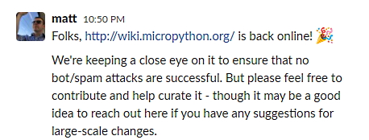](https://wiki.micropython.org/wiki/Main_Page)

Per Matt, the MicroPython WIki is once again up and running. The MediaWiki-based site collects knowledge, resources and links for anything and everything related to MicroPython, for both users and developers - [MicroPython Wiki](https://wiki.micropython.org/wiki/Main_Page).

## It's a Boy!

Scott Shawcroft, lead CircuitPython developer, along with his partner have a new baby as of 8:14 a.m. March 25th! Baby and mother are doing well! Scott will be on paternity leave for the next six weeks and the whole Adafruit staff and the Python + Maker communities wish the family well.

## Dmitry Cherepanov’s Retro Computer Museum in Mariupol, Ukraine, Has Been Destroyed

[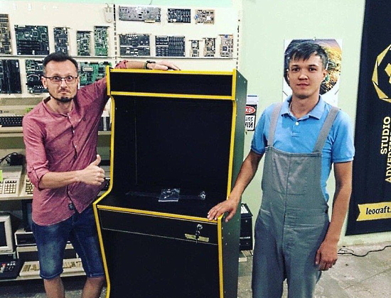](https://blog.adafruit.com/2022/03/28/dmitry-cherepanovs-retro-computer-museum-in-mariupol-ukraine-has-been-destroyed/)

According to Dmitry Cherepanov, collector and owner of the Club 8-bit, the the museum consisted of more than half a thousand computers, consoles and other devices – even arcade games recently - [Adafruit Blog](https://blog.adafruit.com/2022/03/28/dmitry-cherepanovs-retro-computer-museum-in-mariupol-ukraine-has-been-destroyed/) and [Keyboard Builder's Digest](https://kbd.news/Mariupol-computer-museum-destroyed-1327.html).

> “Well, that’s all, the computer museum of Mariupol is no more. All that remains of my collection that I have been collecting for 15 years is just fragments of memories on the Facebook page, the website and the radio station of the museum. I will try to continue to support the RetroBit website and radio, but life will now have completely different priorities. There is neither my museum nor my home and it hurts, but I will definitely survive it and find a new home! – [it8bit.club](https://it8bit.club/) and [YouTube](https://kbd.news/Mariupol-computer-museum-destroyed-1327.html).”

### Adafruit Information to Russians Seeking Ukraine Information

Adafruit has set up their website such that any traffic coming from Russia sees the page https://www.adafruit.com/russia. This page has resources to help everyday Russian prople know more about the war (censored by the Russian government), see and read the message from Arnold Schwarzenegger about Ukraine, use of Tor and Kiwix to download resources such as Wikipedia and more. Hopefully this all will keep ordinary Russians informed as to what their government is doing in Ukraine - [Webpage](https://www.adafruit.com/russia).

## This Week's Python Streams

Python on Hardware is all about building a cooperative ecosphere which allows contributions to be valued and to grow knowledge. Below are the streams within the last week focusing on the community.

### CircuitPython Deep Dive Stream

[This week](https://youtu.be/aSaGtRINwpg), Tim streams work on More Vectorio Fun and Planning for a TabbedLayout Component.

You can see the latest video and past videos on the Adafruit YouTube channel under the Deep Dive playlist - [YouTube](https://www.youtube.com/playlist?list=PLjF7R1fz_OOXBHlu9msoXq2jQN4JpCk8A).

### CircuitPython Parsec

John Park’s CircuitPython Parsec this week is on {subject} - [Adafruit Blog](link) and [YouTube](link).

Catch all the episodes in the [YouTube playlist](https://www.youtube.com/playlist?list=PLjF7R1fz_OOWFqZfqW9jlvQSIUmwn9lWr).

### The CircuitPython Show

The CircuitPython Show is a new independent podcast, hosted by Paul Cutler, focusing on the people doing awesome things with CircuitPython. Each episode features Paul in conversation with a guest for a twenty to thirty minute interview – [CircuitPythonShow](https://circuitpythonshow.com/), [Blog Post](https://paulcutler.org/posts/2022/01/introducing-the-circuitpython-show/) and [Twitter](https://twitter.com/circuitpyshow).

The fourth episode aired on March 22nd featuring an interview with Tod Kurt. The fifth episode airs today March 29th with guest Rose Hooper (above) creator of CircuitPython’s LED Animations library – [Show List](https://twitter.com/circuitpyshow).

### TammyMakesThings is Streaming CircuitPython

[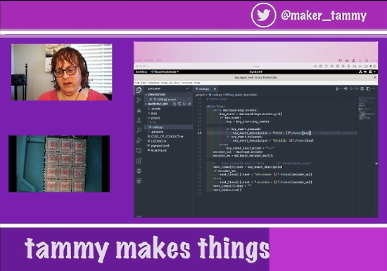](https://twitch.tv/tammymakesthings)

Community member and CircuitPython contributor [Tammy Cravit](https://github.com/tammymakesthings) is streaming on Twitch. Her stream focuses on electronics, coding and making, with a focus on CircuitPython. The first few streams have been working on a [MacroPad](https://adafruit.com/product/5128)-based MIDI controller, and she's got lots of other project ideas in the works. An exact schedule for her streams is still being worked out, but she's targeting 2-3 streams per week. Check it out and follow now to be notified of future streams - [Twitch](https://twitch.tv/tammymakesthings).

## Project of the Week

[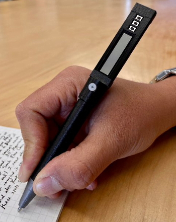](https://twitter.com/josecastillo/status/1503400227864301573)

Joey Castillo stated "I have a mighty need" after Adafruit posted a vintage calculator pen. 

Known for creating innovative small electronics, Castillo set about recreating a calculator pen using a SAMD21 microcontroller and eventually a SAMD51 processor (which is in short supply at the moment). 

[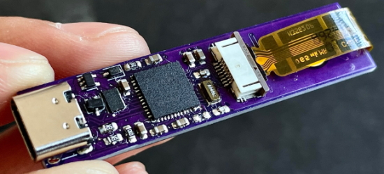](https://twitter.com/josecastillo/status/1503400227864301573)

The pen runs CircuitPython and is programmed to perform calculator functions with three input buttons.

[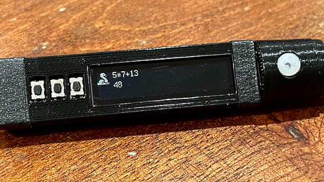](https://twitter.com/josecastillo/status/1503400227864301573)

Read the extensive, multipost thread discussing the project in detail - [Twitter](https://twitter.com/josecastillo/status/1503400227864301573).

## News from around the web!

[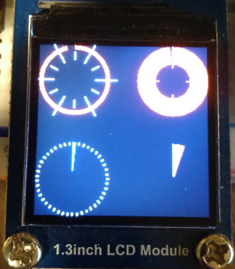](https://twitter.com/digitalMakerCIC/status/1506740588145692682)

Added featured  to the Pico CircuitPython CircleBar object: a method to draw dial lines around the circle (variable amount, length, offset & colour) and a "danger zone" value (changes circle to red) - [Twitter](https://twitter.com/digitalMakerCIC/status/1506740588145692682).

JavaScript and Python which let you connect to a CircuitPython based microcontroller on its dedicated cdc "data" serial connection (not cdc console) - [Codeberg](https://codeberg.org/ccoenen/Circuitpython-NodeJS-Demo) via [Twitter](https://twitter.com/amenthes_de/status/1506971480776753155).

[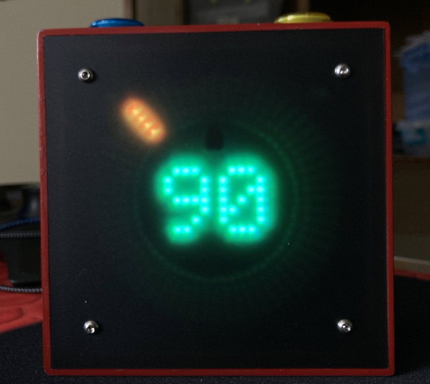](https://twitter.com/bradanlane/status/1507398897995550721)

> "good" 5x7 fonts are not as easy as I would have thought ... at least not in the age of high resolution fully aliased micro kerned text. I ended up customizing the 6x8 font from the HP100LX for use on the LumosRing. I'm making it available in BDF and PCF for CircuitPython users - [Twitter](https://twitter.com/bradanlane/status/1507398897995550721).

A video call mute button using a Seeedstudio XIAO with some CircuitPython - [Twitter](https://twitter.com/fabaff/status/1508024747036233729) and [GitHub](https://github.com/fabaff/circuitpython-examples/blob/main/xiao/mute-button.py).

[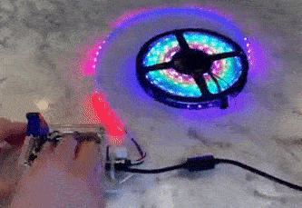](https://twitter.com/DavidBLaRoche/status/1507781317748039691)

> A NeoPixel controller for my daughter’s unicorn papasan reading chair (with CircuitPython on an Adafruit KB2040 and Adafruit Stemma-QT rotary encoder) - [Twitter](https://twitter.com/DavidBLaRoche/status/1507781317748039691).

[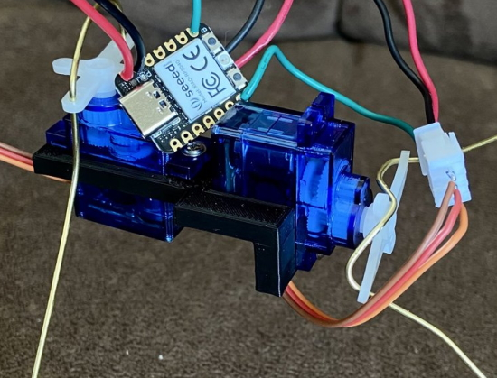](https://twitter.com/MarkKomus/status/1508142586166341633)

An insect bot with a Xiao RP2040 and CircuitPython - [Twitter](https://twitter.com/MarkKomus/status/1508142586166341633).

[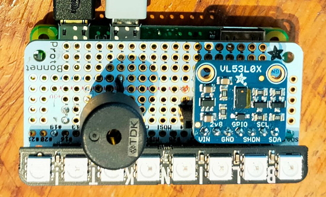](https://twitter.com/rareblog/status/1508397799666331660)

> lazydoro - a Raspberry Pi Python/CircuitPython (Blinka) pomodoro timer that uses an Adafruit VL53L0X ToF sensor to see if I'm at my desk when I should be - [Twitter](https://twitter.com/rareblog/status/1508397799666331660).

[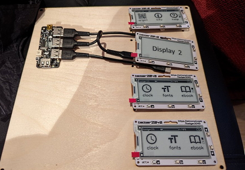](https://twitter.com/CannonFodder/status/1508150169107378178)

> Making a set for the Zoetrope Badger clan. Just need to flash each badge with CircuitPython and load the boot.py
file with the second USB serial enabled - [Twitter](https://twitter.com/CannonFodder/status/1508150169107378178).

text - [site](url).

text - [site](url).

[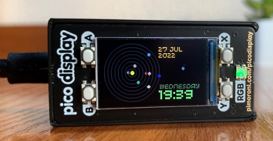](https://twitter.com/Derme302/status/1447409025037996035)

Pimoroni Pico display solar system witrh MicroPython - [Twitter](https://twitter.com/Derme302/status/1447409025037996035) and [GitHub](https://github.com/dr-mod/pico-solar-system).

[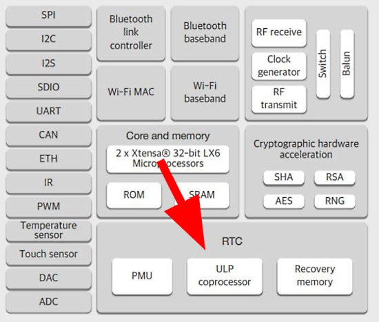](https://github.com/micropython/micropython-esp32-ulp)

micropython-esp32-ulp is an assembler toolchain for the ESP32 ULP (Ultra Low-Power) Co-Processor, written in MicroPython - [GitHub](https://github.com/micropython/micropython-esp32-ulp).

[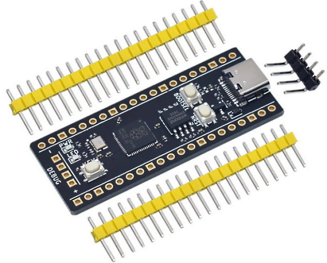](https://github.com/WeActTC/WeActStudio.RP2040CoreBoard/tree/master)

WeAct Studio RP2040 Wavgat is a RP2040 board in the form factor of a STM32 'Blue Pill' board that runs MicroPython - [GitHub](https://github.com/WeActTC/WeActStudio.RP2040CoreBoard/tree/master).

[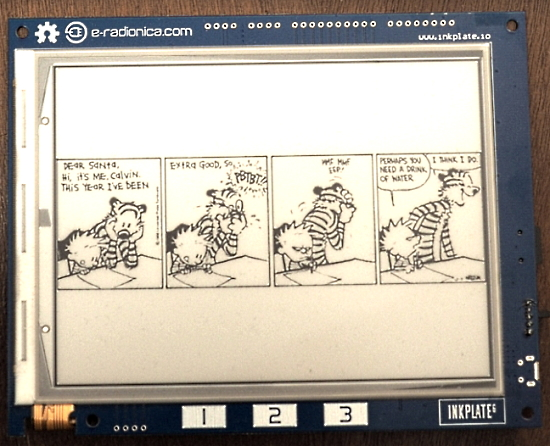](https://github.com/e-radionicacom/Inkplate-micropython)

A MicroPython driver for the Inkplate display is now available - [GitHub](https://github.com/e-radionicacom/Inkplate-micropython).

text - [site](url).

text - [site](url).

[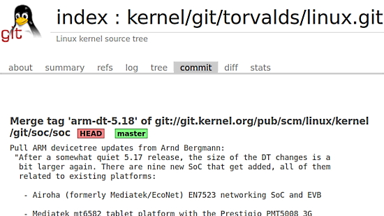](https://twitter.com/kernellogger/status/1506914735261986819)

Two commits for Linux 5.18 add support for the Raspberry Pi Zero 2 W - [Twitter Thread](https://twitter.com/kernellogger/status/1506914735261986819).

Processing large JSON files in Python without running out of memory - [Python Speed](https://pythonspeed.com/articles/json-memory-streaming/).

[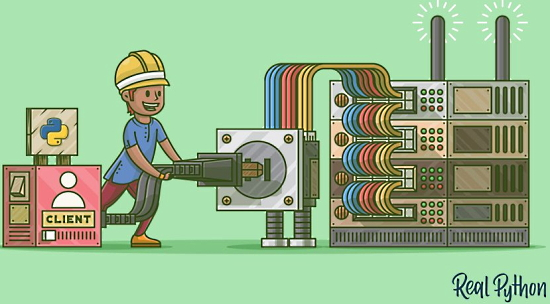](https://realpython.com/python-sockets/)

Socket Programming in Python Guide - [Real Python](https://realpython.com/python-sockets/).

Linux on the Macbook M1 (bare-metal) - [YouTube](https://www.youtube.com/watch?v=voMvctJ4GZ0).

PyDev of the Week:

CircuitPython Weekly Meeting for 

#ICYDNCI What was the most popular, most clicked link, in [last week's newsletter](https://www.adafruitdaily.com/2022/03/22/python-on-microcontrollers-newsletter-standard-library-changes-circuitpython-7-2-3-and-much-more-python-circuitpython-micropython-thepsf/)? [PEP 594 – Removing dead batteries from the standard library](https://peps.python.org/pep-0594/).

## Coming Soon

The Core Electronics MicroPython in an Uno footprint board - [YouTube](https://www.youtube.com/watch?v=IK-K-KCzNcE).

text - [site](url).

## New Boards Supported by CircuitPython

The number of supported microcontrollers and Single Board Computers (SBC) grows every week. This section outlines which boards have been included in CircuitPython or added to [CircuitPython.org](https://circuitpython.org/).

This week, there were no new boards added but some are being worked on.

*Note: For non-Adafruit boards, please use the support forums of the board manufacturer for assistance, as Adafruit does not have the hardware to assist in troubleshooting.*

Looking to add a new board to CircuitPython? It's highly encouraged! Adafruit has four guides to help you do so:

- [How to Add a New Board to CircuitPython](https://learn.adafruit.com/how-to-add-a-new-board-to-circuitpython/overview)
- [How to add a New Board to the circuitpython.org website](https://learn.adafruit.com/how-to-add-a-new-board-to-the-circuitpython-org-website)
- [Adding a Single Board Computer to PlatformDetect for Blinka](https://learn.adafruit.com/adding-a-single-board-computer-to-platformdetect-for-blinka)
- [Adding a Single Board Computer to Blinka](https://learn.adafruit.com/adding-a-single-board-computer-to-blinka)

## New Learn Guides!

[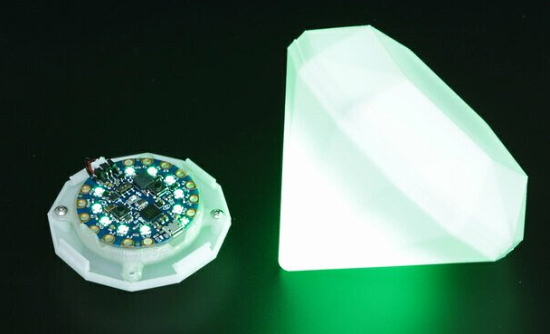](https://learn.adafruit.com/guides/latest)

[LED Emerald with Circuit Playground Bluefruit](https://learn.adafruit.com/led-emerald-with-circuit-playground) from [Noe and Pedro](https://learn.adafruit.com/users/pixil3d)

[Breakbeat Breadboard](https://learn.adafruit.com/breakbeat-breadboard) from [John Park](https://learn.adafruit.com/users/johnpark)

[Blahaj Alarm and Lamp](https://learn.adafruit.com/blahaj-alarm) from [Eva Herrada](https://learn.adafruit.com/users/eherrada)

[Adafruit MCP23017 I2C GPIO Expander](https://learn.adafruit.com/adafruit-mcp23017-i2c-gpio-expander) from [Liz Clark](https://learn.adafruit.com/users/BlitzCityDIY)

[Adafruit VL53L4CD Time of Flight Distance Sensor](https://learn.adafruit.com/adafruit-vl53l4cd-time-of-flight-distance-sensor) from [Liz Clark](https://learn.adafruit.com/users/BlitzCityDIY)

## CircuitPython Libraries!

CircuitPython support for hardware continues to grow. We are adding support for new sensors and breakouts all the time, as well as improving on the drivers we already have. As we add more libraries and update current ones, you can keep up with all the changes right here!

For the latest libraries, download the [Adafruit CircuitPython Library Bundle](https://circuitpython.org/libraries). For the latest community contributed libraries, download the [CircuitPython Community Bundle](https://github.com/adafruit/CircuitPython_Community_Bundle/releases).

If you'd like to contribute, CircuitPython libraries are a great place to start. Have an idea for a new driver? File an issue on [CircuitPython](https://github.com/adafruit/circuitpython/issues)! Have you written a library you'd like to make available? Submit it to the [CircuitPython Community Bundle](https://github.com/adafruit/CircuitPython_Community_Bundle). Interested in helping with current libraries? Check out the [CircuitPython.org Contributing page](https://circuitpython.org/contributing). We've included open pull requests and issues from the libraries, and details about repo-level issues that need to be addressed. We have a guide on [contributing to CircuitPython with Git and Github](https://learn.adafruit.com/contribute-to-circuitpython-with-git-and-github) if you need help getting started. You can also find us in the #circuitpython channels on the [Adafruit Discord](https://adafru.it/discord).

You can check out this [list of all the Adafruit CircuitPython libraries and drivers available](https://github.com/adafruit/Adafruit_CircuitPython_Bundle/blob/master/circuitpython_library_list.md). 

The current number of CircuitPython libraries is **349**!

**Updated Libraries!**

Here's this week's updated CircuitPython libraries:

 * [Adafruit_CircuitPython_Wiznet5k](https://github.com/adafruit/Adafruit_CircuitPython_Wiznet5k)
 * [Adafruit_CircuitPython_DisplayIO_SSD1306](https://github.com/adafruit/Adafruit_CircuitPython_DisplayIO_SSD1306)
 * [Adafruit_CircuitPython_DisplayIO_SH1107](https://github.com/adafruit/Adafruit_CircuitPython_DisplayIO_SH1107)
 * [Adafruit_CircuitPython_Ducky](https://github.com/adafruit/Adafruit_CircuitPython_Ducky)
 * [Adafruit_CircuitPython_FocalTouch](https://github.com/adafruit/Adafruit_CircuitPython_FocalTouch)
 * [Adafruit_CircuitPython_SSD1322](https://github.com/adafruit/Adafruit_CircuitPython_SSD1322)
 * [Adafruit_CircuitPython_LSM6DS](https://github.com/adafruit/Adafruit_CircuitPython_LSM6DS)
 * [Adafruit_CircuitPython_ST7565](https://github.com/adafruit/Adafruit_CircuitPython_ST7565)
 * [Adafruit_CircuitPython_ST7789](https://github.com/adafruit/Adafruit_CircuitPython_ST7789)
 * [Adafruit_CircuitPython_MagTag](https://github.com/adafruit/Adafruit_CircuitPython_MagTag)
 * [Adafruit_CircuitPython_RGB_Display](https://github.com/adafruit/Adafruit_CircuitPython_RGB_Display)
 * [Adafruit_CircuitPython_Debouncer](https://github.com/adafruit/Adafruit_CircuitPython_Debouncer)
 * [Adafruit_CircuitPython_MacroPad](https://github.com/adafruit/Adafruit_CircuitPython_MacroPad)
 * [Adafruit_CircuitPython_PCF8563](https://github.com/adafruit/Adafruit_CircuitPython_PCF8563)
 * [Adafruit_CircuitPython_Slideshow](https://github.com/adafruit/Adafruit_CircuitPython_Slideshow)
 * [Adafruit_CircuitPython_DisplayIO_SH1106](https://github.com/adafruit/Adafruit_CircuitPython_DisplayIO_SH1106)
 * [Adafruit_CircuitPython_AdafruitIO](https://github.com/adafruit/Adafruit_CircuitPython_AdafruitIO)
 * [Adafruit_CircuitPython_ESP32SPI](https://github.com/adafruit/Adafruit_CircuitPython_ESP32SPI)
 * [Adafruit_CircuitPython_Fingerprint](https://github.com/adafruit/Adafruit_CircuitPython_Fingerprint)
 * [Adafruit_CircuitPython_Requests](https://github.com/adafruit/Adafruit_CircuitPython_Requests)
 * [Adafruit_CircuitPython_PortalBase](https://github.com/adafruit/Adafruit_CircuitPython_PortalBase)
 * [Adafruit_CircuitPython_HTTPServer](https://github.com/adafruit/Adafruit_CircuitPython_HTTPServer)
 * [Adafruit_CircuitPython_asyncio](https://github.com/adafruit/Adafruit_CircuitPython_asyncio)
 * [Adafruit_CircuitPython_VL53L4CD](https://github.com/adafruit/Adafruit_CircuitPython_VL53L4CD)
 * [Adafruit_Blinka_Displayio](https://github.com/adafruit/Adafruit_Blinka_Displayio)

## What’s the team up to this week?

What is the team up to this week? Let’s check in!

**Dan**

I've been cleaning up the adafruit_requests library, and am now testing some async additions to it.

Jeff, Scott, and I reviewed the list of near-term bugs to fix in CircuitPython, in preparation for Scott's multi-week leave.

**Jeff**

While I've added good support for imaging non-protected Apple II floppies, I'd like to add support for copy-protected Apple II floppies to Adafruit_Floppy as well. To this end, I've started implementing the ".a2r" format used by Applesauce. This format has good open documentation, as well as some open source software that can use it. I'll continue to work on an open pull request to add support for this format to FluxEngine, and also make sure that it works with the proprietary Applesauce software for macs.

**Kattni**

This week, I worked with Liz (BlitzCityDIY) to walk her through creating new product guides. Her first two guides are live! We also worked on her learning how to do a breakout STEMMA QT revision guide update. She updated her first guide, and is working on updating her second guide on her own. Liz has been doing great!

In between working with Liz, I got through some of the miscellaneous on my list, and a few new things that popped up along the way. The ESP32-S2 CircuitPython Internet Test page has been updated to be standalone and use the Project Bundler, and removed the CircuitPython Internet Libraries page rendered obsolete by the update. I updated a few things on the Feather ESP32-S2 guide to reflect the new revision of the board. I updated the Adafruit IO template WiFi code to be more robust and not crash on disconnection.

As well, I submitted my first PR to MicroPython to expose pin 20 on the ESP32 so it works with the Feather ESP32 V2. It was merged!

**Melissa**

This past week I started working on a couple of guides for displays. This included updating the Arduino Display libraries and adding board-specific examples so there is less fussing with initializers such as [this 1.47" ImageReader example](https://github.com/adafruit/Adafruit_ImageReader/tree/master/examples/BreakoutST7789-172x320). I'm actually updating the format of the guide a bit so that some past guides can be revised to use the same format. I'm hoping it will be even more helpful to users than the previous format was in the past.

**Tim**

This week I dove into the CircuitPython core module `vectorio` to add a new feature allowing the user code to set the color index within the palette to use for coloring the shapes. I reviewed and tested some more PRs including some typing PRs from a few newer contributors to the libraries. I also started building some Python level helper classes on top of `vectorio` objects. So far the ones available are a line with settable stroke size, an outlined rectangle with a border around it, and a rotatable polygon that allows you to specify arbitrary rotations in degrees and handles all of the math to find the new points to make up the polygon.

**Liz**

I worked with Kattni to get the VL53L4CD and MCP23017 new product guides live. She also showed me how to do the updated product guides and we updated the Analog Devices ADXL343 guide. 

I also worked on a project guide for a Raspberry Pi Video Synth. The hardware is controlled with Blinka and the animations are running with Processing. The Python and Processing scripts are communicating together with a socket. I think that that is one of the most useful aspects of the project and will hopefully be useful for folks who want to use CircuitPython on a Raspberry Pi to communicate with other programming languages. 

**Scott**

This week I've been wrapping up pending code and taking on small tasks. My partner and I are about to have a baby so I'm not getting myself into anything too big.

I added mDNS support to ESP builds. I added support for the USB to Serial/JTAG on the C3 so it can be used for CircuitPython serial. I just made a PR to support the ESP32-S3 USB-OTG devkit from Espressif. I also cleaned up a bunch of board definitions prior to that so that we wouldn't keep duplicating unnecessary settings.

I'll keep picking up small tasks or continue brainstorming for the [web workflow](https://github.com/adafruit/circuitpython/issues/6174) until the baby arrives. After that, I'll be out six weeks.

## Upcoming events!

The next MicroPython Meetup in Melbourne will be on April 27rd – [Meetup](https://www.meetup.com/MicroPython-Meetup/). See the [slides](https://docs.google.com/presentation/d/e/2PACX-1vSYt41VJm6ptM-aFKbnTPhucX-NZ2kXP7B7kbEp6Le9lidSfB7SKoNflvlCgCsJ0AOURAS-tamDVENX/pub?slide=id.p) of the March 23rd meeting.

PyConDE and PyData 2022 will be held in Berlin, Germany from April 11 - 13, 2022 at the Berlin Conference Center - [PyCon DE](https://2022.pycon.de/).

PyCon US 2022 planning is underway. The event is in-person with an online component. April 27, 2022 – May 5, 2022 in Salt Lake City, Utah USA. Head over to the [PyCon US 2022 website](https://us.pycon.org/2022/) for details about the conference and the schedule (new) – [PyCon Blog](https://pycon.blogspot.com/2022/10/pycon-us-2022-website-and-sponsorship.html).

PyCon Italia is the Italian conference on Python. Organised by Python Italia, it is one of the more important Python conferences in Europe. With over 700 attendees, the next edition will be June 2-5, 2022 - [Ticket Registration](https://pycon.it/en/tickets).

SciPy 2022, the 21st annual Scientific Computing with Python conference, will be held in Austin, Texas, USA from July 11-17, 2022. The annual SciPy Conference brings together attendees from industry, academia, and government to showcase their latest projects, learn from skilled users and developers, and collaborate on code development. The full program will consist of 2 days tutorials (July 11-12), 3 days of talks (July 13-15) and 2 days of developer sprints (July 16-17) - [SciPy 2022](https://www.scipy2022.scipy.org/).

EuroPython 2022 will be held on 11th-17th July 2022 and it will be both in person and virtual. The in-person conference will be held at [The Convention Centre](https://www.theccd.ie/) Dublin (The CCD) in Dublin, Ireland - [EuroPython 2022](https://ep2022.europython.eu/).

**Send Your Events In**

As for other events, with the COVID pandemic, most in-person events are postponed or cancelled. If you know of virtual events or events that may occur in the future, please let us know on Twitter with hashtag #CircuitPython or email to cpnews(at)adafruit(dot)com.

## Latest releases

CircuitPython's stable release is [#.#.#](https://github.com/adafruit/circuitpython/releases/latest) and its unstable release is [#.#.#-##.#](https://github.com/adafruit/circuitpython/releases). New to CircuitPython? Start with our [Welcome to CircuitPython Guide](https://learn.adafruit.com/welcome-to-circuitpython).

[2022####](https://github.com/adafruit/Adafruit_CircuitPython_Bundle/releases/latest) is the latest CircuitPython library bundle.

[v#.#.#](https://micropython.org/download) is the latest MicroPython release. Documentation for it is [here](http://docs.micropython.org/en/latest/pyboard/).

[#.#.#](https://www.python.org/downloads/) is the latest Python release. The latest pre-release version is [#.#.#](https://www.python.org/download/pre-releases/).

[#### Stars](https://github.com/adafruit/circuitpython/stargazers) Like CircuitPython? [Star it on GitHub!](https://github.com/adafruit/circuitpython)

## Call for help -- Translating CircuitPython is now easier than ever!

[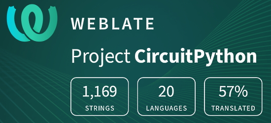](https://hosted.weblate.org/engage/circuitpython/)

One important feature of CircuitPython is translated control and error messages. With the help of fellow open source project [Weblate](https://weblate.org/), we're making it even easier to add or improve translations. 

Sign in with an existing account such as GitHub, Google or Facebook and start contributing through a simple web interface. No forks or pull requests needed! As always, if you run into trouble join us on [Discord](https://adafru.it/discord), we're here to help.

## jobs.adafruit.com - Find a dream job, find great candidates!

[jobs.adafruit.com](https://jobs.adafruit.com/) has returned and folks are posting their skills (including CircuitPython) and companies are looking for talented makers to join their companies - from Digi-Key, to Hackaday, Micro Center, Raspberry Pi and more.

## 33,781 thanks!

The Adafruit Discord community, where we do all our CircuitPython development in the open, reached over 33,781 humans - thank you!  Adafruit believes Discord offers a unique way for Python on hardware folks to connect. Join today at [https://adafru.it/discord](https://adafru.it/discord).

## ICYMI - In case you missed it

Python on hardware is the Adafruit Python video-newsletter-podcast! The news comes from the Python community, Discord, Adafruit communities and more and is broadcast on ASK an ENGINEER Wednesdays. The complete Python on Hardware weekly videocast [playlist is here](https://www.youtube.com/playlist?list=PLjF7R1fz_OOXRMjM7Sm0J2Xt6H81TdDev). The video podcast is on [iTunes](https://itunes.apple.com/us/podcast/python-on-hardware/id1451685192?mt=2), [YouTube](http://adafru.it/pohepisodes), [IGTV (Instagram TV](https://www.instagram.com/adafruit/channel/)), and [XML](https://itunes.apple.com/us/podcast/python-on-hardware/id1451685192?mt=2).

[The weekly community chat on Adafruit Discord server CircuitPython channel - Audio / Podcast edition](https://itunes.apple.com/us/podcast/circuitpython-weekly-meeting/id1451685016) - Audio from the Discord chat space for CircuitPython, meetings are usually Mondays at 2pm ET, this is the audio version on [iTunes](https://itunes.apple.com/us/podcast/circuitpython-weekly-meeting/id1451685016), Pocket Casts, [Spotify](https://adafru.it/spotify), and [XML feed](https://adafruit-podcasts.s3.amazonaws.com/circuitpython_weekly_meeting/audio-podcast.xml).

## Codecademy "Learn Hardware Programming with CircuitPython"

Codecademy, an online interactive learning platform used by more than 45 million people, has teamed up with Adafruit to create a coding course, “Learn Hardware Programming with CircuitPython”. The course is now available in the [Codecademy catalog](https://www.codecademy.com/learn/learn-circuitpython?utm_source=adafruit&utm_medium=partners&utm_campaign=circuitplayground&utm_content=pythononhardwarenewsletter).

## Contribute!

The CircuitPython Weekly Newsletter is a CircuitPython community-run newsletter emailed every Tuesday. The complete [archives are here](https://www.adafruitdaily.com/category/circuitpython/). It highlights the latest CircuitPython related news from around the web including Python and MicroPython developments. To contribute, edit next week's draft [on GitHub](https://github.com/adafruit/circuitpython-weekly-newsletter/tree/gh-pages/_drafts) and [submit a pull request](https://help.github.com/articles/editing-files-in-your-repository/) with the changes. You may also tag your information on Twitter with #CircuitPython. 

Join the Adafruit [Discord](https://adafru.it/discord) or [post to the forum](https://forums.adafruit.com/viewforum.php?f=60) if you have questions.
