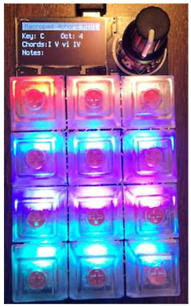
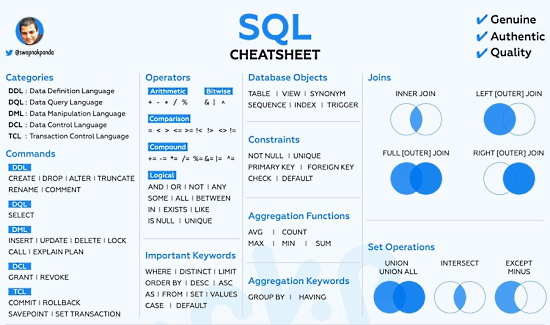
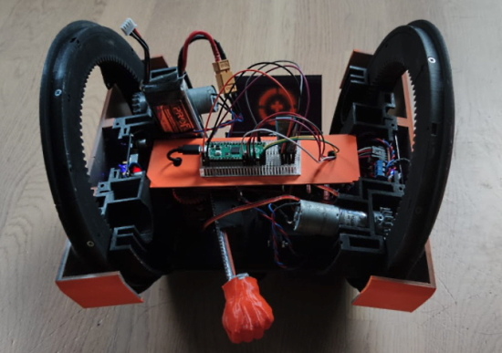
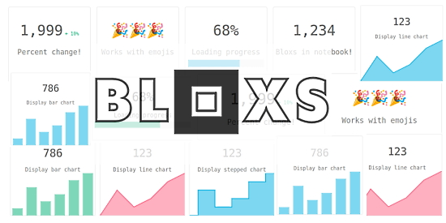
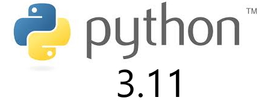
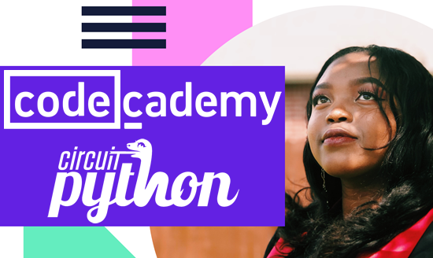

- [ ] Kattni updates
- [ ] change date
- [ ] update title
- [ ] Feature story
- [ ] Update  for images
- [ ] Update ICYDNCI
- [ ] All images 550w max only
- [ ] Link "View this email in your browser."

News Sources

- [python.org](https://www.python.org/)
- [Python Insider - dev team blog](https://pythoninsider.blogspot.com/)
- [MicroPython Meetup Blog](https://melbournemicropythonmeetup.github.io/)
- [hackaday.io newest projects MicroPython](https://hackaday.io/projects?tag=micropython&sort=date) and [CircuitPython](https://hackaday.io/projects?tag=circuitpython&sort=date)
- [hackaday CircuitPython](https://hackaday.com/blog/?s=circuitpython) and [MicroPython](https://hackaday.com/blog/?s=micropython)
- [hackster.io CircuitPython](https://www.hackster.io/search?q=circuitpython&i=projects&sort_by=most_recent) and [MicroPython](https://www.hackster.io/search?q=micropython&i=projects&sort_by=most_recent)

View this email in your browser. **Warning: Flashing Imagery**

Welcome to the latest Python on Microcontrollers newsletter! 

We're on [Discord](https://discord.gg/HYqvREz), [Twitter](https://twitter.com/search?q=circuitpython&src=typed_query&f=live), and for past newsletters - [view them all here](https://www.adafruitdaily.com/category/circuitpython/). If you're reading this on the web, [subscribe here](https://www.adafruitdaily.com/). Here's the news this week:

## Two New CircuitPython Releases

Two new versions of CircuitPython came out last week - [CircuitPython 7.2.4](https://blog.adafruit.com/2022/03/31/circuitpython-7-2-4-released/) and [CircuitPython 7.3.0-beta.0](https://blog.adafruit.com/2022/03/31/circuitpython-7-3-0-beta-0-released/).

Notable changes to 7.3.0 since 7.2.4:
* Experimental mDNS support.
* USB to Serial/JTAG support for REPL on appropriate boards.
* Initial experimental USB host support.
* Merge MicroPython 1.18 changes.

Notable fixes to 7.2.4 since 7.2.3:
* Enable I2C power by default on Feather ESP32-S2.
* Fix `supervisor.reload()`.

## Adafruit IO is now storing over 1 billion data records

Adafruit IO has reached a milestone in that it now stores over 1 billion data records.

The interesting part about this is that due to how free accounts work, most of that data rolls over after 30 days and is deleted.

> TOTAL DATA RECORDS 1 Billion (1003060059)

Adafruit continues to grow the infrastructure behind IO to support their free and paid users. They’re adding new features and are looking forward to new users discovering the product.

In the last month, Adafruit has added new dashboard blocks, updated Actions, had major updates to Wippersnapper (with more on the way) and they have more updates planned - [Adafruit Blog](https://blog.adafruit.com/2022/04/01/adafruit-io-is-now-storing-over-1-billion-data-records/).

## Linux 5.17 Released

Linux 5.17 was released late last month. Most of it is in drivers (net, usb, drm), with some core networking, and some tooling updates. Linux 5.17 progress was slowed by a week because the team had to deal with patches for another variation on the Spectre attacks, which added to the workload - [Kernel.org](https://lore.kernel.org/lkml/CAHk-=wj4fFjx2pgbGNBM4wJs3=eReZ05EQyprzgT2Jv8qJ2vJg@mail.gmail.com/).

## Compose with Markdown in Google Docs on web

In Google Docs, you can now select “Automatically detect Markdown” from Tools > Preferences to enable auto correcting for Markdown syntax, a lightweight markup language for applying formatting using plain text  - [Google](http://workspaceupdates.googleblog.com/2022/03/compose-with-markdown-in-google-docs-on.html) and [Adafruit Blog](https://blog.adafruit.com/2022/03/31/compose-with-markdown-in-google-docs-on-web-google/).

Currently, Google Docs supports some Markdown syntax, such as:

 \* or – followed by a space autocorrects to bullet points

Various ways to start a numbered list similar to Markdown

\[\] followed by a space autocorrects to checkboxes

The expanded support will now support autocorrection for:

* Headings
* Italic and bold
* Bold + italic
* Strikethrough
* Links

## Feature

text - [site](url).

## This Week's Python Streams

Python on Hardware is all about building a cooperative ecosphere which allows contributions to be valued and to grow knowledge. Below are the streams within the last week focusing on the community.

### CircuitPython Deep Dive Stream

[This week](https://www.youtube.com/watch?v=wiEdkrWd-3E), Tim streams work on porting Timestamper and Vectorio fun.

You can see the latest video and past videos on the Adafruit YouTube channel under the Deep Dive playlist - [YouTube](https://www.youtube.com/playlist?list=PLjF7R1fz_OOXBHlu9msoXq2jQN4JpCk8A).

### CircuitPython Parsec

John Park’s CircuitPython Parsec this week is on {subject} - [Adafruit Blog](link) and [YouTube](link).

Catch all the episodes in the [YouTube playlist](https://www.youtube.com/playlist?list=PLjF7R1fz_OOWFqZfqW9jlvQSIUmwn9lWr).

### The CircuitPython Show

The CircuitPython Show is a new independent podcast, hosted by Paul Cutler, focusing on the people doing awesome things with CircuitPython. Each episode features Paul in conversation with a guest for a twenty to thirty minute interview – [CircuitPythonShow](https://circuitpythonshow.com/), [Blog Post](https://paulcutler.org/posts/2022/01/introducing-the-circuitpython-show/) and [Twitter](https://twitter.com/circuitpyshow).

The last episode aired on March 29th featuring an interview with Rose Hooper. The sixth episode airs today April 5 with guest Scott Shawcroft (Lead CircuitPython developer at Adafruit, above) – [Show List](https://twitter.com/circuitpyshow).

*Programming note - there will not be a guest April 12. The next scheduled show after Scott will be Monday April 18th.*

### TammyMakesThings is Streaming CircuitPython

Community member and CircuitPython contributor [Tammy Cravit](https://github.com/tammymakesthings) is streaming on Twitch. Her stream focuses on electronics, coding and making, with a focus on CircuitPython. The first few streams have been working on a [MacroPad](https://adafruit.com/product/5128)-based MIDI controller, and she's got lots of other project ideas in the works. An exact schedule for her streams is still being worked out, but she's targeting 2-3 streams per week. Check it out and follow now to be notified of future streams - [Twitch](https://twitch.tv/tammymakesthings).

## Project of the Week

text - [site](url).

## News from around the web!

The Joopyter Personal Terminal is a 3D printed portable computer that includes everything you need for life in the retro-futuristic fastlane: a mechanical keyboard, a thermal printer, and the obligatory tiny offset screen. It’s mobile, thanks to it’s onboard battery and a clever hinge design that lets you fold the whole thing up into something akin to a PLA handbag - [Hackaday](https://hackaday.com/2022/03/28/retro-portable-computer-packs-printer-for-the-trip/) via [GitHub](https://github.com/gian-tronic/joopyter).

A four chord MIDI Macropad with drum pads - [GitHub](https://github.com/deckerego/Macropad_4chord_MIDI), [YouTube](https://youtu.be/2-FtnHHVXCg) and [Adafruit Blog](https://blog.adafruit.com/2022/04/01/a-four-chord-midi-macropad-with-drum-pads-midi-music-deckerego/).

A handy SQL Cheat Sheet - [Twitter](https://twitter.com/devshiBambhani1/status/1508877501577240583).

text - [site](url).

text - [site](url).

text - [site](url).

text - [site](url).

Selin Ornek took inspiration from Star Wars when designing a Raspberry Pi Pico-powered battle bot - [Raspberry Pi News](https://www.raspberrypi.com/news/kimberlina-droid-the-magpi-116/?mc_cid=7d9a6b37ec&mc_eid=d98a11b1f1) and [The MagPi (PDF)](https://magpi.raspberrypi.com/issues/116).

text - [site](url).

text - [site](url).

text - [site](url).

text - [site](url).

text - [site](url).

text - [site](url).

text - [site](url).

text - [site](url).

An in-web Gamepad tester and debugger using HTML5 - [Gamepad Tester](https://gamepad-tester.com/).

Bloxs is a simple Python package that helps you display information in an attractive way (formed in blocks). Perfect for building dashboards, reports and apps in the notebook. It works with: Jupyter Notebook, Google Colab and more - [GitHub](https://github.com/mljar/bloxs).

What to Expect from Python 3.11 - [bas.codes](https://bas.codes/posts/new-features-python-3-11).

text - [site](url).

PyDev of the Week:

CircuitPython Weekly Meeting for 

#ICYDNCI What was the most popular, most clicked link, in [last week's newsletter](https://www.adafruitdaily.com/2022/03/29/python-on-microcontrollers-newsletter-new-twitter-communities-thonny-update-and-more-python-circuitpython-micropython-thepsf/)? [Twitter MicroPython COmmunity](https://twitter.com/i/communities/1506567111837159424).

## Coming Soon

text - [site](url).

text - [site](url).

## New Boards Supported by CircuitPython

The number of supported microcontrollers and Single Board Computers (SBC) grows every week. This section outlines which boards have been included in CircuitPython or added to [CircuitPython.org](https://circuitpython.org/).

This week, there were (#/no) new boards added!

- [Board name](url)
- [Board name](url)
- [Board name](url)

*Note: For non-Adafruit boards, please use the support forums of the board manufacturer for assistance, as Adafruit does not have the hardware to assist in troubleshooting.*

Looking to add a new board to CircuitPython? It's highly encouraged! Adafruit has four guides to help you do so:

- [How to Add a New Board to CircuitPython](https://learn.adafruit.com/how-to-add-a-new-board-to-circuitpython/overview)
- [How to add a New Board to the circuitpython.org website](https://learn.adafruit.com/how-to-add-a-new-board-to-the-circuitpython-org-website)
- [Adding a Single Board Computer to PlatformDetect for Blinka](https://learn.adafruit.com/adding-a-single-board-computer-to-platformdetect-for-blinka)
- [Adding a Single Board Computer to Blinka](https://learn.adafruit.com/adding-a-single-board-computer-to-blinka)

## New Learn Guides!

[title](url) from [name](url)

[title](url) from [name](url)

[title](url) from [name](url)

## Updated Learn Guides!

[title](url) from [name](url)

## CircuitPython Libraries!

CircuitPython support for hardware continues to grow. We are adding support for new sensors and breakouts all the time, as well as improving on the drivers we already have. As we add more libraries and update current ones, you can keep up with all the changes right here!

For the latest libraries, download the [Adafruit CircuitPython Library Bundle](https://circuitpython.org/libraries). For the latest community contributed libraries, download the [CircuitPython Community Bundle](https://github.com/adafruit/CircuitPython_Community_Bundle/releases).

If you'd like to contribute, CircuitPython libraries are a great place to start. Have an idea for a new driver? File an issue on [CircuitPython](https://github.com/adafruit/circuitpython/issues)! Have you written a library you'd like to make available? Submit it to the [CircuitPython Community Bundle](https://github.com/adafruit/CircuitPython_Community_Bundle). Interested in helping with current libraries? Check out the [CircuitPython.org Contributing page](https://circuitpython.org/contributing). We've included open pull requests and issues from the libraries, and details about repo-level issues that need to be addressed. We have a guide on [contributing to CircuitPython with Git and GitHub](https://learn.adafruit.com/contribute-to-circuitpython-with-git-and-github) if you need help getting started. You can also find us in the #circuitpython channels on the [Adafruit Discord](https://adafru.it/discord).

You can check out this [list of all the Adafruit CircuitPython libraries and drivers available](https://github.com/adafruit/Adafruit_CircuitPython_Bundle/blob/master/circuitpython_library_list.md). 

The current number of CircuitPython libraries is **###**!

**New Libraries!**

Here's this week's new CircuitPython libraries:

* [library](url)

**Updated Libraries!**

Here's this week's updated CircuitPython libraries:

* [library](url)

## What’s the team up to this week?

What is the team up to this week? Let’s check in!

**Dan**

I released CircuitPython 7.2.4 to fix a small number of bugs, and also released CircuitPython 7.3.0-beta.0, the first 7.3.x release. 7.3.0-beta.0 includes about 75 pull requests merged since 7.2.x was branched from the main line branch.

I have been fixing bugs and doing reviews. There are still a few more bugs to fix for 7.2.x, and larger number for 7.3.0.

MicroPython recently fixed a number of `asyncio` issues; they will need to be incorporated into our version of the library and the CircuitPython core.

**Jeff**

This past week I actually worked on some CircuitPython bugs! There was an interesting bug on boards with samd51 microcontrollers where, every 3 days, the time could rarely and briefly go backwards by 3 days. There's a fix for it, which we hope to merge soon.

**Kattni**

This week I proofed Liz's first STEMMA QT revision guide completed on her own. She did a wonderful job! 

I had a huge amount of miscellaneous piling up, so I spent a day going through all of that to get it out of the way. They were mostly small things, but they had been collecting for a while.

Finally, I added a MicroPython Setup page to the Feather ESP32 V2 guide. It shows how to blink the LED from the REPL, and how to use Thonny to load a simple WiFi connection demo.

**Melissa**

This past week I finished up two new learn guides. The first one is the [Adafruit 1.47" Round Rectangle TFT Display](https://learn.adafruit.com/adafruit-1-47-round-rectangle-tft-display) learn guide and the other one is the [Adafruit 1.9" Color IPS TFT Display](https://learn.adafruit.com/adafruit-1-9-color-ips-tft-display).

I also worked on Blinka a bit and updated the `libgpiod_pin` module to work with both older and newer versions of `libgpiod`. The reason this was an issue is because Blinka was still using the older version and they had different APIs. Rather than break it for users by just updating, it made more sense to support both.

**Tim**

This week I made some colorful and fun examples using the `RotatedPolygon` helper class that was created last week. I will be digging further into the core `vectorio` module to try to enable the capability to use the `hidden` property for hiding and showing shapes the same way that `displayio` TileGrids and Groups work. I also created a `PagedLayout` class for the `DisplayIO_Layout` library that provides a very easy to use interface for building multi-page applications and being able to change which page is showing at any given time, ultimately I hope to expand the `PagedLayout` into a `TabLayout` that uses button tabs to allow the user to change between the pages. I hope to use these new widgets to create a new version of the PyPortal Interface learn guide example project that is updated to use asyncio and some of the other newer features in CircuitPython.

**Liz**

Last week I published the [Raspberry Pi Video Synth guide](https://learn.adafruit.com/raspberry-pi-video-synth-with-blinka-and-processing). I also made a [one-minute video about the project](https://www.instagram.com/reel/CbvDPN3Aw6B/?utm_source=ig_web_copy_link).

Big thanks to Kattni for proofing my first solo STEMMA QT revision guide. I'll be working on my first solo new product guide this week for the TSC2007 STEMMA board. I've also started working on a new project with a QT Py ESP32-S2. I'm using it to control a Pure Data script over a socket. Its final form will be a funky, wireless synth controller.

## Upcoming events!

The next MicroPython Meetup in Melbourne will be on March 23rd – [Meetup](https://www.meetup.com/MicroPython-Meetup/). See the [slides](https://docs.google.com/presentation/d/e/2PACX-1vTKYsLoMCw6NuuwN9DhX0aIx-4npH03FDRp-_Pxs9mX2o9smjQfWyNpOKpV3EhSJPi6vI04YH-Jw6O-/pub?slide=id.p) of the February 23rd meeting.

PyConDE and PyData 2022 will be held in Berlin, Germany from April 11 - 13, 2022 at the Berlin Conference Center - [PyCon DE](https://2022.pycon.de/).

PyCon US 2022 planning is underway. The event is in-person with an online component. April 27, 2022 – May 5, 2022 in Salt Lake City, Utah USA. Head over to the [PyCon US 2022 website](https://us.pycon.org/2022/) for details about the conference and the schedule (new) – [PyCon Blog](https://pycon.blogspot.com/2022/10/pycon-us-2022-website-and-sponsorship.html).

PyCon Italia is the Italian conference on Python. Organized by Python Italia, it is one of the more important Python conferences in Europe. With over 700 attendees, the next edition will be June 2-5, 2022 - [Ticket Registration](https://pycon.it/en/tickets).

SciPy 2022, the 21st annual Scientific Computing with Python conference, will be held in Austin, Texas, USA from July 11-17, 2022. The annual SciPy Conference brings together attendees from industry, academia, and government to showcase their latest projects, learn from skilled users and developers, and collaborate on code development. The full program will consist of 2 days tutorials (July 11-12), 3 days of talks (July 13-15) and 2 days of developer sprints (July 16-17) - [SciPy 2022](https://www.scipy2022.scipy.org/).

**Send Your Events In**

As for other events, with the COVID pandemic, most in-person events are postponed or cancelled. If you know of virtual events or events that may occur in the future, please let us know on Twitter with hashtag #CircuitPython or email to cpnews(at)adafruit(dot)com.

EuroPython 2022 will be held on 11th-17th July 2022 and it will be both in person and virtual. The in-person conference will be held at [The Convention Centre](https://www.theccd.ie/) Dublin (The CCD) in Dublin, Ireland - [EuroPython 2022](https://ep2022.europython.eu/).

## Latest releases

CircuitPython's stable release is [#.#.#](https://github.com/adafruit/circuitpython/releases/latest) and its unstable release is [#.#.#-##.#](https://github.com/adafruit/circuitpython/releases). New to CircuitPython? Start with our [Welcome to CircuitPython Guide](https://learn.adafruit.com/welcome-to-circuitpython).

[2022####](https://github.com/adafruit/Adafruit_CircuitPython_Bundle/releases/latest) is the latest CircuitPython library bundle.

[v#.#.#](https://micropython.org/download) is the latest MicroPython release. Documentation for it is [here](http://docs.micropython.org/en/latest/pyboard/).

[#.#.#](https://www.python.org/downloads/) is the latest Python release. The latest pre-release version is [#.#.#](https://www.python.org/download/pre-releases/).

[#,### Stars](https://github.com/adafruit/circuitpython/stargazers) Like CircuitPython? [Star it on GitHub!](https://github.com/adafruit/circuitpython)

## Call for help -- Translating CircuitPython is now easier than ever!

One important feature of CircuitPython is translated control and error messages. With the help of fellow open source project [Weblate](https://weblate.org/), we're making it even easier to add or improve translations. 

Sign in with an existing account such as GitHub, Google or Facebook and start contributing through a simple web interface. No forks or pull requests needed! As always, if you run into trouble join us on [Discord](https://adafru.it/discord), we're here to help.

## jobs.adafruit.com - Find a dream job, find great candidates!

[jobs.adafruit.com](https://jobs.adafruit.com/) has returned and folks are posting their skills (including CircuitPython) and companies are looking for talented makers to join their companies - from Digi-Key, to Hackaday, Micro Center, Raspberry Pi and more.

**Job of the Week**

text - [Adafruit Jobs Board](https://jobs.adafruit.com/).

## NUMBER thanks!

The Adafruit Discord community, where we do all our CircuitPython development in the open, reached over NUMBER humans - thank you!  Adafruit believes Discord offers a unique way for Python on hardware folks to connect. Join today at [https://adafru.it/discord](https://adafru.it/discord).

## ICYMI - In case you missed it

Python on hardware is the Adafruit Python video-newsletter-podcast! The news comes from the Python community, Discord, Adafruit communities and more and is broadcast on ASK an ENGINEER Wednesdays. The complete Python on Hardware weekly videocast [playlist is here](https://www.youtube.com/playlist?list=PLjF7R1fz_OOXRMjM7Sm0J2Xt6H81TdDev). The video podcast is on [iTunes](https://itunes.apple.com/us/podcast/python-on-hardware/id1451685192?mt=2), [YouTube](http://adafru.it/pohepisodes), [IGTV (Instagram TV](https://www.instagram.com/adafruit/channel/)), and [XML](https://itunes.apple.com/us/podcast/python-on-hardware/id1451685192?mt=2).

[The weekly community chat on Adafruit Discord server CircuitPython channel - Audio / Podcast edition](https://itunes.apple.com/us/podcast/circuitpython-weekly-meeting/id1451685016) - Audio from the Discord chat space for CircuitPython, meetings are usually Mondays at 2pm ET, this is the audio version on [iTunes](https://itunes.apple.com/us/podcast/circuitpython-weekly-meeting/id1451685016), Pocket Casts, [Spotify](https://adafru.it/spotify), and [XML feed](https://adafruit-podcasts.s3.amazonaws.com/circuitpython_weekly_meeting/audio-podcast.xml).

## Codecademy "Learn Hardware Programming with CircuitPython"

Codecademy, an online interactive learning platform used by more than 45 million people, has teamed up with Adafruit to create a coding course, “Learn Hardware Programming with CircuitPython”. The course is now available in the [Codecademy catalog](https://www.codecademy.com/learn/learn-circuitpython?utm_source=adafruit&utm_medium=partners&utm_campaign=circuitplayground&utm_content=pythononhardwarenewsletter).

## Contribute!

The CircuitPython Weekly Newsletter is a CircuitPython community-run newsletter emailed every Tuesday. The complete [archives are here](https://www.adafruitdaily.com/category/circuitpython/). It highlights the latest CircuitPython related news from around the web including Python and MicroPython developments. To contribute, edit next week's draft [on GitHub](https://github.com/adafruit/circuitpython-weekly-newsletter/tree/gh-pages/_drafts) and [submit a pull request](https://help.github.com/articles/editing-files-in-your-repository/) with the changes. You may also tag your information on Twitter with #CircuitPython. 

Join the Adafruit [Discord](https://adafru.it/discord) or [post to the forum](https://forums.adafruit.com/viewforum.php?f=60) if you have questions.
