- [ ] Kattni updates
- [ ] change date
- [ ] update title
- [ ] Feature story
- [ ] Update  for images
- [ ] Update ICYDNCI
- [ ] All images 550w max only
- [ ] Link "View this email in your browser."

News Sources

- [python.org](https://www.python.org/)
- [Python Insider - dev team blog](https://pythoninsider.blogspot.com/)
- [MicroPython Meetup Blog](https://melbournemicropythonmeetup.github.io/)
- [hackaday.io newest projects MicroPython](https://hackaday.io/projects?tag=micropython&sort=date) and [CircuitPython](https://hackaday.io/projects?tag=circuitpython&sort=date)
- [hackaday CircuitPython](https://hackaday.com/blog/?s=circuitpython) and [MicroPython](https://hackaday.com/blog/?s=micropython)
- [hackster.io CircuitPython](https://www.hackster.io/search?q=circuitpython&i=projects&sort_by=most_recent) and [MicroPython](https://www.hackster.io/search?q=micropython&i=projects&sort_by=most_recent)

View this email in your browser. **Warning: Flashing Imagery**

Welcome to the latest Python on Microcontrollers newsletter! 

We're on [Discord](https://discord.gg/HYqvREz), [Twitter](https://twitter.com/search?q=circuitpython&src=typed_query&f=live), and for past newsletters - [view them all here](https://www.adafruitdaily.com/category/circuitpython/). If you're reading this on the web, [subscribe here](https://www.adafruitdaily.com/). Here's the news this week:

## MicroPython Turns 9 Years Old

The 29th of April marked the date on which the first line of MicroPython code was written, which is now 9 years ago! Via the MicroPython Newsletter, Issue 12, here are some highlights at this point:

In the past 12 months the main MicroPython code has seen:

* 1210 commits, up from 817 in the previous year (there are now 13393 total commits)
* 147 contributors, up from 93 in the previous year; thank you to all of you!
* And versions v1.16, v1.17 and v1.18 were released.

MicroPython also gained the following new features:

* mpremote, a new command-line tool for interacting with a MicroPython device; find it at [PyPI](https://pypi.org/project/mpremote), and read the [documentation](https://docs.micropython.org/en/latest/reference/mpremote.html)
* f-strings (PEP-498)
* additions to the mimxrt port: VFS with internal flash storage, Pin, ADC, UART, Timer, RTC, I2C, SPI, SDRAM, SD card and LAN support
* additions to the rp2 port: RTC, networking and Bluetooth support, more boards
* additions to the samd port: filesystem using internal flash; Pin, LED classes
* machine.I2S on stm32, esp32, rp2 and mimxrt ports
* boosted performance of the VM and runtime by the addition of an optional cache to speed up general hash table lookups
* board.json metadata for each supported board, and corresponding automated building of firmware for the [download page](https://micropython.org/download).
* simplification of configuration of features via a feature level setting, which aims to make the ports more consistent in what Python features they offer
* And many other things!

MicroPython was again part of Google's Season of Docs, for 2021, where there was a new technical writer who added documentation about the rp2 port, detail about the differences between MicroPython and standard Python, and other things.

GitHub Sponsors has been growing well over the past year, and MicroPython is now receiving USD $4150/month, up from USD $1250/month this time last year. This funding is greatly appreciated and goes towards maintaining the open source code. You can find the [sponsorship page here](https://github.com/sponsors/micropython).

It has been a very busy 12 months and things are not slowing down! We plan to release v1.18 very soon, which includes a completely reworked .mpy file format to facilitate freezing Python code without rebuilding firmware. And there are many other items in the works, so keep an eye out for the releases over the coming 12 months!

## New MicroPython Version 1.19 Coming Very Soon

[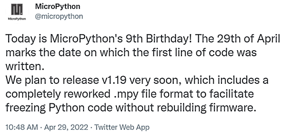](https://twitter.com/micropython/status/1520052529840758786)

News on the next release of MicroPython was posted on Twitter - [Twitter](https://twitter.com/micropython/status/1520052529840758786).

## CircuitPython 7.3.0 Beta 2 Released

CircuitPython 7.3.0-beta.2, the third published beta release for CircuitPython 7.3.0, is now out on [circuitpython.org](https://circuitpython.org/downloads). It is relatively stable, but there will be further additions and fixes before final release - [Adafruit Blog](https://blog.adafruit.com/2022/04/26/circuitpython-7-3-0-beta-2-released/) and [GitHub](https://github.com/adafruit/circuitpython/releases/tag/7.3.0-beta.2).

Notable changes to 7.3.0 since 7.2.5:

* Experimental mDNS support.
* USB to to Serial/JTAG support for REPL on appropriate boards.
* Initial experimental USB host support.
* Merge MicroPython 1.18 changes.
* Preliminary `zlib` module support. `gzip` module will be added later.
* RP2040 PIO: Background write to a PIO state machine. Looping is possible.
* RP2040 PIO: `wrap` and `wrap_target` support.
* `keypad`: scan keystates immediately on creation.
* Improve NeoPixel timings on many ports, to handle a wider range of devices.
* Add `floppyio`, used in conjunction with a library.
* Allow `TileGrid` bitmap to be changed.

## All future ESP32 SoCs will be based on RISC-V 

[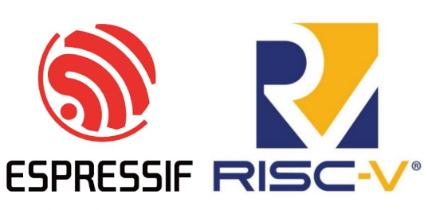](https://twitter.com/MisterTechBlog/status/1519216956305412096)

CEO and President of Espressif, Swee-Ann Teo, confirmed that all future ESP32 microcontrollers will be based on RISC-V instead of Xtensa "unless we have some special needs for something else, that I don't see now" - [Twitter](https://twitter.com/MisterTechBlog/status/1519216956305412096).

And an article confirming it's on all product lines and not just the ESP32-Cx line - [Robert Lipe](https://www.robertlipe.com/espressif-announces-esp32-c2-matter-chip-and-embraces-an-all-risc-v-future/).

## Feature

text - [site](url).

## This Week's Python Streams

Python on Hardware is all about building a cooperative ecosphere which allows contributions to be valued and to grow knowledge. Below are the streams within the last week focusing on the community.

### CircuitPython Deep Dive Stream

[This week](link), Tim streamd work on {subject}.

You can see the latest video and past videos on the Adafruit YouTube channel under the Deep Dive playlist - [YouTube](https://www.youtube.com/playlist?list=PLjF7R1fz_OOXBHlu9msoXq2jQN4JpCk8A).

### The CircuitPython Show

The CircuitPython Show is an independent podcast hosted by Paul Cutler, talking with people doing awesome things with CircuitPython. Each episode features Paul in conversation with a guest for a short interview – [CircuitPythonShow](https://circuitpythonshow.com/), [Blog Post](https://paulcutler.org/posts/2022/01/introducing-the-circuitpython-show/) and [Twitter](https://twitter.com/circuitpyshow).

Episode 8 was released Monday, May 2nd and features Melissa LeBlanc-Williams.  Paul and Melissa discuss Blinka, retro tech, and more. – [Show List](https://circuitpythonshow.com/episodes).

### TammyMakesThings is Streaming CircuitPython

[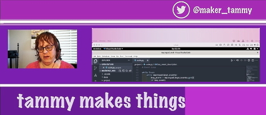](https://twitch.tv/tammymakesthings)

Community member and CircuitPython contributor [Tammy Cravit](https://github.com/tammymakesthings) is streaming on Twitch. Her stream focuses on electronics, coding and making, with a focus on CircuitPython. The first few streams have been working on a [MacroPad](https://adafruit.com/product/5128)-based MIDI controller, and she's got lots of other project ideas in the works. An exact schedule for her streams is still being worked out, but she's targeting 2-3 streams per week. Check it out and follow now to be notified of future streams - [Twitch](https://twitch.tv/tammymakesthings).

## Project of the Week

text - [site](url).

## News from around the web!

[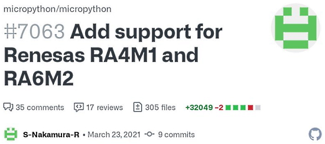](https://twitter.com/matt_trentini/status/1520017176773611520)

MicroPython has a new port; there's now support for the Renesas RA line of microcontrollers - [Twitter](https://twitter.com/matt_trentini/status/1520017176773611520) and [GitHub](https://github.com/micropython/micropython/pull/7063).

[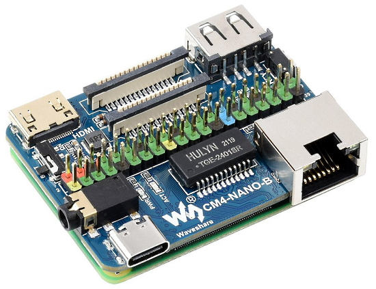](https://thepihut.com/products/nano-base-board-b-for-raspberry-pi-cm4)

The new Nano base Board B is is 'big sister' to the Nano Base Board A, offering even more functionality and connectivity for a Raspberry Pi Compute Module 4 in a tiny CM4-sized package - [The Pi Hut](https://thepihut.com/products/nano-base-board-b-for-raspberry-pi-cm4) via [Twitter](https://twitter.com/ThePiHut/status/1518683964331995150).

[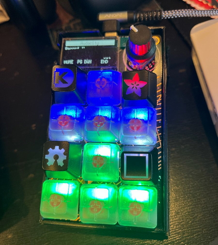](https://twitter.com/circuitpyshow/status/1519765685282512896)

Paul from The CircuitPython Show says he uses CircuitPython on an Adafruit MacroPad to produce the show - [Twitter](https://twitter.com/circuitpyshow/status/1519765685282512896).

TikTok Text-to-speech API:  a simple Python program that accesses the TikTok API and gives you an .mp3 file with what it says in the specified voice - [GitHub](https://github.com/oscie57/tiktok-voice).

The LumosRing LED board gets animated eyes, curtesy of CircuitPython - [Twitter](https://twitter.com/bradanlane/status/1519780209561636864).

[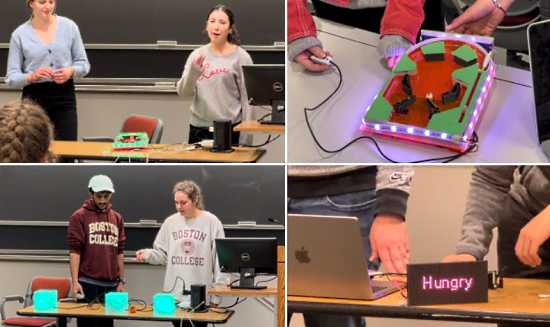](https://twitter.com/gallaugher/status/1519477696459329538?t=6b4HLa8ZfIjil4wFGMRtOA&s=03)

Assistive technologt (AT) projects presented to Boston College Campus School by BCPhysComp students: a wheelchair mountable pinball machine, a color cube game for pre-schoolers, a haptic communication tool for a student who is deaf-blind, all powered by CircuitPython - [Twitter](https://twitter.com/gallaugher/status/1519477696459329538?t=6b4HLa8ZfIjil4wFGMRtOA&s=03).

[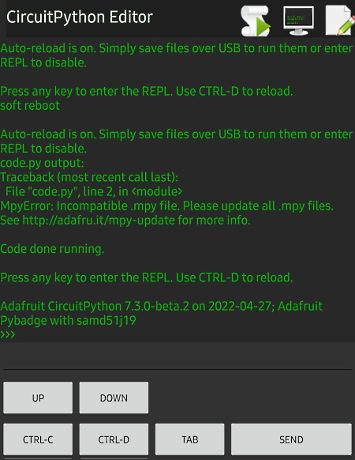](https://twitter.com/krayola/status/1519465563940171779?t=b0gwvB3Y5AlZOpRUqf6edg&s=03)

> "I can't get my laptop out (on my flight). No room. But that hasn't stop me from working on an Adafruit PyBadge on the plane. USB Type-C to Micro, CircuityPython Editor, and the ability to unzip files on Android" - [Twitter](https://twitter.com/krayola/status/1519465563940171779?t=b0gwvB3Y5AlZOpRUqf6edg&s=03).

[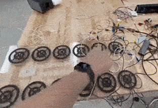](https://twitter.com/gallaugher/status/1519393010961768448)

A sound mixer with large conductive paint pads which activate sounds in CircuitPython - [Twitter](https://twitter.com/gallaugher/status/1519393010961768448).

&mc_cid=70d461c4c3&mc_eid=da0551b890)

Slice36: a Xiao RP2040 powered 36 key split keyboard using KMK formware based on CircuitPython - [Keyboard Builder's Digest](https://kbd.news/Slice36-1388.html?ct=t()&mc_cid=70d461c4c3&mc_eid=da0551b890).

[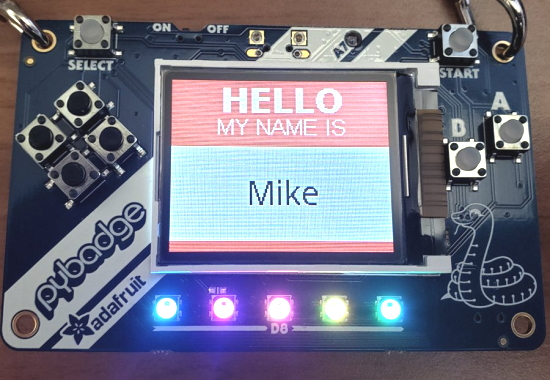](https://twitter.com/driscollis/status/1518697157561405441)

Using an Adafruit PyBadge as a nametag for PyCon - [Twitter](https://twitter.com/driscollis/status/1518697157561405441).

text - [site](url).

text - [site](url).

text - [site](url).

text - [site](url).

text - [site](url).

text - [site](url).

text - [site](url).

text - [site](url).

text - [site](url).

Reloadium: advanced hot reloading (also called "edit and continue" functionality) for Python - [GitHub](https://github.com/reloadware/reloadium).

[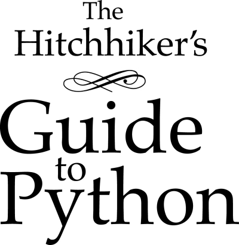](https://docs.python-guide.org/shipping/packaging/)

Packaging Your Code - [Hitchhiker's Guide to Python](https://docs.python-guide.org/shipping/packaging/).

PyDev of the Week:

CircuitPython Weekly Meeting for 

**#ICYDNCI What was the most popular, most clicked link, in [last week's newsletter](https://link)? [title](url).**

## Coming Soon

text - [site](url).

text - [site](url).

## New Boards Supported by CircuitPython

The number of supported microcontrollers and Single Board Computers (SBC) grows every week. This section outlines which boards have been included in CircuitPython or added to [CircuitPython.org](https://circuitpython.org/).

This week, there were (#/no) new boards added!

- [Board name](url)
- [Board name](url)
- [Board name](url)

*Note: For non-Adafruit boards, please use the support forums of the board manufacturer for assistance, as Adafruit does not have the hardware to assist in troubleshooting.*

Looking to add a new board to CircuitPython? It's highly encouraged! Adafruit has four guides to help you do so:

- [How to Add a New Board to CircuitPython](https://learn.adafruit.com/how-to-add-a-new-board-to-circuitpython/overview)
- [How to add a New Board to the circuitpython.org website](https://learn.adafruit.com/how-to-add-a-new-board-to-the-circuitpython-org-website)
- [Adding a Single Board Computer to PlatformDetect for Blinka](https://learn.adafruit.com/adding-a-single-board-computer-to-platformdetect-for-blinka)
- [Adding a Single Board Computer to Blinka](https://learn.adafruit.com/adding-a-single-board-computer-to-blinka)

## New Learn Guides!

[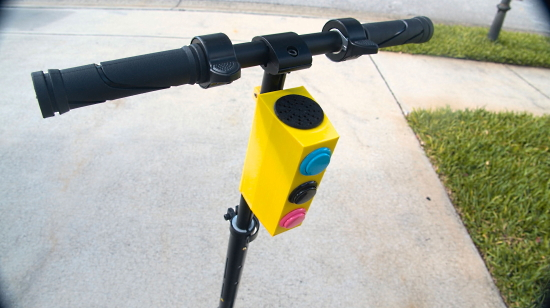](https://learn.adafruit.com/guides/latest)

[title](url) from [name](url)

[title](url) from [name](url)

[title](url) from [name](url)

## Updated Learn Guides!

[title](url) from [name](url)

## CircuitPython Libraries!

CircuitPython support for hardware continues to grow. We are adding support for new sensors and breakouts all the time, as well as improving on the drivers we already have. As we add more libraries and update current ones, you can keep up with all the changes right here!

For the latest libraries, download the [Adafruit CircuitPython Library Bundle](https://circuitpython.org/libraries). For the latest community contributed libraries, download the [CircuitPython Community Bundle](https://github.com/adafruit/CircuitPython_Community_Bundle/releases).

If you'd like to contribute, CircuitPython libraries are a great place to start. Have an idea for a new driver? File an issue on [CircuitPython](https://github.com/adafruit/circuitpython/issues)! Have you written a library you'd like to make available? Submit it to the [CircuitPython Community Bundle](https://github.com/adafruit/CircuitPython_Community_Bundle). Interested in helping with current libraries? Check out the [CircuitPython.org Contributing page](https://circuitpython.org/contributing). We've included open pull requests and issues from the libraries, and details about repo-level issues that need to be addressed. We have a guide on [contributing to CircuitPython with Git and GitHub](https://learn.adafruit.com/contribute-to-circuitpython-with-git-and-github) if you need help getting started. You can also find us in the #circuitpython channels on the [Adafruit Discord](https://adafru.it/discord).

You can check out this [list of all the Adafruit CircuitPython libraries and drivers available](https://github.com/adafruit/Adafruit_CircuitPython_Bundle/blob/master/circuitpython_library_list.md). 

The current number of CircuitPython libraries is **###**!

**New Libraries!**

Here's this week's new CircuitPython libraries:

* [library](url)

**Updated Libraries!**

Here's this week's updated CircuitPython libraries:

* [library](url)

## What’s the team up to this week?

What is the team up to this week? Let’s check in!

**Dan**

I released CircuitPython 7.3.0-beta.2, which includes about three weeks of fixes and improvements. Included are the revised NeoPixel timings I worked on this week.

I'm continuing to debug an ESP32-S2 I2C, together with an Esspressif engineer.

This coming week, I'll be testing the CircuitPython on the ESP32-S3, to see what is currently working and what needs to be fixed.

**Jeff**

Before heading to PyCon, some of my work got merged into the CircuitPython core, including the low-level "floppyio" module. This means you can read raw flux as well as MFM floppy data on SAMD51 and RP2040 microcontrollers in Python! While the accompanying [library](https://github.com/adafruit/Adafruit_CircuitPython_floppy)--which does things like control the drive's motors--hasn't been released yet, at least the core code is done and merged.

**Kattni**

[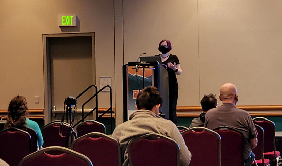](https://circuitpython.org/)

text

**Melissa**

Before heading to PyCon, I was able to get the touch screen drivers working alongside the MIPI drivers on the Raspberry Pi. I prepared a PR and it’s now merged. There are still a couple of small issues to work out. I had fun hanging out with Kattni and Jeff at PyCon and was able to meet a lot of nice folks.

**Tim**

My core PR to allow TileGrids to have their Bitmap changed was merged this week as well as a PR to add a tilegrid inflator helper to the imageload library. With these features now in place we now have everything needed for the SpriteButton and TabLayout displayio widgets that I've been working on. I had my first experience setting up a SharpMemoryDisplay in order to test out a few PRs for the driver library as well as testing out an asyncio library PR with the examples from the learn guide. Over the weekend I'll be watching some of the PyCon talks through their online portal.

**Liz**

This past week I [published a guide](https://learn.adafruit.com/qt-py-rp2040-usb-to-serial-midi-friends) on how to solder up some MIDI friends for the QT Py RP2040. Speaking as someone who ventured into electronics and coding specifically for music tech and MIDI projects, I'm not sure I'll ever get over how straight forward using CircuitPython for MIDI is. 

This coming week I'll be continuing on the laser harp project, some Twitter listener 
CircuitPython code and some new product Learn Guides. I did a [guide using the Twitter API](https://learn.adafruit.com/iot-twitter-listener-party-parrot/overview) back in August 2020 and it's been fun to revisit.

## Upcoming events!

The next MicroPython Meetup in Melbourne will be on May 4th (a change from April 27th) – [Meetup](https://www.meetup.com/MicroPython-Meetup/). See the [slides](https://docs.google.com/presentation/d/e/2PACX-1vSYt41VJm6ptM-aFKbnTPhucX-NZ2kXP7B7kbEp6Le9lidSfB7SKoNflvlCgCsJ0AOURAS-tamDVENX/pub?slide=id.p) of the March 23rd meeting.

PyCon US 2022 planning is underway. The event is in-person with an online component. April 27, 2022 – May 5, 2022 in Salt Lake City, Utah USA. Head over to the [PyCon US 2022 website](https://us.pycon.org/2022/) for details about the conference and the schedule (new) – [PyCon Blog](https://pycon.blogspot.com/2022/10/pycon-us-2022-website-and-sponsorship.html).

PyCon Italia is the Italian conference on Python. Organized by Python Italia, it is one of the more important Python conferences in Europe. With over 700 attendees, the next edition will be June 2-5, 2022 - [Ticket Registration](https://pycon.it/en/tickets).

SciPy 2022, the 21st annual Scientific Computing with Python conference, will be held in Austin, Texas, USA from July 11-17, 2022. The annual SciPy Conference brings together attendees from industry, academia, and government to showcase their latest projects, learn from skilled users and developers, and collaborate on code development. The full program will consist of 2 days tutorials (July 11-12), 3 days of talks (July 13-15) and 2 days of developer sprints (July 16-17) - [SciPy 2022](https://www.scipy2022.scipy.org/).

EuroPython 2022 will be held on 11th-17th July 2022 and it will be both in person and virtual. The in-person conference will be held at [The Convention Centre](https://www.theccd.ie/) Dublin (The CCD) in Dublin, Ireland - [EuroPython 2022](https://ep2022.europython.eu/).

**Send Your Events In**

As for other events, with the COVID pandemic, most in-person events are postponed or cancelled. If you know of virtual events or events that may occur in the future, please let us know on Twitter with hashtag #CircuitPython or email to cpnews(at)adafruit(dot)com.

## Latest releases

CircuitPython's stable release is [#.#.#](https://github.com/adafruit/circuitpython/releases/latest) and its unstable release is [#.#.#-##.#](https://github.com/adafruit/circuitpython/releases). New to CircuitPython? Start with our [Welcome to CircuitPython Guide](https://learn.adafruit.com/welcome-to-circuitpython).

[2022####](https://github.com/adafruit/Adafruit_CircuitPython_Bundle/releases/latest) is the latest CircuitPython library bundle.

[v#.#.#](https://micropython.org/download) is the latest MicroPython release. Documentation for it is [here](http://docs.micropython.org/en/latest/pyboard/).

[#.#.#](https://www.python.org/downloads/) is the latest Python release. The latest pre-release version is [#.#.#](https://www.python.org/download/pre-releases/).

[#,### Stars](https://github.com/adafruit/circuitpython/stargazers) Like CircuitPython? [Star it on GitHub!](https://github.com/adafruit/circuitpython)

## Call for help -- Translating CircuitPython is now easier than ever!

[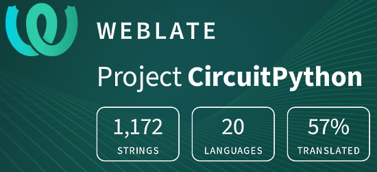](https://hosted.weblate.org/engage/circuitpython/)

One important feature of CircuitPython is translated control and error messages. With the help of fellow open source project [Weblate](https://weblate.org/), we're making it even easier to add or improve translations. 

Sign in with an existing account such as GitHub, Google or Facebook and start contributing through a simple web interface. No forks or pull requests needed! As always, if you run into trouble join us on [Discord](https://adafru.it/discord), we're here to help.

## jobs.adafruit.com - Find a dream job, find great candidates!

[jobs.adafruit.com](https://jobs.adafruit.com/) has returned and folks are posting their skills (including CircuitPython) and companies are looking for talented makers to join their companies - from Digi-Key, to Hackaday, Micro Center, Raspberry Pi and more.

**Job of the Week**

text - [Adafruit Jobs Board](https://jobs.adafruit.com/).

## NUMBER thanks!

The Adafruit Discord community, where we do all our CircuitPython development in the open, reached over NUMBER humans - thank you!  Adafruit believes Discord offers a unique way for Python on hardware folks to connect. Join today at [https://adafru.it/discord](https://adafru.it/discord).

## ICYMI - In case you missed it

Python on hardware is the Adafruit Python video-newsletter-podcast! The news comes from the Python community, Discord, Adafruit communities and more and is broadcast on ASK an ENGINEER Wednesdays. The complete Python on Hardware weekly videocast [playlist is here](https://www.youtube.com/playlist?list=PLjF7R1fz_OOXRMjM7Sm0J2Xt6H81TdDev). The video podcast is on [iTunes](https://itunes.apple.com/us/podcast/python-on-hardware/id1451685192?mt=2), [YouTube](http://adafru.it/pohepisodes), [IGTV (Instagram TV](https://www.instagram.com/adafruit/channel/)), and [XML](https://itunes.apple.com/us/podcast/python-on-hardware/id1451685192?mt=2).

[The weekly community chat on Adafruit Discord server CircuitPython channel - Audio / Podcast edition](https://itunes.apple.com/us/podcast/circuitpython-weekly-meeting/id1451685016) - Audio from the Discord chat space for CircuitPython, meetings are usually Mondays at 2pm ET, this is the audio version on [iTunes](https://itunes.apple.com/us/podcast/circuitpython-weekly-meeting/id1451685016), Pocket Casts, [Spotify](https://adafru.it/spotify), and [XML feed](https://adafruit-podcasts.s3.amazonaws.com/circuitpython_weekly_meeting/audio-podcast.xml).

## Codecademy "Learn Hardware Programming with CircuitPython"

Codecademy, an online interactive learning platform used by more than 45 million people, has teamed up with Adafruit to create a coding course, “Learn Hardware Programming with CircuitPython”. The course is now available in the [Codecademy catalog](https://www.codecademy.com/learn/learn-circuitpython?utm_source=adafruit&utm_medium=partners&utm_campaign=circuitplayground&utm_content=pythononhardwarenewsletter).

## Contribute!

The CircuitPython Weekly Newsletter is a CircuitPython community-run newsletter emailed every Tuesday. The complete [archives are here](https://www.adafruitdaily.com/category/circuitpython/). It highlights the latest CircuitPython related news from around the web including Python and MicroPython developments. To contribute, edit next week's draft [on GitHub](https://github.com/adafruit/circuitpython-weekly-newsletter/tree/gh-pages/_drafts) and [submit a pull request](https://help.github.com/articles/editing-files-in-your-repository/) with the changes. You may also tag your information on Twitter with #CircuitPython. 

Join the Adafruit [Discord](https://adafru.it/discord) or [post to the forum](https://forums.adafruit.com/viewforum.php?f=60) if you have questions.
