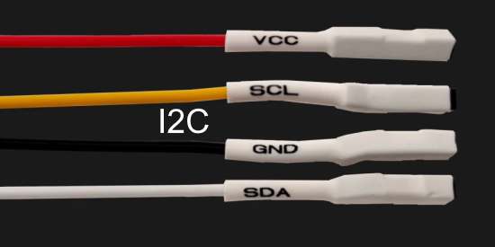
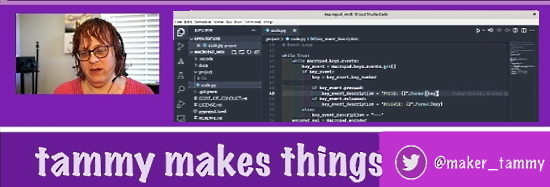
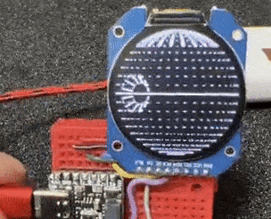
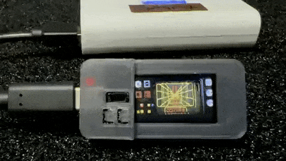
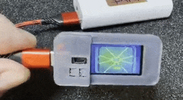
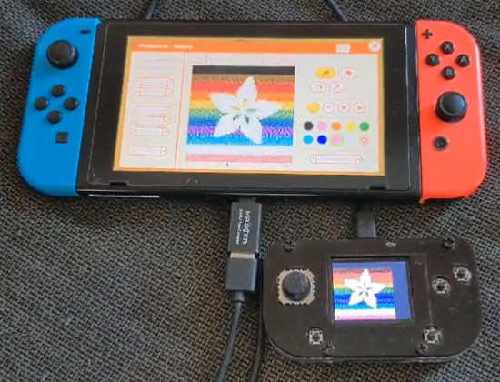
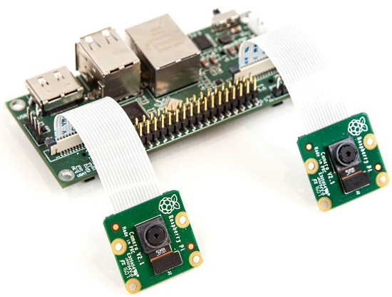
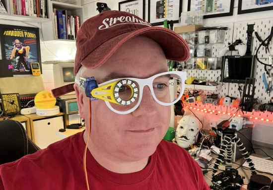
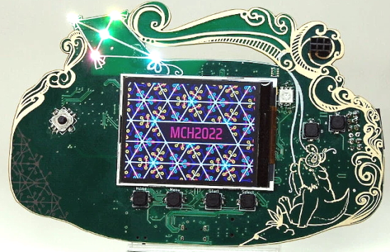
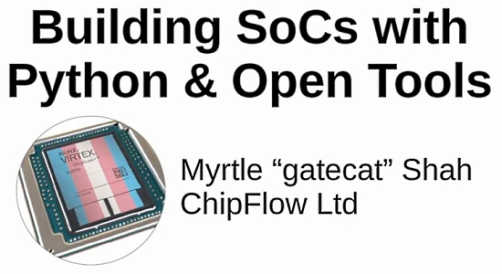

- [X] Kattni updates
- [ ] change date
- [ ] update title
- [ ] Feature story
- [ ] Update  for images
- [ ] Update ICYDNCI
- [ ] All images 550w max only
- [ ] Link "View this email in your browser."

News Sources

- [python.org](https://www.python.org/)
- [Python Insider - dev team blog](https://pythoninsider.blogspot.com/)
- [MicroPython Meetup Blog](https://melbournemicropythonmeetup.github.io/)
- [hackaday.io newest projects MicroPython](https://hackaday.io/projects?tag=micropython&sort=date) and [CircuitPython](https://hackaday.io/projects?tag=circuitpython&sort=date)
- [hackaday CircuitPython](https://hackaday.com/blog/?s=circuitpython) and [MicroPython](https://hackaday.com/blog/?s=micropython)
- [hackster.io CircuitPython](https://www.hackster.io/search?q=circuitpython&i=projects&sort_by=most_recent) and [MicroPython](https://www.hackster.io/search?q=micropython&i=projects&sort_by=most_recent)

View this email in your browser. Warning: Flashing Imagery

Welcome to the latest Python on Microcontrollers newsletter! 

We're on [Discord](https://discord.gg/HYqvREz), [Twitter](https://twitter.com/search?q=circuitpython&src=typed_query&f=live), and for past newsletters - [view them all here](https://www.adafruitdaily.com/category/circuitpython/). If you're reading this on the web, [subscribe here](https://www.adafruitdaily.com/). Here's the news this week:

## TIOBE Programming Language Index for May 2022

The May TIOBE Index still has Python as the #1 programming language, with a bit of gain over number two C - [TIOBE](https://www.tiobe.com/tiobe-index/?20220507).

## Feature

text - [site](url).

## The I2C Connection Standard Zoo

When it comes to I2C-on-a-connector conventions, you would correctly guess that there’s more than one, and they all have their pros and cons. They consist of six-and-a-half standards! They’re mostly inter-compatible, and making use of them means that you can access some pretty powerful peripherals easily - [Hackaday](https://hackaday.com/2022/05/04/the-connector-zoo-i2c-ecosystems/) and [Adafruit Blog](https://blog.adafruit.com/2022/05/05/i2c-ecosystems-the-connector-zoo-hackaday/).

## MicroPython Port for the WCH-CH32V307 Microcontroller

An experimental port of MicroPython for the [CH32V307EVT board](https://eji4evk5kxx.exactdn.com/wp-content/uploads/2022/01/CH32V307V-EVT-R1-720x499.jpg) has been posted on [GitHub](https://github.com/r4d10n/micropython-wch-ch32v307/tree/master/ports/wch). The board uses the [WCH CH32V307 RISC-V microcontroller](https://github.com/openwch/ch32v307) - [Adafruit Blog](https://blog.adafruit.com/2022/05/06/micropython-port-for-the-wch-ch32v307-risc-v-microcontroller-riscv-micropython-micropython/).

## This Week's Python Streams

Python on Hardware is all about building a cooperative ecosphere which allows contributions to be valued and to grow knowledge. Below are the streams within the last week focusing on the community.

### CircuitPython Deep Dive Stream

[This week](link), Tim streamd work on {subject}.

You can see the latest video and past videos on the Adafruit YouTube channel under the Deep Dive playlist - [YouTube](https://www.youtube.com/playlist?list=PLjF7R1fz_OOXBHlu9msoXq2jQN4JpCk8A).

### CircuitPython Parsec

John Park’s CircuitPython Parsec this week is on {subject} - [Adafruit Blog](link) and [YouTube](link).

Catch all the episodes in the [YouTube playlist](https://www.youtube.com/playlist?list=PLjF7R1fz_OOWFqZfqW9jlvQSIUmwn9lWr).

### The CircuitPython Show

The CircuitPython Show is an independent podcast hosted by Paul Cutler, talking with people doing awesome things with CircuitPython. Each episode features Paul in conversation with a guest for a short interview – [CircuitPythonShow](https://circuitpythonshow.com/), [Blog Post](https://paulcutler.org/posts/2022/01/introducing-the-circuitpython-show/) and [Twitter](https://twitter.com/circuitpyshow).

The podcast is released every other week and is off this week. Last week's episode features Melissa LeBlanc-Williams and next Monday Liz Clark joins the show – [Show List](https://circuitpythonshow.com/episodes).

### TammyMakesThings is Streaming CircuitPython

Community member and CircuitPython contributor [Tammy Cravit](https://github.com/tammymakesthings) is streaming on Twitch. Her stream focuses on electronics, coding and making, with a focus on CircuitPython. The first few streams have been working on a [MacroPad](https://adafruit.com/product/5128)-based MIDI controller, and she's got lots of other project ideas in the works. An exact schedule for her streams is still being worked out, but she's targeting 2-3 streams per week. Check it out and follow now to be notified of future streams - [Twitch](https://twitch.tv/tammymakesthings).

## Projects of the Week: Star Wars

Here are projects celebrating May the Fourth (like in Star Wars "May the Force Be with You") and May the Sixth ("Revenge of the Sixth).

A DeathStar animation in CircuitPython on a GC9A01 round LCD driven by an Adafruit QTPY RP2040 - [Twitter](https://twitter.com/todbot/status/1522283940488249344).

> For Star Wars Day, I made a silly targeting computer gizmo in CircuitPython. This uses an Adafruit ESP32-S2 TFT Feather but any CircuitPython-capable board + display will work. Stay on target! - [Twitter](https://twitter.com/todbot/status/1521939805147262976).

> For Revenge of The Sixth, here's a rebel combat computer trying to lock onto a TIE fighter. It keeps getting so close! Code in CircuitPython on 
an Adafruit ESP32-S2 Feather TFT - [Twitter](https://twitter.com/todbot/status/1522653974356119552).

R2-D2 with his new friend, an Adafruit Feather TFT ESP32-S2 and CircuitPython - [Twitter](https://twitter.com/alx_nearphuture/status/1521953056216256513).

## News from around the web!

Transfer texture from an Adafruit PyGamer to GameBuilderGarage on a Nintendo Switch by mouse emulation - [Twitter](https://twitter.com/DavidGlaude/status/1523618730416037893) and [GitHub](https://github.com/dglaude/AGTD_CircuitPython).

text - [site](url).

text - [site](url).

text - [site](url).

text - [site](url).

StereoPi is an open source stereoscopic camera based on Raspberry Pi. It can capture, save, livestream, and process real-time stereoscopic video and images with excellent Python support - [CrowdSupply](https://www.crowdsupply.com/stereopi/stereopi) and [GitHub](https://github.com/realizator/stereopi-tutorial).

Cyber glasses to help illuminate parts when soldering. It’s servo activated and can move out of the way too. It uses a Raspberry Pi Pico powered 
Adafruit NeoPixels and MicroPython - [Twitter](https://twitter.com/kevsmac/status/1522527206555201536).

The Dutchhacker camp MCH2022 on July 22 will feature this MicroPython programmable badge. It has an ESP32 and a Lattice FPGA with a color display - [Hackaday]https://hackaday.com/2022/05/04/the-mch2022-badge-has-landed/) and [YouTube](https://www.youtube.com/watch?v=-yk3I0oce4k).

text - [site](url).

text - [site](url).

text - [site](url).

text - [site](url).

text - [site](url).

text - [site](url).

text - [site](url).

text - [site](url).

text - [site](url).

Building SoCs with Python and Open Tools by Myrtle "gatecat" Shah - [YouTube](https://www.youtube.com/watch?v=rVsOZE80c-k).

text - [site](url).

text - [site](url).

PyDev of the Week:

CircuitPython Weekly Meeting for 

**#ICYDNCI What was the most popular, most clicked link, in [last week's newsletter](https://link)? [title](url).**

## Coming Soon

text - [site](url).

text - [site](url).

## New Boards Supported by CircuitPython

The number of supported microcontrollers and Single Board Computers (SBC) grows every week. This section outlines which boards have been included in CircuitPython or added to [CircuitPython.org](https://circuitpython.org/).

This week, there were (#/no) new boards added!

- [Board name](url)
- [Board name](url)
- [Board name](url)

*Note: For non-Adafruit boards, please use the support forums of the board manufacturer for assistance, as Adafruit does not have the hardware to assist in troubleshooting.*

Looking to add a new board to CircuitPython? It's highly encouraged! Adafruit has four guides to help you do so:

- [How to Add a New Board to CircuitPython](https://learn.adafruit.com/how-to-add-a-new-board-to-circuitpython/overview)
- [How to add a New Board to the circuitpython.org website](https://learn.adafruit.com/how-to-add-a-new-board-to-the-circuitpython-org-website)
- [Adding a Single Board Computer to PlatformDetect for Blinka](https://learn.adafruit.com/adding-a-single-board-computer-to-platformdetect-for-blinka)
- [Adding a Single Board Computer to Blinka](https://learn.adafruit.com/adding-a-single-board-computer-to-blinka)

## New Learn Guides!

[Adafruit VL53L4CX Time of Flight Distance Sensor](https://learn.adafruit.com/adafruit-vl53l4cx-time-of-flight-distance-sensor) from [Liz Clark](https://learn.adafruit.com/users/BlitzCityDIY)

[Adafruit DVI Breakout Board](https://learn.adafruit.com/adafruit-dvi-breakout-board) from [Liz Clark](https://learn.adafruit.com/users/BlitzCityDIY)

## CircuitPython Libraries!

CircuitPython support for hardware continues to grow. We are adding support for new sensors and breakouts all the time, as well as improving on the drivers we already have. As we add more libraries and update current ones, you can keep up with all the changes right here!

For the latest libraries, download the [Adafruit CircuitPython Library Bundle](https://circuitpython.org/libraries). For the latest community contributed libraries, download the [CircuitPython Community Bundle](https://github.com/adafruit/CircuitPython_Community_Bundle/releases).

If you'd like to contribute, CircuitPython libraries are a great place to start. Have an idea for a new driver? File an issue on [CircuitPython](https://github.com/adafruit/circuitpython/issues)! Have you written a library you'd like to make available? Submit it to the [CircuitPython Community Bundle](https://github.com/adafruit/CircuitPython_Community_Bundle). Interested in helping with current libraries? Check out the [CircuitPython.org Contributing page](https://circuitpython.org/contributing). We've included open pull requests and issues from the libraries, and details about repo-level issues that need to be addressed. We have a guide on [contributing to CircuitPython with Git and GitHub](https://learn.adafruit.com/contribute-to-circuitpython-with-git-and-github) if you need help getting started. You can also find us in the #circuitpython channels on the [Adafruit Discord](https://adafru.it/discord).

You can check out this [list of all the Adafruit CircuitPython libraries and drivers available](https://github.com/adafruit/Adafruit_CircuitPython_Bundle/blob/master/circuitpython_library_list.md). 

The current number of CircuitPython libraries is **355**!

**Updated Libraries!**

Here's this week's updated CircuitPython libraries:

 * [Adafruit_CircuitPython_PyBadger](https://github.com/adafruit/Adafruit_CircuitPython_PyBadger)
 * [Adafruit_CircuitPython_ImageLoad](https://github.com/adafruit/Adafruit_CircuitPython_ImageLoad)
 * [Adafruit_CircuitPython_MONSTERM4SK](https://github.com/adafruit/Adafruit_CircuitPython_MONSTERM4SK)
 * [Adafruit_CircuitPython_TPA2016](https://github.com/adafruit/Adafruit_CircuitPython_TPA2016)
 * [Adafruit_CircuitPython_LSM6DS](https://github.com/adafruit/Adafruit_CircuitPython_LSM6DS)
 * [Adafruit_CircuitPython_ST7789](https://github.com/adafruit/Adafruit_CircuitPython_ST7789)
 * [Adafruit_CircuitPython_AdafruitIO](https://github.com/adafruit/Adafruit_CircuitPython_AdafruitIO)
 * [Adafruit_CircuitPython_BLE_Magic_Light](https://github.com/adafruit/Adafruit_CircuitPython_BLE_Magic_Light)
 * [Adafruit_CircuitPython_AHTx0](https://github.com/adafruit/Adafruit_CircuitPython_AHTx0)
 * [Adafruit_CircuitPython_BLE_Radio](https://github.com/adafruit/Adafruit_CircuitPython_BLE_Radio)
 * [Adafruit_CircuitPython_binascii](https://github.com/adafruit/Adafruit_CircuitPython_binascii)
 * [Adafruit_CircuitPython_BLE_BerryMed_Pulse_Oximeter](https://github.com/adafruit/Adafruit_CircuitPython_BLE_BerryMed_Pulse_Oximeter)
 * [Adafruit_CircuitPython_RGB_Display](https://github.com/adafruit/Adafruit_CircuitPython_RGB_Display)
 * [Adafruit_CircuitPython_SI5351](https://github.com/adafruit/Adafruit_CircuitPython_SI5351)
 * [Adafruit_CircuitPython_BitmapSaver](https://github.com/adafruit/Adafruit_CircuitPython_BitmapSaver)
 * [Adafruit_CircuitPython_ESP_ATcontrol](https://github.com/adafruit/Adafruit_CircuitPython_ESP_ATcontrol)
 * [Adafruit_CircuitPython_PIOASM](https://github.com/adafruit/Adafruit_CircuitPython_PIOASM)
 * [Adafruit_Blinka](https://github.com/adafruit/Adafruit_Blinka)
 * [CircuitPython_Community_Bundle](https://github.com/adafruit/CircuitPython_Community_Bundle)

## What’s the team up to this week?

What is the team up to this week? Let’s check in!

**Dan**

I'm writing a general CircuitPython "port test" library, which will test, as automatically as possible, whether the native modules, such as `digitalio`, `busio`, etc. are functioning properly. Some of this testing can be done with no wiring, but in some cases pins will need to be wired together, or connecte to external devices. The testing already found one minor issue in the Espressif implementation.

**Jeff**

While there was already a lot of coverage of PyCon on the internet and in this newsletter, I can't resist making another plug for [the blog entry I wrote](https://blog.adafruit.com/2022/05/04/jeffs-experiences-at-pyconus2022-adafruit/) about my experience. tl;dr: It was great!

My recent work on the core has been of an investigative sort. I looked for possible improvements to our pseudorandom number generator (`random.randrange` and friends), but didn't end up finding any changes I thought were worth including. I have another Pull Request out to make a slight optimization of flash memory usage, but as we're a bit concerned about other impacts of the change it hasn't been merged yet.

I've been learning about Juypter Notebooks. It's a version of Python that runs in the browser with a slick interface called 'the notebook'. These look like a great way to allow someone to run complex Python code without installing anything locally, and in a self-documenting way, through free-tier services like Google Colab. I hope to provide a version of the flux visualization program that can run this way.

**Kattni**

I spent most of the last week at PyCon US 2022. I saw so many friends I haven't seen in 3 years, and overall it was an amazing experience. We hosted Open Spaces for two hours each of the three conference days, and the full two days of development Sprints. Both were well attended. The Open Spaces were an introduction to CircuitPython using the Circuit Playground Bluefruit. Everyone who attended was incredibly engaged, and many people told me they learned a lot. I was able to hand out the CPBs on Sunday after the Open Spaces were over, so some folks headed home with them. Two attendees designed projects with the CPB, and submitted them to my [PyCon2022 GitHub repo](https://github.com/kattni/PyCon2022), which was really exciting to see. The Sprints were an opportunity for folks to contribute to the CircuitPython project in a way that interested them, as well as facilitating folks who wanted to learn about CircuitPython. We had a number of issues closed by those who attended the Sprints. Some of the chosen issues turned out to be a bit hard-mode, but everyone stuck through it and persevered. They all felt that they accomplished something and learned new things in the process.

**Melissa**

This past week, I continued helping out at PyCon US 2022. On Monday and Tuesday Kattni and I hosted the Development Sprints. We had a lot of fun and were able to meet a lot of great folks.

**Tim**

I reviewed PRs from and worked remotely with folks at the PyCon sprints. We had several people pick up some of our "good first issues". I made a snake game for the pygamer and pybadge and integrated it with the basic badger example so you can show off your name and info along with snake or whatever other project you want.

**Liz**

This past week I worked on two new product guides for the [VL53L4CX time of flight sensor](https://learn.adafruit.com/adafruit-vl53l4cx-time-of-flight-distance-sensor) and the [DVI breakout board](https://learn.adafruit.com/adafruit-dvi-breakout-board). The DVI breakout guide has a page that walks through using the PicoDVI examples by Luke Wren for the Raspberry Pi Pico which I think will be helpful for folks. I'm getting towards the end of the laser harp project. It is coded using CircuitPython for 8 VL53L4CD time of flight sensors so it will be an example for folks using multiple I2C devices that use the same address. 

## Upcoming events!

The next MicroPython Meetup in Melbourne will be on May 25th – [Meetup](https://www.meetup.com/MicroPython-Meetup/). See the [slides](https://docs.google.com/presentation/d/e/2PACX-1vSYt41VJm6ptM-aFKbnTPhucX-NZ2kXP7B7kbEp6Le9lidSfB7SKoNflvlCgCsJ0AOURAS-tamDVENX/pub?slide=id.p) of the May 4th meeting.

PyCon Italia is the Italian conference on Python. Organized by Python Italia, it is one of the more important Python conferences in Europe. With over 700 attendees, the next edition will be June 2-5, 2022 - [Ticket Registration](https://pycon.it/en/tickets).

SciPy 2022, the 21st annual Scientific Computing with Python conference, will be held in Austin, Texas, USA from July 11-17, 2022. The annual SciPy Conference brings together attendees from industry, academia, and government to showcase their latest projects, learn from skilled users and developers, and collaborate on code development. The full program will consist of 2 days tutorials (July 11-12), 3 days of talks (July 13-15) and 2 days of developer sprints (July 16-17) - [SciPy 2022](https://www.scipy2022.scipy.org/).

EuroPython 2022 will be held on 11th-17th July 2022 and it will be both in person and virtual. The in-person conference will be held at [The Convention Centre](https://www.theccd.ie/) Dublin (The CCD) in Dublin, Ireland - [EuroPython 2022](https://ep2022.europython.eu/).

**Send Your Events In**

As for other events, with the COVID pandemic, most in-person events are postponed or cancelled. If you know of virtual events or events that may occur in the future, please let us know on Twitter with hashtag #CircuitPython or email to cpnews(at)adafruit(dot)com.

## Latest releases

CircuitPython's stable release is [#.#.#](https://github.com/adafruit/circuitpython/releases/latest) and its unstable release is [#.#.#-##.#](https://github.com/adafruit/circuitpython/releases). New to CircuitPython? Start with our [Welcome to CircuitPython Guide](https://learn.adafruit.com/welcome-to-circuitpython).

[2022####](https://github.com/adafruit/Adafruit_CircuitPython_Bundle/releases/latest) is the latest CircuitPython library bundle.

[v#.#.#](https://micropython.org/download) is the latest MicroPython release. Documentation for it is [here](http://docs.micropython.org/en/latest/pyboard/).

[#.#.#](https://www.python.org/downloads/) is the latest Python release. The latest pre-release version is [#.#.#](https://www.python.org/download/pre-releases/).

[#,### Stars](https://github.com/adafruit/circuitpython/stargazers) Like CircuitPython? [Star it on GitHub!](https://github.com/adafruit/circuitpython)

## Call for help -- Translating CircuitPython is now easier than ever!

One important feature of CircuitPython is translated control and error messages. With the help of fellow open source project [Weblate](https://weblate.org/), we're making it even easier to add or improve translations. 

Sign in with an existing account such as GitHub, Google or Facebook and start contributing through a simple web interface. No forks or pull requests needed! As always, if you run into trouble join us on [Discord](https://adafru.it/discord), we're here to help.

## jobs.adafruit.com - Find a dream job, find great candidates!

[jobs.adafruit.com](https://jobs.adafruit.com/) has returned and folks are posting their skills (including CircuitPython) and companies are looking for talented makers to join their companies - from Digi-Key, to Hackaday, Micro Center, Raspberry Pi and more.

**Job of the Week**

text - [Adafruit Jobs Board](https://jobs.adafruit.com/).

## NUMBER thanks!

The Adafruit Discord community, where we do all our CircuitPython development in the open, reached over NUMBER humans - thank you!  Adafruit believes Discord offers a unique way for Python on hardware folks to connect. Join today at [https://adafru.it/discord](https://adafru.it/discord).

## ICYMI - In case you missed it

Python on hardware is the Adafruit Python video-newsletter-podcast! The news comes from the Python community, Discord, Adafruit communities and more and is broadcast on ASK an ENGINEER Wednesdays. The complete Python on Hardware weekly videocast [playlist is here](https://www.youtube.com/playlist?list=PLjF7R1fz_OOXRMjM7Sm0J2Xt6H81TdDev). The video podcast is on [iTunes](https://itunes.apple.com/us/podcast/python-on-hardware/id1451685192?mt=2), [YouTube](http://adafru.it/pohepisodes), [IGTV (Instagram TV](https://www.instagram.com/adafruit/channel/)), and [XML](https://itunes.apple.com/us/podcast/python-on-hardware/id1451685192?mt=2).

[The weekly community chat on Adafruit Discord server CircuitPython channel - Audio / Podcast edition](https://itunes.apple.com/us/podcast/circuitpython-weekly-meeting/id1451685016) - Audio from the Discord chat space for CircuitPython, meetings are usually Mondays at 2pm ET, this is the audio version on [iTunes](https://itunes.apple.com/us/podcast/circuitpython-weekly-meeting/id1451685016), Pocket Casts, [Spotify](https://adafru.it/spotify), and [XML feed](https://adafruit-podcasts.s3.amazonaws.com/circuitpython_weekly_meeting/audio-podcast.xml).

## Codecademy "Learn Hardware Programming with CircuitPython"

Codecademy, an online interactive learning platform used by more than 45 million people, has teamed up with Adafruit to create a coding course, “Learn Hardware Programming with CircuitPython”. The course is now available in the [Codecademy catalog](https://www.codecademy.com/learn/learn-circuitpython?utm_source=adafruit&utm_medium=partners&utm_campaign=circuitplayground&utm_content=pythononhardwarenewsletter).

## Contribute!

The CircuitPython Weekly Newsletter is a CircuitPython community-run newsletter emailed every Tuesday. The complete [archives are here](https://www.adafruitdaily.com/category/circuitpython/). It highlights the latest CircuitPython related news from around the web including Python and MicroPython developments. To contribute, edit next week's draft [on GitHub](https://github.com/adafruit/circuitpython-weekly-newsletter/tree/gh-pages/_drafts) and [submit a pull request](https://help.github.com/articles/editing-files-in-your-repository/) with the changes. You may also tag your information on Twitter with #CircuitPython. 

Join the Adafruit [Discord](https://adafru.it/discord) or [post to the forum](https://forums.adafruit.com/viewforum.php?f=60) if you have questions.
