- [X] Kattni updates
- [ ] change date
- [ ] update title
- [ ] Feature story
- [ ] Update  for images
- [ ] Update ICYDNCI
- [ ] All images 550w max only
- [ ] Link "View this email in your browser."

News Sources

- [python.org](https://www.python.org/)
- [Python Insider - dev team blog](https://pythoninsider.blogspot.com/)
- [MicroPython Meetup Blog](https://melbournemicropythonmeetup.github.io/)
- [hackaday.io newest projects MicroPython](https://hackaday.io/projects?tag=micropython&sort=date) and [CircuitPython](https://hackaday.io/projects?tag=circuitpython&sort=date)
- [hackaday CircuitPython](https://hackaday.com/blog/?s=circuitpython) and [MicroPython](https://hackaday.com/blog/?s=micropython)
- [hackster.io CircuitPython](https://www.hackster.io/search?q=circuitpython&i=projects&sort_by=most_recent) and [MicroPython](https://www.hackster.io/search?q=micropython&i=projects&sort_by=most_recent)

View this email in your browser. **Warning: Flashing Imagery**

Welcome to the latest Python on Microcontrollers newsletter! 

We're on [Discord](https://discord.gg/HYqvREz), [Twitter](https://twitter.com/search?q=circuitpython&src=typed_query&f=live), and for past newsletters - [view them all here](https://www.adafruitdaily.com/category/circuitpython/). If you're reading this on the web, [subscribe here](https://www.adafruitdaily.com/). Here's the news this week:

## There are now over 300 CircuitPython compatible microcontroller boards

[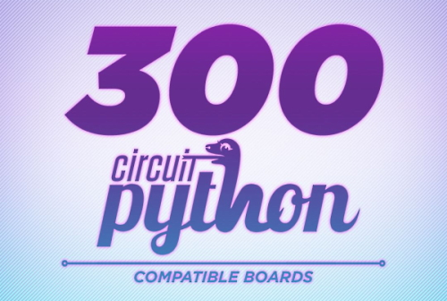](https://blog.adafruit.com/2022/05/17/there-are-now-over-300-circuitpython-compatible-microcontroller-boards-circuitpython-python-adafruit/)

There are now over 300 microcontroller boards that support CircuitPython! They include boards from many manufacturers, these are boards from the community, companies that are not Adafruit, and entire new businesses / makers using and shipping boards with CircuitPython. Supported chips include: Espressif, Microchip SAMDs, Nordic, NXP, RP2040s, ST, and more! From Wi-Fi to BLE to LoRA, there is an easy and fun way to program microcontrollers with CircuitPython! - [Adafruit Blog](https://blog.adafruit.com/2022/05/17/there-are-now-over-300-circuitpython-compatible-microcontroller-boards-circuitpython-python-adafruit/).

[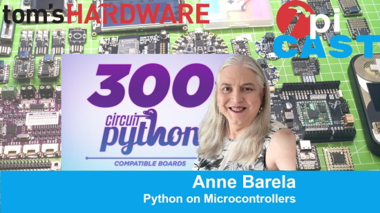](https://blog.adafruit.com/2022/05/20/tuesday-toms-hardware-pi-cast-hosts-anne-to-discuss-python-on-microcontrollers-more-tomshardware-circuitpython-anne_engineer/)

And check out the article on [Tom's Hardware](https://www.tomshardware.com/news/circuitpython-supported-by-over-300-boards). Tom's will host your editor, [Anne Barela](https://twitter.com/anne_engineer) on [The Pi Cast](https://www.youtube.com/watch?v=OGb55VXAp4I) video on Tuesday May 24th at 2:30pm US Eastern, 7:30 UK BST - [Adafruit Blog](https://blog.adafruit.com/2022/05/20/tuesday-toms-hardware-pi-cast-hosts-anne-to-discuss-python-on-microcontrollers-more-tomshardware-circuitpython-anne_engineer/).

## MicroPython Surpasses Original GitHub Sponsorship Target

[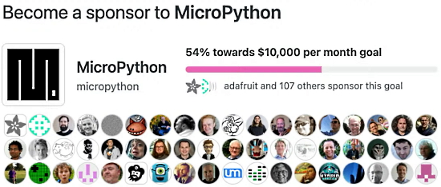](https://github.com/sponsors/micropython)

MicroPython has been using [GitHub Sponsorship](https://github.com/sponsors/micropython) to raise funds for development. With over a hundred donors, they fell short of $5,000 a month. Adafruit has already been a sponsor since corporate sponsors were added, and they promoted this worthwhile effort to other MicroPython users. The effort recently surpassed the $5k mark and MicroPython has increased their target to $10,000 per month to hire an additional developer. Are you a user of MicroPython or CircuitPython (a MicroPython derivitive)? Please consider sponsoring some money per month - [GitHub](https://github.com/sponsors/micropython).

## ChrcuitPython 7.3.0-rc.1 Released

)

CircuitPython 7.3.0-rc.1, the second release candidate for CircuitPython 7.3.0 was released. It is considered stable, and is available as a release candidate for testing before the final release of 7.3.0. - [Adafruit Blog]([url](https://blog.adafruit.com/2022/05/18/circuitpython-7-3-0-release-candidate-1-released/)).

## TinyUSB Gets USB Host Capability on RP2040 Chips

[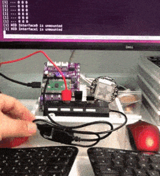](https://twitter.com/tinyusb/status/1526126928989913089)

Thanks to https://github.com/sekigon-gonnoc/Pico-PIO-USB, Raspberry Pi RP2040 microcontrollers can have additional USB ports through the use of the chip's PIO. RP2040 runs as device on native USB and host on 2 GPIOs, both managed by TinyUSB - [Twitter](https://twitter.com/tinyusb/status/1526126928989913089).

## CircuitPython is Now a Topic on GitHub

[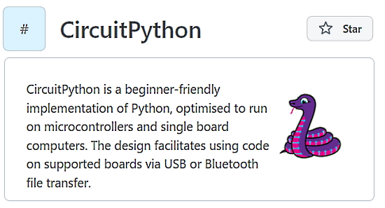](https://github.com/topics/circuitpython)

CircuitPython now joins [MicroPython](https://github.com/topics/micropython) as an official Topic on GitHub. You can use #CircuitPython for tagging throughout the site (and #MicroPython for MicroPython) - [GitHub](https://github.com/topics/circuitpython)

## New Python Implementations For Hardware

[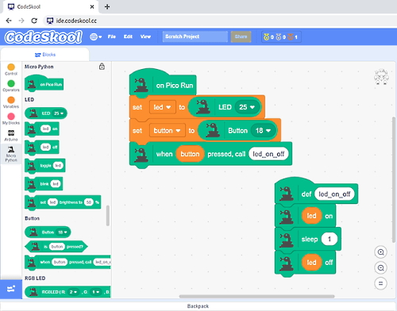](https://www.reddit.com/r/circuitpython/comments/uri5ws/teach_kids_python_and_embedded_electronics_with_4/)

[CodeSkool](https://ide.codeskool.cc/) is a block based Python for Raspberry Pi Pico supporting the complete examples of [PicoZero Python](https://picozero.readthedocs.io/en/latest/recipes.html/) - [Reddit](https://www.reddit.com/r/circuitpython/comments/uri5ws/teach_kids_python_and_embedded_electronics_with_4/).

PikaScript is a lightweight Python implementation that runs on STM32 and other low-end MCUs - [cnx-software](https://www.cnx-software.com/2022/05/18/pikascript-a-lightweight-python-implementation-that-runs-on-stm32-and-other-low-end-mcus/) and source - [GitHub](https://github.com/pikasTech/pikascript).

## Thonny 4.0.0 Beta 3 Out

The Thonny editor's latest beta of version 4.0 is out with bugfixes and experimental support for MicoPython on LEGO® MINDSTORMS® EV3. It also provides support for CircuitPython with micro:bit - [GitHub]([url](https://github.com/thonny/thonny/releases/tag/v4.0.0b3)) via [Twitter](https://twitter.com/thonnyide/status/1526465077288869888).

## This Week's Python Streams

Python on Hardware is all about building a cooperative ecosphere which allows contributions to be valued and to grow knowledge. Below are the streams within the last week focusing on the community.

### CircuitPython Deep Dive Stream

[This week](link), Tim streamd work on {subject}.

You can see the latest video and past videos on the Adafruit YouTube channel under the Deep Dive playlist - [YouTube](https://www.youtube.com/playlist?list=PLjF7R1fz_OOXBHlu9msoXq2jQN4JpCk8A).

### CircuitPython Parsec

John Park’s CircuitPython Parsec this week is on using a Bicolor LED Matrix - [Adafruit Blog](https://blog.adafruit.com/2022/05/20/john-parks-circuitpython-parsec-bicolor-led-matrix-adafruit-johnedgarpark-adafruit-circuitpython/) and [YouTube](https://youtu.be/9-gghMHvvdk).

Catch all the episodes in the [YouTube playlist](https://www.youtube.com/playlist?list=PLjF7R1fz_OOWFqZfqW9jlvQSIUmwn9lWr).

### The CircuitPython Show

The CircuitPython Show is an independent podcast hosted by Paul Cutler focusing on the people doing awesome things with CircuitPython. Each episode features Paul in conversation with a guest for a short interview. – [CircuitPythonShow](https://circuitpythonshow.com/) and [Twitter](https://twitter.com/circuitpyshow).

The CircuitPython Show is off this week.  Last week featured Adafruit's Liz Clark and next week Pierre Constantineau joins the show to talk about mechanical keyboards and CircuitPython. – [Show List](https://circuitpyshow.com/episodes/all).

### TammyMakesThings is Streaming CircuitPython

Community member and CircuitPython contributor [Tammy Cravit](https://github.com/tammymakesthings) is streaming on Twitch. Her stream focuses on electronics, coding and making, with a focus on CircuitPython. The first few streams have been working on a [MacroPad](https://adafruit.com/product/5128)-based MIDI controller, and she's got lots of other project ideas in the works. An exact schedule for her streams is still being worked out, but she's targeting 2-3 streams per week. Check it out and follow now to be notified of future streams - [Twitch](https://twitch.tv/tammymakesthings).

## Project of the Week: Using Two Displays in CircuitPython

[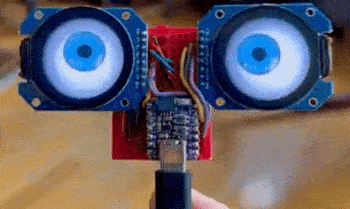](https://twitter.com/todbot/status/1526664851459743746)

Multiple Displays in CircuitPython and Compiling Custom CircuitPython - [todbot.com](https://todbot.com/blog/2022/05/19/multiple-displays-in-circuitpython-compiling-custom-circuitpython/).

> Did you know you can run multiple displays in CircuitPython? One way: wire up two displays in parallel. There’s also true dual displays. Only a single display is supported for the pre-built versions of CircuitPython (The one exception is the MonsterMask) Multiple displays are supported in the design of CircuitPython, but it’s a compile-time setting. This is for RAM savings reasons. 

[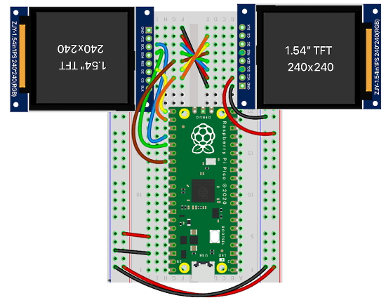](https://twitter.com/todbot/status/1526664851459743746)

## News from around the web!

[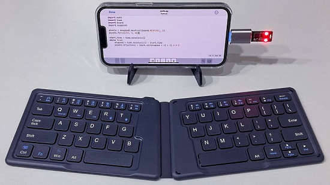](https://twitter.com/PaintYourDragon/status/1526402780490964992)

[That Dragon Guy](https://twitter.com/PaintYourDragon) on Twitter posts about programming CircuitPython boards using an iPhone and tiny Bluetooth keyboards for a very mobile solution - [Twitter Thread](https://twitter.com/PaintYourDragon/status/1526402780490964992) and [Adafruit Blog](https://blog.adafruit.com/2022/05/17/programming-circuitpython-boards-on-the-go-with-ios-devices-circuitpython-iphone-paintyourdragon/).

A CircuitPython powered gesture controller with an Adafruit Proximity Trinkey - [Adafruit Blog](https://blog.adafruit.com/2022/05/19/a-circuitpython-powered-gesture-controller-circuitpython-aoyamaprod/).

[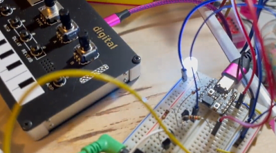](https://twitter.com/BlitzCityDIY/status/1527091422087766016)

> Eurorack gate out. Shifting 3.3v logic to 5v. CircuitPython script turning a pin off and on with random delays - [Twitter](https://twitter.com/BlitzCityDIY/status/1527091422087766016).

[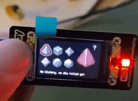](https://twitter.com/MagnusFex/status/1528439259979558914)

> I made a little Raspberry Pi Pico dice roller with Pimoroni’s Pico Display Pack, all written in Adafruit’s CircuitPython. These beautiful pixel art dice are made by [@LilMissSunBear](https://twitter.com/LilMissSunBear) - [Twitter](https://twitter.com/MagnusFex/status/1528439259979558914).

A company associated with the premiere of the new season of Stranger Things approached Guy Dupont and asked him to build a RP2040-Powered Stranger Things Telephone prop using a SparkFun Thing Plus RP2040 and CircuitPython - [hackster.io](https://www.hackster.io/news/guy-dupont-s-rp2040-powered-stranger-things-telephone-f7c5a3bf51f0) and [YouTube](https://youtu.be/cjzxD0_v9hM).

[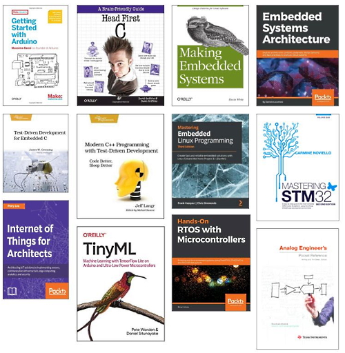](https://www.linkedin.com/feed/update/urn:li:activity:6925242924972568576/)

12 Books Recommendation for Embedded Systems Learners - [LinkedIn](https://www.linkedin.com/feed/update/urn:li:activity:6925242924972568576/).

[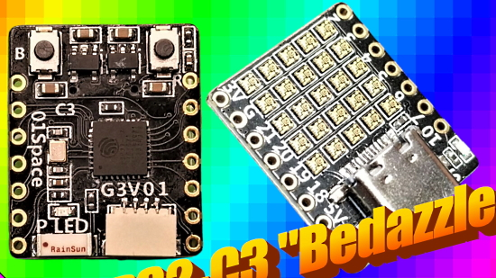](https://bigl.es/friday-fun-micro-weather-station/)

Making a micro weather station with the ESP32-CH34G-RGB ESP32-C3 board with LED matrix - [bigl.es](https://bigl.es/friday-fun-micro-weather-station/).

Creating a new MSA311 driver based on the existing MSA301 driver code in CircuitPython - [Twitter](https://twitter.com/bradanlane/status/1527334851745296386).

text - [site](url).

text - [site](url).

text - [site](url).

[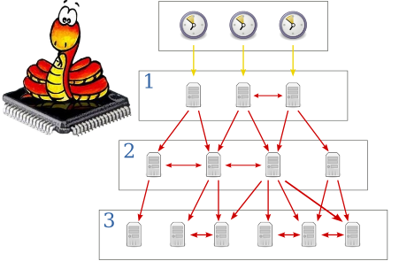](https://hackaday.com/2022/05/16/network-time-protocol-on-the-esp32/)

Syncing NTP on ESP32 with MicroPython - [Bhavesh Kakwani](https://bhave.sh/micropython-ntp/) and [Hackaday](https://hackaday.com/2022/05/16/network-time-protocol-on-the-esp32/).

text - [site](url).

Video: Inside the PyScript Source: Python in Your Browser - [YouTube](https://www.youtube.com/watch?v=SqNNLssFzm4) via [Twitter](https://twitter.com/paulweveritt/status/1526545919432433664).

[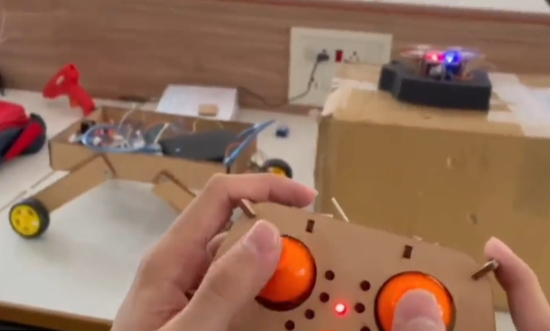](https://twitter.com/yesHeIsIronMan/status/1527740465059332096)

A space rover-drone-station concept, totally made with MicroPython - [Twitter](https://twitter.com/yesHeIsIronMan/status/1527740465059332096).

Two Great Ways to Control Electronic Projects with Python - [Medium](https://medium.com/@romillyc/two-great-ways-to-control-electronic-projects-with-python-4005dd6800ae) via LinkedIn.

[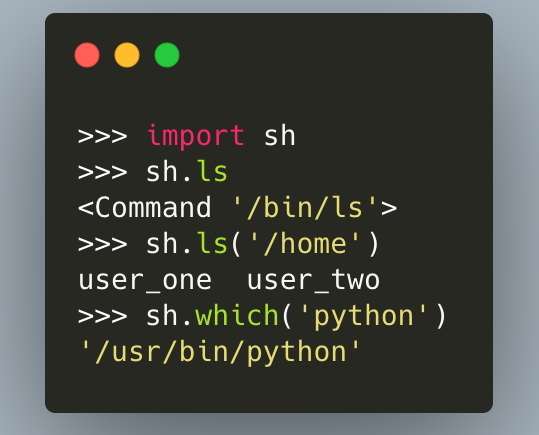](https://twitter.com/driscollis/status/1527662554352263169)

Have you tried out the `sh` Python package? sh is a full-fledged subprocess replacement for Python 2, Python 3, PyPy and PyPy3 that allows you to call any program as if it were a function - [Twitter](https://twitter.com/driscollis/status/1527662554352263169).

[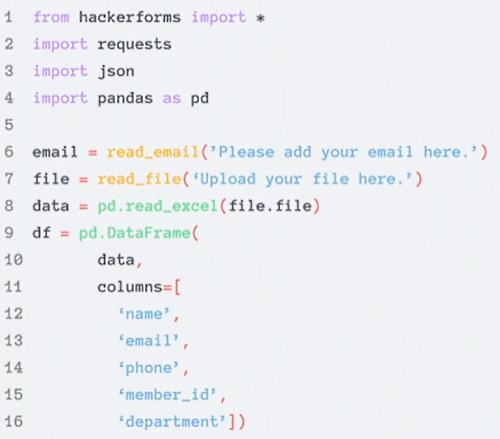](https://hackerforms.com/)

Hackerforms allows you to easily deploy interactive Python scripts. Create user interfaces straight from your Python code - no frontend work required.
Deploy instantly and share with anyone - [Hackerforms](https://hackerforms.com/).

[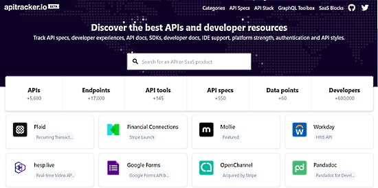](https://blog.adafruit.com/2022/05/19/apitracker-io-providing-all-the-information-on-apis-programming-apideck/)

apitracker.io – providing the information on APIs - [Adafruit Blog](https://blog.adafruit.com/2022/05/19/apitracker-io-providing-all-the-information-on-apis-programming-apideck/).

text - [site](url).

PyDev of the Week:

CircuitPython Weekly Meeting for 

**#ICYDNCI What was the most popular, most clicked link, in [last week's newsletter](https://link)? [title](url).**

## New Hardware

[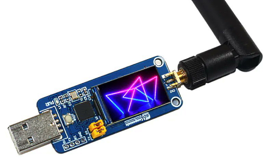](https://www.hackster.io/news/sb-components-rangepi-is-a-compact-display-equipped-micropython-powered-rp2040-lora-board-9e63043580dc)

SB Components' RangePi is a compact, display-equipped MicroPython-powered RP2040 LoRa board - [Hackster.io](https://www.hackster.io/news/sb-components-rangepi-is-a-compact-display-equipped-micropython-powered-rp2040-lora-board-9e63043580dc).

text - [site](url).

## New Boards Supported by CircuitPython

The number of supported microcontrollers and Single Board Computers (SBC) grows every week. This section outlines which boards have been included in CircuitPython or added to [CircuitPython.org](https://circuitpython.org/).

This week, there were (#/no) new boards added!

- [Board name](url)
- [Board name](url)
- [Board name](url)

*Note: For non-Adafruit boards, please use the support forums of the board manufacturer for assistance, as Adafruit does not have the hardware to assist in troubleshooting.*

Looking to add a new board to CircuitPython? It's highly encouraged! Adafruit has four guides to help you do so:

- [How to Add a New Board to CircuitPython](https://learn.adafruit.com/how-to-add-a-new-board-to-circuitpython/overview)
- [How to add a New Board to the circuitpython.org website](https://learn.adafruit.com/how-to-add-a-new-board-to-the-circuitpython-org-website)
- [Adding a Single Board Computer to PlatformDetect for Blinka](https://learn.adafruit.com/adding-a-single-board-computer-to-platformdetect-for-blinka)
- [Adding a Single Board Computer to Blinka](https://learn.adafruit.com/adding-a-single-board-computer-to-blinka)

## New Learn Guides!

There are no new Python on hardware learn guides this week!

## Updated Learn Guides!

[Welcome to CircuitPython: Library File Types and Frozen Libraries](https://learn.adafruit.com/welcome-to-circuitpython/library-file-types-and-frozen-libraries) from [Kattni]([url](https://learn.adafruit.com/users/kattni))

## CircuitPython Libraries!

CircuitPython support for hardware continues to grow. We are adding support for new sensors and breakouts all the time, as well as improving on the drivers we already have. As we add more libraries and update current ones, you can keep up with all the changes right here!

For the latest libraries, download the [Adafruit CircuitPython Library Bundle](https://circuitpython.org/libraries). For the latest community contributed libraries, download the [CircuitPython Community Bundle](https://github.com/adafruit/CircuitPython_Community_Bundle/releases).

If you'd like to contribute, CircuitPython libraries are a great place to start. Have an idea for a new driver? File an issue on [CircuitPython](https://github.com/adafruit/circuitpython/issues)! Have you written a library you'd like to make available? Submit it to the [CircuitPython Community Bundle](https://github.com/adafruit/CircuitPython_Community_Bundle). Interested in helping with current libraries? Check out the [CircuitPython.org Contributing page](https://circuitpython.org/contributing). We've included open pull requests and issues from the libraries, and details about repo-level issues that need to be addressed. We have a guide on [contributing to CircuitPython with Git and GitHub](https://learn.adafruit.com/contribute-to-circuitpython-with-git-and-github) if you need help getting started. You can also find us in the #circuitpython channels on the [Adafruit Discord](https://adafru.it/discord).

You can check out this [list of all the Adafruit CircuitPython libraries and drivers available](https://github.com/adafruit/Adafruit_CircuitPython_Bundle/blob/master/circuitpython_library_list.md). 

The current number of CircuitPython libraries is **357**!

**Updated Libraries!**

Here's this week's updated CircuitPython libraries:

 * [Adafruit_CircuitPython_DisplayIO_Layout](https://github.com/adafruit/Adafruit_CircuitPython_DisplayIO_Layout)
 * [Adafruit_CircuitPython_NTP](https://github.com/adafruit/Adafruit_CircuitPython_NTP)
 * [Adafruit_CircuitPython_HTTPServer](https://github.com/adafruit/Adafruit_CircuitPython_HTTPServer)
 * [Adafruit_CircuitPython_Display_Text](https://github.com/adafruit/Adafruit_CircuitPython_Display_Text)
 * [Adafruit_CircuitPython_RFM9x](https://github.com/adafruit/Adafruit_CircuitPython_RFM9x)
 * [Adafruit_CircuitPython_RSA](https://github.com/adafruit/Adafruit_CircuitPython_RSA)
 * [Adafruit_CircuitPython_VC0706](https://github.com/adafruit/Adafruit_CircuitPython_VC0706)
 * [Adafruit_CircuitPython_FONA](https://github.com/adafruit/Adafruit_CircuitPython_FONA)
 * [Adafruit_CircuitPython_BD3491FS](https://github.com/adafruit/Adafruit_CircuitPython_BD3491FS)
 * [Adafruit_Blinka_bleio](https://github.com/adafruit/Adafruit_Blinka_bleio)
 * [Adafruit_Blinka_Displayio](https://github.com/adafruit/Adafruit_Blinka_Displayio)
 * [CircuitPython_Community_Bundle](https://github.com/adafruit/CircuitPython_Community_Bundle)

## What’s the team up to this week?

What is the team up to this week? Let’s check in!

**Dan**

I released CircuitPython 7.3.0 release candidate builds 7.3.0-rc.0 and 7.3.0-rc.1, and perhaps by the time you read this CircuitPython 7.3.0 final will be out.

One bug I worked on for 7.3.0-rc.1 prevented allocating large blocks of RAM after significant imports. I thought it was going to be complicated to debug, but it turned out we had stopped doing automatic garbage collection we did after each import. The code had simply gotten lost during the MicroPython v1.18 merge.

**Kattni**

This week I published the [Library File Types and Frozen Libraries page](https://learn.adafruit.com/welcome-to-circuitpython/library-file-types-and-frozen-libraries) in the Welcome to CircuitPython guide Advanced Setup section. We are regularly getting a similar set of questions regarding the different library file types, what they mean, which one should be used, how to get past common issues, and more. This page has everything you need to know about .mpy files, .py files, and frozen libraries. If you've ever wondered how CircuitPython interacts with the different library types, check out the new guide page.

I also added a new section to the CircuitPython Libraries page in the Welcome guide titled [The Adafruit Learn Guide Project Bundle](https://learn.adafruit.com/welcome-to-circuitpython/circuitpython-libraries#the-adafruit-learn-guide-project-bundle-3118462-5) which explains the general idea behind the Project Bundler, how the downloaded zip is structured, and how to use it. It's linked in the Library File Types page where I explain how frozen libraries work with the Project Bundle.

Finally, I spent some time working with Tekktrik to teach him how to use Adabot. The next step will be to have him try to run an actual patch. We'll find out soon how it goes!

**Melissa**

This past week, I finished writing the [2.7" eInk Breakouts and Shields guide](https://learn.adafruit.com/adafruit-2-7-eink-display-breakouts-and-shields). I have also been going through the guide feedback on a number of guides that I had made major contributions to, but were under other peoples' names.

**Tim**

I completed a few remaining tweaks and much more thorough testing for my core PR to allow vectorio shapes to be hidden when their containing Group gets hidden. That was merged this week after testing and reviews were completed. I wrapped up some requested changes to some of the typing PRs opened during PyCon sprints and followed up with the author on the one that remains open. I also made some updates to Blinka_DisplayIO to add some of the newest functionality that was added to core displayio recently, accessing tile size properties on TileGrid, and updating the Bitmap object for a TileGrid. Lastly I tested and reviewed a PR to add a more advanced TabLayout example created by community member Paulsk.

**Scott**

This week I wrapped up switching the NTP library over to doing NTP over native sockets. Then I worked on adding `dotenv` support to CircuitPython as an alternative to secrets.py. `.env` files are simpler, pseudo-standard format for storing secrets. It has two main advantages: 1) it can work in CPython and 2) CircuitPython can easily load the file when the Python VM isn't running. Its first use will be storing WiFi credentials so CircuitPython can connect automatically, even when the VM isn't running.

**Liz**

This week I published the Wireless LED Maracas guide (https://learn.adafruit.com/wireless-led-maracas). It was a great project to follow-up the more complicated Laser Harp build. This coming week I'll be working on a wearable/conference badge using the tiny traffic light model that just came into the shop. I'll be using a QT Py ESP32-S2 with CircuitPython so that it can use light sleep to preserve battery life. I'll also be doing some more Fritzing work with Kattni's guidance. I really enjoy making Fritzing objects. They have a very similar vibe to working on a word puzzle.

In my down time, I've been playing with some Eurorack synth and CircuitPython projects. Most recently, I've been prototyping a sequencer that sends out 1V/oct. I've been referencing Thea Flower's "Designing Winterbloom's Big Honking Button" (https://blog.thea.codes/designing-big-honking-button/) blog post for the different circuits needed to communicate with Eurorack for gate in, gate out and 1V/oct. On the  CircuitPython side of things, the gates can be handled as digital inputs/outputs and I've had a lot of luck using the MCP4728 STEMMA board for 1V/oct.

## Upcoming events!

The next MicroPython Meetup in Melbourne will be on May 25th – [Meetup](https://www.meetup.com/MicroPython-Meetup/). See the [slides](https://docs.google.com/presentation/d/e/2PACX-1vSH2ri8JP3BZRWGeINlyxbzMH9kLQSgZS4iG5sa2CixJAtE7ymD9x0YgcUHC46T4-3dfQLJhfjSoE1M/pub?start=false&loop=false&delayms=3000&slide=id.p) of the May 4th meeting (rescheduled from April 27th - now up, thanks Matt).

PyCon Italia is the Italian conference on Python. Organized by Python Italia, it is one of the more important Python conferences in Europe. With over 700 attendees, the next edition will be June 2-5, 2022 - [Ticket Registration](https://pycon.it/en/tickets).

SciPy 2022, the 21st annual Scientific Computing with Python conference, will be held in Austin, Texas, USA from July 11-17, 2022. The annual SciPy Conference brings together attendees from industry, academia, and government to showcase their latest projects, learn from skilled users and developers, and collaborate on code development. The full program will consist of 2 days tutorials (July 11-12), 3 days of talks (July 13-15) and 2 days of developer sprints (July 16-17) - [SciPy 2022](https://www.scipy2022.scipy.org/).

EuroPython 2022 will be held on 11th-17th July 2022 and it will be both in person and virtual. The in-person conference will be held at [The Convention Centre](https://www.theccd.ie/) Dublin (The CCD) in Dublin, Ireland - [EuroPython 2022](https://ep2022.europython.eu/).

PyOhio is a non-profit annual Python community conference usually held in Columbus, OH. It is being held online starting Saturday, Jul 30, 2022. It is free to attend and welcomes anyone with an interest in Python. Content ranges from beginner to advanced and is intended to be relevant to all types of Python users: students, software professionals, scientists, hobbyists, and anyone looking to learn more - [PyOhio](https://www.pyohio.org/2022/).

**Send Your Events In**

As for other events, with the COVID pandemic, most in-person events are postponed or cancelled. If you know of virtual events or events that may occur in the future, please let us know on Twitter with hashtag #CircuitPython or email to cpnews(at)adafruit(dot)com.

## Latest releases

CircuitPython's stable release is [#.#.#](https://github.com/adafruit/circuitpython/releases/latest) and its unstable release is [#.#.#-##.#](https://github.com/adafruit/circuitpython/releases). New to CircuitPython? Start with our [Welcome to CircuitPython Guide](https://learn.adafruit.com/welcome-to-circuitpython).

[2022####](https://github.com/adafruit/Adafruit_CircuitPython_Bundle/releases/latest) is the latest CircuitPython library bundle.

[v#.#.#](https://micropython.org/download) is the latest MicroPython release. Documentation for it is [here](http://docs.micropython.org/en/latest/pyboard/).

[#.#.#](https://www.python.org/downloads/) is the latest Python release. The latest pre-release version is [#.#.#](https://www.python.org/download/pre-releases/).

[#,### Stars](https://github.com/adafruit/circuitpython/stargazers) Like CircuitPython? [Star it on GitHub!](https://github.com/adafruit/circuitpython)

## Call for help -- Translating CircuitPython is now easier than ever!

[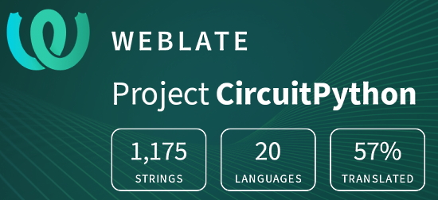](https://hosted.weblate.org/engage/circuitpython/)

One important feature of CircuitPython is translated control and error messages. With the help of fellow open source project [Weblate](https://weblate.org/), we're making it even easier to add or improve translations. 

Sign in with an existing account such as GitHub, Google or Facebook and start contributing through a simple web interface. No forks or pull requests needed! As always, if you run into trouble join us on [Discord](https://adafru.it/discord), we're here to help.

## jobs.adafruit.com - Find a dream job, find great candidates!

[jobs.adafruit.com](https://jobs.adafruit.com/) has returned and folks are posting their skills (including CircuitPython) and companies are looking for talented makers to join their companies - from Digi-Key, to Hackaday, Micro Center, Raspberry Pi and more.

**Job of the Week**

Custom Module for RP2040 CircuitPython Software Module - MeanStride Technology, Inc - [Adafruit Jobs Board](https://jobs.adafruit.com/job/custom-module-for-rp2040-circuitpython-software-module/).

## NUMBER thanks!

The Adafruit Discord community, where we do all our CircuitPython development in the open, reached over NUMBER humans - thank you!  Adafruit believes Discord offers a unique way for Python on hardware folks to connect. Join today at [https://adafru.it/discord](https://adafru.it/discord).

## ICYMI - In case you missed it

Python on hardware is the Adafruit Python video-newsletter-podcast! The news comes from the Python community, Discord, Adafruit communities and more and is broadcast on ASK an ENGINEER Wednesdays. The complete Python on Hardware weekly videocast [playlist is here](https://www.youtube.com/playlist?list=PLjF7R1fz_OOXRMjM7Sm0J2Xt6H81TdDev). The video podcast is on [iTunes](https://itunes.apple.com/us/podcast/python-on-hardware/id1451685192?mt=2), [YouTube](http://adafru.it/pohepisodes), [IGTV (Instagram TV](https://www.instagram.com/adafruit/channel/)), and [XML](https://itunes.apple.com/us/podcast/python-on-hardware/id1451685192?mt=2).

[The weekly community chat on Adafruit Discord server CircuitPython channel - Audio / Podcast edition](https://itunes.apple.com/us/podcast/circuitpython-weekly-meeting/id1451685016) - Audio from the Discord chat space for CircuitPython, meetings are usually Mondays at 2pm ET, this is the audio version on [iTunes](https://itunes.apple.com/us/podcast/circuitpython-weekly-meeting/id1451685016), Pocket Casts, [Spotify](https://adafru.it/spotify), and [XML feed](https://adafruit-podcasts.s3.amazonaws.com/circuitpython_weekly_meeting/audio-podcast.xml).

## Codecademy "Learn Hardware Programming with CircuitPython"

Codecademy, an online interactive learning platform used by more than 45 million people, has teamed up with Adafruit to create a coding course, “Learn Hardware Programming with CircuitPython”. The course is now available in the [Codecademy catalog](https://www.codecademy.com/learn/learn-circuitpython?utm_source=adafruit&utm_medium=partners&utm_campaign=circuitplayground&utm_content=pythononhardwarenewsletter).

## Contribute!

The CircuitPython Weekly Newsletter is a CircuitPython community-run newsletter emailed every Tuesday. The complete [archives are here](https://www.adafruitdaily.com/category/circuitpython/). It highlights the latest CircuitPython related news from around the web including Python and MicroPython developments. To contribute, edit next week's draft [on GitHub](https://github.com/adafruit/circuitpython-weekly-newsletter/tree/gh-pages/_drafts) and [submit a pull request](https://help.github.com/articles/editing-files-in-your-repository/) with the changes. You may also tag your information on Twitter with #CircuitPython. 

Join the Adafruit [Discord](https://adafru.it/discord) or [post to the forum](https://forums.adafruit.com/viewforum.php?f=60) if you have questions.

