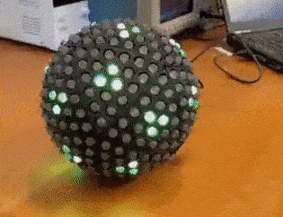
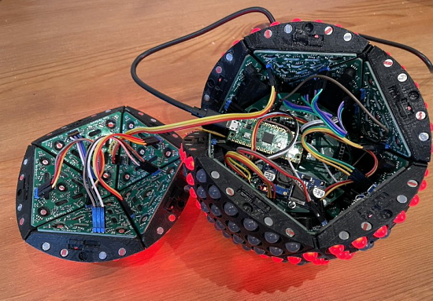
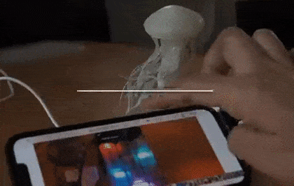
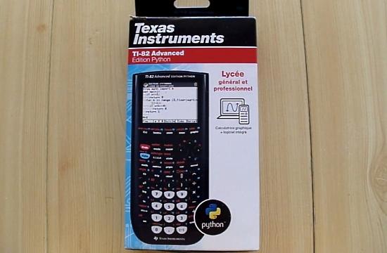
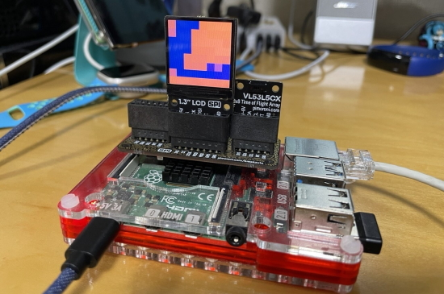
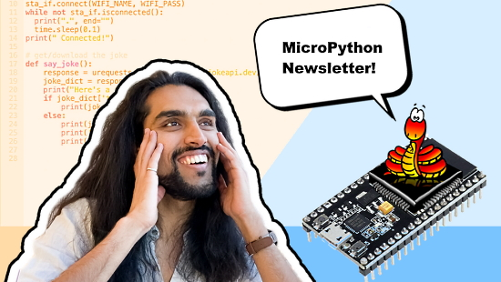
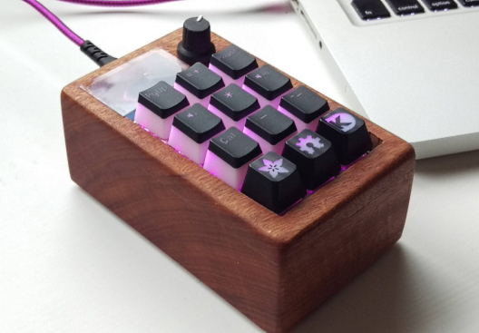
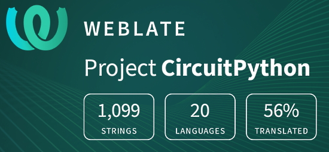

- [X] Kattni updates
- [ ] change date
- [ ] update title
- [ ] Feature story
- [ ] Update  for images
- [ ] Update ICYDNCI
- [ ] All images 550w max only
- [ ] Link "View this email in your browser."

News Sources

- [python.org](https://www.python.org/)
- [Python Insider - dev team blog](https://pythoninsider.blogspot.com/)
- [MicroPython Meetup Blog](https://melbournemicropythonmeetup.github.io/)
- [hackaday.io newest projects MicroPython](https://hackaday.io/projects?tag=micropython&sort=date) and [CircuitPython](https://hackaday.io/projects?tag=circuitpython&sort=date)
- [hackaday CircuitPython](https://hackaday.com/blog/?s=circuitpython) and [MicroPython](https://hackaday.com/blog/?s=micropython)
- [hackster.io CircuitPython](https://www.hackster.io/search?q=circuitpython&i=projects&sort_by=most_recent) and [MicroPython](https://www.hackster.io/search?q=micropython&i=projects&sort_by=most_recent)

View this email in your browser. **Warning: Flashing Imagery**

Welcome to the latest Python on Microcontrollers newsletter! Exciting news with the first alpha release of CircuitPython 8 out and some very special artwork has been designed and unveiled here first!

We're on [Discord](https://discord.gg/HYqvREz), [Twitter](https://twitter.com/search?q=circuitpython&src=typed_query&f=live), and for past newsletters - [view them all here](https://www.adafruitdaily.com/category/circuitpython/). If you're reading this on the web, [subscribe here](https://www.adafruitdaily.com/). Here's the news this week:

## CircuitPython 8.0.0 alpha 1 released!

[!CircuitPython 8.0.0 alpha 1](../assets/20220614/20220614cp8.jpg)](CircuitPython 8.0.0 alpha 1)

The CircuitPython teah has released CircuitPython 8.0.0-alpha.1, an alpha version for 8.0.0. It is relatively stable, but there will be further additions and fixes before final release. Note that major number changes, such as version 7 to version 8, may have application programming interface (API) changes that are incompatible with the previous major version - [GitHub](CircuitPython 8.0.0 alpha 1).

Notable changes to 8.0.0 since 7.3.0

- Added `TileGrid.contains()`.
- `AnalogIn` values are full range from 0 to 65535, instead of having zeros on low-order bits.
- `OneWire` is only in `onewireio`, and is no longer in `busio` or `bitbangio`.
- `gamepadshift` has been removed: use `keypad.ShiftRegisterKeys` instead.
- `dotenv` support: `os.getenv()` values can be set in the `.env` file.

## Exclusive! CircuitPython 8 Poster

This issue of the newsletter gives subscribers the first look at the official CircuitPython 8 poster! Designed in cooperation with {company}, it shows the CircuitPython togetherness that previous posters like 7 (MicroPython) and 6 (Nordic).

## PyLeap is Available in the Apple App Store

The PyLeap app is now available in the Apple App Store for iOS/iPadOS devices - [Adafruit Blog](https://blog.adafruit.com/2022/01/21/pyleap-is-available-in-the-app-store/).

Take complete projects from the Adafruit Learn System, and transfer them directly to a [Circuit Playground Bluefruit microcontroller board](https://www.adafruit.com/product/4333) without opening a code editor or connecting to a computer! PyLeap is Adafruit's app for iOS & iPadOS. It allows programmingm a Circuit Playground Bluefruit anywhere with various completed projects, including:

* Sending rainbows to your Circuit Playground Bluefruit
* Loading up sound files
* Using light and sound sensors

PyLeap is [available in the App Store](https://apps.apple.com/us/app/pyleap/id1582204203) today and more updates are on the way! Just make sure you have a [Circuit Playground Bluefruit](https://www.adafruit.com/product/4333) to use with it 🙂

Instructions for using the app with CPB are available in the [PyLeap Learn Guide](https://learn.adafruit.com/pyleap-app) – more documentation to come!

## PyOhio

PyOhio announced their talks for PyOhio 2022! PyOhio will be online July 30 with streaming talks and community discussion - [PyOhio](https://www.pyohio.org/2022/program/talks/) via [Twitter](https://twitter.com/PyOhio/status/1535273544694767617).

And note that CircuitPython team member Kattni will be giving a talk "Simplicity and Fun: Learning with CircuitPython" - [PyOhio](https://www.pyohio.org/2022/program/talks/simplicity-and-fun-learning-with-circuitpython).

## PSF Board Election Dates for 2022

Python Software Foundation Board elections are a chance for the community to help find the next batch of folks to steer the PSF. This year there are 4 seats open on the PSF board. You can see who is on the board currently [here](https://www.python.org/psf/records/board/history/). Nominations for new board members opened June 1st.

Timeline:

* Nominations are open, Wednesday, June 1st 12:00 PM Eastern
* Board Director Nomination cut-off: Wednesday, June 15, 2022 AoE
* Voter application cut-off date: Wednesday, June 15, 2022 AoE
* Announce candidates: Thursday, June 16th
* Voting start date: Monday, June 20, 2022 AoE
* Voting end date: Friday, June 30, 2022 AoE

Nominations should be made through [this form](https://www.python.org/nominations/2022-python-software-foundation-board/create/) (Note: you will need to sign into or create your python.org user account first). You can nominate yourself or someone else, but no one will be forced to run, so you may want to consider reaching out to someone before nominating them - [PSF](https://pyfound.blogspot.com/2022/06/psf-board-election-dates-for-2022.html).

## Python 3.11 Speedup Benchmarks

Last month Python 3.11 Beta 1 was released as their first preview of this major update to the Python programming language. Besides new language features and other improvements, Python 3.11 performance is looking fantastic with very nice performance uplift over prior Python 3 releases. Besides changes affecting the Python language itself, Python 3.11 has been landing performance work from the “Faster CPython Project” to speed-up the reference implementation. Python 3.11 is 10~60% faster than Python 3.10 according to the official figures and a 1.22x speed-up with their standard benchmark suite - [Adafruit Blog](https://blog.adafruit.com/2022/06/08/python-3-11-performance-benchmarks-are-looking-fantastic-python-phoronix/) and [Phoronix](https://www.phoronix.com/scan.php?page=article&item=python-311-benchmarks&num=1).

## This Week's Python Streams

Python on Hardware is all about building a cooperative ecosphere which allows contributions to be valued and to grow knowledge. Below are the streams within the last week focusing on the community.

### CircuitPython Deep Dive Stream

[This week](link), Tim streamed work on {subject}.

You can see the latest video and past videos on the Adafruit YouTube channel under the Deep Dive playlist - [YouTube](https://www.youtube.com/playlist?list=PLjF7R1fz_OOXBHlu9msoXq2jQN4JpCk8A).

### CircuitPython Parsec

John Park’s CircuitPython Parsec this week is on {subject} - [Adafruit Blog](link) and [YouTube](link).

Catch all the episodes in the [YouTube playlist](https://www.youtube.com/playlist?list=PLjF7R1fz_OOWFqZfqW9jlvQSIUmwn9lWr).

### The CircuitPython Show

The CircuitPython Show is an independent podcast, hosted by Paul Cutler, focusing on the people doing awesome things with CircuitPython. Each episode features Paul in conversation with a guest for a short interview – [CircuitPythonShow](https://circuitpythonshow.com/) and [Twitter](https://twitter.com/circuitpyshow).

The latest episode release Monday, June 13th features Anne Barela (*your editor*). Anne and Paul talk about Anne's books, the Python on Microcontrollers newsletter, retro tech, and more – [Show List](https://circuitpythonshow.com/episodes).

### TammyMakesThings is Streaming CircuitPython

Community member and CircuitPython contributor [Tammy Cravit](https://github.com/tammymakesthings) is streaming on Twitch. Her stream focuses on electronics, coding and making, with a focus on CircuitPython. The first few streams have been working on a [MacroPad](https://adafruit.com/product/5128)-based MIDI controller, and she's got lots of other project ideas in the works. An exact schedule for her streams is still being worked out, but she's targeting 2-3 streams per week. Check it out and follow now to be notified of future streams - [Twitch](https://twitch.tv/tammymakesthings).

## Project of the Week: An RGB LED Ball

Tom Verbeure demonstrates an RGB LED ball built with 3D printing and custom circuit boards. It all runs off a Raspberry Pi Pico programmed in MicroPython - [Twitter](https://twitter.com/tom_verbeure/status/1536127568931217408) and [GitHub](https://gist.github.com/tomverbeure/fca5b36b6f8f5b352b92871f57a3c8cb).

## News from around the web!

A CircuitPython-powered Sound Visualizer Jellyfish - [Twitter](https://twitter.com/AoyamaProd/status/1534877640188121090).

JCPM macro pad experimentation with a Raspberry Pi RP2040 on a SparkFun Pro Micro board and CircuitPython - [Twitter](https://twitter.com/JeremySCook/status/1536320438296580100).

> "Phil found some old bust Valves and had a wee break from OOP to make a CircuitPython RGB led with a Pimoroni Tiny2040 + 1 button & 1 slide pot for a fun controllable light" - [Twitter](https://twitter.com/digitalMakerCIC/status/1535012563091611664).

A video and discussion of the TI-82 Advanced Edition Python calculator (which runs CircuitPython) - [YouTube](https://www.youtube.com/watch?v=7LrC9NfO74U) and discussion - [TI Planet](https://tiplanet.org/forum/viewtopic.php?f=41&t=24977) (French).

GitHub user kkehe has designed the mintyPico, a gaming machine built into an Altoids Smalls tin (very small). It’s based on a Raspberry Pi Pico processor and a SH1106 display. The code is written in MicroPython. - [Adafruit Blog](https://blog.adafruit.com/2022/06/08/playing-arcade-games-on-a-system-inside-a-tiny-mint-tin-raspberrypipico-gaming/), [YouTube](https://youtu.be/b9Obk1vu7JE), [GitHub](https://github.com/kkehe/PicoAltoids) and [Hackaday](https://hackaday.com/2022/06/07/a-breath-of-fresh-air-for-some-arcade-classics/).

text - [site](url).

Run a RV3028 RTC module with CircuitPython - [Akii Diary](https://akkiesoft.hatenablog.jp/entry/20220611/1654879661).

Bhavesh Kakwani is publishing a MicroPython Newsletter which has just reached 50 subscribers - check it out - [Bhavesh Kakwani](https://bhave.sh/) via [Twitter](https://twitter.com/beyond_sol/status/1534966009853005838).

A wooden programmable macropad running CircuitPython - [Adafruit Blog](https://blog.adafruit.com/2022/06/09/a-wooden-programmable-macropad-circuitpython-hackadayio/) and [hackaday.io](https://hackaday.io/project/185557-wooden-macropad).

text - [site](url).

Pimoroni has released new builds of PicoGraphics - a MicroPython library for displays and the RP2040 chip - [Twitter Thread](https://twitter.com/Gadgetoid/status/1534570770051092482).

Talk Announced: Try Something Different: Explore MicroPython! (a rough guide for newcomers), by Andy Piper, at [EuroPython 2022](https://ep2022.europython.eu/) - [EuroPython](https://ep2022.europython.eu/session/try-something-different-explore-micropython-a-rough-guide-for-newcomers).

text - [site](url).

text - [site](url).

text - [site](url).

text - [site](url).

text - [site](url).

text - [site](url).

text - [site](url).

text - [site](url).

text - [site](url).

PyDev of the Week:

CircuitPython Weekly Meeting for 

**#ICYDNCI What was the most popular, most clicked link, in [last week's newsletter](https://link)? [title](url).**

## Coming Soon

Announced on June 4th 2022, WiFi Sheep shares some thoughts on the new Orange Pi 800 all in one ARM Raspberry Pi 400 clone computer system - [YouTube](https://youtu.be/7yIeNBw0XnQ). Also details in an article on [CNX Software](https://www.cnx-software.com/2022/06/04/orange-pi-800-raspberry-pi-400-keyboard-pc-alternative-rockchip-rk3399/).

text - [site](url).

## New Boards Supported by CircuitPython

The number of supported microcontrollers and Single Board Computers (SBC) grows every week. This section outlines which boards have been included in CircuitPython or added to [CircuitPython.org](https://circuitpython.org/).

This week, there were (#/no) new boards added!

- [Board name](url)
- [Board name](url)
- [Board name](url)

*Note: For non-Adafruit boards, please use the support forums of the board manufacturer for assistance, as Adafruit does not have the hardware to assist in troubleshooting.*

Looking to add a new board to CircuitPython? It's highly encouraged! Adafruit has four guides to help you do so:

- [How to Add a New Board to CircuitPython](https://learn.adafruit.com/how-to-add-a-new-board-to-circuitpython/overview)
- [How to add a New Board to the circuitpython.org website](https://learn.adafruit.com/how-to-add-a-new-board-to-the-circuitpython-org-website)
- [Adding a Single Board Computer to PlatformDetect for Blinka](https://learn.adafruit.com/adding-a-single-board-computer-to-platformdetect-for-blinka)
- [Adding a Single Board Computer to Blinka](https://learn.adafruit.com/adding-a-single-board-computer-to-blinka)

## New Learn Guides!

There are no new Python-related Learn Guides this week!

## CircuitPython Libraries!

CircuitPython support for hardware continues to grow. We are adding support for new sensors and breakouts all the time, as well as improving on the drivers we already have. As we add more libraries and update current ones, you can keep up with all the changes right here!

For the latest libraries, download the [Adafruit CircuitPython Library Bundle](https://circuitpython.org/libraries). For the latest community contributed libraries, download the [CircuitPython Community Bundle](https://github.com/adafruit/CircuitPython_Community_Bundle/releases).

If you'd like to contribute, CircuitPython libraries are a great place to start. Have an idea for a new driver? File an issue on [CircuitPython](https://github.com/adafruit/circuitpython/issues)! Have you written a library you'd like to make available? Submit it to the [CircuitPython Community Bundle](https://github.com/adafruit/CircuitPython_Community_Bundle). Interested in helping with current libraries? Check out the [CircuitPython.org Contributing page](https://circuitpython.org/contributing). We've included open pull requests and issues from the libraries, and details about repo-level issues that need to be addressed. We have a guide on [contributing to CircuitPython with Git and GitHub](https://learn.adafruit.com/contribute-to-circuitpython-with-git-and-github) if you need help getting started. You can also find us in the #circuitpython channels on the [Adafruit Discord](https://adafru.it/discord).

You can check out this [list of all the Adafruit CircuitPython libraries and drivers available](https://github.com/adafruit/Adafruit_CircuitPython_Bundle/blob/master/circuitpython_library_list.md). 

The current number of CircuitPython libraries is **357**!

**Updated Libraries!**

This week there were far too many updated CircuitPython libraries to include here! Keep an eye out next week for more!

## What’s the team up to this week?

What is the team up to this week? Let’s check in!

**Dan**

I fixed an ESP32SPI library problem that showed up when using an HHTP server that sent chunked responses. I also cleaned up the ESP32SPI `socket` class and removed non-standard methods. I've been working over the past two weeks on debugging more network issues that show up most prominently on the MatrixPortal.

I was able to speed up a number of CircuitPython builds by tuning the parameters for LTO optimization.

I released CircuitPython 8.0.0-alpha.1, the first published release for 8.0.0.

**Kattni**

I published the QT Py ESP32 Pico guide last week. It doesn't have CircuitPython support, but it supports Arduino, MicroPython, and Wippersnapper. It's a cute little wifi board, and if you picked one up, check out the guide for everything you need to know about it.

I did the final testing on PyLeap, and greenlit Trevor doing the release of 2.0. It's now live!

I'm working on a new guide that covers how to create, modify, and enhance your GitHub profile. GitHub has a way to create a specific repository, add a README.md file, and it renders on your GitHub main page when folks view it. This guide will explain all of that, and introduce a number of tools to make the process simple, and help you make your profile memorable and representative of you. Keep an eye out for it, and learn how to make your GitHub profile super snazzy!

**Melissa**

This past week I revisited the MIPI drivers and touchscreens and made some more progress. I tried combining the MIPI driver and the touch screen fixes the touch screen issues I was experiencing unfortunately it didn't. I've enlisted the help of the original author of the MIPI and the current FrameBuffer drivers and he is finding stuff. Once that's taken care of, I will likely go through and create and new Device Tree Overlays for each of our products that combines both the touch and MIPI drivers. 

I also played a bunch with the TSC2007 controller to try and get it operating with a kernel driver, but after having little success I decided to try using it with the simple test examples in the Guide and found it failing those. I have a new display, which was the issue, and I will continue playing with that for a bit.

**Tim**

This week I worked on modifying a slider puzzle example that I created for the PyGamer a while ago to work on a PyPortal with the touch screen instead, using the new `TileGrid.contains()` functionality recently added to the core. I made some usability improvements on circuitpython.org by adding autofocus on the search box for the downloads page, as well as a new note on the Picosystem page about how to get into bootloader. 

I'm also starting to create examples for the core module `bitmaptools`, I've created some rotation examples and experimented with scale using `bitmaptools.rotoazoom()` function. Lastly I did some testing on changes to the esp32_spi library with various different project codes.

**Scott**

This week I finished up optimizing translate function code size for non-LTO builds. The last change I did was to speed up the build process. In the end, it saved around 30 kilobytes on the ESP builds.

My main work was continuing to work on making CircuitPython auto-connect to WiFi when credentials are stored in the .env file. The first thing I've been reworking is showing connection status in the title bar of the console. With displayio, it'll change the top line to be the "title". I've also added the starting code to only reset WiFi when the user code has started it.

## Upcoming events!

The next MicroPython Meetup in Melbourne will be on June 22nd – [Meetup](https://www.meetup.com/MicroPython-Meetup/). See the [slides](https://docs.google.com/presentation/d/e/2PACX-1vROLMO--AXdxJTwvsxFbZqIGFAHVbm9YF_AJdVLdHqrjB0C7FJEgNm5QS27PKLvQSO0y3Do74Wlsn2F/pub?start=false&loop=false&delayms=3000&slide=id.p) of the May 25th meeting.

SciPy 2022, the 21st annual Scientific Computing with Python conference, will be held in Austin, Texas, USA from July 11-17, 2022. The annual SciPy Conference brings together attendees from industry, academia, and government to showcase their latest projects, learn from skilled users and developers, and collaborate on code development. The full program will consist of 2 days tutorials (July 11-12), 3 days of talks (July 13-15) and 2 days of developer sprints (July 16-17) - [SciPy 2022](https://www.scipy2022.scipy.org/).

EuroPython 2022 will be held on 11th-17th July 2022 and it will be both in person and virtual. The in-person conference will be held at [The Convention Centre](https://www.theccd.ie/) Dublin (The CCD) in Dublin, Ireland - [EuroPython 2022](https://ep2022.europython.eu/).

PyOhio is a non-profit annual Python community conference usually held in Columbus, OH. It is being held online starting Saturday, Jul 30, 2022. It is free to attend and welcomes anyone with an interest in Python. Content ranges from beginner to advanced and is intended to be relevant to all types of Python users: students, software professionals, scientists, hobbyists, and anyone looking to learn more - [PyOhio](https://www.pyohio.org/2022/).

**Send Your Events In**

As for other events, with the COVID pandemic, most in-person events are postponed or cancelled. If you know of virtual events or events that may occur in the future, please let us know on Twitter with hashtag #CircuitPython or email to cpnews(at)adafruit(dot)com.

## Latest releases

CircuitPython's stable release is [#.#.#](https://github.com/adafruit/circuitpython/releases/latest) and its unstable release is [#.#.#-##.#](https://github.com/adafruit/circuitpython/releases). New to CircuitPython? Start with our [Welcome to CircuitPython Guide](https://learn.adafruit.com/welcome-to-circuitpython).

[2022####](https://github.com/adafruit/Adafruit_CircuitPython_Bundle/releases/latest) is the latest CircuitPython library bundle.

[v#.#.#](https://micropython.org/download) is the latest MicroPython release. Documentation for it is [here](http://docs.micropython.org/en/latest/pyboard/).

[#.#.#](https://www.python.org/downloads/) is the latest Python release. The latest pre-release version is [#.#.#](https://www.python.org/download/pre-releases/).

[#,### Stars](https://github.com/adafruit/circuitpython/stargazers) Like CircuitPython? [Star it on GitHub!](https://github.com/adafruit/circuitpython)

## Call for help -- Translating CircuitPython is now easier than ever!

One important feature of CircuitPython is translated control and error messages. With the help of fellow open source project [Weblate](https://weblate.org/), we're making it even easier to add or improve translations. 

Sign in with an existing account such as GitHub, Google or Facebook and start contributing through a simple web interface. No forks or pull requests needed! As always, if you run into trouble join us on [Discord](https://adafru.it/discord), we're here to help.

## jobs.adafruit.com - Find a dream job, find great candidates!

[jobs.adafruit.com](https://jobs.adafruit.com/) has returned and folks are posting their skills (including CircuitPython) and companies are looking for talented makers to join their companies - from Digi-Key, to Hackaday, Micro Center, Raspberry Pi and more.

**Job of the Week**

Engineering Laboratory Technician - Litegear - [Adafruit Jobs Board](https://jobs.adafruit.com/job/engineering-laboratory-technician/).

## NUMBER thanks!

The Adafruit Discord community, where we do all our CircuitPython development in the open, reached over NUMBER humans - thank you!  Adafruit believes Discord offers a unique way for Python on hardware folks to connect. Join today at [https://adafru.it/discord](https://adafru.it/discord).

## ICYMI - In case you missed it

Python on hardware is the Adafruit Python video-newsletter-podcast! The news comes from the Python community, Discord, Adafruit communities and more and is broadcast on ASK an ENGINEER Wednesdays. The complete Python on Hardware weekly videocast [playlist is here](https://www.youtube.com/playlist?list=PLjF7R1fz_OOXRMjM7Sm0J2Xt6H81TdDev). The video podcast is on [iTunes](https://itunes.apple.com/us/podcast/python-on-hardware/id1451685192?mt=2), [YouTube](http://adafru.it/pohepisodes), [IGTV (Instagram TV](https://www.instagram.com/adafruit/channel/)), and [XML](https://itunes.apple.com/us/podcast/python-on-hardware/id1451685192?mt=2).

[The weekly community chat on Adafruit Discord server CircuitPython channel - Audio / Podcast edition](https://itunes.apple.com/us/podcast/circuitpython-weekly-meeting/id1451685016) - Audio from the Discord chat space for CircuitPython, meetings are usually Mondays at 2pm ET, this is the audio version on [iTunes](https://itunes.apple.com/us/podcast/circuitpython-weekly-meeting/id1451685016), Pocket Casts, [Spotify](https://adafru.it/spotify), and [XML feed](https://adafruit-podcasts.s3.amazonaws.com/circuitpython_weekly_meeting/audio-podcast.xml).

## Codecademy "Learn Hardware Programming with CircuitPython"

Codecademy, an online interactive learning platform used by more than 45 million people, has teamed up with Adafruit to create a coding course, “Learn Hardware Programming with CircuitPython”. The course is now available in the [Codecademy catalog](https://www.codecademy.com/learn/learn-circuitpython?utm_source=adafruit&utm_medium=partners&utm_campaign=circuitplayground&utm_content=pythononhardwarenewsletter).

## Contribute!

The CircuitPython Weekly Newsletter is a CircuitPython community-run newsletter emailed every Tuesday. The complete [archives are here](https://www.adafruitdaily.com/category/circuitpython/). It highlights the latest CircuitPython related news from around the web including Python and MicroPython developments. To contribute, edit next week's draft [on GitHub](https://github.com/adafruit/circuitpython-weekly-newsletter/tree/gh-pages/_drafts) and [submit a pull request](https://help.github.com/articles/editing-files-in-your-repository/) with the changes. You may also tag your information on Twitter with #CircuitPython. 

Join the Adafruit [Discord](https://adafru.it/discord) or [post to the forum](https://forums.adafruit.com/viewforum.php?f=60) if you have questions.
