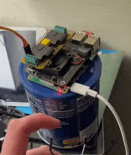
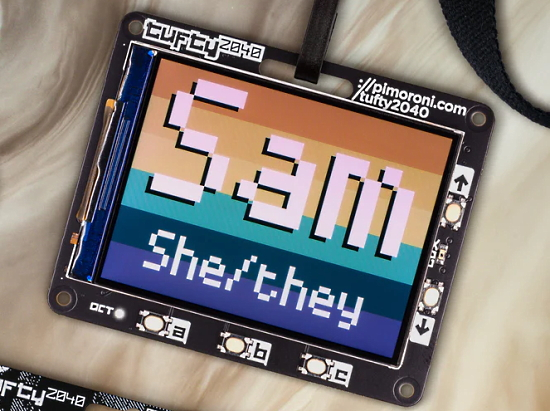
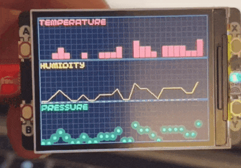
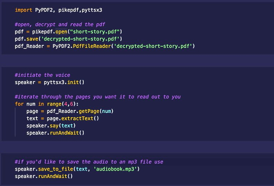
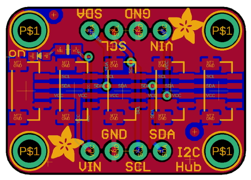
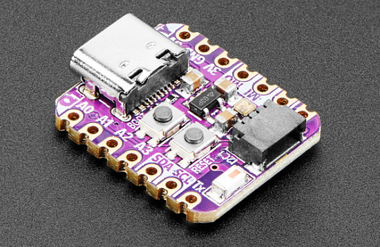
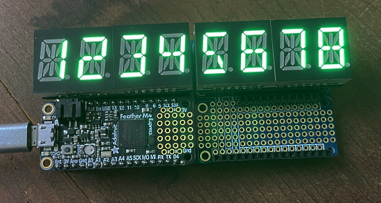
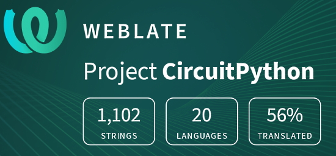

- [X] Kattni updates
- [ ] change date
- [ ] update title
- [ ] Feature story
- [ ] Update  for images
- [ ] Update ICYDNCI
- [ ] All images 550w max only
- [ ] Link "View this email in your browser."

News Sources

- [python.org](https://www.python.org/)
- [Python Insider - dev team blog](https://pythoninsider.blogspot.com/)
- [MicroPython Meetup Blog](https://melbournemicropythonmeetup.github.io/)
- [hackaday.io newest projects MicroPython](https://hackaday.io/projects?tag=micropython&sort=date) and [CircuitPython](https://hackaday.io/projects?tag=circuitpython&sort=date)
- [hackaday CircuitPython](https://hackaday.com/blog/?s=circuitpython) and [MicroPython](https://hackaday.com/blog/?s=micropython)
- [hackster.io CircuitPython](https://www.hackster.io/search?q=circuitpython&i=projects&sort_by=most_recent) and [MicroPython](https://www.hackster.io/search?q=micropython&i=projects&sort_by=most_recent)

View this email in your browser. **Warning: Flashing Imagery**

Welcome to the latest Python on Microcontrollers newsletter! 

We're on [Discord](https://discord.gg/HYqvREz), [Twitter](https://twitter.com/search?q=circuitpython&src=typed_query&f=live), and for past newsletters - [view them all here](https://www.adafruitdaily.com/category/circuitpython/). If you're reading this on the web, [subscribe here](https://www.adafruitdaily.com/). Here's the news this week:

## MicroPython 1.19 Released

[MicroPython](https://www.micropython.org/) v1.19 was just released! The release has seen a big change to the format of MicroPython's .mpy files. These files - which contain precompiled bytecode - now contain mostly static data which is ready to execute without any changes (previously a lot of linking steps were required when importing .mpy files). This simplifies things and improves import speed, and most importantly will soon allow you to easily "freeze" precompiled bytecode into a linear filesystem, without needing to rebuild the main firmware. This dynamic freezing feature will be available in a future release.

There are many other enhancements, fixes and additions in v1.19, including a new port to Renesas RA microcontrollers. One neat addition is the ability to customise the REPL prompt (the >>> part) by setting sys.ps1 (and sys.ps2) to whatever string you like. This can be very useful to distinguish different boards, by making sys.ps1 unique on each of them. For example "D2> " on a PYBD-SF2, or "RP> " on a RP2040-based board - [Release Notes](https://github.com/micropython/micropython/releases/tag/v1.19), [Changelog](https://micropython.org/resources/micropython-ChangeLog.txt), [Forum Post](https://forum.micropython.org/viewtopic.php?t=12557&p=68013#p68013) and [Downloads](https://micropython.org/download).

## Feature

text - [site](url).

## GitHub CEO Discusses Big Changes for Developers

GitHub CEO [Thomas Dohmke](https://twitter.com/ashtom) spoke at [WeAreDevelopers](https://www.wearedevelopers.com/) recently and shared his thoughts on the big changes ahead for developers - [Twitter Thread](https://twitter.com/github/status/1537148403121004549). 

Some of the points:

* “There will be greater change in the next 5 years than in the last 40. We are entering a fundamental transformation of software development as we know it…and I think it will make us all happier.”
* “Whether it’s the AI pair programmer…or the readily available Codespaces for a project that you want to contribute back to -- all these things will help you with the things that you don’t want to do, so you can spend more time enjoying the things that you do.”
* “In fact, in files where Copilot is enabled, we are already seeing nearly 40% of the code being suggested by Copilot. In five years, I predict that number will be 80%.”
* “I think the shift to the cloud will happen at such a rapid rate, that in just a few years I predict there will be no more code on your local computer.”

## Feature

text - [site](url).

## This Week's Python Streams

Python on Hardware is all about building a cooperative ecosphere which allows contributions to be valued and to grow knowledge. Below are the streams within the last week focusing on the community.

### CircuitPython Deep Dive Stream

[This week](https://youtu.be/q5NhB3pe2pM), Tim streamed work playing with the new web workflow.

You can see the latest video and past videos on the Adafruit YouTube channel under the Deep Dive playlist - [YouTube](https://www.youtube.com/playlist?list=PLjF7R1fz_OOXBHlu9msoXq2jQN4JpCk8A).

### CircuitPython Parsec

John Park’s CircuitPython Parsec this week is on {subject} - [Adafruit Blog](link) and [YouTube](link).

Catch all the episodes in the [YouTube playlist](https://www.youtube.com/playlist?list=PLjF7R1fz_OOWFqZfqW9jlvQSIUmwn9lWr).

### The CircuitPython Show

The CircuitPython Show is an independent podcast, hosted by Paul Cutler, focusing on the people doing awesome things with CircuitPython. Each episode features Paul in conversation with a guest for a short interview – [CircuitPythonShow](https://circuitpythonshow.com/) and [Twitter](https://twitter.com/circuitpyshow).

The podcast is off this week. It featured Anne Barela last week.  Guy Dupont is the guest on the next episode, coming June 27th – [Show List](https://circuitpythonshow.com/episodes/all).

### TammyMakesThings is Streaming CircuitPython

Community member and CircuitPython contributor [Tammy Cravit](https://github.com/tammymakesthings) is streaming on Twitch. Her stream focuses on electronics, coding and making, with a focus on CircuitPython. The first few streams have been working on a [MacroPad](https://adafruit.com/product/5128)-based MIDI controller, and she's got lots of other project ideas in the works. An exact schedule for her streams is still being worked out, but she's targeting 2-3 streams per week. Check it out and follow now to be notified of future streams - [Twitch](https://twitch.tv/tammymakesthings).

## Project of the Week: The Cube of Rainbow Torment

Tod Kurt makes an [inexpensive](https://www.amazon.com/dp/B081BCBQ6B), blinky colorful RGB LED cube - [Twitter](https://twitter.com/todbot/status/1536870075621289984).

> The code is in CircuitPython and it's just barely fast enough to control the 64 * 6 RGB LEDs that make up the cube. The code running above is taken straight out of the [Adafruit LED Animations Learn Guide](https://learn.adafruit.com/circuitpython-led-animations/rainbows).

## News from around the web!

The comfortable, custom PicoSplit keyboard packs two Raspberry Pi Picos and CircuitPython firmware - [Hackster.io](https://www.hackster.io/news/the-comfortable-custom-picosplit-packs-two-raspberry-pi-picos-and-a-circuitpython-firmware-fa3f00324cf2) via [Twitter](https://twitter.com/Hacksterio/status/1537464541235249152).

> Soon my dog will be talking by hitting his paw on a capacitive button... I hope lol. Thanks to a Raspberry Pi 4 and CircuitPython - [Twitter](https://twitter.com/kritch83/status/1537868565797294080).

Tufty 2040 is a hackable, programmable badge with 2.4" (320 x 240) TFT LCD colour display, powered by Raspberry Pi RP2040 with MicroPython (and planned CircuitPython) support - [Pimoroni](https://shop.pimoroni.com/products/tufty-2040).

RP2040 Dev Board is an open-hardware development board for the RP2040, designed to be an enhanced version of the Pico. MicroPython and CircuitPython compatible - [Tindie](https://www.tindie.com/products/breadstick/rp2040-dev-board/) and [GitHub](https://github.com/mrangen/RP2040-Dev-Board).

A tiny dashboard using a Raspberry Pi Pico and MicroPython, it can present bar, line and point charts and resize, scale and update live data - [Twitter](https://twitter.com/kevsmac/status/1537189198213459969).

text - [site](url).

text - [site](url).

text - [site](url).

text - [site](url).

text - [site](url).

text - [site](url).

text - [site](url).

text - [site](url).

text - [site](url).

text - [site](url).

text - [site](url).

text - [site](url).

5 Levels of Handling Date and Time in Python - [Medium](https://medium.com/techtofreedom/5-levels-of-handling-date-and-time-in-python-46b601e47f65).

The Python package pyttsx3 converts text to speech to turn a written book into an audiobook in a few lines of code - [Twitter Thread](https://twitter.com/marlene_zw/status/1537447278163570690).

text - [site](url).

PyDev of the Week:

CircuitPython Weekly Meeting for 

**#ICYDNCI What was the most popular, most clicked link, in [last week's newsletter](https://link)? [title](url).**

## Coming Soon

Adafruit STEMMA QT / qwiic hub - [Twitter](https://twitter.com/adafruit/status/1536745853301534720).

> We had a request on the forum for a vertical-JST-SH I2C hub. most of our boards have two ports for chaining I2C but there could be a good reason for wanting a star-topology as well, for example reducing voltage droop or to fit in a small enclosure.

text - [site](url).

## New Boards Supported by CircuitPython

The number of supported microcontrollers and Single Board Computers (SBC) grows every week. This section outlines which boards have been included in CircuitPython or added to [CircuitPython.org](https://circuitpython.org/).

This week, there were (#/no) new boards added!

- [Board name](url)
- [Board name](url)
- [Board name](url)

*Note: For non-Adafruit boards, please use the support forums of the board manufacturer for assistance, as Adafruit does not have the hardware to assist in troubleshooting.*

Looking to add a new board to CircuitPython? It's highly encouraged! Adafruit has four guides to help you do so:

- [How to Add a New Board to CircuitPython](https://learn.adafruit.com/how-to-add-a-new-board-to-circuitpython/overview)
- [How to add a New Board to the circuitpython.org website](https://learn.adafruit.com/how-to-add-a-new-board-to-the-circuitpython-org-website)
- [Adding a Single Board Computer to PlatformDetect for Blinka](https://learn.adafruit.com/adding-a-single-board-computer-to-platformdetect-for-blinka)
- [Adding a Single Board Computer to Blinka](https://learn.adafruit.com/adding-a-single-board-computer-to-blinka)

## New Learn Guides!

[Adafruit QT Py ESP32-S3](https://learn.adafruit.com/adafruit-qt-py-esp32-s3) from [Liz Clark](https://learn.adafruit.com/users/BlitzCityDIY)

## CircuitPython Libraries!

CircuitPython support for hardware continues to grow. We are adding support for new sensors and breakouts all the time, as well as improving on the drivers we already have. As we add more libraries and update current ones, you can keep up with all the changes right here!

For the latest libraries, download the [Adafruit CircuitPython Library Bundle](https://circuitpython.org/libraries). For the latest community contributed libraries, download the [CircuitPython Community Bundle](https://github.com/adafruit/CircuitPython_Community_Bundle/releases).

If you'd like to contribute, CircuitPython libraries are a great place to start. Have an idea for a new driver? File an issue on [CircuitPython](https://github.com/adafruit/circuitpython/issues)! Have you written a library you'd like to make available? Submit it to the [CircuitPython Community Bundle](https://github.com/adafruit/CircuitPython_Community_Bundle). Interested in helping with current libraries? Check out the [CircuitPython.org Contributing page](https://circuitpython.org/contributing). We've included open pull requests and issues from the libraries, and details about repo-level issues that need to be addressed. We have a guide on [contributing to CircuitPython with Git and GitHub](https://learn.adafruit.com/contribute-to-circuitpython-with-git-and-github) if you need help getting started. You can also find us in the #circuitpython channels on the [Adafruit Discord](https://adafru.it/discord).

You can check out this [list of all the Adafruit CircuitPython libraries and drivers available](https://github.com/adafruit/Adafruit_CircuitPython_Bundle/blob/master/circuitpython_library_list.md). 

The current number of CircuitPython libraries is **357**!

**New Libraries!**

Here's this week's new CircuitPython libraries:

 * [Adafruit_CircuitPython_BLE_File_Transfer](https://github.com/adafruit/Adafruit_CircuitPython_BLE_File_Transfer)

**Updated Libraries!**

Here's this week's updated CircuitPython libraries:

 * [Adafruit_CircuitPython_asyncio](https://github.com/adafruit/Adafruit_CircuitPython_asyncio)
 * [Adafruit_CircuitPython_OneWire](https://github.com/adafruit/Adafruit_CircuitPython_OneWire)
 * [Adafruit_CircuitPython_seesaw](https://github.com/adafruit/Adafruit_CircuitPython_seesaw)
 * [Adafruit_CircuitPython_AzureIoT](https://github.com/adafruit/Adafruit_CircuitPython_AzureIoT)
 * [Adafruit_CircuitPython_PCF8563](https://github.com/adafruit/Adafruit_CircuitPython_PCF8563)
 * [Adafruit_CircuitPython_PCF8523](https://github.com/adafruit/Adafruit_CircuitPython_PCF8523)
 * [Adafruit_CircuitPython_DisplayIO_Layout](https://github.com/adafruit/Adafruit_CircuitPython_DisplayIO_Layout)
 * [Adafruit_CircuitPython_VL53L4CD](https://github.com/adafruit/Adafruit_CircuitPython_VL53L4CD)
 * [Adafruit_CircuitPython_DS1307](https://github.com/adafruit/Adafruit_CircuitPython_DS1307)
 * [Adafruit_Blinka](https://github.com/adafruit/Adafruit_Blinka)
 * [CircuitPython_Community_Bundle](https://github.com/adafruit/CircuitPython_Community_Bundle)

## What’s the team up to this week?

What is the team up to this week? Let’s check in!

**Dan**

I have been working for a couple of weeks on CircuitPython hangs that occur on the MatrixPortal when the matrix is in use and there is network activity. I may have found the problem. Updating the RGB matrix is a CPU-intensive activity that runs as a high-priority interrupt routine. the bidirectional SPI startup for each communication with the ESP32 co-processor was not atomic, and I believe a rare but possible delay between starting receive and transmit caused the problem. Making the startups be a single atomic operation seems to fix things.

I also fixed a second bug in the ESP32SPI Python library; my initial fix was not good enough.

**Kattni**

This week I've been working on a guide walking you through how to make a GitHub profile that is both memorable and representative of you. This guide turned out to be a bit beefier than expected, but so far I'm really happy with the content. The last step is covering a number of tools to help you create beautiful content in various ways. I'll be updating my profile to show these tools in action. If you're interested in creating a GitHub profile, or snazzing your current one up a bit, check out this guide when it goes live!

**Melissa**

This past week I updated the HT16K33 library so that it supported multiple displays as a single display. This required digging into some low level stuff, but I'm very happy with the results. I will no be around for the next few weeks, so there won't be new updates for a bit.

**Tim**

This week I made a script that polls Github API to get the actions workflow run status. It will be used for an upcoming guide with a Repository status light. I tested the mpy-cross build process and resulting library file with a new kind of typing syntax in it. I also tried out the beginnings of the web workflow that Scott showed on S&T. I'm tinkering with the pages that it serves trying to make one that allows editing files on the device from the browser.

**Scott**

This week I've merged in the auto-wifi support into CircuitPython. Now when the .env file has an SSID and password set, CircuitPython will auto-connect to the WiFi network. It will also keep that connection across resets. This is useful for the upcoming web workflow that allows for editing files from a web browser or REST API.

After merging the auto-wifi PR in, I continued work on webserver in CircuitPython. I've gotten reading the filesystem working and will continue to work on other pieces of a "workflow". The BLE workflow has been a good reference because it lays out all of the desired interactions clearly.

**Liz**

I returned this week after being out last week. I started by working on the [QT Py ESP32-S3 board guide](https://learn.adafruit.com/adafruit-qt-py-esp32-s3). It still has a couple of pages that need to be wrapped up but the bulk of the information is there for folks that want to get started. Huge thanks to Kattni for her help with it- the board guides are very large and require a lot of attention to detail and as usual she was extremely helpful answering my many questions that came up along the way.

I'm now switching gears to playing with cassette tapes and strain gauges, though not together. I'm working with JP on some CircuitPython cassette hacking. We'll be doing a guide showing two different methods on controlling tape players with CircuitPython. For the strain gauge, after doing the new product guide for the NAU7802 STEMMA board I wanted to try and come up with a project for it. I'm going to be building an IoT pet food tracker where a strain gauge measures the weight of the food left in a container and can track the usage over time and alert you when you need to fill up the container. I was testing with a can of cat food and was able to get an accurate reading in both grams and ounces from the NAU7802's raw value with CircuitPython.

## Upcoming events!

The next MicroPython Meetup in Melbourne will be on June 22nd via Zoom. Get details and sign up on [Meetup](https://www.meetup.com/MicroPython-Meetup/). See the [slides](https://docs.google.com/presentation/d/e/2PACX-1vROLMO--AXdxJTwvsxFbZqIGFAHVbm9YF_AJdVLdHqrjB0C7FJEgNm5QS27PKLvQSO0y3Do74Wlsn2F/pub?start=false&loop=false&delayms=3000&slide=id.p) of the May 25th meeting.

SciPy 2022, the 21st annual Scientific Computing with Python conference, will be held in Austin, Texas, USA from July 11-17, 2022. The annual SciPy Conference brings together attendees from industry, academia, and government to showcase their latest projects, learn from skilled users and developers, and collaborate on code development. The full program will consist of 2 days tutorials (July 11-12), 3 days of talks (July 13-15) and 2 days of developer sprints (July 16-17) - [SciPy 2022](https://www.scipy2022.scipy.org/).

EuroPython 2022 will be held on 11th-17th July 2022 and it will be both in person and virtual. The in-person conference will be held at [The Convention Centre](https://www.theccd.ie/) Dublin (The CCD) in Dublin, Ireland - [EuroPython 2022](https://ep2022.europython.eu/).

PyOhio is a non-profit annual Python community conference usually held in Columbus, OH. It is being held online starting Saturday, Jul 30, 2022. It is free to attend and welcomes anyone with an interest in Python. Content ranges from beginner to advanced and is intended to be relevant to all types of Python users: students, software professionals, scientists, hobbyists, and anyone looking to learn more - [PyOhio](https://www.pyohio.org/2022/).

**Send Your Events In**

As for other events, with the COVID pandemic, most in-person events are postponed or cancelled. If you know of virtual events or events that may occur in the future, please let us know on Twitter with hashtag #CircuitPython or email to cpnews(at)adafruit(dot)com.

## Latest releases

CircuitPython's stable release is [#.#.#](https://github.com/adafruit/circuitpython/releases/latest) and its unstable release is [#.#.#-##.#](https://github.com/adafruit/circuitpython/releases). New to CircuitPython? Start with our [Welcome to CircuitPython Guide](https://learn.adafruit.com/welcome-to-circuitpython).

[2022####](https://github.com/adafruit/Adafruit_CircuitPython_Bundle/releases/latest) is the latest CircuitPython library bundle.

[v#.#.#](https://micropython.org/download) is the latest MicroPython release. Documentation for it is [here](http://docs.micropython.org/en/latest/pyboard/).

[#.#.#](https://www.python.org/downloads/) is the latest Python release. The latest pre-release version is [#.#.#](https://www.python.org/download/pre-releases/).

[#,### Stars](https://github.com/adafruit/circuitpython/stargazers) Like CircuitPython? [Star it on GitHub!](https://github.com/adafruit/circuitpython)

## Call for help -- Translating CircuitPython is now easier than ever!

One important feature of CircuitPython is translated control and error messages. With the help of fellow open source project [Weblate](https://weblate.org/), we're making it even easier to add or improve translations. 

Sign in with an existing account such as GitHub, Google or Facebook and start contributing through a simple web interface. No forks or pull requests needed! As always, if you run into trouble join us on [Discord](https://adafru.it/discord), we're here to help.

## jobs.adafruit.com - Find a dream job, find great candidates!

[jobs.adafruit.com](https://jobs.adafruit.com/) has returned and folks are posting their skills (including CircuitPython) and companies are looking for talented makers to join their companies - from Digi-Key, to Hackaday, Micro Center, Raspberry Pi and more.

**Job of the Week**

Programmer – USB / ESP32 - Bit Bang Gaming LLC - [Adafruit Jobs Board](https://jobs.adafruit.com/job/programmer-usb-esp32/).

## NUMBER thanks!

The Adafruit Discord community, where we do all our CircuitPython development in the open, reached over NUMBER humans - thank you!  Adafruit believes Discord offers a unique way for Python on hardware folks to connect. Join today at [https://adafru.it/discord](https://adafru.it/discord).

## ICYMI - In case you missed it

Python on hardware is the Adafruit Python video-newsletter-podcast! The news comes from the Python community, Discord, Adafruit communities and more and is broadcast on ASK an ENGINEER Wednesdays. The complete Python on Hardware weekly videocast [playlist is here](https://www.youtube.com/playlist?list=PLjF7R1fz_OOXRMjM7Sm0J2Xt6H81TdDev). The video podcast is on [iTunes](https://itunes.apple.com/us/podcast/python-on-hardware/id1451685192?mt=2), [YouTube](http://adafru.it/pohepisodes), [IGTV (Instagram TV](https://www.instagram.com/adafruit/channel/)), and [XML](https://itunes.apple.com/us/podcast/python-on-hardware/id1451685192?mt=2).

[The weekly community chat on Adafruit Discord server CircuitPython channel - Audio / Podcast edition](https://itunes.apple.com/us/podcast/circuitpython-weekly-meeting/id1451685016) - Audio from the Discord chat space for CircuitPython, meetings are usually Mondays at 2pm ET, this is the audio version on [iTunes](https://itunes.apple.com/us/podcast/circuitpython-weekly-meeting/id1451685016), Pocket Casts, [Spotify](https://adafru.it/spotify), and [XML feed](https://adafruit-podcasts.s3.amazonaws.com/circuitpython_weekly_meeting/audio-podcast.xml).

## Codecademy "Learn Hardware Programming with CircuitPython"

Codecademy, an online interactive learning platform used by more than 45 million people, has teamed up with Adafruit to create a coding course, “Learn Hardware Programming with CircuitPython”. The course is now available in the [Codecademy catalog](https://www.codecademy.com/learn/learn-circuitpython?utm_source=adafruit&utm_medium=partners&utm_campaign=circuitplayground&utm_content=pythononhardwarenewsletter).

## Contribute!

The CircuitPython Weekly Newsletter is a CircuitPython community-run newsletter emailed every Tuesday. The complete [archives are here](https://www.adafruitdaily.com/category/circuitpython/). It highlights the latest CircuitPython related news from around the web including Python and MicroPython developments. To contribute, edit next week's draft [on GitHub](https://github.com/adafruit/circuitpython-weekly-newsletter/tree/gh-pages/_drafts) and [submit a pull request](https://help.github.com/articles/editing-files-in-your-repository/) with the changes. You may also tag your information on Twitter with #CircuitPython. 

Join the Adafruit [Discord](https://adafru.it/discord) or [post to the forum](https://forums.adafruit.com/viewforum.php?f=60) if you have questions.
