- [X] Kattni updates
- [ ] change date
- [ ] update title
- [ ] Feature story
- [ ] Update  for images
- [ ] Update ICYDNCI
- [ ] All images 550w max only
- [ ] Link "View this email in your browser."

News Sources

- [python.org](https://www.python.org/)
- [Python Insider - dev team blog](https://pythoninsider.blogspot.com/)
- [MicroPython Meetup Blog](https://melbournemicropythonmeetup.github.io/)
- [hackaday.io newest projects MicroPython](https://hackaday.io/projects?tag=micropython&sort=date) and [CircuitPython](https://hackaday.io/projects?tag=circuitpython&sort=date)
- [hackaday CircuitPython](https://hackaday.com/blog/?s=circuitpython) and [MicroPython](https://hackaday.com/blog/?s=micropython)
- [hackster.io CircuitPython](https://www.hackster.io/search?q=circuitpython&i=projects&sort_by=most_recent) and [MicroPython](https://www.hackster.io/search?q=micropython&i=projects&sort_by=most_recent)

View this email in your browser. **Warning: Flashing Imagery**

Welcome to the latest Python on Microcontrollers newsletter! 

We're on [Discord](https://discord.gg/HYqvREz), [Twitter](https://twitter.com/search?q=circuitpython&src=typed_query&f=live), and for past newsletters - [view them all here](https://www.adafruitdaily.com/category/circuitpython/). If you're reading this on the web, [subscribe here](https://www.adafruitdaily.com/). Here's the news this week:

## CircuitPython 7.3.1 Released

CircuitPython 7.3.1 is the latest bugfix revision of CircuitPython and is the new stable release - [Adafruit Blog](https://blog.adafruit.com/2022/06/22/circuitpython-7-3-1-released/) and [GitHub](https://github.com/adafruit/circuitpython/releases).

Notable changes to 7.3.1 since 7.3.0:

* Adafruit MatrixPortal: fix ESP32SPI hang.
* Espressif: fix use of multiple rotaryio.IncrementalEncoder objects.
* nRF: fix crash when waking up from sleep when a display is in use.
* Update frozen libraries, especially Circuit Playground Express.

## MicroPython v1.19.1 Released

[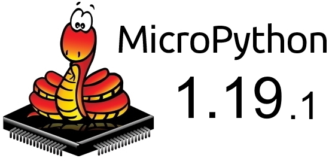](https://github.com/micropython/micropython/releases/tag/v1.19.1)

MicroPython v1.19.1 is the current release of MicroPython, it is a bug fix release - [GitHub](https://github.com/micropython/micropython/releases/tag/v1.19.1).

Changes from 1.19 to 1.19.1:

- extmod/machine_i2c: only use WRITE1 option if transfer supports it.

This fixes the machine.SoftI2C.readfrom_mem() method on esp32, so it writes the address to read from.

## GitHub Copilot to Become a Paid Service August 23rd

[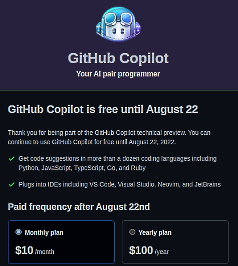](https://blog.adafruit.com/2022/06/22/github-copilot-to-become-a-paid-service-august-23rd-github/)

GitHub Copilot will cost USD $10 a month or USD $100 a year starting August 23rd with a free 60 day trial available. GitHub is betting big on AI programming and code in the cloud, according to GitHub CEO [Thomas Dohmke](https://blog.adafruit.com/2022/06/22/github-copilot-to-become-a-paid-service-august-23rd-github/#:~:text=GitHub%20CEO%C2%A0Thomas%20Dohmke), who spoke at the [WeAreDevelopers](https://www.wearedevelopers.com/) conference recently.

People have flocked to social media, with many upset that their code, with licenses that may not be free and open (or at least require attribution) was used to train Copilot, which does not provide any hint at where the code has come from - [Adafruit Blog](https://blog.adafruit.com/2022/06/22/github-copilot-to-become-a-paid-service-august-23rd-github/) and [GitHub Blog](https://github.blog/2022-06-21-github-copilot-is-generally-available-to-all-developers/).

## Espressif Introduces the ESP32-C5: their first Dual-Band Wi-Fi 6 MCU

[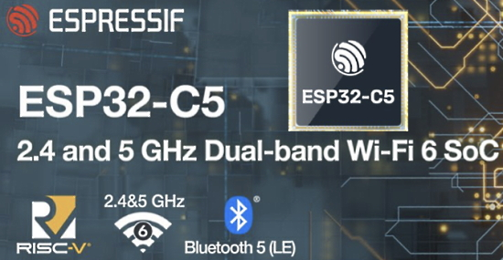](https://www.espressif.com/en/news/ESP32-C5)

Espressif Systems announced the release of their ESP32-C5, a highly integrated microcontroller with 2.4 and 5 GHz dual-band Wi-Fi 6, as well as Bluetooth 5 (LE) connectivity. The ESP32-C5 is a follow-up to the ESP32-C6 SoC, which was announced last year. It has a 32-bit, RISC-V, single-core processor which can clock up to 240 MHz. It has a 400KB SRAM, 384KB of ROM, and it works with external flash. It has more than 20 programmable GPIOs, supporting all commonly-used peripherals including security. Also included is an SDIO 2.0 peripheral interface - [Espressif](https://www.espressif.com/en/news/ESP32-C5).

[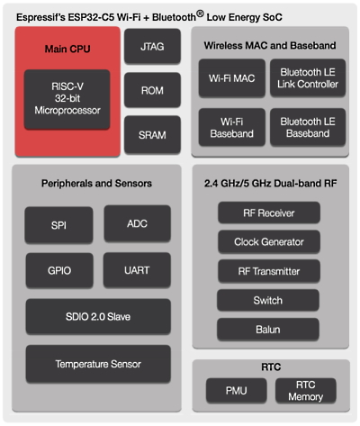](https://www.espressif.com/en/news/ESP32-C5)

## Digi-Key Interviews Eben Upton on Raspberry Pi at Embedded World

[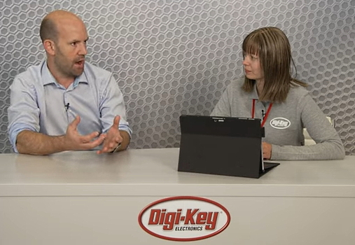](https://youtu.be/qko1AR4ous0)

At Embedded World 2022 the other day, at the Digi-Key booth, Paige West spoke with Dr. Eben Upton, CEO and Founder, Raspberry Pi, about the beneficial features of the Raspberry Pi, some of the exciting projects that utilize it, as well as the RP2040 microcontroller - [YouTube](https://youtu.be/qko1AR4ous0) and [Electronic Specifier](https://www.electronicspecifier.com/news/tech-videos/digi-key-at-embedded-world-with-raspberry-pi).

## Linus Torvalds and Dirk Hohndel Have a Fireside Chat at OS Summit

)

Linus Torvalds and Dirk Hohndel sit down for a fireside chat at the 2022 Open Source Summit North America - [Twitter](https://twitter.com/linuxfoundation/status/1539255990863941633) and [Summit Site](https://events.linuxfoundation.org/open-source-summit-north-america/).

## 2022 Stack Overflow Developer Survey Results

[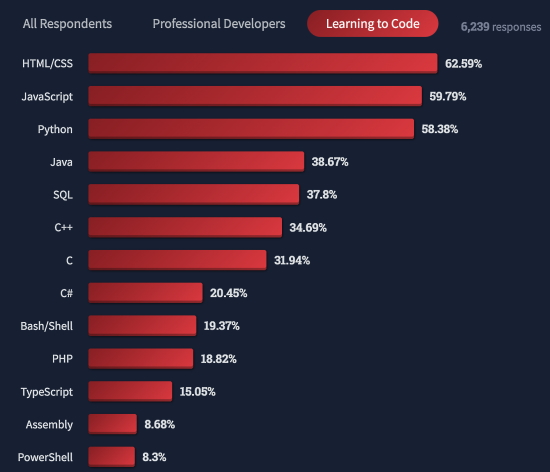](https://survey.stackoverflow.co/2022/#technology-most-popular-technologies)

The 2022 Stack Overflow Developers Survey contains many insights into how the developer community is doing. One of the results to highlight: what languages are people learning to code with: - [Stack Overflow](https://survey.stackoverflow.co/2022/#technology-most-popular-technologies).

> 2022 marks JavaScript’s tenth year in a row as the most commonly used programming language. But, it’s a different picture for those learning to code. HTML/CSS, JavaScript and Python are almost tied as the most popular languages for people learning to code. People learning to code are more likely than Professional Developers to report using Python (58% vs 44%), C++ (35% vs 20%), and C (32% vs 17%).

## This Week's Python Streams

Python on Hardware is all about building a cooperative ecosphere which allows contributions to be valued and to grow knowledge. Below are the streams within the last week focusing on the community.

### CircuitPython Deep Dive Stream

[This week](https://youtu.be/9U7vzdOzQkU), Tim streamed work on a PyPortal Interactive Project and Game & Watch Octopus.

You can see the latest video and past videos on the Adafruit YouTube channel under the Deep Dive playlist - [YouTube](https://www.youtube.com/playlist?list=PLjF7R1fz_OOXBHlu9msoXq2jQN4JpCk8A).

### CircuitPython Parsec

John Park’s CircuitPython Parsec this week is on TileGrid Sprite Sheets - [Adafruit Blog](https://blog.adafruit.com/2022/06/24/john-parks-circuitpython-parsec-tilegrid-sprite-sheet-adafruit-johnedgarpark-adafruit-circuitpython/) and [YouTube](https://youtu.be/suaJQtZKLZw).

Catch all the episodes in the [YouTube playlist](https://www.youtube.com/playlist?list=PLjF7R1fz_OOWFqZfqW9jlvQSIUmwn9lWr).

### The CircuitPython Show

The CircuitPython Show is an independent podcast, hosted by Paul Cutler, focusing on the people doing awesome things with CircuitPython. Each episode features Paul in conversation with a guest for a short interview – [CircuitPythonShow](https://circuitpythonshow.com/) and [Twitter](https://twitter.com/circuitpyshow).

The latest episode, released June 27th, features Guy Dupont joining the show and talking about his many projects – [Show List](https://circuitpythonshow.com/episodes/all).

## Project of the Week: An Emoji Flipper

[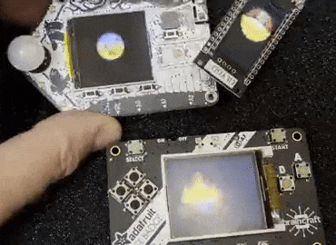](https://twitter.com/todbot/status/1540107788445024256)

Emoji Flipper quickly cycles through 189 different emojis, demonstrating the CircuitPython TileGrid feature - [Twitter](https://twitter.com/todbot/status/1540107788445024256).

## News from around the web!

[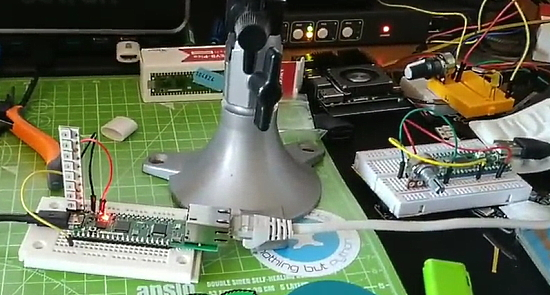](https://twitter.com/biglesp/status/1540695437677449216)

Using CircuitPython Raspberry Pi RP2040 and NodeRED to send messages over MQTT - [Twitter](https://twitter.com/biglesp/status/1540695437677449216).

[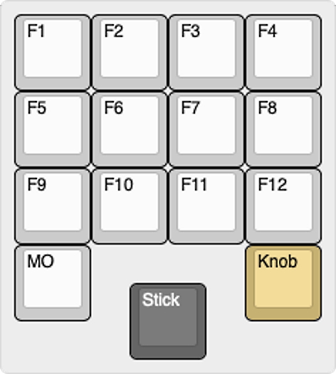](https://blog.adafruit.com/2022/06/22/octave-a-12-key-macropad-using-an-rp2040-and-circuitpython-circuitpython-raspberrypi-raspberry_pi/)

The Octave is a 12-key macropad. It is primarily designed to be a compact keyboard with support for 12 function keys. It’s based on a custom board with a Raspberry Pi RP2040 microcontroller programmed in CircuitPython - [Adafruit Blog](https://blog.adafruit.com/2022/06/22/octave-a-12-key-macropad-using-an-rp2040-and-circuitpython-circuitpython-raspberrypi-raspberry_pi/) and [GitHub](https://github.com/takayoshiotake/octave-12-key-macropad).

Use of CircuitPython sequences and adding brightness to NeoPixels – learn to use Python’s dunder methods to add new features to your classes - [Adafruit Blog](https://blog.adafruit.com/2022/06/23/hackspace-magazine-issue-56-circuitpython-and-neopixels-circuitpython-raspberrypipico-hackspacemag/) and [HackSpace](https://hackspace.raspberrypi.com/issues/56).

[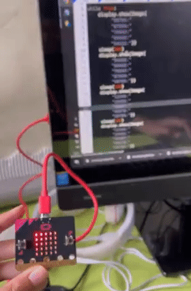](https://twitter.com/AlwaysComputing/status/1540370502644023299)

Students programming animations on micro:bit with MicroPython - [Twitter](https://twitter.com/AlwaysComputing/status/1540370502644023299).

MicroPython Bluetooth (BLE) examples, running on ESP32-C3 - [YouTube](https://youtu.be/GsseX2rEjfw).

A digital badge using the Tufty 2040 from Pmoroni and MicroPython - [MicroPython](https://twitter.com/BoughtonShields/status/1541191665909628928).

[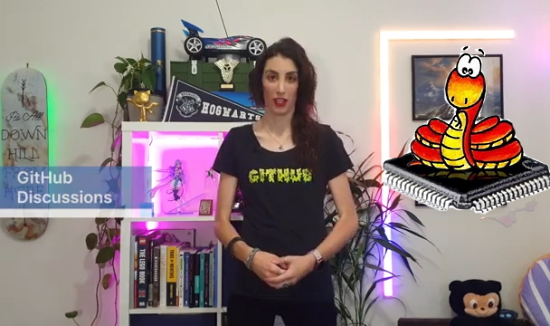](https://github.com/micropython/micropython/issues/8795)

MicroPython users have been discussing moving the MicroPython forums from a phpbb solution to [GitHub Discussions](https://docs.github.com/en/discussions) - [GitHub](https://github.com/micropython/micropython/issues/8795).

[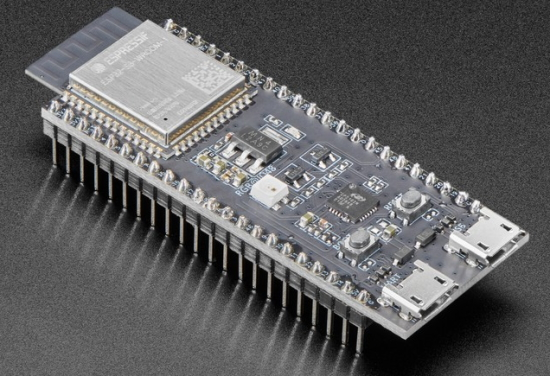](https://arcanesciencelab.wordpress.com/2022/06/20/micropython-v-1-19/)

Arcane Science Lab installs the new MicroPython v1.19.1 on boards and blogs their experiences - [Arcane Science Lab](https://arcanesciencelab.wordpress.com/2022/06/20/micropython-v-1-19/).

[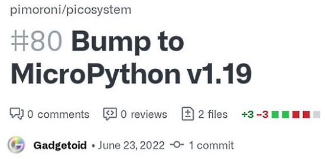](https://github.com/pimoroni/picosystem/pull/80)

Pimoroni has released a new version of their PicoSystem software based on MicroPython v1.19 - [GitHub](https://github.com/pimoroni/picosystem/pull/80).

[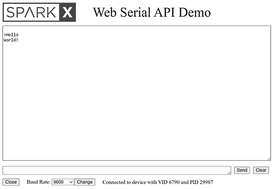](https://github.com/sparkfunX/WebTerminalDemo)

SparkFun SparkX has released WebTerminalDemo, a simple demo of the Web Serial API which implements a bare-bones serial terminal - [GitHub](https://github.com/sparkfunX/WebTerminalDemo).

[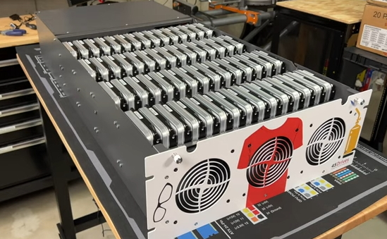](https://blog.adafruit.com/2022/06/22/the-1-2-petabyte-raspberry-pi-disk-array-now-works-raspberrypi-geerlingguy-raspberry_pi/)

1.2 Petabytes! 60 hard drives, 1 Raspberry Pi — And now it actually works! It’s not the fastest storage server in town, but it’s good for about 70 MB/sec write speeds and sucks down about 500 Watts of power - [Adafruit Blog](https://blog.adafruit.com/2022/06/22/the-1-2-petabyte-raspberry-pi-disk-array-now-works-raspberrypi-geerlingguy-raspberry_pi/) and [YouTube](https://www.youtube.com/watch?v=R2S2RMNv7OU).

text - [site](url).

text - [site](url).

text - [site](url).

text - [site](url).

text - [site](url).

[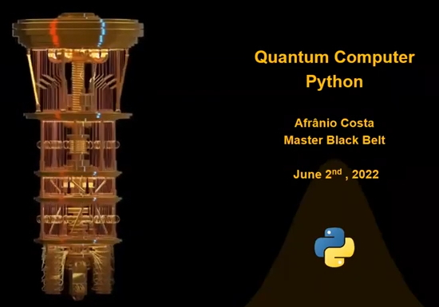](https://www.youtube.com/watch?v=YoHLDkUqpNQ)

A talk providing an overview of quantum concepts and shows how to use Python to execute quantum circuits on the IBM Quantum server (EAGLE 127 qubits) - [YouTube](https://www.youtube.com/watch?v=YoHLDkUqpNQ).

[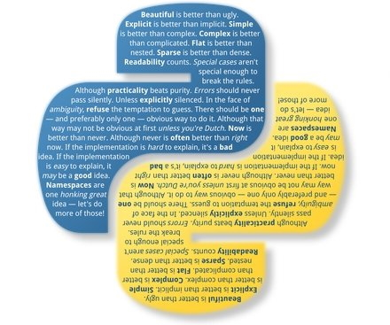](https://peps.python.org/pep-0020/)

Are you familiar with the [Zen of Python](https://en.wikipedia.org/wiki/Zen_of_Python)? It's codified in [PEP 20](https://peps.python.org/pep-0020/) and it is a simple list of guidelines for writing Python code. There is even a [song](https://blog.adafruit.com/2020/06/02/a-new-song-for-the-zen-of-python-python-pumpichank/) about it - [Python Enhancement Proposals](https://peps.python.org/pep-0020/).

[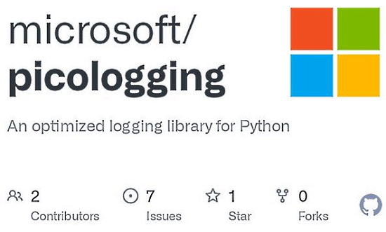](https://github.com/microsoft/picologging)

Microsoft just released picologging, a high-performance logging library for Python. picologging is 4-10x faster than the `logging` module in the standard library - [GitHub](https://github.com/microsoft/picologging).

PyDev of the Week:

CircuitPython Weekly Meeting for June 21st, 2022 ([notes](https://github.com/adafruit/adafruit-circuitpython-weekly-meeting/blob/main/2022/2022-06-21.md)) [on YouTube](https://youtu.be/I6zxR0Nj1nU)

#ICYDNCI What was the most popular, most clicked link, in [last week's newsletter](https://www.adafruitdaily.com/2022/06/21/python-on-microcontrollers-newsletter-micropython-1-19-released-and-more-python-circuitpython-micropython-thepsf/)? [Python Basics Cheat Sheet](https://twitter.com/KirkDBorne/status/1536357030868529152)

## Coming Soon

[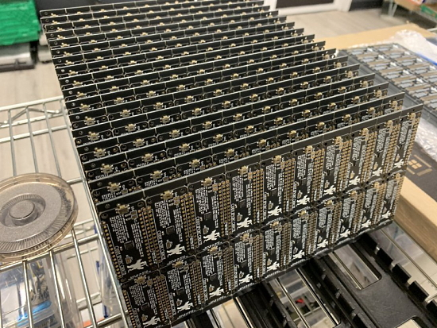](https://twitter.com/josecastillo/status/1539291216050900992)

Joey Castillo is readying 300 LCD FeatherWings - [Twitter](https://twitter.com/josecastillo/status/1539291216050900992) and [website](https://oddlyspecificobjects.com/products/lcdwing/).

text - [site](url).

## New Boards Supported by CircuitPython

The number of supported microcontrollers and Single Board Computers (SBC) grows every week. This section outlines which boards have been included in CircuitPython or added to [CircuitPython.org](https://circuitpython.org/).

This week, there were (#/no) new boards added!

- [Board name](url)
- [Board name](url)
- [Board name](url)

*Note: For non-Adafruit boards, please use the support forums of the board manufacturer for assistance, as Adafruit does not have the hardware to assist in troubleshooting.*

Looking to add a new board to CircuitPython? It's highly encouraged! Adafruit has four guides to help you do so:

- [How to Add a New Board to CircuitPython](https://learn.adafruit.com/how-to-add-a-new-board-to-circuitpython/overview)
- [How to add a New Board to the circuitpython.org website](https://learn.adafruit.com/how-to-add-a-new-board-to-the-circuitpython-org-website)
- [Adding a Single Board Computer to PlatformDetect for Blinka](https://learn.adafruit.com/adding-a-single-board-computer-to-platformdetect-for-blinka)
- [Adding a Single Board Computer to Blinka](https://learn.adafruit.com/adding-a-single-board-computer-to-blinka)

## New Learn Guides!

[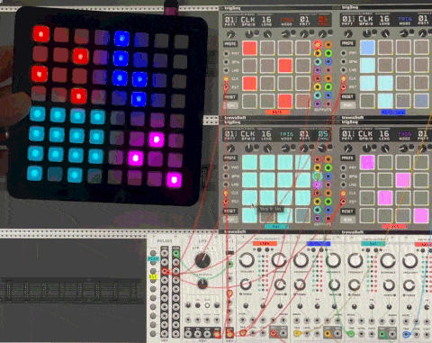](https://learn.adafruit.com/guides/latest)

[NeoTrellis MIDI Feedback Controller](https://learn.adafruit.com/neotrellis-midi-feedback-controller) from [John Park](https://learn.adafruit.com/users/johnpark)

[Smart Mirror with PyPortal](https://learn.adafruit.com/smart-mirror-with-pyportal) from [Noe and Pedro](https://learn.adafruit.com/users/pixil3d)

## CircuitPython Libraries!

CircuitPython support for hardware continues to grow. We are adding support for new sensors and breakouts all the time, as well as improving on the drivers we already have. As we add more libraries and update current ones, you can keep up with all the changes right here!

For the latest libraries, download the [Adafruit CircuitPython Library Bundle](https://circuitpython.org/libraries). For the latest community contributed libraries, download the [CircuitPython Community Bundle](https://github.com/adafruit/CircuitPython_Community_Bundle/releases).

If you'd like to contribute, CircuitPython libraries are a great place to start. Have an idea for a new driver? File an issue on [CircuitPython](https://github.com/adafruit/circuitpython/issues)! Have you written a library you'd like to make available? Submit it to the [CircuitPython Community Bundle](https://github.com/adafruit/CircuitPython_Community_Bundle). Interested in helping with current libraries? Check out the [CircuitPython.org Contributing page](https://circuitpython.org/contributing). We've included open pull requests and issues from the libraries, and details about repo-level issues that need to be addressed. We have a guide on [contributing to CircuitPython with Git and GitHub](https://learn.adafruit.com/contribute-to-circuitpython-with-git-and-github) if you need help getting started. You can also find us in the #circuitpython channels on the [Adafruit Discord](https://adafru.it/discord).

You can check out this [list of all the Adafruit CircuitPython libraries and drivers available](https://github.com/adafruit/Adafruit_CircuitPython_Bundle/blob/master/circuitpython_library_list.md). 

The current number of CircuitPython libraries is **357**!

**Updated Libraries!**

Here's this week's updated CircuitPython libraries:

 * [Adafruit_CircuitPython_Colorsys](https://github.com/adafruit/Adafruit_CircuitPython_Colorsys)
 * [Adafruit_CircuitPython_DS1307](https://github.com/adafruit/Adafruit_CircuitPython_DS1307)
 * [Adafruit_CircuitPython_NeoTrellis](https://github.com/adafruit/Adafruit_CircuitPython_NeoTrellis)
 * [Adafruit_CircuitPython_PYOA](https://github.com/adafruit/Adafruit_CircuitPython_PYOA)
 * [Adafruit_CircuitPython_GPS](https://github.com/adafruit/Adafruit_CircuitPython_GPS)
 * [Adafruit_CircuitPython_VC0706](https://github.com/adafruit/Adafruit_CircuitPython_VC0706)
 * [Adafruit_CircuitPython_NeoKey](https://github.com/adafruit/Adafruit_CircuitPython_NeoKey)
 * [Adafruit_CircuitPython_MPR121](https://github.com/adafruit/Adafruit_CircuitPython_MPR121)
 * [Adafruit_CircuitPython_LIFX](https://github.com/adafruit/Adafruit_CircuitPython_LIFX)
 * [Adafruit_CircuitPython_ESP32SPI](https://github.com/adafruit/Adafruit_CircuitPython_ESP32SPI)
 * [Adafruit_CircuitPython_Logging](https://github.com/adafruit/Adafruit_CircuitPython_Logging)
 * [Adafruit_CircuitPython_Display_Text](https://github.com/adafruit/Adafruit_CircuitPython_Display_Text)
 * [Adafruit_CircuitPython_seesaw](https://github.com/adafruit/Adafruit_CircuitPython_seesaw)
 * [Adafruit_CircuitPython_NeoPixel](https://github.com/adafruit/Adafruit_CircuitPython_NeoPixel)
 * [Adafruit_CircuitPython_HT16K33](https://github.com/adafruit/Adafruit_CircuitPython_HT16K33)
 * [Adafruit_CircuitPython_BLE_Adafruit](https://github.com/adafruit/Adafruit_CircuitPython_BLE_Adafruit)
 * [Adafruit_CircuitPython_JWT](https://github.com/adafruit/Adafruit_CircuitPython_JWT)
 * [Adafruit_CircuitPython_SGP30](https://github.com/adafruit/Adafruit_CircuitPython_SGP30)
 * [circuitpython](https://github.com/adafruit/circuitpython)
 * [CircuitPython_Community_Bundle](https://github.com/adafruit/CircuitPython_Community_Bundle)

## What’s the team up to this week?

What is the team up to this week? Let’s check in!

**Dan**

I released CircuitPython 7.3.1 this week. It includes the MatrixPortal DMA SPI fix I did last week, and several other fixes, some of which were backported from the `main` branch.

I've started to port CircuitPython to run on plain ESP32 microcontrollers, which don't have native USB support. The web workflow Scott is working on will make these quite usable, so we've decided to support these widely used chips.

**Kattni**

I wrapped up the [Create an Excellent GitHub Profile with Markdown](https://learn.adafruit.com/excellent-github-profile) guide. It explains the steps necessary to create a GitHub profile including creating the special profile repository with a README. It also covers some basic Markdown syntax, and how to edit the README. Then, the guide discusses what kind of content you might want to include to get you started if you're unsure where to begin. Finally, there is a section on creating your profile, beginning with the simplest option and moving through more advanced options, including a number of tools to add some enhancements to your profile. Whether this is entirely new to you, or you want to put some shine on your existing profile, this guide is meant for you!

**Tim**

I worked on an HTML page served by devices for editing files via the web workflow. I was able to integrate the page with some of the HTTP Request endpoints that Scott has set up on the working branch for web workflow to load and save files. I experimented with Javascript code editor modules and used one called "Ace" on the page which offers syntax highlighting, line numbers, and other code editing "quality of life" features. This week I also added some integer bounds validation on the arguments for a few of the functions on displayio.Palette object in the core. Previously it would allow values outside the range of indexes within the palette. Whilst adding these validations I learned about QTSTRs from some Micropython documentation to better understand where they come from and how to use them.

**Scott**

This week I've continued working on the web workflow. I've added basic auth permissions to the file access, the ability to upload files, delete them and create directories. I also got it doing CORS headers so that other approved sites will be able to fetch data from the board. I'm continuing to polish things and will hopefully send out a PR early next week. The PR will cover device discovery and file system operations. Serial support will be added in a following PR.

**Liz**

I've been working on a cassette hacking project with JP. We are doing two different versions to demonstrate to folks how to control off the shelf tape decks for weird music effects with CircuitPython. My version is using a simple L9110 motor driver. A potentiometer affects the speed and direction of the motor in the cassette deck. I made a tape loop so that it can play forward and reverse without any issues. I think this guide will be really helpful for folks because you see a lot of tape projects out there in the music tech/synth communities, but you don't see a lot of step-by-step documentation on how to get started. This has also been nostalgic for me because I spent a lot of time making tapes up until 2018 because my car only had a tape deck that did not get along with the infamous iPod tape deck adapter. 

I also wrapped up the WipperSnapper pages for the [QT Py ESP32-S3 guide](https://learn.adafruit.com/adafruit-qt-py-esp32-s3) and wrote some code for the [PyPortal Smart Mirror Weather Display guide](https://learn.adafruit.com/smart-mirror-with-pyportal). 

## Upcoming events!

The next MicroPython Meetup in Melbourne will be on June 22nd via Zoom – [Meetup](https://www.meetup.com/MicroPython-Meetup/). See the [slides](https://docs.google.com/presentation/d/e/2PACX-1vROLMO--AXdxJTwvsxFbZqIGFAHVbm9YF_AJdVLdHqrjB0C7FJEgNm5QS27PKLvQSO0y3Do74Wlsn2F/pub?start=false&loop=false&delayms=3000&slide=id.p) of the May 25th meeting.

SciPy 2022, the 21st annual Scientific Computing with Python conference, will be held in Austin, Texas, USA from July 11-17, 2022. The annual SciPy Conference brings together attendees from industry, academia, and government to showcase their latest projects, learn from skilled users and developers, and collaborate on code development. The full program will consist of 2 days tutorials (July 11-12), 3 days of talks (July 13-15) and 2 days of developer sprints (July 16-17) - [SciPy 2022](https://www.scipy2022.scipy.org/).

EuroPython 2022 will be held on 11th-17th July 2022 and it will be both in person and virtual. The in-person conference will be held at [The Convention Centre](https://www.theccd.ie/) Dublin (The CCD) in Dublin, Ireland - [EuroPython 2022](https://ep2022.europython.eu/).

PyOhio is a non-profit annual Python community conference usually held in Columbus, OH. It is being held online starting Saturday, Jul 30, 2022. It is free to attend and welcomes anyone with an interest in Python. Content ranges from beginner to advanced and is intended to be relevant to all types of Python users: students, software professionals, scientists, hobbyists, and anyone looking to learn more - [PyOhio](https://www.pyohio.org/2022/).

**Send Your Events In**

As for other events, with the COVID pandemic, most in-person events are postponed or held online. If you know of virtual events or upcoming events, please let us know on Twitter with hashtag #CircuitPython or email to cpnews(at)adafruit(dot)com.

## Latest releases

CircuitPython's stable release is [#.#.#](https://github.com/adafruit/circuitpython/releases/latest) and its unstable release is [#.#.#-##.#](https://github.com/adafruit/circuitpython/releases). New to CircuitPython? Start with our [Welcome to CircuitPython Guide](https://learn.adafruit.com/welcome-to-circuitpython).

[2022####](https://github.com/adafruit/Adafruit_CircuitPython_Bundle/releases/latest) is the latest CircuitPython library bundle.

[v#.#.#](https://micropython.org/download) is the latest MicroPython release. Documentation for it is [here](http://docs.micropython.org/en/latest/pyboard/).

[#.#.#](https://www.python.org/downloads/) is the latest Python release. The latest pre-release version is [#.#.#](https://www.python.org/download/pre-releases/).

[#,### Stars](https://github.com/adafruit/circuitpython/stargazers) Like CircuitPython? [Star it on GitHub!](https://github.com/adafruit/circuitpython)

## Call for help -- Translating CircuitPython is now easier than ever!

One important feature of CircuitPython is translated control and error messages. With the help of fellow open source project [Weblate](https://weblate.org/), we're making it even easier to add or improve translations. 

Sign in with an existing account such as GitHub, Google or Facebook and start contributing through a simple web interface. No forks or pull requests needed! As always, if you run into trouble join us on [Discord](https://adafru.it/discord), we're here to help.

## jobs.adafruit.com - Find a dream job, find great candidates!

[jobs.adafruit.com](https://jobs.adafruit.com/) has returned and folks are posting their skills (including CircuitPython) and companies are looking for talented makers to join their companies - from Digi-Key, to Hackaday, Micro Center, Raspberry Pi and more.

**Job of the Week**

text - [Adafruit Jobs Board](https://jobs.adafruit.com/).

## NUMBER thanks!

The Adafruit Discord community, where we do all our CircuitPython development in the open, reached over NUMBER humans - thank you!  Adafruit believes Discord offers a unique way for Python on hardware folks to connect. Join today at [https://adafru.it/discord](https://adafru.it/discord).

## ICYMI - In case you missed it

Python on hardware is the Adafruit Python video-newsletter-podcast! The news comes from the Python community, Discord, Adafruit communities and more and is broadcast on ASK an ENGINEER Wednesdays. The complete Python on Hardware weekly videocast [playlist is here](https://www.youtube.com/playlist?list=PLjF7R1fz_OOXRMjM7Sm0J2Xt6H81TdDev). The video podcast is on [iTunes](https://itunes.apple.com/us/podcast/python-on-hardware/id1451685192?mt=2), [YouTube](http://adafru.it/pohepisodes), [IGTV (Instagram TV](https://www.instagram.com/adafruit/channel/)), and [XML](https://itunes.apple.com/us/podcast/python-on-hardware/id1451685192?mt=2).

[The weekly community chat on Adafruit Discord server CircuitPython channel - Audio / Podcast edition](https://itunes.apple.com/us/podcast/circuitpython-weekly-meeting/id1451685016) - Audio from the Discord chat space for CircuitPython, meetings are usually Mondays at 2pm ET, this is the audio version on [iTunes](https://itunes.apple.com/us/podcast/circuitpython-weekly-meeting/id1451685016), Pocket Casts, [Spotify](https://adafru.it/spotify), and [XML feed](https://adafruit-podcasts.s3.amazonaws.com/circuitpython_weekly_meeting/audio-podcast.xml).

## Codecademy "Learn Hardware Programming with CircuitPython"

Codecademy, an online interactive learning platform used by more than 45 million people, has teamed up with Adafruit to create a coding course, “Learn Hardware Programming with CircuitPython”. The course is now available in the [Codecademy catalog](https://www.codecademy.com/learn/learn-circuitpython?utm_source=adafruit&utm_medium=partners&utm_campaign=circuitplayground&utm_content=pythononhardwarenewsletter).

## Contribute!

The CircuitPython Weekly Newsletter is a CircuitPython community-run newsletter emailed every Tuesday. The complete [archives are here](https://www.adafruitdaily.com/category/circuitpython/). It highlights the latest CircuitPython related news from around the web including Python and MicroPython developments. To contribute, edit next week's draft [on GitHub](https://github.com/adafruit/circuitpython-weekly-newsletter/tree/gh-pages/_drafts) and [submit a pull request](https://help.github.com/articles/editing-files-in-your-repository/) with the changes. You may also tag your information on Twitter with #CircuitPython. 

Join the Adafruit [Discord](https://adafru.it/discord) or [post to the forum](https://forums.adafruit.com/viewforum.php?f=60) if you have questions.

