- [X] Kattni updates
- [ ] change date
- [ ] update title
- [ ] Feature story
- [ ] Update  for images
- [ ] Update ICYDNCI
- [ ] All images 550w max only
- [ ] Link "View this email in your browser."

News Sources

- [python.org](https://www.python.org/)
- [Python Insider - dev team blog](https://pythoninsider.blogspot.com/)
- [MicroPython Meetup Blog](https://melbournemicropythonmeetup.github.io/)
- [hackaday.io newest projects MicroPython](https://hackaday.io/projects?tag=micropython&sort=date) and [CircuitPython](https://hackaday.io/projects?tag=circuitpython&sort=date)
- [hackaday CircuitPython](https://hackaday.com/blog/?s=circuitpython) and [MicroPython](https://hackaday.com/blog/?s=micropython)
- [hackster.io CircuitPython](https://www.hackster.io/search?q=circuitpython&i=projects&sort_by=most_recent) and [MicroPython](https://www.hackster.io/search?q=micropython&i=projects&sort_by=most_recent)

View this email in your browser. **Warning: Flashing Imagery**

Welcome to the latest Python on Microcontrollers newsletter! We highlight new boards supported by Python most every week. Nut this week it's a Raspberry Pi board and that's always received well (for capabilities and price). The Raspberry Pi Pico W will set a new standard for use of WiFi in projects by shear ubiquity, even if Espressif has been in this space for a long time (with integrated chips).

We're on [Discord](https://discord.gg/HYqvREz), [Twitter](https://twitter.com/search?q=circuitpython&src=typed_query&f=live), and for past newsletters - [view them all here](https://www.adafruitdaily.com/category/circuitpython/). If you're reading this on the web, [subscribe here](https://www.adafruitdaily.com/). Here's the news this week:

## Introducing the New Raspberry Pi Pico W

June 30th, Raspberry Pi launched three new members of their Pico family. Raspberry Pi Pico W is priced at $6, and brings 802.11n wireless networking to the Pico platform while retaining complete pin compatibility by adding an Infineon [CYW43439](https://www.infineon.com/cms/en/product/wireless-connectivity/airoc-wi-fi-plus-bluetooth-combos/cyw43439/) wireless chip. 

The CYW43439 supports both Bluetooth Classic and Bluetooth Low-Energy per the [datasheet](https://datasheets.raspberrypi.com/picow/pico-w-datasheet.pdf). Raspberry Pi has not enabled Bluetooth on Pico W at launch, but may do so in the future.

Getting started guides for C and MicroPython, as well as links to API level documentation are available in the [microcontrollers section](https://www.raspberrypi.com/documentation/microcontrollers/) of the Raspberry Pi documentation site. They expect more demos and documentation to be released in the next month or two. CircuitPython does not currently support the Pico W.

[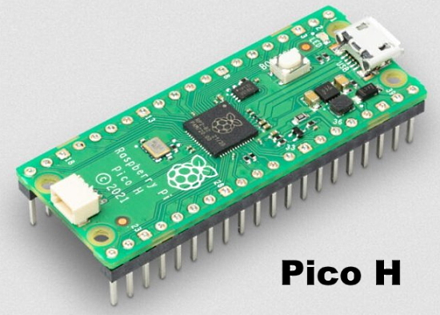](https://www.raspberrypi.com/news/raspberry-pi-pico-w-your-6-iot-platform/)

Pico H ($5) and Pico WH ($7) add pre-populated headers, and a new 3-pin debug/UART connector, to Pico and Pico W respectively. The connector is a 1.0mm pitch 3-pin JST ‘SH’ connector SM03B-SRSS-TB.

Pico H and Pico W are available now; Pico WH will follow in August. It was first available from UK retailers and is expected in US retailers shortly.

Learn more:

- [Raspberry Pi Blog](https://www.raspberrypi.com/news/raspberry-pi-pico-w-your-6-iot-platform/).
- [YouTune](https://youtu.be/QIdyTlmdVW8)
- [Tom's Hardware Review](https://www.tomshardware.com/reviews/raspberry-pi-pico-w)
- [Datasheet on the Debug Connector](https://datasheets.raspberrypi.com/debug/debug-connector-specification.pdf)

## Feature

text - [site](url).

## Adding a Webserver to CircuitPython

[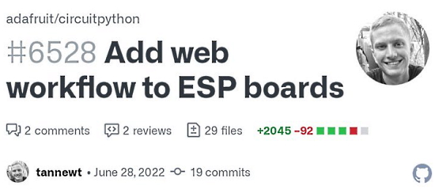](https://github.com/adafruit/circuitpython/pull/6528)

CircuitPython lead developer Scott Shawcroft has added a web server to CircuitPython that enables file browsing and manipulation from a web browser. Serial support will be added in a follow up PR - [GitHub](https://github.com/adafruit/circuitpython/pull/6528).

## The `urequests` MicroPython Library Updated 

MicroPython PR #500 that adds basic auth to urequests. Also added: redirects, chunked uploads, timeouts, response header parsing and a collection of other fixes - [GitHub](https://github.com/micropython/micropython-lib/pull/500) via [Twitter](https://twitter.com/matt_trentini/status/1541985630166536192).

## Feature

text - [site](url).

## This Week's Python Streams

Python on Hardware is all about building a cooperative ecosphere which allows contributions to be valued and to grow knowledge. Below are the streams within the last week focusing on the community.

### CircuitPython Deep Dive Stream

[This week](link), Tim streamed work on {subject}.

You can see the latest video and past videos on the Adafruit YouTube channel under the Deep Dive playlist - [YouTube](https://www.youtube.com/playlist?list=PLjF7R1fz_OOXBHlu9msoXq2jQN4JpCk8A).

### CircuitPython Parsec

John Park’s CircuitPython Parsec this week is on {subject} - [Adafruit Blog](link) and [YouTube](link).

Catch all the episodes in the [YouTube playlist](https://www.youtube.com/playlist?list=PLjF7R1fz_OOWFqZfqW9jlvQSIUmwn9lWr).

### The CircuitPython Show

The CircuitPython Show is a new independent podcast, hosted by Paul Cutler, focusing on the people doing awesome things with CircuitPython. Each episode features Paul in conversation with a guest for a twenty to thirty minute interview – [CircuitPythonShow](https://circuitpythonshow.com/) and [Twitter](https://twitter.com/circuitpyshow).

The podcast is off this week.  Last week Guy Dupont shared his many projects and the next episode, on July 11th, features Nicholas Tollervey, creator of the Mu code editor. – [Show List](https://circuitpythonshow.com/episodes/all).

## Projects of the Week: Raspberry Pi Pico W

Here are a couple projects using the new Raspberry Pi Pico W with MicroPython inspired by Les Pounder's article in Tom's Hardware [How to Connect Raspberry Pi Pico W to the Internet](https://www.tomshardware.com/how-to/connect-raspberry-pi-pico-w-to-the-internet):

Raspberry Pi Pico W gets the names of the ten people currently in space using JSON and MicroPython. The publicly available data is from the internet via WiFi - [Twitter](https://twitter.com/biglesp/status/1542537224071352321).

[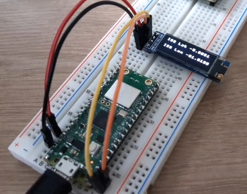](https://twitter.com/JohnChinner/status/1542933717924171776)

> Been tinkering all afternoon with my Raspberry Pi Pico W and finally got the real time latitude and longitude of the Space Station showing on a tiny OLED screen, getting data from the Open Notify API through my home WiFi using MicroPython - [Twitter](https://twitter.com/JohnChinner/status/1542933717924171776).

## News from around the web!

[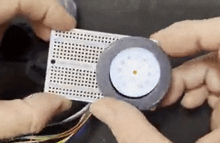](https://twitter.com/todbot/status/1542925644459216896)

A round display knob similar to a Nest thermostat with a round display. Made possible by a cool hollow rotary encoder and some clever 3D printed parts. Not done yet but it kinda works! It runs on an Adafruit QTPy RP2040 and using CircuitPython - [Twitter Thread](https://twitter.com/todbot/status/1542925644459216896).

[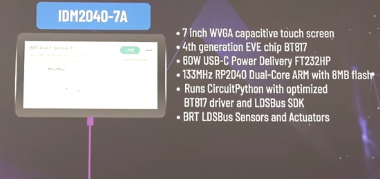](https://www.youtube.com/watch?v=cqRbyh7jiSg)

FTDI at Embedded World 2022 demonstrates their IDM2040-7A display powered by an RP2040 and CircuitPython - [YouTube](https://www.youtube.com/watch?v=cqRbyh7jiSg).

[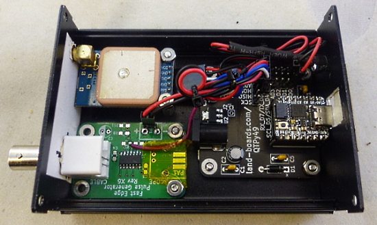](https://blog.adafruit.com/2022/06/30/an-inexpensive-10-mhz-gps-based-frequency-standard-qtpy-landboards/)

An inexpensive 10 MHz GPS-based frequency standard using a GPS module and an Adafruit QT Py running CircuitPython - [Adafruit Blog](https://blog.adafruit.com/2022/06/30/an-inexpensive-10-mhz-gps-based-frequency-standard-qtpy-landboards/), [Project Details](http://land-boards.com/blwiki/index.php?title=GPS_Frequency_Standard), [GitHub](https://github.com/land-boards/QT-Py/blob/main/CircuitPython/Seeed_XIAO_RP2040/GPS_004.py).

[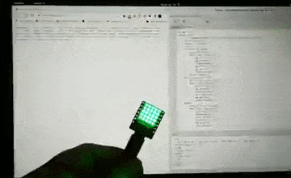](https://twitter.com/biglesp/status/1541897551879831554)

> Live air raid status for Kharkiv, Ukraine using [@yongxiangxu251](https://twitter.com/yongxiangxu251) ESP32-C3FH4-RGB, Dmytro Panin
 http://sirens.in.ua/api/v1, some MicroPython and very bright Neopixels - [Twitter](https://twitter.com/biglesp/status/1541897551879831554).

[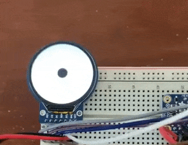](https://twitter.com/MarkKomus/status/1542489269285142528)

Using a round display and a LSM9DS1 accelerometer to measure movement. A dot moves as the board moves via CircuitPython - [Twitter](https://twitter.com/MarkKomus/status/1542489269285142528).

text - [site](url).

text - [site](url).

text - [site](url).

text - [site](url).

text - [site](url).

text - [site](url).

text - [site](url).

text - [site](url).

text - [site](url).

text - [site](url).

text - [site](url).

text - [site](url).

[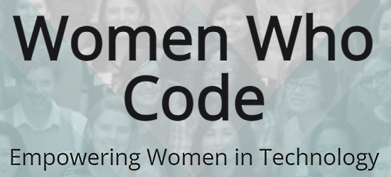](https://www.womenwhocode.com/resources?query=python)

Resources for learning Python - [Women Who Code](https://www.womenwhocode.com/resources?query=python).

Build a Quiz Application With Python - [Real Python](https://twitter.com/realpython/status/1541836329390047232).

Python Tutorial For Beginners - #46. Dice Program in Python - [YouTube](https://www.youtube.com/watch?v=OENFby8RdEc).

[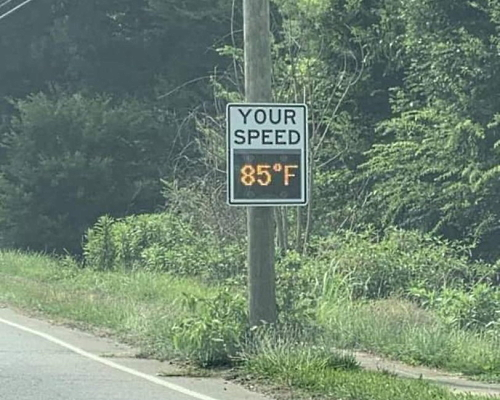](https://twitter.com/rSoftwareGore/status/1542637999611154433)

When the LIDAR sensor is out of stock, but you have a temperature sensor handy... - [Twitter](https://twitter.com/rSoftwareGore/status/1542637999611154433).

PyDev of the Week:

CircuitPython Weekly Meeting for 

**#ICYDNCI What was the most popular, most clicked link, in [last week's newsletter](https://link)? [title](url).**

## Coming Soon

[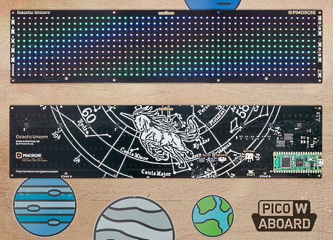](https://shop.pimoroni.com/products/galactic-unicorn?variant=40057440960595)

Galactic Unicorn is a huge, densely packed, programmable 53 x 11 LED matrix / sign from Pimoroni with wireless connectivity and oodles of extras - [Pimoroni](https://shop.pimoroni.com/products/galactic-unicorn?variant=40057440960595).

text - [site](url).

## New Boards Supported by CircuitPython

The number of supported microcontrollers and Single Board Computers (SBC) grows every week. This section outlines which boards have been included in CircuitPython or added to [CircuitPython.org](https://circuitpython.org/).

This week, there were (#/no) new boards added!

- [Board name](url)
- [Board name](url)
- [Board name](url)

*Note: For non-Adafruit boards, please use the support forums of the board manufacturer for assistance, as Adafruit does not have the hardware to assist in troubleshooting.*

Looking to add a new board to CircuitPython? It's highly encouraged! Adafruit has four guides to help you do so:

- [How to Add a New Board to CircuitPython](https://learn.adafruit.com/how-to-add-a-new-board-to-circuitpython/overview)
- [How to add a New Board to the circuitpython.org website](https://learn.adafruit.com/how-to-add-a-new-board-to-the-circuitpython-org-website)
- [Adding a Single Board Computer to PlatformDetect for Blinka](https://learn.adafruit.com/adding-a-single-board-computer-to-platformdetect-for-blinka)
- [Adding a Single Board Computer to Blinka](https://learn.adafruit.com/adding-a-single-board-computer-to-blinka)

## New Learn Guides!

[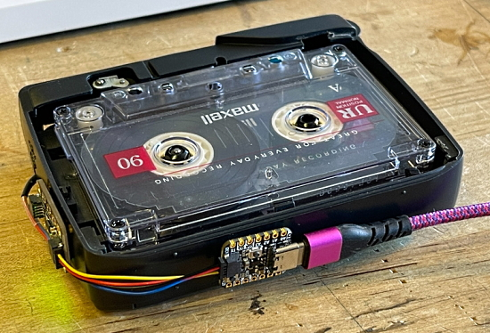](https://learn.adafruit.com/guides/latest)

[Walkmellotron: Cassette Player Mods](https://learn.adafruit.com/walkmellotron) from [John Park](https://learn.adafruit.com/u/johnpark)

## CircuitPython Libraries!

CircuitPython support for hardware continues to grow. We are adding support for new sensors and breakouts all the time, as well as improving on the drivers we already have. As we add more libraries and update current ones, you can keep up with all the changes right here!

For the latest libraries, download the [Adafruit CircuitPython Library Bundle](https://circuitpython.org/libraries). For the latest community contributed libraries, download the [CircuitPython Community Bundle](https://github.com/adafruit/CircuitPython_Community_Bundle/releases).

If you'd like to contribute, CircuitPython libraries are a great place to start. Have an idea for a new driver? File an issue on [CircuitPython](https://github.com/adafruit/circuitpython/issues)! Have you written a library you'd like to make available? Submit it to the [CircuitPython Community Bundle](https://github.com/adafruit/CircuitPython_Community_Bundle). Interested in helping with current libraries? Check out the [CircuitPython.org Contributing page](https://circuitpython.org/contributing). We've included open pull requests and issues from the libraries, and details about repo-level issues that need to be addressed. We have a guide on [contributing to CircuitPython with Git and GitHub](https://learn.adafruit.com/contribute-to-circuitpython-with-git-and-github) if you need help getting started. You can also find us in the #circuitpython channels on the [Adafruit Discord](https://adafru.it/discord).

You can check out this [list of all the Adafruit CircuitPython libraries and drivers available](https://github.com/adafruit/Adafruit_CircuitPython_Bundle/blob/master/circuitpython_library_list.md). 

The current number of CircuitPython libraries is **357**!

**Updated Libraries!**

Here's this week's updated CircuitPython libraries:

 * [Adafruit_CircuitPython_RSA](https://github.com/adafruit/Adafruit_CircuitPython_RSA)
 * [Adafruit_CircuitPython_hashlib](https://github.com/adafruit/Adafruit_CircuitPython_hashlib)
 * [Adafruit_CircuitPython_NeoTrellis](https://github.com/adafruit/Adafruit_CircuitPython_NeoTrellis)
 * [Adafruit_CircuitPython_Display_Shapes](https://github.com/adafruit/Adafruit_CircuitPython_Display_Shapes)
 * [Adafruit_CircuitPython_AW9523](https://github.com/adafruit/Adafruit_CircuitPython_AW9523)
 * [Adafruit_CircuitPython_GC_IOT_Core](https://github.com/adafruit/Adafruit_CircuitPython_GC_IOT_Core)
 * [Adafruit_CircuitPython_DPS310](https://github.com/adafruit/Adafruit_CircuitPython_DPS310)
 * [Adafruit_CircuitPython_PortalBase](https://github.com/adafruit/Adafruit_CircuitPython_PortalBase)

## What’s the team up to this week?

What is the team up to this week? Let’s check in!

**Dan**

I'm continuing to work on porting CircuitPython to plain ESP32 (no suffIx) processors. The first target is the new Feather ESP32 V2 board.

The ESP32 doesn't have native USB, but ESP32 boards often include a serial-to-USB converter chip, connected to a UART on the ESP32. This is also true of ESP32-C3 and the micro:bit nRF boards. I refactored the serial support used on those boards to be more general, and now I've made the REPL available via this USB serial connection. I'll be testing the other functionality of Feather ESP32 board.

**Kattni**

This week I worked on a guide for a GitHub Actions status tower light. It uses a USB-controlled tower light to show the status of your latest Actions run on a repo you specify. I also included files for a 3D printed stand to bolt onto the bottom to make the light more stable. Guide should be out soon, so keep an eye out for that!

**Tim**

I worked on writing classes to show and animate sprites for a PyGamer port of an old Nintendo Game & Watch handheld game called Octopus. I've also cut out, scaled, re-packed, and prepared all the bitmap assets for the game. I reviewed a few typing  PRs. I made a pass through the github workflow status script I wrote recently to add more thorough documentation and assisted Kattni in understanding it so it can be written up for a Learn Guide. 

**Scott**

This week I polished up my web workflow code and [sent it out for review](https://github.com/adafruit/circuitpython/pull/6528). It will enable file editing through a web server presented by CircuitPython.

In the interim I fixed a couple bugs including a crash on ESP32-S3 that was introduced with my auto-wifi work.

Yesterday I began work on adding a WebSocket url to the server that will allow interacting with the serial connection to CircuitPython. I'll continue that work in addition to responding to review comments on the first PR.

**Liz**

This week I worked on a [Cassette Mod guide with JP](https://learn.adafruit.com/walkmellotron) and [an updated STEMMA guide](https://learn.adafruit.com/adafruit-4-channel-adc-breakouts) for the ADS1115 and ADS1015 ADC boards. JP and I worked on two different ways to use CircuitPython to modify cassette players. My mod is the more chaotic of the two and uses an L9110 motor driver with a potentiometer to control the speed and direction.

This coming week I'll be working on a project with the NAU7802 STEMMA board to create a food scale. A container will sit on a platform and its weight will be measured by a strain gauge. I'll also be using an alphanumeric display for the GUI. 

## Upcoming events!

The next MicroPython Meetup in Melbourne will be on July 27th – [Meetup](https://www.meetup.com/MicroPython-Meetup/). See the [slides](https://docs.google.com/presentation/d/e/2PACX-1vROLMO--AXdxJTwvsxFbZqIGFAHVbm9YF_AJdVLdHqrjB0C7FJEgNm5QS27PKLvQSO0y3Do74Wlsn2F/pub?start=false&loop=false&delayms=3000&slide=id.p) of the May 25th meeting.

SciPy 2022, the 21st annual Scientific Computing with Python conference, will be held in Austin, Texas, USA from July 11-17, 2022. The annual SciPy Conference brings together attendees from industry, academia, and government to showcase their latest projects, learn from skilled users and developers, and collaborate on code development. The full program will consist of 2 days tutorials (July 11-12), 3 days of talks (July 13-15) and 2 days of developer sprints (July 16-17) - [SciPy 2022](https://www.scipy2022.scipy.org/).

EuroPython 2022 will be held on 11th-17th July 2022 and it will be both in person and virtual. The in-person conference will be held at [The Convention Centre](https://www.theccd.ie/) Dublin (The CCD) in Dublin, Ireland - [EuroPython 2022](https://ep2022.europython.eu/).

PyOhio is a non-profit annual Python community conference usually held in Columbus, OH. It is being held online starting Saturday, July 30, 2022. It is free to attend and welcomes anyone with an interest in Python. Content ranges from beginner to advanced and is intended to be relevant to all types of Python users: students, software professionals, scientists, hobbyists, and anyone looking to learn more - [PyOhio](https://www.pyohio.org/2022/).

**Send Your Events In**

As for other events, with the COVID pandemic, most in-person events are postponed or held online. If you know of virtual events or upcoming events, please let us know on Twitter with hashtag #CircuitPython or email to cpnews(at)adafruit(dot)com.

## Latest releases

CircuitPython's stable release is [#.#.#](https://github.com/adafruit/circuitpython/releases/latest) and its unstable release is [#.#.#-##.#](https://github.com/adafruit/circuitpython/releases). New to CircuitPython? Start with our [Welcome to CircuitPython Guide](https://learn.adafruit.com/welcome-to-circuitpython).

[2022####](https://github.com/adafruit/Adafruit_CircuitPython_Bundle/releases/latest) is the latest CircuitPython library bundle.

[v#.#.#](https://micropython.org/download) is the latest MicroPython release. Documentation for it is [here](http://docs.micropython.org/en/latest/pyboard/).

[#.#.#](https://www.python.org/downloads/) is the latest Python release. The latest pre-release version is [#.#.#](https://www.python.org/download/pre-releases/).

[#,### Stars](https://github.com/adafruit/circuitpython/stargazers) Like CircuitPython? [Star it on GitHub!](https://github.com/adafruit/circuitpython)

## Call for help -- Translating CircuitPython is now easier than ever!

One important feature of CircuitPython is translated control and error messages. With the help of fellow open source project [Weblate](https://weblate.org/), we're making it even easier to add or improve translations. 

Sign in with an existing account such as GitHub, Google or Facebook and start contributing through a simple web interface. No forks or pull requests needed! As always, if you run into trouble join us on [Discord](https://adafru.it/discord), we're here to help.

## jobs.adafruit.com - Find a dream job, find great candidates!

[jobs.adafruit.com](https://jobs.adafruit.com/) has returned and folks are posting their skills (including CircuitPython) and companies are looking for talented makers to join their companies - from Digi-Key, to Hackaday, Micro Center, Raspberry Pi and more.

**Job of the Week**

text - [Adafruit Jobs Board](https://jobs.adafruit.com/).

## NUMBER thanks!

The Adafruit Discord community, where we do all our CircuitPython development in the open, reached over NUMBER humans - thank you!  Adafruit believes Discord offers a unique way for Python on hardware folks to connect. Join today at [https://adafru.it/discord](https://adafru.it/discord).

## ICYMI - In case you missed it

Python on hardware is the Adafruit Python video-newsletter-podcast! The news comes from the Python community, Discord, Adafruit communities and more and is broadcast on ASK an ENGINEER Wednesdays. The complete Python on Hardware weekly videocast [playlist is here](https://www.youtube.com/playlist?list=PLjF7R1fz_OOXRMjM7Sm0J2Xt6H81TdDev). The video podcast is on [iTunes](https://itunes.apple.com/us/podcast/python-on-hardware/id1451685192?mt=2), [YouTube](http://adafru.it/pohepisodes), [IGTV (Instagram TV](https://www.instagram.com/adafruit/channel/)), and [XML](https://itunes.apple.com/us/podcast/python-on-hardware/id1451685192?mt=2).

[The weekly community chat on Adafruit Discord server CircuitPython channel - Audio / Podcast edition](https://itunes.apple.com/us/podcast/circuitpython-weekly-meeting/id1451685016) - Audio from the Discord chat space for CircuitPython, meetings are usually Mondays at 2pm ET, this is the audio version on [iTunes](https://itunes.apple.com/us/podcast/circuitpython-weekly-meeting/id1451685016), Pocket Casts, [Spotify](https://adafru.it/spotify), and [XML feed](https://adafruit-podcasts.s3.amazonaws.com/circuitpython_weekly_meeting/audio-podcast.xml).

## Codecademy "Learn Hardware Programming with CircuitPython"

Codecademy, an online interactive learning platform used by more than 45 million people, has teamed up with Adafruit to create a coding course, “Learn Hardware Programming with CircuitPython”. The course is now available in the [Codecademy catalog](https://www.codecademy.com/learn/learn-circuitpython?utm_source=adafruit&utm_medium=partners&utm_campaign=circuitplayground&utm_content=pythononhardwarenewsletter).

## Contribute!

The CircuitPython Weekly Newsletter is a CircuitPython community-run newsletter emailed every Tuesday. The complete [archives are here](https://www.adafruitdaily.com/category/circuitpython/). It highlights the latest CircuitPython related news from around the web including Python and MicroPython developments. To contribute, edit next week's draft [on GitHub](https://github.com/adafruit/circuitpython-weekly-newsletter/tree/gh-pages/_drafts) and [submit a pull request](https://help.github.com/articles/editing-files-in-your-repository/) with the changes. You may also tag your information on Twitter with #CircuitPython. 

Join the Adafruit [Discord](https://adafru.it/discord) or [post to the forum](https://forums.adafruit.com/viewforum.php?f=60) if you have questions.
